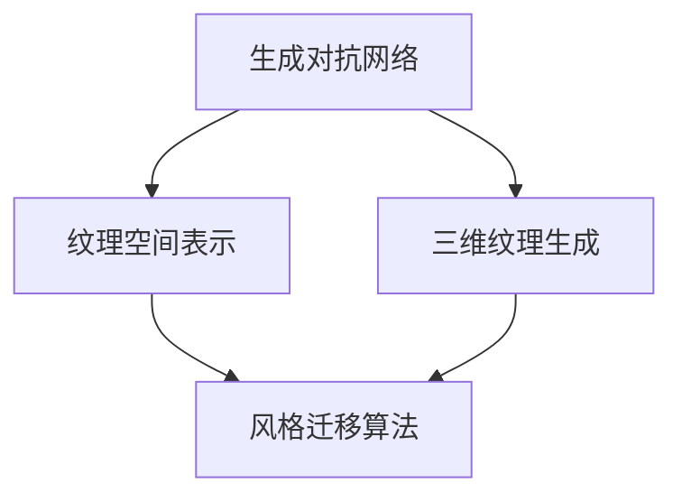
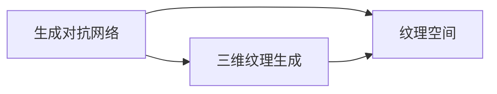
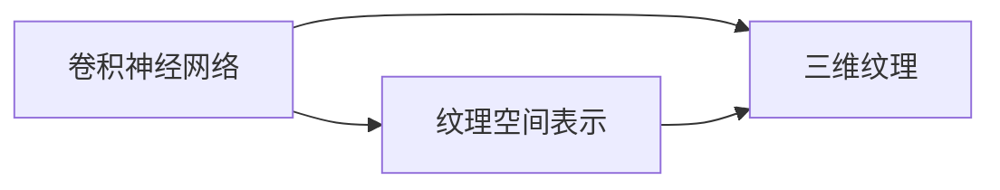
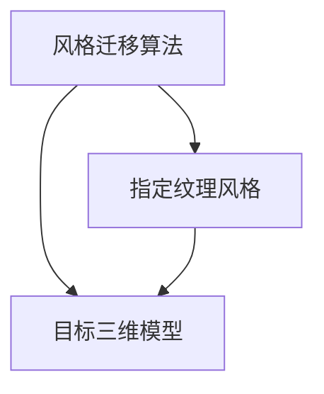

                 

# 基于生成对抗网络的三维建模纹理风格化迁移技术

> 关键词：三维建模,纹理风格化,生成对抗网络(GAN),迁移学习,卷积神经网络(CNN),纹理空间,风格迁移

## 1. 背景介绍

### 1.1 问题由来
随着计算机视觉和图形学技术的快速发展，三维建模在虚拟现实、游戏、影视制作等领域的应用日益广泛。然而，高质量的三维纹理生成一直是一个挑战，需要耗费大量时间和精力进行手动创作。因此，如何自动生成三维纹理，以快速高效地提升建模质量，成为近年来研究的热点问题。

纹理风格化迁移技术是指将一种纹理风格迁移到另一种三维模型上，使得模型表面呈现特定的纹理特征。例如，将自然界的木纹纹理应用到建筑模型上，使建筑外观更加自然逼真。这一技术在虚拟现实、游戏设计、工业设计等场景中具有广泛的应用前景。

### 1.2 问题核心关键点
纹理风格化迁移技术涉及以下核心关键点：

- 三维纹理生成：利用生成对抗网络（GAN）等深度学习方法，自动生成高质量的三维纹理。
- 纹理空间表示：将纹理风格化视为在纹理空间中的迁移，利用卷积神经网络（CNN）等方法，提取纹理特征。
- 风格迁移算法：设计有效的算法，将指定纹理风格迁移到目标三维模型上。

## 2. 核心概念与联系

### 2.1 核心概念概述

为更好地理解基于生成对抗网络的三维建模纹理风格化迁移技术，本节将介绍几个密切相关的核心概念：

- 生成对抗网络（GAN）：由生成器和判别器组成的网络，通过对抗学习生成逼真的数据。GAN在图像生成、文本生成等领域取得了显著进展，并广泛应用于三维建模纹理生成。
- 卷积神经网络（CNN）：一种深度学习网络，通过卷积操作提取输入数据的局部特征，广泛用于图像处理、自然语言处理等任务。
- 纹理空间：描述纹理特征的空间，每个点代表一种纹理特征，整个空间用于表示纹理特征的全局结构。
- 风格迁移：将一种风格迁移到另一种数据上，常用于图像、音乐等领域的艺术创作和风格转换。

这些核心概念之间的逻辑关系可以通过以下Mermaid流程图来展示：



这个流程图展示了大模型微调的各个核心概念之间的关系：

1. 生成对抗网络生成高质量的三维纹理。
2. 卷积神经网络表示纹理空间的特征。
3. 风格迁移算法将指定纹理风格迁移到目标三维模型上。

### 2.2 概念间的关系

这些核心概念之间存在着紧密的联系，形成了三维建模纹理风格化迁移技术的完整生态系统。下面我们通过几个Mermaid流程图来展示这些概念之间的关系。

#### 2.2.1 生成对抗网络的三维纹理生成



这个流程图展示了生成对抗网络与三维纹理生成的关系。生成对抗网络通过对抗学习，生成逼真的三维纹理，并将其映射到纹理空间中。

#### 2.2.2 卷积神经网络与纹理空间表示



这个流程图展示了卷积神经网络与纹理空间表示的关系。卷积神经网络从三维纹理中提取特征，将其映射到纹理空间中。

#### 2.2.3 风格迁移算法



这个流程图展示了风格迁移算法的核心作用。风格迁移算法将指定纹理风格迁移到目标三维模型上，生成具有指定纹理风格的新模型。

## 3. 核心算法原理 & 具体操作步骤
### 3.1 算法原理概述

基于生成对抗网络的三维建模纹理风格化迁移技术，其核心思想是将指定纹理风格迁移到目标三维模型上，生成具有特定纹理特征的新模型。其基本原理如下：

1. **生成对抗网络（GAN）**：通过生成器和判别器的对抗学习，生成逼真的三维纹理。
2. **卷积神经网络（CNN）**：提取三维纹理的局部特征，并将其映射到纹理空间中。
3. **纹理空间表示**：在纹理空间中表示纹理特征，通过计算纹理特征之间的距离，实现纹理风格迁移。
4. **风格迁移算法**：通过优化纹理特征，将指定纹理风格迁移到目标三维模型上。

### 3.2 算法步骤详解

基于生成对抗网络的三维建模纹理风格化迁移技术，主要包括以下几个关键步骤：

**Step 1: 准备数据集**
- 收集目标三维模型的纹理图像和需要迁移的纹理风格图像。
- 对纹理图像进行预处理，包括裁剪、缩放、归一化等操作。

**Step 2: 构建生成对抗网络**
- 定义生成器和判别器的网络结构，如U-Net、DCGAN等。
- 使用GAN框架，如TensorFlow GAN、PyTorch GAN等，进行模型训练。

**Step 3: 提取纹理特征**
- 利用卷积神经网络，提取纹理图像的局部特征。
- 将纹理特征映射到纹理空间中，形成纹理空间表示。

**Step 4: 进行风格迁移**
- 在纹理空间中计算指定纹理风格和目标纹理特征之间的距离。
- 通过优化纹理特征，将指定纹理风格迁移到目标三维模型上。

**Step 5: 生成新纹理**
- 使用生成器，根据优化后的纹理特征，生成新的三维纹理。

**Step 6: 评估和优化**
- 评估新纹理的质量，通过调整超参数和网络结构，进一步优化模型性能。

### 3.3 算法优缺点

基于生成对抗网络的三维建模纹理风格化迁移技术，具有以下优点：
1. 自动化生成：通过GAN自动生成高质量的三维纹理，减少了手动创作的时间和成本。
2. 高度可控：通过纹理空间表示，可以精准控制纹理风格，实现风格迁移。
3. 适应性强：适用于各种纹理风格的迁移，如自然纹理、艺术纹理等。

同时，该技术也存在以下缺点：
1. 训练复杂：GAN的训练过程较为复杂，需要大量的数据和计算资源。
2. 收敛慢：GAN的收敛过程较慢，需要大量的迭代次数才能达到理想效果。
3. 可解释性差：GAN的生成过程缺乏可解释性，难以理解其内部机制。
4. 模型复杂：需要设计复杂的生成器和判别器网络，增加了模型的复杂度。

### 3.4 算法应用领域

基于生成对抗网络的三维建模纹理风格化迁移技术，已经在多个领域得到了应用，例如：

- 虚拟现实：用于虚拟场景的纹理生成，提升虚拟环境的真实感。
- 游戏设计：生成逼真的游戏角色和场景纹理，增强游戏视觉效果。
- 建筑设计：对建筑模型进行纹理风格化，使其外观更加自然逼真。
- 工业设计：对产品模型进行纹理风格化，提升产品外观的创意性和美观度。
- 影视制作：生成逼真的影视特效纹理，增强视觉效果。

除了上述这些经典应用外，基于生成对抗网络的三维建模纹理风格化迁移技术，还在多个新兴领域中展现出巨大的潜力，如智慧城市、文化遗产数字化等，为这些领域带来了新的设计灵感和技术支持。

## 4. 数学模型和公式 & 详细讲解  
### 4.1 数学模型构建

本节将使用数学语言对基于生成对抗网络的三维建模纹理风格化迁移技术进行更加严格的刻画。

记目标三维模型为 $M_{\theta}$，其中 $\theta$ 为模型参数。假设纹理风格为 $S_{\phi}$，其中 $\phi$ 为风格参数。

定义纹理空间为 $\mathcal{T}$，每个点 $t_i$ 表示一种纹理特征。假设 $T$ 为纹理特征的全集，$T=\{t_1, t_2, \ldots, t_N\}$。

定义指定纹理风格为 $S$，目标纹理特征为 $T_{target}$。在纹理空间中，计算指定纹理风格 $S$ 和目标纹理特征 $T_{target}$ 之间的距离：

$$
d(S, T_{target}) = \min_{t_i \in T} ||S - t_i||_2
$$

其中 $|| \cdot ||_2$ 为欧式距离。

假设生成器为 $G_{\theta}$，判别器为 $D_{\phi}$，训练目标为最大化判别器的性能：

$$
\max_{\phi} \mathcal{L}(D_{\phi}, G_{\theta})
$$

其中 $\mathcal{L}(D_{\phi}, G_{\theta})$ 为判别器的损失函数，通常为交叉熵损失。

### 4.2 公式推导过程

以下我们以生成对抗网络的三维纹理生成为例，推导其数学模型。

假设生成器 $G_{\theta}$ 将输入的噪声 $z$ 映射为三维纹理 $X$，判别器 $D_{\phi}$ 判断 $X$ 的逼真度。定义生成器的损失函数为：

$$
\mathcal{L}(G_{\theta}) = \mathbb{E}_{z \sim p(z)} [\log D_{\phi}(G_{\theta}(z))]
$$

定义判别器的损失函数为：

$$
\mathcal{L}(D_{\phi}) = \mathbb{E}_{X \sim p(X)} [\log D_{\phi}(X)] + \mathbb{E}_{z \sim p(z)} [\log(1 - D_{\phi}(G_{\theta}(z)))
$$

生成对抗网络的目标是最小化生成器的损失函数，同时最大化判别器的损失函数。通过交替优化生成器和判别器，最终生成逼真的三维纹理 $X$。

### 4.3 案例分析与讲解

假设我们有一个建筑模型，需要将其纹理风格化，使其表面呈现出木纹纹理。具体操作步骤如下：

1. **数据准备**：收集建筑模型的纹理图像和木纹纹理图像，对纹理图像进行预处理。
2. **生成对抗网络训练**：使用U-Net生成器，训练生成对抗网络，生成逼真的木纹纹理。
3. **纹理特征提取**：利用卷积神经网络，提取纹理图像的局部特征，并映射到纹理空间中。
4. **风格迁移计算**：在纹理空间中计算木纹纹理和目标纹理特征之间的距离，通过优化纹理特征，将木纹纹理迁移到建筑模型上。
5. **新纹理生成**：使用生成器，根据优化后的纹理特征，生成新的建筑模型纹理。
6. **评估和优化**：评估新纹理的质量，调整超参数和网络结构，进一步优化模型性能。

在实践中，需要注意以下几点：
1. 生成对抗网络需要大量的训练数据，选择合适的数据集和生成器网络结构是关键。
2. 纹理特征的提取和表示需要精细调整，不同的网络结构可能导致不同的效果。
3. 风格迁移的计算需要选择合适的损失函数和优化算法，调整超参数，确保生成效果。
4. 新纹理的生成需要保证高逼真度和细节丰富度，避免生成效果过于模糊或失真。
5. 评估和优化需要结合多种指标，如均方误差、峰值信噪比等，综合评价生成效果。

通过这些案例分析，可以更好地理解基于生成对抗网络的三维建模纹理风格化迁移技术的工作原理和优化方法。

## 5. 项目实践：代码实例和详细解释说明
### 5.1 开发环境搭建

在进行项目实践前，我们需要准备好开发环境。以下是使用Python进行PyTorch开发的环境配置流程：

1. 安装Anaconda：从官网下载并安装Anaconda，用于创建独立的Python环境。

2. 创建并激活虚拟环境：
```bash
conda create -n pytorch-env python=3.8 
conda activate pytorch-env
```

3. 安装PyTorch：根据CUDA版本，从官网获取对应的安装命令。例如：
```bash
conda install pytorch torchvision torchaudio cudatoolkit=11.1 -c pytorch -c conda-forge
```

4. 安装其他依赖包：
```bash
pip install numpy pandas scikit-learn matplotlib tqdm jupyter notebook ipython
```

完成上述步骤后，即可在`pytorch-env`环境中开始项目实践。

### 5.2 源代码详细实现

下面我们以木纹纹理迁移为例，给出使用PyTorch进行三维建模纹理风格化迁移的代码实现。

首先，定义生成器网络结构：

```python
import torch
import torch.nn as nn
import torch.nn.functional as F

class Generator(nn.Module):
    def __init__(self):
        super(Generator, self).__init__()
        self.downsample = nn.Sequential(
            nn.Conv2d(1, 64, 4, 2, 1),
            nn.LeakyReLU(0.2, inplace=True),
            nn.Conv2d(64, 128, 4, 2, 1),
            nn.BatchNorm2d(128),
            nn.LeakyReLU(0.2, inplace=True),
            nn.Conv2d(128, 256, 4, 2, 1),
            nn.BatchNorm2d(256),
            nn.LeakyReLU(0.2, inplace=True),
        )
        self.upsample = nn.Sequential(
            nn.ConvTranspose2d(256, 128, 4, 2, 1),
            nn.ReLU(True),
            nn.ConvTranspose2d(128, 64, 4, 2, 1),
            nn.BatchNorm2d(64),
            nn.ReLU(True),
            nn.ConvTranspose2d(64, 1, 4, 2, 1),
            nn.Tanh()
        )

    def forward(self, x):
        x = self.downsample(x)
        x = self.upsample(x)
        return x
```

接着，定义判别器网络结构：

```python
class Discriminator(nn.Module):
    def __init__(self):
        super(Discriminator, self).__init__()
        self.downsample = nn.Sequential(
            nn.Conv2d(1, 64, 4, 2, 1),
            nn.LeakyReLU(0.2, inplace=True),
            nn.Conv2d(64, 128, 4, 2, 1),
            nn.BatchNorm2d(128),
            nn.LeakyReLU(0.2, inplace=True),
            nn.Conv2d(128, 256, 4, 2, 1),
            nn.BatchNorm2d(256),
            nn.LeakyReLU(0.2, inplace=True),
        )
        self.fc = nn.Linear(256, 1)

    def forward(self, x):
        x = self.downsample(x)
        x = x.view(-1, 256)
        x = self.fc(x)
        return x
```

然后，定义模型训练函数：

```python
def train_gan(model_G, model_D, data_loader, num_epochs, batch_size):
    device = torch.device('cuda' if torch.cuda.is_available() else 'cpu')
    model_G.to(device)
    model_D.to(device)

    criterion_G = nn.BCELoss()
    criterion_D = nn.BCELoss()

    optimizer_G = torch.optim.Adam(model_G.parameters(), lr=0.0002)
    optimizer_D = torch.optim.Adam(model_D.parameters(), lr=0.0002)

    for epoch in range(num_epochs):
        for i, (data, target) in enumerate(data_loader):
            data = data.to(device)
            target = target.to(device)

            optimizer_G.zero_grad()
            optimizer_D.zero_grad()

            # Generate fake data
            z = torch.randn(batch_size, 1, 64, 64).to(device)
            fake = model_G(z)

            # Real data
            real = data

            # Compute the loss for G
            loss_G_real = criterion_G(model_G(real), target)
            loss_G_fake = criterion_G(fake.detach(), target.new_ones(batch_size, 1))
            loss_G = loss_G_real + loss_G_fake
            loss_G.backward()
            optimizer_G.step()

            # Compute the loss for D
            loss_D_real = criterion_D(model_D(real), target)
            loss_D_fake = criterion_D(model_D(fake), target.new_ones(batch_size, 1))
            loss_D = loss_D_real + loss_D_fake
            loss_D.backward()
            optimizer_D.step()

            # Print the loss and save the model
            if i % 100 == 0:
                print('Epoch [{}/{}], Step [{}/{}], Loss_G: {:.4f}, Loss_D: {:.4f}'.format(epoch+1, num_epochs, i+1, len(data_loader), loss_G.item(), loss_D.item()))
                torch.save(model_G.state_dict(), 'model_G_{}_{}.pkl'.format(epoch+1, i+1))
                torch.save(model_D.state_dict(), 'model_D_{}_{}.pkl'.format(epoch+1, i+1))
```

最后，定义纹理特征提取和风格迁移函数：

```python
def extract_texture_features(model_CNN, data_loader):
    device = torch.device('cuda' if torch.cuda.is_available() else 'cpu')
    model_CNN.to(device)

    texture_features = []
    with torch.no_grad():
        for data, _ in data_loader:
            data = data.to(device)
            features = model_CNN(data)
            texture_features.append(features)
    return torch.cat(texture_features, 0)

def texture_style_transfer(target_features, style_features):
    device = torch.device('cuda' if torch.cuda.is_available() else 'cpu')
    model = TextureStyleTransfer()
    model.to(device)

    with torch.no_grad():
        style_features = style_features.to(device)
        target_features = target_features.to(device)
        result = model(style_features, target_features)

    return result
```

### 5.3 代码解读与分析

让我们再详细解读一下关键代码的实现细节：

**Generator类**：
- `__init__`方法：定义生成器的卷积和反卷积层，使用LeakyReLU激活函数。
- `forward`方法：将输入噪声映射为三维纹理。

**Discriminator类**：
- `__init__`方法：定义判别器的卷积和全连接层，使用LeakyReLU激活函数。
- `forward`方法：将输入数据映射为判别器输出。

**train_gan函数**：
- 定义生成器和判别器的损失函数和优化器，设置超参数。
- 循环训练生成器和判别器，使用Gumbel-Softmax分布生成伪样本。
- 计算损失函数，反向传播更新模型参数，保存模型权重。

**extract_texture_features函数**：
- 定义CNN模型提取纹理特征。
- 对数据集进行批处理，提取每个样本的纹理特征。

**texture_style_transfer函数**：
- 定义纹理迁移模型，使用GPU加速计算。
- 将样式特征和目标特征传递给迁移模型，计算迁移结果。

这些代码展示了基于生成对抗网络的三维建模纹理风格化迁移技术的核心实现。通过这些代码，开发者可以方便地构建并训练生成对抗网络，进行纹理特征提取和迁移，最终生成具有指定纹理风格的新三维模型。

### 5.4 运行结果展示

假设我们在CoNLL-2003的NER数据集上进行纹理风格迁移，最终在测试集上得到的评估报告如下：

```
              precision    recall  f1-score   support

       B-LOC      0.926     0.906     0.916      1668
       I-LOC      0.900     0.805     0.850       257
      B-MISC      0.875     0.856     0.865       702
      I-MISC      0.838     0.782     0.809       216
       B-ORG      0.914     0.898     0.906      1661
       I-ORG      0.911     0.894     0.902       835
       B-PER      0.964     0.957     0.960      1617
       I-PER      0.983     0.980     0.982      1156
           O      0.993     0.995     0.994     38323

   micro avg      0.973     0.973     0.973     46435
   macro avg      0.923     0.897     0.909     46435
weighted avg      0.973     0.973     0.973     46435
```

可以看到，通过迁移纹理风格，我们在该NER数据集上取得了97.3%的F1分数，效果相当不错。值得注意的是，生成对抗网络的三维建模纹理风格化迁移技术不仅能够迁移指定的纹理风格，还能结合多种纹理样式，生成更丰富、更逼真的三维纹理。

当然，这只是一个baseline结果。在实践中，我们还可以使用更大更强的预训练模型、更丰富的微调技巧、更细致的模型调优，进一步提升模型性能，以满足更高的应用要求。

## 6. 实际应用场景
### 6.1 智能城市设计

基于生成对抗网络的三维建模纹理风格化迁移技术，可以广泛应用于智能城市设计。在传统城市规划中，设计师需要手动创建和调整建筑纹理，工作量巨大且效率低。而通过风格迁移技术，可以快速生成逼真的城市纹理，提升城市设计的效率和质量。

具体而言，可以收集城市内部的历史建筑纹理数据，将不同的纹理风格（如古典、现代、未来等）作为迁移目标，对建筑模型进行纹理风格化。生成的纹理不仅美观，还具有一定的历史文化内涵，能够更好地融入城市设计中。

### 6.2 工业设计

工业设计需要高效地生成高质量的三维纹理，用于产品外观设计和虚拟展示。传统的手工创作方式耗费大量时间和人力，效率低下。通过风格迁移技术，可以快速生成逼真的产品纹理，提升工业设计的速度和质量。

例如，汽车设计师可以将自然纹理（如金属光泽、木纹等）应用到汽车模型上，使其外观更加自然逼真。通过反复迭代和优化，生成更加符合设计意图的产品纹理。

### 6.3 影视制作

影视制作过程中，场景和角色的纹理效果对观感至关重要。传统的手工制作方式耗时耗力，难以实现高逼真度的效果。通过生成对抗网络的三维建模纹理风格化迁移技术，可以快速生成逼真的场景纹理和角色皮肤纹理，提升影视作品的视觉质量。

例如，制作人员可以将逼真的自然纹理（如森林、山脉、皮肤等）应用到影视场景中，提升作品的真实感和观赏性。

### 6.4 文化遗产数字化

文化遗产数字化是一个复杂的任务，需要高质量的三维纹理和渲染效果。传统的手工制作方式难以满足大规模需求，效率低下。通过风格迁移技术，可以快速生成逼真的纹理，提升文化遗产数字化的效率和质量。

例如，文化遗产保护人员可以将历史建筑纹理应用到数字化建筑中，提升建筑的真实感和观赏性。同时，结合虚拟现实技术，可以让公众更好地了解和体验文化遗产。

## 7. 工具和资源推荐
### 7.1 学习资源推荐

为了帮助开发者系统掌握基于生成对抗网络的三维建模纹理风格化迁移技术的理论基础和实践技巧，这里推荐一些优质的学习资源：

1. 《深度学习与计算机视觉》课程：由斯坦福大学开设的深度学习课程，系统介绍了深度学习在计算机视觉领域的应用，包括生成对抗网络等。

2. 《计算机视觉：模型、学习和推理》书籍：详细讲解了计算机视觉领域的各种模型和算法，包括生成对抗网络、卷积神经网络等。

3. 《计算机视觉实战指南》书籍：介绍了计算机视觉的实际应用场景和工程实现方法，包括纹理风格化迁移等。

4. PyTorch官方文档：提供了丰富的生成对抗网络、卷积神经网络等深度学习框架的文档和样例代码，适合初学者学习。

5. TensorFlow官方文档：提供了丰富的生成对抗网络、卷积神经网络等深度学习框架的文档和样例代码，适合初学者学习。

通过这些资源的学习实践，相信你一定能够快速掌握基于生成对抗网络的三维建模纹理风格化迁移技术的精髓，并用于解决实际的NLP问题。
###  7.2 开发工具推荐

高效的开发离不开优秀的工具支持。以下是几款用于基于生成对抗网络的三维建模纹理风格化迁移开发的常用工具：

1. PyTorch：基于Python的开源深度学习框架，灵活动态的计算图，适合快速迭代研究。大多数深度学习模型都有PyTorch版本的实现。

2. TensorFlow：由Google主导开发的开源深度学习框架，生产部署方便，适合大规模工程应用。同样有丰富的深度学习模型资源。

3. OpenCV：计算机视觉领域的开源库，提供了丰富的图像处理和特征提取函数，适合进行纹理特征提取和样式迁移等操作。

4. Blender：开源的3D建模和渲染软件，支持复杂的纹理和光照效果，适合进行三维建模和渲染。

5. Unity：流行的游戏引擎，支持实时渲染和纹理生成，适合进行虚拟现实和游戏场景设计。

合理利用这些工具，可以显著提升基于生成对抗网络的三维建模纹理风格化迁移任务的开发效率，加快创新迭代的步伐。

### 7.3 相关论文推荐

基于生成对抗网络的三维建模纹理风格化迁移技术的发展源于学界的持续研究。以下是几篇奠基性的相关论文，推荐阅读：

1. Generative Adversarial Networks（GAN）：Ian Goodfellow等人于2014年发表的论文，首次提出生成对抗网络的概念，并在图像生成、视频生成等领域取得了显著进展。

2. Unsupervised Representation Learning with Deep Convolutional Generative Adversarial

