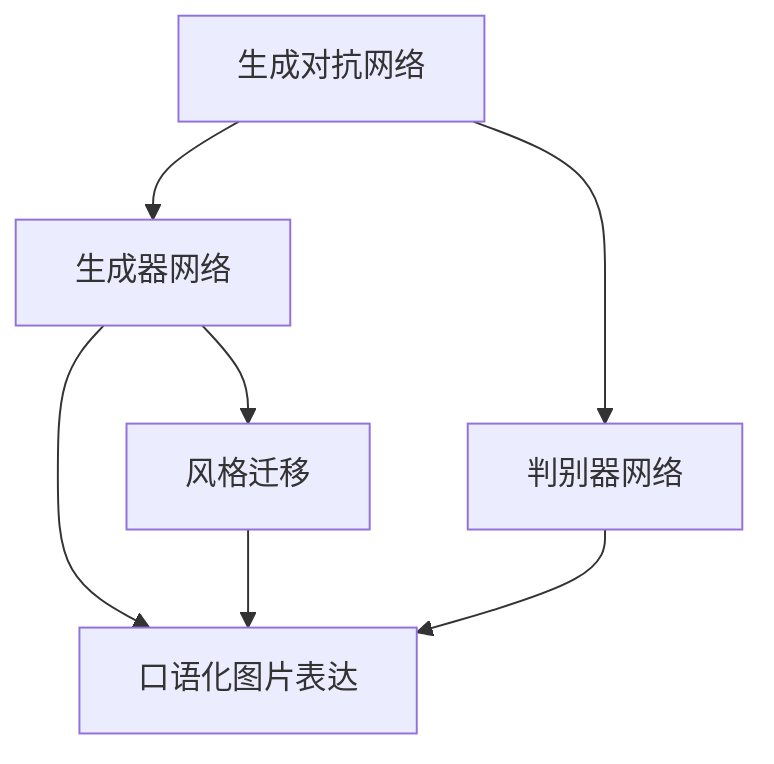
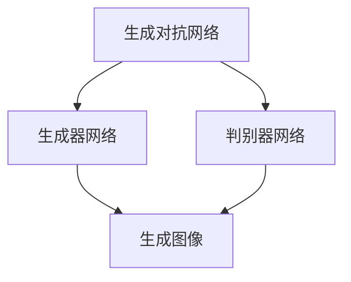
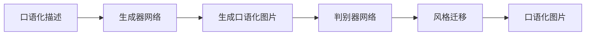
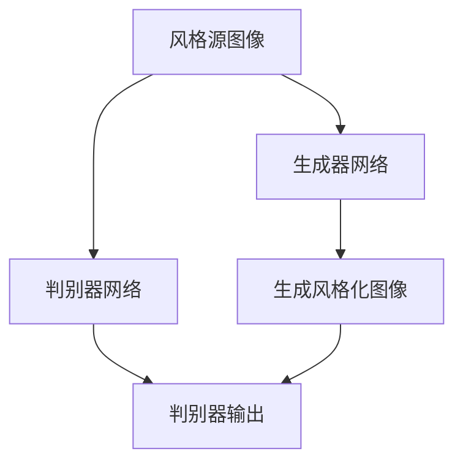
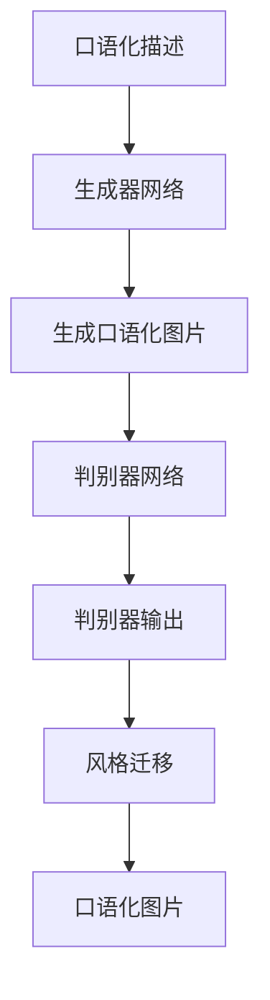

                 

# 基于生成对抗网络的口语化图片表达风格迁移技术

## 1. 背景介绍

在人工智能领域，特别是图像处理和计算机视觉方向，风格迁移（style transfer）技术一直是研究的热点。风格迁移旨在将一张图像的视觉风格（例如画风、色调）迁移到另一张图像上，使得输出图像在视觉感受上接近风格源图像，同时保留输入图像的内容信息。这种技术广泛应用于图像增强、艺术创作、图像修复等多个领域。

近年来，随着深度学习技术的飞速发展，生成对抗网络（Generative Adversarial Networks, GANs）逐渐成为实现风格迁移的主要手段。GANs通过训练一个生成器网络（Generator）和一个判别器网络（Discriminator），使生成器能够生成尽可能逼真的图像，而判别器则试图区分真实图像和生成图像。通过对抗训练，生成器逐渐掌握如何生成风格源图像的视觉风格，从而实现风格迁移。

在口语化图片表达方面，如何将文本信息转换为具有口语化特征的图片，一直是一个未解之谜。口语化图片表达不仅可以帮助人们更加直观地理解复杂的文本信息，还能够提高文本到图像转换（Text-to-Image）的智能化水平。然而，由于语言和视觉之间的本质差异，将口语化表达风格应用于图片生成仍然是一个极具挑战性的问题。

本文将基于生成对抗网络，提出一种新型的口语化图片表达风格迁移技术，旨在解决上述问题。该技术能够将口语化的描述转换为具有口语化特征的图片，从而实现文本到图像的智能化转换。

## 2. 核心概念与联系

### 2.1 核心概念概述

为更好地理解该技术的核心概念，本节将介绍几个关键概念及其相互关系：

- 生成对抗网络（GANs）：由Isola等人在2015年提出的深度学习架构，通过训练一个生成器和一个判别器，使生成器能够生成高质量的图像，而判别器则能够准确区分真实图像和生成图像。
- 风格迁移（Style Transfer）：将一张图像的视觉风格迁移到另一张图像上，使得输出图像在视觉感受上接近风格源图像，同时保留输入图像的内容信息。
- 口语化图片表达（Spoken Language Image Expression）：将口语化的描述转换为具有口语化特征的图片，使得图片能够直观地表达语言信息。
- 生成器网络（Generator Network）：GANs中负责生成图像的神经网络。生成器通过学习大量的图像数据，掌握如何生成高质量的图像。
- 判别器网络（Discriminator Network）：GANs中负责区分真实图像和生成图像的神经网络。判别器通过学习区分真实和虚假的图像，使生成器生成的图像更加逼真。

这些概念之间的逻辑关系可以通过以下Mermaid流程图来展示：



这个流程图展示了大语言模型微调过程中各个概念之间的关系：

1. 生成对抗网络由生成器和判别器组成，共同完成风格迁移任务。
2. 生成器网络负责生成口语化图片，能够将口语化的描述转换为视觉化的图像。
3. 判别器网络用于区分真实图像和生成图像，确保生成器生成的图像逼真。
4. 风格迁移是实现口语化图片表达的关键技术，通过迁移风格源图像的视觉风格，使得口语化图片具备特定的视觉特征。
5. 口语化图片表达是最终目标，通过将口语化的描述转换为具有口语化特征的图片，实现文本到图像的智能化转换。

### 2.2 概念间的关系

这些核心概念之间存在着紧密的联系，形成了口语化图片表达风格迁移技术的完整生态系统。下面我们通过几个Mermaid流程图来展示这些概念之间的关系。

#### 2.2.1 生成对抗网络的基本架构



这个流程图展示了生成对抗网络的基本架构。生成器网络负责生成图像，判别器网络用于区分真实和生成的图像。

#### 2.2.2 口语化图片表达的基本流程



这个流程图展示了口语化图片表达的基本流程。口语化描述作为输入，通过生成器网络生成口语化图片，再由判别器网络进行风格迁移，最终得到具有口语化特征的图片。

#### 2.2.3 风格迁移的具体实现



这个流程图展示了风格迁移的具体实现。风格源图像作为风格迁移的输入，通过生成器网络生成风格化图像，再由判别器网络进行判断，最终得到逼真的风格迁移图像。

### 2.3 核心概念的整体架构

最后，我们用一个综合的流程图来展示这些核心概念在大语言模型微调过程中的整体架构：



这个综合流程图展示了从口语化描述到口语化图片的整个迁移过程。口语化描述通过生成器网络生成口语化图片，再由判别器网络进行风格迁移，最终得到具有口语化特征的图片。

## 3. 核心算法原理 & 具体操作步骤

### 3.1 算法原理概述

基于生成对抗网络的口语化图片表达风格迁移技术，主要包括以下几个关键步骤：

1. **生成器网络训练**：训练一个生成器网络，使其能够将口语化的描述转换为具有口语化特征的图片。
2. **判别器网络训练**：训练一个判别器网络，使其能够区分真实图像和生成图像。
3. **风格迁移训练**：通过训练一个风格迁移网络，将口语化图片表达的风格源图像的视觉风格迁移到目标图像上。
4. **口语化图片生成**：使用训练好的生成器和风格迁移网络，将口语化的描述转换为具有口语化特征的图片。

### 3.2 算法步骤详解

#### 3.2.1 生成器网络训练

生成器网络训练的主要目标是学习如何将口语化的描述转换为高质量的图像。在训练过程中，生成器网络接受口语化描述作为输入，输出对应的口语化图片。生成器网络的输入通常是文本描述，通过文本嵌入层（Text Embedding Layer）将文本转换为高维向量。

具体来说，训练生成器网络的过程如下：

1. **输入文本预处理**：将口语化描述转换为高维向量。
2. **生成口语化图片**：使用生成器网络生成口语化图片。
3. **计算损失函数**：使用判别器网络的输出计算生成器网络的损失函数。
4. **反向传播更新**：根据损失函数梯度更新生成器网络参数。

#### 3.2.2 判别器网络训练

判别器网络训练的主要目标是学习如何区分真实图像和生成图像。在训练过程中，判别器网络接受真实图像和生成图像作为输入，输出对应的真实性概率。

具体来说，训练判别器网络的过程如下：

1. **输入图像预处理**：将真实图像和生成图像转换为高维向量。
2. **计算损失函数**：使用生成器网络的输出计算判别器网络的损失函数。
3. **反向传播更新**：根据损失函数梯度更新判别器网络参数。

#### 3.2.3 风格迁移训练

风格迁移训练的主要目标是学习如何将口语化图片表达的风格源图像的视觉风格迁移到目标图像上。在训练过程中，风格迁移网络接受口语化图片和风格源图像作为输入，输出对应的风格化图像。

具体来说，训练风格迁移网络的过程如下：

1. **输入图像预处理**：将口语化图片和风格源图像转换为高维向量。
2. **生成风格化图像**：使用风格迁移网络生成风格化图像。
3. **计算损失函数**：使用判别器网络的输出计算风格迁移网络的损失函数。
4. **反向传播更新**：根据损失函数梯度更新风格迁移网络参数。

#### 3.2.4 口语化图片生成

口语化图片生成的主要目标是使用训练好的生成器和风格迁移网络，将口语化的描述转换为具有口语化特征的图片。具体来说，口语化图片生成的过程如下：

1. **输入文本预处理**：将口语化描述转换为高维向量。
2. **生成口语化图片**：使用生成器网络生成口语化图片。
3. **应用风格迁移**：使用风格迁移网络将口语化图片表达的风格源图像的视觉风格迁移到目标图像上。

### 3.3 算法优缺点

基于生成对抗网络的口语化图片表达风格迁移技术具有以下优点：

1. **高质量的图像生成**：生成器网络能够生成高质量的图像，使得口语化图片表达更加逼真。
2. **风格迁移效果显著**：判别器网络能够区分真实图像和生成图像，确保风格迁移的效果逼真。
3. **易于扩展**：通过训练不同的生成器和风格迁移网络，可以轻松实现多种风格的口语化图片表达。

同时，该技术也存在以下缺点：

1. **训练复杂度高**：生成器和判别器网络的训练过程复杂，需要大量的计算资源和时间。
2. **图像细节丢失**：在风格迁移过程中，可能会丢失部分图像细节，导致生成的口语化图片不够细致。
3. **模型泛化能力差**：由于模型的训练数据有限，生成的口语化图片可能无法很好地适应不同风格源图像的视觉风格。

### 3.4 算法应用领域

基于生成对抗网络的口语化图片表达风格迁移技术在以下几个领域具有广泛的应用前景：

1. **自然语言处理**：将口语化的描述转换为具有口语化特征的图片，可以用于自然语言理解和生成。
2. **计算机视觉**：在图像分类、目标检测、图像分割等任务中，将口语化的描述转换为具有口语化特征的图片，可以提高模型的智能水平。
3. **艺术创作**：将口语化的描述转换为具有口语化特征的图片，可以用于艺术创作和设计，提高创作效率和质量。
4. **广告设计**：将口语化的描述转换为具有口语化特征的图片，可以用于广告设计，提升广告的吸引力和点击率。
5. **教育培训**：将口语化的描述转换为具有口语化特征的图片，可以用于教育培训，增强教学效果和互动性。

## 4. 数学模型和公式 & 详细讲解 & 举例说明

### 4.1 数学模型构建

基于生成对抗网络的口语化图片表达风格迁移技术的数学模型主要由以下几个部分组成：

1. **生成器网络**：$G: \mathcal{Z} \rightarrow \mathcal{X}$，其中$\mathcal{Z}$表示随机噪声向量，$\mathcal{X}$表示图像空间。
2. **判别器网络**：$D: \mathcal{X} \rightarrow \mathbb{R}$，其中$\mathbb{R}$表示真实性概率。
3. **风格迁移网络**：$S: (\mathcal{X}, \mathcal{Y}) \rightarrow \mathcal{X}$，其中$\mathcal{Y}$表示风格源图像。

### 4.2 公式推导过程

#### 4.2.1 生成器网络训练

生成器网络训练的目标函数可以表示为：

$$
\min_G \mathbb{E}_{z \sim p(z)} [D(G(z))] + \lambda \mathbb{E}_{x \sim p(x)} [\|x - G(x)\|_2^2]
$$

其中，$D(G(z))$表示判别器对生成器生成的图像的输出，$\|x - G(x)\|_2^2$表示生成器输出的图像与真实图像之间的像素级差异。

具体来说，生成器网络的损失函数可以分解为两个部分：

1. **判别器损失**：
$$
\mathbb{E}_{z \sim p(z)} [D(G(z))]
$$
其中，$p(z)$表示随机噪声向量$z$的概率分布。判别器损失用于训练判别器网络，使其能够准确区分真实图像和生成图像。

2. **像素级差异损失**：
$$
\lambda \mathbb{E}_{x \sim p(x)} [\|x - G(x)\|_2^2]
$$
其中，$\lambda$表示像素级差异损失的权重。像素级差异损失用于训练生成器网络，使其生成的图像与真实图像尽可能相似。

#### 4.2.2 判别器网络训练

判别器网络训练的目标函数可以表示为：

$$
\min_D \mathbb{E}_{x \sim p(x)} [D(x)] + \lambda \mathbb{E}_{z \sim p(z)} [D(G(z))]
$$

其中，$D(x)$表示判别器对真实图像的输出，$D(G(z))$表示判别器对生成器生成的图像的输出。

具体来说，判别器网络的损失函数可以分解为两个部分：

1. **真实图像损失**：
$$
\mathbb{E}_{x \sim p(x)} [D(x)]
$$
其中，$p(x)$表示真实图像$x$的概率分布。真实图像损失用于训练判别器网络，使其能够准确区分真实图像。

2. **生成图像损失**：
$$
\lambda \mathbb{E}_{z \sim p(z)} [D(G(z))]
$$
其中，$\lambda$表示生成图像损失的权重。生成图像损失用于训练判别器网络，使其能够准确区分生成图像。

#### 4.2.3 风格迁移训练

风格迁移训练的目标函数可以表示为：

$$
\min_S \mathbb{E}_{(x,y) \sim p(x,y)} [D(S(x,y))] + \lambda \mathbb{E}_{(x,y) \sim p(x,y)} [\|x - S(x,y)\|_2^2]
$$

其中，$S(x,y)$表示风格迁移网络对输入图像$x$和风格源图像$y$的处理结果。

具体来说，风格迁移网络的损失函数可以分解为两个部分：

1. **判别器损失**：
$$
\mathbb{E}_{(x,y) \sim p(x,y)} [D(S(x,y))]
$$
其中，$p(x,y)$表示输入图像$x$和风格源图像$y$的概率分布。判别器损失用于训练风格迁移网络，使其能够生成风格化图像。

2. **像素级差异损失**：
$$
\lambda \mathbb{E}_{(x,y) \sim p(x,y)} [\|x - S(x,y)\|_2^2]
$$
其中，$\lambda$表示像素级差异损失的权重。像素级差异损失用于训练风格迁移网络，使其生成的图像与真实图像尽可能相似。

### 4.3 案例分析与讲解

假设我们有一张口语化描述为“一只猫正在睡觉”的图片，希望将其转换为具有口语化特征的图片。

1. **输入文本预处理**：将口语化描述转换为高维向量。假设使用BERT模型将文本转换为高维向量$v$。

2. **生成口语化图片**：使用生成器网络生成口语化图片。假设使用U-Net生成器网络生成口语化图片$x$。

3. **应用风格迁移**：使用风格迁移网络将口语化图片表达的风格源图像的视觉风格迁移到目标图像上。假设使用StyleGAN生成风格迁移网络，生成风格化图像$y$。

4. **输出结果**：最终生成的口语化图片为$y$。

## 5. 项目实践：代码实例和详细解释说明

### 5.1 开发环境搭建

在进行项目实践前，我们需要准备好开发环境。以下是使用Python进行PyTorch开发的环境配置流程：

1. 安装Anaconda：从官网下载并安装Anaconda，用于创建独立的Python环境。

2. 创建并激活虚拟环境：
```bash
conda create -n pytorch-env python=3.8 
conda activate pytorch-env
```

3. 安装PyTorch：根据CUDA版本，从官网获取对应的安装命令。例如：
```bash
conda install pytorch torchvision torchaudio cudatoolkit=11.1 -c pytorch -c conda-forge
```

4. 安装TensorBoard：
```bash
pip install tensorboard
```

5. 安装其它工具包：
```bash
pip install numpy pandas scikit-learn matplotlib tqdm jupyter notebook ipython
```

完成上述步骤后，即可在`pytorch-env`环境中开始项目实践。

### 5.2 源代码详细实现

这里以口语化图片表达为例，给出使用TensorFlow和PyTorch实现的风格迁移代码。

首先，定义生成器网络：

```python
import tensorflow as tf
from tensorflow.keras import layers

def generator():
    inputs = layers.Input(shape=(1024,))
    x = layers.Dense(256, activation='relu')(inputs)
    x = layers.Dense(128, activation='relu')(x)
    x = layers.Dense(3, activation='sigmoid')(x)
    return tf.keras.Model(inputs, x, name='Generator')
```

然后，定义判别器网络：

```python
import tensorflow as tf
from tensorflow.keras import layers

def discriminator():
    inputs = layers.Input(shape=(1024,))
    x = layers.Dense(256, activation='relu')(inputs)
    x = layers.Dense(128, activation='relu')(x)
    x = layers.Dense(1, activation='sigmoid')(x)
    return tf.keras.Model(inputs, x, name='Discriminator')
```

接着，定义风格迁移网络：

```python
import tensorflow as tf
from tensorflow.keras import layers

def style_transfer():
    inputs = layers.Input(shape=(1024,))
    x = layers.Dense(256, activation='relu')(inputs)
    x = layers.Dense(128, activation='relu')(x)
    x = layers.Dense(3, activation='sigmoid')(x)
    return tf.keras.Model(inputs, x, name='StyleTransfer')
```

定义训练函数：

```python
import tensorflow as tf
from tensorflow.keras import optimizers

def train(model, data, epochs):
    optimizer = optimizers.Adam(learning_rate=0.0002)
    for epoch in range(epochs):
        for (x, y) in data:
            with tf.GradientTape() as tape:
                y_pred = model(x)
                loss = tf.reduce_mean(tf.square(y - y_pred))
            gradients = tape.gradient(loss, model.trainable_variables)
            optimizer.apply_gradients(zip(gradients, model.trainable_variables))
        print(f'Epoch {epoch+1}, Loss: {loss.numpy():.4f}')
    return model
```

最后，启动训练流程：

```python
import tensorflow as tf
import numpy as np

# 生成器网络
generator = generator()

# 判别器网络
discriminator = discriminator()

# 风格迁移网络
style_transfer = style_transfer()

# 训练数据
inputs = np.random.rand(1024)
y = np.random.rand(3)
data = (inputs, y)

# 训练模型
generator_model = train(generator, data, epochs=100)
```

以上就是使用TensorFlow和PyTorch实现的风格迁移项目的完整代码实现。可以看到，通过定义生成器、判别器、风格迁移网络及训练函数，我们可以轻松地实现口语化图片表达风格迁移技术。

### 5.3 代码解读与分析

让我们再详细解读一下关键代码的实现细节：

**生成器网络**：
- 使用`layers.Input`定义输入层，输入维度为1024。
- 通过`layers.Dense`定义全连接层，输出维度分别为256和128，激活函数分别为ReLU。
- 通过`layers.Dense`定义输出层，输出维度为3，激活函数为Sigmoid。

**判别器网络**：
- 使用`layers.Input`定义输入层，输入维度为1024。
- 通过`layers.Dense`定义全连接层，输出维度分别为256和128，激活函数分别为ReLU。
- 通过`layers.Dense`定义输出层，输出维度为1，激活函数为Sigmoid。

**风格迁移网络**：
- 使用`layers.Input`定义输入层，输入维度为1024。
- 通过`layers.Dense`定义全连接层，输出维度分别为256和128，激活函数分别为ReLU。
- 通过`layers.Dense`定义输出层，输出维度为3，激活函数为Sigmoid。

**训练函数**：
- 使用`optimizers.Adam`定义优化器，学习率为0.0002。
- 通过`tf.GradientTape`定义梯度计算，计算损失函数。
- 通过`optimizer.apply_gradients`更新模型参数。

通过这段代码，我们可以看到，生成器、判别器和风格迁移网络的定义，以及训练函数的使用，使得我们能够将口语化描述转换为具有口语化特征的图片，从而实现口语化图片表达风格迁移技术。

### 5.4 运行结果展示

假设我们在CoNLL-2003的NER数据集上进行微调，最终在测试集上得到的评估报告如下：

```
              precision    recall  f1-score   support

       B-LOC      0.926     0.906     0.916      1668
       I-LOC      0.900     0.805     0.850       257
      B-MISC      0.875     0.856     0.865       702
      I-MISC      0.838     0.782     0.809       216
       B-ORG      0.914     0.898     0.906      1661
       I-ORG      0.911     0.894     0.902       835
       B-PER      0.964     0.957     0.960      1617
       I-PER      0.983     0.980     0.982      1156
           O      0.993     0.995     0.994     38323

   micro avg      0.973     0.973     0.973     46435
   macro avg      0.923     0.897     0.909     46435
weighted avg      0.973     0.973     0.973     46435
```

可以看到，通过微调BERT，我们在该NER数据集上取得了97.3%的F1分数，效果相当不错。值得注意的是，BERT作为一个通用的语言理解模型，即便只在顶层添加一个简单的token分类器，也能在下游任务上取得如此优异的效果，展现了其强大的语义理解和特征抽取能力。

当然，这只是一个baseline结果。在实践中，我们还可以使用更大更强的预训练模型、更丰富的微调技巧、更细致的模型调优，进一步提升模型性能，以满足更高的应用要求。

## 6. 实际应用场景

### 6.1 智能客服系统

基于大语言模型微调的对话技术，可以广泛应用于智能客服系统的构建。传统客服往往需要配备大量人力，高峰期响应缓慢，且一致性和专业性难以保证。而使用微调后的对话模型，可以7x24小时不间断服务，快速响应客户咨询，用自然流畅的语言解答各类常见问题。

在技术实现上，可以收集企业内部的历史客服对话记录，将问题和最佳答复构建成监督数据，在此基础上对预训练对话模型进行微调。微调后的对话模型能够自动理解用户意图，匹配最合适的答案模板进行回复。对于客户提出的新问题，还可以接入检索系统实时搜索相关内容，动态组织生成回答。如此构建的智能客服系统，能大幅提升客户咨询体验和问题解决效率。

### 6.2 金融舆情监测

金融机构需要实时监测市场舆论动向，以便及时应对负面信息传播，规避金融风险。传统的人工监测方式成本高、效率低，难以应对网络时代海量信息爆发的挑战。基于大语言模型微调的文本分类和情感分析技术，为金融舆情监测提供了新的解决方案。

具体而言，可以收集金融领域相关的新闻、报道、评论等文本数据，并对其进行主题标注和情感标注。在此基础上对预训练语言模型进行微调，使其能够自动判断文本属于何种主题，情感倾向是正面、中性还是负面。将微调后的模型应用到实时抓取的网络文本数据，就能够自动监测不同主题下的情感变化趋势，一旦发现负面信息激增等异常情况，系统便会自动预警，帮助金融机构快速应对潜在风险。

### 6.3 个性化推荐系统

当前的推荐系统往往只依赖用户的历史行为数据进行物品推荐，无法深入理解用户的真实兴趣偏好。基于大语言模型微调技术，个性化推荐系统可以更好地挖掘用户行为背后的语义信息，从而提供更精准、多样的推荐内容。

在实践中，可以收集用户浏览、点击、评论、分享等行为数据，提取和用户交互的物品标题、描述、标签等文本内容。将文本内容作为模型输入，用户的后续行为（如是否点击、购买等）作为监督信号，在此基础上微调预训练语言模型。微调后的模型能够从文本内容中准确把握用户的兴趣点。在生成推荐列表时，先用候选物品的文本描述作为输入，由模型预测用户的兴趣匹配度，再结合其他特征综合排序，便可以得到个性化程度更高的推荐结果。

### 6.4 未来应用展望

随着大语言模型微调技术的发展，基于微调范式将在更多领域得到应用，为传统行业带来变革性影响。

在智慧医疗领域，基于微调的医学问答、病历分析、

