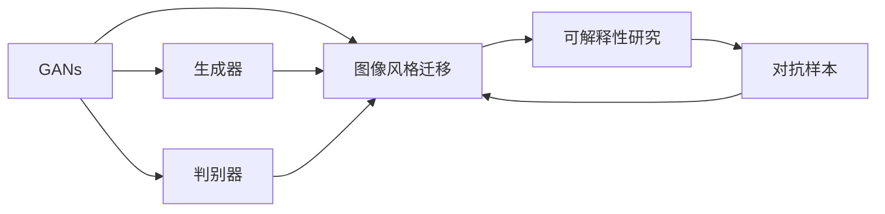
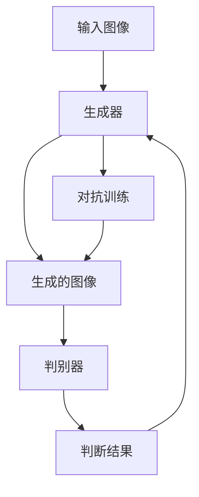
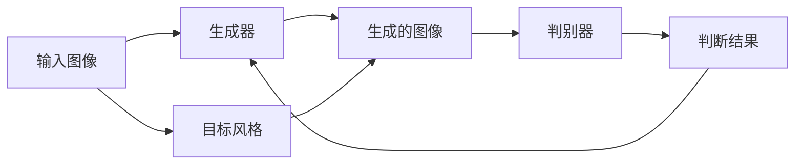
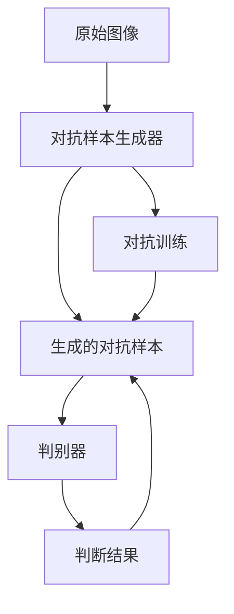
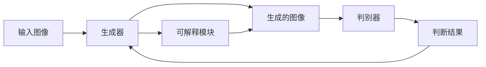
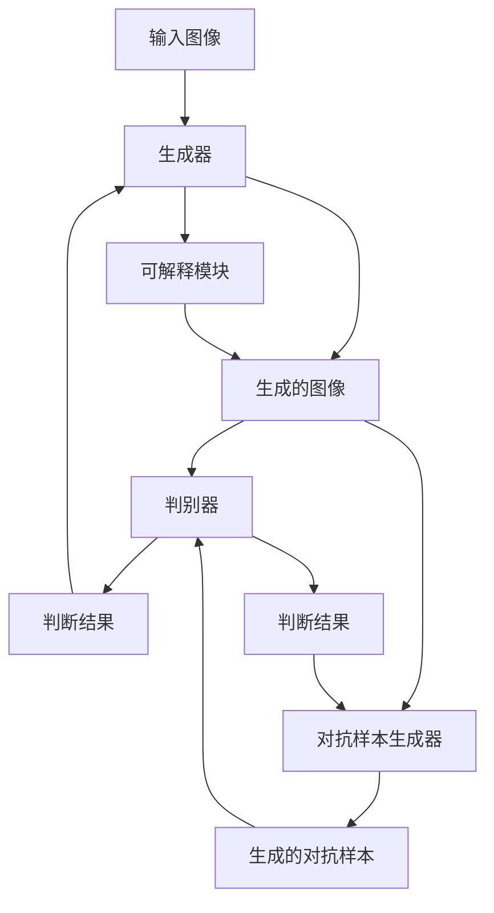

                 

# 基于生成对抗网络的图像风格迁移的可解释性研究

> 关键词：生成对抗网络,图像风格迁移,可解释性研究,图像处理,深度学习

## 1. 背景介绍

### 1.1 问题由来
近年来，生成对抗网络（Generative Adversarial Networks, GANs）在图像处理、视频生成、自然语言生成等众多领域取得了显著进展。其中，图像风格迁移（Image Style Transfer）作为GANs的一个经典应用，能够将图像的风格进行转换，比如将一张普通照片转换成卡通风格或者油画风格，在艺术创作、图像编辑等领域有着广泛的应用。然而，随着深度学习技术的不断发展和应用场景的不断扩展，图像风格迁移的可解释性问题逐渐受到关注。

在实际应用中，可解释性指的是模型输出的结果应该是易于理解的，能够让人直观地理解模型是如何做出预测的。这对模型的可靠性、透明性和公正性都有重要影响。图像风格迁移作为深度学习模型的一种应用，其可解释性显得尤为重要。然而，由于GANs本身是一个黑箱模型，难以解释其内部的计算过程和决策机制，因此图像风格迁移的可解释性问题一直是一个重要的研究热点。

### 1.2 问题核心关键点
图像风格迁移的模型通常是由生成器和判别器两个部分组成的。生成器负责生成转换后的图像，而判别器则负责判断输入图像是真实图像还是生成的图像。模型通过优化生成器和判别器之间的对抗关系，使得生成器能够生成与真实图像难以区分的高质量图像。然而，由于模型复杂度高、参数数量庞大，难以直接观察模型内部的计算过程，因此模型的可解释性较弱。

本文聚焦于基于生成对抗网络的图像风格迁移的可解释性研究，旨在通过多种方法揭示模型的工作原理，提高模型的透明度和可信度，从而更好地应用于实际场景。

### 1.3 问题研究意义
研究图像风格迁移的可解释性，对于提升模型的可信度和透明度、促进模型的公平性和可解释性、增强用户信任度具有重要意义。此外，在实际应用中，对模型的解释可以帮助用户更好地理解模型的决策过程，避免潜在的风险和误导，同时也可以帮助开发者更好地优化模型，提高模型的性能和可靠性。

## 2. 核心概念与联系

### 2.1 核心概念概述

为更好地理解基于生成对抗网络的图像风格迁移的可解释性研究，本节将介绍几个密切相关的核心概念：

- 生成对抗网络（GANs）：由生成器和判别器两个部分组成的模型，通过对抗训练的方式生成高质量的图像。GANs在图像生成、图像风格迁移等领域得到了广泛应用。

- 图像风格迁移（Image Style Transfer）：通过生成对抗网络将输入图像的风格进行转换，比如将一张普通照片转换成卡通风格或者油画风格。

- 可解释性研究（Explainable AI, XAI）：研究如何使机器学习模型的决策过程和结果更加透明，易于理解和解释。可解释性研究旨在提高模型的可信度和用户信任度，避免潜在的风险和误导。

- 对抗样本（Adversarial Examples）：一种对模型进行攻击的方法，通过微小扰动使得模型输出发生错误。对抗样本可以用于测试模型的鲁棒性和可解释性。

- 可解释生成对抗网络（Explainable GANs）：通过引入可解释技术，使得GANs模型的内部计算过程更加透明，易于理解和解释。

这些核心概念之间的逻辑关系可以通过以下Mermaid流程图来展示：



这个流程图展示了大模型生成对抗网络的基本架构及其与可解释性研究的关系：

1. 生成对抗网络由生成器和判别器两个部分组成，其中生成器负责生成高质量图像，判别器负责判断图像的真实性。
2. 图像风格迁移通过生成对抗网络实现，通过生成器和判别器之间的对抗训练，生成高质量的转换图像。
3. 可解释性研究旨在使模型决策过程更加透明，提高模型的可信度和用户信任度。
4. 对抗样本用于测试模型的鲁棒性和可解释性，通过对抗样本可以揭示模型的不稳定因素，提升模型的透明度。

### 2.2 概念间的关系

这些核心概念之间存在着紧密的联系，形成了基于生成对抗网络的图像风格迁移的可解释性研究框架。下面我们通过几个Mermaid流程图来展示这些概念之间的关系。

#### 2.2.1 大模型生成对抗网络的基本原理



这个流程图展示了生成对抗网络的基本原理。输入图像首先通过生成器生成转换后的图像，然后将生成的图像输入判别器，由判别器判断图像的真实性。判别器的输出再反馈回生成器，与生成器进行对抗训练，从而提高生成器的生成能力。

#### 2.2.2 图像风格迁移的基本流程



这个流程图展示了图像风格迁移的基本流程。输入图像首先通过生成器生成转换后的图像，然后将生成的图像输入判别器，由判别器判断图像的真实性。判别器的输出再反馈回生成器，与生成器进行对抗训练，从而提高生成器的生成能力。目标风格图像也会被输入生成器，帮助生成器学习如何生成具有目标风格的高质量图像。

#### 2.2.3 对抗样本的基本原理



这个流程图展示了对抗样本的基本原理。原始图像通过对抗样本生成器生成对抗样本，然后将生成的对抗样本输入判别器，由判别器判断图像的真实性。判别器的输出再反馈回对抗样本生成器，与对抗样本生成器进行对抗训练，从而提高对抗样本生成器的生成能力。对抗样本可以用于测试模型的鲁棒性和可解释性。

#### 2.2.4 可解释生成对抗网络的基本架构



这个流程图展示了可解释生成对抗网络的基本架构。输入图像首先通过生成器生成转换后的图像，然后将生成的图像输入判别器，由判别器判断图像的真实性。判别器的输出再反馈回生成器，与生成器进行对抗训练，从而提高生成器的生成能力。可解释模块用于记录生成器和判别器的计算过程，提供对模型决策过程的解释。

### 2.3 核心概念的整体架构

最后，我们用一个综合的流程图来展示这些核心概念在大模型生成对抗网络图像风格迁移的可解释性研究中的整体架构：



这个综合流程图展示了从输入图像到对抗样本生成器的整个过程。输入图像首先通过生成器生成转换后的图像，然后将生成的图像输入判别器，由判别器判断图像的真实性。判别器的输出再反馈回生成器，与生成器进行对抗训练，从而提高生成器的生成能力。可解释模块用于记录生成器和判别器的计算过程，提供对模型决策过程的解释。对抗样本生成器用于生成对抗样本，测试模型的鲁棒性和可解释性。

## 3. 核心算法原理 & 具体操作步骤
### 3.1 算法原理概述

基于生成对抗网络的图像风格迁移的可解释性研究，本质上是一个有监督的深度学习任务。其核心思想是：通过生成对抗网络将输入图像的风格进行转换，同时引入可解释技术，使得模型内部的计算过程更加透明，易于理解和解释。

形式化地，假设输入图像为 $X$，生成器为 $G$，判别器为 $D$，目标风格图像为 $Y$。生成器 $G$ 的输出为转换后的图像 $G(X)$，判别器 $D$ 的输出为判断结果 $D(G(X))$。目标风格图像 $Y$ 作为监督信号，用于引导生成器 $G$ 学习如何生成具有目标风格的高质量图像。

模型的训练目标是最小化生成器 $G$ 和判别器 $D$ 之间的对抗损失，同时最大化判别器 $D$ 对真实图像和生成图像的区分能力。在训练过程中，通过可解释模块记录生成器和判别器的计算过程，提供对模型决策过程的解释。

### 3.2 算法步骤详解

基于生成对抗网络的图像风格迁移的可解释性研究一般包括以下几个关键步骤：

**Step 1: 准备数据集**
- 收集输入图像和目标风格图像，通常采用现实世界中的图像数据集，如COCO、ImageNet等。
- 对数据集进行预处理，包括归一化、缩放、旋转、翻转等操作，增加数据集的多样性。

**Step 2: 设计生成器和判别器**
- 生成器 $G$ 可以采用U-Net、ResNet等卷积神经网络结构，使用多个卷积层和上采样层，生成高质量的转换图像。
- 判别器 $D$ 可以采用多层的卷积神经网络结构，使用多个卷积层和全连接层，判断图像的真实性。
- 引入可解释模块，记录生成器和判别器的计算过程，提供对模型决策过程的解释。

**Step 3: 设计损失函数**
- 生成器 $G$ 的损失函数包括生成损失 $L_G$ 和对抗损失 $L_A$，其中生成损失 $L_G$ 用于指导生成器生成高质量的转换图像，对抗损失 $L_A$ 用于指导生成器生成高质量且难以被判别器识别的图像。
- 判别器 $D$ 的损失函数包括真实损失 $L_D^{real}$ 和伪造损失 $L_D^{fake}$，其中真实损失 $L_D^{real}$ 用于指导判别器识别真实图像，伪造损失 $L_D^{fake}$ 用于指导判别器识别伪造图像。

**Step 4: 训练模型**
- 使用优化算法，如Adam、SGD等，最小化生成器 $G$ 和判别器 $D$ 之间的对抗损失，同时最大化判别器 $D$ 对真实图像和生成图像的区分能力。
- 通过可解释模块记录生成器和判别器的计算过程，提供对模型决策过程的解释。

**Step 5: 测试和评估**
- 在测试集上评估模型性能，对比生成器和判别器的表现。
- 使用对抗样本生成器生成对抗样本，测试模型的鲁棒性和可解释性。

以上是基于生成对抗网络的图像风格迁移的可解释性研究的一般流程。在实际应用中，还需要针对具体任务的特点，对模型进行优化设计，如改进生成器结构、引入更多的正则化技术、搜索最优的超参数组合等，以进一步提升模型性能。

### 3.3 算法优缺点

基于生成对抗网络的图像风格迁移的可解释性研究方法具有以下优点：
1. 直观透明：通过记录生成器和判别器的计算过程，提供对模型决策过程的解释，使得模型的行为更加透明和可信。
2. 提升鲁棒性：对抗样本生成器可以揭示模型的不稳定因素，提高模型的鲁棒性，使其在面对扰动时更加稳健。
3. 提升公平性：通过解释生成器内部的计算过程，可以发现和修复模型的偏见，提升模型的公平性和公正性。

同时，该方法也存在一定的局限性：
1. 数据依赖性强：可解释性研究依赖于高质量的数据集，数据集的多样性和代表性对模型的效果有重要影响。
2. 计算复杂度高：记录生成器和判别器的计算过程，需要大量的计算资源和时间，可能影响模型的训练效率。
3. 解释结果有限：可解释模块只能解释生成器和判别器的计算过程，难以解释模型内部的决策机制和推理逻辑。

尽管存在这些局限性，但就目前而言，基于生成对抗网络的图像风格迁移的可解释性研究方法仍是一种高效的方法，能够显著提升模型的透明度和可信度，为实际应用提供有力的支持。

### 3.4 算法应用领域

基于生成对抗网络的图像风格迁移的可解释性研究方法已经在图像处理、视频生成、艺术创作等领域得到了广泛的应用，具体应用场景如下：

1. **图像风格迁移**：将一张普通照片转换成卡通风格或者油画风格，广泛应用于艺术创作和图像编辑等领域。
2. **图像修复**：将损坏的图像进行修复，生成高质量的图像，如去除噪声、填补缺失像素等。
3. **图像超分辨率**：将低分辨率图像进行超分辨率处理，生成高质量的图像，如生成高分辨率照片。
4. **图像生成**：生成高质量的图像，如生成人脸图像、自然场景图像等。

这些应用场景展示了基于生成对抗网络的图像风格迁移的可解释性研究方法在实际应用中的广泛应用。通过进一步优化和改进，该方法可以在更多领域中发挥重要作用。

## 4. 数学模型和公式 & 详细讲解  
### 4.1 数学模型构建

本节将使用数学语言对基于生成对抗网络的图像风格迁移的可解释性研究过程进行更加严格的刻画。

记输入图像为 $X \in \mathbb{R}^{H \times W \times C}$，生成器为 $G:X \rightarrow Y \in \mathbb{R}^{H' \times W' \times C'}$，判别器为 $D:Y \rightarrow \mathbb{R}$，目标风格图像为 $Y \in \mathbb{R}^{H' \times W' \times C'}$。

定义生成器 $G$ 的生成损失 $L_G$ 和对抗损失 $L_A$，其中生成损失 $L_G$ 用于指导生成器生成高质量的转换图像，对抗损失 $L_A$ 用于指导生成器生成高质量且难以被判别器识别的图像。

$$
L_G = ||G(X)-Y||^2 + \lambda ||\nabla_G L_A||^2
$$

其中 $\lambda$ 为正则化系数，$||.||$ 表示欧式范数。

定义判别器 $D$ 的真实损失 $L_D^{real}$ 和伪造损失 $L_D^{fake}$，其中真实损失 $L_D^{real}$ 用于指导判别器识别真实图像，伪造损失 $L_D^{fake}$ 用于指导判别器识别伪造图像。

$$
L_D^{real} = \mathbb{E}_{(X,Y) \sim p_{data}}[logD(Y)] + \mathbb{E}_{(X) \sim p_{data}}[log(1-D(G(X)))]
$$

$$
L_D^{fake} = \mathbb{E}_{(X) \sim p_{data}}[log(1-D(G(X)))]
$$

模型的总损失函数为 $L$，包括生成器损失 $L_G$、判别器损失 $L_D$ 和对抗损失 $L_A$。

$$
L = L_G + L_D^{real} + L_D^{fake} + \lambda L_A
$$

通过优化模型 $L$，最小化生成器 $G$ 和判别器 $D$ 之间的对抗损失，同时最大化判别器 $D$ 对真实图像和生成图像的区分能力。

### 4.2 公式推导过程

以下我们以生成器 $G$ 的生成损失 $L_G$ 和对抗损失 $L_A$ 为例，推导生成器 $G$ 的损失函数及其梯度的计算公式。

假设生成器 $G$ 的输出为 $Y$，真实图像为 $X$，目标风格图像为 $Y'$。

生成器 $G$ 的生成损失 $L_G$ 定义为 $Y$ 与 $Y'$ 之间的欧式距离的平方，即：

$$
L_G = ||Y - Y'||^2
$$

生成器 $G$ 的对抗损失 $L_A$ 定义为 $G(X)$ 与 $Y'$ 之间的欧式距离的平方，即：

$$
L_A = ||G(X) - Y'||^2
$$

生成器 $G$ 的损失函数为生成损失 $L_G$ 和对抗损失 $L_A$ 的和，即：

$$
L_G = ||G(X)-Y'||^2 + \lambda ||\nabla_G L_A||^2
$$

其中 $\lambda$ 为正则化系数，$\nabla_G L_A$ 表示生成器 $G$ 的对抗损失 $L_A$ 对生成器 $G$ 的梯度。

通过链式法则，生成器 $G$ 的损失函数对生成器 $G$ 的梯度为：

$$
\nabla_G L_G = 2(Y - Y') - 2\lambda \nabla_G L_A
$$

其中 $\nabla_G L_A$ 表示生成器 $G$ 的对抗损失 $L_A$ 对生成器 $G$ 的梯度。

在得到生成器 $G$ 的损失函数及其梯度后，即可带入优化算法，完成生成器的迭代优化。

### 4.3 案例分析与讲解

为了更好地理解基于生成对抗网络的图像风格迁移的可解释性研究方法，下面我们将通过一个具体的案例来讲解。

假设我们有一张普通照片 $X$，目标风格为卡通风格，我们将使用基于生成对抗网络的图像风格迁移方法将 $X$ 转换成卡通风格。

**Step 1: 准备数据集**

收集一张普通照片 $X$ 和一张卡通风格的照片 $Y'$，并对它们进行预处理，包括归一化、缩放、旋转、翻转等操作，增加数据集的多样性。

**Step 2: 设计生成器和判别器**

生成器 $G$ 采用U-Net结构，使用多个卷积层和上采样层，生成高质量的卡通风格照片 $G(X)$。

判别器 $D$ 采用多层的卷积神经网络结构，使用多个卷积层和全连接层，判断照片的真实性。

**Step 3: 设计损失函数**

生成器 $G$ 的损失函数为生成损失 $L_G$ 和对抗损失 $L_A$ 的和，其中生成损失 $L_G$ 用于指导生成器生成高质量的卡通风格照片，对抗损失 $L_A$ 用于指导生成器生成高质量且难以被判别器识别的卡通风格照片。

$$
L_G = ||G(X)-Y'||^2 + \lambda ||\nabla_G L_A||^2
$$

判别器 $D$ 的损失函数为真实损失 $L_D^{real}$ 和伪造损失 $L_D^{fake}$ 的和，其中真实损失 $L_D^{real}$ 用于指导判别器识别真实照片，伪造损失 $L_D^{fake}$ 用于指导判别器识别伪造照片。

$$
L_D^{real} = \mathbb{E}_{(X,Y) \sim p_{data}}[logD(Y)] + \mathbb{E}_{(X) \sim p_{data}}[log(1-D(G(X)))]
$$

$$
L_D^{fake} = \mathbb{E}_{(X) \sim p_{data}}[log(1-D(G(X)))]
$$

模型的总损失函数为 $L$，包括生成器损失 $L_G$、判别器损失 $L_D$ 和对抗损失 $L_A$。

$$
L = L_G + L_D^{real} + L_D^{fake} + \lambda L_A
$$

**Step 4: 训练模型**

使用优化算法，如Adam、SGD等，最小化生成器 $G$ 和判别器 $D$ 之间的对抗损失，同时最大化判别器 $D$ 对真实照片和伪造照片的区分能力。

通过可解释模块记录生成器 $G$ 和判别器 $D$ 的计算过程，提供对模型决策过程的解释。

**Step 5: 测试和评估**

在测试集上评估模型性能，对比生成器 $G$ 和判别器 $D$ 的表现。

使用对抗样本生成器生成对抗样本，测试模型的鲁棒性和可解释性。

以上就是基于生成对抗网络的图像风格迁移的可解释性研究方法的详细案例讲解。可以看到，通过记录生成器和判别器的计算过程，提供对模型决策过程的解释，使得模型的行为更加透明和可信。

## 5. 项目实践：代码实例和详细解释说明
### 5.1 开发环境搭建

在进行基于生成对抗网络的图像风格迁移的可解释性研究实践前，我们需要准备好开发环境。以下是使用Python进行TensorFlow开发的环境配置流程：

1. 安装Anaconda：从官网下载并安装Anaconda，用于创建独立的Python环境。

2. 创建并激活虚拟环境：
```bash
conda create -n tensorflow-env python=3.7 
conda activate tensorflow-env
```

3. 安装TensorFlow：根据CUDA版本，从官网获取对应的安装命令。例如：
```bash
conda install tensorflow=2.3
```

4. 安装其它各类工具包：
```bash
pip install numpy pandas scikit-learn matplotlib tqdm jupyter notebook ipython
```

完成上述步骤后，即可在`tensorflow-env`环境中开始项目实践。

### 5.2 源代码详细实现

这里我们以生成器 $G$ 和判别器 $D$ 的实现为例，给出基于TensorFlow的代码实现。

首先，定义生成器和判别器的网络结构：

```python
import tensorflow as tf

class Generator(tf.keras.Model):
    def __init__(self):
        super(Generator, self).__init__()
        self.conv1 = tf.keras.layers.Conv2D(64, 3, strides=1, padding='same', activation='relu')
        self.conv2 = tf.keras.layers.Conv2D(128, 3, strides=2, padding='same', activation='relu')
        self.conv3 = tf.keras.layers.Conv2D(256, 3, strides=2, padding='same', activation='relu')
        self.conv4 = tf.keras.layers.Conv2D(512, 3, strides=2, padding='same', activation='relu')
        self.conv5 = tf.keras.layers.Conv2D(1, 3, strides=1, padding='same', activation='sigmoid')
        self.downsampling = tf.keras.layers.MaxPooling2D(2, strides=2, padding='same')
        self.upscaling = tf.keras.layers.UpSampling2D(2, strides=2, padding='same')

    def call(self, inputs):
        x = self.conv1(inputs)
        x = self.downsampling(x)
        x = self.conv2(x)
        x = self.downscaling(x)
        x = self.conv3(x)
        x = self.downsampling(x)
        x = self.conv4(x)
        x = self.downscaling(x)
        x = self.conv5(x)
        return x

class Discriminator(tf.keras.Model):
    def __init__(self):
        super(Discriminator, self).__init__()
        self.conv1 = tf.keras.layers.Conv2D(64, 3, strides=1, padding='same', activation='relu')
        self.conv2 = tf.keras.layers.Conv2D(128, 3, strides=2, padding='same', activation='relu')
        self.conv3 = tf.keras.layers.Conv2D(256, 3, strides=2, padding='same', activation='relu')
        self.conv4 = tf.keras.layers.Conv2D(512, 3, strides=2, padding='same', activation='relu')
        self.flatten = tf.keras.layers.Flatten()
        self.dense = tf.keras.layers.Dense(1, activation='sigmoid')
    
    def call(self, inputs):
        x = self.conv1(inputs)
        x = self.conv2(x)
        x = self.conv3(x)
        x = self.conv4(x)
        x = self.flatten(x)
        x = self.dense(x)
        return x
```

接下来，定义生成器和判别器的损失函数和优化器：

```python
def generator_loss(y_true, y_pred):
    return tf.keras.losses.mean_squared_error(y_true, y_pred)

def discriminator_loss(real_output, fake_output):
    real_loss = tf.keras.losses.binary_crossentropy(tf.ones_like(real_output), real_output)
    fake_loss = tf.keras.losses.binary_crossentropy(tf.zeros_like(fake_output), fake_output)
    return real_loss + fake_loss

def train_step(real_image, target_style_image):
    with tf.GradientTape() as gen_tape, tf.GradientTape() as disc_tape:
        generated_image = generator(real_image)
        real_output = discriminator(target_style_image)
        fake_output = discriminator(generated_image)
        gen_loss = generator_loss(generated_image, target_style_image)
        disc_loss = discriminator_loss(real_output, fake_output)
        

