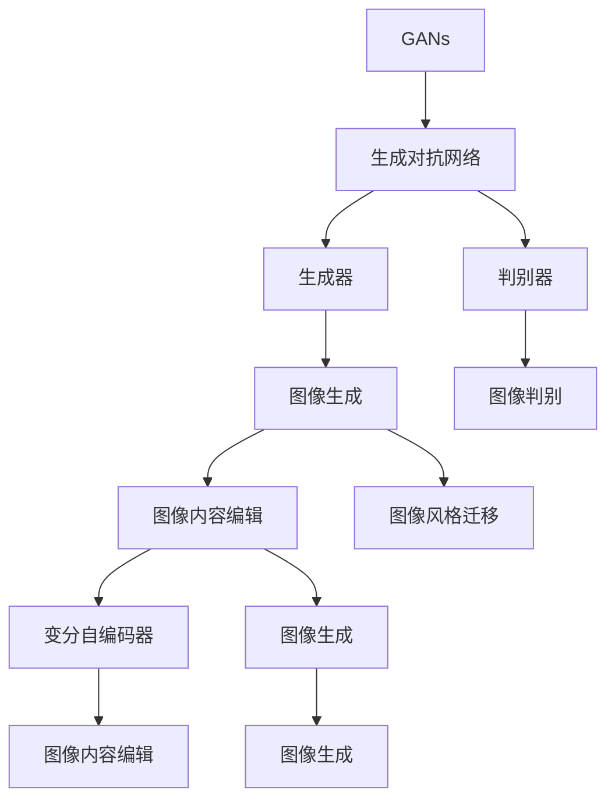
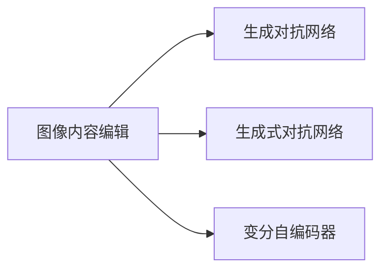
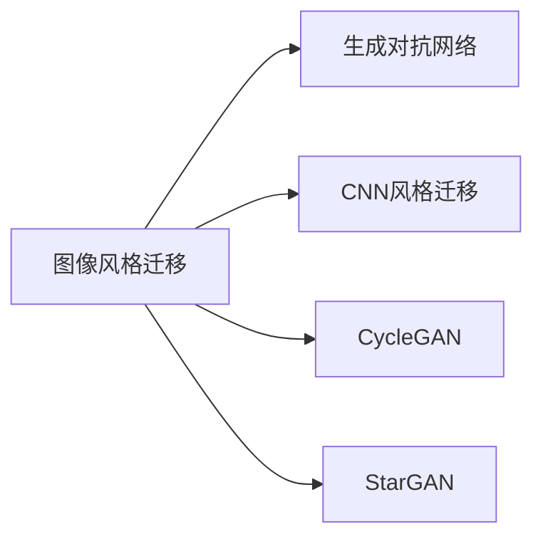
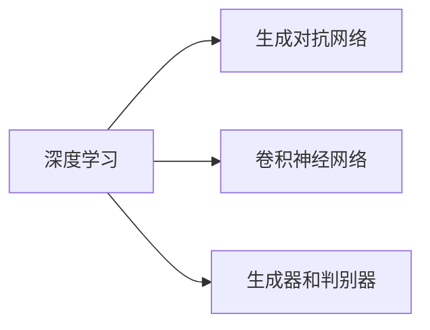

                 

# 基于生成对抗网络的精细化图像内容编辑与风格迁移

> 关键词：生成对抗网络,图像内容编辑,风格迁移,图像生成,深度学习

## 1. 背景介绍

在图像处理领域，生成对抗网络（Generative Adversarial Networks, GANs）以其卓越的图像生成和风格迁移能力，成为近年来研究的热点。通过GANs，可以生成逼真、多变且具有一定创造性的图像，同时在图像内容编辑、风格迁移等方面也有着广泛的应用。

本文章将深入介绍基于生成对抗网络的图像内容编辑与风格迁移技术，重点关注以下几个方面：
- 生成对抗网络的基本原理及其在图像生成中的应用。
- 图像内容编辑的具体方法，包括生成式对抗网络（GAN）和变分自编码器（VAE）。
- 图像风格迁移的实现原理与技术细节，包括CNN风格迁移、CycleGAN和StarGAN等方法。

## 2. 核心概念与联系

### 2.1 核心概念概述

为了更好地理解基于生成对抗网络的图像内容编辑与风格迁移，首先需要了解几个核心概念：

- **生成对抗网络（GANs）**：一种深度学习模型，由生成器和判别器两个部分组成。生成器负责生成假图像，判别器负责判断图像的真假。两者的对抗训练使得生成器可以生成越来越逼真的图像，判别器越来越难以区分真假图像。
- **图像内容编辑**：指在不改变图像风格的前提下，通过生成对抗网络改变图像中的内容，如添加或删除物体、修改物体属性等。
- **图像风格迁移**：指通过生成对抗网络将一张图像的风格转换为另一张图像的风格，同时保留原始图像的内容信息。
- **变分自编码器（VAE）**：一种生成模型，能够学习数据的潜在分布，并将其转化为生成样本。VAE通常用于生成具有一定结构和规律的图像，适用于生成高质量的图像数据。
- **深度学习**：一种基于神经网络的机器学习技术，深度学习模型可以处理大规模的图像数据，并通过反向传播算法进行训练。

这些概念之间的关系可以通过以下Mermaid流程图来展示：



这个流程图展示了GANs的基本架构及其在不同应用中的作用。生成器用于生成图像，判别器用于评估图像的真实性。GANs的应用不仅限于图像生成，还包括图像内容编辑和风格迁移。而VAE是用于生成高质量图像的生成模型，与GANs在一定程度上具有相似性，但在生成机制和性能上有所不同。

### 2.2 概念间的关系

这些核心概念之间存在着紧密的联系，形成了图像内容编辑与风格迁移的完整生态系统。下面我通过几个Mermaid流程图来展示这些概念之间的关系。

#### 2.2.1 图像内容编辑与GANs的关系



这个流程图展示了图像内容编辑与GANs的关系。生成式对抗网络（GAN）和变分自编码器（VAE）是实现图像内容编辑的两个主要方法。生成式对抗网络通过生成器和判别器之间的对抗训练生成图像，而变分自编码器则通过潜在变量学习生成图像。

#### 2.2.2 图像风格迁移与GANs的关系



这个流程图展示了图像风格迁移与GANs的关系。图像风格迁移的主要方法包括CNN风格迁移、CycleGAN和StarGAN等。这些方法都基于GANs的基本原理，通过生成器将原始图像的风格转换为目标图像的风格。

#### 2.2.3 GANs与深度学习的关系



这个流程图展示了GANs与深度学习的关系。GANs的生成器和判别器都是基于卷积神经网络（CNN）构建的，而深度学习为GANs提供了强大的训练基础。

## 3. 核心算法原理 & 具体操作步骤

### 3.1 算法原理概述

基于生成对抗网络的图像内容编辑与风格迁移技术，其核心思想是通过生成器和判别器的对抗训练，生成逼真且符合特定要求的图像。在内容编辑方面，生成器需要学习如何通过调整输入的噪声向量，生成符合特定内容的图像。在风格迁移方面，生成器需要学习如何通过变换输入图像的特征表示，生成具有特定风格的图像。

#### 3.1.1 生成对抗网络的基本原理

生成对抗网络由生成器和判别器两个部分组成。生成器的目标是生成尽可能逼真的图像，而判别器的目标是区分生成图像和真实图像。两者的对抗训练使得生成器可以生成越来越逼真的图像，而判别器则越来越难以区分真假图像。

#### 3.1.2 图像内容编辑的基本原理

图像内容编辑的目标是在不改变图像风格的前提下，通过生成对抗网络改变图像中的内容。这通常涉及到生成器和判别器的对抗训练，以及生成器如何通过调整输入的噪声向量生成新的图像内容。

#### 3.1.3 图像风格迁移的基本原理

图像风格迁移的目标是将一张图像的风格转换为另一张图像的风格，同时保留原始图像的内容信息。这通常涉及到生成器和判别器的对抗训练，以及生成器如何通过变换输入图像的特征表示生成新的图像。

### 3.2 算法步骤详解

基于生成对抗网络的图像内容编辑与风格迁移一般包括以下几个关键步骤：

**Step 1: 准备预训练模型和数据集**
- 选择合适的生成对抗网络模型，如DCGAN、StyleGAN等。
- 准备图像内容编辑或风格迁移的数据集，如CIFAR-10、CelebA等。

**Step 2: 训练生成器和判别器**
- 使用生成器和判别器对抗训练的方式，通过不断优化损失函数，提升生成器的生成能力和判别器的判别能力。

**Step 3: 微调生成器**
- 在训练好的生成器上，微调其参数以适应特定的图像内容编辑或风格迁移任务。
- 使用目标数据集进行训练，调整生成器的输入噪声向量，生成符合特定要求的图像。

**Step 4: 评估与调整**
- 在训练过程中，周期性地评估生成器的生成能力，调整生成器的参数以提高生成效果。
- 使用目标数据集进行评估，计算生成图像的准确度、多样性等指标。

### 3.3 算法优缺点

基于生成对抗网络的图像内容编辑与风格迁移技术，具有以下优点：
1. 生成图像逼真度高，可操作性强。生成器可以生成高质量的图像，判别器可以有效地评估生成图像的真实性。
2. 模型结构简单，易于实现。生成器和判别器都基于卷积神经网络，易于训练和优化。
3. 适应性强，应用广泛。适用于图像内容编辑、风格迁移等多种图像处理任务。

同时，该方法也存在以下缺点：
1. 训练过程中需要大量的计算资源。生成对抗网络的对抗训练过程需要大量的计算资源，对硬件设备要求较高。
2. 生成器可能产生噪声图像。生成器在训练过程中可能生成噪声图像，导致模型不稳定。
3. 判别器可能过拟合。判别器在训练过程中可能过拟合，导致无法有效地评估生成图像的真实性。

### 3.4 算法应用领域

基于生成对抗网络的图像内容编辑与风格迁移技术，在图像处理领域有着广泛的应用：

- **图像内容编辑**：如在图像中移除或添加物体、修改物体属性等。
- **图像风格迁移**：如将一张图像的风格转换为另一张图像的风格，或将多张图像的风格融合。
- **图像生成**：如生成具有特定内容的图像，如人脸、动物等。
- **图像修复**：如修复损坏的图像，去除噪声等。

## 4. 数学模型和公式 & 详细讲解

### 4.1 数学模型构建

在基于生成对抗网络的图像内容编辑与风格迁移中，通常使用以下数学模型进行建模：

- **生成器**：$f_G(z)$，其中 $z$ 为输入的噪声向量，$f_G(z)$ 为生成器生成的图像。
- **判别器**：$D(x)$，其中 $x$ 为输入的图像，$D(x)$ 为判别器对图像真实性的评估。
- **损失函数**：$L(D, G)$，包括判别器的损失函数 $L_D$ 和生成器的损失函数 $L_G$，其中 $L_D = -\log(D(x)) - \log(1-D(f_G(z)))$，$L_G = -\log(1-D(f_G(z)))$。

### 4.2 公式推导过程

以图像风格迁移为例，假设有两张图像 $A$ 和 $B$，希望将 $A$ 的风格迁移到 $B$ 上，生成新的图像 $C$。假设 $A$ 和 $B$ 的特征表示分别为 $\mathbf{a}$ 和 $\mathbf{b}$，生成器 $G$ 可以将其转换为新的特征表示 $\mathbf{c}$，然后使用反卷积层将其转换为图像 $C$。

假定 $A$ 和 $B$ 的特征表示 $\mathbf{a}$ 和 $\mathbf{b}$ 分别为 $n$ 维向量，$C$ 的特征表示 $\mathbf{c}$ 也是 $n$ 维向量，则有：

$$
\mathbf{a} = \mathbf{a}_0 G_A(\mathbf{z}_A) \\
\mathbf{b} = \mathbf{b}_0 G_B(\mathbf{z}_B) \\
\mathbf{c} = G_C(\mathbf{z}_C)
$$

其中 $G_A$、$G_B$ 和 $G_C$ 分别为生成器 $A$、$B$ 和 $C$ 的前向传播过程。通过使用生成器和判别器的对抗训练，可以最大化生成器的生成能力，最小化判别器的判别能力。

### 4.3 案例分析与讲解

以CycleGAN为例，CycleGAN是一种基于生成对抗网络的风格迁移方法，其主要思想是使用两个生成器和两个判别器，分别将输入图像映射到不同的特征空间，再将这些特征空间映射回原始空间，最终生成具有目标风格的新图像。

CycleGAN的训练过程如下：
1. 输入图像 $x_A$ 通过生成器 $G_A$ 生成中间表示 $\mathbf{a}$。
2. 中间表示 $\mathbf{a}$ 通过生成器 $G_B$ 生成输出图像 $y_B$。
3. 输出图像 $y_B$ 通过判别器 $D_B$ 进行判别，生成判别损失 $L_D^{y_B}$。
4. 中间表示 $\mathbf{a}$ 通过判别器 $D_A$ 进行判别，生成判别损失 $L_D^{\mathbf{a}}$。
5. 输出图像 $y_B$ 通过判别器 $D_A$ 进行判别，生成判别损失 $L_D^{y_B}$。
6. 输出图像 $y_B$ 通过生成器 $G_A$ 生成中间表示 $\mathbf{b}$。
7. 中间表示 $\mathbf{b}$ 通过生成器 $G_B$ 生成输出图像 $y_A$。
8. 输出图像 $y_A$ 通过判别器 $D_A$ 进行判别，生成判别损失 $L_D^{y_A}$。
9. 中间表示 $\mathbf{b}$ 通过判别器 $D_B$ 进行判别，生成判别损失 $L_D^{\mathbf{b}}$。

通过最大化生成器的生成能力和最小化判别器的判别能力，CycleGAN可以实现从图像 $A$ 到图像 $B$ 的风格迁移。

## 5. 项目实践：代码实例和详细解释说明

### 5.1 开发环境搭建

在进行图像内容编辑与风格迁移的实践前，需要先准备好开发环境。以下是使用Python进行TensorFlow开发的环境配置流程：

1. 安装Anaconda：从官网下载并安装Anaconda，用于创建独立的Python环境。

2. 创建并激活虚拟环境：
```bash
conda create -n tf-env python=3.8 
conda activate tf-env
```

3. 安装TensorFlow：根据CUDA版本，从官网获取对应的安装命令。例如：
```bash
conda install tensorflow tensorflow-gpu -c conda-forge
```

4. 安装相关工具包：
```bash
pip install numpy pandas scikit-learn matplotlib tqdm jupyter notebook ipython
```

完成上述步骤后，即可在`tf-env`环境中开始实践。

### 5.2 源代码详细实现

下面以CycleGAN为例，给出使用TensorFlow对图像风格迁移进行微调的PyTorch代码实现。

首先，定义CycleGAN模型：

```python
import tensorflow as tf
from tensorflow.keras import layers

def build_cycle_net(input_shape, output_shape, latent_dim):
    # 生成器A
    model_A = tf.keras.Sequential([
        layers.InputLayer(input_shape=input_shape),
        layers.Dense(latent_dim, activation='relu'),
        layers.Dense(input_shape[0] * input_shape[1] * output_shape[-1], activation='tanh'),
        layers.Reshape(target_shape=[input_shape[0] // 2, input_shape[1] // 2, output_shape[-1]]),
        layers.Conv2DTranspose(output_shape[0], kernel_size=4, strides=2, padding='same'),
        layers.Conv2DTranspose(output_shape[1], kernel_size=4, strides=2, padding='same'),
        layers.Conv2DTranspose(output_shape[2], kernel_size=4, strides=2, padding='same')
    ])
    # 生成器B
    model_B = tf.keras.Sequential([
        layers.InputLayer(input_shape=output_shape),
        layers.Dense(latent_dim, activation='relu'),
        layers.Dense(input_shape[0] * input_shape[1] * input_shape[-1], activation='tanh'),
        layers.Reshape(target_shape=[output_shape[0] // 2, output_shape[1] // 2, output_shape[-1]]),
        layers.Conv2DTranspose(output_shape[0], kernel_size=4, strides=2, padding='same'),
        layers.Conv2DTranspose(output_shape[1], kernel_size=4, strides=2, padding='same'),
        layers.Conv2DTranspose(output_shape[2], kernel_size=4, strides=2, padding='same')
    ])
    return model_A, model_B
```

然后，定义损失函数：

```python
def build_cycle_loss():
    # 判别器损失
    def discriminator_loss():
        loss_D_A_real = tf.reduce_mean(tf.math.log(discriminator_A(tf.identity(image_A)))
        loss_D_A_fake = tf.reduce_mean(tf.math.log(1 - discriminator_A(cycle_A)))
        loss_D_B_real = tf.reduce_mean(tf.math.log(discriminator_B(tf.identity(image_B)))
        loss_D_B_fake = tf.reduce_mean(tf.math.log(1 - discriminator_B(cycle_B)))
        return loss_D_A_real + loss_D_A_fake + loss_D_B_real + loss_D_B_fake
    # 生成器损失
    def generator_loss():
        loss_G_A_real = tf.reduce_mean(tf.math.log(discriminator_A(tf.identity(image_A))))
        loss_G_B_real = tf.reduce_mean(tf.math.log(discriminator_B(tf.identity(image_B))))
        return loss_G_A_real + loss_G_B_real
    # 联合损失函数
    loss = discriminator_loss() + generator_loss()
    return loss
```

最后，训练CycleGAN模型：

```python
# 准备数据集
image_A = ... # 输入图像A
image_B = ... # 输入图像B
latent_dim = 128
input_shape = image_A.shape[1:]
output_shape = image_B.shape[1:]
target_shape = (input_shape[0] // 2, input_shape[1] // 2, output_shape[-1])

# 定义生成器
model_A, model_B = build_cycle_net(input_shape, output_shape, latent_dim)

# 定义损失函数
loss = build_cycle_loss()

# 定义优化器
optimizer = tf.keras.optimizers.Adam(learning_rate=0.0002, beta_1=0.5)

# 训练循环
for epoch in range(10000):
    with tf.GradientTape() as tape:
        loss_value = loss(image_A, image_B, latent_A, latent_B, image_A_cycle, image_B_cycle)
    gradients = tape.gradient(loss_value, [model_A.trainable_weights, model_B.trainable_weights])
    optimizer.apply_gradients(zip(gradients, [model_A.trainable_weights, model_B.trainable_weights]))
    if epoch % 1000 == 0:
        print('Epoch: {}, Loss: {}'.format(epoch, loss_value))
```

以上就是使用TensorFlow对CycleGAN进行图像风格迁移的完整代码实现。可以看到，TensorFlow提供了丰富的工具和库，可以方便地实现复杂的生成对抗网络模型。

### 5.3 代码解读与分析

让我们再详细解读一下关键代码的实现细节：

**build_cycle_net函数**：
- 定义了生成器A和生成器B，分别用于将输入图像映射到不同的特征空间。

**build_cycle_loss函数**：
- 定义了判别器的损失函数和生成器的损失函数，用于衡量生成器和判别器的性能。
- 联合损失函数将判别器损失和生成器损失相加，用于优化整个模型。

**训练循环**：
- 在每个epoch中，计算联合损失函数并使用Adam优化器更新生成器A和生成器B的参数。
- 周期性地输出损失值，用于监控训练进度。

**图像生成和风格迁移**：
- 在训练过程中，通过生成器和判别器的对抗训练，生成器和判别器分别学习如何生成和判别图像。
- 最终，生成器A和生成器B可以生成具有目标风格的新图像。

## 6. 实际应用场景

### 6.1 智能艺术创作

基于生成对抗网络的图像风格迁移技术，可以为智能艺术创作提供强大的支持。艺术家可以通过风格迁移将不同风格的图像进行混合，创造出独特的艺术作品。例如，将梵高的油画风格应用到现代照片中，生成具有梵高风格的艺术图像。

### 6.2 图像修复与增强

在图像修复与增强领域，生成对抗网络可以用于修复损坏的图像、增强图像质量等。例如，将模糊的图像通过生成对抗网络进行去模糊处理，恢复其清晰度和细节。

### 6.3 广告创意设计

广告公司可以使用生成对抗网络进行创意设计。例如，通过将多种风格的图像进行风格迁移，生成具有吸引力的广告图像。

### 6.4 未来应用展望

未来，基于生成对抗网络的图像内容编辑与风格迁移技术将有更广泛的应用：

- 在娱乐行业，可以用于生成具有特定风格的虚拟偶像图像，提供更加沉浸式和个性化的用户体验。
- 在医疗行业，可以用于生成医学图像的虚拟增强，提高医生的诊断准确率。
- 在科学研究，可以用于生成具有特定特征的虚拟数据，加速科学研究进程。

总之，基于生成对抗网络的图像内容编辑与风格迁移技术，将在更多领域得到应用，为各行各业带来新的变革。

## 7. 工具和资源推荐

### 7.1 学习资源推荐

为了帮助开发者系统掌握生成对抗网络的图像内容编辑与风格迁移技术，这里推荐一些优质的学习资源：

1. Deep Learning Specialization by Andrew Ng：斯坦福大学的深度学习课程，涵盖了深度学习的基础理论和实践技巧，包括生成对抗网络。
2. "Generative Adversarial Networks" by Ian Goodfellow：生成对抗网络的经典论文，深入浅出地介绍了GANs的基本原理和应用场景。
3. TensorFlow Official Guide：TensorFlow的官方指南，提供了丰富的API文档和代码示例，适合初学者入门。
4. PyTorch官方文档：PyTorch的官方文档，提供了详细的API文档和代码示例，适合开发者进行实践。

通过这些资源的学习，相信你一定能够快速掌握生成对抗网络的图像内容编辑与风格迁移技术，并用于解决实际的图像处理问题。

### 7.2 开发工具推荐

生成对抗网络作为深度学习技术的一种，需要强大的计算资源和高效的开发工具。以下是几款常用的开发工具：

1. TensorFlow：Google开发的深度学习框架，提供了丰富的API和工具，适合进行大规模的深度学习模型训练。
2. PyTorch：Facebook开发的深度学习框架，支持动态计算图，适合快速迭代研究。
3. Keras：基于TensorFlow和Theano的高级神经网络API，提供了简单易用的API，适合初学者入门。
4. Jupyter Notebook：开源的交互式计算环境，支持Python代码编写和数据可视化，适合进行深度学习研究和实验。

这些工具在生成对抗网络的图像内容编辑与风格迁移中得到了广泛应用，能够显著提升开发效率和实验精度。

### 7.3 相关论文推荐

生成对抗网络作为一种新兴的深度学习技术，其理论和应用还在不断发展和完善中。以下是几篇奠基性的相关论文，推荐阅读：

1. Generative Adversarial Nets：Ian Goodfellow等人发表的生成对抗网络原始论文，奠定了GANs的基础理论。
2. Image Style Transfer Using Convolutional Neural Networks：Kaiming He等人发表的CNN风格迁移方法，展示了GANs在图像风格迁移中的应用。
3. CycleGAN：Jun-Yan Zhu等人发表的CycleGAN方法，通过两个生成器和两个判别器，实现了高效的图像风格迁移。
4. StarGAN：Chao-Yuan Wu等人发表的StarGAN方法，通过多个生成器和判别器，实现了多类别图像风格迁移。

这些论文代表了生成对抗网络在图像内容编辑与风格迁移领域的发展脉络，通过学习这些前沿成果，可以帮助研究者把握学科前进方向，激发更多的创新灵感。

## 8. 总结：未来发展趋势与挑战

### 8.1 总结

本文对基于生成对抗网络的图像内容编辑与风格迁移技术进行了全面系统的介绍。首先阐述了生成对抗网络的基本原理及其在图像生成中的应用，然后深入讲解了图像内容编辑和风格迁移的具体方法。最后，通过几个实际应用场景，展示了生成对抗网络在图像处理领域的重要作用。

通过本文的系统梳理，可以看到，生成对抗网络在图像内容编辑与风格迁移中发挥了巨大的作用，推动了图像处理技术的不断发展。未来，随着技术的进步和应用的推广，生成对抗网络必将在更多领域得到应用，为人类生活带来更美好的体验。

### 8.2 未来发展趋势

展望未来，生成对抗网络的图像内容编辑与风格迁移技术将呈现以下几个发展趋势：

1. 模型规模持续增大。随着算力成本的下降和数据规模的扩张，生成对抗网络的参数量还将持续增长。超大规模生成对抗网络可以生成更加逼真、多变的图像。
2. 风格迁移应用更广泛。除了图像风格迁移，生成对抗网络还可以用于文本生成、语音生成等跨领域的应用。
3. 生成对抗网络的理论基础进一步完善。随着生成对抗网络的研究深入，其理论基础也将更加坚实，应用前景将更加广阔。
4. 生成对抗网络与深度学习的结合更加紧密。生成对抗网络可以作为深度学习模型的组成部分，与深度学习技术深度融合，产生新的创新。
5. 生成对抗网络的应用领域更广泛。生成对抗网络不仅可以用于图像处理，还可以用于科学研究、艺术创作等多个领域。

以上趋势凸显了生成对抗网络的广阔前景。这些方向的探索发展，必将进一步提升生成对抗网络在图像处理中的应用效果，推动图像处理技术的不断进步。

### 8.3 面临的挑战

尽管生成对抗网络的图像内容编辑与风格迁移技术已经取得了显著进展，但在应用过程中仍面临诸多挑战：

1. 训练过程中需要大量的计算资源。生成对抗网络需要大量的计算资源进行训练，对硬件设备要求较高。
2. 生成器可能产生噪声图像。生成器在训练过程中可能生成噪声图像，导致模型不稳定。
3. 判别器可能过拟合。判别器在训练过程中可能过拟合，导致无法有效地评估生成图像的真实性。
4. 风格迁移结果可能不自然。风格迁移结果可能出现过度融合、失真等现象，导致效果不自然。
5. 数据隐私和安全问题。生成对抗网络可能生成假冒的图像或视频，导致数据隐私和安全问题。

正视生成对抗网络面临的这些挑战，积极应对并寻求突破，将是大规模图像内容编辑与风格迁移技术走向成熟的必由之路。相信随着学界和产业界的共同努力，这些挑战终将一一被克服，生成对抗网络必将在构建智能系统的过程中扮演越来越重要的角色。

### 8.4 研究展望

面对生成对抗网络在图像内容编辑与风格迁移中面临的挑战，未来的研究需要在以下几个方面寻求新的突破：

1. 探索无监督和半监督生成对抗网络方法。摆脱对大规模标注数据的依赖，利用自监督学习、主动学习等无监督和半监督范式，最大限度利用非结构化数据，实现更加灵活高效的图像生成。
2. 研究参数高效和计算高效的生成对抗网络范式。开发更加参数高效的生成对抗网络方法，在固定大部分生成对抗网络参数的情况下，只更新极少量的任务相关参数。同时优化生成对抗网络的计算

