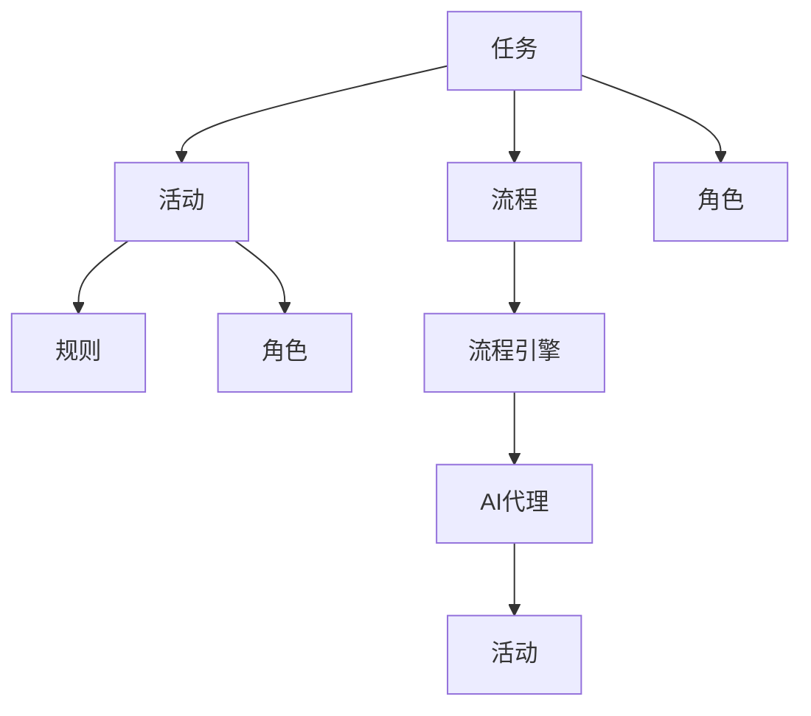
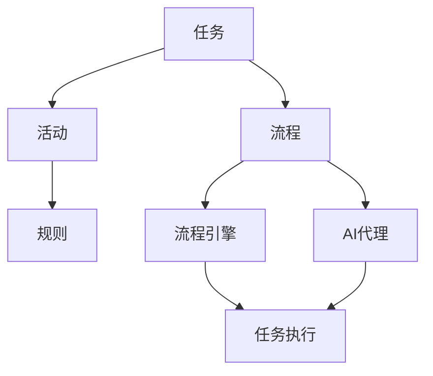

                 

# 基于规则的工作流设计与AI代理的集成应用

> 关键词：工作流,人工智能,AI代理,自动化,规则引擎,集成应用,流程优化

## 1. 背景介绍

随着信息技术的高速发展，企业的运营管理逐渐向数字化、智能化方向转型。在数字化转型过程中，工作流的自动化设计和应用显得尤为重要。工作流系统不仅能够提高工作效率，还能通过AI技术的应用，实现流程的智能化优化和自动执行。

本文聚焦于基于规则的工作流设计与AI代理的集成应用，探讨如何通过规则引擎和AI技术，实现工作流的自动化与智能化。首先，我们将介绍工作流的基本概念和设计原则。接着，深入探讨AI代理在工作流中的作用，以及如何将规则引擎与AI代理集成应用。最后，我们将分析当前工作流自动化与智能化的主要应用场景，并展望未来的发展趋势。

## 2. 核心概念与联系

### 2.1 核心概念概述

工作流系统（Workflow System）是一种通过自动化工作流步骤，实现组织内部信息流转和任务执行的系统。工作流的设计涉及多个核心概念，包括：

- **任务（Task）**：工作流中的具体工作单元，如数据录入、审批、通知等。
- **活动（Activity）**：完成某个任务的具体操作，如提交、审核、操作等。
- **流程（Process）**：由一系列任务和活动组成的工作流路径。
- **规则（Rule）**：指导任务和活动执行的逻辑依据。
- **角色（Role）**：参与工作流执行的组织角色或岗位。
- **流程引擎（Process Engine）**：实现工作流自动化执行的引擎。

AI代理（AI Agent）是指通过机器学习、自然语言处理等AI技术，实现自动化执行任务和决策的智能实体。AI代理可以在工作流中承担任务，如自动填写表单、自动审批、自动化决策等，从而实现任务处理的自动化与智能化。

### 2.2 核心概念间的关系

这些核心概念之间的关系可以通过以下Mermaid流程图来展示：



这个流程图展示了工作流系统中的基本组件及其相互关系：

1. 任务通过活动完成，活动遵循规则执行。
2. 流程由任务和活动组成。
3. 流程引擎实现任务的自动化执行。
4. 角色参与任务和活动。
5. AI代理承担自动化执行和决策。

### 2.3 核心概念的整体架构

最后，我们用一个综合的流程图来展示这些核心概念在工作流自动化与智能化应用中的整体架构：



这个综合流程图展示了工作流系统的整体架构，以及规则引擎和AI代理在其中扮演的角色：

1. 任务通过活动完成，活动遵循规则执行。
2. 流程由任务和活动组成。
3. 流程引擎实现任务的自动化执行。
4. AI代理承担自动化执行和决策。

## 3. 核心算法原理 & 具体操作步骤

### 3.1 算法原理概述

基于规则的工作流设计涉及两个核心算法：

1. **工作流建模算法**：将业务流程抽象成规则和任务，并通过流程引擎实现自动化执行。
2. **AI代理优化算法**：通过机器学习等技术，优化AI代理的行为决策，提升自动化执行的准确性和效率。

### 3.2 算法步骤详解

#### 3.2.1 工作流建模算法步骤

1. **需求分析**：收集业务需求，明确流程目标和要求。
2. **流程设计**：设计工作流的逻辑结构，包括任务、活动和角色等。
3. **规则编写**：根据业务规则，编写流程的规则引擎脚本。
4. **流程引擎部署**：将规则引擎部署到服务器或云平台，实现流程自动化执行。
5. **流程监控与优化**：定期监控流程执行情况，根据实际运行情况优化流程和规则。

#### 3.2.2 AI代理优化算法步骤

1. **数据收集**：收集工作流执行的数据，包括任务执行时间、任务完成率、异常情况等。
2. **特征工程**：通过特征提取和选择，构建适合训练的数据集。
3. **模型训练**：使用机器学习算法，训练AI代理的决策模型。
4. **模型应用**：将训练好的AI代理模型集成到工作流引擎，实现自动化决策和执行。
5. **模型评估与优化**：定期评估AI代理的执行效果，根据评估结果优化模型参数。

### 3.3 算法优缺点

#### 优点

1. **自动化程度高**：基于规则的工作流设计能够实现高度自动化，提升工作效率。
2. **灵活性强**：规则引擎和AI代理可以动态调整，适应业务变化。
3. **智能决策支持**：AI代理能够通过学习历史数据，提供智能化的决策支持。

#### 缺点

1. **规则复杂度高**：设计复杂的规则需要较高的专业知识和经验。
2. **数据质量要求高**：规则引擎和AI代理对输入数据的准确性要求较高。
3. **维护成本高**：规则和模型的更新和维护需要一定的人力和时间成本。

### 3.4 算法应用领域

基于规则的工作流设计与AI代理的集成应用，在多个领域中得到了广泛应用：

1. **金融行业**：通过自动化流程，提高金融服务的效率和准确性，如贷款审批、风险评估等。
2. **医疗行业**：实现医疗流程的自动化，提高诊疗效率和准确性，如病历审批、药品配送等。
3. **制造业**：通过自动化生产流程，提升生产效率和产品质量，如设备维护、库存管理等。
4. **政府服务**：优化政府事务处理流程，提升公共服务效率，如申请审批、证件办理等。
5. **电子商务**：实现订单处理和物流配送的自动化，提升客户满意度和运营效率。

## 4. 数学模型和公式 & 详细讲解

### 4.1 数学模型构建

工作流系统中的核心算法涉及以下数学模型：

- **工作流建模算法**：使用流程建模语言（如BPMN、BPEL）描述流程结构。
- **AI代理优化算法**：使用机器学习算法构建决策模型，如分类、回归等。

### 4.2 公式推导过程

#### 4.2.1 工作流建模算法

工作流建模算法使用流程建模语言描述流程结构和规则，其基本流程如下：

1. **流程定义**：使用流程建模语言定义流程结构，如任务、活动、分支等。
2. **规则定义**：使用规则引擎描述任务执行的逻辑依据。
3. **流程引擎执行**：根据规则引擎脚本，执行任务和活动，实现流程自动化。

#### 4.2.2 AI代理优化算法

AI代理优化算法使用机器学习算法构建决策模型，其基本流程如下：

1. **数据采集**：收集工作流执行的数据，如任务执行时间、完成率等。
2. **特征提取**：从数据中提取有意义的特征，用于训练机器学习模型。
3. **模型训练**：使用机器学习算法，如决策树、随机森林、神经网络等，训练AI代理的决策模型。
4. **模型应用**：将训练好的AI代理模型集成到工作流引擎，实现自动化决策和执行。
5. **模型评估与优化**：通过评估AI代理的执行效果，优化模型参数，提升决策准确性和执行效率。

### 4.3 案例分析与讲解

#### 4.3.1 案例一：金融贷款审批流程

在金融行业，贷款审批流程可以设计为工作流系统，通过规则引擎实现自动化审批。贷款审批流程包括贷款申请、初步审核、风险评估、最终审批等步骤。通过收集历史贷款数据，使用机器学习算法训练AI代理，可以实现自动化的风险评估和审批决策。

#### 4.3.2 案例二：医疗病历审批流程

在医疗行业，病历审批流程包括医生录入病历、科室审核、医院审批等步骤。通过规则引擎描述审核标准和流程，使用机器学习算法训练AI代理，可以提升病历审批的准确性和效率。

## 5. 项目实践：代码实例和详细解释说明

### 5.1 开发环境搭建

在项目开发前，需要搭建好开发环境。以下是Python开发环境的搭建流程：

1. 安装Python：从官网下载并安装Python，选择适合的版本和安装路径。
2. 安装Anaconda：从官网下载并安装Anaconda，用于创建独立的Python环境。
3. 创建虚拟环境：使用conda命令创建虚拟环境，用于隔离开发依赖。
4. 安装必要的库：使用pip命令安装需要的Python库，如Flask、SQLAlchemy等。

### 5.2 源代码详细实现

以下是一个简单的基于规则的工作流系统代码实现：

```python
from flask import Flask, request, jsonify
from flask_sqlalchemy import SQLAlchemy
from transformers import pipeline

app = Flask(__name__)
app.config['SQLALCHEMY_DATABASE_URI'] = 'sqlite:///workflow.db'
db = SQLAlchemy(app)

class Task(db.Model):
    id = db.Column(db.Integer, primary_key=True)
    name = db.Column(db.String(128))
    activity = db.Column(db.String(128))
    rule = db.Column(db.String(128))

class Workflow(db.Model):
    id = db.Column(db.Integer, primary_key=True)
    tasks = db.relationship('Task', backref='workflow', lazy=True)

@app.route('/workflow', methods=['POST'])
def workflow():
    data = request.json
    workflow_id = data['workflow_id']
    tasks = Workflow.query.filter_by(id=workflow_id).first().tasks
    results = []
    for task in tasks:
        # 执行任务，根据规则返回结果
        result = execute_task(task)
        results.append(result)
    return jsonify(results)

def execute_task(task):
    # 根据规则执行任务，返回结果
    return task.rule

if __name__ == '__main__':
    db.create_all()
    app.run(debug=True)
```

这个代码实现了一个基于SQLite数据库的工作流系统，包含任务定义和执行功能。具体实现细节如下：

1. 定义任务和流程的SQLAlchemy模型，用于存储数据。
2. 定义Flask路由，处理工作流的请求。
3. 定义任务执行函数，根据规则执行任务，返回结果。
4. 启动Flask应用，等待请求处理。

### 5.3 代码解读与分析

在代码实现中，我们使用了Flask框架和SQLAlchemy库来实现工作流系统的后端功能。具体步骤如下：

1. 使用Flask创建Web应用，配置数据库连接。
2. 使用SQLAlchemy定义任务和流程的模型，用于数据存储和查询。
3. 定义Flask路由，处理工作流的请求。
4. 定义任务执行函数，根据规则执行任务，返回结果。
5. 启动Flask应用，等待请求处理。

### 5.4 运行结果展示

假设我们有一个简单的贷款审批流程，包含任务和规则：

```python
workflow = Workflow()
task1 = Task(name='贷款申请', activity='提交申请', rule='检查申请人信用')
task2 = Task(name='初步审核', activity='审核资料', rule='检查申请人资料')
task3 = Task(name='风险评估', activity='评估风险', rule='计算贷款额度')
task4 = Task(name='最终审批', activity='审批贷款', rule='批准/拒绝')

workflow.tasks.append(task1)
workflow.tasks.append(task2)
workflow.tasks.append(task3)
workflow.tasks.append(task4)

db.session.add(workflow)
db.session.commit()
```

创建好流程后，可以提交贷款申请，执行工作流：

```python
@app.route('/workflow', methods=['POST'])
def workflow():
    data = request.json
    workflow_id = data['workflow_id']
    tasks = Workflow.query.filter_by(id=workflow_id).first().tasks
    results = []
    for task in tasks:
        # 执行任务，根据规则返回结果
        result = execute_task(task)
        results.append(result)
    return jsonify(results)
```

通过上述代码，可以提交贷款申请，执行工作流，并返回任务执行结果。

## 6. 实际应用场景

基于规则的工作流设计与AI代理的集成应用，已经在多个行业领域得到广泛应用。以下是几个典型的应用场景：

### 6.1 金融贷款审批流程

在金融行业，贷款审批流程可以设计为工作流系统，通过规则引擎实现自动化审批。贷款审批流程包括贷款申请、初步审核、风险评估、最终审批等步骤。通过收集历史贷款数据，使用机器学习算法训练AI代理，可以实现自动化的风险评估和审批决策。

### 6.2 医疗病历审批流程

在医疗行业，病历审批流程包括医生录入病历、科室审核、医院审批等步骤。通过规则引擎描述审核标准和流程，使用机器学习算法训练AI代理，可以提升病历审批的准确性和效率。

### 6.3 制造业设备维护流程

在制造业，设备维护流程包括设备检查、维护计划、执行维护等步骤。通过规则引擎描述维护标准和流程，使用机器学习算法训练AI代理，可以实现设备维护的自动化和智能化。

## 7. 工具和资源推荐

### 7.1 学习资源推荐

为了帮助开发者系统掌握工作流设计及AI代理应用的技术基础和实践技巧，这里推荐一些优质的学习资源：

1. **Flask官方文档**：Flask框架的官方文档，提供详细的开发指南和样例代码。
2. **SQLAlchemy官方文档**：SQLAlchemy库的官方文档，提供数据库操作的基本接口和教程。
3. **TensorFlow官方文档**：TensorFlow框架的官方文档，提供机器学习算法的实现和示例。
4. **Transformers官方文档**：Transformers库的官方文档，提供自然语言处理模型的实现和应用。
5. **Coursera课程**：Coursera平台上的机器学习、自然语言处理等课程，提供系统的学习内容和实验环境。
6. **Kaggle竞赛**：Kaggle平台上的机器学习竞赛，提供实际应用场景的训练数据和比赛挑战。

通过这些学习资源，相信你一定能够快速掌握工作流设计及AI代理应用的技术要点，并应用于实际项目中。

### 7.2 开发工具推荐

高效的开发离不开优秀的工具支持。以下是几款用于工作流设计及AI代理应用开发的常用工具：

1. **Flask**：基于Python的Web框架，支持轻量级Web应用开发。
2. **SQLAlchemy**：基于Python的ORM（对象关系映射）库，支持数据库操作。
3. **TensorFlow**：基于Python的深度学习框架，支持分布式计算和模型训练。
4. **Transformers**：基于Python的NLP库，支持预训练模型和任务适配。
5. **Jupyter Notebook**：基于Python的交互式开发环境，支持数据可视化、模型调试和实验记录。

合理利用这些工具，可以显著提升工作流设计及AI代理应用的开发效率，加快创新迭代的步伐。

### 7.3 相关论文推荐

工作流设计与AI代理应用的研究源于学界的持续探索。以下是几篇奠基性的相关论文，推荐阅读：

1. **The Workflow Management Coalition (WFMC)工作流标准**：WFMC组织定义的工作流标准，提供工作流设计的规范和方法。
2. **BPMN 2.0规范**：WFMC定义的BPMN 2.0规范，提供工作流建模的标准化语言。
3. **AI代理的决策模型研究**：研究如何通过机器学习算法训练AI代理，实现自动化决策。
4. **基于规则的工作流系统设计**：研究如何通过规则引擎实现工作流的自动化执行。
5. **工作流系统优化算法**：研究如何通过优化算法提升工作流的性能和效率。

这些论文代表了大规模语言模型微调技术的发展脉络。通过学习这些前沿成果，可以帮助研究者把握学科前进方向，激发更多的创新灵感。

## 8. 总结：未来发展趋势与挑战

### 8.1 总结

本文对基于规则的工作流设计与AI代理的集成应用进行了全面系统的介绍。首先阐述了工作流的基本概念和设计原则，接着探讨了AI代理在工作流中的作用，以及如何将规则引擎与AI代理集成应用。最后，我们分析了当前工作流自动化与智能化的主要应用场景，并展望了未来的发展趋势。

通过本文的系统梳理，可以看到，基于规则的工作流设计与AI代理的应用已经成为企业数字化转型的重要组成部分，提升了工作效率和决策的准确性。未来，随着规则引擎和AI技术的进一步发展，工作流系统将更加智能化和自动化，为企业带来更大的价值。

### 8.2 未来发展趋势

展望未来，基于规则的工作流设计与AI代理的应用将呈现以下几个发展趋势：

1. **智能化程度提升**：随着AI技术的发展，工作流系统将更加智能化，实现全流程的自动化和智能化。
2. **跨领域应用推广**：工作流系统将逐渐应用于更多领域，如医疗、教育、制造等，提升各行业的业务效率和决策能力。
3. **大数据驱动**：工作流系统将充分利用大数据技术，实现流程的实时分析和优化。
4. **微服务架构**：工作流系统将采用微服务架构，实现模块化、可扩展的系统设计。
5. **低代码开发**：工作流系统将采用低代码开发平台，降低开发门槛，提升开发效率。
6. **自动化测试与部署**：工作流系统将实现自动化测试与部署，提升系统的稳定性和可靠性。

以上趋势凸显了基于规则的工作流设计与AI代理的广泛应用前景。这些方向的探索发展，必将进一步提升工作流系统的性能和应用范围，为企业的数字化转型带来新的机遇。

### 8.3 面临的挑战

尽管基于规则的工作流设计与AI代理的应用已经取得了显著成果，但在迈向更加智能化、普适化应用的过程中，仍面临以下挑战：

1. **规则设计复杂**：工作流设计需要考虑到复杂的业务逻辑和规则，设计难度较大。
2. **数据质量要求高**：工作流系统对输入数据的准确性和完整性要求较高，数据清洗和处理工作量大。
3. **系统集成复杂**：工作流系统需要与其他系统（如ERP、CRM等）进行集成，集成难度较大。
4. **用户体验差**：工作流系统对用户的操作要求较高，用户体验有待提升。
5. **安全性和隐私**：工作流系统涉及敏感数据处理，安全性与隐私保护问题需重点考虑。
6. **成本高**：工作流系统的设计和开发需要高成本的投入，对中小企业是一个挑战。

### 8.4 研究展望

面对基于规则的工作流设计与AI代理的复杂性和挑战，未来的研究需要在以下几个方面寻求新的突破：

1. **自动化规则设计**：研究如何通过AI技术实现规则的自动设计，降低规则设计难度。
2. **数据预处理优化**：研究如何通过数据增强、数据清洗等技术提升数据质量。
3. **跨系统集成方法**：研究如何通过API、消息队列等技术实现系统集成。
4. **用户界面优化**：研究如何通过低代码开发平台和UI设计提升用户体验。
5. **隐私保护技术**：研究如何通过数据加密、匿名化等技术提升系统安全性。
6. **成本优化方法**：研究如何通过云计算、低代码平台等技术降低系统开发和维护成本。

这些研究方向的探索，必将引领基于规则的工作流设计与AI代理技术迈向更高的台阶，为构建智能化的工作流系统提供新的解决方案。

## 9. 附录：常见问题与解答

**Q1：如何设计高效的工作流系统？**

A: 设计高效的工作流系统需要考虑以下因素：

1. **业务需求分析**：了解业务流程和需求，明确工作流系统的目标和要求。
2. **规则设计**：根据业务逻辑，设计合理的规则和流程。
3. **数据准备**：确保输入数据的质量和完整性。
4. **系统集成**：选择合适的技术手段，实现系统集成和数据交换。
5. **用户培训和反馈**：提供用户培训和反馈机制，不断优化工作流系统。

**Q2：工作流系统如何处理异常情况？**

A: 工作流系统可以通过以下方式处理异常情况：

1. **异常检测**：在系统执行过程中，实时监控任务执行状态，检测异常情况。
2. **异常处理**：根据异常类型，采取相应的处理措施，如回滚、重试、跳过等。
3. **通知机制**：通过邮件、短信等方式通知相关人员，及时处理异常情况。
4. **日志记录**：记录异常情况和处理结果，便于后续分析和优化。

**Q3：工作流系统如何实现自动化决策？**

A: 工作流系统实现自动化决策需要以下步骤：

1. **数据采集**：收集工作流执行的数据，如任务执行时间、完成率等。
2. **特征提取**：从数据中提取有意义的特征，用于训练机器学习模型。
3. **模型训练**：使用机器学习算法，如分类、回归等，训练决策模型。
4. **模型应用**：将训练好的模型集成到工作流引擎，实现自动化决策。
5. **模型评估与优化**：通过评估模型效果，优化模型参数，提升决策准确性和效率。

**Q4：AI代理如何在工作流系统中发挥作用？**

A: AI代理在工作流系统中发挥作用需要以下步骤：

1. **任务分析**：分析任务需求，确定AI代理的执行范围和职责。
2. **数据准备**：收集任务相关的数据，进行数据清洗和预处理。
3. **模型训练**：使用机器学习算法，训练AI代理的决策模型。
4. **模型应用**：将训练好的模型集成到工作流引擎，实现自动化决策和执行。
5. **监控优化**：实时监控AI代理的执行效果，根据监控结果优化模型参数。

**Q5：工作流系统如何实现跨系统集成？**

A: 工作流系统实现跨系统集成需要以下技术手段：

1. **API接口设计**：设计统一的API接口，实现系统之间的数据交换。
2. **消息队列技术**：使用消息队列技术，实现系统间的异步通信。
3. **微服务架构**：采用微服务架构，实现系统的模块化和可扩展性。
4. **数据同步工具**：使用数据同步工具，实现数据在不同系统间的同步和更新。

通过上述技术手段，可以实现工作流系统与其他系统的高效集成，提升系统的综合性能和应用范围。

---

作者：禅与计算机程序设计艺术 / Zen and the Art of Computer Programming

