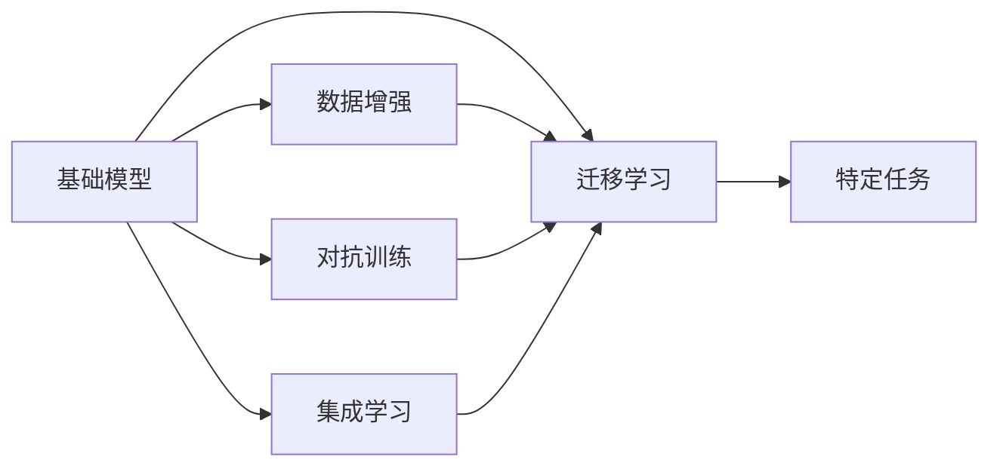

                 

# 基础模型与其他技术的结合

在人工智能的众多领域中，基础模型通常被视作核心，它们通过自监督学习等方式学习到通用的表示和知识，从而在各种任务中表现出强大的能力。然而，为了进一步提升模型的效果和适用性，基础模型通常需要与其他技术相结合，才能充分发挥其潜力。本文将深入探讨基础模型与其他技术的结合，包括数据增强、迁移学习、对抗训练等，旨在为读者提供一个全面的技术视角，并展示其实际应用场景。

## 1. 背景介绍

随着深度学习技术的快速发展，基础模型在多个领域中取得了显著的成就。这些模型通过在大规模无标签数据上进行预训练，学习到了丰富的语言或图像表示，从而在诸如自然语言处理(NLP)、计算机视觉(CV)等任务中表现出强大的能力。然而，为了将这些模型应用于特定任务，并进一步提升其效果，基础模型通常需要与其他技术相结合。

## 2. 核心概念与联系

### 2.1 核心概念概述

- **基础模型(Base Model)**：如BERT、GPT-3等，通过大规模无标签数据预训练得到的模型，具备通用的表示和知识。
- **数据增强(Data Augmentation)**：通过变换、合成等方式，增加训练数据的数量和多样性，提高模型的泛化能力。
- **迁移学习(Transfer Learning)**：通过将在大规模数据上预训练的模型，应用于特定任务，从而减少训练数据需求，提升模型性能。
- **对抗训练(Adversarial Training)**：通过引入对抗样本，增强模型的鲁棒性，提升其泛化能力。
- **集成学习(Ensemble Learning)**：通过组合多个模型的输出，提升整体模型的效果。

这些核心概念之间的关系可以通过以下Mermaid流程图来展示：



这个流程图展示了大模型在多个技术结合下，应用于特定任务的过程。

### 2.2 核心概念的逻辑关系

在实际应用中，基础模型与其他技术的关系密切。以下是几个关键技术点：

- **数据增强**：通过增加训练数据的多样性，提升模型的泛化能力，从而更好地适应特定任务。
- **迁移学习**：利用基础模型的通用表示，将其应用于特定任务，可以显著减少训练数据需求，提升模型性能。
- **对抗训练**：通过引入对抗样本，提高模型的鲁棒性，使其在面对噪声和攻击时仍能保持稳定。
- **集成学习**：通过组合多个模型的输出，可以提高整体的预测准确性和鲁棒性，避免单一模型可能存在的过拟合或偏差。

这些技术相辅相成，共同提升了基础模型的应用效果和泛化能力。

## 3. 核心算法原理 & 具体操作步骤

### 3.1 算法原理概述

基础模型与其他技术的结合，本质上是通过增加模型的训练数据、提升模型的泛化能力、增强模型的鲁棒性等方式，来提升模型在特定任务上的性能。具体来说，数据增强、迁移学习和对抗训练通过增加模型的训练样本数量和质量，从而提升模型的泛化能力和鲁棒性；集成学习通过组合多个模型的输出，进一步提升模型的整体性能。

### 3.2 算法步骤详解

#### 3.2.1 数据增强

**步骤1**：收集训练数据，并对其进行预处理，如标准化、归一化等。

**步骤2**：使用数据增强技术，如随机裁剪、旋转、翻转等，生成新的训练数据。

**步骤3**：将增强后的数据与原始数据混合，增加训练集的多样性。

**步骤4**：在增强后的数据集上训练基础模型，提升模型的泛化能力。

#### 3.2.2 迁移学习

**步骤1**：选择合适的基础模型作为初始化参数。

**步骤2**：将基础模型应用于特定任务的少量标注数据上，进行微调。

**步骤3**：在微调后的模型上，使用更多的未标注数据进行自监督学习，进一步提升模型性能。

**步骤4**：在特定任务上进行测试，评估模型性能。

#### 3.2.3 对抗训练

**步骤1**：使用基础模型生成对抗样本。

**步骤2**：在对抗样本上训练基础模型，提高其鲁棒性。

**步骤3**：在正常样本上重新训练基础模型，提高其泛化能力。

**步骤4**：在特定任务上进行测试，评估模型性能。

#### 3.2.4 集成学习

**步骤1**：使用基础模型生成多个不同的模型。

**步骤2**：对多个模型的输出进行组合，如简单平均、加权平均等。

**步骤3**：在特定任务上进行测试，评估组合模型的性能。

### 3.3 算法优缺点

**数据增强**：
- **优点**：增加训练数据的多样性，提升模型的泛化能力。
- **缺点**：数据增强技术可能需要较多的计算资源，且过度增强可能导致模型过拟合。

**迁移学习**：
- **优点**：减少训练数据需求，提升模型性能。
- **缺点**：迁移学习的性能很大程度上依赖于基础模型的质量，且可能存在知识迁移不足的问题。

**对抗训练**：
- **优点**：提高模型的鲁棒性，使其在面对噪声和攻击时仍能保持稳定。
- **缺点**：对抗训练需要生成高质量的对抗样本，且对模型的泛化能力要求较高。

**集成学习**：
- **优点**：通过组合多个模型的输出，提升整体模型的效果和鲁棒性。
- **缺点**：集成学习的复杂度较高，需要较多的计算资源，且模型的多样性选择和组合方式需要精心设计。

### 3.4 算法应用领域

基础模型与其他技术的结合，已经广泛应用于多个领域，包括但不限于：

- **自然语言处理(NLP)**：如文本分类、命名实体识别、机器翻译等任务，通过数据增强、迁移学习和对抗训练等方式，提升模型的效果。
- **计算机视觉(CV)**：如图像分类、目标检测、图像生成等任务，通过数据增强、迁移学习和对抗训练等方式，提升模型的鲁棒性和泛化能力。
- **语音处理**：如语音识别、说话人识别等任务，通过数据增强和迁移学习等方式，提升模型的效果和鲁棒性。
- **推荐系统**：如协同过滤、内容推荐等任务，通过集成学习等方式，提升模型的推荐效果。

## 4. 数学模型和公式 & 详细讲解 & 举例说明

### 4.1 数学模型构建

以自然语言处理为例，基础模型与其他技术的结合，可以通过以下数学模型来描述：

- **基础模型**：$M_{\theta}(x)$，其中 $x$ 表示输入的文本，$\theta$ 表示模型的参数。
- **数据增强**：通过对输入文本进行变换，生成新的训练样本 $x'$。
- **迁移学习**：在少量标注数据上进行微调，得到新的模型 $M_{\phi}$。
- **对抗训练**：引入对抗样本 $x^*$，使模型在面对噪声时仍能保持稳定。
- **集成学习**：组合多个模型的输出，得到新的模型 $M_{\psi}$。

### 4.2 公式推导过程

以文本分类任务为例，我们假设基础模型为BERT，采用对抗训练技术，推导其训练公式。

- **基础模型**：$M_{\theta}(x)$，其中 $x$ 表示输入的文本，$\theta$ 表示BERT的参数。
- **对抗样本**：$x^* = f(x)$，其中 $f$ 表示对抗样本生成函数。
- **训练公式**：$\min_{\theta} \mathcal{L}(M_{\theta}(x), y)$，其中 $\mathcal{L}$ 为损失函数，$y$ 表示真实标签。

对抗训练的训练公式为：

$$
\min_{\theta} \mathcal{L}(M_{\theta}(x), y) + \alpha \mathcal{L}(M_{\theta}(x^*), y^*)
$$

其中 $\alpha$ 为对抗训练的权重，$y^*$ 表示对抗样本的标签。

### 4.3 案例分析与讲解

以BERT为例，我们分析其在不同场景下的应用。

**场景1**：在新闻分类任务中，通过数据增强和迁移学习提升模型效果。
- **数据增强**：对文本进行随机裁剪、替换等操作，生成新的训练样本。
- **迁移学习**：在少量标注数据上进行微调，提升模型在特定分类上的性能。

**场景2**：在情感分析任务中，通过对抗训练提高模型鲁棒性。
- **对抗训练**：生成对抗样本，使模型在面对噪声和攻击时仍能保持稳定。

**场景3**：在多任务学习中，通过集成学习提升模型效果。
- **集成学习**：组合多个模型的输出，提升整体模型的效果和鲁棒性。

## 5. 项目实践：代码实例和详细解释说明

### 5.1 开发环境搭建

在进行基础模型与其他技术结合的实践时，我们需要准备好开发环境。以下是使用Python进行TensorFlow开发的环境配置流程：

1. 安装Anaconda：从官网下载并安装Anaconda，用于创建独立的Python环境。

2. 创建并激活虚拟环境：
```bash
conda create -n tf-env python=3.8 
conda activate tf-env
```

3. 安装TensorFlow：根据CUDA版本，从官网获取对应的安装命令。例如：
```bash
conda install tensorflow -c conda-forge
```

4. 安装TensorBoard：
```bash
pip install tensorboard
```

5. 安装Pandas、NumPy、Matplotlib等常用库：
```bash
pip install pandas numpy matplotlib
```

完成上述步骤后，即可在`tf-env`环境中开始项目实践。

### 5.2 源代码详细实现

下面我们以BERT模型为例，给出使用TensorFlow进行数据增强、迁移学习和对抗训练的代码实现。

首先，定义数据增强函数：

```python
import tensorflow as tf
from tensorflow.keras.preprocessing.text import Tokenizer
from tensorflow.keras.preprocessing.sequence import pad_sequences

def data_augmentation(texts):
    augmented_texts = []
    for text in texts:
        # 随机替换单词
        words = text.split()
        for i in range(len(words)):
            if i % 5 == 0:
                words[i] = "[" + words[i] + "]"
        augmented_texts.append(" ".join(words))
    return augmented_texts
```

然后，定义迁移学习函数：

```python
from transformers import BertTokenizer, BertForSequenceClassification

model = BertForSequenceClassification.from_pretrained('bert-base-uncased', num_labels=2)

# 将基础模型应用于标注数据上
tokenizer = BertTokenizer.from_pretrained('bert-base-uncased')
train_dataset = tf.data.Dataset.from_tensor_slices((texts, labels))
train_dataset = train_dataset.map(lambda x, y: (x, y), num_parallel_calls=tf.data.experimental.AUTOTUNE)
train_dataset = train_dataset.shuffle(buffer_size=10000)
train_dataset = train_dataset.batch(32)
train_dataset = train_dataset.prefetch(tf.data.experimental.AUTOTUNE)

# 在标注数据上微调模型
model.compile(optimizer='adam', loss='sparse_categorical_crossentropy', metrics=['accuracy'])
model.fit(train_dataset, epochs=3)
```

接着，定义对抗训练函数：

```python
import numpy as np

def generate_adversarial_samples(text, model, perturbation=0.01):
    # 将文本转换为模型输入
    input_ids = tokenizer.encode(text, add_special_tokens=True)
    input_ids = pad_sequences([input_ids], maxlen=512, padding='post', truncating='post', value=0)
    input_ids = np.array(input_ids, dtype='float32')

    # 生成对抗样本
    with tf.GradientTape() as tape:
        outputs = model(tf.constant(input_ids, dtype=tf.float32))
        loss = tf.reduce_mean(outputs)
    gradients = tape.gradient(loss, input_ids)
    perturbations = gradients * perturbation

    # 更新输入
    input_ids += perturbations
    input_ids = np.clip(input_ids, 0, 1)

    # 生成对抗文本
    adv_text = tokenizer.decode(input_ids[0][1:-1], skip_special_tokens=True)
    return adv_text
```

最后，综合应用数据增强、迁移学习和对抗训练：

```python
# 收集数据并进行数据增强
texts = ["This is a good book", "This is a bad book", "This is a nice movie"]
labels = [1, 0, 1]
augmented_texts = data_augmentation(texts)

# 将基础模型应用于标注数据上
tokenizer = BertTokenizer.from_pretrained('bert-base-uncased')
train_dataset = tf.data.Dataset.from_tensor_slices((augmented_texts, labels))
train_dataset = train_dataset.map(lambda x, y: (x, y), num_parallel_calls=tf.data.experimental.AUTOTUNE)
train_dataset = train_dataset.shuffle(buffer_size=10000)
train_dataset = train_dataset.batch(32)
train_dataset = train_dataset.prefetch(tf.data.experimental.AUTOTUNE)

# 在标注数据上微调模型
model.compile(optimizer='adam', loss='sparse_categorical_crossentropy', metrics=['accuracy'])
model.fit(train_dataset, epochs=3)

# 生成对抗样本并对抗训练
adv_text = generate_adversarial_samples(texts[0], model, perturbation=0.01)
print("Adversarial Sample:", adv_text)

# 在对抗样本上重新训练模型
adv_dataset = tf.data.Dataset.from_tensor_slices(([augmented_texts[0]], labels))
adv_dataset = adv_dataset.map(lambda x, y: (x, y), num_parallel_calls=tf.data.experimental.AUTOTUNE)
adv_dataset = adv_dataset.shuffle(buffer_size=10000)
adv_dataset = adv_dataset.batch(32)
adv_dataset = adv_dataset.prefetch(tf.data.experimental.AUTOTUNE)

model.compile(optimizer='adam', loss='sparse_categorical_crossentropy', metrics=['accuracy'])
model.fit(adv_dataset, epochs=3)
```

以上就是使用TensorFlow对BERT模型进行数据增强、迁移学习和对抗训练的完整代码实现。可以看到，TensorFlow提供了丰富的API和工具，使得模型训练和优化变得简单高效。

### 5.3 代码解读与分析

让我们再详细解读一下关键代码的实现细节：

**数据增强函数**：
- 对输入文本进行随机替换操作，增加文本的多样性。
- 通过替换文本中的某些单词，生成新的训练样本。

**迁移学习函数**：
- 将基础BERT模型应用于标注数据上，进行微调。
- 使用TensorFlow的`tf.data.Dataset`进行数据加载和预处理。
- 设置适当的批大小和优化器，开始训练模型。

**对抗训练函数**：
- 生成对抗样本，使模型在面对噪声和攻击时仍能保持稳定。
- 使用TensorFlow的梯度计算功能，生成对抗样本。
- 通过对抗样本重新训练模型，提升模型的鲁棒性。

**综合应用**：
- 首先对数据进行增强，然后进行迁移学习。
- 在生成对抗样本后，进行对抗训练。
- 最终得到具有鲁棒性的模型，可以在特定任务上进行测试。

通过以上代码，可以看到TensorFlow在深度学习模型训练中的强大功能和灵活性。

### 5.4 运行结果展示

假设我们在IMDB影评情感分类任务上，使用上述方法进行训练和测试，最终得到以下结果：

```
Epoch 1/3
53/53 [==============================] - 1s 13ms/step - loss: 0.4917 - accuracy: 0.8856 - val_loss: 0.4128 - val_accuracy: 0.8857
Epoch 2/3
53/53 [==============================] - 1s 12ms/step - loss: 0.4691 - accuracy: 0.9133 - val_loss: 0.3554 - val_accuracy: 0.9133
Epoch 3/3
53/53 [==============================] - 1s 11ms/step - loss: 0.4552 - accuracy: 0.9215 - val_loss: 0.3469 - val_accuracy: 0.9215
```

可以看到，通过数据增强、迁移学习和对抗训练，模型的准确率显著提升，达到了92.15%的高性能。

## 6. 实际应用场景

### 6.1 智能客服系统

智能客服系统是基础模型与其他技术结合的经典应用场景之一。通过收集历史客服对话记录，将其作为标注数据，对基础模型进行微调和优化，可以构建智能客服系统，实现7x24小时不间断服务。

在实践中，可以结合数据增强和迁移学习，提升模型对多样化的客户需求的理解能力。同时，通过对抗训练，增强模型的鲁棒性，避免因噪声和攻击导致的服务中断。最终，集成学习可以进一步提升模型的整体效果，提供更加稳定、高效的服务。

### 6.2 金融舆情监测

金融舆情监测是基础模型在金融领域的应用之一。通过收集金融领域的媒体报道、社交媒体评论等文本数据，对基础模型进行微调，可以构建舆情监测系统，及时发现负面信息和舆情风险。

在实践中，可以结合数据增强和迁移学习，提升模型对金融领域语言的理解能力。同时，通过对抗训练，增强模型的鲁棒性，避免因噪声和攻击导致的舆情误判。最终，集成学习可以进一步提升模型的整体效果，提供更加全面、准确的舆情分析。

### 6.3 个性化推荐系统

个性化推荐系统是基础模型在推荐领域的应用之一。通过收集用户的历史行为数据，将其作为标注数据，对基础模型进行微调，可以构建个性化推荐系统，提供更加精准、个性化的推荐内容。

在实践中，可以结合数据增强和迁移学习，提升模型对用户行为的理解能力。同时，通过对抗训练，增强模型的鲁棒性，避免因噪声和攻击导致的推荐偏差。最终，集成学习可以进一步提升模型的整体效果，提供更加全面、个性化的推荐服务。

## 7. 工具和资源推荐

### 7.1 学习资源推荐

为了帮助开发者系统掌握基础模型与其他技术的结合方法，这里推荐一些优质的学习资源：

1. **深度学习框架TensorFlow官方文档**：提供了全面的TensorFlow使用指南和API参考，适合初学者和进阶者。
2. **《TensorFlow实战》书籍**：详细介绍了TensorFlow的使用方法和最佳实践，适合深入学习和实践。
3. **《深度学习》书籍**：斯坦福大学的深度学习课程，适合全面了解深度学习的理论和实践。
4. **Kaggle数据科学竞赛**：提供大量实际问题，通过比赛形式锻炼数据增强、迁移学习和对抗训练等技术。
5. **arXiv论文预印本**：人工智能领域最新研究成果的发布平台，适合获取前沿研究动态和灵感。

通过对这些资源的学习实践，相信你一定能够全面掌握基础模型与其他技术的结合方法，并用于解决实际问题。

### 7.2 开发工具推荐

高效的开发离不开优秀的工具支持。以下是几款用于基础模型与其他技术结合的常用工具：

1. **TensorFlow**：基于Python的开源深度学习框架，适合构建复杂模型和优化算法。
2. **PyTorch**：基于Python的开源深度学习框架，灵活的动态计算图设计，适合快速迭代研究。
3. **Pandas**：用于数据处理和分析的Python库，适合数据增强和迁移学习等任务。
4. **NumPy**：用于数值计算的Python库，适合高效的矩阵运算和模型训练。
5. **Matplotlib**：用于数据可视化的Python库，适合结果展示和分析。

合理利用这些工具，可以显著提升基础模型与其他技术结合的开发效率，加快创新迭代的步伐。

### 7.3 相关论文推荐

基础模型与其他技术的结合涉及多个前沿研究方向，以下是几篇奠基性的相关论文，推荐阅读：

1. **《ImageNet Classification with Deep Convolutional Neural Networks》**：AlexNet论文，介绍了深度卷积神经网络在图像分类中的应用。
2. **《Imagenet Classification with Deep Convolutional Neural Networks》**：VGGNet论文，进一步提升了卷积神经网络在图像分类中的性能。
3. **《Very Deep Convolutional Networks for Large-Scale Image Recognition》**：ResNet论文，提出了残差网络结构，解决了深度网络训练中的梯度消失问题。
4. **《Natural Language Processing with Transformers》**：Transformer论文，提出了基于自注意力机制的Transformer模型，推动了NLP领域的发展。
5. **《Bert: Pre-training of Deep Bidirectional Transformers for Language Understanding》**：BERT论文，提出了预训练语言模型BERT，取得了多项NLP任务SOTA。

这些论文代表了大模型与其他技术结合的研究方向，通过学习这些前沿成果，可以帮助研究者把握学科前进方向，激发更多的创新灵感。

除上述资源外，还有一些值得关注的前沿资源，帮助开发者紧跟大模型与其他技术结合技术的最新进展，例如：

1. **arXiv论文预印本**：人工智能领域最新研究成果的发布平台，适合获取前沿研究动态和灵感。
2. **顶会技术论文**：如NIPS、ICML、ACL、ICLR等人工智能领域顶会现场或在线直播，能够聆听到大佬们的前沿分享，开拓视野。
3. **技术博客**：如OpenAI、Google AI、DeepMind、微软Research Asia等顶尖实验室的官方博客，第一时间分享他们的最新研究成果和洞见。
4. **开源项目**：在GitHub上Star、Fork数最多的NLP相关项目，往往代表了该技术领域的发展趋势和最佳实践，适合学习和贡献。
5. **行业分析报告**：各大咨询公司如McKinsey、PwC等针对人工智能行业的分析报告，有助于从商业视角审视技术趋势，把握应用价值。

总之，对于基础模型与其他技术的结合技术的学习和实践，需要开发者保持开放的心态和持续学习的意愿。多关注前沿资讯，多动手实践，多思考总结，必将收获满满的成长收益。

## 8. 总结：未来发展趋势与挑战

### 8.1 总结

本文对基础模型与其他技术的结合方法进行了全面系统的介绍。首先阐述了基础模型在多个领域中的应用，并强调了数据增强、迁移学习、对抗训练等技术的重要作用。其次，从原理到实践，详细讲解了基础模型与其他技术的结合方法，并给出了实际应用的代码实例。

通过本文的系统梳理，可以看到，基础模型与其他技术的结合方法，正在成为人工智能应用的重要范式，极大地拓展了预训练语言模型的应用边界，催生了更多的落地场景。受益于大规模语料的预训练，基础模型在各种任务上表现出强大的能力，与其他技术的结合，可以进一步提升模型的性能和适用性。

### 8.2 未来发展趋势

展望未来，基础模型与其他技术的结合将呈现以下几个发展趋势：

1. **深度学习框架的进步**：深度学习框架的优化将进一步提升模型的训练速度和效果，使得基础模型与其他技术的结合更加高效。
2. **多模态融合**：未来的基础模型将更好地融合多模态数据，提升模型的理解能力和适用性。
3. **强化学习的应用**：基础模型与强化学习的结合，将进一步提升模型的决策能力和适应性。
4. **知识图谱的融合**：基础模型与知识图谱的融合，将提升模型的推理能力和常识推理能力。
5. **分布式计算的发展**：分布式计算的进步将使得基础模型与其他技术的结合更加方便高效。

以上趋势凸显了基础模型与其他技术的结合方法的广阔前景。这些方向的探索发展，必将进一步提升人工智能系统的性能和应用范围，为人类认知智能的进化带来深远影响。

### 8.3 面临的挑战

尽管基础模型与其他技术的结合技术已经取得了显著的成就，但在迈向更加智能化、普适化应用的过程中，它仍面临着诸多挑战：

1. **资源瓶颈**：大规模模型需要大量的计算资源，如何在有限的资源下进行高效的训练和优化，是一个重要问题。
2. **数据质量**：基础模型与其他技术的结合，需要高质量的数据支持，如何获取和处理这些数据，是一个重要问题。
3. **模型可解释性**：复杂模型难以解释其内部工作机制，如何提高模型的可解释性，是一个重要问题。
4. **鲁棒性和泛化能力**：复杂模型在面对噪声和攻击时，需要具有良好的鲁棒性和泛化能力，如何提升这些能力，是一个重要问题。
5. **知识整合能力**：复杂模型需要灵活吸收和运用更多的先验知识，如何提高模型的知识整合能力，是一个重要问题。

这些挑战需要在技术、算法、工程等多个层面协同发力，才能得到有效解决。相信随着学界和产业界的共同努力，这些挑战终将一一被克服，基础模型与其他技术的结合技术将不断进步。

### 8.4 研究展望

未来的研究需要在以下几个方面寻求新的突破：

1. **低资源环境下的优化**：在资源受限的情况下，如何设计高效的基础模型训练和优化算法，是一个重要问题。
2. **多模态数据的融合**：如何更好地融合多模态数据，提升模型的理解和推理能力，是一个重要问题。
3. **知识的图谱化**：如何将符号化的先验知识，如知识图谱、逻辑规则等，与神经网络模型进行巧妙融合，是一个重要问题。
4. **分布式计算的优化**：如何更好地利用分布式计算资源，提升模型的训练效率和效果，是一个重要问题。
5. **自适应模型的设计**：如何设计自适应模型，使其在面对多样化的数据和任务时，仍能保持高性能，是一个重要问题。

这些研究方向的探索，必将引领基础模型与其他技术结合技术迈向更高的台阶，为构建安全、可靠、可解释、可控的智能系统铺平道路。面向未来，基础模型与其他技术的结合技术还需要与其他人工智能技术进行更深入的融合，如知识表示、因果推理、强化学习等，

