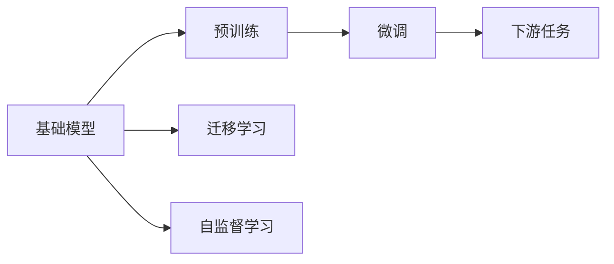

                 

# 基础模型在科技产业的影响

## 1. 背景介绍

在当今科技产业日新月异的发展背景下，基础模型（Base Model）作为人工智能技术的基石，对科技产业的发展产生了深远影响。基础模型指那些在大规模数据集上预训练，并能在各种下游任务上进行微调和部署的通用模型，如BERT、GPT-3、ResNet等。这些模型通过预训练和微调，不仅在学术界取得了显著的进展，也在工业界得到了广泛的应用，极大地推动了科技产业的发展。

基础模型在科技产业的影响体现在多个方面，包括但不限于智能客服、金融科技、医疗健康、自动驾驶等领域。通过基础模型的应用，企业能够在数据、计算和人力资源等有限资源下，快速开发和部署智能系统，提升产品和服务质量，实现业务升级和转型。

## 2. 核心概念与联系

### 2.1 核心概念概述

在深入探讨基础模型对科技产业的影响之前，首先需要明确一些核心概念：

- **基础模型**：通过大规模无标签数据预训练，学习通用知识表示的模型，如BERT、GPT-3等。这些模型在大规模数据上学习到丰富的语言、视觉等领域的知识，具备强大的泛化能力。
- **微调**：在基础模型的基础上，使用下游任务的标注数据进行有监督学习，以适应特定任务的模型。微调通过调整顶层参数，使得模型在特定任务上表现更佳。
- **迁移学习**：将一个领域学习到的知识应用到另一个相关领域的过程。基础模型通过迁移学习，能够适应不同领域的任务需求。
- **预训练**：在大规模数据集上进行无监督学习，学习到通用知识表示的过程。预训练使得模型具有更强的泛化能力和对不同领域任务的适应性。
- **自监督学习**：通过有标签的输入数据对模型进行训练，提高模型的泛化能力和对未知数据的适应性。

### 2.2 概念间的关系

这些核心概念之间存在着密切的联系和相互作用，形成了一个完整的框架体系。下面通过几个Mermaid流程图来展示这些概念之间的关系：



从图中可以看出，基础模型通过预训练和自监督学习，学习到通用的知识表示。然后，通过微调和迁移学习，基础模型能够适应下游任务，实现通用模型的泛化应用。

## 3. 核心算法原理 & 具体操作步骤

### 3.1 算法原理概述

基础模型的核心算法原理主要包括以下几个步骤：

1. **预训练**：在大规模无标签数据集上，通过自监督学习任务（如语言建模、图像分类等）训练模型，学习到通用的知识表示。
2. **微调**：在特定下游任务的标注数据集上，使用有监督学习任务对模型进行微调，使其能够适应特定的任务需求。
3. **迁移学习**：将预训练模型在不同领域的下游任务上进行迁移应用，以提高模型对新领域的适应能力。

### 3.2 算法步骤详解

#### 3.2.1 预训练

预训练是基础模型的核心步骤之一。预训练通常在大量的无标签数据集上进行，常用的预训练任务包括：

- **语言模型**：如BERT、GPT-3等，通过预测输入序列中缺失的单词，学习到语言的统计特性。
- **图像分类**：如ResNet，通过分类图像中的对象，学习到视觉特征。

预训练模型通常使用大规模的数据集，如英语的维基百科、图像的ImageNet等。预训练过程中，模型通过优化损失函数，不断调整参数，使得模型能够更好地拟合训练数据。

#### 3.2.2 微调

微调是在预训练模型的基础上，使用下游任务的标注数据进行有监督学习，以适应特定的任务需求。微调通常包括以下几个步骤：

1. **任务适配层设计**：根据下游任务的类型，设计合适的输出层和损失函数。
2. **数据准备**：准备下游任务的标注数据集，并进行预处理。
3. **模型初始化**：使用预训练模型的参数作为初始化参数。
4. **微调训练**：在标注数据集上，使用小批量梯度下降等优化算法，不断调整模型的参数，使得模型能够适应特定的任务。
5. **评估与优化**：在验证集上评估模型的性能，根据评估结果调整模型参数和超参数，以提高模型性能。

#### 3.2.3 迁移学习

迁移学习是将预训练模型在不同领域的下游任务上进行迁移应用，以提高模型对新领域的适应能力。迁移学习通常包括以下几个步骤：

1. **领域对齐**：将预训练模型的输出空间映射到目标领域的输出空间。
2. **微调优化**：在目标领域的下游任务上进行微调，以适应特定的任务需求。
3. **模型融合**：将多个预训练模型的输出进行融合，以提高模型的泛化能力。

### 3.3 算法优缺点

基础模型具有以下优点：

1. **通用性强**：基础模型在大规模数据集上预训练，学习到通用的知识表示，能够在多个领域进行应用。
2. **泛化能力强**：基础模型通过预训练和微调，学习到丰富的知识表示，能够适应各种下游任务。
3. **计算效率高**：基础模型通常具有较少的参数量，能够在较短的计算时间内完成训练和推理。

同时，基础模型也存在一些缺点：

1. **对标注数据的依赖**：微调过程需要大量的标注数据，标注数据的质量和数量对模型性能有较大影响。
2. **资源消耗大**：预训练和微调过程中，需要大量的计算资源，包括CPU、GPU和内存等。
3. **可解释性不足**：基础模型的决策过程较为复杂，难以进行解释和调试。

### 3.4 算法应用领域

基础模型在多个领域得到了广泛的应用，以下是一些主要的应用领域：

- **自然语言处理**：如BERT、GPT-3等，用于文本分类、命名实体识别、机器翻译等任务。
- **计算机视觉**：如ResNet、DenseNet等，用于图像分类、目标检测、图像分割等任务。
- **语音识别**：如Wav2Vec、Wav2Vec2等，用于语音识别、语音生成、语音转换等任务。
- **推荐系统**：如Wide & Deep、BERT4Rec等，用于个性化推荐、广告推荐等任务。
- **金融科技**：如金融数据分析、智能投顾等，用于金融领域的数据分析和智能决策。

## 4. 数学模型和公式 & 详细讲解 & 举例说明

### 4.1 数学模型构建

基础模型通常在预训练阶段学习到通用的知识表示，在微调阶段根据下游任务的需求进行细化。以BERT模型为例，其数学模型构建包括以下几个步骤：

1. **输入表示**：将输入序列转换为嵌入表示，使用Transformer等结构进行编码。
2. **预训练损失**：在预训练阶段，使用掩码语言模型等任务，最小化预测错误。
3. **微调损失**：在微调阶段，使用下游任务的标注数据，最小化预测错误。

### 4.2 公式推导过程

以BERT模型的微调为例，其微调过程的损失函数为：

$$
L = \sum_{i=1}^{N} (y_i - M_{\theta}(x_i))^2
$$

其中，$y_i$ 为标注数据，$M_{\theta}(x_i)$ 为模型在输入$x_i$上的预测结果。微调的目标是最小化损失函数$L$，使得模型能够适应下游任务。

### 4.3 案例分析与讲解

以BERT模型在金融领域的微调为例，其微调过程包括以下几个步骤：

1. **输入表示**：将金融数据转换为BERT模型的输入格式。
2. **微调损失**：定义金融任务的损失函数，如分类任务的交叉熵损失。
3. **模型微调**：使用金融数据的标注数据，在微调阶段对BERT模型进行训练。
4. **模型评估**：在验证集上评估模型的性能，如准确率、召回率等。
5. **模型部署**：将微调后的模型部署到实际应用中，如智能投顾系统。

## 5. 项目实践：代码实例和详细解释说明

### 5.1 开发环境搭建

在项目实践中，首先需要搭建开发环境。以BERT模型在金融领域的微调为例，可以按照以下步骤进行环境搭建：

1. **安装Python**：在Linux或Windows系统上安装Python，建议使用3.6或更高版本。
2. **安装PyTorch**：在终端中运行以下命令：

   ```bash
   pip install torch torchvision torchaudio
   ```

3. **安装BERT库**：在终端中运行以下命令：

   ```bash
   pip install transformers
   ```

### 5.2 源代码详细实现

以下是一个简单的BERT模型在金融领域微调的代码实现：

```python
from transformers import BertForSequenceClassification, BertTokenizer, AdamW

# 加载预训练模型和分词器
model = BertForSequenceClassification.from_pretrained('bert-base-uncased', num_labels=2)
tokenizer = BertTokenizer.from_pretrained('bert-base-uncased')

# 定义损失函数和优化器
criterion = nn.CrossEntropyLoss()
optimizer = AdamW(model.parameters(), lr=2e-5)

# 加载训练数据和验证数据
train_data = ...
dev_data = ...

# 定义训练函数和评估函数
def train_epoch(model, optimizer, criterion, train_loader, device):
    model.train()
    total_loss = 0
    for batch in train_loader:
        inputs = batch['input_ids'].to(device)
        labels = batch['labels'].to(device)
        outputs = model(inputs)
        loss = criterion(outputs, labels)
        optimizer.zero_grad()
        loss.backward()
        optimizer.step()
        total_loss += loss.item()
    return total_loss / len(train_loader)

def evaluate(model, criterion, dev_loader, device):
    model.eval()
    total_loss = 0
    total_correct = 0
    for batch in dev_loader:
        inputs = batch['input_ids'].to(device)
        labels = batch['labels'].to(device)
        outputs = model(inputs)
        loss = criterion(outputs, labels)
        total_loss += loss.item()
        predictions = outputs.argmax(dim=1)
        total_correct += (predictions == labels).sum().item()
    return total_loss / len(dev_loader), total_correct / len(dev_loader)

# 定义训练和评估过程
num_epochs = 10
batch_size = 16
device = 'cuda' if torch.cuda.is_available() else 'cpu'

for epoch in range(num_epochs):
    train_loss = train_epoch(model, optimizer, criterion, train_loader, device)
    dev_loss, dev_acc = evaluate(model, criterion, dev_loader, device)
    print(f"Epoch {epoch+1}, train loss: {train_loss:.3f}, dev loss: {dev_loss:.3f}, dev acc: {dev_acc:.3f}")

# 在测试集上评估模型性能
test_data = ...
test_loss, test_acc = evaluate(model, criterion, test_loader, device)
print(f"Test loss: {test_loss:.3f}, test acc: {test_acc:.3f}")
```

### 5.3 代码解读与分析

上述代码实现了BERT模型在金融领域的微调过程，包括模型的加载、数据加载、训练函数、评估函数等关键部分。

- **模型加载**：使用`BertForSequenceClassification.from_pretrained()`方法加载预训练的BERT模型。
- **数据加载**：定义训练数据集和验证数据集，使用`DataLoader`对数据进行批处理。
- **训练函数**：在每个epoch中，对训练数据集进行前向传播和反向传播，计算损失并更新模型参数。
- **评估函数**：在验证数据集上计算模型损失和准确率。
- **模型部署**：在测试数据集上评估模型性能，输出最终结果。

## 6. 实际应用场景

### 6.1 智能客服系统

智能客服系统通过基础模型进行微调，可以实现自动回答客户问题、处理客户投诉等功能。基础模型通过预训练学习到大量的语言知识，然后在特定领域的微调中，学习到针对该领域的知识表示，从而能够更准确地回答问题和处理问题。

### 6.2 金融科技

金融科技领域中，基础模型可以用于金融数据分析、智能投顾、风险评估等任务。例如，在智能投顾系统中，通过基础模型的微调，可以预测股票价格的走势，为投资者提供决策支持。

### 6.3 医疗健康

基础模型可以用于医疗健康领域中的疾病诊断、医学影像分析、智能问诊等任务。例如，通过基础模型的微调，可以对医学影像进行分类和分割，辅助医生进行诊断和治疗。

## 7. 工具和资源推荐

### 7.1 学习资源推荐

为了帮助开发者掌握基础模型的相关知识，以下是一些推荐的资源：

- **《深度学习》**：Ian Goodfellow、Yoshua Bengio和Aaron Courville合著的深度学习入门书籍，涵盖了深度学习的基础理论和算法。
- **《自然语言处理综述》**：Yoav Goldberg等合著的自然语言处理综述书籍，涵盖了NLP的各个方面。
- **《TensorFlow官方文档》**：Google提供的TensorFlow官方文档，包含TensorFlow的详细使用指南和API参考。
- **《Transformers官方文档》**：Hugging Face提供的Transformers官方文档，包含BERT、GPT等模型的详细实现和使用指南。
- **《PyTorch官方文档》**：PyTorch官方文档，提供PyTorch的详细使用指南和API参考。

### 7.2 开发工具推荐

以下是一些推荐的基础模型开发工具：

- **PyTorch**：由Facebook开发的深度学习框架，支持动态图和静态图两种计算图模型，适用于研究型开发。
- **TensorFlow**：由Google开发的大规模分布式深度学习框架，适用于大规模工程应用。
- **Jupyter Notebook**：开源的交互式开发环境，支持多种编程语言，便于开发和调试。
- **Weights & Biases**：用于跟踪和可视化模型的训练过程，方便调优和评估。
- **TensorBoard**：用于可视化模型训练过程中的各项指标，帮助调试和优化。

### 7.3 相关论文推荐

以下是一些推荐的基础模型相关论文：

- **Attention is All You Need**：由Google AI团队发表的Transformer论文，提出了自注意力机制，开创了NLP的预训练大模型时代。
- **BERT: Pre-training of Deep Bidirectional Transformers for Language Understanding**：由Google AI团队发表的BERT论文，提出BERT模型，引入掩码语言模型等任务，刷新了多项NLP任务SOTA。
- **Exploring the Limits of Transfer Learning with a Unified Text-to-Text Transformer**：由Google AI团队发表的T5论文，提出T5模型，进一步提高了基础模型的通用性和可迁移性。

## 8. 总结：未来发展趋势与挑战

### 8.1 研究成果总结

基础模型在科技产业中的应用已经取得了显著的成果，覆盖了多个领域。然而，仍有一些挑战需要克服，如标注数据的获取、模型的可解释性和鲁棒性等。

### 8.2 未来发展趋势

未来基础模型的发展趋势可能包括以下几个方面：

- **多模态学习**：基础模型可以进一步扩展到多模态学习，如视觉、听觉、文本等多种信息源的融合，提升模型的理解和推理能力。
- **自监督学习**：基础模型可以进一步利用自监督学习任务，提高模型的泛化能力和对未知数据的适应能力。
- **跨领域迁移**：基础模型可以进一步应用于更多领域，如金融、医疗、教育等，提升模型的应用范围和业务价值。
- **隐私保护**：基础模型可以进一步增强隐私保护功能，保护用户数据的安全和隐私。

### 8.3 面临的挑战

基础模型在科技产业中的应用面临以下挑战：

- **标注数据的获取**：获取高质量、大规模的标注数据是基础模型微调的关键。如何降低对标注数据的依赖，利用无监督和半监督学习任务，是未来的一个重要研究方向。
- **模型的可解释性**：基础模型的决策过程较为复杂，难以进行解释和调试。如何提高模型的可解释性，增强用户的信任和接受度，是未来的一个重要研究方向。
- **模型的鲁棒性**：基础模型在应对未知数据时，容易发生泛化性能下降等问题。如何提高模型的鲁棒性，增强对未知数据的适应能力，是未来的一个重要研究方向。

### 8.4 研究展望

未来基础模型的研究可以从以下几个方面进行：

- **自监督学习**：利用自监督学习任务，提高模型的泛化能力和对未知数据的适应能力。
- **多模态学习**：融合视觉、听觉、文本等多种信息源，提升模型的理解和推理能力。
- **隐私保护**：增强隐私保护功能，保护用户数据的安全和隐私。
- **跨领域迁移**：应用于更多领域，提升模型的应用范围和业务价值。
- **知识表示**：结合知识图谱、逻辑规则等外部知识，增强模型的知识和常识推理能力。

通过持续的研究和探索，相信基础模型将在科技产业中发挥更大的作用，推动人工智能技术的进步和发展。

## 9. 附录：常见问题与解答

### Q1: 什么是基础模型？

A: 基础模型指在大规模无标签数据集上预训练，学习到通用的知识表示的模型，如BERT、GPT-3等。这些模型通过预训练和微调，能够在多个领域进行应用。

### Q2: 基础模型在微调过程中，如何选择学习率？

A: 在微调过程中，学习率通常比预训练时小1-2个数量级。一般建议从1e-5开始调参，逐步减小学习率。此外，还可以使用warmup策略，在开始阶段使用较小的学习率，再逐渐过渡到预设值。

### Q3: 在微调过程中，如何缓解过拟合问题？

A: 缓解过拟合的方法包括：数据增强、正则化、对抗训练、参数高效微调等。具体来说，可以通过数据增强对训练数据进行扩充，使用正则化方法如L2正则、Dropout等避免过拟合，使用对抗训练引入对抗样本，提高模型鲁棒性，使用参数高效微调减少模型参数量，提高泛化能力。

### Q4: 在部署基础模型时，需要注意哪些问题？

A: 在部署基础模型时，需要注意以下几个问题：模型裁剪、量化加速、服务化封装、弹性伸缩、监控告警、安全防护等。具体来说，可以采用模型裁剪减小模型尺寸，使用量化加速提高计算效率，将模型封装为标准化服务接口，根据请求流量动态调整资源配置，设置异常告警阈值，采用访问鉴权、数据脱敏等措施保护数据和模型安全。

总之，基础模型作为人工智能技术的基石，在科技产业中扮演着重要的角色。通过不断的研究和探索，相信基础模型将在更多的领域得到应用，推动人工智能技术的进步和发展。

