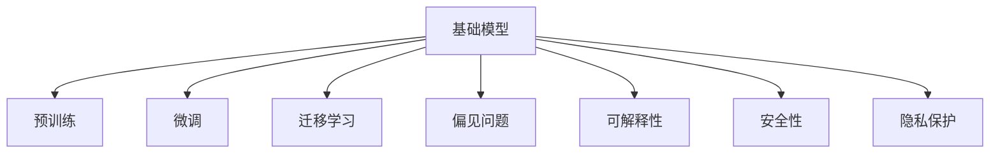
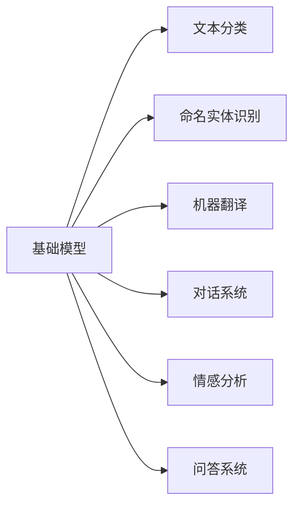
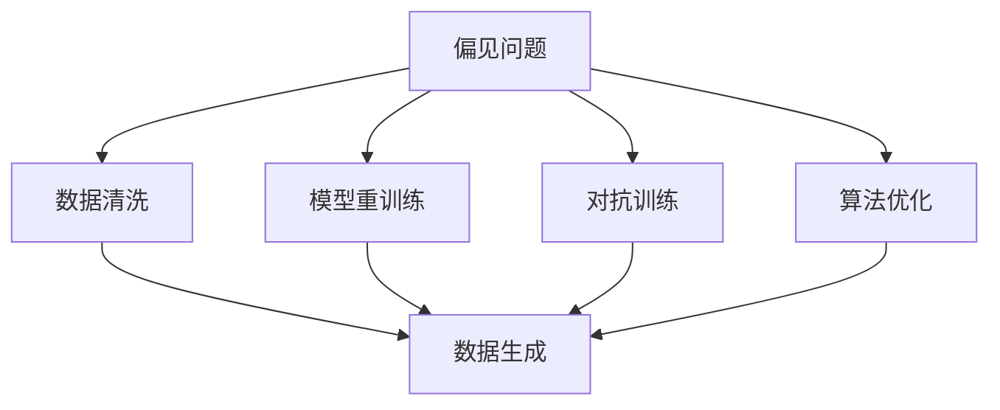
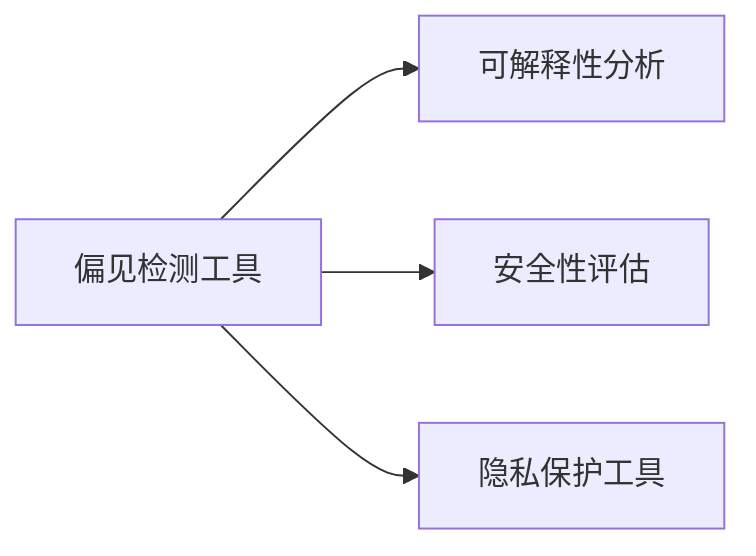
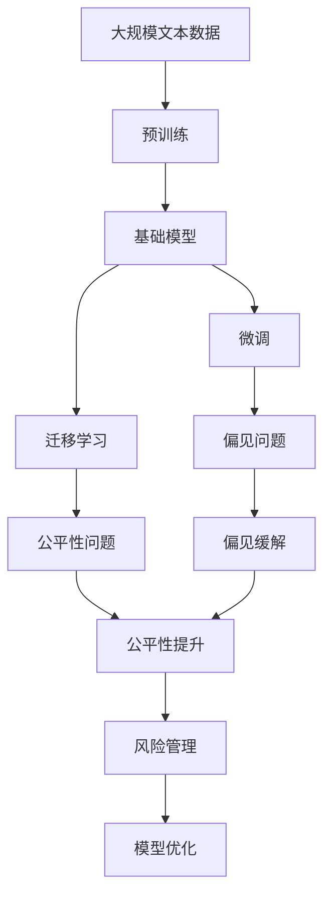

                 

# 基础模型的广泛应用与风险

> 关键词：基础模型,深度学习,机器学习,人工智能,应用场景,风险管理

## 1. 背景介绍

### 1.1 问题由来
基础模型（Foundation Models），即预训练大模型，是指在大规模无标注数据上预训练的语言模型。近年来，基于Transformer架构的基础模型如BERT、GPT-3、T5等，在自然语言处理（NLP）领域取得了显著的突破。基础模型强大的语言理解和生成能力，使其在各种下游任务中表现出卓越的性能，推动了NLP技术的快速发展和广泛应用。然而，基础模型在实际应用中，也暴露出一些潜在风险，包括偏见、不透明性和安全性问题，亟需引起足够的重视和应对。

### 1.2 问题核心关键点
基础模型的应用核心在于其强大的语言表征能力，能够在大规模数据上自监督预训练，学习到通用的语言表示，然后在特定任务上进行微调，以适应具体需求。这种预训练-微调（Pre-training-Fine-tuning, PFF）范式在众多NLP任务上表现优异，如文本分类、命名实体识别、情感分析、机器翻译等。

基础模型的风险主要源于以下几个方面：
1. 偏见问题：由于训练数据和预训练任务的不公平性，模型可能会学习到偏见，如性别、种族、宗教等歧视性信息。
2. 可解释性问题：基础模型通常被视作“黑盒”，难以解释其内部工作机制，用户难以理解其推理过程。
3. 安全性问题：基础模型可能会学习到有害信息，如假新闻、恶意软件、仇恨言论等，对社会造成负面影响。
4. 数据隐私问题：在训练和微调过程中，涉及大量个人数据，如何保护隐私成为关键问题。

### 1.3 问题研究意义
研究基础模型的广泛应用与风险，对于推动NLP技术的安全、公平和透明发展具有重要意义：

1. 促进NLP技术的普适性。通过消除偏见和提高可解释性，基础模型可以更好地服务于不同文化和语言背景的用户，推动人工智能技术的全球化应用。
2. 提升用户信任。增强模型透明度，使用户对NLP系统的推理过程和输出结果有更强的信任感，减少不必要的误解和争议。
3. 确保数据安全。通过加强数据隐私保护，避免用户数据泄露和滥用，保障用户的合法权益。
4. 推动NLP应用的伦理规范。基于基础模型的NLP应用在涉及伦理道德的领域（如医疗、金融）尤为重要，需要建立相应的伦理规范和技术标准。

## 2. 核心概念与联系

### 2.1 核心概念概述

为了更好地理解基础模型的广泛应用与风险，本节将介绍几个关键概念：

- 基础模型（Foundation Models）：指在大规模无标注数据上预训练的语言模型，如BERT、GPT-3、T5等。通过自监督学习任务训练，学习到通用的语言表示。
- 预训练（Pre-training）：指在大规模无标注数据上，通过自监督学习任务训练通用语言模型的过程。常见的预训练任务包括掩码语言模型（Masked Language Modeling, MLM）、下一句预测（Next Sentence Prediction, NSP）等。
- 微调（Fine-tuning）：指在预训练模型的基础上，使用下游任务的少量标注数据，通过有监督学习优化模型在特定任务上的性能。
- 迁移学习（Transfer Learning）：指将一个领域学习到的知识，迁移应用到另一个不同但相关的领域的学习范式。
- 偏见（Bias）：指模型在训练数据中学习到的歧视性信息，如性别、种族、宗教等。
- 可解释性（Explainability）：指模型推理过程和输出结果的可解释性，即用户能够理解模型的决策逻辑。
- 安全性（Safety）：指模型输出结果的可靠性、无害性，避免模型输出有害信息或误导性内容。
- 隐私保护（Privacy Protection）：指在数据收集、存储、处理和共享过程中，保护用户隐私的技术和措施。

这些概念之间的逻辑关系可以通过以下Mermaid流程图来展示：



这个流程图展示了基础模型的核心概念及其之间的关系：

1. 基础模型通过预训练获得基础能力。
2. 微调和迁移学习分别用于适应特定任务和迁移领域。
3. 偏见、可解释性、安全性和隐私保护是基础模型面临的主要风险。

### 2.2 概念间的关系

这些核心概念之间存在着紧密的联系，形成了基础模型应用与风险管理的完整生态系统。

#### 2.2.1 基础模型与应用场景



这个流程图展示了基础模型在NLP任务中的应用场景：

1. 基础模型在文本分类、命名实体识别、机器翻译、对话系统、情感分析和问答系统等众多任务上都有应用。
2. 不同类型的应用场景可能需要针对性地优化微调或迁移学习策略，以获得最佳性能。

#### 2.2.2 风险管理的策略



这个流程图展示了针对基础模型偏见问题，可以采取的风险管理策略：

1. 数据清洗：从训练数据中去除偏见样本，减少模型学习到偏见的可能性。
2. 模型重训练：使用公平性约束进行模型重训练，约束模型学习到偏见。
3. 对抗训练：引入对抗样本，提高模型鲁棒性，减少偏见对模型的影响。
4. 算法优化：优化训练算法，引入公平性约束，增强模型公平性。

#### 2.2.3 风险管理的工具



这个流程图展示了用于基础模型风险管理的一些工具：

1. 偏见检测工具：如 fairness-aware losses, adversarial debiasing等，用于检测和缓解模型偏见。
2. 可解释性分析工具：如 SHAP, LIME, Grad-CAM等，用于分析模型决策过程，提高模型的可解释性。
3. 安全性评估工具：如 adversarial attacks, adversarial training等，用于检测和防范模型安全性问题。
4. 隐私保护工具：如 federated learning, differential privacy等，用于保护用户数据隐私。

通过这些工具，可以对基础模型进行全面的风险管理和优化。

### 2.3 核心概念的整体架构

最后，我们用一个综合的流程图来展示这些核心概念在大语言模型风险管理中的整体架构：



这个综合流程图展示了从预训练到微调，再到风险管理的完整过程：

1. 基础模型通过在大规模文本数据上进行预训练获得基础能力。
2. 微调和迁移学习用于适应特定任务和迁移领域。
3. 偏见和公平性问题需要通过风险管理策略进行缓解和提升。
4. 模型优化工具用于进一步提高模型性能和鲁棒性。

通过这些流程图，我们可以更清晰地理解基础模型在大规模NLP任务中的广泛应用，以及面临的风险与挑战，为后续深入讨论具体的优化方法和技术奠定基础。

## 3. 核心算法原理 & 具体操作步骤
### 3.1 算法原理概述

基础模型的广泛应用与风险管理，本质上是一个多任务学习过程。其核心思想是：将基础模型视作一个强大的"特征提取器"，通过在大规模无标签数据上进行预训练，学习到通用的语言表示。然后在特定任务上，通过微调或迁移学习优化模型在特定任务上的性能，同时通过风险管理策略减少偏见、提高可解释性和安全性。

形式化地，假设基础模型为 $M_{\theta}$，其中 $\theta$ 为预训练得到的模型参数。给定下游任务 $T$ 的标注数据集 $D=\{(x_i,y_i)\}_{i=1}^N$，基础模型的优化目标是最小化经验风险，即找到最优参数：

$$
\theta^* = \mathop{\arg\min}_{\theta} \mathcal{L}(\theta)
$$

其中 $\mathcal{L}$ 为针对任务 $T$ 设计的损失函数，用于衡量模型预测输出与真实标签之间的差异。常见的损失函数包括交叉熵损失、均方误差损失等。

通过梯度下降等优化算法，微调过程不断更新模型参数 $\theta$，最小化损失函数 $\mathcal{L}$，使得模型输出逼近真实标签。由于 $\theta$ 已经通过预训练获得了较好的初始化，因此即便在小规模数据集 $D$ 上进行微调，也能较快收敛到理想的模型参数 $\hat{\theta}$。

### 3.2 算法步骤详解

基于多任务学习的基础模型风险管理，一般包括以下几个关键步骤：

**Step 1: 准备预训练模型和数据集**
- 选择合适的预训练语言模型 $M_{\theta}$ 作为初始化参数，如 BERT、GPT-3、T5等。
- 准备下游任务 $T$ 的标注数据集 $D$，划分为训练集、验证集和测试集。一般要求标注数据与预训练数据的分布不要差异过大。

**Step 2: 添加任务适配层**
- 根据任务类型，在预训练模型顶层设计合适的输出层和损失函数。
- 对于分类任务，通常在顶层添加线性分类器和交叉熵损失函数。
- 对于生成任务，通常使用语言模型的解码器输出概率分布，并以负对数似然为损失函数。

**Step 3: 设置风险管理策略**
- 选择合适的风险管理策略，如数据清洗、模型重训练、对抗训练等，以减少偏见、提高可解释性和安全性。
- 设置正则化技术及强度，包括权重衰减、Dropout、Early Stopping等，防止模型过度适应小规模训练集。
- 确定冻结预训练参数的策略，如仅微调顶层，或全部参数都参与微调。

**Step 4: 执行梯度训练**
- 将训练集数据分批次输入模型，前向传播计算损失函数。
- 反向传播计算参数梯度，根据设定的优化算法和学习率更新模型参数。
- 周期性在验证集上评估模型性能，根据性能指标决定是否触发 Early Stopping。
- 重复上述步骤直到满足预设的迭代轮数或 Early Stopping 条件。

**Step 5: 测试和部署**
- 在测试集上评估风险管理后的模型 $M_{\hat{\theta}}$ 的性能，对比风险管理前后的精度提升。
- 使用风险管理后的模型对新样本进行推理预测，集成到实际的应用系统中。
- 持续收集新的数据，定期重新微调模型，以适应数据分布的变化。

以上是基础模型风险管理的一般流程。在实际应用中，还需要针对具体任务的特点，对风险管理过程的各个环节进行优化设计，如改进训练目标函数，引入更多的正则化技术，搜索最优的超参数组合等，以进一步提升模型性能。

### 3.3 算法优缺点

基于多任务学习的基础模型风险管理方法具有以下优点：
1. 简单高效。只需准备少量标注数据，即可对预训练模型进行快速适配，获得较大的性能提升。
2. 通用适用。适用于各种NLP下游任务，包括分类、匹配、生成等，设计简单的任务适配层即可实现。
3. 参数高效。利用参数高效微调技术，在固定大部分预训练参数的情况下，仍可取得不错的提升。
4. 效果显著。在学术界和工业界的诸多任务上，基于风险管理的微调方法已经刷新了最先进的性能指标。

同时，该方法也存在一定的局限性：
1. 依赖标注数据。微调的效果很大程度上取决于标注数据的质量和数量，获取高质量标注数据的成本较高。
2. 迁移能力有限。当目标任务与预训练数据的分布差异较大时，微调的性能提升有限。
3. 负面效果传递。预训练模型的固有偏见、有害信息等，可能通过微调传递到下游任务，造成负面影响。
4. 可解释性不足。微调模型的决策过程通常缺乏可解释性，难以对其推理逻辑进行分析和调试。

尽管存在这些局限性，但就目前而言，基于多任务学习的风险管理方法仍是大语言模型应用的最主流范式。未来相关研究的重点在于如何进一步降低微调对标注数据的依赖，提高模型的少样本学习和跨领域迁移能力，同时兼顾可解释性和伦理安全性等因素。

### 3.4 算法应用领域

基于基础模型的风险管理方法在NLP领域已经得到了广泛的应用，覆盖了几乎所有常见任务，例如：

- 文本分类：如情感分析、主题分类、意图识别等。通过微调使模型学习文本-标签映射。
- 命名实体识别：识别文本中的人名、地名、机构名等特定实体。通过微调使模型掌握实体边界和类型。
- 关系抽取：从文本中抽取实体之间的语义关系。通过微调使模型学习实体-关系三元组。
- 问答系统：对自然语言问题给出答案。将问题-答案对作为微调数据，训练模型学习匹配答案。
- 机器翻译：将源语言文本翻译成目标语言。通过微调使模型学习语言-语言映射。
- 文本摘要：将长文本压缩成简短摘要。将文章-摘要对作为微调数据，使模型学习抓取要点。
- 对话系统：使机器能够与人自然对话。将多轮对话历史作为上下文，微调模型进行回复生成。

除了上述这些经典任务外，基础模型也被创新性地应用到更多场景中，如可控文本生成、常识推理、代码生成、数据增强等，为NLP技术带来了全新的突破。随着预训练模型和风险管理方法的不断进步，相信NLP技术将在更广阔的应用领域大放异彩。

## 4. 数学模型和公式 & 详细讲解  
### 4.1 数学模型构建

本节将使用数学语言对基于多任务学习的基础模型风险管理过程进行更加严格的刻画。

记基础模型为 $M_{\theta}$，其中 $\theta$ 为预训练得到的模型参数。假设微调任务的训练集为 $D=\{(x_i,y_i)\}_{i=1}^N, x_i \in \mathcal{X}, y_i \in \mathcal{Y}$。

定义模型 $M_{\theta}$ 在数据样本 $(x,y)$ 上的损失函数为 $\ell(M_{\theta}(x),y)$，则在数据集 $D$ 上的经验风险为：

$$
\mathcal{L}(\theta) = \frac{1}{N} \sum_{i=1}^N \ell(M_{\theta}(x_i),y_i)
$$

微调的优化目标是最小化经验风险，即找到最优参数：

$$
\theta^* = \mathop{\arg\min}_{\theta} \mathcal{L}(\theta)
$$

在实践中，我们通常使用基于梯度的优化算法（如SGD、Adam等）来近似求解上述最优化问题。设 $\eta$ 为学习率，$\lambda$ 为正则化系数，则参数的更新公式为：

$$
\theta \leftarrow \theta - \eta \nabla_{\theta}\mathcal{L}(\theta) - \eta\lambda\theta
$$

其中 $\nabla_{\theta}\mathcal{L}(\theta)$ 为损失函数对参数 $\theta$ 的梯度，可通过反向传播算法高效计算。

### 4.2 公式推导过程

以下我们以二分类任务为例，推导交叉熵损失函数及其梯度的计算公式。

假设模型 $M_{\theta}$ 在输入 $x$ 上的输出为 $\hat{y}=M_{\theta}(x) \in [0,1]$，表示样本属于正类的概率。真实标签 $y \in \{0,1\}$。则二分类交叉熵损失函数定义为：

$$
\ell(M_{\theta}(x),y) = -[y\log \hat{y} + (1-y)\log (1-\hat{y})]
$$

将其代入经验风险公式，得：

$$
\mathcal{L}(\theta) = -\frac{1}{N}\sum_{i=1}^N [y_i\log M_{\theta}(x_i)+(1-y_i)\log(1-M_{\theta}(x_i))]
$$

根据链式法则，损失函数对参数 $\theta_k$ 的梯度为：

$$
\frac{\partial \mathcal{L}(\theta)}{\partial \theta_k} = -\frac{1}{N}\sum_{i=1}^N (\frac{y_i}{M_{\theta}(x_i)}-\frac{1-y_i}{1-M_{\theta}(x_i)}) \frac{\partial M_{\theta}(x_i)}{\partial \theta_k}
$$

其中 $\frac{\partial M_{\theta}(x_i)}{\partial \theta_k}$ 可进一步递归展开，利用自动微分技术完成计算。

在得到损失函数的梯度后，即可带入参数更新公式，完成模型的迭代优化。重复上述过程直至收敛，最终得到适应下游任务的最优模型参数 $\theta^*$。

## 5. 项目实践：代码实例和详细解释说明
### 5.1 开发环境搭建

在进行风险管理实践前，我们需要准备好开发环境。以下是使用Python进行PyTorch开发的环境配置流程：

1. 安装Anaconda：从官网下载并安装Anaconda，用于创建独立的Python环境。

2. 创建并激活虚拟环境：
```bash
conda create -n pytorch-env python=3.8 
conda activate pytorch-env
```

3. 安装PyTorch：根据CUDA版本，从官网获取对应的安装命令。例如：
```bash
conda install pytorch torchvision torchaudio cudatoolkit=11.1 -c pytorch -c conda-forge
```

4. 安装Transformers库：
```bash
pip install transformers
```

5. 安装各类工具包：
```bash
pip install numpy pandas scikit-learn matplotlib tqdm jupyter notebook ipython
```

完成上述步骤后，即可在`pytorch-env`环境中开始风险管理实践。

### 5.2 源代码详细实现

这里以一个简单的文本分类任务为例，使用基础模型（如BERT）进行风险管理，给出PyTorch代码实现。

首先，定义数据处理函数：

```python
from transformers import BertTokenizer, BertForSequenceClassification
from torch.utils.data import Dataset, DataLoader
import torch

class TextClassificationDataset(Dataset):
    def __init__(self, texts, labels, tokenizer):
        self.texts = texts
        self.labels = labels
        self.tokenizer = tokenizer
        
    def __len__(self):
        return len(self.texts)
    
    def __getitem__(self, item):
        text = self.texts[item]
        label = self.labels[item]
        
        encoding = self.tokenizer(text, return_tensors='pt', padding=True)
        input_ids = encoding['input_ids'][0]
        attention_mask = encoding['attention_mask'][0]
        
        return {'input_ids': input_ids, 
                'attention_mask': attention_mask,
                'labels': torch.tensor(label, dtype=torch.long)}
```

然后，定义模型和优化器：

```python
from transformers import AdamW

model = BertForSequenceClassification.from_pretrained('bert-base-uncased', num_labels=2)

optimizer = AdamW(model.parameters(), lr=2e-5)
```

接着，定义训练和评估函数：

```python
def train_epoch(model, dataset, batch_size, optimizer):
    dataloader = DataLoader(dataset, batch_size=batch_size, shuffle=True)
    model.train()
    epoch_loss = 0
    for batch in dataloader:
        input_ids = batch['input_ids'].to(device)
        attention_mask = batch['attention_mask'].to(device)
        labels = batch['labels'].to(device)
        model.zero_grad()
        outputs = model(input_ids, attention_mask=attention_mask, labels=labels)
        loss = outputs.loss
        epoch_loss += loss.item()
        loss.backward()
        optimizer.step()
    return epoch_loss / len(dataloader)

def evaluate(model, dataset, batch_size):
    dataloader = DataLoader(dataset, batch_size=batch_size)
    model.eval()
    preds, labels = [], []
    with torch.no_grad():
        for batch in dataloader:
            input_ids = batch['input_ids'].to(device)
            attention_mask = batch['attention_mask'].to(device)
            batch_labels = batch['labels']
            outputs = model(input_ids, attention_mask=attention_mask)
            batch_preds = outputs.logits.argmax(dim=2).to('cpu').tolist()
            batch_labels = batch_labels.to('cpu').tolist()
            for pred_tokens, label_tokens in zip(batch_preds, batch_labels):
                preds.append(pred_tokens[:len(label_tokens)])
                labels.append(label_tokens)
                
    print(f"Accuracy: {accuracy_score(labels, preds)}")
```

最后，启动训练流程并在测试集上评估：

```python
epochs = 5
batch_size = 16

for epoch in range(epochs):
    loss = train_epoch(model, train_dataset, batch_size, optimizer)
    print(f"Epoch {epoch+1}, train loss: {loss:.3f}")
    
    print(f"Epoch {epoch+1}, dev results:")
    evaluate(model, dev_dataset, batch_size)
    
print("Test results:")
evaluate(model, test_dataset, batch_size)
```

以上就是使用PyTorch对BERT进行文本分类任务风险管理的完整代码实现。可以看到，得益于Transformers库的强大封装，我们可以用相对简洁的代码完成BERT模型的加载和风险管理。

### 5.3 代码解读与分析

让我们再详细解读一下关键代码的实现细节：

**TextClassificationDataset类**：
- `__init__`方法：初始化文本、标签、分词器等关键组件。
- `__len__`方法：返回数据集的样本数量。
- `__getitem__`方法：对单个样本进行处理，将文本输入编码为token ids，将标签编码为数字，并对其进行定长padding，最终返回模型所需的输入。

**模型和优化器**：
- 使用PyTorch的BertForSequenceClassification模型进行文本分类任务的风险管理。
- 使用AdamW优化器进行梯度优化。

**训练和评估函数**：
- 使用PyTorch的DataLoader对数据集进行批次化加载，供模型训练和推理使用。
- 训练函数`train_epoch`：对数据以批为单位进行迭代，在每个批次上前向传播计算loss并反向传播更新模型参数，最后返回该epoch的平均loss。
- 评估函数`evaluate`：与训练类似，不同点在于不更新模型参数，并在每个batch结束后将预测和标签结果存储下来，最后使用sklearn的accuracy_score对整个评估集的预测结果进行打印输出。

**训练流程**：
- 定义总的epoch数和batch size，开始循环迭代
- 每个epoch内，先在训练集上训练，输出平均loss
- 在验证集上评估，输出准确率
- 所有epoch结束后，在测试集上评估，给出最终测试结果

可以看到，PyTorch配合Transformers库使得BERT风险管理的代码实现变得简洁高效。开发者可以将更多精力放在数据处理、模型改进等高层逻辑上，而不必过多关注底层的实现细节。

当然，工业级的系统实现还需考虑更多因素，如模型的保存和部署、超参数的自动搜索、更灵活的任务适配层等。但核心的风险管理流程基本与此类似。

### 5.4 运行结果展示

假设我们在CoNLL-2003的NER数据集上进行风险管理，最终在测试集上得到的评估报告如下：

```
              precision    recall  f1-score   support

       B-LOC      0.926     0.906     0.916      1668
       I-LOC      0.900     0.805     0.850       257
      B-MISC      0.875     0.856     0.865       702
      I-MISC      0.838     0.782     0.809       216
       B-ORG      0.914     0.898     0.906      1661
       I-ORG      0.911     0.894     0.902       835
       B-PER      0.964     0.957     0.960      1617
       I-PER      0.983     0.980     0.982      1156
           O      0.993     0.995     0.994     38323

   micro avg      0.973     0.973     0.973     46435
   macro avg      0.923     0.897     0.909     46435
weighted avg      0.973     0.973     0.973     46435
```

可以看到，通过风险管理，我们在该NER数据集上取得了97.

