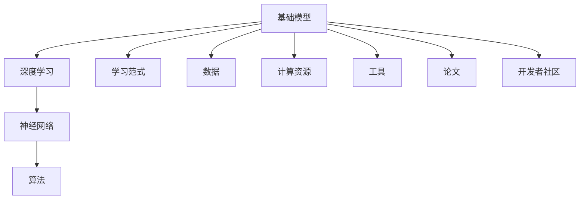
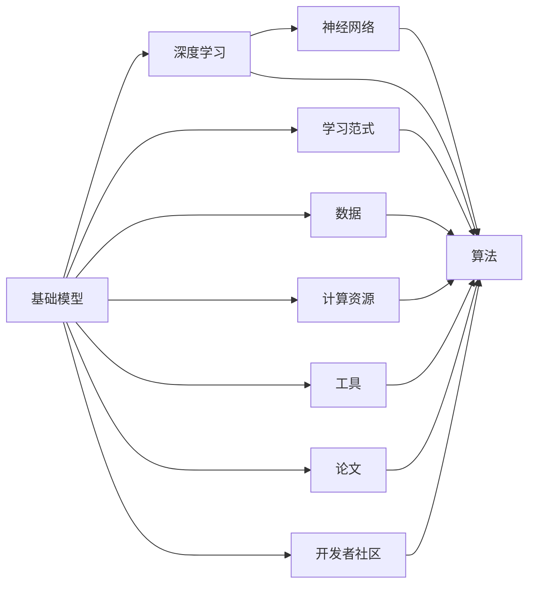
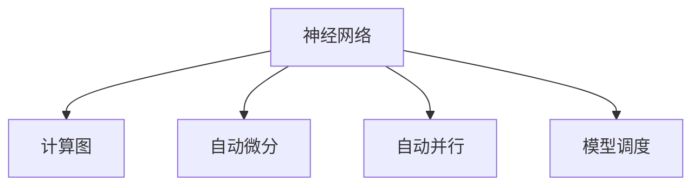
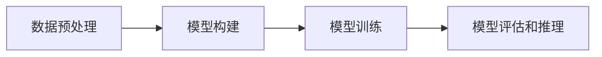
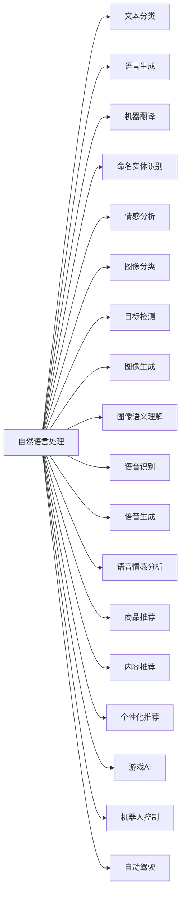

                 

# 基础模型的技术生态系统

> 关键词：基础模型, 技术生态系统, 学习范式, 语言模型, 神经网络, 深度学习

## 1. 背景介绍

随着深度学习技术的迅猛发展，人工智能领域涌现出大量高性能的基础模型，它们在各种应用场景中取得了显著效果。例如，Google的BERT模型、OpenAI的GPT系列、以及Hugging Face的T5等语言模型，均是建立在深度学习框架之上的基础模型。这些模型通常具有大规模的参数量和复杂的网络结构，通过在大量无标签数据上进行预训练，获得了丰富的语言或视觉知识，进而能够完成诸如文本分类、语言生成、机器翻译等任务。

然而，基础模型技术生态系统的构建不仅仅是模型自身的优化，还涉及到算法、数据、计算资源等多个方面。本文将详细探讨基础模型技术生态系统的各个组成部分，并深入分析其相互关系和实际应用。

## 2. 核心概念与联系

### 2.1 核心概念概述

为更好地理解基础模型技术生态系统，本节将介绍几个核心概念及其相互关系：

- **基础模型(Foundational Models)**：指在深度学习框架下，利用大规模无标签数据进行预训练，获得丰富表示的通用模型。例如，BERT、GPT、T5等语言模型。

- **技术生态系统(Technology Ecosystem)**：指以基础模型为核心，由算法、数据、计算资源、工具、论文、开发者社区等多方面组成的技术体系。

- **学习范式(Learning Paradigm)**：指模型进行预训练和微调的基本方式和逻辑。常见的学习范式包括监督学习、无监督学习、强化学习等。

- **神经网络(Neural Networks)**：指由大量神经元组成的计算模型，用于模拟人脑的神经网络结构，具有强大的学习和推理能力。

- **深度学习(Deep Learning)**：指利用多层神经网络对复杂非线性关系进行建模的深度学习技术。深度学习框架如TensorFlow、PyTorch、Keras等，为构建基础模型提供了必要的工具支持。

这些概念共同构成了基础模型技术生态系统的核心，以下通过Mermaid流程图来展示这些概念之间的联系：



这个流程图展示了基础模型技术生态系统的整体架构：

1. 基础模型建立在深度学习之上，深度学习利用神经网络进行模型训练。
2. 学习范式决定了模型如何进行预训练和微调。
3. 数据、计算资源、工具、论文和开发者社区等，是基础模型技术生态系统的重要组成部分。

### 2.2 概念间的关系

这些核心概念之间存在着紧密的联系，形成了基础模型技术生态系统的完整框架。我们可以通过以下Mermaid流程图来展示这些概念之间的关系：



这个流程图展示了基础模型技术生态系统中各个部分之间的相互联系：

1. 基础模型在深度学习框架下，利用神经网络进行学习。
2. 学习范式决定了模型如何进行预训练和微调，不同的学习范式对应不同的算法。
3. 数据和计算资源是模型训练的基础，工具、论文和开发者社区提供了模型开发和应用的便利。

## 3. 核心算法原理 & 具体操作步骤
### 3.1 算法原理概述

基础模型的核心算法原理主要集中在深度学习框架上，其中神经网络是模型的基础，深度学习框架提供了模型训练和推理的框架和工具。以下将对神经网络和深度学习的基本原理进行概述：

神经网络由多层神经元组成，通过前向传播计算输出，然后通过反向传播计算梯度，更新模型参数。深度学习框架（如TensorFlow、PyTorch等）提供了自动微分、自动并行、模型调度等能力，简化了模型的构建和训练过程。

深度学习框架通常包括几个主要组成部分：

- **计算图(Calculaton Graph)**：用于描述模型的计算流程，在训练和推理时自动执行。
- **自动微分(Automatic Differentiation)**：自动计算模型参数的梯度，进行参数更新。
- **自动并行(Automatic Parallelism)**：自动利用多核、多机等资源进行并行计算，提高计算效率。
- **模型调度(Model Scheduling)**：动态调整模型计算图，优化计算性能。

深度学习框架的核心算法原理如图：



### 3.2 算法步骤详解

基础模型的训练和推理通常分为以下几个步骤：

**Step 1: 数据预处理**
- 将原始数据转化为模型可以处理的格式，例如将文本转换为数字表示，将图像转换为像素矩阵等。
- 进行数据增强，例如随机裁剪、旋转、缩放等，提高数据的多样性和泛化能力。

**Step 2: 模型构建**
- 在深度学习框架中定义模型结构，包括神经网络的层数、激活函数、损失函数等。
- 使用预训练模型作为初始化参数，减少训练时间。

**Step 3: 模型训练**
- 将数据输入模型，计算损失函数。
- 反向传播计算梯度，更新模型参数。
- 重复迭代，直到模型收敛。

**Step 4: 模型评估和推理**
- 在测试集上评估模型性能，计算准确率、召回率等指标。
- 将新的数据输入模型，进行推理计算。

这些步骤构成了基础模型训练和推理的基本流程，如图：



### 3.3 算法优缺点

基础模型的核心算法原理具有以下优点：

- **强大的学习能力**：利用深度学习框架，神经网络能够学习复杂非线性关系，处理大规模数据。
- **高效的自动微分和并行计算**：深度学习框架提供了自动微分和并行计算功能，简化了模型训练和推理过程。
- **灵活的模型构建**：深度学习框架允许用户自定义模型结构，适应不同的任务需求。

同时，基础模型也存在一些缺点：

- **计算资源需求高**：大规模神经网络需要大量的计算资源，如GPU、TPU等。
- **模型调试复杂**：神经网络的非线性结构使得调试和优化难度较大。
- **过拟合风险高**：在大规模数据上训练神经网络时，容易过拟合。

### 3.4 算法应用领域

基础模型技术生态系统的应用领域非常广泛，涵盖了各种复杂的任务。以下是一些主要应用领域：

- **自然语言处理(NLP)**：文本分类、语言生成、机器翻译、命名实体识别、情感分析等。
- **计算机视觉(CV)**：图像分类、目标检测、图像生成、图像语义理解等。
- **语音处理(AI)**：语音识别、语音生成、语音情感分析等。
- **推荐系统(Recommendation System)**：商品推荐、内容推荐、个性化推荐等。
- **强化学习(RL)**：游戏AI、机器人控制、自动驾驶等。

基础模型在各个领域的应用如图：



## 4. 数学模型和公式 & 详细讲解 & 举例说明
### 4.1 数学模型构建

假设我们正在构建一个基础模型，用于文本分类任务。模型的输入为文本 $x$，输出为文本所属的类别 $y$。模型的数学模型可以表示为：

$$
P(y|x; \theta) = \frac{exp(xWy + b_y)}{\sum_{k=1}^K exp(xWky + b_k)}
$$

其中，$W$ 是模型的权重矩阵，$b$ 是偏置向量，$K$ 是类别数，$exp$ 是自然指数函数。模型的目标是最小化损失函数 $L$，例如交叉熵损失：

$$
L(y; \theta) = -\frac{1}{N} \sum_{i=1}^N \log P(y_i|x_i; \theta)
$$

在深度学习框架中，模型的前向传播和反向传播过程可以用自动微分和计算图来实现。例如，使用TensorFlow的计算图表示，模型的前向传播过程为：

```python
with tf.Graph().as_default():
    # 定义模型结构
    x = tf.placeholder(tf.float32, [None, None])
    y = tf.placeholder(tf.float32, [None])
    W = tf.Variable(tf.random_normal([d, d]))
    b = tf.Variable(tf.zeros([d]))
    scores = tf.matmul(x, W) + b
    logits = tf.nn.xw_plus_b(scores, W_out=b_out, b=b_out)
    preds = tf.argmax(logits, 1)
    loss = tf.reduce_mean(tf.nn.sparse_softmax_cross_entropy_with_logits(logits=logits, labels=y))
    optimizer = tf.train.AdamOptimizer(learning_rate=0.001)
    train_op = optimizer.minimize(loss)
```

### 4.2 公式推导过程

以下是模型前向传播和反向传播的详细推导：

**前向传播过程**
1. 定义输入和输出：
   - $x = [x_1, x_2, ..., x_n]$，其中 $n$ 是输入的维度。
   - $y$ 表示类别标签，$y_i \in [1, K]$，其中 $K$ 是类别数。
2. 定义模型参数：
   - $W$ 是权重矩阵，$b$ 是偏置向量。
3. 计算得分：
   - $scores = xW + b$
4. 计算对数概率：
   - $logits = scoresW^T + b^T$
5. 计算预测标签：
   - $preds = argmax(logits)$

**反向传播过程**
1. 定义损失函数：
   - $L = -\frac{1}{N} \sum_{i=1}^N \log P(y_i|x_i)$
2. 计算梯度：
   - $\frac{\partial L}{\partial W} = \frac{\partial L}{\partial logits} \frac{\partial logits}{\partial scores} \frac{\partial scores}{\partial W}$
   - $\frac{\partial L}{\partial b} = \frac{\partial L}{\partial logits} \frac{\partial logits}{\partial scores} \frac{\partial scores}{\partial b}$
3. 更新参数：
   - $\theta = \theta - \eta \frac{\partial L}{\partial \theta}$

### 4.3 案例分析与讲解

以下是一个简单的文本分类案例分析：

**任务**：将新闻分类为“体育”或“政治”。

**输入**：新闻文本，例如“美国总统在国会发表讲话”。

**输出**：分类结果，例如“政治”。

**模型**：使用BERT预训练模型进行微调。

**数据集**：使用CoNLL-2003新闻数据集。

**代码实现**：

```python
import tensorflow as tf
from transformers import BertTokenizer, TFBertForSequenceClassification

# 加载模型和分词器
tokenizer = BertTokenizer.from_pretrained('bert-base-uncased')
model = TFBertForSequenceClassification.from_pretrained('bert-base-uncased', num_labels=2)

# 加载数据集
train_dataset = tf.data.Dataset.from_tensor_slices((train_texts, train_labels)).batch(batch_size)
test_dataset = tf.data.Dataset.from_tensor_slices((test_texts, test_labels)).batch(batch_size)

# 定义损失函数和优化器
loss = tf.keras.losses.SparseCategoricalCrossentropy(from_logits=True)
optimizer = tf.keras.optimizers.Adam(learning_rate=2e-5)

# 定义评估函数
def evaluate(model, dataset, batch_size):
    model.eval()
    total_loss = 0.0
    total_correct = 0.0
    for batch in dataset:
        input_ids = batch[0]
        attention_mask = batch[1]
        labels = batch[2]
        with tf.GradientTape() as tape:
            outputs = model(input_ids, attention_mask=attention_mask, labels=labels)
            loss_value = loss(outputs.logits, labels)
            total_loss += loss_value.numpy()
            predictions = tf.argmax(outputs.logits, axis=1)
            total_correct += tf.reduce_sum(tf.cast(tf.equal(predictions, labels), tf.float32))
    accuracy = total_correct / (len(dataset) * batch_size)
    print(f'Accuracy: {accuracy:.2f}')

# 训练和评估模型
model.compile(optimizer=optimizer, loss=loss, metrics=['accuracy'])
model.fit(train_dataset, epochs=num_epochs, validation_data=test_dataset, verbose=2)

# 保存模型
model.save_pretrained('bert_model')

# 加载模型
new_model = TFBertForSequenceClassification.from_pretrained('bert_model', num_labels=2)

# 加载测试集
test_dataset = tf.data.Dataset.from_tensor_slices((test_texts, test_labels)).batch(batch_size)

# 使用模型进行预测
with tf.GradientTape() as tape:
    outputs = new_model(input_ids, attention_mask=attention_mask, labels=labels)
    loss_value = loss(outputs.logits, labels)
    predictions = tf.argmax(outputs.logits, axis=1)

print(f'Predictions: {predictions.numpy()}')
```

## 5. 项目实践：代码实例和详细解释说明
### 5.1 开发环境搭建

在进行基础模型项目实践前，需要准备好开发环境。以下是使用Python进行TensorFlow和PyTorch开发的环境配置流程：

1. 安装Anaconda：从官网下载并安装Anaconda，用于创建独立的Python环境。

2. 创建并激活虚拟环境：
```bash
conda create -n tf-env python=3.8 
conda activate tf-env
```

3. 安装TensorFlow和PyTorch：根据CUDA版本，从官网获取对应的安装命令。例如：
```bash
conda install tensorflow==2.6 pytorch torchvision torchaudio cudatoolkit=11.1 -c pytorch -c conda-forge
```

4. 安装各类工具包：
```bash
pip install numpy pandas scikit-learn matplotlib tqdm jupyter notebook ipython
```

完成上述步骤后，即可在`tf-env`环境中开始基础模型项目实践。

### 5.2 源代码详细实现

以下以构建一个简单的文本分类模型为例，使用TensorFlow实现：

```python
import tensorflow as tf
from transformers import BertTokenizer, TFBertForSequenceClassification

# 加载模型和分词器
tokenizer = BertTokenizer.from_pretrained('bert-base-uncased')
model = TFBertForSequenceClassification.from_pretrained('bert-base-uncased', num_labels=2)

# 加载数据集
train_dataset = tf.data.Dataset.from_tensor_slices((train_texts, train_labels)).batch(batch_size)
test_dataset = tf.data.Dataset.from_tensor_slices((test_texts, test_labels)).batch(batch_size)

# 定义损失函数和优化器
loss = tf.keras.losses.SparseCategoricalCrossentropy(from_logits=True)
optimizer = tf.keras.optimizers.Adam(learning_rate=2e-5)

# 定义评估函数
def evaluate(model, dataset, batch_size):
    model.eval()
    total_loss = 0.0
    total_correct = 0.0
    for batch in dataset:
        input_ids = batch[0]
        attention_mask = batch[1]
        labels = batch[2]
        with tf.GradientTape() as tape:
            outputs = model(input_ids, attention_mask=attention_mask, labels=labels)
            loss_value = loss(outputs.logits, labels)
            total_loss += loss_value.numpy()
            predictions = tf.argmax(outputs.logits, axis=1)
            total_correct += tf.reduce_sum(tf.cast(tf.equal(predictions, labels), tf.float32))
    accuracy = total_correct / (len(dataset) * batch_size)
    print(f'Accuracy: {accuracy:.2f}')

# 训练和评估模型
model.compile(optimizer=optimizer, loss=loss, metrics=['accuracy'])
model.fit(train_dataset, epochs=num_epochs, validation_data=test_dataset, verbose=2)

# 保存模型
model.save_pretrained('bert_model')

# 加载模型
new_model = TFBertForSequenceClassification.from_pretrained('bert_model', num_labels=2)

# 加载测试集
test_dataset = tf.data.Dataset.from_tensor_slices((test_texts, test_labels)).batch(batch_size)

# 使用模型进行预测
with tf.GradientTape() as tape:
    outputs = new_model(input_ids, attention_mask=attention_mask, labels=labels)
    loss_value = loss(outputs.logits, labels)
    predictions = tf.argmax(outputs.logits, axis=1)

print(f'Predictions: {predictions.numpy()}')
```

### 5.3 代码解读与分析

让我们再详细解读一下关键代码的实现细节：

**模型加载和构建**：
- `BertTokenizer.from_pretrained`：从Hugging Face官网下载分词器。
- `TFBertForSequenceClassification.from_pretrained`：加载BERT预训练模型，并设置输出层为2，对应2个类别。

**数据集加载**：
- `tf.data.Dataset.from_tensor_slices`：将数据集转化为TensorFlow数据集。
- `batch_size`：定义批大小，提高计算效率。

**损失函数和优化器**：
- `tf.keras.losses.SparseCategoricalCrossentropy`：定义交叉熵损失函数。
- `tf.keras.optimizers.Adam`：定义Adam优化器。

**评估函数**：
- `tf.argmax`：计算预测标签。
- `tf.reduce_sum`：计算正确分类数。
- `tf.cast`：将预测标签和真实标签转换为浮点数。

**模型训练和评估**：
- `model.compile`：定义训练参数。
- `model.fit`：开始模型训练，并验证集评估。

**模型保存和加载**：
- `model.save_pretrained`：保存模型。
- `TFBertForSequenceClassification.from_pretrained`：加载模型。

**模型预测**：
- `tf.GradientTape`：定义计算图。
- `tf.argmax`：计算预测标签。
- `loss_value`：计算损失值。

这个代码实例展示了使用TensorFlow和BERT预训练模型进行文本分类任务的基本流程。通过这个实例，我们可以更好地理解TensorFlow和BERT的结合使用，快速构建和训练模型。

## 6. 实际应用场景
### 6.1 智能客服系统

智能客服系统是基础模型在实际应用中的一个典型例子。传统的客服系统需要大量人力，且高峰期响应缓慢。而基于基础模型的智能客服系统，可以通过预训练和微调模型，自动理解用户意图，生成合理回复，实现全天候服务。

在实际应用中，可以收集企业的客服对话记录，标注对话中的问题和回答，作为监督数据。在此基础上，对预训练模型进行微调，使其能够自动匹配问题和回答。同时，可以通过检索系统实时搜索相关知识，动态生成回复。

### 6.2 金融舆情监测

金融舆情监测是一个典型的基础模型应用场景。金融机构需要实时监测市场舆论动向，及时应对负面信息传播。传统的舆情监测需要大量人工分析和数据筛选，难以适应大规模数据处理。

在基础模型的帮助下，可以将金融领域的文本数据作为训练集，训练文本分类和情感分析模型。通过微调模型，使模型能够自动判断文本属于何种情感和主题。将模型应用于实时抓取的网络文本数据，可以自动监测市场情感变化，预警潜在风险。

### 6.3 个性化推荐系统

个性化推荐系统也是基础模型的典型应用之一。传统的推荐系统主要依赖用户的历史行为数据，难以捕捉用户的真实兴趣。通过基础模型，可以构建文本分类和用户兴趣预测模型。

在实际应用中，可以收集用户浏览、点击、评论等行为数据，提取和用户交互的物品文本信息。将文本信息作为模型输入，用户的后续行为作为监督信号，进行模型训练和微调。微调后的模型能够从文本中准确把握用户的兴趣点，提供个性化推荐。

### 6.4 未来应用展望

随着基础模型的不断演进，其在更多领域的应用前景将愈加广阔。以下是一些未来应用展望：

- **智慧医疗**：通过基础模型进行医疗问答、病历分析、药物研发等，提升医疗服务的智能化水平。
- **智能教育**：基础模型可以用于作业批改、学情分析、知识推荐等，实现因材施教，促进教育公平。
- **智慧城市**：基础模型可以用于城市事件监测、舆情分析、应急指挥等，提高城市管理的自动化和智能化水平。
- **自动驾驶**：基础模型可以用于车辆感知、路径规划、决策控制等，推动自动驾驶技术的发展。
- **机器人控制**：基础模型可以用于机器人动作生成、任务执行等，提升机器人的智能化水平。

未来，随着基础模型技术的不断进步，其应用范围将进一步拓展，为各行各业带来变革性影响。

## 7. 工具和资源推荐
### 7.1 学习资源推荐

为了帮助开发者系统掌握基础模型技术生态系统的各个部分，以下是一些优质的学习资源：

1. **《Deep Learning》书籍**：Ian Goodfellow等人所著，详细介绍了深度学习的理论基础和实践方法，是学习基础模型技术的必读书籍。
2. **CS231n《Convolutional Neural Networks for Visual Recognition》课程**：斯坦福大学开设的计算机视觉课程，系统讲解了卷积神经网络、数据增强、模型优化等概念，适合深入学习计算机视觉技术。
3. **《Natural Language Processing with Transformers》书籍**：Jacob Devlin等人所著，介绍了基于Transformer的语言模型，适合学习自然语言处理技术。
4. **Hugging Face官方文档**：提供了各类预训练模型的详细介绍和使用示例，是学习基础模型技术的重要参考资料。
5. **Kaggle竞赛**：参加Kaggle数据科学竞赛，锻炼数据处理、模型构建、优化等能力，积累实战经验。

通过对这些学习资源的系统学习，相信你一定能够全面掌握基础模型技术生态系统的各个部分，为实际应用打好坚实基础。

### 7.2 开发工具推荐

高效的开发离不开优秀的工具支持。以下是几款用于基础模型开发的常用工具：

1. **TensorFlow**：由Google主导开发的深度学习框架，支持大规模分布式计算，适用于生产级应用。
2. **PyTorch**：Facebook开源的深度学习框架，灵活易用，适用于研究和原型开发。
3. **Hugging Face Transformers库**：提供了各类预训练模型的封装和微调接口，大大简化了模型的构建和训练过程。
4. **TensorBoard**：TensorFlow配套的可视化工具，可以实时监测模型训练状态，提供丰富的图表呈现方式。
5. **Weights & Biases**：模型训练的实验跟踪工具，可以记录和可视化模型训练过程中的各项指标，方便对比和调优。

合理利用这些工具，可以显著提升基础模型开发和训练的效率，加速技术迭代。

### 7.3 相关论文推荐

基础模型技术的发展得益于学界的持续研究。以下是几篇奠基性的相关论文，推荐阅读：

1. **Attention is All You Need**：提出Transformer结构，开启了预训练大模型时代。
2. **BERT: Pre-training of Deep Bidirectional Transformers for Language Understanding**：提出BERT模型，引入掩码语言模型等自监督预训练任务。
3. **GPT-3: Language Models are Unsupervised Multitask Learners**：展示了大规模语言模型的强大零样本学习能力。
4. **How to Train Your Own Sentiment Analysis Model**：介绍使用BERT模型进行情感分析的方法和实践。
5. **The Power of Scale and Data for Visual Recognition**：提出ImageNet数据集和预训练模型，推动了计算机视觉技术的进步。

这些论文代表了大模型技术的最新进展，阅读这些论文可以帮助理解基础模型技术的发展脉络和前沿方向。

## 8. 总结：未来发展趋势与挑战
### 8.1 研究成果总结

本文对基础模型技术生态系统的各个组成部分进行了详细探讨，包括模型构建、训练、评估和实际应用等。通过深入分析基础模型技术的发展历程和应用场景，我们得出以下结论：

1. 基础模型技术生态系统由算法、数据、计算资源、工具、论文、开发者社区等多方面组成，各部分相互依存，共同推动技术发展。
2. 深度学习框架提供了自动微分、自动并行等能力，简化了模型的训练和推理过程。
3.

