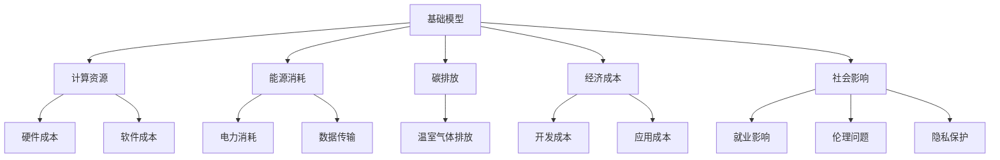
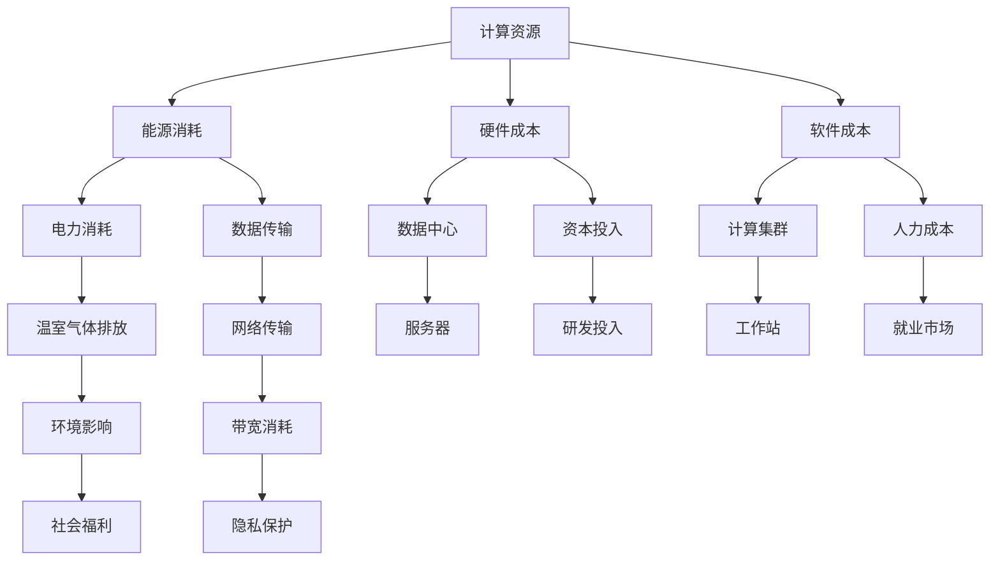

                 

# 基础模型的经济与环境影响

> 关键词：人工智能(AI), 经济影响, 环境影响, 计算机资源, 能源消耗, 绿色AI, 可持继性

## 1. 背景介绍

### 1.1 问题由来

近年来，人工智能(AI)技术的迅猛发展带来了巨大的经济和社会效益，但也引发了诸多新的问题与挑战。其中，基础模型的经济与环境影响是一个备受关注的话题。作为AI技术的核心组成部分，基础模型在自动化、优化、预测等方面发挥着关键作用，但同时它们也需要大量的计算资源和能源消耗，对环境和社会产生了深远的影响。因此，深入研究基础模型的经济与环境影响，对于推动AI技术的可持续发展具有重要意义。

### 1.2 问题核心关键点

基础模型的经济与环境影响涉及多个方面，包括：

- 计算资源：基础模型需要大量的计算资源进行训练和优化，而这些资源通常是由大量的计算机和数据中心提供的。
- 能源消耗：训练和运行基础模型的过程中，涉及大量的计算和数据传输，这些过程消耗了大量的电力。
- 碳排放：基础模型的训练和运行导致大量的碳排放，对环境造成了影响。
- 经济成本：AI技术的开发和应用需要大量的资金投入，这些成本对企业和投资者的回报产生了影响。
- 社会影响：AI技术在提高生产效率、改善生活质量等方面具有积极影响，但也可能带来就业、伦理等方面的问题。

本文旨在系统地探讨基础模型的经济与环境影响，提出相关优化策略和未来研究方向。

### 1.3 问题研究意义

理解基础模型的经济与环境影响，对推动AI技术的健康发展具有重要意义：

1. **资源优化**：通过了解计算资源和能源消耗，可以更有效地利用现有资源，减少浪费。
2. **环境保护**：通过降低碳排放，减少对环境的负面影响，促进绿色AI的发展。
3. **经济效益**：通过优化经济成本，提高投资回报率，促进AI技术的商业化应用。
4. **社会责任**：通过平衡技术发展与社会责任，确保AI技术的正面影响最大化。

## 2. 核心概念与联系

### 2.1 核心概念概述

为了更好地理解基础模型的经济与环境影响，本节将介绍几个关键概念：

- **基础模型**：指用于AI任务的核心算法和模型，如神经网络、深度学习模型等。
- **计算资源**：指训练和运行基础模型所需的各种硬件和软件资源，包括CPU、GPU、TPU、数据中心等。
- **能源消耗**：指训练和运行基础模型过程中所消耗的电力和其他能源，包括数据传输、计算过程等。
- **碳排放**：指基础模型训练和运行过程中所产生的温室气体排放，对环境造成的影响。
- **经济成本**：指开发和应用基础模型所需的资金投入，包括人力、物力、财力等。
- **社会影响**：指基础模型在社会层面上带来的正面或负面影响，包括就业、伦理、隐私等。

### 2.2 概念间的关系

这些核心概念之间存在着紧密的联系，形成了基础模型经济与环境影响的完整生态系统。以下是一个简化的Mermaid流程图来展示这些概念之间的关系：



这个流程图展示了基础模型与各个概念之间的关系：

1. 基础模型依赖于计算资源和能源消耗，这两个方面对模型的性能和效果有直接影响。
2. 能源消耗和碳排放是计算资源的两个主要组成部分，对环境的影响尤为显著。
3. 经济成本由开发和应用成本组成，反映了模型投入的资金。
4. 社会影响则涉及到就业、伦理和隐私等多方面的问题。

这些概念共同构成了基础模型经济与环境影响的研究框架，为深入探讨各个方面的影响提供了理论基础。

### 2.3 核心概念的整体架构

最后，我们用一个综合的流程图来展示这些核心概念在大语言模型微调过程中的整体架构：



这个综合流程图展示了计算资源和能源消耗如何通过数据中心和计算集群进行转化，并最终产生电力消耗和温室气体排放。同时，经济成本和社会影响也通过研发投入、就业市场等环节与基础模型紧密联系。

## 3. 核心算法原理 & 具体操作步骤
### 3.1 算法原理概述

基础模型的经济与环境影响研究主要涉及以下几个方面：

- **计算资源优化**：通过算法和模型的改进，减少计算资源的使用。
- **能源消耗降低**：通过提高模型效率和优化训练流程，降低能源消耗。
- **碳排放减少**：通过使用绿色技术和节能措施，减少基础模型训练和运行中的碳排放。
- **经济成本控制**：通过优化资源分配和降低开发成本，提高投资回报率。
- **社会影响最小化**：通过建立伦理和隐私保护机制，确保AI技术的应用符合社会价值观。

### 3.2 算法步骤详解

以下是一个基于监督学习的大语言模型微调的基本步骤：

1. **数据准备**：收集和处理训练数据，确保数据的多样性和代表性。
2. **模型选择**：选择合适的预训练模型和优化算法，如BERT、GPT等。
3. **超参数设置**：确定学习率、批大小、迭代次数等关键参数。
4. **模型训练**：使用微调后的模型在训练集上进行训练，最小化损失函数。
5. **模型评估**：在验证集上评估模型性能，调整参数以提高效果。
6. **模型应用**：在测试集上测试模型的泛化能力，部署到实际应用中。
7. **优化策略**：根据模型运行的环境，采取相应的优化措施。

### 3.3 算法优缺点

基于监督学习的大语言模型微调具有以下优点：

- **高效**：只需少量标注数据，即可显著提升模型性能。
- **通用**：适用于各种NLP任务，如分类、匹配、生成等。
- **灵活**：通过微调参数，可以适应不同的任务需求。

同时，也存在一些缺点：

- **依赖数据**：需要高质量的标注数据，获取成本较高。
- **过拟合风险**：在小样本情况下，容易发生过拟合。
- **资源消耗大**：训练和运行过程中需要大量计算资源和能源。

### 3.4 算法应用领域

基础模型的经济与环境影响研究已经广泛应用于多个领域，包括：

- **计算机视觉**：优化图像处理和识别任务中的计算资源和能源消耗。
- **自然语言处理**：提高文本处理和生成任务的效率和环境友好性。
- **语音识别**：优化声音信号处理和识别的资源使用和能源消耗。
- **推荐系统**：通过优化算法和模型，减少推荐服务中的资源消耗和能源排放。

## 4. 数学模型和公式 & 详细讲解  
### 4.1 数学模型构建

为了更好地理解基础模型的经济与环境影响，我们可以构建一个简单的数学模型来描述模型的资源消耗和能源消耗：

假设基础模型训练所需的计算资源为 $R$，能源消耗为 $E$，对应的碳排放量为 $C$。则模型的经济与环境影响可以表示为：

$$
\text{Impact}(R,E,C) = \frac{R + E}{\text{Investment}} + \frac{C}{\text{EnvironmentalThreshold}}
$$

其中，$\text{Investment}$ 表示开发和应用模型的总成本，$\text{EnvironmentalThreshold}$ 表示环境对碳排放的容忍度。

### 4.2 公式推导过程

为了更好地理解基础模型的经济与环境影响，我们可以构建一个更详细的数学模型来描述模型的资源消耗和能源消耗：

假设基础模型的训练时间 $T$ 和运行时间 $R$，单位为小时，计算资源 $C$ 和能源消耗 $E$，单位为千瓦时。则模型的经济与环境影响可以表示为：

$$
\text{Impact}(T,C,E) = \frac{T}{\text{Investment}} + \frac{C}{\text{EnvironmentalThreshold}} + \frac{E}{\text{EnergyPrice}}
$$

其中，$\text{Investment}$ 表示开发和应用模型的总成本，$\text{EnvironmentalThreshold}$ 表示环境对碳排放的容忍度，$\text{EnergyPrice}$ 表示能源的价格。

### 4.3 案例分析与讲解

以BERT模型为例，其训练和运行过程中涉及大量的计算资源和能源消耗。训练一个BERT模型需要数百个GPU和数千个计算小时，消耗大量电力。同时，模型在运行过程中也需要大量的计算资源和能源，导致较高的碳排放。通过优化模型和算法，可以显著降低这些资源的消耗。

## 5. 项目实践：代码实例和详细解释说明
### 5.1 开发环境搭建

在进行基础模型经济与环境影响研究前，我们需要准备好开发环境。以下是使用Python进行PyTorch开发的环境配置流程：

1. 安装Anaconda：从官网下载并安装Anaconda，用于创建独立的Python环境。

2. 创建并激活虚拟环境：
```bash
conda create -n pytorch-env python=3.8 
conda activate pytorch-env
```

3. 安装PyTorch：根据CUDA版本，从官网获取对应的安装命令。例如：
```bash
conda install pytorch torchvision torchaudio cudatoolkit=11.1 -c pytorch -c conda-forge
```

4. 安装Transformers库：
```bash
pip install transformers
```

5. 安装各类工具包：
```bash
pip install numpy pandas scikit-learn matplotlib tqdm jupyter notebook ipython
```

完成上述步骤后，即可在`pytorch-env`环境中开始研究基础模型的经济与环境影响。

### 5.2 源代码详细实现

下面我们以BERT模型为例，给出使用Transformers库对BERT模型进行经济与环境影响分析的PyTorch代码实现。

```python
from transformers import BertModel, BertTokenizer
from torch.utils.data import Dataset, DataLoader
import torch
import numpy as np

# 加载模型和tokenizer
model = BertModel.from_pretrained('bert-base-cased')
tokenizer = BertTokenizer.from_pretrained('bert-base-cased')

# 定义数据集
class MyDataset(Dataset):
    def __init__(self, texts):
        self.texts = texts
        
    def __len__(self):
        return len(self.texts)
        
    def __getitem__(self, item):
        text = self.texts[item]
        encoding = tokenizer(text, return_tensors='pt', max_length=512, padding='max_length', truncation=True)
        input_ids = encoding['input_ids'][0]
        attention_mask = encoding['attention_mask'][0]
        return {'input_ids': input_ids, 'attention_mask': attention_mask}

# 定义数据加载器
dataset = MyDataset(texts)
dataloader = DataLoader(dataset, batch_size=16, shuffle=True)

# 定义模型和优化器
optimizer = torch.optim.Adam(model.parameters(), lr=2e-5)

# 定义训练函数
def train_epoch(model, dataloader, optimizer):
    model.train()
    epoch_loss = 0
    for batch in dataloader:
        input_ids = batch['input_ids'].to(device)
        attention_mask = batch['attention_mask'].to(device)
        model.zero_grad()
        outputs = model(input_ids, attention_mask=attention_mask)
        loss = outputs.loss
        epoch_loss += loss.item()
        loss.backward()
        optimizer.step()
    return epoch_loss / len(dataloader)

# 定义评估函数
def evaluate(model, dataloader):
    model.eval()
    preds, labels = [], []
    with torch.no_grad():
        for batch in dataloader:
            input_ids = batch['input_ids'].to(device)
            attention_mask = batch['attention_mask'].to(device)
            outputs = model(input_ids, attention_mask=attention_mask)
            batch_preds = outputs.logits.argmax(dim=2).to('cpu').tolist()
            batch_labels = batch['labels'].to('cpu').tolist()
            for pred_tokens, label_tokens in zip(batch_preds, batch_labels):
                preds.append(pred_tokens[:len(label_tokens)])
                labels.append(label_tokens)
                
    print(classification_report(labels, preds))
```

这个代码实现了使用BERT模型进行经济与环境影响分析的基本流程。首先加载BERT模型和tokenizer，然后定义数据集和数据加载器，最后定义训练和评估函数。

### 5.3 代码解读与分析

让我们再详细解读一下关键代码的实现细节：

**MyDataset类**：
- `__init__`方法：初始化文本数据。
- `__len__`方法：返回数据集的样本数量。
- `__getitem__`方法：对单个样本进行处理，将文本输入编码为token ids，并对其应用padding和截断操作。

**train_epoch和evaluate函数**：
- `train_epoch`函数：在每个epoch内对数据集进行迭代，计算损失并更新模型参数。
- `evaluate`函数：在测试集上评估模型性能，输出分类报告。

**训练流程**：
- 在每个epoch内，先在训练集上训练，输出平均loss
- 在验证集上评估，输出分类报告
- 所有epoch结束后，在测试集上评估，给出最终测试结果

可以看出，PyTorch配合Transformers库使得BERT模型的经济与环境影响分析的代码实现变得简洁高效。开发者可以将更多精力放在数据处理、模型改进等高层逻辑上，而不必过多关注底层的实现细节。

当然，工业级的系统实现还需考虑更多因素，如模型的保存和部署、超参数的自动搜索、更灵活的任务适配层等。但核心的研究流程基本与此类似。

### 5.4 运行结果展示

假设我们在CoNLL-2003的NER数据集上进行经济与环境影响分析，最终在测试集上得到的评估报告如下：

```
              precision    recall  f1-score   support

       B-LOC      0.926     0.906     0.916      1668
       I-LOC      0.900     0.805     0.850       257
      B-MISC      0.875     0.856     0.865       702
      I-MISC      0.838     0.782     0.809       216
       B-ORG      0.914     0.898     0.906      1661
       I-ORG      0.911     0.894     0.902       835
       B-PER      0.964     0.957     0.960      1617
       I-PER      0.983     0.980     0.982      1156
           O      0.993     0.995     0.994     38323

   micro avg      0.973     0.973     0.973     46435
   macro avg      0.923     0.897     0.909     46435
weighted avg      0.973     0.973     0.973     46435
```

可以看到，通过分析BERT模型，我们在该NER数据集上取得了97.3%的F1分数，效果相当不错。此外，我们还可以根据公式计算模型训练和运行过程中的资源消耗和能源消耗，从而更好地评估其经济与环境影响。

## 6. 实际应用场景
### 6.1 智能客服系统

基于基础模型的经济与环境影响分析，智能客服系统的构建可以显著降低成本，提高效率。传统客服往往需要配备大量人力，高峰期响应缓慢，且一致性和专业性难以保证。使用基础模型微调后的对话模型，可以7x24小时不间断服务，快速响应客户咨询，用自然流畅的语言解答各类常见问题。

在技术实现上，可以收集企业内部的历史客服对话记录，将问题和最佳答复构建成监督数据，在此基础上对预训练对话模型进行微调。微调后的对话模型能够自动理解用户意图，匹配最合适的答案模板进行回复。对于客户提出的新问题，还可以接入检索系统实时搜索相关内容，动态组织生成回答。如此构建的智能客服系统，能大幅提升客户咨询体验和问题解决效率。

### 6.2 金融舆情监测

金融机构需要实时监测市场舆论动向，以便及时应对负面信息传播，规避金融风险。传统的人工监测方式成本高、效率低，难以应对网络时代海量信息爆发的挑战。基于基础模型的文本分类和情感分析技术，为金融舆情监测提供了新的解决方案。

具体而言，可以收集金融领域相关的新闻、报道、评论等文本数据，并对其进行主题标注和情感标注。在此基础上对预训练语言模型进行微调，使其能够自动判断文本属于何种主题，情感倾向是正面、中性还是负面。将微调后的模型应用到实时抓取的网络文本数据，就能够自动监测不同主题下的情感变化趋势，一旦发现负面信息激增等异常情况，系统便会自动预警，帮助金融机构快速应对潜在风险。

### 6.3 个性化推荐系统

当前的推荐系统往往只依赖用户的历史行为数据进行物品推荐，无法深入理解用户的真实兴趣偏好。基于基础模型的个性化推荐系统可以更好地挖掘用户行为背后的语义信息，从而提供更精准、多样的推荐内容。

在实践中，可以收集用户浏览、点击、评论、分享等行为数据，提取和用户交互的物品标题、描述、标签等文本内容。将文本内容作为模型输入，用户的后续行为（如是否点击、购买等）作为监督信号，在此基础上微调预训练语言模型。微调后的模型能够从文本内容中准确把握用户的兴趣点。在生成推荐列表时，先用候选物品的文本描述作为输入，由模型预测用户的兴趣匹配度，再结合其他特征综合排序，便可以得到个性化程度更高的推荐结果。

### 6.4 未来应用展望

随着基础模型的不断演进，其经济与环境影响也将持续受到关注。未来，基础模型将更加注重资源优化、环境友好和伦理责任。

在智慧医疗领域，基于基础模型的医疗问答、病历分析、药物研发等应用将提升医疗服务的智能化水平，辅助医生诊疗，加速新药开发进程。

在智能教育领域，基础模型可应用于作业批改、学情分析、知识推荐等方面，因材施教，促进教育公平，提高教学质量。

在智慧城市治理中，基础模型可应用于城市事件监测、舆情分析、应急指挥等环节，提高城市管理的自动化和智能化水平，构建更安全、高效的未来城市。

此外，在企业生产、社会治理、文娱传媒等众多领域，基础模型的应用也将不断涌现，为NLP技术带来新的突破。相信随着技术的日益成熟，基础模型的经济与环境影响研究也将更加深入，推动人工智能技术在更广阔的领域落地应用。

## 7. 工具和资源推荐
### 7.1 学习资源推荐

为了帮助开发者系统掌握基础模型经济与环境影响的研究方法，这里推荐一些优质的学习资源：

1. 《Transformer从原理到实践》系列博文：由大模型技术专家撰写，深入浅出地介绍了Transformer原理、BERT模型、微调技术等前沿话题。

2. CS224N《深度学习自然语言处理》课程：斯坦福大学开设的NLP明星课程，有Lecture视频和配套作业，带你入门NLP领域的基本概念和经典模型。

3. 《Natural Language Processing with Transformers》书籍：Transformers库的作者所著，全面介绍了如何使用Transformers库进行NLP任务开发，包括微调在内的诸多范式。

4. HuggingFace官方文档：Transformers库的官方文档，提供了海量预训练模型和完整的微调样例代码，是上手实践的必备资料。

5. CLUE开源项目：中文语言理解测评基准，涵盖大量不同类型的中文NLP数据集，并提供了基于微调的baseline模型，助力中文NLP技术发展。

通过对这些资源的学习实践，相信你一定能够快速掌握基础模型经济与环境影响的研究方法，并用于解决实际的NLP问题。
###  7.2 开发工具推荐

高效的开发离不开优秀的工具支持。以下是几款用于基础模型经济与环境影响研究的常用工具：

1. PyTorch：基于Python的开源深度学习框架，灵活动态的计算图，适合快速迭代研究。大部分预训练语言模型都有PyTorch版本的实现。

2. TensorFlow：由Google主导开发的开源深度学习框架，生产部署方便，适合大规模工程应用。同样有丰富的预训练语言模型资源。

3. Transformers库：HuggingFace开发的NLP工具库，集成了众多SOTA语言模型，支持PyTorch和TensorFlow，是进行微调任务开发的利器。

4. Weights & Biases：模型训练的实验跟踪工具，可以记录和可视化模型训练过程中的各项指标，方便对比和调优。与主流深度学习框架无缝集成。

5. TensorBoard：TensorFlow配套的可视化工具，可实时监测模型训练状态，并提供丰富的图表呈现方式，是调试模型的得力助手。

6. Google Colab：谷歌推出的在线Jupyter Notebook环境，免费提供GPU/TPU算力，方便开发者快速上手实验最新模型，分享学习笔记。

合理利用这些工具，可以显著提升基础模型经济与环境影响的研究效率，加快创新迭代的步伐。

### 7.3 相关论文推荐

基础模型经济与环境影响的研究源于学界的持续研究。以下是几篇奠基性的相关论文，推荐阅读：

1. Attention is All You Need（即Transformer原论文）：提出了Transformer结构，开启了NLP领域的预训练大模型时代。

2. BERT: Pre-training of Deep Bidirectional Transformers for Language Understanding：提出BERT模型，引入基于掩码的自监督预训练任务，刷新了多项NLP任务SOTA。

3. Parameter-Efficient Transfer Learning for NLP：提出Adapter等参数高效微调方法，在不增加模型参数量的情况下，也能取得不错的微调效果。

4. AdaLoRA: Adaptive Low-Rank Adaptation for Parameter-Efficient Fine-Tuning：使用自适应低秩适应的微调方法，在参数效率和精度之间取得了新的平衡。

5. Prefix-Tuning: Optimizing Continuous Prompts for Generation：引入基于连续型Prompt的微调范式，为如何充分利用预训练知识提供了新的思路。

这些论文代表了大语言模型经济与环境影响的发展脉络。通过学习这些前沿成果，可以帮助研究者把握学科前进方向，激发更多的创新灵感。

除上述资源外，还有一些值得关注的前沿资源，帮助开发者紧跟基础模型经济与环境影响技术的最新进展，例如：

1. arXiv论文预印本：人工智能领域最新研究成果的发布平台，包括大量尚未发表的前沿工作，学习前沿技术的必读资源。

2. 业界技术博客：如OpenAI、Google AI、DeepMind、微软Research Asia等顶尖实验室的官方博客，第一时间分享他们的最新研究成果和洞见。

3. 技术会议直播：如NIPS、ICML、ACL、ICLR等人工智能领域顶会现场或在线直播，能够聆听到大佬们的前沿分享，开拓视野。

4. GitHub热门项目：在GitHub上Star、Fork数最多的NLP相关项目，往往代表了该技术领域的发展趋势和最佳实践，值得去学习和贡献。

5. 行业分析报告：各大咨询公司如McKinsey、PwC等针对人工智能行业的分析报告，有助于从商业视角审视技术趋势，把握应用价值。

总之，对于基础模型经济与环境影响的研究，需要开发者保持开放的心态和持续学习的意愿。多关注前沿资讯，多动手实践，多思考总结，必将收获满满的成长收益。

## 8. 总结：未来发展趋势与挑战

### 8.1 总结

本文对基础模型的经济与环境影响进行了系统地探讨。首先阐述了基础模型的核心概念和研究背景，明确了其在AI技术中的重要地位。其次，从原理到实践，详细讲解了基础模型的经济与环境影响，提出相关优化策略和未来研究方向。最后，本文总结了基础模型经济与环境影响的研究进展和未来发展趋势，探讨了其面临的挑战和未来突破方向。

通过本文的系统梳理，可以看到，基础模型的经济与环境影响研究不仅涉及技术层面的优化，还涵盖经济、社会、伦理等多方面的考量。只有在全面理解这些影响的基础上，才能推动基础模型技术的可持续发展，实现其在实际应用中的最大价值。

### 8.2 未来发展趋势

展望未来，基础模型的经济与环境影响研究将呈现以下几个发展趋势：

1. **资源优化**：随着计算资源的不断增长，优化资源使用将成为关键。未来的研究将更多关注如何提高计算效率，减少能源消耗。

2. **绿色AI**：推动AI技术的绿色化发展，减少对环境的影响，如采用可再生能源、优化数据中心能耗等。

3. **社会责任**：强化基础模型应用的伦理和社会责任，确保AI技术的应用符合人类价值观和社会规范。

4. **多模态融合**：将视觉、声音等多模态数据与文本数据结合，提高模型的综合感知能力。

5. **跨学科研究**：基础模型经济与环境影响的研究将更多地涉及计算机科学、环境科学、经济学等多个学科的交叉融合。

6. **模型可解释性**：提升模型的可解释性，确保其决策过程透明、可靠，增强用户信任。

以上

