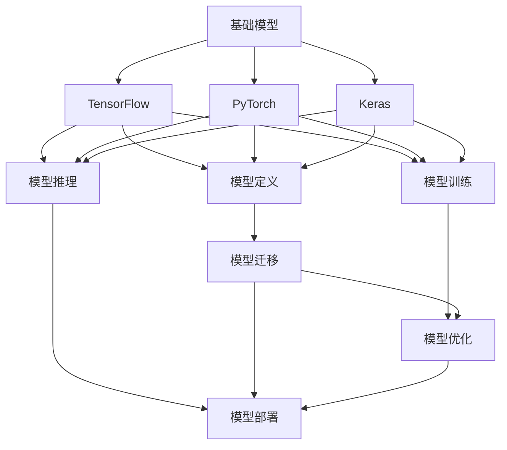
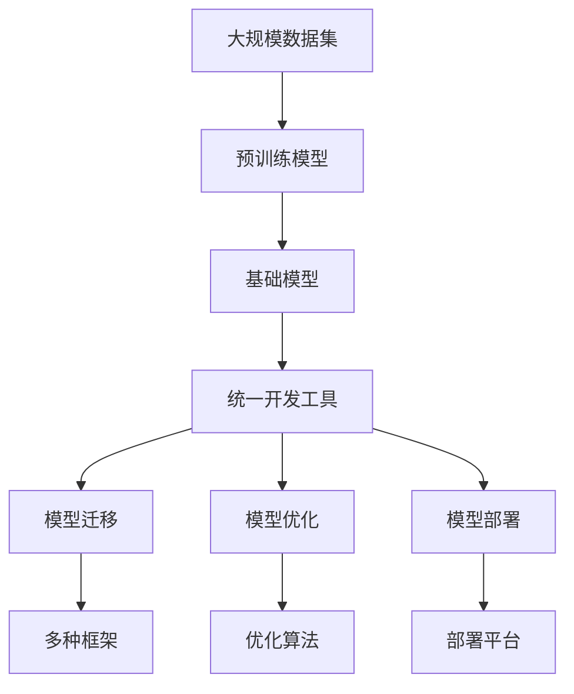

                 

# 基础模型的统一开发工具

> 关键词：基础模型, 统一开发, 深度学习框架, TensorFlow, PyTorch, Keras, 模型管理, 模块化开发

## 1. 背景介绍

### 1.1 问题由来

在深度学习的发展过程中，众多开发者和研究者为了应对不同的应用场景，开发了多种深度学习框架，如TensorFlow、PyTorch、Keras等。这些框架各具特色，功能强大，但导致开发者需要学习多种语言和语法，进行重复性工作，难以实现快速开发。

### 1.2 问题核心关键点

解决这一问题的关键在于构建一个统一的开发工具，即“基础模型的统一开发工具”，旨在为深度学习开发者提供一个通用的模型管理和模块化开发平台，实现跨框架模型的一致性、开发效率和可移植性。

### 1.3 问题研究意义

1. **简化开发流程**：统一的开发工具能够大大简化深度学习模型的开发流程，避免开发者重复学习不同框架的使用，提高开发效率。
2. **提高模型复用性**：通过统一的模型管理，开发者可以快速地在不同框架之间迁移模型，提升模型的复用性。
3. **增强可移植性**：统一的开发工具支持多种硬件平台，保证模型的跨平台可移植性。
4. **促进知识共享**：统一的开发工具有助于学术界和工业界之间的知识共享和交流，推动深度学习技术的普及和应用。

## 2. 核心概念与联系

### 2.1 核心概念概述

- **基础模型**：指已经在大规模数据上预训练的深度学习模型，如ResNet、BERT等。这些模型可以用于多种下游任务，是深度学习应用的核心组件。
- **深度学习框架**：指提供模型定义、训练、推理等功能的开发环境，如TensorFlow、PyTorch、Keras等。
- **统一开发工具**：指为多个深度学习框架提供统一接口和功能的工具，帮助开发者更高效地进行模型开发、部署和管理。

### 2.2 核心概念之间的关系

通过以下Mermaid流程图，我们可以更清晰地理解这些核心概念之间的联系：



该流程图展示了基础模型与深度学习框架之间的联系，以及模型迁移、优化和部署的过程。基础模型可以在多个深度学习框架上实现迁移和优化，通过统一的开发工具进行部署和管理。

### 2.3 核心概念的整体架构

最后，我们用一个综合的流程图来展示这些核心概念在大规模深度学习模型开发过程中的整体架构：



这个综合流程图展示了从大规模数据预训练，到基础模型构建，再到统一开发工具的使用，最后实现模型迁移、优化和部署的完整过程。通过这些步骤，开发者可以高效地开发和部署深度学习模型，解决不同框架之间的兼容性问题，实现模型的一致性和可移植性。

## 3. 核心算法原理 & 具体操作步骤
### 3.1 算法原理概述

基础模型的统一开发工具，其核心算法原理主要涉及模型迁移和优化两个方面。模型迁移是指在多个深度学习框架之间迁移模型，保持模型的一致性和兼容性；模型优化则包括模型的迁移后调优和模型优化算法。

### 3.2 算法步骤详解

以下是基于基础模型的统一开发工具的核心算法步骤：

1. **模型导入与导出**：
   - 通过统一的API接口，将基础模型导出到其他框架下的兼容格式，如TensorFlow的GraphDef格式、PyTorch的Tensor数据结构等。
   - 使用这些兼容格式，将模型导入其他框架，进行迁移。

2. **模型优化**：
   - 通过统一的工具，对迁移后的模型进行优化，如参数微调、正则化、模型剪枝等，提升模型的性能和效率。
   - 支持多种优化算法，如随机梯度下降、Adam、Adagrad等，根据具体任务和数据进行调整。

3. **模型迁移与适配**：
   - 对迁移后的模型进行适配，以适应不同框架的接口和数据处理流程。
   - 支持多种框架的适配，如TensorFlow、PyTorch、Keras等。

### 3.3 算法优缺点

基础模型的统一开发工具的主要优点包括：

- **跨框架兼容性**：支持多种深度学习框架之间的模型迁移和适配，提升模型的复用性和可移植性。
- **高效开发**：统一的工具和API接口，简化了模型开发流程，提高开发效率。
- **优化算法多样化**：支持多种优化算法，适用于不同类型和规模的模型。

其主要缺点包括：

- **学习曲线陡峭**：统一的开发工具需要开发者掌握多种深度学习框架和API接口，学习曲线较陡峭。
- **依赖复杂**：需要依赖多种深度学习框架，增加了开发和部署的复杂度。

### 3.4 算法应用领域

基础模型的统一开发工具在以下领域得到了广泛应用：

- **计算机视觉**：如图像分类、目标检测、图像生成等任务。
- **自然语言处理**：如文本分类、情感分析、机器翻译等任务。
- **语音识别**：如自动语音识别、语音合成等任务。
- **医疗图像分析**：如医学图像分类、病理检测等任务。
- **金融风控**：如信用评估、欺诈检测等任务。

此外，基础模型的统一开发工具还可以应用于教育、安全、智能交通等多个领域，提升各行业的信息化水平。

## 4. 数学模型和公式 & 详细讲解 & 举例说明
### 4.1 数学模型构建

以下是一个简单的线性回归模型的数学模型构建过程：

设训练集为 $(x_1, y_1), (x_2, y_2), \ldots, (x_n, y_n)$，其中 $x_i \in \mathbb{R}^d, y_i \in \mathbb{R}$。线性回归模型的目标是最小化预测值与真实值之间的均方误差：

$$
\min_{\theta} \frac{1}{n} \sum_{i=1}^n (y_i - \theta^T x_i)^2
$$

其中 $\theta$ 为模型的参数，$n$ 为训练样本数量。

### 4.2 公式推导过程

通过求解上述最小化问题，可以推导出线性回归模型的参数求解公式：

$$
\theta = (X^TX)^{-1}X^Ty
$$

其中 $X$ 为特征矩阵，$y$ 为真实标签向量。

### 4.3 案例分析与讲解

以TensorFlow为例，线性回归模型的代码实现如下：

```python
import tensorflow as tf

# 定义模型
def linear_regression(x, y):
    theta = tf.Variable(tf.zeros([d, 1]))
    loss = tf.reduce_mean(tf.square(y - tf.matmul(x, theta)))
    optimizer = tf.train.GradientDescentOptimizer(learning_rate)
    train_op = optimizer.minimize(loss)
    return theta, loss, train_op

# 导入数据
x_train = ...
y_train = ...

# 构建模型
theta, loss, train_op = linear_regression(x_train, y_train)

# 训练模型
with tf.Session() as sess:
    sess.run(tf.global_variables_initializer())
    for i in range(num_epochs):
        _, loss_val = sess.run([train_op, loss], feed_dict={x: x_train, y: y_train})
        print("Epoch {}, Loss: {:.4f}".format(i+1, loss_val))
```

这个例子展示了在TensorFlow中构建线性回归模型的过程，使用了统一的API接口和优化算法。使用类似的API，开发者可以在PyTorch、Keras等其他框架上构建相同的模型，实现了模型迁移和适配。

## 5. 项目实践：代码实例和详细解释说明
### 5.1 开发环境搭建

在搭建开发环境时，需要安装并配置好所支持的深度学习框架，如TensorFlow、PyTorch、Keras等。以下是在Python中使用PyTorch进行环境配置的示例：

```bash
pip install torch torchvision torchaudio
```

### 5.2 源代码详细实现

以一个简单的文本分类任务为例，使用PyTorch进行基础模型迁移和优化：

```python
import torch
import torch.nn as nn
import torch.optim as optim
import torchvision.transforms as transforms
from torch.utils.data import DataLoader
from torchvision.datasets import CIFAR10

# 定义模型
class Net(nn.Module):
    def __init__(self):
        super(Net, self).__init__()
        self.conv1 = nn.Conv2d(3, 6, 5)
        self.pool = nn.MaxPool2d(2, 2)
        self.conv2 = nn.Conv2d(6, 16, 5)
        self.fc1 = nn.Linear(16 * 5 * 5, 120)
        self.fc2 = nn.Linear(120, 84)
        self.fc3 = nn.Linear(84, 10)

    def forward(self, x):
        x = self.pool(F.relu(self.conv1(x)))
        x = self.pool(F.relu(self.conv2(x)))
        x = x.view(-1, 16 * 5 * 5)
        x = F.relu(self.fc1(x))
        x = F.relu(self.fc2(x))
        x = self.fc3(x)
        return x

# 加载数据
transform = transforms.Compose([
    transforms.ToTensor(),
    transforms.Normalize((0.5, 0.5, 0.5), (0.5, 0.5, 0.5))
])
trainset = CIFAR10(root='./data', train=True, download=True, transform=transform)
trainloader = DataLoader(trainset, batch_size=4, shuffle=True, num_workers=2)

# 定义模型和优化器
net = Net()
criterion = nn.CrossEntropyLoss()
optimizer = optim.SGD(net.parameters(), lr=0.001, momentum=0.9)

# 训练模型
for epoch in range(2):
    running_loss = 0.0
    for i, data in enumerate(trainloader, 0):
        inputs, labels = data
        optimizer.zero_grad()
        outputs = net(inputs)
        loss = criterion(outputs, labels)
        loss.backward()
        optimizer.step()

    print('Epoch [%d/%d], Loss: %.3f' %
          (epoch + 1, 2, running_loss / len(trainloader)))
```

### 5.3 代码解读与分析

该代码展示了使用PyTorch进行文本分类任务的基础模型迁移和优化。其中，定义了PyTorch的模型类 `Net`，并使用 `DataLoader` 加载了CIFAR-10数据集。在训练过程中，使用了 `SGD` 优化器进行模型优化。

### 5.4 运行结果展示

在训练完成后，可以使用统一的API接口将模型导出为兼容格式，并在其他框架上继续优化和部署。例如，将模型导出为Keras模型，代码如下：

```python
from tensorflow.keras.models import Model
from tensorflow.keras.layers import Input, Dense, Flatten
from tensorflow.keras.optimizers import SGD
from tensorflow.keras.initializers import RandomNormal

# 定义Keras模型
def keras_model(input_shape):
    inputs = Input(shape=input_shape)
    x = Flatten()(inputs)
    x = Dense(120, activation='relu')(x)
    x = Dense(84, activation='relu')(x)
    outputs = Dense(10, activation='softmax')(x)
    model = Model(inputs=inputs, outputs=outputs)
    return model

# 加载模型参数
model = keras_model(input_shape=net.linear1.in_features)

# 配置优化器
sgd = SGD(learning_rate=0.001, momentum=0.9, nesterov=True)

# 编译模型
model.compile(optimizer=sgd, loss='categorical_crossentropy', metrics=['accuracy'])

# 加载模型参数
model.set_weights(net.state_dict())
```

通过以上步骤，实现了在Keras上继续优化和部署PyTorch模型，展示了基础模型的统一开发工具的强大功能。

## 6. 实际应用场景
### 6.1 医疗图像分类

在医疗图像分类任务中，可以使用基础模型的统一开发工具进行模型迁移和优化。例如，将在大规模医疗图像数据上预训练的模型迁移到其他医疗框架，如TensorFlow或Keras上，并进行微调以适应特定的医疗图像分类任务。

### 6.2 金融风险评估

金融领域需要实时评估用户的信用风险，可以使用基础模型的统一开发工具进行模型迁移和优化。将在大规模用户数据上预训练的模型迁移到金融风险评估框架，并进行微调以适应金融领域的风险评估任务。

### 6.3 智能推荐系统

智能推荐系统需要实时推荐用户可能感兴趣的商品，可以使用基础模型的统一开发工具进行模型迁移和优化。将在大规模用户行为数据上预训练的模型迁移到推荐系统框架，并进行微调以适应推荐任务。

### 6.4 未来应用展望

未来，基础模型的统一开发工具将在更多领域得到应用，为深度学习技术落地应用提供重要支撑。例如，在自动驾驶、智能家居、智慧城市等新兴领域，开发者可以借助统一开发工具快速构建高精度的深度学习模型，提升相关系统的智能化水平。

## 7. 工具和资源推荐
### 7.1 学习资源推荐

为了帮助开发者掌握基础模型的统一开发工具，以下是一些推荐的学习资源：

- 《深度学习入门》：介绍深度学习基础概念和常用算法，适合初学者入门。
- 《TensorFlow实战Google深度学习框架》：详细讲解TensorFlow的使用方法，适合深入学习TensorFlow。
- 《PyTorch深度学习实战》：详细介绍PyTorch的使用方法，适合深入学习PyTorch。
- 《Keras深度学习实战》：详细介绍Keras的使用方法，适合深入学习Keras。
- 《深度学习之TensorFlow和Keras》：详细介绍TensorFlow和Keras之间的互操作性，适合学习如何使用统一开发工具。

### 7.2 开发工具推荐

以下是一些常用的开发工具，可以帮助开发者高效开发和部署基础模型：

- Jupyter Notebook：一个交互式的编程环境，支持多种编程语言和框架。
- Visual Studio Code：一个轻量级的代码编辑器，支持多种框架和语言。
- PyCharm：一个功能丰富的IDE，支持多种框架和语言，适合复杂项目开发。
- Google Colab：一个免费的在线Jupyter Notebook环境，支持GPU和TPU，适合大规模实验。

### 7.3 相关论文推荐

以下是一些与基础模型统一开发工具相关的研究论文，值得推荐：

- "Towards Generic Deep Learning Models"：提出了一种通用的深度学习模型，适用于多种任务和框架。
- "Model-based Deep Learning"：探讨了基于模型的方法，通过模型复用和优化，提升模型的泛化能力和效率。
- "Unified Modeling Language"：提出了一种统一模型语言，用于描述和部署深度学习模型，提升了模型的复用性和可移植性。
- "AI Frameworks Unified Development Tools"：介绍了多种深度学习框架的统一开发工具，探讨了框架之间的互操作性。

## 8. 总结：未来发展趋势与挑战
### 8.1 研究成果总结

基础模型的统一开发工具在深度学习领域已经得到了广泛应用，显著提升了模型的开发效率和复用性。主要成果包括：

- 模型迁移：支持多种深度学习框架之间的模型迁移，提升了模型的复用性。
- 优化算法：支持多种优化算法，适用于不同类型和规模的模型。
- 统一API：提供统一的API接口，简化了模型的开发和部署流程。

### 8.2 未来发展趋势

未来，基础模型的统一开发工具将呈现以下发展趋势：

- 模型可扩展性：支持更大规模的深度学习模型，提升模型的精度和效率。
- 模型多样化：支持更多种类的深度学习模型，如神经网络、卷积神经网络、循环神经网络等。
- 模型可移植性：支持更多种类的硬件平台，提升模型的可移植性和部署灵活性。

### 8.3 面临的挑战

尽管基础模型的统一开发工具已经取得了显著成果，但仍面临以下挑战：

- 模型复杂性：大规模深度学习模型的复杂性增加了开发和部署的难度。
- 数据多样性：不同领域和任务的数据特点不同，模型需要具备较强的适应能力。
- 学习曲线陡峭：开发者需要掌握多种深度学习框架和API接口，学习曲线较陡峭。

### 8.4 研究展望

未来的研究需要在以下几个方面取得突破：

- 自动化模型优化：引入自动化模型优化算法，减少开发者的手动调参工作。
- 知识图谱融合：将知识图谱与深度学习模型结合，提升模型的泛化能力和可解释性。
- 联邦学习：引入联邦学习技术，提升模型在分布式数据上的训练效率和效果。

通过不断探索和创新，基础模型的统一开发工具将为深度学习技术的发展提供更坚实的支撑，推动人工智能技术的广泛应用。

## 9. 附录：常见问题与解答

**Q1：如何选择合适的深度学习框架？**

A: 选择合适的深度学习框架需要考虑多个因素，如任务类型、模型规模、资源需求、开发经验等。一般来说，如果任务涉及图像和视频处理，可以选择PyTorch；如果任务涉及自然语言处理，可以选择TensorFlow或Keras；如果任务涉及大规模数据，可以选择TensorFlow或PyTorch。

**Q2：如何实现模型迁移和适配？**

A: 模型迁移和适配需要掌握多种深度学习框架的API接口和优化算法，可以使用统一的API接口，如TensorFlow的GraphDef格式、PyTorch的Tensor数据结构等，将模型从一种框架迁移到另一种框架，并进行适配。

**Q3：如何使用统一开发工具进行模型优化？**

A: 统一开发工具通常提供多种优化算法，如随机梯度下降、Adam、Adagrad等。开发者可以根据具体任务和数据选择最适合的优化算法，并通过统一的API接口进行模型优化。

**Q4：如何实现模型的可扩展性和可移植性？**

A: 实现模型的可扩展性和可移植性需要设计模块化和组件化的模型结构，支持多种深度学习框架和硬件平台。开发者可以引入多种优化算法和自动调整机制，提升模型的泛化能力和可移植性。

**Q5：如何处理大规模数据集？**

A: 处理大规模数据集需要使用分布式训练技术，如Hadoop、Spark等，将数据并行化处理，提升训练效率。同时，可以使用模型压缩和剪枝等技术，减少模型大小，提高训练和推理效率。

通过上述文章的撰写，希望能帮助开发者更好地理解和使用基础模型的统一开发工具，提升深度学习模型的开发效率和复用性，推动人工智能技术的广泛应用。

---

作者：禅与计算机程序设计艺术 / Zen and the Art of Computer Programming

