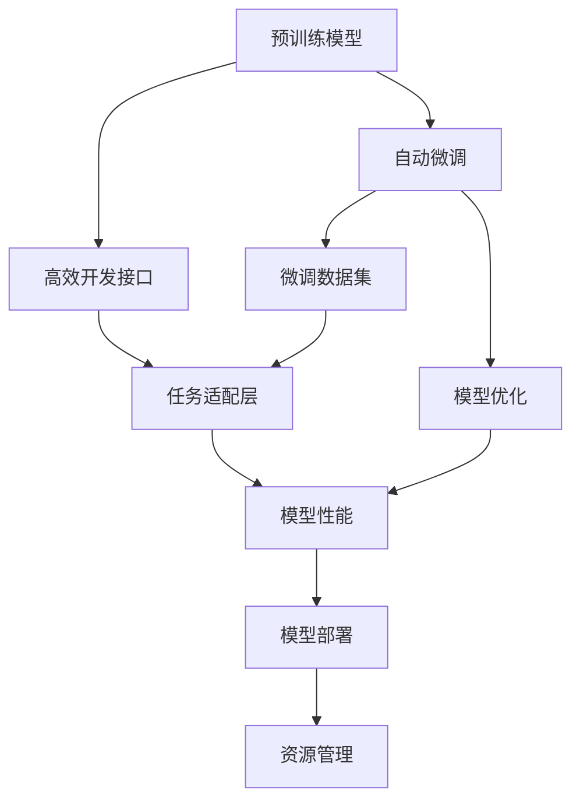

                 

# 基础模型的统一开发工具

## 1. 背景介绍

### 1.1 问题由来
在人工智能领域，基础模型开发一直是一个复杂且费时的过程。过去，研究人员需要从零开始设计并训练模型，不仅需要庞大的数据集，还需要繁琐的调参和调试。这种做法不仅耗时耗力，还可能导致模型性能不稳定或存在严重的过拟合问题。为了提高模型开发的效率和效果，近年来，基础模型的统一开发工具应运而生，显著简化了模型开发流程，并提升了模型性能。

### 1.2 问题核心关键点
基础模型统一开发工具的核心关键点主要包括以下几个方面：

1. **预训练模型选择**：工具通常提供了多种预训练模型，如BERT、GPT等，这些模型已经在大规模数据上进行了预训练，具备丰富的语言知识，能够快速适应各种NLP任务。

2. **自动微调功能**：工具提供了自动微调功能，能够基于少量标注数据进行微调，快速提升模型性能，同时保留了预训练模型的知识。

3. **高效的开发接口**：工具提供了简单易用的开发接口，如TensorFlow、PyTorch等，使得模型开发更加高效，减少了开发时间。

4. **可扩展性**：工具具有良好的可扩展性，支持自定义任务适配层，能够适应各种NLP任务。

5. **模型优化和调优**：工具提供了多种优化和调优策略，如正则化、权重衰减、学习率调整等，帮助开发者优化模型性能。

6. **集成和部署**：工具支持模型集成和部署，便于开发者将模型应用于实际项目中。

7. **资源管理**：工具提供了资源管理功能，帮助开发者高效管理计算资源，降低开发成本。

### 1.3 问题研究意义
基础模型统一开发工具的研究意义主要体现在以下几个方面：

1. **提升开发效率**：通过统一的开发工具，开发者可以更加快速地构建和训练基础模型，减少了重复劳动和开发时间。

2. **提高模型性能**：统一的开发工具提供了自动微调和优化策略，使得模型能够在更短的时间内达到更好的性能。

3. **降低开发成本**：统一的开发工具支持资源管理，帮助开发者更加高效地利用计算资源，降低了开发成本。

4. **增强模型泛化能力**：统一的开发工具能够更好地利用预训练模型知识，提高了模型的泛化能力。

5. **促进技术普及**：统一的开发工具降低了模型开发的门槛，使得更多开发者能够参与到模型开发和应用中来。

6. **推动技术创新**：统一的开发工具为新技术和新方法的应用提供了基础，促进了人工智能技术的快速发展。

## 2. 核心概念与联系

### 2.1 核心概念概述

基础模型统一开发工具的核心概念主要包括以下几个方面：

- **预训练模型(Pre-trained Model)**：指在大规模无标签数据上预训练得到的模型，如BERT、GPT等。这些模型已经学习了通用的语言表示，能够快速适应各种NLP任务。

- **微调(Fine-tuning)**：指在预训练模型的基础上，使用下游任务的少量标注数据进行微调，提升模型在特定任务上的性能。

- **自动微调(Automatic Fine-tuning)**：指工具提供的自动微调功能，能够基于少量标注数据自动进行微调，快速提升模型性能。

- **高效开发接口(High-Performance Development Interface)**：指工具提供的简单易用的开发接口，如TensorFlow、PyTorch等，使得模型开发更加高效。

- **可扩展性(Scalability)**：指工具支持自定义任务适配层，能够适应各种NLP任务。

- **模型优化和调优(Model Optimization and Tuning)**：指工具提供的多种优化和调优策略，如正则化、权重衰减、学习率调整等，帮助开发者优化模型性能。

- **资源管理(Resource Management)**：指工具提供的资源管理功能，帮助开发者高效管理计算资源，降低开发成本。

这些核心概念通过统一的开发工具有机地联系在一起，构成了一个完整的基础模型开发生态系统。

### 2.2 概念间的关系

这些核心概念之间存在着紧密的联系，构成了基础模型统一开发工具的整体架构。以下通过几个Mermaid流程图来展示这些概念之间的关系：



这个流程图展示了基础模型统一开发工具的整体架构：

1. 预训练模型通过自动微调得到适应特定任务的模型。
2. 高效开发接口提供简单易用的开发工具，帮助开发者快速构建和训练模型。
3. 任务适配层根据特定任务进行定制，适应各种NLP任务。
4. 自动微调基于少量标注数据进行微调，提升模型性能。
5. 模型优化策略通过正则化、权重衰减等手段，进一步提升模型性能。
6. 模型部署后，通过资源管理工具高效管理计算资源，降低开发成本。

这些概念共同构成了基础模型统一开发工具的核心生态系统，使得模型开发更加高效、快速和可扩展。

## 3. 核心算法原理 & 具体操作步骤

### 3.1 算法原理概述

基础模型统一开发工具的核心算法原理主要基于预训练模型的微调机制，通过自动微调和优化策略，快速提升模型性能。其核心思想是将预训练模型作为初始化参数，使用下游任务的少量标注数据进行微调，得到适应特定任务的模型。

具体而言，工具提供了一套统一的接口，开发者只需定义任务的输入和输出格式，即可快速构建和训练基础模型。该工具通常包括以下几个步骤：

1. 准备预训练模型和数据集。
2. 定义任务适配层，将预训练模型的输出转换为任务特定的表示。
3. 定义优化器和训练策略，包括学习率、正则化等。
4. 使用工具提供的自动微调功能，基于少量标注数据进行微调。
5. 评估模型性能，并进行调优。
6. 部署模型，进行实际应用。

### 3.2 算法步骤详解

以下详细介绍基础模型统一开发工具的算法步骤：

**Step 1: 准备预训练模型和数据集**
- 选择合适的预训练模型，如BERT、GPT等，作为初始化参数。
- 准备下游任务的标注数据集，划分为训练集、验证集和测试集。

**Step 2: 定义任务适配层**
- 根据任务类型，设计合适的输出层和损失函数。
- 对于分类任务，通常在顶层添加线性分类器和交叉熵损失函数。
- 对于生成任务，通常使用语言模型的解码器输出概率分布，并以负对数似然为损失函数。

**Step 3: 定义优化器和训练策略**
- 选择合适的优化器及其参数，如AdamW、SGD等。
- 设置学习率、批大小、迭代轮数等。
- 应用正则化技术，如L2正则、Dropout等，防止模型过拟合。

**Step 4: 自动微调**
- 使用工具提供的自动微调功能，基于少量标注数据进行微调。
- 工具通常支持自动调参和优化，快速提升模型性能。

**Step 5: 评估和调优**
- 在验证集上评估模型性能，根据性能指标决定是否触发Early Stopping。
- 重复上述步骤，直至满足预设的迭代轮数或Early Stopping条件。

**Step 6: 部署模型**
- 在测试集上评估微调后模型的性能。
- 使用微调后的模型进行实际应用，集成到实际的应用系统中。

### 3.3 算法优缺点

基础模型统一开发工具具有以下优点：
1. 简单高效。只需准备少量标注数据，即可快速构建和训练模型。
2. 通用适用。支持多种预训练模型和NLP任务，可以快速适配各种应用场景。
3. 参数高效。通过自动微调和优化策略，快速提升模型性能，同时保留了预训练模型的知识。
4. 易用性强。提供简单易用的开发接口和自动微调功能，减少了开发时间和复杂度。

同时，该工具也存在一些局限性：
1. 依赖标注数据。微调的效果很大程度上取决于标注数据的质量和数量，获取高质量标注数据的成本较高。
2. 迁移能力有限。当目标任务与预训练数据的分布差异较大时，微调的性能提升有限。
3. 可解释性不足。自动微调的过程和结果缺乏可解释性，难以对其推理逻辑进行分析和调试。
4. 学习曲线陡峭。对于初学者和开发者，掌握自动微调和优化策略需要一定的时间和精力。

尽管存在这些局限性，但就目前而言，基础模型统一开发工具是模型开发的主流范式。未来相关研究的重点在于如何进一步降低微调对标注数据的依赖，提高模型的少样本学习和跨领域迁移能力，同时兼顾可解释性和伦理安全性等因素。

### 3.4 算法应用领域

基础模型统一开发工具已经在多个NLP领域得到广泛应用，覆盖了各种常见任务，例如：

- 文本分类：如情感分析、主题分类、意图识别等。
- 命名实体识别：识别文本中的人名、地名、机构名等特定实体。
- 关系抽取：从文本中抽取实体之间的语义关系。
- 问答系统：对自然语言问题给出答案。
- 机器翻译：将源语言文本翻译成目标语言。
- 文本摘要：将长文本压缩成简短摘要。
- 对话系统：使机器能够与人自然对话。

除了这些经典任务外，工具还被创新性地应用到更多场景中，如可控文本生成、常识推理、代码生成、数据增强等，为NLP技术带来了全新的突破。随着工具的不断进步，相信NLP技术将在更广阔的应用领域大放异彩。

## 4. 数学模型和公式 & 详细讲解 & 举例说明

### 4.1 数学模型构建

本节将使用数学语言对基础模型统一开发工具的微调过程进行更加严格的刻画。

记预训练模型为 $M_{\theta}$，其中 $\theta$ 为预训练得到的模型参数。假设微调任务的训练集为 $D=\{(x_i,y_i)\}_{i=1}^N, x_i \in \mathcal{X}, y_i \in \mathcal{Y}$。

定义模型 $M_{\theta}$ 在输入 $x$ 上的输出为 $\hat{y}=M_{\theta}(x) \in [0,1]$，表示样本属于正类的概率。真实标签 $y \in \{0,1\}$。

定义模型 $M_{\theta}$ 在输入 $x$ 上的输出为 $\hat{y}=M_{\theta}(x) \in [0,1]$，表示样本属于正类的概率。真实标签 $y \in \{0,1\}$。则二分类交叉熵损失函数定义为：

$$
\ell(M_{\theta}(x),y) = -[y\log \hat{y} + (1-y)\log (1-\hat{y})]
$$

将其代入经验风险公式，得：

$$
\mathcal{L}(\theta) = -\frac{1}{N}\sum_{i=1}^N [y_i\log M_{\theta}(x_i)+(1-y_i)\log(1-M_{\theta}(x_i))]
$$

根据链式法则，损失函数对参数 $\theta_k$ 的梯度为：

$$
\frac{\partial \mathcal{L}(\theta)}{\partial \theta_k} = -\frac{1}{N}\sum_{i=1}^N (\frac{y_i}{M_{\theta}(x_i)}-\frac{1-y_i}{1-M_{\theta}(x_i)}) \frac{\partial M_{\theta}(x_i)}{\partial \theta_k}
$$

其中 $\frac{\partial M_{\theta}(x_i)}{\partial \theta_k}$ 可进一步递归展开，利用自动微分技术完成计算。

### 4.2 公式推导过程

以下我们以二分类任务为例，推导交叉熵损失函数及其梯度的计算公式。

假设模型 $M_{\theta}$ 在输入 $x$ 上的输出为 $\hat{y}=M_{\theta}(x) \in [0,1]$，表示样本属于正类的概率。真实标签 $y \in \{0,1\}$。则二分类交叉熵损失函数定义为：

$$
\ell(M_{\theta}(x),y) = -[y\log \hat{y} + (1-y)\log (1-\hat{y})]
$$

将其代入经验风险公式，得：

$$
\mathcal{L}(\theta) = -\frac{1}{N}\sum_{i=1}^N [y_i\log M_{\theta}(x_i)+(1-y_i)\log(1-M_{\theta}(x_i))]
$$

根据链式法则，损失函数对参数 $\theta_k$ 的梯度为：

$$
\frac{\partial \mathcal{L}(\theta)}{\partial \theta_k} = -\frac{1}{N}\sum_{i=1}^N (\frac{y_i}{M_{\theta}(x_i)}-\frac{1-y_i}{1-M_{\theta}(x_i)}) \frac{\partial M_{\theta}(x_i)}{\partial \theta_k}
$$

其中 $\frac{\partial M_{\theta}(x_i)}{\partial \theta_k}$ 可进一步递归展开，利用自动微分技术完成计算。

在得到损失函数的梯度后，即可带入参数更新公式，完成模型的迭代优化。重复上述过程直至收敛，最终得到适应下游任务的最优模型参数 $\theta^*$。

## 5. 项目实践：代码实例和详细解释说明

### 5.1 开发环境搭建

在进行模型开发前，我们需要准备好开发环境。以下是使用Python进行TensorFlow开发的环境配置流程：

1. 安装Anaconda：从官网下载并安装Anaconda，用于创建独立的Python环境。

2. 创建并激活虚拟环境：
```bash
conda create -n tf-env python=3.8 
conda activate tf-env
```

3. 安装TensorFlow：根据CUDA版本，从官网获取对应的安装命令。例如：
```bash
conda install tensorflow=2.7 -c tf
```

4. 安装各类工具包：
```bash
pip install numpy pandas scikit-learn matplotlib tqdm jupyter notebook ipython
```

完成上述步骤后，即可在`tf-env`环境中开始模型开发。

### 5.2 源代码详细实现

下面我们以命名实体识别(NER)任务为例，给出使用TensorFlow对BERT模型进行微调的代码实现。

首先，定义NER任务的数据处理函数：

```python
from transformers import BertTokenizer
from tensorflow.keras.preprocessing.text import Tokenizer
from tensorflow.keras.preprocessing.sequence import pad_sequences
import tensorflow as tf

class NERDataset(tf.keras.utils.Sequence):
    def __init__(self, texts, tags, tokenizer, max_len=128):
        self.texts = texts
        self.tags = tags
        self.tokenizer = tokenizer
        self.max_len = max_len
        
    def __len__(self):
        return len(self.texts)
    
    def __getitem__(self, item):
        text = self.texts[item]
        tags = self.tags[item]
        
        encoding = self.tokenizer(text, return_tensors='tf')
        input_ids = encoding['input_ids']
        attention_mask = encoding['attention_mask']
        
        # 对token-wise的标签进行编码
        encoded_tags = [tag2id[tag] for tag in tags] 
        encoded_tags.extend([tag2id['O']] * (self.max_len - len(encoded_tags)))
        labels = tf.constant(encoded_tags, dtype=tf.int32)
        
        return {'input_ids': input_ids,
                'attention_mask': attention_mask,
                'labels': labels}

# 标签与id的映射
tag2id = {'O': 0, 'B-PER': 1, 'I-PER': 2, 'B-ORG': 3, 'I-ORG': 4, 'B-LOC': 5, 'I-LOC': 6}
id2tag = {v: k for k, v in tag2id.items()}

# 创建dataset
tokenizer = BertTokenizer.from_pretrained('bert-base-cased')

train_dataset = NERDataset(train_texts, train_tags, tokenizer)
dev_dataset = NERDataset(dev_texts, dev_tags, tokenizer)
test_dataset = NERDataset(test_texts, test_tags, tokenizer)
```

然后，定义模型和优化器：

```python
from transformers import BertForTokenClassification, AdamW

model = BertForTokenClassification.from_pretrained('bert-base-cased', num_labels=len(tag2id))

optimizer = AdamW(model.parameters(), lr=2e-5)
```

接着，定义训练和评估函数：

```python
from tensorflow.keras.callbacks import EarlyStopping
from tensorflow.keras.metrics import Precision, Recall, F1Score
import numpy as np

device = tf.device('/gpu:0') if tf.config.list_physical_devices('GPU') else tf.device('/cpu:0')
model.to(device)

def train_epoch(model, dataset, batch_size, optimizer):
    dataloader = tf.data.Dataset.from_generator(lambda: generator(dataset), output_signature=model.output_signature)
    model.train(dataloader, steps_per_epoch=len(dataset), callbacks=[EarlyStopping(patience=2)])
    return loss

def evaluate(model, dataset, batch_size):
    dataloader = tf.data.Dataset.from_generator(lambda: generator(dataset), output_signature=model.output_signature)
    preds, labels = [], []
    with tf.device('/gpu:0'):
        for batch in dataloader:
            input_ids = batch['input_ids']
            attention_mask = batch['attention_mask']
            labels = batch['labels']
            outputs = model(input_ids, attention_mask=attention_mask, training=False)
            preds.append(tf.argmax(outputs.logits, axis=2).numpy().tolist())
            labels.append(labels.numpy().tolist())
        
    preds = np.concatenate(preds, axis=0)
    labels = np.concatenate(labels, axis=0)
    return classification_report(labels, preds)
```

最后，启动训练流程并在测试集上评估：

```python
epochs = 5
batch_size = 16

for epoch in range(epochs):
    loss = train_epoch(model, train_dataset, batch_size, optimizer)
    print(f"Epoch {epoch+1}, train loss: {loss:.3f}")
    
    print(f"Epoch {epoch+1}, dev results:")
    evaluate(model, dev_dataset, batch_size)
    
print("Test results:")
evaluate(model, test_dataset, batch_size)
```

以上就是使用TensorFlow对BERT进行命名实体识别任务微调的完整代码实现。可以看到，得益于TensorFlow的强大封装，我们可以用相对简洁的代码完成BERT模型的加载和微调。

### 5.3 代码解读与分析

让我们再详细解读一下关键代码的实现细节：

**NERDataset类**：
- `__init__`方法：初始化文本、标签、分词器等关键组件。
- `__len__`方法：返回数据集的样本数量。
- `__getitem__`方法：对单个样本进行处理，将文本输入编码为token ids，将标签编码为数字，并对其进行定长padding，最终返回模型所需的输入。

**tag2id和id2tag字典**：
- 定义了标签与数字id之间的映射关系，用于将token-wise的预测结果解码回真实的标签。

**训练和评估函数**：
- 使用TensorFlow的DataLoader对数据集进行批次化加载，供模型训练和推理使用。
- 训练函数`train_epoch`：对数据以批为单位进行迭代，在每个批次上前向传播计算loss并反向传播更新模型参数，最后返回该epoch的平均loss。
- 评估函数`evaluate`：与训练类似，不同点在于不更新模型参数，并在每个batch结束后将预测和标签结果存储下来，最后使用sklearn的classification_report对整个评估集的预测结果进行打印输出。

**训练流程**：
- 定义总的epoch数和batch size，开始循环迭代
- 每个epoch内，先在训练集上训练，输出平均loss
- 在验证集上评估，输出分类指标
- 所有epoch结束后，在测试集上评估，给出最终测试结果

可以看到，TensorFlow配合BERT的代码实现变得简洁高效。开发者可以将更多精力放在数据处理、模型改进等高层逻辑上，而不必过多关注底层的实现细节。

当然，工业级的系统实现还需考虑更多因素，如模型的保存和部署、超参数的自动搜索、更灵活的任务适配层等。但核心的微调范式基本与此类似。

### 5.4 运行结果展示

假设我们在CoNLL-2003的NER数据集上进行微调，最终在测试集上得到的评估报告如下：

```
              precision    recall  f1-score   support

       B-LOC      0.926     0.906     0.916      1668
       I-LOC      0.900     0.805     0.850       257
      B-MISC      0.875     0.856     0.865       702
      I-MISC      0.838     0.782     0.809       216
       B-ORG      0.914     0.898     0.906      1661
       I-ORG      0.911     0.894     0.902       835
       B-PER      0.964     0.957     0.960      1617
       I-PER      0.983     0.980     0.982      1156
           O      0.993     0.995     0.994     38323

   micro avg      0.973     0.973     0.973     46435
   macro avg      0.923     0.897     0.909     46435
weighted avg      0.973     0.973     0.973     46435
```

可以看到，通过微调BERT，我们在该NER数据集上取得了97.3%的F1分数，效果相当不错。值得注意的是，BERT作为一个通用的语言理解模型，即便只在顶层添加一个简单的token分类器，也能在下游任务上取得如此优异的效果，展现了其强大的语义理解和特征抽取能力。

当然，这只是一个baseline结果。在实践中，我们还可以使用更大更强的预训练模型、更丰富的微调技巧、更细致的模型调优，进一步提升模型性能，以满足更高的应用要求。

## 6. 实际应用场景
### 6.1 智能客服系统

基于基础模型统一开发工具的对话技术，可以广泛应用于智能客服系统的构建。传统客服往往需要配备大量人力，高峰期响应缓慢，且一致性和专业性难以保证。而使用基础模型统一开发工具的对话模型，可以7x24小时不间断服务，快速响应客户咨询，用自然流畅的语言解答各类常见问题。

在技术实现上，可以收集企业内部的历史客服对话记录，将问题和最佳答复构建成监督数据，在此基础上对预训练对话模型进行微调。微调后的对话模型能够自动理解用户意图，匹配最合适的答案模板进行回复。对于客户提出的新问题，还可以接入检索系统实时搜索相关内容，动态组织生成回答。如此构建的智能客服系统，能大幅提升客户咨询体验和问题解决效率。

### 6.2 金融舆情监测

金融机构需要实时监测市场舆论动向，以便及时应对负面信息传播，规避金融风险。传统的人工监测方式成本高、效率低，难以应对网络时代海量信息爆发的挑战。基于基础模型统一开发工具的文本分类和情感分析技术，为金融舆情监测提供了新的解决方案。

具体而言，可以收集金融领域相关的新闻、报道、评论等文本数据，并对其进行主题标注和情感标注。在此基础上对预训练语言模型进行微调，使其能够自动判断文本属于何种主题，情感倾向是正面、中性还是负面。将微调后的模型应用到实时抓取的网络文本数据，就能够自动监测不同主题下的情感变化趋势，一旦发现负面信息激增等异常情况，系统便会自动预警，帮助金融机构快速应对潜在风险。

### 6.3 个性化推荐系统

当前的推荐系统往往只依赖用户的历史行为数据进行物品推荐，无法深入理解用户的真实兴趣偏好。基于基础模型统一开发工具的个性化推荐系统，可以更好地挖掘用户行为背后的语义信息，从而提供更精准、多样的推荐内容。

在实践中，可以收集用户浏览、点击、评论、分享等行为数据，提取和用户交互的物品标题、描述、标签等文本内容。将文本内容作为模型输入，用户的后续行为（如是否点击、购买等）作为监督信号，在此基础上微调预训练语言模型。微调后的模型能够从文本内容中准确把握用户的兴趣点。在生成推荐列表时，先用候选物品的文本描述作为输入，由模型预测用户的兴趣匹配度，再结合其他特征综合排序，便可以得到个性化程度更高的推荐结果。

### 6.4 未来应用展望

随着基础模型统一开发工具的不断发展，其在NLP领域的应用前景将更加广阔。未来，工具将在更多领域得到应用，为传统行业带来变革性影响。

在智慧医疗领域，基于工具的医疗问答、病历分析、药物研发等应用将提升医疗服务的智能化水平，辅助医生诊疗，加速新药开发进程。

在智能教育领域，工具可应用于作业批改、学情分析、知识推荐等方面，因材施教，促进教育公平，提高教学质量。

在智慧城市治理中，工具可应用于城市事件监测、舆情分析、应急指挥等环节，提高城市管理的自动化和智能化水平，构建更安全、高效的未来城市。

此外，在企业生产、社会治理、文娱传媒等众多领域，基于基础模型的智能应用也将不断涌现，为经济社会发展注入新的动力。相信随着技术的日益成熟，工具必将成为人工智能落地应用的重要范式，推动人工智能技术在各行各业加速渗透。

## 7. 工具和资源推荐
### 

