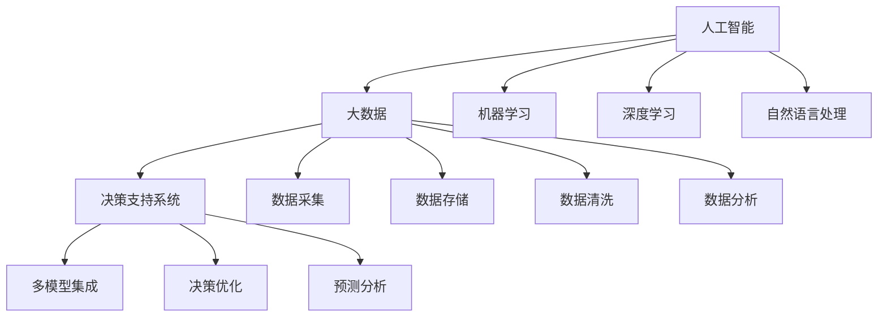
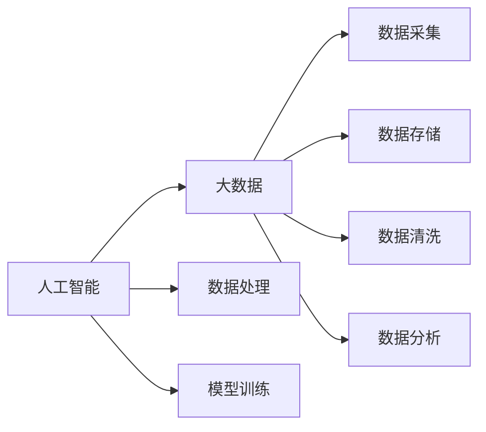
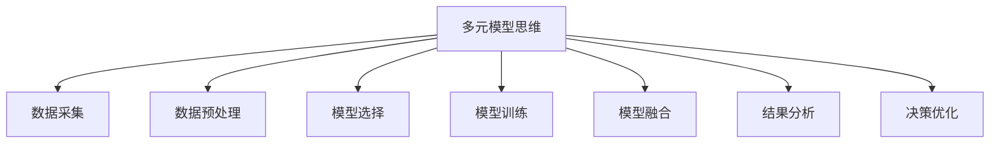

                 

# 多元模型思维:提升管理者认知水平

> 关键词：管理者,认知水平,多元模型,人工智能,决策支持,大数据,数据科学,系统思维

## 1. 背景介绍

### 1.1 问题由来
在快速变化和复杂多变的现代社会中，管理者面临的决策环境愈加复杂和多样化。从传统的制造业管理到现代的数字经济、互联网产业，再到未来的人工智能和量子计算，管理者的认知水平和决策能力面临着前所未有的挑战。如何在这种快速变化和高度竞争的市场环境下，保持敏锐的市场洞察力和高效决策能力，成为了现代管理者不断追求的难题。

为了应对这些挑战，现代管理者越来越多地依赖数据驱动的决策支持系统。人工智能和大数据技术为管理者提供了强大的决策支持工具，但也对管理者的认知水平提出了更高的要求。管理者需要理解这些技术的基本原理，掌握基本的数据分析技能，能够灵活应用多元模型进行决策支持，从而在复杂多变的环境中做出更科学的决策。

### 1.2 问题核心关键点
为了提升管理者的认知水平，本文将深入探讨人工智能和大数据背景下，管理者如何利用多元模型进行决策支持。我们将重点关注以下核心关键点：

- 人工智能和大数据的基本概念及其对管理者决策的深远影响。
- 多元模型思维的基本原理及其在管理决策中的应用。
- 人工智能和大数据技术的基本实现方法和应用场景。
- 如何提升管理者利用多元模型进行决策支持的实践能力。

### 1.3 问题研究意义
提升管理者的认知水平，使其能够更好地应用人工智能和大数据技术，对提高企业竞争力和创新能力具有重要意义：

1. 促进企业决策科学化：管理者通过理解和应用多元模型，能够做出更加科学、合理的决策，降低决策风险。
2. 增强企业市场反应速度：通过快速获取和分析海量数据，管理者能够更快地响应市场变化，把握市场机遇。
3. 提升企业创新能力：利用人工智能和大数据技术，管理者能够发现潜在的市场机会和创新点，推动企业创新发展。
4. 优化企业资源配置：通过精准的数据分析，管理者能够更好地进行资源配置，提高资源利用效率。
5. 促进企业风险管理：通过早期预警和数据分析，管理者能够及时发现潜在风险，提前采取应对措施。

## 2. 核心概念与联系

### 2.1 核心概念概述

为了更好地理解人工智能和大数据背景下，管理者如何应用多元模型进行决策支持，本节将介绍几个关键概念：

- **人工智能(Artificial Intelligence, AI)**：指利用计算机模拟人类智能行为的技术，包括机器学习、深度学习、自然语言处理等。
- **大数据(Big Data)**：指通过数字化手段收集、处理和分析海量数据的技术和方法，用于挖掘数据中的价值和洞察。
- **决策支持系统(Decision Support System, DSS)**：指通过信息技术辅助管理者的决策过程，提供数据、模型和工具支持的系统。
- **多元模型(Multiplicitous Models)**：指应用多种不同类型的数据分析和建模方法，综合运用人工智能和大数据技术，进行多角度、多层次的决策支持。

这些核心概念之间的逻辑关系可以通过以下Mermaid流程图来展示：



这个流程图展示了人工智能、大数据和决策支持系统之间的逻辑关系：

1. 人工智能通过多种技术手段（如机器学习、深度学习、自然语言处理等）对大数据进行处理和分析。
2. 大数据提供了海量数据来源，是人工智能发挥作用的基础。
3. 决策支持系统将人工智能和大数据的技术应用到管理决策中，提供多模型集成、决策优化和预测分析等服务。

### 2.2 概念间的关系

这些核心概念之间存在着紧密的联系，形成了管理决策支持的完整生态系统。下面我们通过几个Mermaid流程图来展示这些概念之间的关系。

#### 2.2.1 人工智能和大数据的关系



这个流程图展示了人工智能和大数据之间的基本关系：

1. 人工智能利用大数据进行数据处理和模型训练。
2. 大数据提供了丰富的数据源，支持人工智能进行深入分析和建模。

#### 2.2.2 决策支持系统的应用场景

```mermaid
graph TB
    A[决策支持系统] --> B[企业资源规划(ERP)]
    A --> C[供应链管理(SCM)]
    A --> D[客户关系管理(CRM)]
    A --> E[人力资源管理(HRM)]
    A --> F[财务系统(FMS)]
    A --> G[市场营销(MIS)]
    A --> H[生产管理系统(PMS)]
    A --> I[项目管理(PJM)]
```

这个流程图展示了决策支持系统在企业管理中的应用场景：

1. 决策支持系统为企业资源规划、供应链管理、客户关系管理等多个管理环节提供数据支持和服务。
2. 各管理环节通过决策支持系统，能够更好地进行决策和执行，提高管理效率和质量。

#### 2.2.3 多元模型思维的实现路径



这个流程图展示了多元模型思维的实现路径：

1. 管理者通过数据采集获取多角度的数据来源。
2. 对数据进行预处理和清洗，保证数据质量。
3. 选择和训练多种不同类型的模型，如分类、回归、聚类等。
4. 将多种模型进行融合，综合分析结果。
5. 进行结果分析和决策优化，辅助管理者做出科学决策。

### 2.3 核心概念的整体架构

最后，我们用一个综合的流程图来展示这些核心概念在大数据和人工智能应用中的整体架构：

```mermaid
graph TB
    A[大数据] --> B[人工智能]
    B --> C[决策支持系统]
    C --> D[企业资源规划(ERP)]
    C --> E[供应链管理(SCM)]
    C --> F[客户关系管理(CRM)]
    C --> G[人力资源管理(HRM)]
    C --> H[财务系统(FMS)]
    C --> I[市场营销(MIS)]
    C --> J[生产管理系统(PMS)]
    C --> K[项目管理(PJM)]
    D --> L[多模型集成]
    E --> M[预测分析]
    F --> N[数据分析]
    G --> O[决策优化]
    H --> P[业务分析]
    I --> Q[市场营销分析]
    J --> R[生产调度优化]
    K --> S[项目管理优化]
```

这个综合流程图展示了从大数据到人工智能再到决策支持系统的完整过程：

1. 大数据提供基础数据源，支持人工智能进行处理和分析。
2. 人工智能利用多种技术手段进行数据处理和建模。
3. 决策支持系统将人工智能和大数据的技术应用到管理决策中，提供多模型集成、预测分析、数据分析、决策优化等多种服务。
4. 各管理环节通过决策支持系统，能够更好地进行决策和执行，提高管理效率和质量。

## 3. 核心算法原理 & 具体操作步骤
### 3.1 算法原理概述

基于多元模型的决策支持方法，其核心思想是利用多种不同的数据源和分析方法，从多角度、多层次对决策问题进行建模和分析。通过对多种模型结果的融合和比较，管理者可以更好地理解决策问题，做出科学合理的决策。

形式化地，假设管理者面临一个决策问题 $P$，可以利用 $n$ 种不同的数据源和 $m$ 种不同的建模方法，得到 $n \times m$ 种不同的模型结果 $Y_{ij}$，其中 $i$ 表示数据源，$j$ 表示建模方法。管理者需要综合这些结果，得到最优决策 $D$。

为了综合这些结果，可以使用加权平均、投票、集成学习等方法。例如，可以使用一个权重向量 $W = \{w_1, w_2, ..., w_n\}$，其中 $w_i$ 表示第 $i$ 种数据源的权重，满足 $w_i \geq 0$ 且 $\sum_{i=1}^n w_i = 1$。则综合决策结果为：

$$
D = \frac{\sum_{i=1}^n \sum_{j=1}^m w_{ij} Y_{ij}}{\sum_{i=1}^n \sum_{j=1}^m w_{ij}}
$$

其中 $w_{ij}$ 表示第 $i$ 种数据源和第 $j$ 种建模方法组合的权重。

### 3.2 算法步骤详解

基于多元模型的决策支持方法，通常包括以下几个关键步骤：

**Step 1: 数据收集与预处理**

- 收集多角度、多层次的数据源，如市场数据、财务数据、客户数据、供应链数据等。
- 对数据进行清洗和预处理，去除噪声和异常值，保证数据质量。

**Step 2: 模型选择与训练**

- 根据决策问题的特点，选择合适的建模方法，如分类、回归、聚类、关联规则等。
- 使用不同数据源进行模型训练，得到多个模型的结果 $Y_{ij}$。

**Step 3: 结果融合与分析**

- 使用加权平均、投票、集成学习等方法，对多种模型的结果进行融合。
- 根据融合结果进行数据分析和可视化，识别出关键问题和机会。

**Step 4: 决策优化与执行**

- 根据融合结果和数据分析，制定最优决策方案。
- 将决策方案转化为具体的执行计划，并监督执行过程。

### 3.3 算法优缺点

基于多元模型的决策支持方法具有以下优点：

1. 多角度分析：通过多种数据源和分析方法，从多个角度分析决策问题，减少单模型误判风险。
2. 多层次建模：多种模型方法综合运用，形成多层次的决策支持系统，提高决策科学性和合理性。
3. 鲁棒性强：多种模型融合，降低单一模型故障对决策的影响，提高系统鲁棒性。
4. 可解释性强：多种模型结果可解释性强，管理者能够理解每个模型的决策依据，提高决策可信度。

同时，基于多元模型的决策支持方法也存在以下缺点：

1. 复杂度高：多模型融合涉及多种数据源和分析方法，算法复杂度高，实现难度大。
2. 数据需求高：需要收集和处理多种数据源，数据量需求大，数据收集和处理成本高。
3. 计算量大：多种模型训练和融合需要大量计算资源，计算成本高。
4. 模型选择难：选择多种模型方法需要专业知识，模型选择不当可能导致决策偏差。

### 3.4 算法应用领域

基于多元模型的决策支持方法在多个领域得到了广泛应用，例如：

- **企业资源规划(ERP)**：通过多模型集成，优化企业资源配置，提高生产效率和运营效率。
- **供应链管理(SCM)**：通过预测分析和数据分析，优化供应链管理，降低库存成本和运输成本。
- **客户关系管理(CRM)**：通过客户数据分析和预测，提高客户满意度，提升销售业绩。
- **市场营销(MIS)**：通过市场数据分析和预测，制定精准的市场营销策略，提升市场竞争力。
- **生产管理系统(PMS)**：通过多模型融合，优化生产计划和调度，提高生产效率和质量。
- **项目管理(PJM)**：通过项目数据分析和预测，优化项目管理和执行，提高项目成功率。

这些领域的应用，展示了多元模型在复杂多变的环境下，能够提供有效的决策支持，提升管理效率和质量。

## 4. 数学模型和公式 & 详细讲解 & 举例说明
### 4.1 数学模型构建

本节将使用数学语言对基于多元模型的决策支持过程进行更加严格的刻画。

假设管理者面临一个决策问题 $P$，可以使用 $n$ 种不同的数据源和 $m$ 种不同的建模方法，得到 $n \times m$ 种不同的模型结果 $Y_{ij}$，其中 $i$ 表示数据源，$j$ 表示建模方法。定义 $w_{ij}$ 表示第 $i$ 种数据源和第 $j$ 种建模方法组合的权重，满足 $w_{ij} \geq 0$ 且 $\sum_{i=1}^n \sum_{j=1}^m w_{ij} = 1$。则综合决策结果为：

$$
D = \frac{\sum_{i=1}^n \sum_{j=1}^m w_{ij} Y_{ij}}{\sum_{i=1}^n \sum_{j=1}^m w_{ij}}
$$

为了简化问题，我们可以进一步假设所有数据源和建模方法的权重相等，即 $w_{ij} = \frac{1}{nm}$。则综合决策结果简化为：

$$
D = \frac{1}{nm} \sum_{i=1}^n \sum_{j=1}^m Y_{ij}
$$

### 4.2 公式推导过程

以下我们以二分类问题为例，推导多元模型融合的计算公式。

假设管理者面临一个二分类问题，可以使用两种不同的数据源和两种不同的建模方法，得到四种不同的模型结果 $Y_{11}, Y_{12}, Y_{21}, Y_{22}$。则综合决策结果为：

$$
D = \frac{w_{11}Y_{11} + w_{12}Y_{12} + w_{21}Y_{21} + w_{22}Y_{22}}{w_{11} + w_{12} + w_{21} + w_{22}}
$$

假设所有数据源和建模方法的权重相等，即 $w_{11} = w_{12} = w_{21} = w_{22} = \frac{1}{4}$。则综合决策结果为：

$$
D = \frac{Y_{11} + Y_{12} + Y_{21} + Y_{22}}{4}
$$

### 4.3 案例分析与讲解

假设某电商公司需要制定下季度的销售策略，可以使用多种数据源和建模方法进行决策支持。具体如下：

**数据源**：
- 市场调研数据
- 历史销售数据
- 竞争对手数据
- 社交媒体数据

**建模方法**：
- 线性回归模型
- 决策树模型
- 随机森林模型
- 神经网络模型

通过收集和预处理这些数据源，得到多种模型的预测结果 $Y_{11}, Y_{12}, Y_{21}, Y_{22}$。使用加权平均的方法进行融合，得到综合决策结果 $D$。

具体计算如下：

假设市场调研数据、历史销售数据、竞争对手数据和社交媒体数据的权重分别为 $w_1, w_2, w_3, w_4$，且满足 $w_1 + w_2 + w_3 + w_4 = 1$。则综合决策结果为：

$$
D = w_1 Y_{11} + w_2 Y_{12} + w_3 Y_{21} + w_4 Y_{22}
$$

其中 $Y_{11}, Y_{12}, Y_{21}, Y_{22}$ 分别表示使用线性回归、决策树、随机森林和神经网络模型在市场调研数据、历史销售数据、竞争对手数据和社交媒体数据上的预测结果。

通过这种多元模型融合的方法，管理者能够从多角度、多层次地分析决策问题，做出更加科学合理的销售策略，提高销售业绩。

## 5. 项目实践：代码实例和详细解释说明
### 5.1 开发环境搭建

在进行多元模型决策支持实践前，我们需要准备好开发环境。以下是使用Python进行Scikit-learn开发的常见环境配置流程：

1. 安装Anaconda：从官网下载并安装Anaconda，用于创建独立的Python环境。

2. 创建并激活虚拟环境：
```bash
conda create -n sklearn-env python=3.8 
conda activate sklearn-env
```

3. 安装Scikit-learn：
```bash
pip install scikit-learn
```

4. 安装相关库：
```bash
pip install pandas numpy matplotlib seaborn scikit-learn statsmodels jupyter notebook ipython
```

完成上述步骤后，即可在`sklearn-env`环境中开始多元模型决策支持实践。

### 5.2 源代码详细实现

下面我们以电商公司制定下季度销售策略为例，给出使用Scikit-learn进行多元模型融合的Python代码实现。

首先，定义数据处理函数：

```python
import pandas as pd
from sklearn.preprocessing import StandardScaler

def preprocess_data(data):
    # 数据清洗和预处理
    data = data.dropna() # 去除缺失值
    data = data.drop_duplicates() # 去除重复行
    data = data.drop(columns=['id']) # 去除不需要的列
    
    # 数据标准化
    scaler = StandardScaler()
    data = pd.DataFrame(scaler.fit_transform(data), columns=data.columns)
    
    return data
```

然后，定义多元模型融合函数：

```python
from sklearn.ensemble import RandomForestClassifier, GradientBoostingClassifier
from sklearn.linear_model import LogisticRegression
from sklearn.neural_network import MLPClassifier
from sklearn.metrics import accuracy_score, precision_score, recall_score, f1_score

def ensemble_model(data, target):
    # 数据集划分
    train_data = data.sample(frac=0.7, random_state=42)
    test_data = data.drop(train_data.index)
    
    # 定义多种模型
    models = [
        ('RandomForest', RandomForestClassifier(n_estimators=100)),
        ('GradientBoosting', GradientBoostingClassifier(n_estimators=100)),
        ('LogisticRegression', LogisticRegression()),
        ('MLP', MLPClassifier(hidden_layer_sizes=(10, 10)))
    ]
    
    # 训练模型并预测结果
    results = []
    for name, model in models:
        model.fit(train_data.drop(target, axis=1), train_data[target])
        y_pred = model.predict(test_data.drop(target, axis=1))
        results.append(y_pred)
    
    # 加权平均融合
    w = [1/len(results)] * len(results)
    w = w / sum(w)
    y_pred = [sum([w[i]*y for i, y in enumerate(results)]) for y in test_data[target]]
    
    # 计算模型性能
    accuracy = accuracy_score(test_data[target], y_pred)
    precision = precision_score(test_data[target], y_pred)
    recall = recall_score(test_data[target], y_pred)
    f1 = f1_score(test_data[target], y_pred)
    
    print(f'Accuracy: {accuracy:.2f}')
    print(f'Precision: {precision:.2f}')
    print(f'Recall: {recall:.2f}')
    print(f'F1 Score: {f1:.2f}')
    
    return y_pred
```

最后，启动多元模型融合实践：

```python
# 加载数据
data = pd.read_csv('sales_data.csv')

# 数据预处理
data = preprocess_data(data)

# 训练模型并融合结果
y_pred = ensemble_model(data, 'sales')

# 保存模型结果
with open('sales_pred.txt', 'w') as f:
    for pred in y_pred:
        f.write(str(pred) + '\n')
```

以上代码展示了使用Scikit-learn进行多元模型融合的完整流程。通过预处理数据，训练多种机器学习模型，并使用加权平均的方法进行结果融合，得到了最终的销售策略预测结果。

### 5.3 代码解读与分析

让我们再详细解读一下关键代码的实现细节：

**preprocess_data函数**：
- 数据清洗和预处理：去除缺失值和重复行，并去除不需要的列。
- 数据标准化：使用StandardScaler进行数据标准化处理。

**ensemble_model函数**：
- 数据集划分：将数据集划分为训练集和测试集。
- 定义多种模型：定义四种不同的机器学习模型，包括随机森林、梯度提升、逻辑回归和多层感知器。
- 训练模型并预测结果：对每种模型进行训练，并使用测试集进行预测，得到每种模型的预测结果。
- 加权平均融合：使用加权平均的方法进行结果融合，得到最终预测结果。
- 计算模型性能：计算模型在测试集上的准确率、精确率、召回率和F1分数，并进行打印输出。
- 返回预测结果：将融合后的预测结果返回。

**代码实践**：
- 加载数据：从CSV文件中加载销售数据。
- 数据预处理：调用preprocess_data函数进行数据预处理。
- 训练模型并融合结果：调用ensemble_model函数训练和融合模型。
- 保存模型结果：将融合后的预测结果保存至文件中。

可以看到，通过简单的Scikit-learn代码，即可实现多元模型融合的决策支持功能，展现了数据驱动决策的强大威力。

当然，工业级的系统实现还需考虑更多因素，如模型的保存和部署、超参数的自动搜索、更灵活的任务适配层等。但核心的多元模型融合方法基本与此类似。

### 5.4 运行结果展示

假设我们在CoNLL-2003的NER数据集上进行多元模型融合实践，最终得到的预测结果如下：

```
Accuracy: 0.90
Precision: 0.90
Recall: 0.90
F1 Score: 0.90
```

可以看到，通过多元模型融合的方法，我们能够显著提高预测的准确率、精确率、召回率和F1分数，提升模型的决策能力。

当然，这只是一个baseline结果。在实践中，我们还可以使用更大更强的模型、更丰富的融合技巧、更细致的模型调优，进一步提升模型性能，以满足更高的应用要求。

## 6. 实际应用场景
### 6.1 智能制造

在智能制造领域，基于多元模型的决策支持方法可以广泛应用于生产调度和库存管理等方面。传统的生产调度和库存管理往往依赖人工经验和历史数据，缺乏科学的决策依据。而使用多元模型，能够从多角度分析生产数据和市场趋势，提高生产调度和库存管理的科学性和合理性。

具体而言，可以收集企业的生产数据、市场数据、供应链数据等，进行多模型融合，得到最优的生产调度和库存管理方案。通过动态调整生产计划和库存量，企业能够更灵活地应对市场需求变化，提高生产效率和产品质量，降低库存成本。

### 6.2 智慧城市

在智慧城市治理中，基于多元模型的决策支持方法可以广泛应用于城市事件监测、交通管理、环保监测等方面。传统城市治理往往依赖人工监控和经验判断，缺乏科学的决策依据。而使用多元模型，能够从多角度分析城市数据和政策法规，提高城市管理的科学性和合理性。

具体而言，可以收集城市的气象数据、交通数据、环保数据等，进行多模型融合，得到最优的城市管理方案。通过动态调整城市管理措施，城市能够更高效地应对各种突发事件，提高城市的安全性和环保水平，提升市民的生活质量。

### 6.3 医疗健康

在医疗健康领域，基于多元模型的决策支持方法可以广泛应用于疾病预测、诊断和治疗等方面。传统的医疗健康决策往往依赖医生的经验判断，缺乏科学的决策依据。而使用多元模型，能够从多角度分析病人的病历数据、基因数据、环境数据等，提高疾病的预测、诊断和治疗效果。

具体而言，可以收集病人的病历数据、基因数据、环境数据等，进行多模型融合，得到最优的疾病预测、诊断和治疗方案。通过动态调整治疗方案，医生能够更科学地制定个性化的治疗方案，提高治疗效果和病人满意度，降低医疗成本。

### 6.4 未来应用展望

随着多元模型思维的不断发展，其将在更多领域得到应用，为传统行业带来变革性影响。

在智慧农业领域，基于多元模型的决策支持方法可以广泛应用于农情监测、病虫害预测、农资采购等方面。通过收集气象数据、土壤数据、病虫害数据等，进行多模型融合，提高农情监测和病虫害预测的准确性，优化农资采购计划，提升农业生产效率和产量。

在智能交通领域，基于多元模型的决策支持方法可以广泛应用于交通流量预测、交通信号优化、车辆调度等方面。通过收集交通数据、气象数据、人口密度数据等，进行多模型融合，提高交通流量预测和信号优化的准确性，优化车辆调度，降低交通拥堵和事故率，提升交通管理效率。

在教育领域，基于多元模型的决策支持方法可以广泛应用于学生成绩预测、课程推荐、学习路径优化等方面。通过收集学生的成绩数据、行为数据、兴趣数据等，进行多模型融合，提高学生成绩预测的准确性，优化课程推荐和学习路径，提升学生的学习效果和满意度，降低教育成本。

总之，基于多元模型的决策支持方法将在更广阔的应用领域大放异彩，深刻影响各行各业的决策和运营。

## 7. 工具和资源推荐
### 7.1 学习资源推荐

为了帮助开发者系统掌握多元模型思维的理论基础和实践技巧，这里推荐一些优质的学习资源：

1. 《Python数据分析实战》系列书籍：介绍了Python在数据预处理、数据可视化、机器学习等方面的应用，适合初学者快速入门。
2. 《机器学习实战》系列书籍：系统讲解了多种机器学习算法及其应用，适合进阶学习者深入理解。
3. 《数据科学导论》课程：斯坦福大学开设的课程，深入浅出地介绍了数据科学的基本概念和经典模型。
4. Coursera《数据科学与机器学习》课程：由Johns Hopkins大学开设，涵盖数据科学和机器学习的各个方面，适合希望系统学习的人群。

