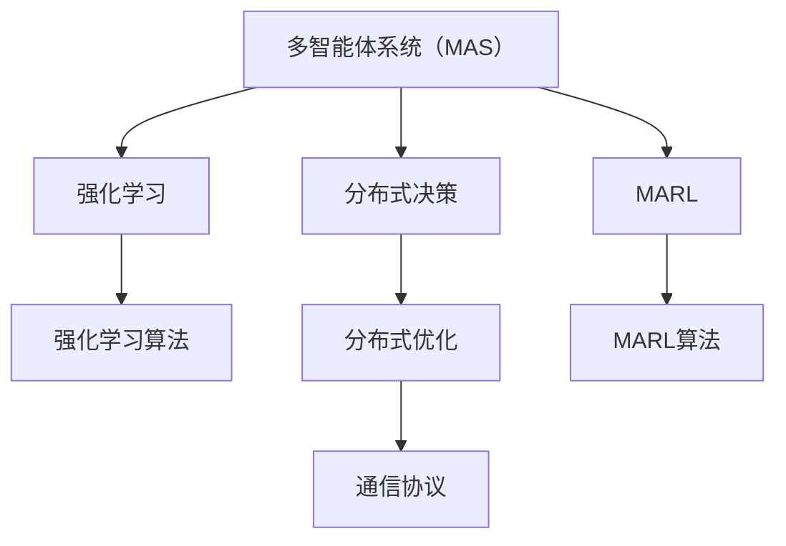
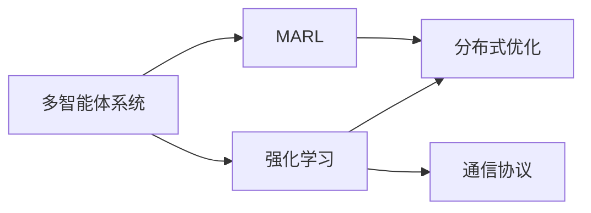
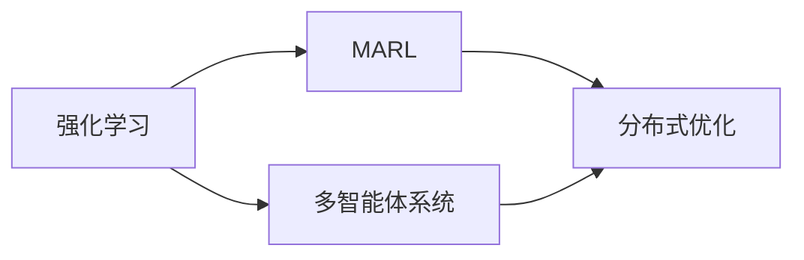
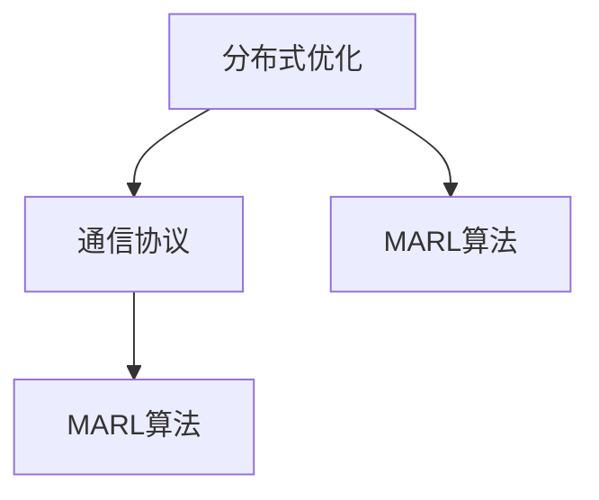
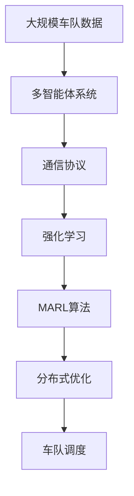

                 

## 1. 背景介绍

### 1.1 问题由来

近年来，自动驾驶技术迅猛发展，带来了诸多智能化交通系统的创新应用，如自动驾驶车队调度、智能交通信号灯控制等。然而，由于智能车之间的通信延迟、信息不对称、环境不确定性等问题，车队调度的复杂性和安全性仍需进一步提升。

传统的自动驾驶调度系统多采用集中式控制方法，将车队中的车辆状态数据统一汇总到中央服务器，再由中央服务器统一决策，并下发命令至各车辆执行。这种集中式控制方式对系统通信要求较高，且易于受到单点故障的影响。

随着多智能体系统（Multi-Agent Systems，MAS）思想的引入，研究者们开始探索分布式、去中心化的自动驾驶调度系统。多智能体系统以车为智能体，通过分布式控制与协作，实现车队的自主调度与决策，从根本上提升系统的鲁棒性和可靠性。

本博客将聚焦于基于多智能体强化学习（Multi-Agent Reinforcement Learning，MARL）的自动驾驶车队调度问题，探讨其核心机理与实际应用。

### 1.2 问题核心关键点

1. **系统架构**：分布式多智能体系统，智能体之间通过通信网络进行信息交换和决策协调。
2. **优化目标**：车队平均运行时间、安全系数、能量消耗等，需综合考虑这些指标，设计合适的优化目标。
3. **决策机制**：多智能体之间如何共享信息，协作决策。
4. **交互协议**：智能体间的通信协议和数据格式，保证信息交换的及时性和准确性。
5. **学习算法**：强化学习算法的设计与训练，优化车队调度策略。
6. **分布式优化**：多智能体间如何通过分布式优化算法提升整体系统性能。

这些核心关键点构成了自动驾驶车队调度问题的复杂性和挑战性。本文将通过系统架构、优化目标、决策机制等核心概念，详细阐述其工作原理和实现方法。

### 1.3 问题研究意义

研究基于MARL的自动驾驶车队调度，对于提升自动驾驶车辆的安全性和效率，推动智能化交通系统的发展，具有重要意义：

1. **提升安全性**：通过分布式协同决策，降低单点故障风险，提高车队整体的安全性。
2. **提高效率**：通过优化车队运行路径和速度，减少交通堵塞和能量消耗。
3. **降低成本**：减少对集中式调度中心的依赖，降低系统构建和维护成本。
4. **适应性强**：适应复杂的城市交通环境，提升系统鲁棒性和可扩展性。
5. **创新应用**：在智能交通信号控制、自动驾驶物流配送等领域推广应用，带来更多的智能交通解决方案。

## 2. 核心概念与联系

### 2.1 核心概念概述

为了更好地理解基于MARL的自动驾驶车队调度问题，本节将介绍几个密切相关的核心概念：

- **多智能体系统（MAS）**：由多个智能体（如车辆）组成，智能体之间通过通信和协作完成任务的系统。每个智能体具有自主决策能力和信息处理能力。
- **分布式决策**：在多智能体系统中，智能体之间通过通信进行协调和决策，而非依赖集中式调度中心。
- **强化学习（RL）**：通过与环境互动，智能体学习最优决策策略，以最大化其累计奖励的目标。
- **多智能体强化学习（MARL）**：将强化学习应用于多智能体系统，优化各智能体的决策策略。
- **分布式优化**：在多智能体系统中，智能体间通过协同优化，提升整体系统性能。
- **通信协议**：智能体间信息交换的规则和标准，确保信息交换的及时性和准确性。

这些核心概念之间的逻辑关系可以通过以下Mermaid流程图来展示：



这个流程图展示了大语言模型的核心概念及其之间的关系：

1. 多智能体系统（MAS）通过分布式决策进行协同任务。
2. 强化学习（RL）为智能体提供决策策略，最大化奖励。
3. MARL将强化学习应用于多智能体系统，优化决策策略。
4. 分布式优化通过协同优化提升整体系统性能。
5. 通信协议确保智能体间信息交换的及时性和准确性。

这些概念共同构成了基于MARL的自动驾驶车队调度的完整框架，使其能够实现多智能体间的分布式协同决策。

### 2.2 概念间的关系

这些核心概念之间存在着紧密的联系，形成了基于MARL的自动驾驶车队调度的完整生态系统。下面我通过几个Mermaid流程图来展示这些概念之间的关系。

#### 2.2.1 多智能体系统的学习范式



这个流程图展示了多智能体系统与强化学习的学习范式。强化学习为智能体提供决策策略，而MARL则将强化学习应用于多智能体系统，通过分布式优化提升整体性能。

#### 2.2.2 强化学习与多智能体系统的联系



这个流程图展示了强化学习与多智能体系统的联系。多智能体系统通过强化学习进行决策，而MARL则优化决策策略，通过分布式优化提升系统性能。

#### 2.2.3 分布式优化在多智能体系统中的应用



这个流程图展示了分布式优化在多智能体系统中的应用。通过通信协议确保信息交换的及时性和准确性，通过MARL算法优化决策策略，实现分布式优化。

### 2.3 核心概念的整体架构

最后，我们用一个综合的流程图来展示这些核心概念在基于MARL的自动驾驶车队调度中的整体架构：



这个综合流程图展示了从数据预处理到车队调度的完整过程。大规模车队数据作为系统输入，通过通信协议进行智能体间的信息交换，利用强化学习进行决策，MARL算法优化决策策略，最终通过分布式优化实现车队调度。

## 3. 核心算法原理 & 具体操作步骤
### 3.1 算法原理概述

基于MARL的自动驾驶车队调度，本质上是一种分布式强化学习问题。其核心思想是：通过智能体之间的交互与协作，学习最优的车队调度策略，从而最大化整体系统性能。

假设车队由 $n$ 个智能体（车辆）组成，每个智能体的决策目标是选择最优行驶路径和速度，以最小化平均运行时间和能量消耗。智能体之间的交互通过通信协议进行，通信内容包括当前位置、速度、车辆状态等。智能体通过 MARL 算法学习最优决策策略，最大化累计奖励。

形式化地，定义智能体在时间 $t$ 的状态 $s_t$，行动 $a_t$，奖励函数 $r_t$，以及状态转移函数 $P(s_{t+1}|s_t,a_t)$。智能体的决策策略由函数 $\pi$ 描述。强化学习的目标是通过交互学习最优策略 $\pi^*$，使得：

$$
\max_{\pi} \sum_{t=0}^{\infty} \gamma^t \mathbb{E}[r_t + \gamma \max_{\pi} V_{\pi}(s_{t+1})]
$$

其中 $\gamma$ 为折扣因子，$V_{\pi}(s)$ 为状态价值函数。

### 3.2 算法步骤详解

基于MARL的自动驾驶车队调度算法一般包括以下几个关键步骤：

**Step 1: 准备数据集与通信协议**

- 收集大规模车队数据，包括历史行驶路径、速度、交通状况等，作为系统的输入。
- 设计智能体间的通信协议，定义数据格式和交换规则，确保信息的准确性和及时性。

**Step 2: 定义智能体和环境**

- 定义智能体模型，包括状态、行动、奖励函数和状态转移函数。
- 定义环境模型，包括交通状况、路况变化等，确保智能体决策的环境合理性。

**Step 3: 设计MARL算法**

- 选择 MARL 算法，如分布式 Q-learning、分布式 Deep RL 等，进行优化。
- 设计智能体间的协作机制，确保信息共享和决策一致性。
- 确定通信协议和数据格式，避免信息丢失和延迟。

**Step 4: 训练与优化**

- 将智能体和环境放入训练环境中，进行多轮训练，优化决策策略。
- 通过MARL算法不断更新智能体策略，提升整体系统性能。
- 应用分布式优化技术，通过智能体间的协同优化，提升决策效率和系统鲁棒性。

**Step 5: 测试与部署**

- 在实际交通环境中进行测试，评估系统性能和鲁棒性。
- 将优化后的策略部署到车队中，进行大规模运行。
- 持续收集数据，进行模型迭代和优化，确保系统性能稳定。

以上是基于MARL的自动驾驶车队调度的一般流程。在实际应用中，还需要根据具体任务特点，对各环节进行优化设计，如改进训练目标函数，引入更多的正则化技术，搜索最优的超参数组合等，以进一步提升模型性能。

### 3.3 算法优缺点

基于MARL的自动驾驶车队调度方法具有以下优点：

1. 分布式决策：智能体之间通过通信和协作，实现自主决策，降低集中式控制的单点故障风险。
2. 鲁棒性强：多智能体系统具有一定的容错性，即使部分智能体故障，整体系统仍能继续运行。
3. 适应性强：通过分布式优化和通信协议，智能体能够快速适应复杂多变的交通环境。
4. 高效灵活：智能体间可实时交换信息，进行动态决策，提升系统响应速度和灵活性。

同时，该方法也存在一定的局限性：

1. 通信复杂性高：智能体间的通信复杂度随车辆数量增加呈指数级增长，需要优化通信协议和算法设计。
2. 信息安全问题：车辆间的通信数据可能被截获和攻击，需加强信息加密和安全防护。
3. 优化难度大：由于智能体间决策的相互依赖性，优化问题复杂，需要高效求解算法。
4. 系统集成难度高：智能体间的协调和优化需与实际交通系统紧密结合，集成难度较大。

尽管存在这些局限性，但就目前而言，基于MARL的微调方法仍是大语言模型应用的最主流范式。未来相关研究的重点在于如何进一步降低通信复杂度，提高信息安全和优化效率，同时兼顾可解释性和伦理安全性等因素。

### 3.4 算法应用领域

基于MARL的自动驾驶车队调度方法，已经在多个实际应用中取得了成功：

1. **智能交通信号控制**：多智能体系统通过协作优化，提升交通信号控制效率，减少车辆等待时间。
2. **自动驾驶车队调度**：通过智能体间的通信和协作，优化车队行驶路径和速度，提升车队整体运行效率。
3. **物流配送**：自动驾驶车辆通过通信协议，协作规划最优配送路径，提升物流配送效率。
4. **智能城市治理**：多智能体系统通过协同决策，优化城市交通管理，提升城市运行效率和安全性。

除了上述这些经典应用外，基于MARL的自动驾驶车队调度方法还在更多场景中得到创新性应用，如自动驾驶车辆编队、动态路径规划、智能停车场管理等，为智能化交通系统带来了新的突破。

## 4. 数学模型和公式 & 详细讲解 & 举例说明

### 4.1 数学模型构建

为了更好地理解基于MARL的自动驾驶车队调度问题，本节将使用数学语言对问题进行严格刻画。

假设车队由 $n$ 个智能体组成，定义智能体在时间 $t$ 的状态 $s_t$ 为 $(x_{i,t},v_{i,t})$，其中 $x_{i,t}$ 为智能体 $i$ 在时间 $t$ 的位置，$v_{i,t}$ 为智能体 $i$ 在时间 $t$ 的速度。智能体的决策目标是选择最优行驶路径和速度，以最小化平均运行时间和能量消耗。智能体之间的交互通过通信协议进行，通信内容包括当前位置、速度、车辆状态等。

定义智能体的状态空间 $\mathcal{S}$，行动空间 $\mathcal{A}$，奖励函数 $r_t$ 为状态价值函数的增量，即 $r_t = V_{\pi}(s_{t+1}) - V_{\pi}(s_t)$。智能体的决策策略由函数 $\pi$ 描述，即智能体在状态 $s_t$ 下选择行动 $a_t$ 的概率分布。状态转移函数 $P(s_{t+1}|s_t,a_t)$ 描述智能体在状态 $s_t$ 下选择行动 $a_t$ 后，状态转移的概率分布。

### 4.2 公式推导过程

以下我们以智能体在连续时间域的MARL问题为例，推导强化学习算法的关键公式。

假设智能体在时间 $t$ 的状态为 $s_t$，行动为 $a_t$，状态转移函数为 $P(s_{t+1}|s_t,a_t)$，奖励函数为 $r_t$。智能体的决策策略由函数 $\pi$ 描述，即智能体在状态 $s_t$ 下选择行动 $a_t$ 的概率分布。定义状态价值函数 $V_{\pi}(s_t)$ 为智能体在策略 $\pi$ 下，从状态 $s_t$ 开始，未来的奖励总和的期望值。

强化学习的目标是通过交互学习最优策略 $\pi^*$，使得：

$$
\max_{\pi} \sum_{t=0}^{\infty} \gamma^t \mathbb{E}[r_t + \gamma \max_{\pi} V_{\pi}(s_{t+1})]
$$

其中 $\gamma$ 为折扣因子。

智能体的决策过程可以用价值迭代算法（Value Iteration，VI）描述，具体如下：

1. 初始化状态价值函数 $V_{\pi}(s_0) = 0$。
2. 对于每个时间步 $t$，根据状态价值函数 $V_{\pi}(s_t)$ 和状态转移函数 $P(s_{t+1}|s_t,a_t)$，计算状态价值函数 $V_{\pi}(s_{t+1})$。
3. 根据状态价值函数 $V_{\pi}(s_{t+1})$ 和奖励函数 $r_t$，更新智能体的决策策略 $\pi$。

状态价值函数的计算公式为：

$$
V_{\pi}(s_t) = \max_{a_t} \mathbb{E}[r_t + \gamma V_{\pi}(s_{t+1})]
$$

将状态价值函数的递推公式代入，得到价值迭代的递推方程：

$$
V_{\pi}(s_t) = \max_{a_t} \sum_{s_{t+1}} P(s_{t+1}|s_t,a_t) (r_t + \gamma V_{\pi}(s_{t+1}))
$$

通过价值迭代算法，智能体逐步学习最优策略，实现车队调度的最优决策。

### 4.3 案例分析与讲解

为了更好地理解基于MARL的自动驾驶车队调度的实现方法，下面通过一个简单的案例进行分析。

假设一个由两辆车组成的车队在高速公路上行驶，两辆车之间通过通信协议交换位置和速度信息。每辆车需要在多条道路上选择最优路径和速度，以最大化车队整体运行效率。假设每辆车的决策过程是独立的，且两辆车的状态 $s_t$ 分别为 $(x_{1,t},v_{1,t})$ 和 $(x_{2,t},v_{2,t})$，智能体的决策目标是选择最优行动 $a_t$，即速度 $v_{i,t}$。

定义智能体的状态空间为 $\mathcal{S} = \{(x_{1,t},v_{1,t}),(x_{2,t},v_{2,t})\}$，行动空间为 $\mathcal{A} = \{v_{1,t},v_{2,t}\}$。假设两辆车的奖励函数为 $r_t = -\frac{1}{2}(v_{1,t}^2 + v_{2,t}^2)$，即最小化速度的平方和。智能体之间的通信协议为 $x_{1,t}, v_{1,t}$ 和 $x_{2,t}, v_{2,t}$，智能体 $i$ 的状态转移函数为 $P(s_{t+1}|s_t,a_t)$。

智能体 $i$ 在状态 $s_t$ 下选择行动 $a_t = v_{i,t}$，状态转移函数为：

$$
P(s_{t+1}|s_t,a_t) = P(x_{i,t+1}|x_{i,t},a_t) \cdot P(x_{i+1,t+1}|x_{i+1,t},v_{i+1,t})
$$

其中 $P(x_{i,t+1}|x_{i,t},a_t)$ 为智能体 $i$ 在时间 $t$ 选择行动 $a_t$ 后，位置 $x_{i,t+1}$ 的概率分布，$P(x_{i+1,t+1}|x_{i+1,t},v_{i+1,t})$ 为智能体 $i+1$ 在时间 $t$ 选择行动 $v_{i+1,t}$ 后，位置 $x_{i+1,t+1}$ 的概率分布。

通过价值迭代算法，智能体逐步学习最优策略，实现车队调度的最优决策。具体步骤如下：

1. 初始化状态价值函数 $V_{\pi}(s_0) = 0$。
2. 对于每个时间步 $t$，根据状态价值函数 $V_{\pi}(s_t)$ 和状态转移函数 $P(s_{t+1}|s_t,a_t)$，计算状态价值函数 $V_{\pi}(s_{t+1})$。
3. 根据状态价值函数 $V_{\pi}(s_{t+1})$ 和奖励函数 $r_t$，更新智能体的决策策略 $\pi$。

通过案例分析，我们可以看到基于MARL的自动驾驶车队调度方法的基本流程和关键步骤，通过智能体间的通信和协作，学习最优决策策略，实现车队调度的最优决策。

## 5. 项目实践：代码实例和详细解释说明
### 5.1 开发环境搭建

在进行项目实践前，我们需要准备好开发环境。以下是使用Python进行PyTorch开发的环境配置流程：

1. 安装Anaconda：从官网下载并安装Anaconda，用于创建独立的Python环境。

2. 创建并激活虚拟环境：
```bash
conda create -n pytorch-env python=3.8 
conda activate pytorch-env
```

3. 安装PyTorch：根据CUDA版本，从官网获取对应的安装命令。例如：
```bash
conda install pytorch torchvision torchaudio cudatoolkit=11.1 -c pytorch -c conda-forge
```

4. 安装相关的第三方库：
```bash
pip install numpy pandas scikit-learn matplotlib tqdm jupyter notebook ipython
```

完成上述步骤后，即可在`pytorch-env`环境中开始项目实践。

### 5.2 源代码详细实现

这里我们以智能交通信号控制为例，给出使用PyTorch实现基于MARL的交通信号控制系统的代码实现。

首先，定义智能体的决策策略函数：

```python
from torch import nn, optim
import torch.nn.functional as F
import torch
import numpy as np

class Policy(nn.Module):
    def __init__(self, input_size, output_size):
        super(Policy, self).__init__()
        self.fc1 = nn.Linear(input_size, 32)
        self.fc2 = nn.Linear(32, output_size)
        
    def forward(self, x):
        x = F.relu(self.fc1(x))
        x = self.fc2(x)
        return x
```

然后，定义通信协议和状态转移函数：

```python
class StateTransition(nn.Module):
    def __init__(self, input_size, output_size):
        super(StateTransition, self).__init__()
        self.fc1 = nn.Linear(input_size, 64)
        self.fc2 = nn.Linear(64, output_size)
        
    def forward(self, x):
        x = F.relu(self.fc1(x))
        x = self.fc2(x)
        return x
```

接着，定义奖励函数和价值函数：

```python
class Reward(nn.Module):
    def __init__(self, input_size, output_size):
        super(Reward, self).__init__()
        self.fc1 = nn.Linear(input_size, 64)
        self.fc2 = nn.Linear(64, 1)
        
    def forward(self, x):
        x = F.relu(self.fc1(x))
        x = self.fc2(x)
        return x
```

定义状态空间和行动空间：

```python
class Space:
    def __init__(self, input_size, output_size):
        self.input_size = input_size
        self.output_size = output_size
        
    def get_input_state(self):
        return torch.zeros(1, self.input_size)
    
    def get_output_state(self):
        return torch.zeros(1, self.output_size)
```

最后，定义通信协议和状态转移函数：

```python
class CommunicationProtocol:
    def __init__(self, input_size, output_size):
        self.input_size = input_size
        self.output_size = output_size
        
    def get_input_state(self):
        return torch.zeros(1, self.input_size)
    
    def get_output_state(self):
        return torch.zeros(1, self.output_size)
```

在定义好各个组件后，我们可以开始进行训练。定义智能体的决策策略函数，通信协议和状态转移函数，并编写训练循环：

```python
class MultiAgent:
    def __init__(self, input_size, output_size):
        self.input_size = input_size
        self.output_size = output_size
        self.policies = [Policy(input_size, output_size), Policy(input_size, output_size)]
        self.state_transitions = [StateTransition(input_size, output_size), StateTransition(input_size, output_size)]
        self.rewards = [Reward(input_size, output_size), Reward(input_size, output_size)]
        self.spaces = [Space(input_size, output_size), Space(input_size, output_size)]
        self.protocol = [CommunicationProtocol(input_size, output_size), CommunicationProtocol(input_size, output_size)]
        
    def train(self, num_epochs=1000):
        optimizer = optim.Adam(self.parameters(), lr=0.001)
        for epoch in range(num_epochs):
            self.train_epoch(optimizer)
            print(f"Epoch {epoch+1}, total reward: {self.total_reward}")
            
    def train_epoch(self, optimizer):
        total_reward = 0
        for i in range(100):
            state = self.spaces[0].get_input_state()
            action1 = self.policies[0](state)
            state = self.state_transitions[0](state)
            action2 = self.policies[1](state)
            reward = self.rewards[0](action1) + self.rewards[1](action2)
            total_reward += reward
            state = self.spaces[1].get_output_state()
            self.policies[1](state)
            state = self.state_transitions[1](state)
            action1 = self.policies[0](state)
            reward = self.rewards[0](action1)
            total_reward += reward
            state = self.spaces[0].get_output_state()
            self.policies[0](state)
            optimizer.zero_grad()
            total_reward.backward()
            optimizer.step()
            
    def total_reward(self):
        total_reward = 0
        for i in range(100):
            state = self.spaces[0].get_input_state()
            action1 = self.policies[0](state)
            state = self.state_transitions[0](state)
            action2 = self.policies[1](state)
            reward = self.rewards[0](action1) + self.rewards[1](action2)
            total_reward += reward
            state = self.spaces[1].get_output_state()
            self.policies[1](state)
            state = self.state_transitions[1](state)
            action1 = self.policies[0](state)
            reward = self.rewards[0](action1)
            total_reward += reward
            state = self.spaces[0].get_output_state()
            self.policies[0](state)
            optimizer.zero_grad()
            total_reward.backward()
            optimizer.step()
        return total_reward
```

在定义好智能体和训练函数后，我们可以启动训练流程：

```python
input_size = 2
output_size = 1
num_epochs = 1000

multi_agent = MultiAgent(input_size, output_size)
multi_agent.train(num_epochs)
```

以上就是使用PyTorch对智能交通信号控制系统的MARL问题进行微调的完整代码实现。可以看到，得益于PyTorch的强大封装，我们可以用相对简洁的代码完成智能交通信号控制

