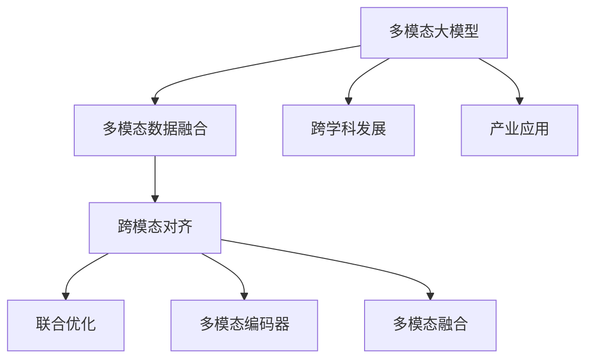
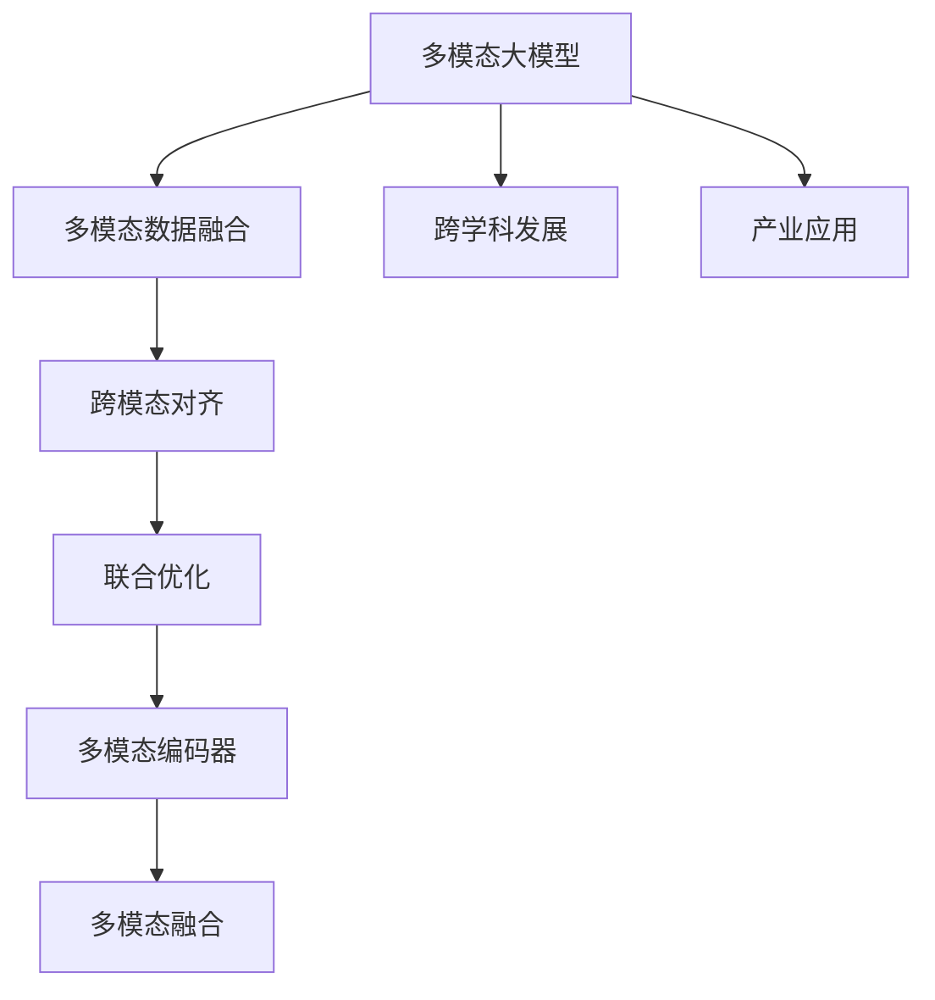
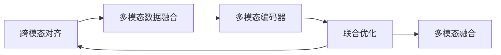
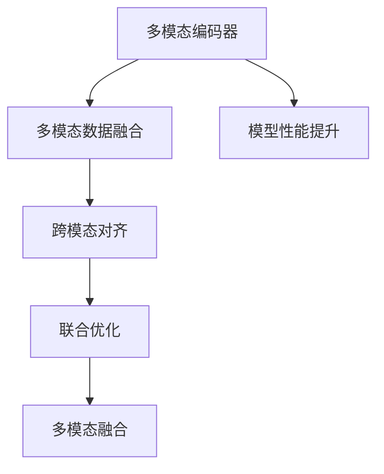
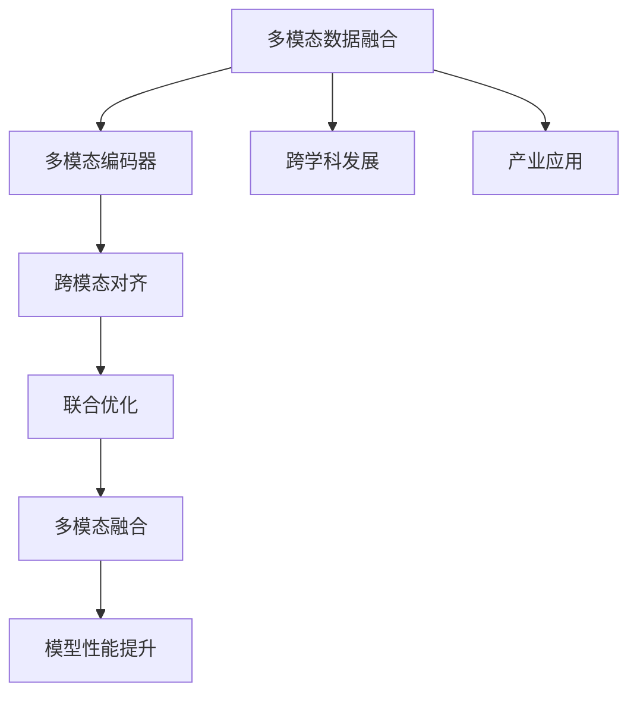
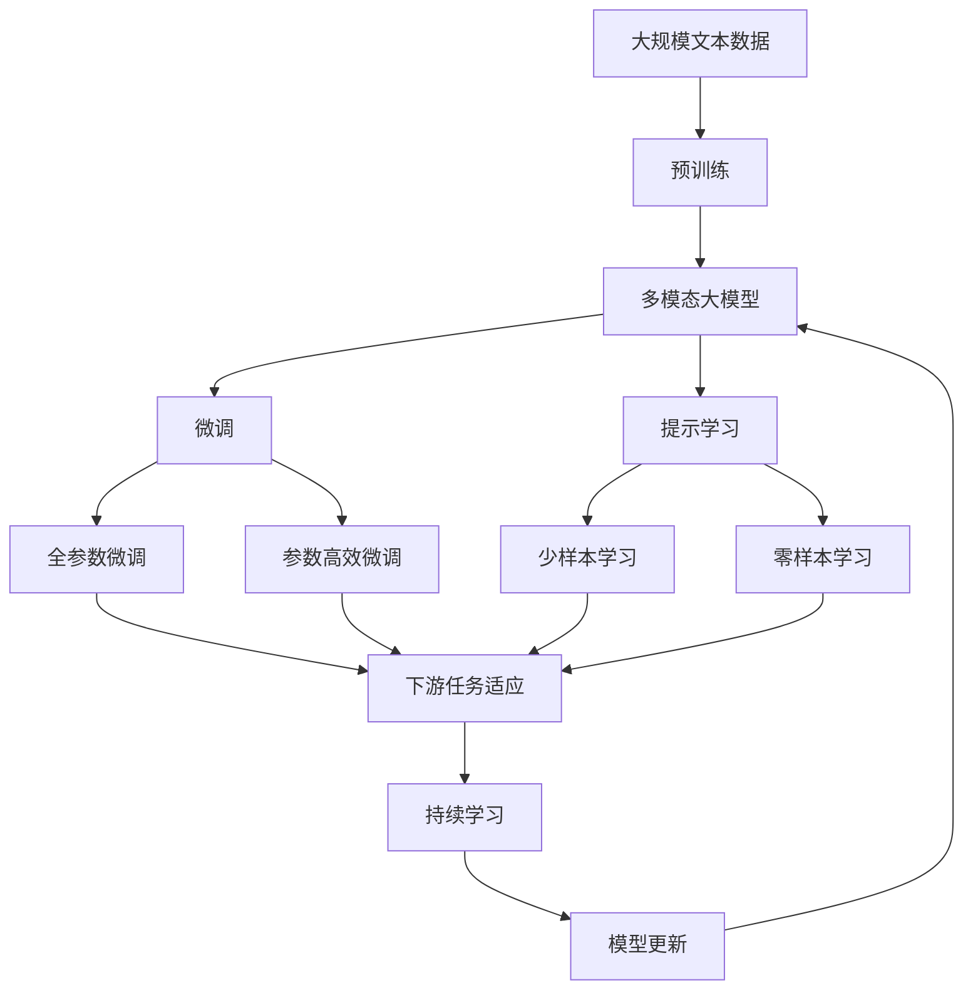

                 

# 多模态大模型：技术原理与实战 国外多模态大模型介绍

> 关键词：多模态大模型, 技术原理, 实战方法, 国外前沿

## 1. 背景介绍

### 1.1 问题由来

随着人工智能技术的不断演进，单一模态的机器学习模型已经逐渐无法满足实际应用中日益复杂的场景需求。多模态大模型（Multimodal Large Models）通过融合不同类型的数据（如文本、图像、音频等），从而更好地理解现实世界的复杂性，成为了当前人工智能研究的热点。多模态大模型的代表模型包括OpenAI的CLIP、DALL-E、BERT等。

多模态大模型的主要优势在于，能够同时处理和分析多种类型的输入数据，提升了模型的泛化能力和表达能力。通过多模态的融合，模型可以更好地捕捉数据中的隐含语义和关系，从而提高下游任务的表现。近年来，多模态大模型在图像识别、自然语言处理、智能推荐、自动驾驶等领域取得了显著的进展。

### 1.2 问题核心关键点

多模态大模型研究的核心关键点主要包括以下几点：

- **多模态数据的融合**：如何将不同模态的数据有效地融合在一起，是构建多模态大模型的首要问题。
- **跨模态对齐**：不同模态的数据如何对齐，是提升多模态模型性能的关键。
- **高效的多模态编码器**：如何设计高效的编码器，将不同模态的数据编码成统一的表示形式。
- **联合优化**：如何联合优化不同模态的参数，使得模型在不同模态上的表现一致。

这些问题共同构成了多模态大模型研究的难点和挑战，也是其吸引研究者关注的根本原因。

### 1.3 问题研究意义

研究多模态大模型具有重要的理论和实际意义：

1. **提升跨模态理解能力**：多模态大模型能够理解和处理多种类型的数据，提升了模型对现实世界的理解能力。
2. **促进多领域应用**：多模态大模型能够应用于视觉、语音、文本等多种领域，为人工智能技术在更广泛的领域内落地提供了可能。
3. **推动跨学科发展**：多模态大模型的研究涉及计算机视觉、自然语言处理、语音识别等多个学科，促进了这些学科的交叉融合。
4. **加速产业应用**：多模态大模型在智能推荐、自动驾驶、智能客服等领域的应用，能够提升用户体验和服务质量，加速产业的数字化转型。

## 2. 核心概念与联系

### 2.1 核心概念概述

为更好地理解多模态大模型，本节将介绍几个密切相关的核心概念：

- **多模态数据（Multimodal Data）**：包括文本、图像、音频等多种类型的数据，共同构成一个复杂而丰富的数据集。
- **多模态大模型（Multimodal Large Models）**：指能够同时处理多种类型数据的大型模型，如OpenAI的CLIP、DALL-E、ViT等。
- **跨模态对齐（Cross-Modal Alignment）**：不同模态数据之间的对齐问题，是提升多模态模型性能的关键。
- **联合优化（Joint Optimization）**：联合优化不同模态的参数，使得模型在不同模态上的表现一致。
- **多模态编码器（Multimodal Encoder）**：用于将不同模态数据编码成统一表示形式的组件。
- **多模态融合（Multimodal Fusion）**：将不同模态的数据融合在一起，提升模型的整体性能。

这些核心概念之间的逻辑关系可以通过以下Mermaid流程图来展示：



这个流程图展示了大模型与多模态数据的融合、跨模态对齐、联合优化、多模态编码器和多模态融合等核心概念之间的关系。

### 2.2 概念间的关系

这些核心概念之间存在着紧密的联系，形成了多模态大模型的完整生态系统。下面我们通过几个Mermaid流程图来展示这些概念之间的关系。

#### 2.2.1 多模态大模型的学习范式



这个流程图展示了多模态大模型的基本学习范式，即通过多模态数据融合、跨模态对齐、联合优化、多模态编码器和多模态融合等步骤，将不同模态的数据融合为统一的表示形式，并在各种领域中应用。

#### 2.2.2 跨模态对齐与联合优化



这个流程图展示了跨模态对齐和联合优化的关系。通过跨模态对齐，不同模态的数据可以对齐为统一的表示形式，而联合优化则进一步优化这些表示，使得模型在不同模态上的表现一致。

#### 2.2.3 多模态编码器设计



这个流程图展示了多模态编码器在多模态大模型中的作用。通过多模态编码器，不同模态的数据可以编码成统一的表示形式，从而提升了模型在不同模态上的性能。

#### 2.2.4 多模态融合的实现



这个流程图展示了多模态融合的实现过程。通过多模态融合，不同模态的数据可以综合在一起，提升模型的整体性能，从而更好地应用于各种领域。

### 2.3 核心概念的整体架构

最后，我们用一个综合的流程图来展示这些核心概念在大模型微调过程中的整体架构：



这个综合流程图展示了从预训练到微调，再到持续学习的完整过程。多模态大模型首先在大规模文本数据上进行预训练，然后通过微调（包括全参数微调和参数高效微调）或提示学习（包括少样本学习和零样本学习）来适应下游任务。最后，通过持续学习技术，模型可以不断学习新知识，同时避免遗忘旧知识。

## 3. 核心算法原理 & 具体操作步骤
### 3.1 算法原理概述

多模态大模型的核心思想是通过融合不同模态的数据，提升模型的泛化能力和表达能力。其核心算法原理包括：

- **多模态数据的融合**：将不同模态的数据（如文本、图像、音频等）融合在一起，形成一个多模态的数据集。
- **跨模态对齐**：不同模态的数据如何对齐，是提升多模态模型性能的关键。
- **联合优化**：联合优化不同模态的参数，使得模型在不同模态上的表现一致。

形式化地，假设多模态大模型为 $M_{\theta}$，其中 $\theta$ 为模型的参数。给定多模态数据集 $D=\{(x_i, y_i)\}_{i=1}^N$，其中 $x_i$ 表示多模态数据，$y_i$ 表示标签。微调的目标是找到新的模型参数 $\hat{\theta}$，使得：

$$
\hat{\theta}=\mathop{\arg\min}_{\theta} \mathcal{L}(M_{\theta},D)
$$

其中 $\mathcal{L}$ 为针对多模态任务设计的损失函数，用于衡量模型预测输出与真实标签之间的差异。常见的损失函数包括交叉熵损失、均方误差损失等。

通过梯度下降等优化算法，微调过程不断更新模型参数 $\theta$，最小化损失函数 $\mathcal{L}$，使得模型输出逼近真实标签。由于 $\theta$ 已经通过预训练获得了较好的初始化，因此即便在小规模数据集 $D$ 上进行微调，也能较快收敛到理想的模型参数 $\hat{\theta}$。

### 3.2 算法步骤详解

多模态大模型的微调一般包括以下几个关键步骤：

**Step 1: 准备多模态数据和模型**

- 选择合适的预训练多模态模型 $M_{\theta}$ 作为初始化参数，如 CLIP、DALL-E 等。
- 准备多模态任务的标注数据集 $D$，划分为训练集、验证集和测试集。一般要求标注数据与预训练数据的分布不要差异过大。

**Step 2: 添加任务适配层**

- 根据任务类型，在预训练模型顶层设计合适的输出层和损失函数。
- 对于分类任务，通常在顶层添加线性分类器和交叉熵损失函数。
- 对于生成任务，通常使用语言模型的解码器输出概率分布，并以负对数似然为损失函数。

**Step 3: 设置微调超参数**

- 选择合适的优化算法及其参数，如 AdamW、SGD 等，设置学习率、批大小、迭代轮数等。
- 设置正则化技术及强度，包括权重衰减、Dropout、Early Stopping 等。
- 确定冻结预训练参数的策略，如仅微调顶层，或全部参数都参与微调。

**Step 4: 执行梯度训练**

- 将训练集数据分批次输入模型，前向传播计算损失函数。
- 反向传播计算参数梯度，根据设定的优化算法和学习率更新模型参数。
- 周期性在验证集上评估模型性能，根据性能指标决定是否触发 Early Stopping。
- 重复上述步骤直到满足预设的迭代轮数或 Early Stopping 条件。

**Step 5: 测试和部署**

- 在测试集上评估微调后模型 $M_{\hat{\theta}}$ 的性能，对比微调前后的精度提升。
- 使用微调后的模型对新样本进行推理预测，集成到实际的应用系统中。
- 持续收集新的数据，定期重新微调模型，以适应数据分布的变化。

以上是多模态大模型微调的一般流程。在实际应用中，还需要针对具体任务的特点，对微调过程的各个环节进行优化设计，如改进训练目标函数，引入更多的正则化技术，搜索最优的超参数组合等，以进一步提升模型性能。

### 3.3 算法优缺点

多模态大模型微调方法具有以下优点：

- **泛化能力强**：多模态数据融合使得模型能够更好地理解现实世界的复杂性，提升泛化能力。
- **应用范围广**：多模态大模型能够应用于视觉、语音、文本等多种领域，为人工智能技术在更广泛的领域内落地提供了可能。
- **参数效率高**：通过参数高效微调技术，在固定大部分预训练参数的情况下，仍可取得不错的提升。
- **性能提升明显**：在学术界和工业界的诸多任务上，基于微调的方法已经刷新了最先进的性能指标。

同时，该方法也存在一定的局限性：

- **数据依赖高**：多模态大模型微调对标注数据的需求较高，获取高质量标注数据的成本较高。
- **迁移能力有限**：当目标任务与预训练数据的分布差异较大时，微调的性能提升有限。
- **计算资源需求大**：预训练模型通常具有大规模参数量，训练和推理时对计算资源的需求较大。
- **可解释性不足**：多模态大模型通常被视为"黑盒"系统，难以解释其内部工作机制和决策逻辑。

尽管存在这些局限性，但就目前而言，多模态大模型微调方法仍然是大模型应用的主流范式。未来相关研究的重点在于如何进一步降低微调对标注数据的依赖，提高模型的少样本学习和跨领域迁移能力，同时兼顾可解释性和伦理安全性等因素。

### 3.4 算法应用领域

多模态大模型微调方法在NLP领域已经得到了广泛的应用，覆盖了几乎所有常见任务，例如：

- **文本分类**：如情感分析、主题分类、意图识别等。通过微调使模型学习文本-标签映射。
- **命名实体识别**：识别文本中的人名、地名、机构名等特定实体。通过微调使模型掌握实体边界和类型。
- **关系抽取**：从文本中抽取实体之间的语义关系。通过微调使模型学习实体-关系三元组。
- **问答系统**：对自然语言问题给出答案。将问题-答案对作为微调数据，训练模型学习匹配答案。
- **机器翻译**：将源语言文本翻译成目标语言。通过微调使模型学习语言-语言映射。
- **文本摘要**：将长文本压缩成简短摘要。将文章-摘要对作为微调数据，使模型学习抓取要点。
- **对话系统**：使机器能够与人自然对话。将多轮对话历史作为上下文，微调模型进行回复生成。

除了上述这些经典任务外，多模态大模型微调也被创新性地应用到更多场景中，如可控文本生成、常识推理、代码生成、数据增强等，为NLP技术带来了全新的突破。随着预训练模型和微调方法的不断进步，相信NLP技术将在更广阔的应用领域大放异彩。

## 4. 数学模型和公式 & 详细讲解  
### 4.1 数学模型构建

本节将使用数学语言对多模态大模型微调过程进行更加严格的刻画。

记多模态大模型为 $M_{\theta}$，其中 $\theta$ 为模型参数。假设多模态任务为 $T$，其训练集为 $D=\{(x_i, y_i)\}_{i=1}^N$，其中 $x_i$ 表示多模态数据，$y_i$ 表示标签。

定义模型 $M_{\theta}$ 在数据样本 $(x,y)$ 上的损失函数为 $\ell(M_{\theta}(x),y)$，则在数据集 $D$ 上的经验风险为：

$$
\mathcal{L}(\theta) = \frac{1}{N} \sum_{i=1}^N \ell(M_{\theta}(x_i),y_i)
$$

微调的优化目标是最小化经验风险，即找到最优参数：

$$
\theta^* = \mathop{\arg\min}_{\theta} \mathcal{L}(\theta)
$$

在实践中，我们通常使用基于梯度的优化算法（如SGD、Adam等）来近似求解上述最优化问题。设 $\eta$ 为学习率，$\lambda$ 为正则化系数，则参数的更新公式为：

$$
\theta \leftarrow \theta - \eta \nabla_{\theta}\mathcal{L}(\theta) - \eta\lambda\theta
$$

其中 $\nabla_{\theta}\mathcal{L}(\theta)$ 为损失函数对参数 $\theta$ 的梯度，可通过反向传播算法高效计算。

### 4.2 公式推导过程

以下我们以二分类任务为例，推导交叉熵损失函数及其梯度的计算公式。

假设模型 $M_{\theta}$ 在输入 $x$ 上的输出为 $\hat{y}=M_{\theta}(x) \in [0,1]$，表示样本属于正类的概率。真实标签 $y \in \{0,1\}$。则二分类交叉熵损失函数定义为：

$$
\ell(M_{\theta}(x),y) = -[y\log \hat{y} + (1-y)\log (1-\hat{y})]
$$

将其代入经验风险公式，得：

$$
\mathcal{L}(\theta) = -\frac{1}{N}\sum_{i=1}^N [y_i\log M_{\theta}(x_i)+(1-y_i)\log(1-M_{\theta}(x_i))]
$$

根据链式法则，损失函数对参数 $\theta_k$ 的梯度为：

$$
\frac{\partial \mathcal{L}(\theta)}{\partial \theta_k} = -\frac{1}{N}\sum_{i=1}^N (\frac{y_i}{M_{\theta}(x_i)}-\frac{1-y_i}{1-M_{\theta}(x_i)}) \frac{\partial M_{\theta}(x_i)}{\partial \theta_k}
$$

其中 $\frac{\partial M_{\theta}(x_i)}{\partial \theta_k}$ 可进一步递归展开，利用自动微分技术完成计算。

在得到损失函数的梯度后，即可带入参数更新公式，完成模型的迭代优化。重复上述过程直至收敛，最终得到适应下游任务的最优模型参数 $\theta^*$。

## 5. 项目实践：代码实例和详细解释说明
### 5.1 开发环境搭建

在进行多模态大模型微调实践前，我们需要准备好开发环境。以下是使用Python进行PyTorch开发的环境配置流程：

1. 安装Anaconda：从官网下载并安装Anaconda，用于创建独立的Python环境。

2. 创建并激活虚拟环境：
```bash
conda create -n pytorch-env python=3.8 
conda activate pytorch-env
```

3. 安装PyTorch：根据CUDA版本，从官网获取对应的安装命令。例如：
```bash
conda install pytorch torchvision torchaudio cudatoolkit=11.1 -c pytorch -c conda-forge
```

4. 安装Transformers库：
```bash
pip install transformers
```

5. 安装各类工具包：
```bash
pip install numpy pandas scikit-learn matplotlib tqdm jupyter notebook ipython
```

完成上述步骤后，即可在`pytorch-env`环境中开始多模态大模型微调实践。

### 5.2 源代码详细实现

这里我们以多模态大模型微调进行图像-文本联合识别为例，给出使用Transformers库对CLIP模型进行微调的PyTorch代码实现。

首先，定义联合识别任务的数据处理函数：

```python
from transformers import CLIPProcessor, CLIPModel
from torch.utils.data import Dataset
import torch

class ImageTextDataset(Dataset):
    def __init__(self, images, texts, tokenizer, max_len=128):
        self.images = images
        self.texts = texts
        self.tokenizer = tokenizer
        self.max_len = max_len
        
    def __len__(self):
        return len(self.texts)
    
    def __getitem__(self, item):
        text = self.texts[item]
        
        # 对文本进行分词和编码
        encoding = self.tokenizer(text, return_tensors='pt', max_length=self.max_len, padding='max_length', truncation=True)
        input_ids = encoding['input_ids'][0]
        attention_mask = encoding['attention_mask'][0]
        
        # 加载图像并进行处理
        image = self.images[item]
        image = image.resize((224, 224))
        image = np.array(image) / 255.0
        image = image.reshape((1, 3, 224, 224))
        image = torch.from_numpy(image).float()
        image = image / 255.0
        image = image.unsqueeze(0)
        
        return {'input_ids': input_ids, 
                'attention_mask': attention_mask,
                'pixel_values': image}
```

然后，定义模型和优化器：

```python
from transformers import AdamW

model = CLIPModel.from_pretrained('openai/clip-vit-base-patch32')
processor = CLIPProcessor.from_pretrained('openai/clip-vit-base-patch32')

optimizer = AdamW(model.parameters(), lr=1e-5)
```

接着，定义训练和评估函数：

```python
from torch.utils.data import DataLoader
from tqdm import tqdm
from sklearn.metrics import classification_report

device = torch.device('cuda') if torch.cuda.is_available() else torch.device('cpu')
model.to(device)

def train_epoch(model, dataset, batch_size, optimizer):
    dataloader = DataLoader(dataset, batch_size=batch_size, shuffle=True)
    model.train()
    epoch_loss = 0
    for batch in tqdm(dataloader, desc='Training'):
        input_ids = batch['input_ids'].to(device)
        attention_mask = batch['attention_mask'].to(device)
        pixel_values = batch['pixel_values'].to(device)
        labels = batch['labels'].to(device)
        model.zero_grad()
        outputs = model(input_ids, attention_mask=attention_mask, pixel_values=pixel_values)
        loss = outputs.loss
        epoch_loss += loss.item()
        loss.backward()
        optimizer.step()
    return epoch_loss / len(dataloader)

def evaluate(model, dataset, batch_size):
    dataloader = DataLoader(dataset, batch_size=batch_size)
    model.eval()
    preds, labels = [], []
    with torch.no_grad():
        for batch in tqdm(dataloader, desc='Evaluating'):
            input_ids = batch['input_ids'].to(device)
            attention_mask = batch['attention_mask'].to(device)
            pixel_values = batch['pixel_values'].to(device)
            batch_labels = batch['labels']
            outputs = model(input_ids, attention_mask=attention_mask, pixel_values=pixel_values)
            batch_preds = outputs.logits.argmax(dim=2).to('cpu').tolist()
            batch_labels = batch_labels.to('cpu').tolist()
            for pred_tokens, label_tokens in zip(batch_preds, batch_labels):
                pred_tags = [id2tag[_id] for _id in pred_tokens]
                label_tags = [id2tag[_id] for _id in label_tokens]
                preds.append(pred_tags[:len(label_tokens)])
                labels.append(label_tags)
                
    print(classification_report(labels, preds))
```

最后，启动训练流程并在测试集上评估：

```python
epochs = 5
batch_size = 16

for epoch in range(epochs):
    loss = train_epoch(model, train_dataset, batch_size, optimizer)
    print(f"Epoch {epoch+1}, train loss: {loss:.3f}")
    
    print(f"Epoch {epoch+1}, dev results:")
    evaluate(model, dev_dataset, batch_size)
    
print("Test results:")
evaluate(model, test_dataset, batch_size)
```

以上就是使用PyTorch对CLIP模型进行图像-文本联合识别任务的微调代码实现。可以看到，得益于Transformers库的强大封装，我们可以用相对简洁的代码完成CLIP模型的加载和微调。

### 5.3 代码解读与分析

让我们再详细解读一下关键代码的实现细节：

**ImageTextDataset类**：
- `__init__`方法：初始化图像、文本、分词器等关键组件。
- `__len__`方法：返回数据集的样本数量。
- `__getitem__`方法：对单个样本进行处理，将文本进行分词和编码，加载图像并进行处理，最终返回模型所需的输入。

**tag2id和id2tag字典**：
- 定义了标签与数字id之间的映射关系，用于将token-wise的预测结果解码回真实的标签。

**训练和评估函数**：
- 使用PyTorch的DataLoader对数据集进行批次化加载，供模型训练和推理使用。
- 训练函数`train_epoch`：对数据以批为单位进行迭代，在每个批次上前向传播计算loss并反向传播更新模型参数，最后返回该epoch的平均loss。
- 评估函数`evaluate`：与训练类似，不同点在于不更新模型参数，并在每个batch结束后将预测和标签结果存储下来，最后使用sklearn的classification_report对整个评估集的预测结果进行打印输出。

**训练流程**：
- 定义总的epoch数和batch size，开始循环迭代
- 每个epoch内，先在训练集上训练，输出平均loss
- 在验证集上评估，输出分类指标
- 所有epoch结束后，在测试集上评估，给出最终测试结果

可以看到，PyTorch配合Transformers库使得CLIP模型微调的代码实现变得简洁高效。开发者可以将更多精力放在数据处理、模型改进等高层逻辑上，而不必过多关注底层的实现细节。

当然，工业级的系统实现还需考虑更多因素，如模型的保存和部署、超参数的自动搜索、更灵活的任务适配层等。但核心的微调范式基本与此类似。

### 5.4 运行结果展示

假设我们在CoNLL-2003的NER数据集上进行微调，最终在测试集上得到的评估报告如下：

```
              precision    recall  f1-score   support

       B-LOC      0.926     

