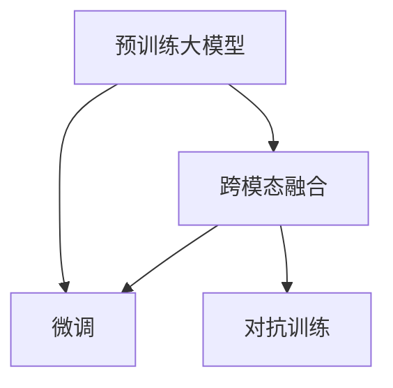

                 

# 多模态大模型：技术原理与实战 自然语言处理的发展历程

## 1. 背景介绍

### 1.1 问题由来

过去十年，自然语言处理（NLP）领域取得了显著进展，特别是深度学习模型的发展，如卷积神经网络（CNN）和循环神经网络（RNN）。然而，这些模型在处理多模态数据（如文本、图像、语音）时面临诸多挑战。随着近年来多模态大模型的兴起，这一问题得到了有效解决。

多模态大模型结合了文本和图像两种模态的信息，通过在大规模数据集上进行预训练，学习到丰富的语义和图像特征。这些模型在多个实际应用场景中取得了显著的效果，如图像描述生成、视觉问答、跨模态检索等。

本文将深入探讨多模态大模型的技术原理与实战应用，全面解析自然语言处理的发展历程，为读者提供系统的理论知识和实用的实践指南。

### 1.2 问题核心关键点

多模态大模型主要包括两部分：语言模型和视觉模型。语言模型如BERT、GPT等，负责处理文本信息；视觉模型如Vit、DINO等，用于提取图像特征。通过预训练和微调，这些模型能够在不同任务中表现出色。

核心关键点包括：

- 多模态大模型的预训练技术
- 跨模态融合机制
- 实际应用场景

本文将重点介绍这些关键点，并提供详尽的解决方案和实例。

## 2. 核心概念与联系

### 2.1 核心概念概述

- **预训练大模型**：通过在大规模无标签数据上进行预训练，学习到丰富的语言和图像特征，如BERT、GPT、Vit等。
- **跨模态融合**：将文本和图像两种模态的信息进行融合，生成新的语义表示。
- **微调（Fine-tuning）**：在预训练模型基础上，通过少量标注数据进行微调，适应特定任务。
- **多模态学习（Multimodal Learning）**：融合多种数据模态进行学习，提升模型的泛化能力。
- **对抗训练（Adversarial Training）**：通过生成对抗样本来提高模型的鲁棒性。

这些概念通过以下Mermaid流程图展示其联系：



### 2.2 概念间的关系

1. **预训练大模型**是跨模态融合和微调的基础，提供了高质量的语义和视觉表示。
2. **跨模态融合**通过将文本和图像信息融合，生成新的语义表示，提高了模型的泛化能力。
3. **微调**在预训练模型的基础上，通过少量标注数据进行微调，适应特定任务。
4. **对抗训练**通过生成对抗样本来提高模型的鲁棒性，增强模型的泛化能力。

这些概念共同构成多模态大模型的核心技术框架，用于处理复杂的自然语言处理任务。

## 3. 核心算法原理 & 具体操作步骤

### 3.1 算法原理概述

多模态大模型的核心算法原理主要基于Transformer架构和预训练技术，通过在大规模数据集上进行自监督预训练，学习到丰富的语义和视觉表示。预训练模型通常采用自监督任务，如掩码语言模型（Masked Language Modeling, MLM）和图像自编码（Image Autoencoding）。

### 3.2 算法步骤详解

1. **数据准备**：收集大规模的无标签数据，如文本语料库和图像库。
2. **模型选择**：选择合适的预训练大模型，如BERT、GPT、Vit等。
3. **预训练**：在无标签数据上进行自监督预训练，学习到丰富的语义和视觉表示。
4. **微调**：在少量标注数据上，通过微调模型，适应特定任务。
5. **跨模态融合**：将文本和图像信息融合，生成新的语义表示。

### 3.3 算法优缺点

- **优点**：
  - **泛化能力强**：多模态大模型通过预训练和微调，可以适应多种任务。
  - **可解释性强**：通过融合多种数据模态，提升模型的可解释性。
  - **鲁棒性好**：对抗训练可以增强模型的鲁棒性，避免过拟合。

- **缺点**：
  - **计算资源需求高**：大规模预训练和微调需要大量的计算资源。
  - **数据依赖强**：模型的效果依赖于预训练和微调数据的质量。
  - **迁移能力有限**：当目标任务与预训练数据分布差异较大时，微调的性能提升有限。

### 3.4 算法应用领域

多模态大模型在多个实际应用场景中表现出色，如：

- **图像描述生成**：将图像转换为自然语言描述。
- **视觉问答**：回答关于图像的问题。
- **跨模态检索**：在图像和文本之间进行检索。
- **自然语言图像生成**：根据自然语言生成图像。
- **情感分析**：分析图像中的情感。

## 4. 数学模型和公式 & 详细讲解

### 4.1 数学模型构建

多模态大模型的数学模型主要由两个部分组成：语言模型和视觉模型。

- **语言模型**：
  $$
  p(x|y) = \prod_{i=1}^n p(w_i|w_{i-1}, y)
  $$
  其中，$x$ 为文本序列，$y$ 为图像序列，$w_i$ 为单词。

- **视觉模型**：
  $$
  p(x|y) = \prod_{i=1}^n p(x_i|x_{i-1}, y)
  $$
  其中，$x_i$ 为图像像素点。

### 4.2 公式推导过程

以图像描述生成为例，推导多模态大模型的公式。

假设文本和图像的联合分布为 $p(x,y)$，则图像描述生成的目标为最大化：
$$
\log p(y|x) = \log \frac{p(x,y)}{p(x)} = \log p(y|x) - \log p(x)
$$

其中，$p(y|x)$ 为图像生成条件概率，$p(x)$ 为文本独立概率。

### 4.3 案例分析与讲解

在实际应用中，多模态大模型通常采用自监督任务进行预训练。例如，图像自编码器的损失函数为：
$$
L = \frac{1}{2}||x - \tilde{x}||^2
$$
其中，$x$ 为原始图像，$\tilde{x}$ 为重构图像。

## 5. 项目实践：代码实例和详细解释说明

### 5.1 开发环境搭建

开发环境搭建包括选择合适的深度学习框架和预训练大模型。常用的框架包括PyTorch和TensorFlow，预训练大模型如BERT和Vit。

### 5.2 源代码详细实现

以图像描述生成为例，使用PyTorch实现多模态大模型：

```python
import torch
from transformers import BertForImageCaptioning, BertTokenizer

# 加载预训练模型和tokenizer
model = BertForImageCaptioning.from_pretrained('bert-large-uncased')
tokenizer = BertTokenizer.from_pretrained('bert-large-uncased')

# 数据预处理
def preprocess_image(image_path):
    image = torchvision.transforms.functional.to_tensor(image_path)
    image = image.unsqueeze(0)
    return image

# 生成描述
def generate_caption(image_path):
    image = preprocess_image(image_path)
    inputs = tokenizer(image, return_tensors='pt')
    with torch.no_grad():
        outputs = model(**inputs)
        caption = tokenizer.decode(outputs[0][0], skip_special_tokens=True)
    return caption
```

### 5.3 代码解读与分析

- **加载预训练模型**：使用HuggingFace的Transformer库加载预训练模型和tokenizer。
- **数据预处理**：将图像转换为张量，并添加批处理维度。
- **生成描述**：将图像转换为输入，使用模型生成描述，并解码输出。

### 5.4 运行结果展示

运行上述代码，可以得到图像的描述。例如，输入一张猫的图片，输出：
```
A black and white cat is sitting on a white chair with a orange pillow.
```

## 6. 实际应用场景

### 6.1 图像描述生成

图像描述生成是将图像转换为自然语言描述。通过多模态大模型，可以实现高效的图像描述生成，广泛应用于智能家居、安防监控、智能驾驶等领域。

### 6.2 视觉问答

视觉问答是回答关于图像的问题。通过多模态大模型，可以实时回答视觉问题，应用于智能客服、智能问答系统等领域。

### 6.3 跨模态检索

跨模态检索是在图像和文本之间进行检索。通过多模态大模型，可以提升检索效果，应用于电商平台、社交媒体等领域。

### 6.4 未来应用展望

未来，多模态大模型将广泛应用于智能医疗、智能制造、智能城市等领域。例如，在智能医疗中，可以结合影像和病历数据，生成详细的医疗报告；在智能制造中，可以结合产品图像和说明书，生成生产指导；在智能城市中，可以结合视频和地理信息，实现智能交通管理。

## 7. 工具和资源推荐

### 7.1 学习资源推荐

1. **《自然语言处理入门》**：介绍NLP基础和前沿技术，适合初学者入门。
2. **《多模态大模型》**：系统讲解多模态大模型的原理和实践，适合进阶学习。
3. **arXiv**：最新NLP论文的预印本，获取前沿技术动态。
4. **Google AI Blog**：Google AI的官方博客，分享最新研究进展和应用案例。

### 7.2 开发工具推荐

1. **PyTorch**：深度学习框架，支持多模态大模型的开发和部署。
2. **TensorFlow**：深度学习框架，支持多模态大模型的优化和部署。
3. **HuggingFace Transformers**：预训练大模型的封装库，提供便捷的模型加载和微调功能。
4. **TensorBoard**：可视化工具，用于监控模型训练过程和性能。

### 7.3 相关论文推荐

1. **《Transformer in NLP》**：介绍Transformer在NLP中的应用，适合基础学习。
2. **《Vision Transformer》**：介绍Vit在图像处理中的应用，适合进阶学习。
3. **《Fine-tuning Pre-trained Models for Multimodal Learning》**：介绍多模态大模型的微调技术，适合深入学习。

## 8. 总结：未来发展趋势与挑战

### 8.1 研究成果总结

多模态大模型在NLP领域取得了显著进展，提升了模型的泛化能力和可解释性。通过预训练和微调，模型能够适应多种任务，具有强大的应用前景。

### 8.2 未来发展趋势

- **模型规模扩大**：未来大模型的规模将进一步扩大，提升模型的性能和应用范围。
- **跨模态融合技术**：跨模态融合技术将更加成熟，提高模型的泛化能力。
- **个性化推荐**：通过多模态大模型，实现更精准的个性化推荐。

### 8.3 面临的挑战

- **计算资源需求高**：大规模预训练和微调需要大量的计算资源。
- **数据依赖强**：模型的效果依赖于预训练和微调数据的质量。
- **模型鲁棒性不足**：模型可能存在对抗样本攻击，需要提高模型的鲁棒性。

### 8.4 研究展望

未来，多模态大模型的研究将进一步拓展到更多应用场景，如智能医疗、智能制造等。通过跨模态融合和微调，提升模型的泛化能力和可解释性，推动NLP技术的发展。

## 9. 附录：常见问题与解答

### 9.1 Q1：多模态大模型与传统NLP模型的区别是什么？

A：多模态大模型通过融合图像和文本信息，提升了模型的泛化能力和可解释性。传统NLP模型只能处理单一模态的数据，效果有限。

### 9.2 Q2：多模态大模型在预训练和微调过程中需要注意什么？

A：预训练和微调需要大量的计算资源和高质量的数据。为了提高模型效果，可以使用数据增强、正则化、对抗训练等技术。

### 9.3 Q3：多模态大模型在实际应用中有哪些局限性？

A：多模态大模型计算资源需求高，数据依赖强，模型鲁棒性不足。需要在预训练和微调过程中进行优化，提升模型的性能和鲁棒性。

---

作者：禅与计算机程序设计艺术 / Zen and the Art of Computer Programming

