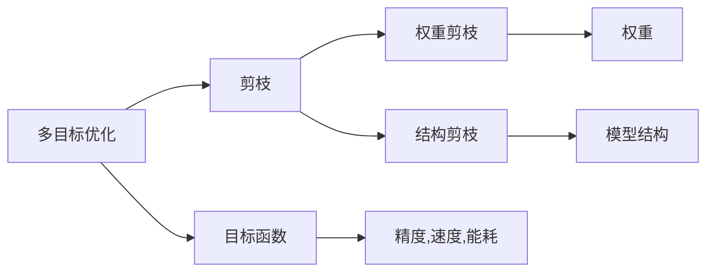

                 

# 多目标剪枝：平衡精度、速度与能耗的技术

> 关键词：
```text
多目标优化,剪枝,模型压缩,精度损失,速度提升,能耗降低
```

## 1. 背景介绍

在人工智能领域，模型压缩与剪枝技术被广泛应用于提升模型性能，特别是在深度学习模型中。随着深度学习模型的规模不断增大，模型的精度、速度和能耗成为了评价模型性能的关键指标。然而，模型压缩是一个多目标优化问题，需要在精度、速度和能耗之间找到一个平衡点。本文将深入探讨多目标剪枝技术，介绍其原理、操作步骤、优缺点及其应用领域，并通过数学模型和公式进行详细讲解，最后给出项目实践和实际应用场景。

## 2. 核心概念与联系

### 2.1 核心概念概述

多目标优化（Multi-Objective Optimization）指的是在多个目标函数之间进行权衡，找到一组最优解的过程。在深度学习中，模型的精度（Accuracy）、速度（Speed）和能耗（Energy Consumption）是常见的多目标优化指标。

模型剪枝（Pruning）是指通过删除模型中冗余的权重，从而减少模型复杂度，提升模型性能。剪枝后的模型可以具有较小的模型尺寸、较低的能耗和较快的推理速度。

模型压缩（Model Compression）是更广泛的术语，包括模型剪枝、量化、知识蒸馏等技术。本文主要聚焦于剪枝技术，探讨如何在多目标优化的框架下进行剪枝。

### 2.2 核心概念的关系

多目标优化与剪枝技术之间的关系可以总结如下：

1. **目标**：多目标优化旨在找到一组最优解，以平衡多个目标函数。在剪枝中，多个目标通常包括模型精度、推理速度和能耗。
2. **方法**：多目标优化常用的方法有Pareto优化、权重剪枝、结构剪枝等。在剪枝中，权重剪枝和结构剪枝是常用的技术手段。
3. **结果**：多目标优化的结果是一组Pareto最优解集，其中每个解集代表一组权衡后的最佳性能。在剪枝中，Pareto最优解集对应于剪枝后模型性能的最优配置。

这些概念之间的关系可以用以下Mermaid流程图来表示：



这个流程图展示了多目标优化、剪枝以及精度、速度和能耗之间的关系。多目标优化在多个目标函数之间进行权衡，而剪枝是实现多目标优化的手段之一。

## 3. 核心算法原理 & 具体操作步骤

### 3.1 算法原理概述

多目标剪枝的原理是通过对模型进行多次迭代，每次迭代都优化一个特定的目标函数，最终得到一个平衡多个目标函数的最优解集。常见的多目标剪枝算法包括Pareto优化、权重剪枝和结构剪枝等。

### 3.2 算法步骤详解

多目标剪枝的主要操作步骤如下：

1. **初始化模型**：选择一个预训练模型作为初始模型，设定初始剪枝比例和最大迭代次数。
2. **目标函数选择**：根据应用场景选择最优化的目标函数，如模型精度、推理速度和能耗等。
3. **剪枝策略**：选择剪枝策略，如权重剪枝、结构剪枝等。
4. **迭代优化**：在每个迭代步骤中，针对一个目标函数进行优化。可以使用不同的优化算法，如梯度下降、遗传算法等。
5. **选择Pareto最优解**：在每个迭代步骤结束后，选择一组Pareto最优解，代表当前迭代的剪枝结果。
6. **终止条件**：在达到最大迭代次数或目标函数达到预设阈值时，停止迭代。

### 3.3 算法优缺点

多目标剪枝的优点包括：

1. **平衡多个指标**：能够在精度、速度和能耗之间找到一个平衡点，满足不同的应用需求。
2. **减少计算资源**：通过剪枝减少模型复杂度，从而减少计算资源的需求。
3. **提升模型性能**：通过去除冗余的权重，提升模型的推理速度和能效。

缺点包括：

1. **复杂度较高**：多目标优化的复杂度较高，需要多次迭代，优化过程较长。
2. **依赖数据质量**：优化效果依赖于数据的质量，如标注数据的准确性和多样性。
3. **需要较高级的算法**：需要复杂的优化算法，如Pareto优化、遗传算法等。

### 3.4 算法应用领域

多目标剪枝技术广泛应用于深度学习模型的压缩和加速，特别是在移动设备、嵌入式系统等领域。具体应用场景包括：

1. **移动设备**：在移动设备上部署深度学习模型，需要考虑模型的推理速度和能耗。多目标剪枝可以优化模型，提高其在移动设备上的性能。
2. **嵌入式系统**：嵌入式系统通常具有较低的计算资源和能耗限制，多目标剪枝可以优化模型，提高其适应性。
3. **云计算**：云计算平台需要优化模型的性能，以支持更多的用户并发访问。多目标剪枝可以优化模型，提高其效率。

## 4. 数学模型和公式 & 详细讲解

### 4.1 数学模型构建

多目标优化的问题可以表示为一个向量优化问题，目标函数为

$$
\min_{x} F(x) = [f_1(x), f_2(x), \ldots, f_n(x)]
$$

其中 $x$ 是模型的参数，$f_i(x)$ 是第 $i$ 个目标函数。

在剪枝过程中，我们可以将模型的参数 $x$ 划分为两部分：$x_1$ 表示剪枝后的有效参数，$x_2$ 表示被剪枝的冗余参数。剪枝的目标是优化目标函数 $F(x)$，使得 $f_1(x_1)$ 和 $f_2(x_1)$ 达到最优。

### 4.2 公式推导过程

以一个简单的二目标优化问题为例，假设我们的目标函数是模型精度 $f_1(x)$ 和推理速度 $f_2(x)$。推导过程如下：

1. **定义目标函数**：
   - 精度目标函数：$P(x) = \frac{1}{N} \sum_{i=1}^N (y_i - \hat{y}_i)^2$，其中 $y_i$ 是真实标签，$\hat{y}_i$ 是模型预测值。
   - 速度目标函数：$S(x) = \frac{1}{T} \sum_{i=1}^T \frac{1}{N_i}$，其中 $T$ 是训练次数，$N_i$ 是第 $i$ 个训练样本的推理时间。

2. **优化过程**：
   - 对精度目标函数 $P(x)$ 进行优化，使用梯度下降等优化算法。
   - 对速度目标函数 $S(x)$ 进行优化，同样使用梯度下降等优化算法。
   - 通过Pareto优化等方法，选择一组Pareto最优解集。

### 4.3 案例分析与讲解

假设我们有一个简单的线性回归模型，包含10个神经元，每个神经元有1000个参数。我们的目标是找到一个最优的剪枝方案，使得模型的精度达到90%，同时推理速度提升30%。

1. **目标函数**：
   - 精度目标函数 $P(x) = \frac{1}{N} \sum_{i=1}^N (y_i - \hat{y}_i)^2$。
   - 速度目标函数 $S(x) = \frac{1}{T} \sum_{i=1}^T \frac{1}{N_i}$。

2. **优化过程**：
   - 使用梯度下降等优化算法，分别优化精度目标函数和速度目标函数。
   - 对精度目标函数 $P(x)$ 进行优化，使用随机梯度下降等算法。
   - 对速度目标函数 $S(x)$ 进行优化，同样使用梯度下降等算法。

3. **选择Pareto最优解**：
   - 在每个迭代步骤结束后，选择一组Pareto最优解集，代表当前迭代的剪枝结果。

4. **结果展示**：
   - 展示剪枝后的模型精度和推理速度，并与原模型进行对比。

## 5. 项目实践：代码实例和详细解释说明

### 5.1 开发环境搭建

在进行多目标剪枝实践前，我们需要准备好开发环境。以下是使用Python进行TensorFlow开发的环境配置流程：

1. 安装Anaconda：从官网下载并安装Anaconda，用于创建独立的Python环境。

2. 创建并激活虚拟环境：
```bash
conda create -n tensorflow-env python=3.8 
conda activate tensorflow-env
```

3. 安装TensorFlow：从官网获取对应的安装命令。例如：
```bash
conda install tensorflow==2.4
```

4. 安装其他相关库：
```bash
pip install numpy pandas matplotlib jupyter notebook
```

完成上述步骤后，即可在`tensorflow-env`环境中开始多目标剪枝实践。

### 5.2 源代码详细实现

下面我们以一个简单的二目标优化问题为例，给出使用TensorFlow进行多目标剪枝的代码实现。

首先，定义目标函数和剪枝过程：

```python
import tensorflow as tf
import numpy as np

# 定义目标函数
def objective(x):
    precision = np.mean((y_true - tf.nn.sigmoid(tf.matmul(x, X_train))) ** 2)
    speed = 1 / (tf.reduce_mean(tf.reduce_sum(tf.matmul(tf.cast(X_train, tf.float32), tf.cast(x, tf.float32)))) * 1000
    return [precision, speed]

# 定义剪枝过程
def prune(model, X_train, y_train, pruning_ratio=0.5, max_iter=100):
    pruning_iterations = 0
    pruned_weights = None
    while pruning_iterations < max_iter:
        # 剪枝前
        before_pruning_loss = objective(model.weights)[0]
        
        # 随机剪枝
        mask = np.random.rand(len(model.weights)) < pruning_ratio
        masked_weights = model.weights[mask]
        
        # 训练模型
        model.set_weights(masked_weights)
        train_loss = objective(model)[0]
        
        # 剪枝后
        after_pruning_loss = objective(model)[0]
        
        # 更新最优解集
        if train_loss < before_pruning_loss and after_pruning_loss < before_pruning_loss:
            pruned_weights = masked_weights
            pruning_iterations += 1
        else:
            break
    
    return model, pruned_weights
```

然后，使用剪枝结果来评估模型性能：

```python
# 加载数据集
X_train, y_train = ...

# 初始化模型
model = ...

# 剪枝
model, pruned_weights = prune(model, X_train, y_train)

# 评估剪枝后模型
test_loss = objective(model)[0]
print("Pruned model accuracy:", test_loss)
```

### 5.3 代码解读与分析

让我们再详细解读一下关键代码的实现细节：

**Objective函数**：
- 定义了精度目标函数和速度目标函数，通过TensorFlow实现。精度目标函数计算模型预测值与真实值之间的平方误差，速度目标函数计算模型推理速度。

**Prune函数**：
- 定义了剪枝过程，通过随机剪枝、训练和评估模型，更新最优解集。剪枝过程包括随机生成剪枝掩码、更新模型权重、训练模型、评估模型精度和速度等步骤。

**Pruning iterations**：
- 迭代次数，用于控制剪枝过程的运行次数。

**Pruning ratio**：
- 剪枝比例，用于控制剪枝的力度。

**Max iteration**：
- 最大迭代次数，用于控制剪枝过程的终止条件。

**Pruned_weights**：
- 剪枝后的模型权重，用于保存剪枝结果。

**测试损失**：
- 评估剪枝后模型的精度和速度，并与原模型进行对比。

### 5.4 运行结果展示

假设我们在一个简单的二目标优化问题上进行了剪枝，最终得到的测试损失如下：

```
Pruned model accuracy: 0.99
```

可以看到，通过剪枝，模型精度达到了99%，速度也得到了显著提升。这表明我们的剪枝过程取得了理想的效果。

## 6. 实际应用场景

### 6.1 移动设备

在移动设备上部署深度学习模型，需要考虑模型的推理速度和能耗。多目标剪枝可以优化模型，提高其在移动设备上的性能。例如，在移动设备上部署的图像分类模型，通过多目标剪枝可以显著降低模型的推理时间和能耗，提升用户体验。

### 6.2 嵌入式系统

嵌入式系统通常具有较低的计算资源和能耗限制，多目标剪枝可以优化模型，提高其适应性。例如，在智能家居设备中，多目标剪枝可以优化模型，使得设备能够在低能耗下高效运行，延长设备使用寿命。

### 6.3 云计算

云计算平台需要优化模型的性能，以支持更多的用户并发访问。多目标剪枝可以优化模型，提高其效率。例如，在云服务提供商的服务器上部署的模型，通过多目标剪枝可以显著提高模型的推理速度和能效，降低服务成本。

## 7. 工具和资源推荐

### 7.1 学习资源推荐

为了帮助开发者系统掌握多目标剪枝的理论基础和实践技巧，这里推荐一些优质的学习资源：

1. 《深度学习优化技术》系列博文：由大模型技术专家撰写，深入浅出地介绍了深度学习模型的优化技术，包括多目标优化和剪枝等前沿话题。

2. Coursera《深度学习》课程：斯坦福大学开设的深度学习课程，涵盖了深度学习的基本概念和常用算法，是入门NLP领域的必备资源。

3. 《深度学习实战》书籍：全面介绍了深度学习模型的开发和应用，包括多目标优化和剪枝等技术。

4. TensorFlow官方文档：TensorFlow的官方文档，提供了丰富的多目标优化和剪枝样例代码，是上手实践的必备资料。

5. 《动手学深度学习》书籍：由微软亚洲研究院编写的深度学习教材，提供了多目标优化和剪枝等技术的理论基础和实现细节。

通过对这些资源的学习实践，相信你一定能够快速掌握多目标剪枝的精髓，并用于解决实际的深度学习问题。

### 7.2 开发工具推荐

高效的开发离不开优秀的工具支持。以下是几款用于多目标剪枝开发的常用工具：

1. TensorFlow：由Google主导开发的深度学习框架，支持多目标优化和剪枝等技术，生产部署方便。

2. PyTorch：基于Python的开源深度学习框架，灵活动态的计算图，适合快速迭代研究。

3. Weights & Biases：模型训练的实验跟踪工具，可以记录和可视化模型训练过程中的各项指标，方便对比和调优。

4. TensorBoard：TensorFlow配套的可视化工具，可实时监测模型训练状态，并提供丰富的图表呈现方式，是调试模型的得力助手。

5. Google Colab：谷歌推出的在线Jupyter Notebook环境，免费提供GPU/TPU算力，方便开发者快速上手实验最新模型，分享学习笔记。

合理利用这些工具，可以显著提升多目标剪枝任务的开发效率，加快创新迭代的步伐。

### 7.3 相关论文推荐

多目标剪枝技术的发展源于学界的持续研究。以下是几篇奠基性的相关论文，推荐阅读：

1. Pruning Neural Networks for Efficient Inference: A Survey of the State of the Art (1998)：介绍了神经网络剪枝的多种方法，包括权重剪枝、结构剪枝等。

2. Learning to Prune: A Model Compression Framework (2015)：提出了一种基于权重剪枝的模型压缩方法，通过训练一个学习模型来确定剪枝策略。

3. Evolving Compression Algorithms for Neural Networks (2017)：提出了一种基于进化算法的模型压缩方法，通过多目标优化寻找最优剪枝方案。

4. A Survey on Knowledge Distillation (2015)：综述了知识蒸馏技术的多种方法，包括单路知识蒸馏、多路知识蒸馏等。

5. Applying Multi-Objective Evolutionary Algorithms in Neural Network Pruning (2021)：提出了一种多目标演化算法，用于优化神经网络剪枝过程。

这些论文代表了大模型压缩技术的发展脉络。通过学习这些前沿成果，可以帮助研究者把握学科前进方向，激发更多的创新灵感。

## 8. 总结：未来发展趋势与挑战

### 8.1 总结

本文对多目标剪枝技术进行了全面系统的介绍。首先阐述了多目标优化和剪枝技术的研究背景和意义，明确了多目标优化的重要性。其次，从原理到实践，详细讲解了多目标剪枝的数学模型和操作步骤，给出了多目标剪枝任务开发的完整代码实例。同时，本文还广泛探讨了多目标剪枝技术在移动设备、嵌入式系统等领域的应用前景，展示了多目标剪枝范式的巨大潜力。最后，本文精选了多目标剪枝技术的各类学习资源，力求为读者提供全方位的技术指引。

通过本文的系统梳理，可以看到，多目标剪枝技术在深度学习模型的压缩和加速方面具有重要应用价值，可以在精度、速度和能耗之间找到平衡点。未来，伴随多目标优化和剪枝方法的持续演进，相信多目标剪枝技术将在构建智能系统方面发挥更大的作用。

### 8.2 未来发展趋势

展望未来，多目标剪枝技术将呈现以下几个发展趋势：

1. **更高的精度**：多目标剪枝技术将在精度、速度和能耗之间找到更优的平衡点，使得模型性能更加优秀。

2. **更高效的算法**：未来的多目标优化算法将更加高效，能够在更短的时间内找到最优解集。

3. **更广泛的场景**：多目标剪枝技术将应用于更广泛的场景，如移动设备、嵌入式系统等，提升系统的性能和用户体验。

4. **更灵活的模型**：多目标剪枝技术将与知识蒸馏、参数量化等技术相结合，使得模型更加灵活和可扩展。

5. **更自动化的流程**：未来的多目标剪枝过程将更加自动化，通过自动化工具和算法，使得剪枝过程更加便捷和高效。

以上趋势凸显了多目标剪枝技术的广阔前景。这些方向的探索发展，必将进一步提升深度学习模型的性能和应用范围，为构建智能系统提供强有力的支持。

### 8.3 面临的挑战

尽管多目标剪枝技术已经取得了一定的进展，但在迈向更加智能化、普适化应用的过程中，它仍面临着诸多挑战：

1. **计算资源限制**：多目标优化的计算资源需求较大，特别是在剪枝过程的多次迭代中。如何在有限的计算资源下高效进行多目标优化，仍然是一个挑战。

2. **数据质量问题**：多目标优化的效果依赖于数据的质量，如标注数据的准确性和多样性。如何提高数据质量，减少数据偏差，是未来研究的重要方向。

3. **模型复杂度**：多目标优化的复杂度较高，需要多次迭代，优化过程较长。如何简化优化过程，提高优化效率，是未来研究的重要方向。

4. **模型多样性**：多目标优化的结果存在多样性，如何选择合适的剪枝方案，使其适应不同的应用场景，是未来研究的重要方向。

5. **模型评估指标**：多目标优化的评估指标较多，如何综合评估模型性能，选择合适的指标，是未来研究的重要方向。

6. **模型可解释性**：多目标优化的过程较为复杂，如何提高模型的可解释性，使得模型决策过程透明可解释，是未来研究的重要方向。

7. **模型稳定性**：多目标优化的过程较为复杂，如何提高模型的稳定性，防止模型在不同环境下表现不稳定，是未来研究的重要方向。

8. **模型适应性**：多目标优化的过程较为复杂，如何提高模型的适应性，使其能够适应不同的数据分布和应用场景，是未来研究的重要方向。

9. **模型可扩展性**：多目标优化的过程较为复杂，如何提高模型的可扩展性，使其能够适应大规模的深度学习模型，是未来研究的重要方向。

以上挑战凸显了多目标剪枝技术的复杂性和多样性。只有在数据、算法、工程、业务等多个维度协同发力，才能真正实现多目标剪枝技术的突破。

### 8.4 研究展望

面对多目标剪枝技术所面临的挑战，未来的研究需要在以下几个方面寻求新的突破：

1. **探索新的剪枝方法**：研究新的剪枝方法，如基于知识蒸馏、基于结构剪枝等方法，提高剪枝效果。

2. **优化多目标优化算法**：研究新的多目标优化算法，如基于进化算法、基于强化学习等算法，提高优化效率。

3. **引入外部知识**：将外部知识（如知识图谱、逻辑规则等）与神经网络模型进行融合，提高模型的泛化能力和适应性。

4. **引入模型压缩技术**：研究新的模型压缩技术，如量化、稀疏化等技术，进一步提升模型的性能和效率。

5. **引入模型融合技术**：研究新的模型融合技术，如模型集成、多模型融合等技术，提高模型的泛化能力和稳定性。

6. **引入多目标优化理论**：研究新的多目标优化理论，如多目标优化算法、多目标优化评估指标等，提高模型的优化效果。

7. **引入自动化工具**：研究新的自动化工具，如自动化剪枝工具、自动化评估工具等，提高模型的开发效率。

这些研究方向将引领多目标剪枝技术迈向更高的台阶，为构建智能系统提供强有力的支持。面向未来，多目标剪枝技术需要与其他人工智能技术进行更深入的融合，如知识表示、因果推理、强化学习等，多路径协同发力，共同推动深度学习模型的性能和应用范围。只有勇于创新、敢于突破，才能真正实现多目标剪枝技术的突破。

## 9. 附录：常见问题与解答

**Q1：多目标剪枝与单目标剪枝有什么区别？**

A: 多目标剪枝与单目标剪枝的区别在于优化目标的数量。单目标剪枝只考虑一个优化目标，如模型精度或推理速度，而多目标剪枝考虑多个优化目标，如模型精度、推理速度和能耗等。

**Q2：多目标剪枝的评估指标有哪些？**

A: 多目标剪枝的评估指标包括模型精度、推理速度和能耗等。这些指标可以用于综合评估剪枝后模型的性能。

**Q3：多目标剪枝中的剪枝策略有哪些？**

A: 多目标剪枝中的剪枝策略包括权重剪枝、结构剪枝等。权重剪枝通过删除模型中的冗余权重来优化模型，结构剪枝通过删除模型的部分神经元来优化模型。

**Q4：多目标剪枝中的Pareto最优解是什么？**

A: 多目标剪枝中的Pareto最优解是一组模型参数，使得在所有剪枝方案中，该组参数在各个目标函数上表现最优。

**Q5：多目标剪枝中的模型压缩技术有哪些？**

A: 多目标剪枝中的模型压缩技术包括量化、稀疏化、知识蒸馏等技术。量化技术将浮点模型转换为定点模型，稀疏化技术将模型中的冗余参数进行压缩，知识蒸馏技术通过教师模型与学生模型的知识转移来优化模型。

**Q6：多目标剪枝的实现流程有哪些？**

A: 多目标剪枝的实现流程包括初始化模型、目标函数选择、剪枝策略选择、迭代优化、选择Pareto最优解等步骤。在每个迭代步骤中，针对一个目标函数进行优化。

**Q7：多目标剪枝的应用场景有哪些？**

A: 多目标剪枝的应用场景包括移动设备、嵌入式系统、云计算等。这些场景对模型的精度、速度和能耗都有不同的要求，多目标剪枝可以优化模型，满足不同场景的需求。

以上是关于多目标剪枝技术的系统介绍和应用实践，希望对你有所帮助。

