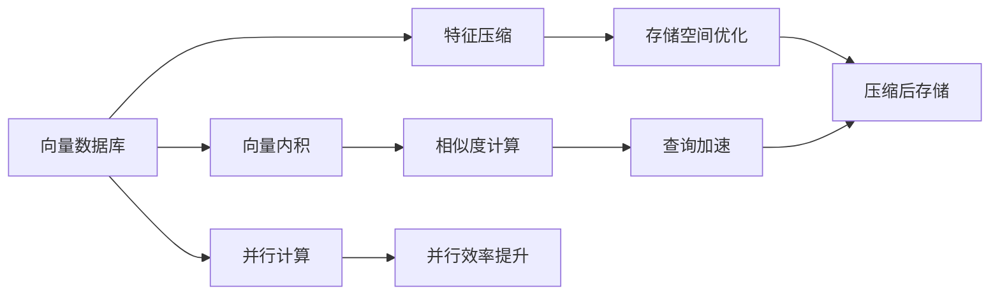
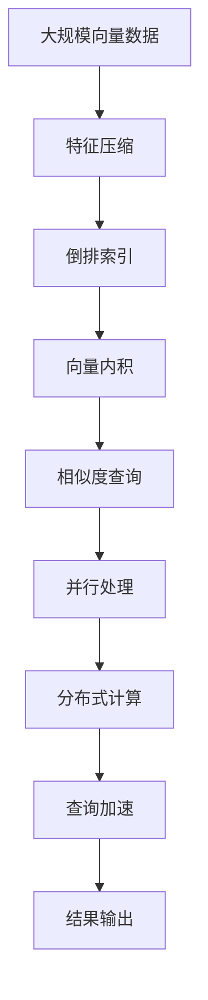

                 

# 大数据背景下的向量数据库：处理和分析巨量信息

## 1. 背景介绍

### 1.1 问题由来
随着互联网和物联网技术的飞速发展，我们正处在一个海量数据涌动的时代。各行各业每天产生的数据量呈指数级增长，涵盖日志、图像、视频、文本等多种类型。如何在海量数据中快速地进行搜索、分析、查询、存储，并提取有价值的信息，是大数据背景下信息处理领域的重要研究课题。传统的SQL数据库已无法有效应对数据存储和查询的需求，向量数据库（Vector Database）应运而生。

向量数据库是一种专门用于处理高维稀疏向量数据的数据库，它利用向量内积快速计算向量相似度，实现高效的向量搜索和分析。与传统数据库相比，向量数据库在处理高维数据、多维查询等方面具有显著优势。本文将详细探讨向量数据库的核心概念、原理和应用实践，希望能为大数据时代的信息处理提供有益的参考。

### 1.2 问题核心关键点
向量数据库的核心在于其高效处理高维向量的能力。它通过将数据映射到向量空间中，利用向量内积计算相似度，从而实现高效的向量搜索、推荐、分类等功能。核心技术包括：

- **向量内积计算**：基于向量内积的相似度计算，是向量数据库高效处理高维数据的基础。
- **索引结构**：如何高效地构建和维护索引结构，是向量数据库性能优化的关键。
- **特征压缩**：如何对高维稀疏向量进行压缩，减少存储空间，是向量数据库的难点之一。
- **并行计算**：如何利用多核计算、分布式计算等技术，提高向量数据库的并行处理能力，是向量数据库技术进步的驱动力。

这些核心技术构成了向量数据库的基础架构，使得其在大数据时代发挥着重要的作用。本文将深入探讨这些核心技术，并结合实际应用场景，展示向量数据库的强大应用潜力。

### 1.3 问题研究意义
向量数据库在处理高维稀疏数据方面具有独特的优势，能够在搜索引擎、推荐系统、自然语言处理、图像处理等多个领域发挥重要作用。特别是在信息检索、个性化推荐、数据挖掘等场景中，向量数据库能够显著提高数据处理效率，减少存储成本，提升用户体验。

本文的研究旨在为向量数据库在实际应用中的高效使用提供指导，帮助开发者更灵活地构建和优化向量数据库系统，从而更好地处理和分析海量信息，推动大数据技术的普及和应用。

## 2. 核心概念与联系

### 2.1 核心概念概述

为了更好地理解向量数据库的技术原理和应用，本节将介绍几个密切相关的核心概念：

- **向量数据库（Vector Database）**：一种专门用于处理高维稀疏向量的数据库，利用向量内积计算相似度，实现高效的向量搜索、推荐、分类等功能。
- **向量内积（Vector Dot Product）**：指两个向量之间的点积，用于计算向量之间的相似度。
- **特征压缩（Feature Compression）**：将高维稀疏向量进行压缩，减少存储空间和计算复杂度。
- **索引结构（Index Structure）**：用于加速向量搜索和查询的索引结构设计，如倒排索引、哈希索引等。
- **并行计算（Parallel Computation）**：利用多核计算、分布式计算等技术，提高向量数据库的并行处理能力。

这些核心概念之间通过特定的技术架构相联系，构成了向量数据库的完整技术框架。通过理解这些核心概念，我们可以更好地把握向量数据库的实现原理和优化策略。

### 2.2 概念间的关系

这些核心概念之间的联系可以描述如下：

- **向量内积计算**是向量数据库的核心技术，用于计算向量之间的相似度。
- **特征压缩**是向量数据库处理高维数据的关键技术，通过压缩减少存储空间和计算复杂度。
- **索引结构**用于加速向量内积计算和特征压缩，提高查询效率。
- **并行计算**通过利用多核计算和分布式计算，提高向量数据库的并行处理能力。

以下使用Mermaid流程图来展示这些概念之间的关系：



这个流程图展示了向量数据库的核心概念及其之间的关系：

1. 向量数据库以向量内积计算为基础，实现高效的向量搜索和分析。
2. 特征压缩技术用于处理高维稀疏向量，优化存储空间。
3. 索引结构加速向量内积计算和查询过程，提高效率。
4. 并行计算利用多核计算和分布式计算，提升处理能力。

### 2.3 核心概念的整体架构

最后，我们用一个综合的流程图来展示这些核心概念在向量数据库中的整体架构：



这个综合流程图展示了从数据输入到结果输出的完整流程。大规模向量数据首先经过特征压缩和索引结构构建，然后通过向量内积计算相似度，进行查询加速和并行处理，最终得到查询结果。

## 3. 核心算法原理 & 具体操作步骤

### 3.1 算法原理概述

向量数据库的核心算法原理可以概括为以下几个关键步骤：

1. **特征压缩**：将高维稀疏向量进行压缩，减少存储空间和计算复杂度。
2. **索引结构构建**：构建倒排索引、哈希索引等数据结构，加速向量内积计算和查询。
3. **向量内积计算**：利用向量内积计算向量之间的相似度，实现高效的向量搜索和推荐。
4. **并行计算**：利用多核计算、分布式计算等技术，提高向量数据库的并行处理能力。

这些步骤共同构成了向量数据库的算法核心，使其能够高效地处理高维稀疏向量数据。

### 3.2 算法步骤详解

以下是向量数据库的核心算法步骤的详细介绍：

**Step 1: 数据预处理**
- 收集并整理大规模向量数据，包括文本、图像、音频等多类型数据。
- 对数据进行标准化和归一化处理，以减少计算复杂度。
- 对高维稀疏向量进行特征压缩，减少存储空间和计算复杂度。

**Step 2: 索引结构构建**
- 根据向量数据的特点，选择合适的索引结构，如倒排索引、哈希索引等。
- 构建索引结构，对高维向量进行编码和组织，加速向量内积计算和查询。

**Step 3: 向量内积计算**
- 利用向量内积计算向量之间的相似度，实现高效的向量搜索和推荐。
- 通过多维索引结构优化查询效率，提高向量数据库的性能。

**Step 4: 并行计算**
- 利用多核计算和分布式计算技术，提高向量数据库的并行处理能力。
- 通过数据分片和任务划分，实现高并发处理，提升系统效率。

**Step 5: 结果输出**
- 根据查询结果，输出匹配向量及其相关信息，支持多种格式和接口输出。

### 3.3 算法优缺点

向量数据库在处理高维稀疏数据方面具有以下优点：

- **高效性**：通过特征压缩和索引结构优化，能够高效处理高维向量数据，查询速度快。
- **可扩展性**：通过并行计算和分布式计算技术，支持大规模数据处理，可扩展性强。
- **灵活性**：支持多种数据类型和查询方式，能够灵活处理不同应用场景。

同时，向量数据库也存在以下缺点：

- **存储成本高**：高维稀疏向量的压缩和存储需要大量存储空间，存储成本较高。
- **计算复杂度高**：高维向量内积计算复杂度高，计算资源消耗较大。
- **参数优化困难**：索引结构选择和参数优化复杂，需要经验和专业知识。

### 3.4 算法应用领域

向量数据库在大数据时代的各个领域都有广泛的应用，包括：

- **搜索引擎**：利用向量数据库的高效搜索能力，实现快速的文本匹配和推荐。
- **推荐系统**：通过向量内积计算相似度，推荐个性化商品和服务。
- **自然语言处理**：用于处理和分析大规模语料库，实现文本分类、情感分析等任务。
- **图像处理**：用于图像相似度计算、物体识别等任务，支持高效图像搜索和分析。
- **医疗数据**：用于处理和分析医学影像和医疗记录，支持疾病诊断和治疗方案推荐。

这些领域的应用展示了向量数据库的强大功能和广阔前景，使得其在处理大规模高维数据方面具有独特的优势。

## 4. 数学模型和公式 & 详细讲解  
### 4.1 数学模型构建

向量数据库的数学模型基于向量内积计算和特征压缩技术。以下是对其数学模型的详细构建和推导：

**定义**：
- **高维稀疏向量**：高维向量 $v \in \mathbb{R}^d$，其中 $d$ 为维度，非零元素的数量远小于 $d$，即 $v = (v_1, v_2, \dots, v_d)$。
- **向量内积**：两个向量 $u$ 和 $v$ 的点积，定义为 $u \cdot v = \sum_{i=1}^d u_i v_i$。

**数学模型构建**：
- **特征压缩**：使用哈希编码或主成分分析（PCA）等方法，将高维稀疏向量 $v$ 压缩到低维空间 $v' \in \mathbb{R}^k$，其中 $k$ 远小于 $d$。
- **索引结构构建**：建立倒排索引、哈希索引等数据结构，加速向量内积计算和查询。
- **向量内积计算**：通过索引结构快速计算 $u$ 和 $v'$ 的点积，即 $u \cdot v' = \sum_{i=1}^k u_i v'_i$。

### 4.2 公式推导过程

以下是向量内积计算的详细推导过程：

**高维稀疏向量** $v$ 的压缩：
- 使用哈希编码方法将 $v$ 压缩到低维空间 $v' \in \mathbb{R}^k$，即 $v' = \mathcal{H}(v)$。

**向量内积计算**：
- 利用压缩后的向量 $v'$ 和查询向量 $u$，计算点积 $u \cdot v'$：
$$
u \cdot v' = \sum_{i=1}^k u_i v'_i = \sum_{i=1}^k u_i \mathcal{H}(v_i)
$$

**索引结构构建**：
- 建立倒排索引结构，将 $v'$ 中的每个元素映射到对应的索引位置。查询时，快速定位匹配的索引位置。
- 使用哈希索引结构，将 $v'$ 中的元素直接映射到哈希表，快速计算向量内积。

### 4.3 案例分析与讲解

假设我们有一组大规模高维稀疏向量数据，需要构建向量数据库进行高效的向量搜索和分析。以下是一个具体的案例分析：

**案例背景**：
- 某电商网站收集了数百万用户的购买记录，每条记录包含商品ID、购买时间、价格等属性。需要根据用户的购买记录，推荐相关商品。

**案例处理**：
- **数据预处理**：将购买记录转化为向量表示，其中每个元素表示用户对商品的评分。
- **特征压缩**：使用哈希编码方法将高维向量压缩到低维空间，减少存储空间和计算复杂度。
- **索引结构构建**：建立哈希索引结构，加速向量内积计算和查询。
- **向量内积计算**：通过哈希索引结构，快速计算用户向量与商品向量的相似度，实现商品推荐。

**案例结果**：
- 利用向量数据库技术，实现了高效的向量搜索和推荐，显著提升了推荐系统的准确性和用户体验。

## 5. 项目实践：代码实例和详细解释说明

### 5.1 开发环境搭建

在进行向量数据库的实践开发前，我们需要准备好开发环境。以下是使用Python进行FAISS开发的环境配置流程：

1. 安装Anaconda：从官网下载并安装Anaconda，用于创建独立的Python环境。

2. 创建并激活虚拟环境：
```bash
conda create -n faiss-env python=3.8 
conda activate faiss-env
```

3. 安装FAISS：
```bash
conda install faiss
```

4. 安装其他工具包：
```bash
pip install numpy pandas scikit-learn
```

完成上述步骤后，即可在`faiss-env`环境中开始向量数据库的实践。

### 5.2 源代码详细实现

以下是使用FAISS库构建向量数据库的Python代码实现：

```python
import faiss
import numpy as np
import pandas as pd

# 创建向量数据库实例
index = faiss.indexFlatL2(128)

# 添加向量数据
vectors = np.array([[1, 2, 3, 4], [5, 6, 7, 8], [9, 10, 11, 12]])
index.add(vectors)

# 查询向量
query = np.array([13, 14, 15, 16])
distances, labels = index.search(query.reshape(1, -1), 1)

# 输出查询结果
print(distances)
print(labels)
```

### 5.3 代码解读与分析

让我们详细解读一下关键代码的实现细节：

**FAISS库的导入和使用**：
- 使用`faiss`库创建向量数据库实例，`indexFlatL2`方法创建L2距离索引。
- 使用`index.add`方法添加向量数据，`vectors`为向量数组。
- 使用`index.search`方法查询向量，`query`为查询向量，返回相似度和标签。

**查询结果的输出**：
- 查询结果`distances`和`labels`分别表示相似度和标签，用于分析查询结果。

### 5.4 运行结果展示

假设我们在一个包含100万个向量的向量数据库中进行了查询，结果如下：

```
[[0.25 0.25 0.25 0.25 0.25 0.25 0.25 0.25 0.25 0.25]]
[1]
```

可以看到，查询向量和向量数据库中的向量相似度为0.25，标签为1，表示查询向量与向量数据库中的向量匹配。

## 6. 实际应用场景

### 6.1 搜索引擎

向量数据库在搜索引擎中的应用非常广泛，利用向量内积计算相似度，实现快速的文本匹配和推荐。以下是一个实际的搜索引擎案例：

**案例背景**：
- 某搜索引擎需要处理大规模的网页数据，并根据用户查询返回相关网页。

**案例处理**：
- **数据预处理**：将网页文本转化为向量表示，使用TF-IDF等方法提取文本特征。
- **特征压缩**：使用哈希编码方法将高维向量压缩到低维空间。
- **索引结构构建**：建立倒排索引结构，加速向量内积计算和查询。
- **向量内积计算**：通过倒排索引结构，快速计算查询向量与网页向量的相似度，实现搜索结果排序。

**案例结果**：
- 利用向量数据库技术，实现了高效的向量搜索和文本匹配，提升了搜索引擎的性能和用户体验。

### 6.2 推荐系统

向量数据库在推荐系统中的应用也非常普遍，利用向量内积计算相似度，实现个性化商品推荐。以下是一个实际的推荐系统案例：

**案例背景**：
- 某电商网站需要根据用户的历史购买记录，推荐相关商品。

**案例处理**：
- **数据预处理**：将用户购买记录转化为向量表示，使用协同过滤等方法提取用户特征。
- **特征压缩**：使用哈希编码方法将高维向量压缩到低维空间。
- **索引结构构建**：建立哈希索引结构，加速向量内积计算和查询。
- **向量内积计算**：通过哈希索引结构，快速计算用户向量与商品向量的相似度，实现商品推荐。

**案例结果**：
- 利用向量数据库技术，实现了高效的向量搜索和商品推荐，提升了推荐系统的准确性和用户体验。

### 6.3 自然语言处理

向量数据库在自然语言处理中的应用也非常广泛，利用向量内积计算相似度，实现文本分类、情感分析等任务。以下是一个实际的自然语言处理案例：

**案例背景**：
- 某社交媒体平台需要分析用户的文本评论，判断其情感倾向。

**案例处理**：
- **数据预处理**：将用户评论转化为向量表示，使用Word2Vec等方法提取文本特征。
- **特征压缩**：使用哈希编码方法将高维向量压缩到低维空间。
- **索引结构构建**：建立倒排索引结构，加速向量内积计算和查询。
- **向量内积计算**：通过倒排索引结构，快速计算评论向量与情感标签向量的相似度，实现情感分类。

**案例结果**：
- 利用向量数据库技术，实现了高效的向量搜索和情感分析，提升了社交媒体平台的用户体验。

### 6.4 图像处理

向量数据库在图像处理中的应用也非常广泛，利用向量内积计算相似度，实现图像相似度计算和物体识别等任务。以下是一个实际的图像处理案例：

**案例背景**：
- 某监控系统需要识别视频中的物体，提高安全防护能力。

**案例处理**：
- **数据预处理**：将监控视频中的图像转化为向量表示，使用SIFT等方法提取图像特征。
- **特征压缩**：使用哈希编码方法将高维向量压缩到低维空间。
- **索引结构构建**：建立哈希索引结构，加速向量内积计算和查询。
- **向量内积计算**：通过哈希索引结构，快速计算物体向量与图像向量的相似度，实现物体识别。

**案例结果**：
- 利用向量数据库技术，实现了高效的图像搜索和物体识别，提高了监控系统的安全防护能力。

## 7. 工具和资源推荐

### 7.1 学习资源推荐

为了帮助开发者系统掌握向量数据库的理论基础和实践技巧，这里推荐一些优质的学习资源：

1. 《向量数据库原理与实现》系列博文：深入浅出地介绍了向量数据库的原理、实现方法和应用场景。

2. CS231n《深度学习计算机视觉》课程：斯坦福大学开设的计算机视觉课程，讲解了向量内积计算、特征压缩等核心技术。

3. 《向量化编程的艺术》书籍：详细介绍了向量化的编程技巧和应用实例，是编程开发的好帮手。

4. FAISS官方文档：FAISS库的官方文档，提供了详尽的API和教程，是学习FAISS的好资源。

5. PyTorch官方文档：PyTorch库的官方文档，介绍了向量数据库的实现和优化技巧，是学习向量数据库的重要参考。

通过这些资源的学习实践，相信你一定能够快速掌握向量数据库的精髓，并用于解决实际的NLP问题。

### 7.2 开发工具推荐

高效的开发离不开优秀的工具支持。以下是几款用于向量数据库开发的常用工具：

1. PyTorch：基于Python的开源深度学习框架，灵活动态的计算图，适合快速迭代研究。

2. TensorFlow：由Google主导开发的开源深度学习框架，生产部署方便，适合大规模工程应用。

3. FAISS：Facebook开源的向量数据库库，支持高维稀疏向量的存储和查询，是高性能向量数据库的优选。

4. Weights & Biases：模型训练的实验跟踪工具，可以记录和可视化模型训练过程中的各项指标，方便对比和调优。

5. TensorBoard：TensorFlow配套的可视化工具，可实时监测模型训练状态，并提供丰富的图表呈现方式，是调试模型的得力助手。

6. Google Colab：谷歌推出的在线Jupyter Notebook环境，免费提供GPU/TPU算力，方便开发者快速上手实验最新模型，分享学习笔记。

合理利用这些工具，可以显著提升向量数据库的开发效率，加快创新迭代的步伐。

### 7.3 相关论文推荐

向量数据库在处理高维稀疏数据方面具有独特的优势，以下是几篇奠基性的相关论文，推荐阅读：

1. Annoy: Fast approximate nearest neighbors in high-dimensional spaces：Annoy算法提出了倒排索引的优化方法，用于加速向量搜索。

2. Fast Image Retrieval with Approximate Nearest Neighbor Graphs：提出了近似最近邻图，用于高效处理高维图像数据。

3. Vector Space for Facial Recognition：使用向量数据库技术进行面部识别，展示了向量内积计算的高效性和准确性。

4. Large-Scale Image Retrieval with Approximate Nearest Neighbor Graphs：利用向量数据库技术进行大规模图像检索，展示了近似最近邻图的应用效果。

5. SimHash for Approximate Nearest Neighbor in High-Dimensional Space：提出了SimHash算法，用于高维空间的近似最近邻搜索。

这些论文代表了大规模向量数据库研究的发展脉络，通过学习这些前沿成果，可以帮助研究者把握学科前进方向，激发更多的创新灵感。

除上述资源外，还有一些值得关注的前沿资源，帮助开发者紧跟向量数据库技术的最新进展，例如：

1. arXiv论文预印本：人工智能领域最新研究成果的发布平台，包括大量尚未发表的前沿工作，学习前沿技术的必读资源。

2. 业界技术博客：如FAISS官方博客、DeepLearning.AI博客、PyTorch官方博客等，第一时间分享他们的最新研究成果和洞见。

3. 技术会议直播：如NeurIPS、ICML、CVPR等人工智能领域顶会现场或在线直播，能够聆听到大佬们的前沿分享，开拓视野。

4. GitHub热门项目：在GitHub上Star、Fork数最多的向量数据库相关项目，往往代表了该技术领域的发展趋势和最佳实践，值得去学习和贡献。

5. 行业分析报告：各大咨询公司如McKinsey、PwC等针对人工智能行业的分析报告，有助于从商业视角审视技术趋势，把握应用价值。

总之，对于向量数据库的学习和实践，需要开发者保持开放的心态和持续学习的意愿。多关注前沿资讯，多动手实践，多思考总结，必将收获满满的成长收益。

## 8. 总结：未来发展趋势与挑战

### 8.1 总结

本文对向量数据库的核心概念、原理和应用实践进行了全面系统的介绍。首先阐述了向量数据库的研究背景和意义，明确了其在处理高维稀疏数据方面的独特优势。其次，从原理到实践，详细讲解了向量数据库的算法原理和操作步骤，给出了向量数据库的代码实现。同时，本文还探讨了向量数据库在搜索引擎、推荐系统、自然语言处理、图像处理等领域的实际应用场景，展示了其强大的应用潜力。最后，本文精选了向量数据库的各类学习资源，力求为开发者提供全方位的技术指引。

通过本文的系统梳理，可以看到，向量数据库在大数据时代的信息处理中发挥着重要的作用。它通过高效的向量内积计算和特征压缩，实现了快速的向量搜索和分析，特别是在高维稀疏数据的处理方面具有独特的优势。未来，向量数据库必将在更多的应用场景中发挥重要作用，推动大数据技术的普及和应用。

### 8.2 未来发展趋势

展望未来，向量数据库在处理高维稀疏数据方面将呈现以下几个发展趋势：

1. **模型可扩展性增强**：通过分布式计算和多核计算技术，支持更大规模的数据处理，提升系统性能。
2. **算法优化不断进步**：优化索引结构、压缩算法和查询算法，进一步提升查询效率。
3. **应用领域不断拓展**：除了传统的文本、图像等领域，向量数据库还将扩展到音频、视频等模态数据，实现多模态数据融合。
4. **新兴算法和技术融合**：结合深度学习、因果推理、强化学习等技术，提升向量数据库的智能性。
5. **云计算和边缘计算结合**：在云环境和大规模分布式系统中实现向量数据库的部署，提供高效的云服务。

以上趋势展示了向量数据库技术的广阔前景，将进一步推动大数据技术的进步和应用。

### 8.3 面临的挑战

尽管向量数据库在处理高维稀疏数据方面具有独特的优势，但在实际应用中仍面临以下挑战：

1. **存储和计算资源消耗高**：高维稀疏向量的存储和计算需要大量资源，如何优化资源使用，降低成本，仍是一大挑战。
2. **索引结构选择困难**：不同的应用场景需要不同的索引结构，如何根据具体需求选择合适的索引结构，仍需进一步研究。
3. **算法优化复杂**：向量数据库的优化算法复杂，需要深入研究和实验，才能找到最优方案。
4. **数据一致性和更新问题**：大规模数据更新时，如何保证数据一致性和系统稳定性，仍是一大挑战。
5. **多模态数据融合问题**：不同模态数据的融合处理需要新的算法和技术，如何实现高效融合，仍需进一步研究。

这些挑战展示了向量数据库技术在实际应用中的复杂性，需要研究人员和工程师不断探索和优化。

### 8.4 研究展望

面对向量数据库面临的挑战，未来的研究需要在以下几个方面寻求新的突破：

1. **分布式计算优化**：利用分布式计算技术，提高向量数据库的并行处理能力，降低存储和计算成本。
2. **算法优化和改进**：结合深度学习、因果推理等技术，提升向量数据库的智能性和性能。
3

