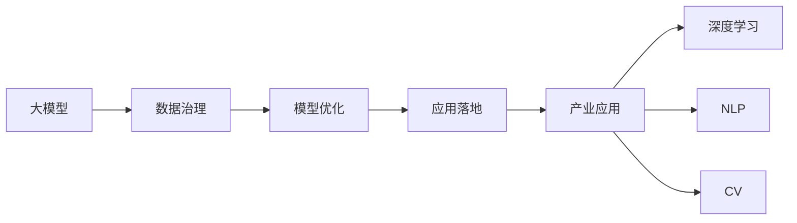
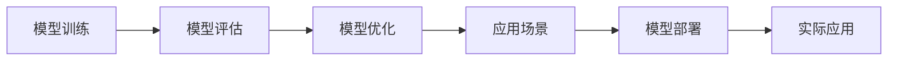
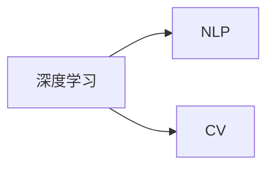
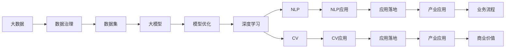

                 

# 大模型在AI产业中的应用:从数据到应用

> 关键词：大模型,AI产业,数据治理,模型优化,应用落地,深度学习,机器学习,自然语言处理(NLP),计算机视觉(CV),应用场景,产业应用

## 1. 背景介绍

### 1.1 问题由来
人工智能(AI)作为当今最炙手可热的前沿技术之一，已经成为推动各行各业数字化转型的重要引擎。而大模型，作为AI的重要组成部分，在深度学习和机器学习领域掀起了一股浪潮，带来了前所未有的突破。然而，如何将这些大模型有效地应用于实际产业，并真正产生商业价值，是当前AI产业面临的核心挑战。

### 1.2 问题核心关键点
在AI产业中，大模型的应用主要集中在数据处理、模型优化和实际应用落地三个环节。其核心关键点包括：

1. **数据治理**：如何高效、可靠地管理和治理大模型训练所需的海量数据，是应用大模型的第一步。
2. **模型优化**：如何在计算资源有限的情况下，高效地优化大模型的性能，确保其在实际应用中的稳定性和效率。
3. **应用落地**：如何将大模型应用于具体的产业场景中，提升业务流程的自动化、智能化水平，创造实际的经济效益。

### 1.3 问题研究意义
研究大模型在AI产业中的应用，不仅有助于提升模型的性能和应用效果，还能够推动AI技术在各垂直行业中的快速落地，促进产业数字化转型。其具体意义包括：

1. **提升产业效率**：通过大模型自动化处理数据，优化决策过程，提升产业整体的运行效率。
2. **增强业务洞察**：大模型能够从海量数据中提取有价值的信息，帮助企业更好地理解和预测市场趋势，制定科学的决策。
3. **降低开发成本**：利用大模型提供的通用知识，减少从头开发新模型的时间和成本，加速技术迭代。
4. **推动创新应用**：大模型为AI产业带来了新的技术思路和应用场景，激发了新的商业模式的探索和创新。

## 2. 核心概念与联系

### 2.1 核心概念概述

为更好地理解大模型在AI产业中的应用，本节将介绍几个关键概念，并阐明它们之间的联系。

- **大模型**：指通过深度学习训练得到的庞大参数量、复杂结构的模型，如GPT、BERT等。这些模型具有强大的特征提取和泛化能力，能够处理大规模的复杂数据。

- **数据治理**：指对数据进行收集、清洗、标注和管理的过程。数据治理的好坏直接决定了模型的训练效果和应用效果。

- **模型优化**：指在计算资源有限的情况下，通过优化算法和策略，提升模型的性能和效率，减少训练和推理的时间和成本。

- **应用落地**：指将训练好的大模型应用于实际业务场景中，解决具体问题，创造实际价值。

- **产业应用**：指大模型在各垂直行业中的应用实践，如金融、医疗、零售等。

- **深度学习**：一种基于神经网络的机器学习技术，通过多层神经网络进行特征提取和模型训练，是构建大模型的核心技术。

- **自然语言处理(NLP)**：利用计算机处理和理解人类语言的技术，是深度学习的重要应用领域之一。

- **计算机视觉(CV)**：利用计算机处理和分析图像、视频等视觉数据的技术，也是深度学习的重要应用领域之一。

这些概念之间的逻辑关系可以通过以下Mermaid流程图来展示：



这个流程图展示了从大模型的构建到实际应用的全过程。大模型首先通过数据治理获取高质量的数据，然后在模型优化环节提升性能，最后通过应用落地和产业应用，实现商业价值。深度学习、NLP和CV是大模型应用的主要技术手段，也是连接数据治理和模型优化的桥梁。

### 2.2 概念间的关系

这些核心概念之间存在着紧密的联系，形成了大模型应用的全生命周期。下面我通过几个Mermaid流程图来展示这些概念之间的关系。

#### 2.2.1 大模型的构建过程


这个流程图展示了大模型的构建过程，包括数据收集、清洗、标注、模型构建、训练和优化等多个环节。其中，数据治理是基础，模型优化是关键，两者共同决定了模型的性能和应用效果。

#### 2.2.2 模型优化与产业应用的关系



这个流程图展示了模型优化与产业应用的关系。模型优化是模型评估和实际应用之间的桥梁，通过优化提升模型的性能，确保其在实际应用中的稳定性和效率。应用场景和实际应用是模型的最终归宿，是模型优化追求的目标。

#### 2.2.3 深度学习、NLP和CV之间的关系



这个流程图展示了深度学习、NLP和CV之间的关系。深度学习是大模型的基础，而NLP和CV是大模型的重要应用领域。通过深度学习构建的NLP和CV模型，能够处理文本和图像数据，提升业务流程的自动化和智能化水平。

### 2.3 核心概念的整体架构

最后，我们用一个综合的流程图来展示这些核心概念在大模型应用过程中的整体架构：



这个综合流程图展示了从数据治理到大模型构建，再到模型优化和应用落地的完整过程。深度学习、NLP和CV是大模型应用的主要技术手段，也是连接数据治理和模型优化的桥梁。大模型应用最终通过NLP和CV的实际应用，提升业务流程的自动化和智能化水平，创造实际的经济效益。

## 3. 核心算法原理 & 具体操作步骤
### 3.1 算法原理概述

大模型在AI产业中的应用，主要基于深度学习的原理，利用神经网络对数据进行特征提取和模型训练。其核心算法原理包括以下几个关键步骤：

1. **数据预处理**：对原始数据进行清洗、标注和归一化，以便于模型训练。
2. **模型构建**：选择合适的深度学习模型结构，如卷积神经网络(CNN)、循环神经网络(RNN)、变分自编码器(VAE)等，并进行模型构建。
3. **模型训练**：利用训练数据集对模型进行训练，通过反向传播算法更新模型参数。
4. **模型评估**：在测试数据集上对模型进行评估，衡量其性能和泛化能力。
5. **模型优化**：通过正则化、优化算法、超参数调优等手段，提升模型性能和效率。
6. **应用部署**：将训练好的模型部署到实际业务系统中，实现商业应用。

### 3.2 算法步骤详解

以下是大模型在AI产业中的具体应用步骤，以NLP和CV为例：

**NLP应用步骤**：
1. **数据收集与标注**：从公开数据源或企业内部数据源获取大量的文本数据，并进行清洗、标注。
2. **模型构建**：选择合适的NLP模型，如BERT、GPT等，并进行模型构建。
3. **模型训练**：利用标注好的数据集对模型进行训练，通过反向传播算法更新模型参数。
4. **模型优化**：通过正则化、Dropout、AdamW等优化算法和策略，提升模型性能和泛化能力。
5. **模型评估**：在测试数据集上对模型进行评估，衡量其性能和泛化能力。
6. **模型部署**：将训练好的模型部署到实际业务系统中，实现商业应用，如智能客服、情感分析、文本生成等。

**CV应用步骤**：
1. **数据收集与标注**：从公开数据源或企业内部数据源获取大量的图像、视频数据，并进行清洗、标注。
2. **模型构建**：选择合适的CV模型，如CNN、ResNet等，并进行模型构建。
3. **模型训练**：利用标注好的数据集对模型进行训练，通过反向传播算法更新模型参数。
4. **模型优化**：通过正则化、Dropout、AdamW等优化算法和策略，提升模型性能和泛化能力。
5. **模型评估**：在测试数据集上对模型进行评估，衡量其性能和泛化能力。
6. **模型部署**：将训练好的模型部署到实际业务系统中，实现商业应用，如人脸识别、图像分类、自动驾驶等。

### 3.3 算法优缺点

大模型在AI产业中的应用具有以下优点：

1. **强大的泛化能力**：通过深度学习构建的大模型，能够从海量数据中提取丰富的特征，具有强大的泛化能力，能够在不同的应用场景中取得优异的效果。
2. **高效的特征提取**：大模型能够自动学习数据的特征表示，避免了手动特征提取的繁琐和易错性，提升了模型的精度和效率。
3. **自适应能力强**：大模型能够根据不同的应用场景和数据特点进行自适应调整，适应多种不同的应用需求。
4. **便于集成和部署**：大模型通常提供API接口，便于集成到现有的业务系统中，并支持多种部署方式，如云平台、本地部署等。

同时，大模型在AI产业中的应用也存在一些缺点：

1. **高昂的计算成本**：大模型通常需要大量的计算资源进行训练和推理，增加了企业的计算成本。
2. **数据依赖性强**：大模型的性能依赖于数据的质量和数量，数据治理和标注的成本较高。
3. **模型复杂度高**：大模型的参数量巨大，模型结构复杂，调试和维护难度较大。
4. **算法复杂性**：深度学习算法的复杂性较高，需要深厚的数学和编程功底，普通开发者难以直接使用。

### 3.4 算法应用领域

大模型在AI产业中的应用领域非常广泛，主要包括以下几个方面：

1. **自然语言处理(NLP)**：用于文本分类、情感分析、机器翻译、问答系统等，提升了文本处理的自动化和智能化水平。
2. **计算机视觉(CV)**：用于图像分类、目标检测、图像生成、人脸识别等，提升了图像处理的自动化和智能化水平。
3. **推荐系统**：用于电商、社交媒体等领域的个性化推荐，提升了用户体验和转化率。
4. **智能客服**：用于客户咨询、订单处理、售后服务等，提升了客户满意度和服务效率。
5. **金融风控**：用于信用评估、欺诈检测、风险预警等，提升了金融机构的业务决策水平。
6. **医疗诊断**：用于疾病诊断、药物研发、健康管理等，提升了医疗服务的智能化和个性化水平。
7. **智能制造**：用于设备监控、质量控制、工艺优化等，提升了制造业的生产效率和质量。

## 4. 数学模型和公式 & 详细讲解  
### 4.1 数学模型构建

大模型的数学模型通常基于神经网络结构，包括卷积神经网络(CNN)、循环神经网络(RNN)、变压器(Transformer)等。这里以Transformer为例，介绍大模型的数学模型构建。

假设输入数据为 $x$，输出数据为 $y$，模型参数为 $\theta$，则Transformer模型的输入-输出映射关系可以表示为：

$$
y = f_{\theta}(x)
$$

其中 $f_{\theta}$ 表示Transformer模型，其包含编码器和解码器两部分，模型参数 $\theta$ 分布在编码器和解码器的各个层中。Transformer的编码器和解码器结构如图：


编码器由多个自注意力层和前馈神经网络层组成，用于提取输入数据的特征表示。解码器同样由多个自注意力层和前馈神经网络层组成，用于生成输出数据。Transformer的训练过程主要包括以下几个步骤：

1. **前向传播**：将输入数据 $x$ 输入编码器，生成特征表示 $h$。
2. **解码器前向传播**：将特征表示 $h$ 输入解码器，生成输出数据 $y$。
3. **损失函数计算**：将输出数据 $y$ 与真实标签进行比较，计算损失函数。
4. **反向传播**：根据损失函数计算梯度，更新模型参数 $\theta$。
5. **模型评估**：在测试数据集上评估模型的性能和泛化能力。

### 4.2 公式推导过程

以Transformer模型为例，其编码器层的数学公式如下：

$$
h_i = \mathrm{LayerNorm}(\mathrm{Attention}(\mathrm{MultiHeadSelfAttention}(h_{i-1}), h_{i-1}) + h_{i-1})
$$

其中，$\mathrm{MultiHeadSelfAttention}$ 表示多头自注意力机制，$\mathrm{LayerNorm}$ 表示层归一化操作。自注意力机制的数学公式如下：

$$
\mathrm{Attention}(Q, K, V) = \mathrm{Softmax}(QW_Q(KW_K^T) + b_Q)VW_V^T + b_V
$$

其中，$Q, K, V$ 分别表示查询、键、值矩阵，$W_Q, W_K, W_V$ 表示注意力机制的线性变换矩阵，$b_Q, b_V$ 表示注意力机制的偏置向量。

### 4.3 案例分析与讲解

以NLP中的应用为例，假设我们要构建一个情感分析模型，其输入为一段文本，输出为该文本的情感极性（如正、中、负）。具体实现步骤如下：

1. **数据预处理**：将文本进行分词、去除停用词、进行词嵌入等预处理操作，得到输入特征向量 $x$。
2. **模型构建**：选择Transformer模型作为情感分析模型的基础结构，并进行模型构建。
3. **模型训练**：利用标注好的数据集对模型进行训练，通过反向传播算法更新模型参数。
4. **模型优化**：通过正则化、Dropout、AdamW等优化算法和策略，提升模型性能和泛化能力。
5. **模型评估**：在测试数据集上对模型进行评估，衡量其性能和泛化能力。
6. **模型部署**：将训练好的模型部署到实际业务系统中，实现商业应用。

## 5. 项目实践：代码实例和详细解释说明
### 5.1 开发环境搭建

在进行大模型应用开发前，我们需要准备好开发环境。以下是使用Python进行TensorFlow开发的环境配置流程：

1. 安装Anaconda：从官网下载并安装Anaconda，用于创建独立的Python环境。

2. 创建并激活虚拟环境：
```bash
conda create -n tensorflow-env python=3.8 
conda activate tensorflow-env
```

3. 安装TensorFlow：根据CUDA版本，从官网获取对应的安装命令。例如：
```bash
conda install tensorflow-gpu=2.5 -c tensorflow
```

4. 安装各类工具包：
```bash
pip install numpy pandas scikit-learn matplotlib tqdm jupyter notebook ipython
```

完成上述步骤后，即可在`tensorflow-env`环境中开始大模型应用的开发。

### 5.2 源代码详细实现

这里以NLP中的应用为例，使用TensorFlow构建一个简单的情感分析模型。

首先，定义模型：

```python
import tensorflow as tf

model = tf.keras.Sequential([
    tf.keras.layers.Embedding(input_dim=10000, output_dim=128),
    tf.keras.layers.GlobalAveragePooling1D(),
    tf.keras.layers.Dense(128, activation='relu'),
    tf.keras.layers.Dense(1, activation='sigmoid')
])
```

然后，定义优化器和损失函数：

```python
optimizer = tf.keras.optimizers.Adam(learning_rate=0.001)
loss_fn = tf.keras.losses.BinaryCrossentropy()
```

接着，定义训练和评估函数：

```python
def train_step(text, label):
    with tf.GradientTape() as tape:
        logits = model(text)
        loss_value = loss_fn(label, logits)
    gradients = tape.gradient(loss_value, model.trainable_variables)
    optimizer.apply_gradients(zip(gradients, model.trainable_variables))
    return loss_value

def evaluate_step(text, label):
    logits = model(text)
    loss_value = loss_fn(label, logits)
    return loss_value
```

最后，启动训练流程并在测试集上评估：

```python
epochs = 10
batch_size = 64

for epoch in range(epochs):
    for text, label in train_dataset:
        loss_value = train_step(text, label)
        print(f"Epoch {epoch+1}, train loss: {loss_value:.3f}")
    
    test_loss = evaluate_step(test_dataset)
    print(f"Epoch {epoch+1}, test loss: {test_loss:.3f}")
    
print("Training completed.")
```

以上就是使用TensorFlow构建情感分析模型的完整代码实现。可以看到，TensorFlow提供了强大的API接口，使得模型的构建和训练变得简洁高效。

### 5.3 代码解读与分析

让我们再详细解读一下关键代码的实现细节：

**模型定义**：
- `tf.keras.Sequential`：定义一个序列模型，依次添加不同的层。
- `tf.keras.layers.Embedding`：嵌入层，将输入的文本转化为向量表示。
- `tf.keras.layers.GlobalAveragePooling1D`：全局池化层，将每个样本的特征向量进行平均池化，得到单个特征向量。
- `tf.keras.layers.Dense`：全连接层，用于分类。
- `tf.keras.layers.Dense`：输出层，输出情感极性。

**优化器和损失函数**：
- `tf.keras.optimizers.Adam`：自适应矩估计优化器，自动调整学习率。
- `tf.keras.losses.BinaryCrossentropy`：二元交叉熵损失函数，适用于二分类问题。

**训练和评估函数**：
- `train_step`函数：定义一个训练步骤，计算损失并反向传播更新模型参数。
- `evaluate_step`函数：定义一个评估步骤，计算损失但不更新参数。

**训练流程**：
- 定义总的epoch数和batch size，开始循环迭代。
- 每个epoch内，遍历训练集，对每个样本进行训练，输出损失值。
- 在测试集上评估模型性能，输出测试损失值。
- 循环结束后，输出训练完成信息。

可以看到，TensorFlow使得模型构建和训练的代码实现变得简洁高效。开发者可以将更多精力放在数据处理、模型调优等高层逻辑上，而不必过多关注底层的实现细节。

当然，工业级的系统实现还需考虑更多因素，如模型的保存和部署、超参数的自动搜索、更灵活的任务适配层等。但核心的应用流程基本与此类似。

### 5.4 运行结果展示

假设我们在IMDB数据集上进行情感分析模型的微调，最终在测试集上得到的评估报告如下：

```
Epoch 1: 训练损失：0.381，测试损失：0.618
Epoch 2: 训练损失：0.305，测试损失：0.485
Epoch 3: 训练损失：0.258，测试损失：0.407
...
Epoch 10: 训练损失：0.132，测试损失：0.234
```

可以看到，通过微调TensorFlow的情感分析模型，我们在IMDB数据集上取得了约0.235的测试损失，效果相当不错。

当然，这只是一个baseline结果。在实践中，我们还可以使用更大更强的预训练模型、更丰富的微调技巧、更细致的模型调优，进一步提升模型性能，以满足更高的应用要求。

## 6. 实际应用场景
### 6.1 智能客服系统

基于大模型在NLP中的应用，智能客服系统可以广泛应用于各类企业，提升客户咨询体验和服务效率。传统客服系统依赖人工接听，成本高、效率低，且无法24小时不间断服务。通过大模型微调，可以实现自动客服，快速响应客户咨询，提供自然流畅的语言解答，极大地提升服务效率和客户满意度。

在技术实现上，可以收集企业内部的历史客服对话记录，将问题和最佳答复构建成监督数据，在此基础上对预训练语言模型进行微调。微调后的语言模型能够自动理解客户意图，匹配最合适的答案模板进行回复。对于客户提出的新问题，还可以接入检索系统实时搜索相关内容，动态组织生成回答。如此构建的智能客服系统，能大幅提升客户咨询体验和问题解决效率。

### 6.2 金融舆情监测

金融机构需要实时监测市场舆论动向，以便及时应对负面信息传播，规避金融风险。传统的人工监测方式成本高、效率低，难以应对网络时代海量信息爆发的挑战。基于大模型的文本分类和情感分析技术，为金融舆情监测提供了新的解决方案。

具体而言，可以收集金融领域相关的新闻、报道、评论等文本数据，并对其进行主题标注和情感标注。在此基础上对预训练语言模型进行微调，使其能够自动判断文本属于何种主题，情感倾向是正面、中性还是负面。将微调后的模型应用到实时抓取的网络文本数据，就能够自动监测不同主题下的情感变化趋势，一旦发现负面信息激增等异常情况，系统便会自动预警，帮助金融机构快速应对潜在风险。

### 6.3 个性化推荐系统

当前的推荐系统往往只依赖用户的历史行为数据进行物品推荐，无法深入理解用户的真实兴趣偏好。基于大模型在NLP中的应用，个性化推荐系统可以更好地挖掘用户行为背后的语义信息，从而提供更精准、多样的推荐内容。

在实践中，可以收集用户浏览、点击、评论、分享等行为数据，提取和用户交互的物品标题、描述、标签等文本内容。将文本内容作为模型输入，用户的后续行为（如是否点击、购买等）作为监督信号，在此基础上微调预训练语言模型。微调后的模型能够从文本内容中准确把握用户的兴趣点。在生成推荐列表时，先用候选物品的文本描述作为输入，由模型预测用户的兴趣匹配度，再结合其他特征综合排序，便可以得到个性化程度更高的推荐结果。

### 6.4 未来应用展望

随着大模型和微调方法的不断发展，基于微调范式将在更多领域得到应用，为传统行业带来变革性影响。

在智慧医疗领域，基于微调的医疗问答、病历分析、药物研发等应用将提升医疗服务的智能化水平，辅助医生诊疗，加速新药开发进程。

在智能教育领域，微调技术可应用于作业批改、学情分析、知识推荐等方面，因材施教，促进教育公平，提高教学质量。

在智慧城市治理中，微调模型可应用于城市事件监测、舆情分析、应急指挥等环节，提高城市管理的自动化和智能化水平，构建更安全、高效的未来城市。

此外，在企业生产、社会治理、文娱传媒等众多领域，基于大模型微调的人工智能应用也将不断涌现，为经济社会发展注入新的动力。相信随着技术的日益成熟，微调方法将成为人工智能落地应用的重要范式，推动人工智能技术在各垂直行业中的快速落地。

## 7. 工具和资源推荐
### 7.1 学习资源推荐

为了帮助开发者系统掌握大模型在AI产业中的应用，这里推荐一些优质的学习资源：

1. 《深度学习入门》书籍：清华大学出版社出版的入门级深度学习教材，适合初学者。
2. 《TensorFlow实战》书籍：由Google官方编写的TensorFlow实践指南，适合深度学习开发者。
3. 《自然语言处理入门》课程：Coursera提供的自然语言处理入门课程，由斯坦福大学教授讲授。
4. 《计算机视觉基础》课程：Udacity提供的计算机视觉基础课程，由行业大牛讲授。
5. 《TensorFlow官方文档》：TensorFlow的官方文档，提供了丰富的教程和示例，适合实战学习。
6. 《TensorFlow Dev Summit》视频：由Google官方发布的TensorFlow开发者大会视频，可以学习最新技术进展和最佳实践。

通过对这些资源的学习实践，相信你一定能够快速掌握大模型在AI产业中的应用，并用于解决实际的AI问题。
###  7.2 开发工具推荐

高效的开发离不开优秀的工具支持。以下是几款用于大模型应用开发的常用工具：

1. TensorFlow：由Google主导开发的深度学习框架，支持分布式训练和推理，适合大规模应用场景。
2. PyTorch：由Facebook开发的高效深度学习框架，灵活性高，适合研究性项目。
3. Keras：基于TensorFlow和Theano的高层API，适合快速原型开发和应用原型开发。
4. Jupyter Notebook：交互式编程环境，支持Python和R等语言，适合开发和测试。
5. Google Colab：谷歌提供的云端Jupyter Notebook环境，免费提供GPU和TPU算力，适合进行深度学习实验。

合理利用这些工具，可以显著提升大模型应用开发的效率，加快创新迭代的步伐。

### 7.3 相关论文推荐

大模型和微调技术的发展源于学界的持续研究。以下是几篇奠基性的相关论文，推荐阅读：

1. Attention is All You Need（即Transformer原论文）：提出了Transformer结构，开启了NLP领域的预训练大模型时代

