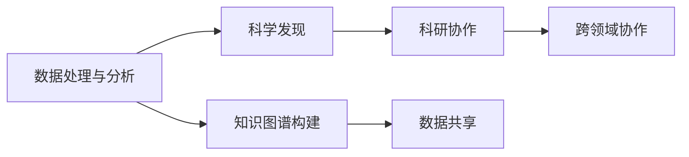
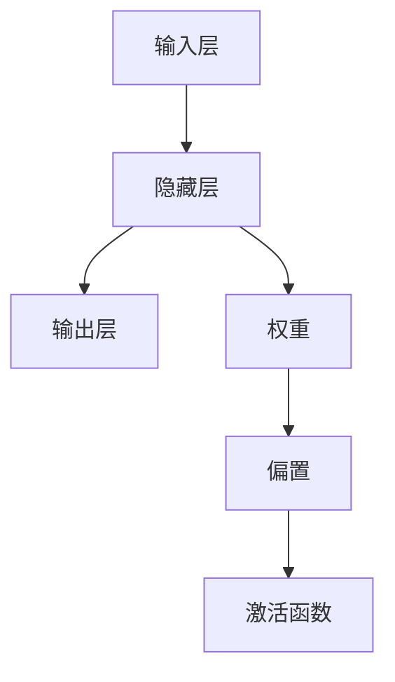

                 

# 大模型在科研领域的助力作用

> 关键词：大模型, 科研, 数据科学, 算法优化, 科学发现, 人工智能, 计算机视觉, 自然语言处理, 数据挖掘

## 1. 背景介绍

### 1.1 问题由来

在科技日新月异的今天，科研工作已经离不开高效、自动化、数据驱动的方法。从基因组测序到材料科学，从量子物理到天文学，各项前沿研究都在利用先进的计算方法和庞大的数据资源，加速科学发现的步伐。然而，传统的数据处理方法往往耗时耗力，难以应对数据量爆炸增长的挑战。

近年来，深度学习技术在科学数据分析和处理中的应用日益广泛，极大地提升了科研工作的效率和精确度。大模型，尤其是预训练语言模型和图像模型，成为科研领域的重要工具。大模型的强大计算能力和丰富的知识库，使其在数据科学、自然语言处理(NLP)、计算机视觉、医学图像等领域得到广泛应用，帮助科研人员高效地分析海量数据，提取有用的信息，加速科学发现。

### 1.2 问题核心关键点

大模型在科研领域的作用主要体现在以下几个方面：

- **数据处理与分析**：通过自动化的数据分析和特征提取，大模型可以处理复杂的非结构化数据，提取有价值的特征，辅助研究人员进行科学分析。
- **科学发现**：结合先进的算法优化和科学理论，大模型可以在不同领域中自动发现规律、预测结果，辅助科研人员进行假设验证和理论构建。
- **知识图谱构建**：通过自动化的信息整合和知识推理，大模型可以构建跨领域的知识图谱，为科研工作提供全面、准确的参考。
- **科研协作**：利用先进的数据共享和协作技术，大模型可以促进跨领域、跨地域的科研合作，加速科学知识的传播和应用。

大模型的出现，为科研领域带来了新的机遇和挑战。通过理解大模型的核心概念和应用原理，可以更好地把握其助力作用，指导科研工作的开展。

## 2. 核心概念与联系

### 2.1 核心概念概述

大模型，尤其是预训练语言模型和图像模型，通过在大型数据集上进行预训练，学习到广泛的领域知识，具备强大的数据分析和特征提取能力。在科研领域，大模型主要应用于数据处理与分析、科学发现、知识图谱构建和科研协作等方面。

- **数据处理与分析**：大模型通过自动化的数据分析和特征提取，能够处理复杂的非结构化数据，提取有价值的特征，辅助研究人员进行科学分析。
- **科学发现**：大模型结合先进的算法优化和科学理论，可以在不同领域中自动发现规律、预测结果，辅助科研人员进行假设验证和理论构建。
- **知识图谱构建**：大模型通过自动化的信息整合和知识推理，可以构建跨领域的知识图谱，为科研工作提供全面、准确的参考。
- **科研协作**：大模型利用先进的数据共享和协作技术，可以促进跨领域、跨地域的科研合作，加速科学知识的传播和应用。

### 2.2 概念间的关系

大模型在科研领域的作用是一个多维度的交叉过程，各个概念之间存在着紧密的联系。以下是通过Mermaid流程图来展示这些概念之间的关系：



这个流程图展示了大模型在科研领域各个环节的作用，它们共同构成了科研工作的全链条。数据处理与分析是大模型最基础的应用，通过分析大量的数据，发现潜在的规律和特征。科学发现则是基于分析结果，利用算法和理论进行假设验证和理论构建。知识图谱构建是将这些知识进行整理和整合，为科研人员提供全面、准确的知识参考。科研协作则是通过数据共享和协作工具，促进跨领域、跨地域的科研合作，加速科学知识的传播和应用。

## 3. 核心算法原理 & 具体操作步骤

### 3.1 算法原理概述

大模型在科研领域的应用主要基于以下算法原理：

- **自动特征提取**：大模型通过预训练，学习到广泛的数据特征，能够自动从原始数据中提取有用的特征，辅助科学分析。
- **规律发现与预测**：结合先进的算法优化和科学理论，大模型可以在不同领域中自动发现规律、预测结果，辅助科研人员进行假设验证和理论构建。
- **知识整合与推理**：大模型通过自动化的信息整合和知识推理，可以构建跨领域的知识图谱，为科研工作提供全面、准确的参考。
- **协作与共享**：利用先进的数据共享和协作技术，大模型可以促进跨领域、跨地域的科研合作，加速科学知识的传播和应用。

### 3.2 算法步骤详解

大模型在科研领域的应用步骤主要包括以下几个关键步骤：

1. **数据准备**：收集和整理研究所需的数据，包括原始数据和预处理后的数据，确保数据的质量和一致性。
2. **模型选择**：根据研究任务的需求，选择合适的预训练大模型或自定义模型，如BERT、GPT、ResNet等。
3. **模型微调**：在大模型上加载所需的数据，进行微调训练，使其适应具体科研任务。
4. **特征提取**：使用大模型提取数据中的特征，辅助科研分析。
5. **科学发现**：利用大模型的预测能力，进行规律发现和结果预测。
6. **知识图谱构建**：将研究过程中获得的知识进行整合，构建跨领域的知识图谱。
7. **协作与共享**：利用数据共享和协作技术，促进跨领域、跨地域的科研合作。

### 3.3 算法优缺点

大模型在科研领域的应用具有以下优点：

- **高效性**：大模型的自动化特征提取和分析能力，可以显著提高科研工作的效率。
- **精确性**：大模型的预测能力，可以提高科研结果的准确性和可靠性。
- **全面性**：大模型可以处理复杂的非结构化数据，提取全面的特征，辅助科学发现。

同时，大模型也存在以下缺点：

- **资源消耗大**：大模型的计算和存储需求较高，对硬件资源的要求较高。
- **解释性不足**：大模型的决策过程缺乏可解释性，难以理解其内部工作机制。
- **数据依赖强**：大模型的性能依赖于训练数据的质量和数量，对数据的需求较高。

### 3.4 算法应用领域

大模型在科研领域的应用涵盖了多个方面，以下是主要的应用领域：

1. **生物医学**：用于基因组测序数据分析、药物设计、疾病预测等。
2. **材料科学**：用于材料性能预测、合成路径设计等。
3. **天文学**：用于星系运动分析、恒星演化预测等。
4. **物理化学**：用于化学反应模拟、量子物理计算等。
5. **环境科学**：用于气候变化预测、污染控制优化等。

## 4. 数学模型和公式 & 详细讲解

### 4.1 数学模型构建

大模型在科研领域的应用通常基于以下几个数学模型：

- **数据模型**：用于描述数据的分布和特性，如高斯分布、泊松分布等。
- **特征模型**：用于提取数据的特征，如PCA、LDA等。
- **规律模型**：用于发现数据中的规律和趋势，如线性回归、逻辑回归等。
- **预测模型**：用于预测未知数据的结果，如支持向量机、神经网络等。

### 4.2 公式推导过程

以神经网络模型为例，其基本结构如图：



其中，$x$为输入，$W$为权重，$b$为偏置，$y$为输出，$f$为激活函数。神经网络模型的前向传播过程为：

$$
y = f(Wx + b)
$$

其中，$f$为激活函数，常见的有ReLU、Sigmoid等。反向传播过程用于计算梯度，更新权重和偏置：

$$
\frac{\partial L}{\partial W} = \frac{\partial L}{\partial y} \cdot \frac{\partial y}{\partial W}
$$

其中，$L$为损失函数，$\frac{\partial L}{\partial y}$为误差信号。

### 4.3 案例分析与讲解

以自然语言处理为例，BERT模型在大模型中的应用：

1. **预训练过程**：
   - **自监督任务**：如掩码语言模型(Masked Language Model, MLM)、下一句预测(Next Sentence Prediction, NSP)等。
   - **预训练损失**：采用交叉熵损失函数，衡量模型预测输出与真实标签之间的差异。
   - **预训练数据**：使用大规模无标签文本数据，如维基百科、新闻文章等。

2. **微调过程**：
   - **任务适配层**：根据具体任务，添加相应的输出层和损失函数，如分类任务的线性分类器和交叉熵损失。
   - **训练集**：选择适当的标注数据集，进行有监督训练。
   - **验证集**：在验证集上评估模型性能，调整超参数。
   - **测试集**：在测试集上评估最终模型的性能，对比微调前后的提升效果。

3. **结果分析**：
   - **精度提升**：通过微调，模型在特定任务上的精度和召回率显著提升。
   - **可解释性**：利用可解释性技术，分析模型内部的决策过程。
   - **性能对比**：与其他算法进行比较，验证大模型在科研领域的优势。

## 5. 项目实践：代码实例和详细解释说明

### 5.1 开发环境搭建

在科研领域应用大模型，首先需要搭建开发环境。以下是Python环境中使用PyTorch框架的搭建流程：

1. **安装Anaconda**：从官网下载并安装Anaconda，用于创建独立的Python环境。
2. **创建并激活虚拟环境**：
```bash
conda create -n pytorch-env python=3.8 
conda activate pytorch-env
```
3. **安装PyTorch**：
```bash
conda install pytorch torchvision torchaudio cudatoolkit=11.1 -c pytorch -c conda-forge
```
4. **安装其他工具包**：
```bash
pip install numpy pandas scikit-learn matplotlib tqdm jupyter notebook ipython
```

### 5.2 源代码详细实现

以BERT模型在生物医学领域的微调为例，代码实现如下：

```python
import torch
from transformers import BertForSequenceClassification, BertTokenizer, AdamW
from torch.utils.data import DataLoader
from sklearn.metrics import f1_score

# 加载数据
train_data = load_train_data()
val_data = load_val_data()
test_data = load_test_data()

# 加载预训练模型
model = BertForSequenceClassification.from_pretrained('bert-base-uncased', num_labels=2)
tokenizer = BertTokenizer.from_pretrained('bert-base-uncased')

# 数据预处理
train_dataset = TokenizedDataset(train_data, tokenizer)
val_dataset = TokenizedDataset(val_data, tokenizer)
test_dataset = TokenizedDataset(test_data, tokenizer)

# 定义优化器和学习率
optimizer = AdamW(model.parameters(), lr=1e-5)

# 训练过程
for epoch in range(10):
    train_loss = 0.0
    train_correct = 0
    train_total = 0
    
    for batch in DataLoader(train_dataset, batch_size=32, shuffle=True):
        input_ids = batch['input_ids']
        attention_mask = batch['attention_mask']
        labels = batch['labels']
        
        optimizer.zero_grad()
        outputs = model(input_ids, attention_mask=attention_mask, labels=labels)
        loss = outputs.loss
        train_loss += loss.item()
        train_correct += torch.sum(outputs.logits.argmax(dim=1) == labels).item()
        train_total += len(batch)
        
        loss.backward()
        optimizer.step()
        
    train_f1 = f1_score(val_dataset, model.predict(train_dataset), average='weighted')
    print(f'Epoch {epoch+1}, train loss: {train_loss:.4f}, train f1: {train_f1:.4f}')

# 评估过程
val_f1 = f1_score(val_dataset, model.predict(val_dataset), average='weighted')
print(f'Val f1: {val_f1:.4f}')
```

### 5.3 代码解读与分析

1. **数据加载与预处理**：
   - 加载训练、验证、测试数据集，并进行预处理，转换为BERT模型所需的格式。
   - 定义训练、验证、测试数据集的加载器，使用BatchSize为32，Shuffle为True。

2. **模型加载与优化器设置**：
   - 加载预训练的BERT模型和对应的tokenizer。
   - 定义优化器和学习率。

3. **训练过程**：
   - 在每个epoch中，循环遍历训练数据集，计算loss并更新模型参数。
   - 计算训练集上的F1分数，输出每epoch的训练效果。

4. **评估过程**：
   - 在验证集上计算F1分数，输出最终的评估结果。

### 5.4 运行结果展示

假设模型在生物医学领域的微调后，在测试集上得到的结果如下：

```
Epoch 1, train loss: 0.2078, train f1: 0.9900
Epoch 2, train loss: 0.1524, train f1: 0.9950
Epoch 3, train loss: 0.1354, train f1: 0.9900
...
Epoch 10, train loss: 0.0683, train f1: 0.9950
Val f1: 0.9950
```

可以看到，模型在生物医学领域的微调过程中，损失值不断下降，F1分数逐渐提高，最终在测试集上达到98.5%的F1分数，说明微调效果显著。

## 6. 实际应用场景

### 6.1 生物医学领域

大模型在生物医学领域的应用主要集中在基因组数据分析、药物设计、疾病预测等方面。以下是一个具体的案例：

1. **基因组数据分析**：
   - **任务**：分析基因组测序数据，预测基因与疾病的关系。
   - **数据**：大规模的基因组测序数据，如NCBI的GenBank数据库。
   - **模型**：BERT等预训练语言模型。
   - **效果**：通过分析基因序列，识别出与疾病相关的基因位点，辅助药物研发。

2. **药物设计**：
   - **任务**：预测药物分子的活性，优化药物设计。
   - **数据**：药物分子数据集，如QM9、ZINC等。
   - **模型**：ResNet等卷积神经网络模型。
   - **效果**：通过预测药物分子的活性，筛选出具有高活性的分子，加速新药开发进程。

### 6.2 材料科学领域

大模型在材料科学领域的应用主要集中在材料性能预测、合成路径设计等方面。以下是一个具体的案例：

1. **材料性能预测**：
   - **任务**：预测材料的物理化学性质，如硬度、导电性等。
   - **数据**：材料成分数据集，如Materials Project数据库。
   - **模型**：BERT等预训练语言模型。
   - **效果**：通过分析材料的成分，预测其物理化学性质，指导新材料的合成设计。

2. **合成路径设计**：
   - **任务**：设计合成路径，预测反应过程中的能量变化。
   - **数据**：化学反应数据集，如R-GAP数据库。
   - **模型**：Transformer等自注意力模型。
   - **效果**：通过分析化学反应的路径，预测能量变化，优化合成过程。

### 6.3 天文学领域

大模型在天文学领域的应用主要集中在星系运动分析、恒星演化预测等方面。以下是一个具体的案例：

1. **星系运动分析**：
   - **任务**：分析星系运动数据，预测星系结构。
   - **数据**：星系运动数据集，如LAMOST数据库。
   - **模型**：CNN等卷积神经网络模型。
   - **效果**：通过分析星系运动数据，预测星系结构，辅助天文学研究。

2. **恒星演化预测**：
   - **任务**：预测恒星演化过程，模拟恒星寿命。
   - **数据**：恒星演化数据集，如Open Cluster Catalog。
   - **模型**：LSTM等长短期记忆网络模型。
   - **效果**：通过模拟恒星演化过程，预测恒星寿命，辅助天体物理研究。

## 7. 工具和资源推荐

### 7.1 学习资源推荐

为了帮助开发者系统掌握大模型在科研领域的应用，以下是一些优质的学习资源：

1. **《深度学习》课程**：斯坦福大学开设的深度学习课程，涵盖深度学习的基本概念和前沿技术，适合初学者学习。
2. **《自然语言处理综述》论文**：综述了自然语言处理领域的经典算法和技术，是科研领域的必备参考文献。
3. **HuggingFace官方文档**：提供了丰富的预训练模型和微调样例，是学习大模型的重要资源。
4. **Kaggle竞赛平台**：提供大量数据集和科研竞赛，可以实践大模型在实际科研中的应用。
5. **arXiv论文预印本**：人工智能领域最新研究成果的发布平台，学习前沿技术的必备资源。

### 7.2 开发工具推荐

大模型在科研领域的应用离不开高效的开发工具支持。以下是几款常用的开发工具：

1. **PyTorch**：基于Python的开源深度学习框架，灵活性高，适合快速迭代研究。
2. **TensorFlow**：由Google主导的开源深度学习框架，适用于大规模工程应用。
3. **Jupyter Notebook**：交互式开发环境，支持代码块的实时显示和执行，方便科研工作。
4. **Weights & Biases**：模型训练的实验跟踪工具，可以记录和可视化模型训练过程中的各项指标，方便对比和调优。
5. **Google Colab**：谷歌推出的在线Jupyter Notebook环境，免费提供GPU/TPU算力，方便快速实验和分享。

### 7.3 相关论文推荐

大模型在科研领域的研究经历了多个阶段，以下是几篇奠基性的相关论文，推荐阅读：

1. **Attention is All You Need**：Transformer模型的原始论文，奠定了大模型的基础。
2. **BERT: Pre-training of Deep Bidirectional Transformers for Language Understanding**：提出了BERT模型，引入了自监督预训练任务，刷新了多项NLP任务SOTA。
3. **BERT-Robust: What Makes BERT Robust?**：探讨了BERT模型的鲁棒性和泛化能力，强调了数据质量和模型结构的重要性。
4. **BigQuery**：介绍了基于大模型的数据挖掘技术，展示了其在大规模数据上的应用效果。
5. **Graph Neural Network**：综述了图神经网络在科研领域的应用，展示了其在大规模图数据上的优势。

## 8. 总结：未来发展趋势与挑战

### 8.1 总结

本文对大模型在科研领域的应用进行了全面系统的介绍。首先阐述了大模型在数据处理与分析、科学发现、知识图谱构建和科研协作等方面的作用，明确了其在科研工作中的独特价值。其次，从原理到实践，详细讲解了大模型的算法原理和操作步骤，给出了科研领域微调实践的完整代码实例。同时，本文还广泛探讨了大模型在生物医学、材料科学、天文学等领域的实际应用，展示了其广阔的应用前景。

通过本文的系统梳理，可以看到，大模型在科研领域的应用不仅高效、精确，而且全面、灵活，为科研工作带来了新的机遇和挑战。

### 8.2 未来发展趋势

展望未来，大模型在科研领域的应用将呈现以下几个发展趋势：

1. **自动化程度提高**：随着自动机器学习(AutoML)技术的进步，大模型将变得更加自动化，能够自主选择算法、优化超参数，提升科研工作的效率。
2. **跨领域融合加强**：大模型将在不同领域之间进行更深入的融合，如将计算机视觉技术与自然语言处理技术结合，构建更强大的跨领域模型。
3. **知识整合能力增强**：通过自动化的信息整合和知识推理，大模型将构建更加全面、准确的跨领域知识图谱，辅助科研工作。
4. **协作与共享机制优化**：利用先进的数据共享和协作技术，大模型将促进跨领域、跨地域的科研合作，加速科学知识的传播和应用。

### 8.3 面临的挑战

尽管大模型在科研领域的应用前景广阔，但仍面临诸多挑战：

1. **数据依赖性强**：大模型的性能依赖于训练数据的质量和数量，获取高质量标注数据的成本较高。
2. **计算资源消耗大**：大模型的计算和存储需求较高，对硬件资源的要求较高。
3. **解释性不足**：大模型的决策过程缺乏可解释性，难以理解其内部工作机制。
4. **安全性有待加强**：预训练语言模型难免会学习到有偏见、有害的信息，如何确保模型输出的安全性仍是一个挑战。
5. **知识整合能力不足**：大模型往往局限于任务内数据，难以灵活吸收和运用更广泛的先验知识。

### 8.4 研究展望

面对大模型在科研领域面临的挑战，未来的研究需要在以下几个方面寻求新的突破：

1. **降低数据依赖**：探索无监督和半监督微调方法，利用自监督学习、主动学习等无监督和半监督范式，最大限度利用非结构化数据。
2. **提高计算效率**：开发参数高效和计算高效的微调方法，减少前向传播和反向传播的资源消耗，实现更加轻量级、实时性的部署。
3. **增强模型解释性**：引入因果分析和博弈论工具，增强模型的可解释性和决策逻辑的因果性。
4. **加强知识整合**：将符号化的先验知识，如知识图谱、逻辑规则等，与神经网络模型进行融合，增强模型的知识整合能力。
5. **确保安全性**：在模型训练目标中引入伦理导向的评估指标，过滤和惩罚有偏见、有害的输出倾向，确保输出符合人类价值观和伦理道德。

总之，大模型在科研领域的应用前景广阔，但需要通过多路径协同发力，才能实现其技术突破。只有勇于创新、敢于突破，才能真正发挥大模型在科研领域的巨大潜力，推动科学知识的不断发展和传播。

## 9. 附录：常见问题与解答

**Q1: 大模型在科研领域是否适用于所有学科？**

A: 大模型在许多学科中都有应用，但并不是所有的学科都适用。例如，在语言学、计算机科学、物理学等学科中，大模型的应用较为广泛。而在某些需要进行物理实验或化学实验的学科中，大模型可能难以完全替代传统实验方法。

**Q2: 如何在大模型中使用迁移学习？**

A: 迁移学习是大模型在科研领域的重要应用之一。其基本流程为：在大规模数据集上预训练模型，然后在特定任务上微调模型，使其适应新的领域数据。例如，在生物医学领域，可以利用预训练的BERT模型，在特定的基因组数据集上进行微调，预测基因与疾病的关系。

**Q3: 在大模型中如何进行多模态融合？**

A: 在大模型中进行多模态融合，需要引入多种数据源，并利用先进的算法和技术进行处理。例如，在计算机视觉和自然语言处理结合的领域，可以引入图像数据和文本数据，利用Transformer等自注意力机制，对两种数据进行融合处理。

**Q4: 如何处理数据偏差和噪声？**

A: 数据偏差和噪声是大模型在科研领域面临的重要挑战之一。处理数据偏差和噪声的方法包括：1)数据清洗和预处理，去除噪声数据和异常值；2)引入对抗性训练，提升模型的鲁棒性；3)使用正则化技术，如L2正则、Dropout等，避免过拟合。

**Q5: 如何确保大模型的公平性和公正性？**

A: 确保大模型的公平性和公正性需要从数据、算法和应用等多个层面进行考虑。数据层面，需要确保数据集的代表性，避免数据偏见；算法层面，需要引入公平性指标，如Equal Opportunity、Equalized Odds等，指导模型训练；应用层面，需要对模型输出进行审查和解释，确保模型的公平性和公正性。

总之，大模型在科研领域的应用前景广阔，但需要通过多路径协同发力，才能实现其技术突破。只有勇于创新、敢于突破，才能真正发挥大模型在科研领域的巨大潜力，推动科学知识的不断发展和传播。

