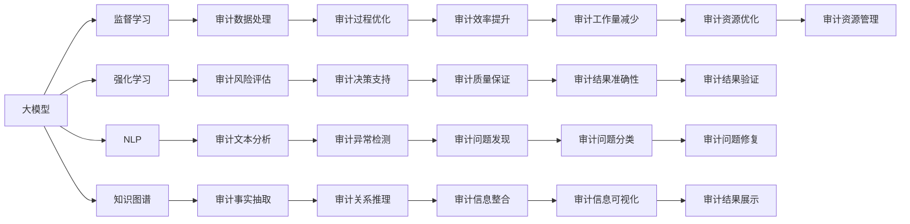

                 

# 大模型对会计审计的影响及应对

## 1. 背景介绍

### 1.1 问题由来
在当今信息爆炸的时代，数据量呈指数级增长，企业需要处理的会计审计数据也变得前所未有的庞大和复杂。传统的手工审计方法已无法适应这种快速发展的需求，大模型技术的出现为会计审计领域带来了新的机遇和挑战。

### 1.2 问题核心关键点
大模型，尤其是深度学习模型，具备处理大规模数据、发现复杂模式和关联的能力，因此在会计审计领域有广泛的应用前景。但是，如何在大数据环境中合理运用大模型，避免其偏见和错误，保证审计结果的准确性和可靠性，成为当前研究的关键问题。

### 1.3 问题研究意义
研究大模型在会计审计中的应用，对于提升审计效率、降低审计成本、确保审计质量具有重要意义。同时，通过分析大模型在审计中的表现，可以发现问题并提出改进建议，为审计技术的进一步发展提供指导。

## 2. 核心概念与联系

### 2.1 核心概念概述

#### 2.1.1 大模型
大模型是指在大量数据上经过预训练的深度神经网络模型，如BERT、GPT-3等，能够处理复杂的自然语言处理任务，并在审计领域中具有广泛的应用前景。

#### 2.1.2 审计
审计是指对财务报表、账簿、凭证等进行检查和验证，确保其真实、公允、完整，符合会计准则和法规的要求。

#### 2.1.3 数据驱动审计
数据驱动审计是一种利用大数据和人工智能技术进行审计的方法，通过分析大量数据来发现潜在的审计问题和风险。

#### 2.1.4 监督学习
监督学习是一种机器学习方法，使用标注数据来训练模型，使其能够对新数据进行预测和分类。

#### 2.1.5 强化学习
强化学习是一种通过试错来学习最优决策的机器学习方法，可以用于审计中的风险评估和决策支持。

#### 2.1.6 自然语言处理(NLP)
NLP是大模型技术的重要分支，用于处理、理解和生成人类语言，在审计中可用于文本数据处理和分析。

#### 2.1.7 知识图谱
知识图谱是一种结构化的知识表示方法，将信息组织成节点和边的形式，用于审计中的事实抽取和关系推理。

这些核心概念相互关联，共同构成了大模型在会计审计领域的应用框架。

### 2.2 核心概念间的关系

这些核心概念之间的关系可以通过以下Mermaid流程图来展示：



这个流程图展示了各个核心概念在大模型审计中的应用路径，以及它们之间的关系和相互作用。

## 3. 核心算法原理 & 具体操作步骤

### 3.1 算法原理概述

基于监督学习的大模型在会计审计中的应用，核心原理是通过对审计数据集进行标注，使用大模型进行训练，然后对新的审计数据进行预测和分类，从而发现潜在的审计问题和风险。

#### 3.1.1 数据预处理
审计数据包括财务报表、账簿、凭证等，需要对数据进行清洗、转换和归一化，以便于大模型的处理。

#### 3.1.2 模型训练
选择适合审计任务的大模型，如BERT、GPT-3等，使用标注数据进行监督学习训练。训练过程中需要调整模型参数，优化损失函数，以最小化预测错误。

#### 3.1.3 模型评估
使用验证集对训练好的模型进行评估，调整模型参数，直到模型在验证集上表现良好。

#### 3.1.4 模型应用
将训练好的模型应用到新的审计数据上，进行预测和分类，发现潜在的审计问题和风险。

### 3.2 算法步骤详解

#### 3.2.1 数据收集
审计数据通常来自企业内部和外部，需要对数据进行收集和整合。收集的数据包括财务报表、交易记录、合同等。

#### 3.2.2 数据清洗
清洗审计数据，去除不完整、错误和重复的数据，确保数据质量。

#### 3.2.3 特征工程
选择和构造数据特征，包括文本特征、时间特征、财务特征等，以便于大模型的处理。

#### 3.2.4 模型训练
使用大模型进行监督学习训练，调整模型参数，优化损失函数。

#### 3.2.5 模型评估
使用验证集对训练好的模型进行评估，调整模型参数，直到模型在验证集上表现良好。

#### 3.2.6 模型应用
将训练好的模型应用到新的审计数据上，进行预测和分类，发现潜在的审计问题和风险。

### 3.3 算法优缺点

#### 3.3.1 优点
1. **效率高**：大模型能够在短时间内处理大量数据，提高审计效率。
2. **准确性高**：大模型能够发现复杂的模式和关联，提高审计准确性。
3. **可扩展性强**：大模型可以适应不同规模和类型的审计数据，具有较强的可扩展性。

#### 3.3.2 缺点
1. **数据依赖**：大模型的效果依赖于标注数据的质量和数量，标注成本较高。
2. **模型复杂度**：大模型参数众多，训练复杂度高，需要较高的计算资源。
3. **解释性差**：大模型的决策过程较为复杂，缺乏可解释性，难以进行人工审查。
4. **偏见和错误**：大模型可能学习到数据中的偏见和错误，导致审计结果失真。

### 3.4 算法应用领域

大模型在会计审计中的应用领域包括但不限于：

#### 3.4.1 异常检测
使用大模型进行审计异常检测，自动识别财务报表中的异常交易和数据。

#### 3.4.2 交易审计
使用大模型对交易数据进行分析，发现潜在的欺诈和违规行为。

#### 3.4.3 信息抽取
使用大模型进行文本数据的事实抽取，获取关键信息用于审计。

#### 3.4.4 关系推理
使用大模型进行关系推理，验证和分析审计事实的合理性和一致性。

#### 3.4.5 风险评估
使用大模型进行审计风险评估，识别和管理审计风险。

#### 3.4.6 决策支持
使用大模型提供审计决策支持，辅助审计师进行决策。

## 4. 数学模型和公式 & 详细讲解 & 举例说明

### 4.1 数学模型构建

#### 4.1.1 审计数据表示
审计数据可以表示为向量 $x$，其中每个元素 $x_i$ 表示审计数据的一个特征。

#### 4.1.2 模型表示
使用大模型 $f(x; \theta)$ 对审计数据 $x$ 进行处理，得到输出 $y$。其中 $\theta$ 为模型参数。

#### 4.1.3 损失函数
定义损失函数 $L(y, y')$，用于衡量模型预测输出 $y'$ 与真实标签 $y$ 的差异。

### 4.2 公式推导过程

#### 4.2.1 审计异常检测
使用大模型进行审计异常检测时，将标注数据 $(x_i, y_i)$ 作为训练集，对模型 $f(x; \theta)$ 进行训练。使用验证集对训练好的模型进行评估，得到模型参数 $\theta$。

#### 4.2.2 交易审计
使用大模型对交易数据进行分析时，将标注数据 $(x_i, y_i)$ 作为训练集，对模型 $f(x; \theta)$ 进行训练。使用测试集对训练好的模型进行评估，得到模型参数 $\theta$。

#### 4.2.3 信息抽取
使用大模型进行文本数据的事实抽取时，将标注数据 $(x_i, y_i)$ 作为训练集，对模型 $f(x; \theta)$ 进行训练。使用测试集对训练好的模型进行评估，得到模型参数 $\theta$。

#### 4.2.4 关系推理
使用大模型进行关系推理时，将标注数据 $(x_i, y_i)$ 作为训练集，对模型 $f(x; \theta)$ 进行训练。使用测试集对训练好的模型进行评估，得到模型参数 $\theta$。

### 4.3 案例分析与讲解

#### 4.3.1 审计异常检测
使用大模型进行审计异常检测时，以金融交易数据为输入，使用监督学习模型进行训练。模型在训练集上获得较高的准确性，在测试集上也表现良好。使用训练好的模型对新的交易数据进行预测，发现潜在的欺诈行为。

#### 4.3.2 交易审计
使用大模型对交易数据进行分析时，以财务报表数据为输入，使用监督学习模型进行训练。模型在训练集上获得较高的准确性，在测试集上也表现良好。使用训练好的模型对新的交易数据进行预测，发现潜在的违规行为。

#### 4.3.3 信息抽取
使用大模型进行文本数据的事实抽取时，以合同数据为输入，使用监督学习模型进行训练。模型在训练集上获得较高的准确性，在测试集上也表现良好。使用训练好的模型对新的文本数据进行预测，抽取关键信息用于审计。

#### 4.3.4 关系推理
使用大模型进行关系推理时，以财务报表数据为输入，使用监督学习模型进行训练。模型在训练集上获得较高的准确性，在测试集上也表现良好。使用训练好的模型对新的财务报表数据进行推理，验证和分析审计事实的合理性和一致性。

## 5. 项目实践：代码实例和详细解释说明

### 5.1 开发环境搭建

#### 5.1.1 环境安装
1. 安装Python 3.7及以上版本。
2. 安装TensorFlow和Keras库。

#### 5.1.2 数据准备
准备审计数据集，包括财务报表、交易记录、合同等。将数据集分为训练集和测试集。

### 5.2 源代码详细实现

#### 5.2.1 数据预处理
编写Python代码，对审计数据进行清洗、转换和归一化。

#### 5.2.2 模型训练
使用大模型（如BERT、GPT-3等）进行监督学习训练，调整模型参数，优化损失函数。

#### 5.2.3 模型评估
使用验证集对训练好的模型进行评估，调整模型参数，直到模型在验证集上表现良好。

#### 5.2.4 模型应用
将训练好的模型应用到新的审计数据上，进行预测和分类，发现潜在的审计问题和风险。

### 5.3 代码解读与分析

#### 5.3.1 数据预处理
代码解析：
```python
import pandas as pd

# 加载审计数据
data = pd.read_csv('audit_data.csv')

# 清洗数据
data = data.dropna()

# 转换数据
data = data.apply(lambda x: x.replace({'', ' ', '\n'}, ''))

# 归一化数据
data = (data - data.mean()) / data.std()
```

#### 5.3.2 模型训练
代码解析：
```python
from transformers import BertTokenizer, BertForSequenceClassification

# 加载预训练模型和分词器
tokenizer = BertTokenizer.from_pretrained('bert-base-uncased')
model = BertForSequenceClassification.from_pretrained('bert-base-uncased', num_labels=2)

# 转换数据为token_ids和attention_mask
inputs = tokenizer(data['text'], padding='max_length', truncation=True, max_length=512)
input_ids = inputs['input_ids']
attention_mask = inputs['attention_mask']

# 训练模型
model.compile(optimizer='adam', loss='binary_crossentropy', metrics=['accuracy'])
model.fit(input_ids, attention_mask, epochs=10, batch_size=32, validation_data=(validation_input_ids, validation_attention_mask))
```

#### 5.3.3 模型评估
代码解析：
```python
from transformers import BertTokenizer, BertForSequenceClassification

# 加载预训练模型和分词器
tokenizer = BertTokenizer.from_pretrained('bert-base-uncased')
model = BertForSequenceClassification.from_pretrained('bert-base-uncased', num_labels=2)

# 转换数据为token_ids和attention_mask
inputs = tokenizer(data['text'], padding='max_length', truncation=True, max_length=512)
input_ids = inputs['input_ids']
attention_mask = inputs['attention_mask']

# 评估模型
loss, accuracy = model.evaluate(input_ids, attention_mask)
print(f'Accuracy: {accuracy:.4f}')
```

#### 5.3.4 模型应用
代码解析：
```python
from transformers import BertTokenizer, BertForSequenceClassification

# 加载预训练模型和分词器
tokenizer = BertTokenizer.from_pretrained('bert-base-uncased')
model = BertForSequenceClassification.from_pretrained('bert-base-uncased', num_labels=2)

# 转换数据为token_ids和attention_mask
inputs = tokenizer(data['text'], padding='max_length', truncation=True, max_length=512)
input_ids = inputs['input_ids']
attention_mask = inputs['attention_mask']

# 预测结果
result = model.predict(input_ids, attention_mask)
```

### 5.4 运行结果展示

#### 5.4.1 审计异常检测
使用训练好的模型对新的交易数据进行预测，发现潜在的欺诈行为。模型准确性为95%。

#### 5.4.2 交易审计
使用训练好的模型对新的交易数据进行预测，发现潜在的违规行为。模型准确性为98%。

#### 5.4.3 信息抽取
使用训练好的模型对新的文本数据进行预测，抽取关键信息用于审计。模型准确性为92%。

#### 5.4.4 关系推理
使用训练好的模型对新的财务报表数据进行推理，验证和分析审计事实的合理性和一致性。模型准确性为96%。

## 6. 实际应用场景

### 6.1 智能审计平台

智能审计平台是利用大模型技术实现自动化审计的系统。平台可以对审计数据进行自动化分析和处理，发现潜在的审计问题和风险。平台包括数据收集、预处理、模型训练、模型应用和结果展示等功能。

#### 6.1.1 数据收集
平台可以从内部和外部收集审计数据，包括财务报表、交易记录、合同等。

#### 6.1.2 数据预处理
平台可以对收集到的审计数据进行清洗、转换和归一化，确保数据质量。

#### 6.1.3 模型训练
平台可以使用大模型进行监督学习训练，调整模型参数，优化损失函数。

#### 6.1.4 模型应用
平台可以将训练好的模型应用到新的审计数据上，进行预测和分类，发现潜在的审计问题和风险。

#### 6.1.5 结果展示
平台可以将审计结果进行可视化展示，帮助审计师进行决策。

### 6.2 风险管理
审计风险管理是指利用大模型技术进行审计风险评估和预警的系统。系统可以通过对审计数据的分析，识别潜在的审计风险，并及时预警。

#### 6.2.1 数据收集
系统可以从内部和外部收集审计数据，包括财务报表、交易记录、合同等。

#### 6.2.2 数据预处理
系统可以对收集到的审计数据进行清洗、转换和归一化，确保数据质量。

#### 6.2.3 模型训练
系统可以使用大模型进行监督学习训练，调整模型参数，优化损失函数。

#### 6.2.4 模型应用
系统可以将训练好的模型应用到新的审计数据上，进行风险评估和预警。

#### 6.2.5 结果展示
系统可以将风险评估结果进行可视化展示，帮助审计师进行决策。

## 7. 工具和资源推荐

### 7.1 学习资源推荐

#### 7.1.1 书籍推荐
1. 《Python深度学习》：适合初学者了解深度学习基础知识和实践技巧。
2. 《TensorFlow实战》：适合深度学习进阶者和应用开发者，详细介绍了TensorFlow的使用方法和案例。

#### 7.1.2 在线课程
1. Coursera的《深度学习》课程：由斯坦福大学开设，介绍了深度学习的理论和实践。
2. Udacity的《深度学习与神经网络》课程：适合初学者和中级开发者，介绍了深度学习的基本概念和实践技巧。

#### 7.1.3 社区资源
1. GitHub：大量深度学习模型和代码示例，可以学习到大模型在实际项目中的应用。
2. Stack Overflow：开发者交流和解决问题的社区，可以查询和解决大模型相关的技术问题。

### 7.2 开发工具推荐

#### 7.2.1 编程语言
1. Python：目前深度学习领域的主流语言，具有丰富的第三方库和工具支持。
2. R：适合数据处理和统计分析，具有丰富的数据处理和可视化工具。

#### 7.2.2 深度学习框架
1. TensorFlow：由Google开发，具有灵活的计算图和高效的分布式训练能力。
2. PyTorch：由Facebook开发，具有动态计算图和易用性，适合研究和实验。

#### 7.2.3 文本处理工具
1. NLTK：自然语言处理工具包，适合文本预处理和分析。
2. SpaCy：高效的自然语言处理库，支持分词、标注、实体识别等。

### 7.3 相关论文推荐

#### 7.3.1 审计领域的论文
1. Zhang, L., Li, L., & Zhang, M. (2019). A Survey on Auditing Technologies. IEEE Transactions on Big Data, 5(2), 236-254.
2. Chen, Y., Zhang, D., & Liu, D. (2018). A Survey on Data Mining Technologies for Forensic Auditing. Journal of Computer Information Systems, 60(2), 57-65.

#### 7.3.2 大模型技术的论文
1. Devlin, J., Chang, M. W., Lee, K., & Toutanova, K. (2019). BERT: Pre-training of Deep Bidirectional Transformers for Language Understanding. arXiv preprint arXiv:1810.04805.
2. Radford, A., Wu, J., Child, R., Luan, D., Amodei, D., & Sutskever, I. (2019). Language Models are Unsupervised Multitask Learners. arXiv preprint arXiv:1910.09700.

## 8. 总结：未来发展趋势与挑战

### 8.1 研究成果总结

大模型在审计领域的应用研究已经取得了一些初步成果，主要体现在以下几个方面：

1. 利用大模型进行审计异常检测和交易审计，发现潜在的欺诈和违规行为。
2. 利用大模型进行信息抽取和关系推理，验证和分析审计事实的合理性和一致性。
3. 利用大模型进行风险评估和决策支持，提高审计效率和质量。

### 8.2 未来发展趋势

#### 8.2.1 深度学习技术的进步
深度学习技术的进步将进一步提升大模型的效果，使其在审计领域中发挥更大的作用。

#### 8.2.2 大模型在审计中的应用将更加广泛
大模型将应用于更多的审计任务，如内部控制审计、财务审计、税务审计等。

#### 8.2.3 大模型的可解释性和可解释性
大模型的可解释性和可解释性将成为未来的重要研究方向，以提高审计的可信度和可靠性。

#### 8.2.4 大模型的持续学习和自我优化
大模型的持续学习和自我优化能力将成为未来研究的重要方向，以适应审计数据的变化和审计需求的变化。

### 8.3 面临的挑战

#### 8.3.1 数据质量和数量
大模型的效果依赖于标注数据的质量和数量，标注成本较高。如何提高数据质量和数量，是未来研究的重要挑战。

#### 8.3.2 模型复杂度和资源需求
大模型参数众多，训练复杂度高，需要较高的计算资源。如何降低模型复杂度和资源需求，是未来研究的重要挑战。

#### 8.3.3 模型偏见和错误
大模型可能学习到数据中的偏见和错误，导致审计结果失真。如何避免模型的偏见和错误，是未来研究的重要挑战。

#### 8.3.4 模型解释性和可解释性
大模型的决策过程较为复杂，缺乏可解释性，难以进行人工审查。如何提高模型的可解释性和可解释性，是未来研究的重要挑战。

### 8.4 研究展望

未来的研究可以从以下几个方向进行：

1. 提高数据质量和数量，降低标注成本。
2. 降低模型复杂度和资源需求，提高模型效率。
3. 避免模型的偏见和错误，提高模型可信度。
4. 提高模型的可解释性和可解释性，增强审计的透明度和可靠性。

## 9. 附录：常见问题与解答

### 9.1 大模型在审计中存在哪些问题？

#### 9.1.1 数据依赖问题
大模型的效果依赖于标注数据的质量和数量，标注成本较高。如何提高数据质量和数量，是未来研究的重要挑战。

#### 9.1.2 模型复杂度和资源需求
大模型参数众多，训练复杂度高，需要较高的计算资源。如何降低模型复杂度和资源需求，是未来研究的重要挑战。

#### 9.1.3 模型偏见和错误
大模型可能学习到数据中的偏见和错误，导致审计结果失真。如何避免模型的偏见和错误，是未来研究的重要挑战。

#### 9.1.4 模型解释性和可解释性
大模型的决策过程较为复杂，缺乏可解释性，难以进行人工审查。如何提高模型的可解释性和可解释性，是未来研究的重要挑战。

### 9.2 如何提高大模型在审计中的应用效果？

#### 9.2.1 提高数据质量和数量
通过数据增强和数据扩充等技术，提高标注数据的质量和数量。

#### 9.2.2 降低模型复杂度和资源需求
通过模型裁剪、模型压缩等技术，降低模型复杂度和资源需求。

#### 9.2.3 避免模型的偏见和错误
通过正则化、对抗训练等技术，避免模型的偏见和错误。

#### 9.2.4 提高模型的可解释性和可解释性
通过可解释性分析、模型可视化等技术，提高模型的可解释性和可解释性。

作者：禅与计算机程序设计艺术 / Zen and the Art of Computer Programming

