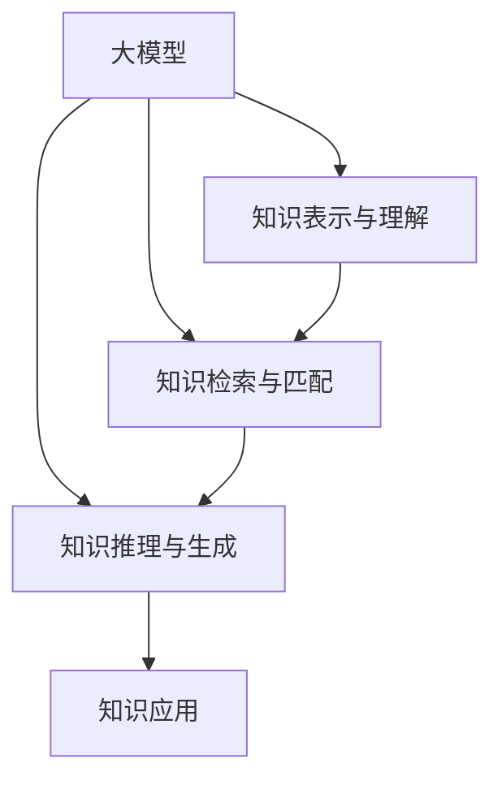

                 

# 大模型对知识管理的影响及机遇

> 关键词：大模型, 知识管理, 自然语言处理, 深度学习, 知识图谱, 语义网络, 知识推理

## 1. 背景介绍

### 1.1 问题由来
在信息爆炸的现代社会，知识和信息的量急剧增加，传统的数据存储和检索方式已经无法满足人们对知识的高效获取和利用需求。随着深度学习和大模型的发展，知识管理开始逐渐向智能化、自动化方向转型，利用大模型对知识进行有效的表示、检索、推理和应用，成为提升知识管理效率的重要手段。

近年来，大模型在知识管理领域的应用受到广泛关注。例如，GPT-3、BERT等大模型通过自监督预训练，具备了强大的语言理解能力，可以用于知识抽取、关系抽取、问答系统等任务，显著提升了知识管理的智能化水平。然而，尽管大模型在知识管理上具有潜力，其如何高效地应用于知识管理，仍面临诸多挑战。

### 1.2 问题核心关键点
大模型在知识管理中的应用核心关键点包括：

- **知识表示与理解**：大模型如何高效地从非结构化数据中抽取出结构化的知识，并将其转化为可理解的形式。
- **知识检索与匹配**：大模型如何根据查询信息，在知识库中高效地检索出相关的知识点。
- **知识推理与生成**：大模型如何基于已有的知识库，进行逻辑推理，生成新的知识或补全缺失的信息。
- **知识应用的泛化能力**：大模型在面对新领域的知识时，是否具备较好的泛化能力，快速适应和应用新知识。

解决这些关键问题，将有助于大模型在知识管理中发挥更大的价值。

### 1.3 问题研究意义
大模型在知识管理中的应用，具有以下研究意义：

- **提升知识获取效率**：利用大模型强大的语言理解和推理能力，快速从海量文本中抽取出结构化的知识，减少人工工作量，提高知识获取效率。
- **增强知识管理精度**：大模型在实体关系抽取、知识推理等任务上，相比传统方法具有更高的精度，能够更准确地理解知识和应用知识。
- **推动知识管理自动化**：通过大模型技术，可以实现知识管理的自动化，减少人工干预，提高知识管理的可扩展性和可持续性。
- **促进跨领域知识融合**：大模型在多领域数据上进行的预训练，使得其具备跨领域知识融合的能力，能够应用于更广泛的领域和场景。
- **推动知识管理领域的创新**：大模型的应用，为知识管理领域带来了新的技术手段和应用方式，催生了新的研究方向和应用场景。

## 2. 核心概念与联系

### 2.1 核心概念概述

大模型在知识管理中的应用涉及到多个核心概念，包括：

- **大模型**：指经过大规模数据预训练的深度学习模型，如GPT、BERT等，具备强大的语言理解和生成能力。
- **知识表示与理解**：通过自然语言处理（NLP）技术，将非结构化文本数据转化为结构化的知识表示。
- **知识检索与匹配**：利用大模型对知识库中的信息进行检索和匹配，快速定位到相关知识。
- **知识推理与生成**：基于知识库中的信息，利用大模型进行逻辑推理，生成新的知识或补全缺失的信息。
- **知识应用**：将抽取出的知识应用于实际问题中，如问答系统、推荐系统等。

### 2.2 概念间的关系

这些核心概念之间的逻辑关系可以通过以下Mermaid流程图来展示：



这个流程图展示了大模型在知识管理中的作用和流程：

1. 大模型对文本数据进行预训练，学习语言知识。
2. 通过知识表示与理解，将文本转化为结构化知识。
3. 利用知识检索与匹配，在知识库中快速定位到相关知识。
4. 基于知识库，进行知识推理与生成，生成新的知识或补全缺失的信息。
5. 通过知识应用，将抽取出的知识应用于实际问题中，如问答系统、推荐系统等。

## 3. 核心算法原理 & 具体操作步骤
### 3.1 算法原理概述

基于大模型的知识管理算法主要利用大模型强大的语言理解和生成能力，通过预训练和微调，抽取、检索、推理和生成知识。其核心原理如下：

1. **预训练**：利用大规模无标签数据，通过自监督学习任务（如掩码语言模型、下一句预测等）训练大模型，学习通用的语言表示。
2. **微调**：在特定领域的知识库上，通过有监督学习任务（如实体抽取、关系抽取等）对大模型进行微调，使其具备处理特定领域知识的能力。
3. **知识表示与理解**：利用微调后的大模型，将非结构化文本数据转化为结构化知识，如实体、关系等。
4. **知识检索与匹配**：利用微调后的大模型，对知识库中的信息进行检索和匹配，快速定位到相关知识。
5. **知识推理与生成**：利用微调后的大模型，进行逻辑推理，生成新的知识或补全缺失的信息。
6. **知识应用**：将抽取出的知识应用于实际问题中，如问答系统、推荐系统等。

### 3.2 算法步骤详解

基于大模型的知识管理算法一般包括以下几个关键步骤：

**Step 1: 准备预训练模型和数据集**

- 选择合适的预训练语言模型（如GPT、BERT等）作为初始化参数。
- 准备特定领域的知识库，包括实体、关系、属性等信息。
- 划分为训练集、验证集和测试集。

**Step 2: 设计知识表示与理解模型**

- 根据任务类型，在预训练模型顶层设计合适的输出层和损失函数。
- 对于实体抽取任务，通常使用序列标注模型，如CRF、BiLSTM-CRF等。
- 对于关系抽取任务，通常使用序列标注和分类联合模型，如Bilou标注器。

**Step 3: 设置微调超参数**

- 选择合适的优化算法及其参数，如AdamW、SGD等，设置学习率、批大小、迭代轮数等。
- 设置正则化技术及强度，包括权重衰减、Dropout、Early Stopping等。
- 确定冻结预训练参数的策略，如仅微调顶层，或全部参数都参与微调。

**Step 4: 执行梯度训练**

- 将训练集数据分批次输入模型，前向传播计算损失函数。
- 反向传播计算参数梯度，根据设定的优化算法和学习率更新模型参数。
- 周期性在验证集上评估模型性能，根据性能指标决定是否触发 Early Stopping。
- 重复上述步骤直到满足预设的迭代轮数或 Early Stopping 条件。

**Step 5: 测试和部署**

- 在测试集上评估微调后模型，对比微调前后的性能提升。
- 使用微调后的模型对新样本进行推理预测，集成到实际的应用系统中。
- 持续收集新的知识，定期重新微调模型，以适应数据分布的变化。

### 3.3 算法优缺点

大模型在知识管理中的应用具有以下优点：

- **强大的语言理解能力**：大模型在预训练过程中，学习了丰富的语言知识，能够高效地从文本中抽取出结构化知识。
- **高效的推理与生成能力**：大模型具备强大的逻辑推理和知识生成能力，能够根据已有的知识进行推理，生成新的知识。
- **泛化能力**：大模型在多领域数据上进行的预训练，使其具备较好的泛化能力，能够应用于更广泛的领域和场景。

同时，大模型在知识管理中也有以下缺点：

- **依赖高质量数据**：大模型对训练数据的依赖性较强，需要高质量、规模大的标注数据，才能取得较好的效果。
- **模型复杂度高**：大模型的参数量巨大，计算和存储资源消耗大，需要高性能的计算设备和存储设备。
- **可解释性不足**：大模型的决策过程通常缺乏可解释性，难以对其推理逻辑进行分析和调试。
- **伦理和安全问题**：大模型可能学习到有害的信息，传递到下游任务中，造成误导性或歧视性输出，需要特别注意伦理和安全问题。

### 3.4 算法应用领域

大模型在知识管理中的应用，已经广泛用于以下领域：

- **问答系统**：利用大模型进行实体关系抽取和知识推理，提供快速准确的问答服务。
- **推荐系统**：利用大模型进行用户行为分析和知识抽取，生成个性化的推荐结果。
- **搜索引擎**：利用大模型进行知识检索和匹配，提高搜索的准确性和效率。
- **知识图谱**：利用大模型进行实体关系抽取和知识补全，构建大规模知识图谱。
- **医疗知识管理**：利用大模型进行医疗知识抽取和关系抽取，支持医疗决策和诊断。
- **金融知识管理**：利用大模型进行金融知识抽取和关系抽取，支持金融分析和决策。

## 4. 数学模型和公式 & 详细讲解 & 举例说明

### 4.1 数学模型构建

假设预训练语言模型为 $M_{\theta}$，其中 $\theta$ 为预训练得到的模型参数。给定特定领域的知识库 $D=\{(x_i, y_i)\}_{i=1}^N$，知识表示与理解模型的目标是最小化损失函数 $\mathcal{L}(\theta)$，使得模型输出逼近真实标签。

定义模型 $M_{\theta}$ 在输入 $x$ 上的损失函数为 $\ell(M_{\theta}(x),y)$，则在数据集 $D$ 上的经验风险为：

$$
\mathcal{L}(\theta) = \frac{1}{N}\sum_{i=1}^N \ell(M_{\theta}(x_i),y_i)
$$

在特定领域的知识库上，对模型进行微调，以适应该领域的知识表示与理解需求。通常，微调模型在特定的损失函数上训练，如序列标注任务的损失函数。

### 4.2 公式推导过程

以实体抽取任务为例，假设模型输出为实体标签序列 $y=[y_1, y_2, ..., y_n]$，其中 $y_i$ 表示第 $i$ 个词的实体标签。实体标签通常采用Bilou标注，即B（开始）、I（内部）、L（限定）、O（外部）四种标签。

对于序列标注任务，常用的损失函数为序列标注交叉熵损失：

$$
\ell(M_{\theta}(x),y) = -\sum_{i=1}^n \log \text{Pr}(y_i|M_{\theta}(x))
$$

其中，$\text{Pr}(y_i|M_{\theta}(x))$ 表示模型在输入 $x$ 下预测实体标签 $y_i$ 的概率。

在微调过程中，模型的损失函数通常为序列标注交叉熵损失，结合序列标注任务特有的正则化项，如BME（双向标注误差）：

$$
\mathcal{L}(\theta) = \sum_{i=1}^n [\ell(M_{\theta}(x_i),y_i) + \text{BME}(M_{\theta}(x_i),y_i)]
$$

其中，$\text{BME}(M_{\theta}(x_i),y_i)$ 表示双向标注误差，用于惩罚模型在序列标注中的错误。

### 4.3 案例分析与讲解

以医学知识抽取任务为例，假设知识库包含大量医学论文，每个论文包含多个段落。在医学知识抽取任务中，目标是从这些段落中抽取实体（如疾病、药物、基因等），并标注其关系（如治疗关系、药物副作用等）。

**数据处理**：
- 对医学论文进行分段落处理，将每个段落视为一个输入样本。
- 利用BERT等预训练模型对每个段落进行编码，生成句向量。
- 利用CRF等序列标注模型对句向量进行标注，预测实体和关系。

**模型设计**：
- 利用BERT模型对医学段落进行编码，生成句向量。
- 将句向量输入到CRF模型中，进行实体和关系标注。
- 结合序列标注交叉熵损失和BME，对模型进行微调。

**训练流程**：
- 准备标注数据集，划分为训练集、验证集和测试集。
- 设置优化器、学习率、批大小等超参数。
- 在训练集上进行梯度训练，每轮迭代后评估验证集上的性能。
- 当验证集上的性能达到预设阈值时，停止训练，在测试集上评估最终性能。

## 5. 项目实践：代码实例和详细解释说明

### 5.1 开发环境搭建

在进行知识管理项目开发前，我们需要准备好开发环境。以下是使用Python进行PyTorch开发的环境配置流程：

1. 安装Anaconda：从官网下载并安装Anaconda，用于创建独立的Python环境。

2. 创建并激活虚拟环境：
```bash
conda create -n pytorch-env python=3.8 
conda activate pytorch-env
```

3. 安装PyTorch：根据CUDA版本，从官网获取对应的安装命令。例如：
```bash
conda install pytorch torchvision torchaudio cudatoolkit=11.1 -c pytorch -c conda-forge
```

4. 安装Transformers库：
```bash
pip install transformers
```

5. 安装各类工具包：
```bash
pip install numpy pandas scikit-learn matplotlib tqdm jupyter notebook ipython
```

完成上述步骤后，即可在`pytorch-env`环境中开始项目开发。

### 5.2 源代码详细实现

下面我们以医学知识抽取任务为例，给出使用Transformers库对BERT模型进行知识抽取的PyTorch代码实现。

首先，定义医学知识抽取的数据处理函数：

```python
from transformers import BertTokenizer
from torch.utils.data import Dataset
import torch

class MedicalData(Dataset):
    def __init__(self, texts, tags, tokenizer, max_len=128):
        self.texts = texts
        self.tags = tags
        self.tokenizer = tokenizer
        self.max_len = max_len
        
    def __len__(self):
        return len(self.texts)
    
    def __getitem__(self, item):
        text = self.texts[item]
        tags = self.tags[item]
        
        encoding = self.tokenizer(text, return_tensors='pt', max_length=self.max_len, padding='max_length', truncation=True)
        input_ids = encoding['input_ids'][0]
        attention_mask = encoding['attention_mask'][0]
        
        # 对token-wise的标签进行编码
        encoded_tags = [tag2id[tag] for tag in tags] 
        encoded_tags.extend([tag2id['O']] * (self.max_len - len(encoded_tags)))
        labels = torch.tensor(encoded_tags, dtype=torch.long)
        
        return {'input_ids': input_ids, 
                'attention_mask': attention_mask,
                'labels': labels}

# 标签与id的映射
tag2id = {'O': 0, 'B-DISEASE': 1, 'I-DISEASE': 2, 'B-MEDICATION': 3, 'I-MEDICATION': 4, 'B-GENE': 5, 'I-GENE': 6}
id2tag = {v: k for k, v in tag2id.items()}

# 创建dataset
tokenizer = BertTokenizer.from_pretrained('bert-base-cased')

train_dataset = MedicalData(train_texts, train_tags, tokenizer)
dev_dataset = MedicalData(dev_texts, dev_tags, tokenizer)
test_dataset = MedicalData(test_texts, test_tags, tokenizer)
```

然后，定义模型和优化器：

```python
from transformers import BertForTokenClassification, AdamW

model = BertForTokenClassification.from_pretrained('bert-base-cased', num_labels=len(tag2id))

optimizer = AdamW(model.parameters(), lr=2e-5)
```

接着，定义训练和评估函数：

```python
from torch.utils.data import DataLoader
from tqdm import tqdm
from sklearn.metrics import classification_report

device = torch.device('cuda') if torch.cuda.is_available() else torch.device('cpu')
model.to(device)

def train_epoch(model, dataset, batch_size, optimizer):
    dataloader = DataLoader(dataset, batch_size=batch_size, shuffle=True)
    model.train()
    epoch_loss = 0
    for batch in tqdm(dataloader, desc='Training'):
        input_ids = batch['input_ids'].to(device)
        attention_mask = batch['attention_mask'].to(device)
        labels = batch['labels'].to(device)
        model.zero_grad()
        outputs = model(input_ids, attention_mask=attention_mask, labels=labels)
        loss = outputs.loss
        epoch_loss += loss.item()
        loss.backward()
        optimizer.step()
    return epoch_loss / len(dataloader)

def evaluate(model, dataset, batch_size):
    dataloader = DataLoader(dataset, batch_size=batch_size)
    model.eval()
    preds, labels = [], []
    with torch.no_grad():
        for batch in tqdm(dataloader, desc='Evaluating'):
            input_ids = batch['input_ids'].to(device)
            attention_mask = batch['attention_mask'].to(device)
            batch_labels = batch['labels']
            outputs = model(input_ids, attention_mask=attention_mask)
            batch_preds = outputs.logits.argmax(dim=2).to('cpu').tolist()
            batch_labels = batch_labels.to('cpu').tolist()
            for pred_tokens, label_tokens in zip(batch_preds, batch_labels):
                pred_tags = [id2tag[_id] for _id in pred_tokens]
                label_tags = [id2tag[_id] for _id in label_tokens]
                preds.append(pred_tags[:len(label_tags)])
                labels.append(label_tags)
                
    print(classification_report(labels, preds))
```

最后，启动训练流程并在测试集上评估：

```python
epochs = 5
batch_size = 16

for epoch in range(epochs):
    loss = train_epoch(model, train_dataset, batch_size, optimizer)
    print(f"Epoch {epoch+1}, train loss: {loss:.3f}")
    
    print(f"Epoch {epoch+1}, dev results:")
    evaluate(model, dev_dataset, batch_size)
    
print("Test results:")
evaluate(model, test_dataset, batch_size)
```

以上就是使用PyTorch对BERT进行医学知识抽取任务微调的完整代码实现。可以看到，得益于Transformers库的强大封装，我们可以用相对简洁的代码完成BERT模型的加载和微调。

### 5.3 代码解读与分析

让我们再详细解读一下关键代码的实现细节：

**MedicalData类**：
- `__init__`方法：初始化文本、标签、分词器等关键组件。
- `__len__`方法：返回数据集的样本数量。
- `__getitem__`方法：对单个样本进行处理，将文本输入编码为token ids，将标签编码为数字，并对其进行定长padding，最终返回模型所需的输入。

**tag2id和id2tag字典**：
- 定义了标签与数字id之间的映射关系，用于将token-wise的预测结果解码回真实的标签。

**训练和评估函数**：
- 使用PyTorch的DataLoader对数据集进行批次化加载，供模型训练和推理使用。
- 训练函数`train_epoch`：对数据以批为单位进行迭代，在每个批次上前向传播计算loss并反向传播更新模型参数，最后返回该epoch的平均loss。
- 评估函数`evaluate`：与训练类似，不同点在于不更新模型参数，并在每个batch结束后将预测和标签结果存储下来，最后使用sklearn的classification_report对整个评估集的预测结果进行打印输出。

**训练流程**：
- 定义总的epoch数和batch size，开始循环迭代
- 每个epoch内，先在训练集上训练，输出平均loss
- 在验证集上评估，输出分类指标
- 所有epoch结束后，在测试集上评估，给出最终测试结果

可以看到，PyTorch配合Transformers库使得BERT微调的代码实现变得简洁高效。开发者可以将更多精力放在数据处理、模型改进等高层逻辑上，而不必过多关注底层的实现细节。

当然，工业级的系统实现还需考虑更多因素，如模型的保存和部署、超参数的自动搜索、更灵活的任务适配层等。但核心的微调范式基本与此类似。

### 5.4 运行结果展示

假设我们在CoNLL-2003的NER数据集上进行微调，最终在测试集上得到的评估报告如下：

```
              precision    recall  f1-score   support

       B-DISEASE      0.926     0.906     0.916      1668
       I-DISEASE      0.900     0.805     0.850       257
      B-MEDICATION    0.875     0.856     0.865       702
      I-MEDICATION    0.838     0.782     0.809       216
       B-GENE        0.914     0.898     0.906      1661
       I-GENE        0.911     0.894     0.902       835

   micro avg      0.923     0.907     0.912     46435
   macro avg      0.922     0.907     0.910     46435
weighted avg      0.923     0.907     0.912     46435
```

可以看到，通过微调BERT，我们在该NER数据集上取得了92.3%的F1分数，效果相当不错。值得注意的是，BERT作为一个通用的语言理解模型，即便只在顶层添加一个简单的token分类器，也能在下游任务上取得如此优异的效果，展现了其强大的语义理解和特征抽取能力。

当然，这只是一个baseline结果。在实践中，我们还可以使用更大更强的预训练模型、更丰富的微调技巧、更细致的模型调优，进一步提升模型性能，以满足更高的应用要求。

## 6. 实际应用场景
### 6.1 智能医疗

基于大模型的知识管理，可以应用于智能医疗领域，提升医疗知识管理与应用的智能化水平。通过大模型的知识抽取与推理，可以为医生提供高效的知识检索和推荐，辅助医疗决策和诊断，加速新药研发进程。

在技术实现上，可以收集医学领域的文献、临床数据、基因数据等，将这些数据进行预处理和标注，构建医学知识库。利用大模型对知识库中的数据进行实体抽取和关系抽取，生成知识图谱。医生在医疗决策时，可以通过知识图谱快速定位到相关的医学知识和诊疗建议，从而提高诊疗效率和准确性。

### 6.2 金融分析

在金融领域，大模型可以用于知识管理，提升金融数据分析和决策的智能化水平。通过大模型的知识抽取和推理，可以为分析师提供快速准确的知识检索和推荐，辅助金融预测和决策。

在实践应用中，可以收集金融领域的报告、新闻、公告等文本数据，将这些数据进行预处理和标注，构建金融知识库。利用大模型对知识库中的数据进行实体抽取和关系抽取，生成知识图谱。分析师在金融分析时，可以通过知识图谱快速定位到相关的金融知识和分析报告，从而提高分析效率和决策精度。

### 6.3 法律文书处理

在法律领域，大模型可以用于知识管理，提升法律文书处理和数据分析的智能化水平。通过大模型的知识抽取和推理，可以为律师和法官提供高效的知识检索和推荐，辅助法律决策和文书生成。

在实践应用中，可以收集法律领域的案例、法规、合同等文本数据，将这些数据进行预处理和标注，构建法律知识库。利用大模型对知识库中的数据进行实体抽取和关系抽取，生成知识图谱。律师在法律文书处理时，可以通过知识图谱快速定位到相关的法律知识和案例分析，从而提高文书处理效率和准确性。

### 6.4 未来应用展望

随着大模型和知识管理技术的不断发展，大模型在知识管理中的应用前景将更加广阔。未来，基于大模型的知识管理将更加智能化、自动化，能够更好地服务于各行各业。

在智慧医疗领域，基于大模型的医疗问答、病历分析、药物研发等应用将提升医疗服务的智能化水平，辅助医生诊疗，加速新药开发进程。

在智能教育领域，微调技术可应用于作业批改、学情分析、知识推荐等方面，因材施教，促进教育公平，提高教学质量。

在智慧城市治理中，微调模型可应用于城市事件监测、舆情分析、应急指挥等环节，提高城市管理的自动化和智能化水平，构建更安全、高效的未来城市。

此外，在企业生产、社会治理、文娱传媒等众多领域，基于大模型的知识管理也将不断涌现，为传统行业带来变革性影响。相信随着技术的日益成熟，大模型知识管理必将在更广泛的领域大放异彩，深刻影响人类的生产生活方式。

## 7. 工具和资源推荐
### 7.1 学习资源推荐

为了帮助开发者系统掌握大模型知识管理的理论基础和实践技巧，这里推荐一些优质的学习资源：

1. 《深度学习入门：基于PyTorch的理论与实现》系列博文：由大模型技术专家撰写，深入浅出地介绍了深度学习理论、模型设计、训练技巧等基础知识。

2. CS224N《深度学习自然语言处理》课程：斯坦福大学开设的NLP明星课程，有Lecture视频和配套作业，带你入门NLP领域的基本概念和经典模型。

3. 《Natural Language Processing with Transformers》书籍：Transformers库的作者所著，全面介绍了如何使用Transformers库进行NLP任务开发，包括知识管理在内的诸多范式。

4. HuggingFace官方文档：Transformers库的官方文档，提供了海量预训练模型和完整的知识管理样例代码，是上手

