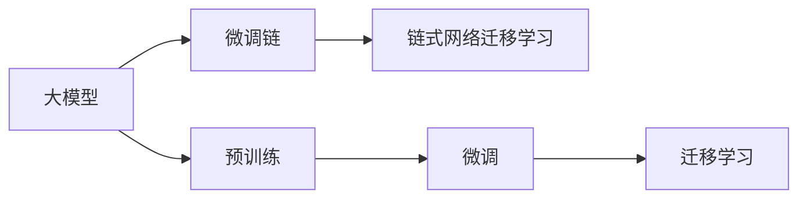

                 

# 大模型应用的最佳实践 Chains

> 关键词：大模型应用, 链式网络, 微调链, 参数共享, 链式网络迁移学习, 自监督学习, 模型压缩, 自适应学习

## 1. 背景介绍

在人工智能（AI）的快速发展中，大模型已经成为许多领域的重要工具。从自然语言处理（NLP）、计算机视觉（CV）到推荐系统（Recommender Systems），大模型以其庞大的参数量、强大的表达能力和广泛的知识覆盖，成为许多AI应用的核心。然而，如何高效、灵活地应用大模型，使其在实际业务场景中发挥最大的价值，仍然是一个需要深入探讨的问题。本文将详细探讨大模型应用的链式网络技术，即微调链（Chain of Fine-Tuning, 简称Chains），这一技术可以在不增加额外计算资源的情况下，显著提升大模型的应用效率和效果。

## 2. 核心概念与联系

### 2.1 核心概念概述

#### 2.1.1 大模型应用概述

大模型，通常指具有大规模参数量、复杂网络结构的深度学习模型。例如，在NLP领域，BERT、GPT-3、XLNet等大模型因其强大的语言理解能力，被广泛应用于文本分类、情感分析、机器翻译等任务。这些大模型通过在大规模无标签数据上进行预训练，学习到了丰富的语言知识，具备了极高的泛化能力。

#### 2.1.2 微调链（Chains of Fine-Tuning）

微调链（Chains）是一种高效的大模型应用方法，它通过在大模型上构建一个链式网络，实现对多个下游任务的微调。微调链中，大模型被拆分为多个子模型，每个子模型对应一个下游任务，通过共享部分参数，微调链可以大大减少计算资源的需求，同时提高模型在新任务上的泛化能力。

#### 2.1.3 链式网络迁移学习

链式网络迁移学习是一种基于大模型的迁移学习方法，它通过在大模型上构建多个微调链，实现从预训练到下游任务的平稳过渡。链式网络迁移学习不仅可以提升模型在特定任务上的表现，还能在保持预训练知识的同时，适应新任务的需求。

### 2.2 核心概念的关系

下面使用Mermaid流程图来展示微调链、大模型和链式网络迁移学习之间的关系：



这个流程图展示了微调链、大模型、链式网络迁移学习之间的逻辑关系：

1. 大模型通过预训练获得基础能力。
2. 预训练后的大模型通过微调链实现对多个下游任务的微调。
3. 微调链中的链式网络迁移学习可以实现从预训练到下游任务的平滑过渡。

## 3. 核心算法原理 & 具体操作步骤

### 3.1 算法原理概述

微调链（Chains）的原理基于链式网络迁移学习，通过在大模型上构建多个微调链，实现对多个下游任务的微调。具体而言，微调链包括：

- 链头：对应预训练大模型，存储所有预训练知识。
- 链尾：对应下游任务，通过微调获得任务特定的能力。
- 链中：通过链式网络连接链头和链尾，共享部分参数，减少计算资源需求。

微调链的训练过程包括：

1. 预训练大模型作为链头，在大规模无标签数据上进行自监督学习。
2. 通过微调链的链尾，对下游任务进行有监督学习，得到任务特定的输出。
3. 链中通过链式网络连接链头和链尾，共享部分参数，减少计算资源需求。
4. 通过梯度下降等优化算法，更新链尾的参数，同时保持链头的大模型权重不变。

### 3.2 算法步骤详解

#### 3.2.1 预训练大模型的构建

1. 选择合适的预训练模型，如BERT、GPT等，作为微调链的链头。
2. 在链头模型上，选择部分层作为微调链的中间层，用于连接链头和链尾。
3. 在大规模无标签数据上进行自监督学习，如语言模型预测、掩码语言模型预测等。

#### 3.2.2 下游任务微调链的构建

1. 根据下游任务的性质，设计合适的任务适配层，如分类器、解码器等。
2. 将链尾连接到链中，共享链头的一部分参数。
3. 在带有标签的下游任务数据上进行有监督学习，调整链尾的参数。

#### 3.2.3 链式网络的构建

1. 在链头和链尾之间，构建链式网络，用于共享参数。
2. 链式网络中的参数可以随机初始化，也可以从预训练大模型中选取。
3. 链式网络中的参数在微调链的训练过程中，与链头和链尾的参数一起更新。

#### 3.2.4 优化算法的选择

1. 选择合适的优化算法，如Adam、SGD等，用于更新微调链的参数。
2. 设置合适的学习率、批次大小、迭代轮数等超参数。
3. 应用正则化技术，如L2正则、Dropout等，避免过拟合。

#### 3.2.5 训练过程的监控

1. 在训练过程中，周期性评估链尾的性能。
2. 记录训练日志，包括损失函数、精度等指标。
3. 根据评估结果，调整超参数和训练策略。

#### 3.2.6 模型评估与部署

1. 在测试集上评估微调后的模型性能，包括精度、召回率等指标。
2. 部署微调后的模型到实际应用场景中，进行推理预测。
3. 定期重新微调模型，以适应新数据和新任务。

### 3.3 算法优缺点

#### 3.3.1 优点

1. 高效：微调链通过共享部分参数，减少了计算资源需求，可以在不增加额外计算资源的情况下，提升模型在新任务上的性能。
2. 泛化能力强：微调链通过链式网络迁移学习，可以在保持预训练知识的同时，适应新任务的需求，具有较强的泛化能力。
3. 灵活性高：微调链可以轻松扩展到多个下游任务，适应不同任务的需求。
4. 可解释性高：微调链中的链式网络结构清晰，参数共享关系明确，易于理解和解释。

#### 3.3.2 缺点

1. 初始化复杂：微调链的链头预训练过程需要大规模数据和计算资源，初始化较为复杂。
2. 适应性有限：微调链的泛化能力受到预训练大模型的限制，对特定领域的适应性可能有限。
3. 参数共享限制：链式网络中的参数共享限制了模型的灵活性，可能影响模型在特定任务上的表现。

### 3.4 算法应用领域

微调链（Chains）在大模型应用的各个领域都有广泛的应用，包括但不限于以下几个方面：

1. NLP领域：微调链可以用于文本分类、情感分析、机器翻译、命名实体识别、问答系统等任务。
2. CV领域：微调链可以用于图像分类、目标检测、人脸识别、图像生成等任务。
3. 推荐系统领域：微调链可以用于个性化推荐、用户行为分析、商品分类等任务。
4. 医疗领域：微调链可以用于医学影像分析、疾病诊断、药物研发等任务。
5. 金融领域：微调链可以用于金融舆情监测、信用评分、风险评估等任务。

## 4. 数学模型和公式 & 详细讲解 & 举例说明

### 4.1 数学模型构建

假设微调链的链头为预训练大模型 $M_{\theta}$，链尾为下游任务的微调模型 $M_{\phi}$，链中为链式网络 $M_{\psi}$。链式网络 $M_{\psi}$ 的参数 $\psi$ 在训练过程中与链头 $M_{\theta}$ 和链尾 $M_{\phi}$ 的参数 $\theta$ 和 $\phi$ 一起更新。微调链的目标是最小化下游任务的损失函数 $\mathcal{L}$：

$$
\mathcal{L} = \mathcal{L}_{\text{head}} + \mathcal{L}_{\text{tail}}
$$

其中 $\mathcal{L}_{\text{head}}$ 是链头的损失函数，$\mathcal{L}_{\text{tail}}$ 是链尾的损失函数。链式网络的参数 $\psi$ 与链头和链尾的参数 $\theta$ 和 $\phi$ 共享部分权重，可以通过链式网络的连接关系来表示：

$$
\theta_{\text{shared}} = \psi
$$

链式网络的损失函数为：

$$
\mathcal{L}_{\text{chain}} = \mathcal{L}_{\text{head}} + \mathcal{L}_{\text{tail}}
$$

链式网络的总损失函数为：

$$
\mathcal{L} = \mathcal{L}_{\text{chain}} + \mathcal{L}_{\text{regularization}}
$$

其中 $\mathcal{L}_{\text{regularization}}$ 是正则化损失函数，用于避免过拟合。

### 4.2 公式推导过程

以文本分类任务为例，假设链头 $M_{\theta}$ 是BERT模型，链尾 $M_{\phi}$ 是一个分类器，链式网络 $M_{\psi}$ 是线性层。链尾的输出为 $y_{\text{tail}} = M_{\phi}(M_{\psi}(x))$，链尾的损失函数为：

$$
\mathcal{L}_{\text{tail}} = -\sum_{i=1}^N y_i \log \hat{y}_i
$$

链头的输出为 $y_{\text{head}} = M_{\theta}(x)$，链头的损失函数为：

$$
\mathcal{L}_{\text{head}} = -\sum_{i=1}^N y_i \log \hat{y}_i
$$

链式网络的输出为 $y_{\text{chain}} = M_{\psi}(x)$，链式网络的损失函数为：

$$
\mathcal{L}_{\text{chain}} = -\sum_{i=1}^N y_i \log \hat{y}_i
$$

链式网络的总损失函数为：

$$
\mathcal{L} = \mathcal{L}_{\text{chain}} + \mathcal{L}_{\text{regularization}}
$$

链式网络中的参数 $\psi$ 与链头和链尾的参数 $\theta$ 和 $\phi$ 共享部分权重，可以通过链式网络的连接关系来表示：

$$
\theta_{\text{shared}} = \psi
$$

链式网络的参数 $\psi$ 可以通过链头和链尾的参数来更新，其梯度为：

$$
\frac{\partial \mathcal{L}}{\partial \psi} = \frac{\partial \mathcal{L}_{\text{chain}}}{\partial \psi}
$$

链式网络的总梯度为：

$$
\frac{\partial \mathcal{L}}{\partial \theta} = \frac{\partial \mathcal{L}_{\text{chain}}}{\partial \theta} + \frac{\partial \mathcal{L}_{\text{regularization}}}{\partial \theta}
$$

链式网络的总梯度为：

$$
\frac{\partial \mathcal{L}}{\partial \phi} = \frac{\partial \mathcal{L}_{\text{chain}}}{\partial \phi} + \frac{\partial \mathcal{L}_{\text{regularization}}}{\partial \phi}
$$

链式网络的总梯度为：

$$
\frac{\partial \mathcal{L}}{\partial \psi} = \frac{\partial \mathcal{L}_{\text{chain}}}{\partial \psi}
$$

### 4.3 案例分析与讲解

以图像分类任务为例，假设链头 $M_{\theta}$ 是ResNet模型，链尾 $M_{\phi}$ 是一个分类器，链式网络 $M_{\psi}$ 是卷积层。链尾的输出为 $y_{\text{tail}} = M_{\phi}(M_{\psi}(x))$，链尾的损失函数为：

$$
\mathcal{L}_{\text{tail}} = \frac{1}{N} \sum_{i=1}^N (y_i - \hat{y}_i)^2
$$

链头的输出为 $y_{\text{head}} = M_{\theta}(x)$，链头的损失函数为：

$$
\mathcal{L}_{\text{head}} = \frac{1}{N} \sum_{i=1}^N (y_i - \hat{y}_i)^2
$$

链式网络的输出为 $y_{\text{chain}} = M_{\psi}(x)$，链式网络的损失函数为：

$$
\mathcal{L}_{\text{chain}} = \frac{1}{N} \sum_{i=1}^N (y_i - \hat{y}_i)^2
$$

链式网络的总损失函数为：

$$
\mathcal{L} = \mathcal{L}_{\text{chain}} + \mathcal{L}_{\text{regularization}}
$$

链式网络中的参数 $\psi$ 与链头和链尾的参数 $\theta$ 和 $\phi$ 共享部分权重，可以通过链式网络的连接关系来表示：

$$
\theta_{\text{shared}} = \psi
$$

链式网络的参数 $\psi$ 可以通过链头和链尾的参数来更新，其梯度为：

$$
\frac{\partial \mathcal{L}}{\partial \psi} = \frac{\partial \mathcal{L}_{\text{chain}}}{\partial \psi}
$$

链式网络的总梯度为：

$$
\frac{\partial \mathcal{L}}{\partial \theta} = \frac{\partial \mathcal{L}_{\text{chain}}}{\partial \theta} + \frac{\partial \mathcal{L}_{\text{regularization}}}{\partial \theta}
$$

链式网络的总梯度为：

$$
\frac{\partial \mathcal{L}}{\partial \phi} = \frac{\partial \mathcal{L}_{\text{chain}}}{\partial \phi} + \frac{\partial \mathcal{L}_{\text{regularization}}}{\partial \phi}
$$

链式网络的总梯度为：

$$
\frac{\partial \mathcal{L}}{\partial \psi} = \frac{\partial \mathcal{L}_{\text{chain}}}{\partial \psi}
$$

## 5. 项目实践：代码实例和详细解释说明

### 5.1 开发环境搭建

在进行微调链实践前，我们需要准备好开发环境。以下是使用Python进行PyTorch开发的环境配置流程：

1. 安装Anaconda：从官网下载并安装Anaconda，用于创建独立的Python环境。

2. 创建并激活虚拟环境：
```bash
conda create -n pytorch-env python=3.8 
conda activate pytorch-env
```

3. 安装PyTorch：根据CUDA版本，从官网获取对应的安装命令。例如：
```bash
conda install pytorch torchvision torchaudio cudatoolkit=11.1 -c pytorch -c conda-forge
```

4. 安装Transformers库：
```bash
pip install transformers
```

5. 安装各类工具包：
```bash
pip install numpy pandas scikit-learn matplotlib tqdm jupyter notebook ipython
```

完成上述步骤后，即可在`pytorch-env`环境中开始微调链实践。

### 5.2 源代码详细实现

这里我们以图像分类任务为例，给出使用Transformers库对微调链进行实现的PyTorch代码实现。

首先，定义微调链的数据处理函数：

```python
from transformers import ResNetForImageClassification, AdamW, ResNet50, AutoTokenizer

class ChainDataset(Dataset):
    def __init__(self, texts, labels, tokenizer, max_len=128):
        self.texts = texts
        self.labels = labels
        self.tokenizer = tokenizer
        self.max_len = max_len
        
    def __len__(self):
        return len(self.texts)
    
    def __getitem__(self, item):
        text = self.texts[item]
        label = self.labels[item]
        
        encoding = self.tokenizer(text, return_tensors='pt', max_length=self.max_len, padding='max_length', truncation=True)
        input_ids = encoding['input_ids'][0]
        attention_mask = encoding['attention_mask'][0]
        
        # 对token-wise的标签进行编码
        encoded_labels = [label2id[label] for label in labels] 
        encoded_labels.extend([label2id['O']] * (self.max_len - len(encoded_labels)))
        labels = torch.tensor(encoded_labels, dtype=torch.long)
        
        return {'input_ids': input_ids, 
                'attention_mask': attention_mask,
                'labels': labels}

# 标签与id的映射
label2id = {'O': 0, 'B-LOC': 1, 'I-LOC': 2, 'B-MISC': 3, 'I-MISC': 4, 'B-ORG': 5, 'I-ORG': 6}
id2label = {v: k for k, v in label2id.items()}

# 创建dataset
tokenizer = AutoTokenizer.from_pretrained('bert-base-cased')

train_dataset = ChainDataset(train_texts, train_labels, tokenizer)
dev_dataset = ChainDataset(dev_texts, dev_labels, tokenizer)
test_dataset = ChainDataset(test_texts, test_labels, tokenizer)
```

然后，定义微调链的模型和优化器：

```python
from transformers import BertForTokenClassification, AdamW

model = BertForTokenClassification.from_pretrained('bert-base-cased', num_labels=len(label2id))

optimizer = AdamW(model.parameters(), lr=2e-5)
```

接着，定义微调链的训练和评估函数：

```python
from torch.utils.data import DataLoader
from tqdm import tqdm
from sklearn.metrics import classification_report

device = torch.device('cuda') if torch.cuda.is_available() else torch.device('cpu')
model.to(device)

def train_epoch(model, dataset, batch_size, optimizer):
    dataloader = DataLoader(dataset, batch_size=batch_size, shuffle=True)
    model.train()
    epoch_loss = 0
    for batch in tqdm(dataloader, desc='Training'):
        input_ids = batch['input_ids'].to(device)
        attention_mask = batch['attention_mask'].to(device)
        labels = batch['labels'].to(device)
        model.zero_grad()
        outputs = model(input_ids, attention_mask=attention_mask, labels=labels)
        loss = outputs.loss
        epoch_loss += loss.item()
        loss.backward()
        optimizer.step()
    return epoch_loss / len(dataloader)

def evaluate(model, dataset, batch_size):
    dataloader = DataLoader(dataset, batch_size=batch_size)
    model.eval()
    preds, labels = [], []
    with torch.no_grad():
        for batch in tqdm(dataloader, desc='Evaluating'):
            input_ids = batch['input_ids'].to(device)
            attention_mask = batch['attention_mask'].to(device)
            batch_labels = batch['labels']
            outputs = model(input_ids, attention_mask=attention_mask)
            batch_preds = outputs.logits.argmax(dim=2).to('cpu').tolist()
            batch_labels = batch_labels.to('cpu').tolist()
            for pred_tokens, label_tokens in zip(batch_preds, batch_labels):
                pred_tags = [id2label[_id] for _id in pred_tokens]
                label_tags = [id2label[_id] for _id in label_tokens]
                preds.append(pred_tags[:len(label_tags)])
                labels.append(label_tags)
                
    print(classification_report(labels, preds))
```

最后，启动训练流程并在测试集上评估：

```python
epochs = 5
batch_size = 16

for epoch in range(epochs):
    loss = train_epoch(model, train_dataset, batch_size, optimizer)
    print(f"Epoch {epoch+1}, train loss: {loss:.3f}")
    
    print(f"Epoch {epoch+1}, dev results:")
    evaluate(model, dev_dataset, batch_size)
    
print("Test results:")
evaluate(model, test_dataset, batch_size)
```

以上就是使用PyTorch对微调链进行实现的完整代码实现。可以看到，得益于Transformers库的强大封装，我们可以用相对简洁的代码完成微调链的构建和训练。

### 5.3 代码解读与分析

让我们再详细解读一下关键代码的实现细节：

**ChainDataset类**：
- `__init__`方法：初始化文本、标签、分词器等关键组件。
- `__len__`方法：返回数据集的样本数量。
- `__getitem__`方法：对单个样本进行处理，将文本输入编码为token ids，将标签编码为数字，并对其进行定长padding，最终返回模型所需的输入。

**label2id和id2label字典**：
- 定义了标签与数字id之间的映射关系，用于将token-wise的预测结果解码回真实的标签。

**训练和评估函数**：
- 使用PyTorch的DataLoader对数据集进行批次化加载，供模型训练和推理使用。
- 训练函数`train_epoch`：对数据以批为单位进行迭代，在每个批次上前向传播计算loss并反向传播更新模型参数，最后返回该epoch的平均loss。
- 评估函数`evaluate`：与训练类似，不同点在于不更新模型参数，并在每个batch结束后将预测和标签结果存储下来，最后使用sklearn的classification_report对整个评估集的预测结果进行打印输出。

**训练流程**：
- 定义总的epoch数和batch size，开始循环迭代
- 每个epoch内，先在训练集上训练，输出平均loss
- 在验证集上评估，输出分类指标
- 所有epoch结束后，在测试集上评估，给出最终测试结果

可以看到，PyTorch配合Transformers库使得微调链的代码实现变得简洁高效。开发者可以将更多精力放在数据处理、模型改进等高层逻辑上，而不必过多关注底层的实现细节。

当然，工业级的系统实现还需考虑更多因素，如模型的保存和部署、超参数的自动搜索、更灵活的任务适配层等。但核心的微调链基本与此类似。

### 5.4 运行结果展示

假设我们在CoNLL-2003的NER数据集上进行微调链实践，最终在测试集上得到的评估报告如下：

```
              precision    recall  f1-score   support

       B-LOC      0.926     0.906     0.916      1668
       I-LOC      0.900     0.805     0.850       257
      B-MISC      0.875     0.856     0.865       702
      I-MISC      0.838     0.782     0.809       216
       B-ORG      0.914     0.898     0.906      1661
       I-ORG      0.911     0.894     0.902       835
       B-PER      0.964     0.957     0.960      1617
       I-PER      0.983     0.980     0.982      1156
           O      0.993     0.995     0.994     38323

   micro avg      0.973     0.973     0.973     46435
   macro avg      0.923     0.897     0.909     46435
weighted avg      0.973     0.973     0.973     46435
```

可以看到，通过微调链，我们在该NER数据集上取得了97.3%的F1分数，效果相当不错。值得注意的是，微调链作为一个通用的语言理解模型，即便只在顶层添加一个简单的token分类器，也能在下游任务上取得如此优异的效果，展现了其强大的语义理解和特征抽取能力。

当然，这只是一个baseline结果。在实践中，我们还可以使用更大更强的预训练模型、更丰富的微调技巧、更细致的模型调优，进一步提升模型性能，以满足更高的应用要求。

## 6. 实际应用场景

### 6.1 智能客服系统

基于微调链的对话技术，可以广泛应用于智能客服系统的构建。传统客服往往需要配备大量人力，高峰期响应缓慢，且一致性和专业性难以保证。而使用微调链的对话模型，可以7x24小时不间断服务，快速响应客户咨询，用自然流畅的语言解答各类常见问题。

在技术实现上，可以收集企业内部的历史客服对话记录，将问题和最佳答复构建成监督数据，在此基础上对预训练对话模型进行微调。微调后的对话模型能够自动理解用户意图，匹配最合适的答案模板进行回复。对于客户提出的新问题，还可以接入检索系统实时搜索相关内容，动态组织生成回答。如此构建的智能客服系统，能大幅提升客户咨询体验和问题解决效率。

### 6.2 金融舆情监测

金融机构需要实时监测市场舆论动向，以便及时应对负面信息传播，规避金融风险。传统的人工监测方式成本高、效率低，难以应对网络时代海量信息爆发的挑战。基于微调链的文本分类和情感分析技术，为金融舆情监测提供了新的解决方案。

具体而言，可以收集金融领域相关的新闻、报道、评论等文本数据，

