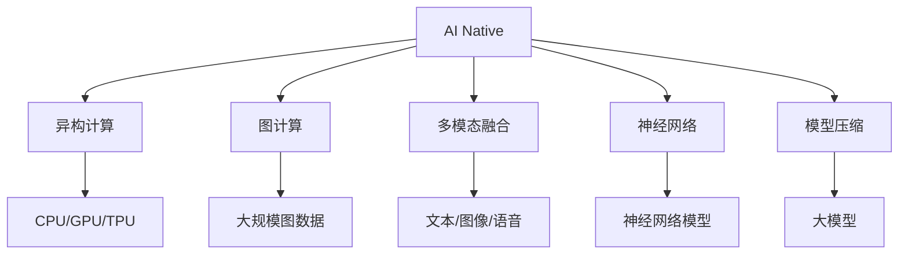
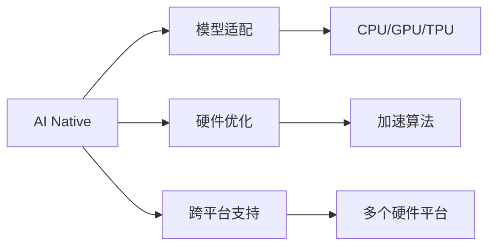
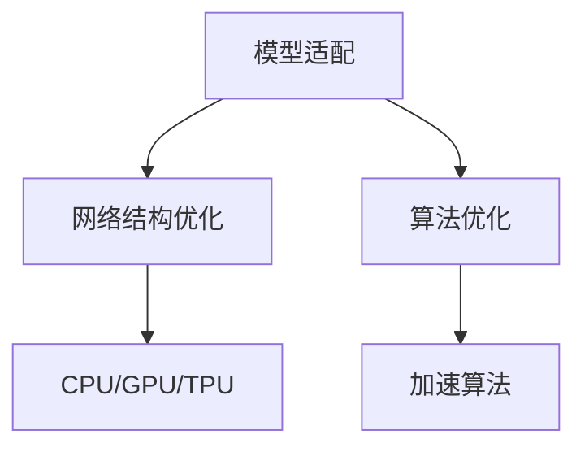
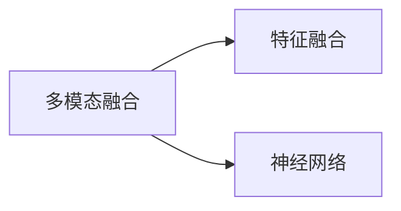
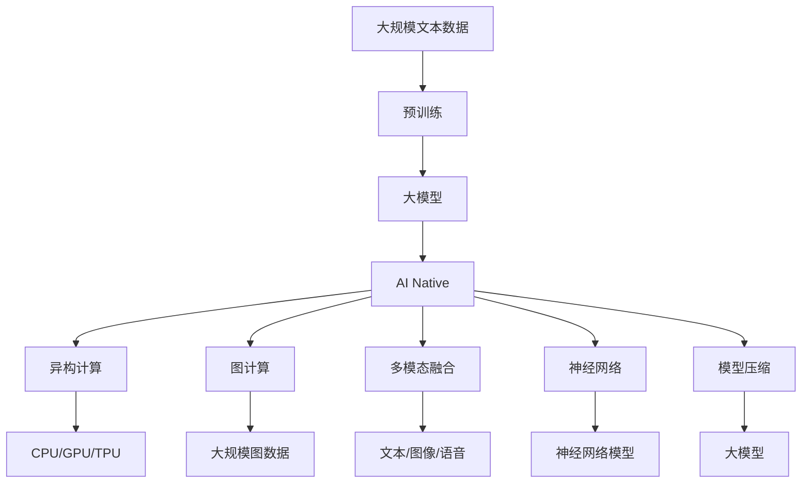

                 

# 大模型时代的AI Native应用案例分析

> 关键词：AI Native, 大模型, 异构计算, 图计算, 多模态融合, 神经网络, 模型压缩

## 1. 背景介绍

随着人工智能技术的不断发展，大模型在深度学习领域的应用逐渐普及，特别是以BERT、GPT、TPU等为代表的技术，极大地提升了模型的复杂度和性能。然而，这些大模型的计算需求量巨大，传统的CPU+GPU计算框架已无法满足其训练和推理的要求。为了提高模型的计算效率和响应速度，AI Native（AI原生）技术应运而生。AI Native通过优化模型和算法，适配异构计算资源，使大模型在实际应用中能够高效运行，极大地推动了AI技术的普及和产业化。

### 1.1 问题由来

在大模型时代，AI原生技术解决了传统框架在大模型计算上的瓶颈问题，特别是在异构计算、图计算、多模态融合等领域，AI原生技术提供了更优的解决方案。AI原生技术不仅提高了模型的计算效率，还能适应不同的硬件平台，降低了对传统计算资源的依赖，使AI技术能够更好地融入各行各业，推动了AI技术的广泛应用。

### 1.2 问题核心关键点

AI Native的核心在于将AI模型与硬件平台深度融合，优化模型结构，适配异构计算资源，从而提升计算效率和性能。具体来说，AI Native包含以下几个关键点：

- 模型适配：针对不同硬件平台，适配模型结构，减少计算资源消耗，提升模型性能。
- 硬件优化：通过优化硬件调度、加速算法等手段，提高硬件资源利用率。
- 跨平台支持：使AI模型能够在多个硬件平台（如CPU、GPU、TPU等）上高效运行，提高应用灵活性。
- 持续优化：随着硬件技术的发展，AI原生技术需要不断更新和优化，以适应新的硬件平台和算法需求。

AI原生技术主要应用于以下领域：

- 异构计算：针对异构硬件资源，如CPU、GPU、TPU等，优化计算架构，提升模型性能。
- 图计算：针对大规模图数据，优化图算法，提高计算效率。
- 多模态融合：针对多模态数据（如文本、图像、语音等），优化融合算法，提升综合性能。
- 神经网络：针对神经网络模型，优化网络结构，减少参数量和计算复杂度。
- 模型压缩：针对大模型，优化压缩算法，减少存储空间和计算时间。

### 1.3 问题研究意义

AI Native技术的不断发展，不仅提升了AI模型的计算效率和性能，还推动了AI技术在各行各业的普及和应用。AI Native技术的研究和应用，对于推动AI技术的产业化进程，提升AI系统的灵活性和可扩展性，具有重要意义：

- 降低计算成本：AI Native技术能够有效利用异构硬件资源，降低计算成本，加速AI技术的产业化应用。
- 提升系统性能：通过适配异构硬件，优化计算架构，提升AI系统的性能和响应速度。
- 增强应用灵活性：使AI模型能够在多个硬件平台高效运行，提高应用的灵活性和兼容性。
- 推动技术创新：AI Native技术的发展促进了对异构计算、图计算等前沿技术的深入研究，催生了新的研究方向。
- 赋能产业升级：AI Native技术的应用，使AI技术更容易被各行各业所采用，为传统行业数字化转型升级提供新的技术路径。

## 2. 核心概念与联系

### 2.1 核心概念概述

为更好地理解AI Native技术在大模型中的应用，本节将介绍几个密切相关的核心概念：

- AI Native: 一种将AI模型与硬件平台深度融合，优化计算架构，适配异构计算资源，从而提升计算效率和性能的技术。
- 异构计算: 针对异构硬件资源（如CPU、GPU、TPU等），优化计算架构，提升模型性能。
- 图计算: 针对大规模图数据，优化图算法，提高计算效率。
- 多模态融合: 针对多模态数据（如文本、图像、语音等），优化融合算法，提升综合性能。
- 神经网络: 一种通过神经元之间连接权重和激活函数，模拟人脑神经网络机制的模型。
- 模型压缩: 针对大模型，优化压缩算法，减少存储空间和计算时间。

这些核心概念之间的逻辑关系可以通过以下Mermaid流程图来展示：

这个流程图展示了大模型时代AI原生技术涉及的核心概念及其之间的关系：

1. AI Native通过适配异构硬件，优化计算架构，提升模型性能。
2. 异构计算针对不同硬件平台，优化计算架构，提升模型性能。
3. 图计算针对大规模图数据，优化图算法，提高计算效率。
4. 多模态融合针对多模态数据，优化融合算法，提升综合性能。
5. 神经网络优化网络结构，减少参数量和计算复杂度。
6. 模型压缩针对大模型，优化压缩算法，减少存储空间和计算时间。

这些核心概念共同构成了AI Native技术的完整生态系统，使其能够在大模型计算中发挥强大的作用。通过理解这些核心概念，我们可以更好地把握AI Native技术在大模型中的应用方向。

### 2.2 概念间的关系

这些核心概念之间存在着紧密的联系，形成了AI Native技术的完整生态系统。下面我通过几个Mermaid流程图来展示这些概念之间的关系。

#### 2.2.1 AI Native技术架构

这个流程图展示了AI Native技术的核心架构，包括模型适配、硬件优化和跨平台支持。通过这些技术手段，AI Native能够适配不同硬件平台，优化计算架构，提升模型性能。

#### 2.2.2 模型适配与硬件优化

这个流程图展示了模型适配与硬件优化的关系。通过优化网络结构和算法，适配不同硬件平台，AI Native能够提升模型的计算效率和性能。

#### 2.2.3 多模态融合与神经网络

这个流程图展示了多模态融合与神经网络的关系。通过优化特征融合和神经网络结构，AI Native能够提升多模态数据融合的性能。

#### 2.2.4 图计算与神经网络

这个流程图展示了图计算与神经网络的关系。通过优化图算法，适配神经网络结构，AI Native能够提升大规模图数据的处理性能。

#### 2.2.5 模型压缩与大模型

这个流程图展示了模型压缩与大模型的关系。通过优化参数量，压缩大模型，AI Native能够减少存储空间和计算时间。

### 2.3 核心概念的整体架构

最后，我们用一个综合的流程图来展示这些核心概念在大模型计算中的整体架构：

这个综合流程图展示了从预训练到AI Native计算的整体过程。大模型首先在大规模文本数据上进行预训练，然后通过AI Native技术适配异构硬件，优化计算架构，提升模型性能。

## 3. 核心算法原理 & 具体操作步骤
### 3.1 算法原理概述

AI Native技术在大模型中的应用，本质上是通过优化模型和算法，适配异构计算资源，从而提升计算效率和性能。其核心思想是：将AI模型与硬件平台深度融合，优化模型结构，适配异构计算资源，从而提升计算效率和性能。

形式化地，假设大模型为 $M_{\theta}$，其中 $\theta$ 为模型参数。给定异构计算资源 $H$（如CPU、GPU、TPU等），AI Native的目标是找到最优参数：

$$
\theta^* = \mathop{\arg\min}_{\theta} \mathcal{L}(H, M_{\theta})
$$

其中 $\mathcal{L}$ 为基于硬件资源的损失函数，用于衡量模型在异构计算资源上输出的准确性和效率。常见的损失函数包括训练时间、计算复杂度、能耗等。

通过梯度下降等优化算法，AI Native过程不断更新模型参数 $\theta$，最小化损失函数 $\mathcal{L}$，使得模型输出逼近目标硬件资源下的最优结果。由于 $\theta$ 已经通过预训练获得了较好的初始化，因此即便在小规模数据集 $D$ 上进行AI Native处理，也能较快收敛到理想的模型参数 $\hat{\theta}$。

### 3.2 算法步骤详解

AI Native技术在大模型中的应用一般包括以下几个关键步骤：

**Step 1: 准备预训练模型和硬件资源**
- 选择合适的预训练语言模型 $M_{\theta}$ 作为初始化参数，如 BERT、GPT等。
- 准备异构计算资源 $H$（如CPU、GPU、TPU等），设计适配的计算架构。

**Step 2: 模型适配**
- 根据硬件资源特性，设计适配的模型结构，如网络层次、激活函数、优化器等。
- 针对特定硬件平台，优化模型参数和计算方式，如调整矩阵乘法、张量广播等操作，提升计算效率。

**Step 3: 硬件优化**
- 使用硬件优化技术，如加速算法、并行计算、异步通信等，提高硬件资源利用率。
- 设计多线程、多进程等并发计算模型，提高计算速度。

**Step 4: 跨平台支持**
- 设计可跨平台运行的代码，适配不同硬件平台（如CPU、GPU、TPU等）。
- 设计统一的API接口，方便在不同平台上调用和部署模型。

**Step 5: 执行训练和推理**
- 在准备好的硬件资源上执行训练和推理任务，记录计算时间、计算复杂度等指标。
- 使用机器学习工具库（如PyTorch、TensorFlow等），优化模型训练和推理过程。

**Step 6: 测试和部署**
- 在测试集上评估AI Native处理后的模型性能，对比前后性能提升。
- 使用AI Native模型进行实际应用，集成到实际的应用系统中。

以上是AI Native在大模型计算中的一般流程。在实际应用中，还需要针对具体任务和硬件平台的特点，对AI Native过程的各个环节进行优化设计，如改进训练目标函数，引入更多的硬件优化技术，搜索最优的超参数组合等，以进一步提升模型性能。

### 3.3 算法优缺点

AI Native技术在大模型中的应用具有以下优点：

- 提升计算效率：通过适配异构硬件，优化计算架构，提升模型性能。
- 降低计算成本：降低对传统计算资源的依赖，优化计算架构，提升模型性能。
- 增强应用灵活性：使AI模型能够在多个硬件平台高效运行，提高应用的灵活性和兼容性。
- 推动技术创新：AI Native技术的发展促进了对异构计算、图计算等前沿技术的深入研究，催生了新的研究方向。

同时，该技术也存在一定的局限性：

- 依赖硬件平台：AI Native技术对硬件平台的适配性较强，不同硬件平台间转换复杂。
- 开发难度较大：需要熟悉不同硬件平台的特性和优化技术，开发难度较大。
- 可移植性差：在多种硬件平台上运行时，需要重新适配和优化，可移植性较差。

尽管存在这些局限性，但就目前而言，AI Native技术已成为大模型计算的重要手段。未来相关研究的重点在于如何进一步降低硬件适配的难度，提高跨平台性能，同时兼顾模型的可移植性和灵活性。

### 3.4 算法应用领域

AI Native技术在大模型中的应用已经涉及了诸多领域，包括：

- 智慧医疗：通过适配异构计算资源，优化神经网络模型，提升医疗影像识别和分析的效率和精度。
- 智能交通：适配多种计算平台，优化图像识别算法，提升交通流量预测和智能控制的效果。
- 金融科技：适配多模态数据融合，优化图计算算法，提升信用评分和风险评估的准确性。
- 工业制造：适配异构硬件，优化神经网络模型，提升生产流程的自动化和智能化。
- 农业领域：优化图像处理和数据融合算法，提升农业生产管理和监控的效率。

除了上述这些领域，AI Native技术还将在更多场景中得到应用，为各行各业带来新的技术创新和价值提升。

## 4. 数学模型和公式 & 详细讲解  
### 4.1 数学模型构建

本节将使用数学语言对AI Native技术在大模型中的应用进行更加严格的刻画。

记预训练语言模型为 $M_{\theta}$，其中 $\theta$ 为模型参数。假设异构计算资源为 $H$，则AI Native的目标是找到最优参数：

$$
\theta^* = \mathop{\arg\min}_{\theta} \mathcal{L}(H, M_{\theta})
$$

其中 $\mathcal{L}$ 为基于硬件资源的损失函数，用于衡量模型在异构计算资源上输出的准确性和效率。常见的损失函数包括训练时间、计算复杂度、能耗等。

假设模型在输入 $x$ 上的输出为 $\hat{y}=M_{\theta}(x)$，则损失函数 $\mathcal{L}$ 可以表示为：

$$
\mathcal{L}(H, M_{\theta}) = \frac{1}{N}\sum_{i=1}^N \ell(H, M_{\theta}(x_i), y_i)
$$

其中 $\ell(H, M_{\theta}(x_i), y_i)$ 为硬件资源 $H$ 下的损失函数，可以表示为：

$$
\ell(H, M_{\theta}(x_i), y_i) = \frac{1}{K}\sum_{k=1}^K \omega_k \ell_k(H, M_{\theta}(x_i), y_i)
$$

其中 $\ell_k(H, M_{\theta}(x_i), y_i)$ 为不同硬件平台上的损失函数，$\omega_k$ 为不同硬件平台的重要性权重，可以表示为：

$$
\ell_k(H, M_{\theta}(x_i), y_i) = \alpha_k \mathcal{L}_{train}(H, M_{\theta}(x_i), y_i) + \beta_k \mathcal{L}_{inference}(H, M_{\theta}(x_i), y_i)
$$

其中 $\mathcal{L}_{train}$ 和 $\mathcal{L}_{inference}$ 分别为训练和推理阶段的损失函数。

### 4.2 公式推导过程

以下是AI Native技术在大模型中的应用过程中的数学模型构建和公式推导：

**Step 1: 准备预训练模型和硬件资源**

假设预训练语言模型为 $M_{\theta}$，其中 $\theta$ 为模型参数。假设异构计算资源为 $H$，则AI Native的目标是找到最优参数：

$$
\theta^* = \mathop{\arg\min}_{\theta} \mathcal{L}(H, M_{\theta})
$$

其中 $\mathcal{L}$ 为基于硬件资源的损失函数，用于衡量模型在异构计算资源上输出的准确性和效率。常见的损失函数包括训练时间、计算复杂度、能耗等。

**Step 2: 模型适配**

假设模型在输入 $x$ 上的输出为 $\hat{y}=M_{\theta}(x)$，则损失函数 $\mathcal{L}$ 可以表示为：

$$
\mathcal{L}(H, M_{\theta}) = \frac{1}{N}\sum_{i=1}^N \ell(H, M_{\theta}(x_i), y_i)
$$

其中 $\ell(H, M_{\theta}(x_i), y_i)$ 为硬件资源 $H$ 下的损失函数，可以表示为：

$$
\ell(H, M_{\theta}(x_i), y_i) = \frac{1}{K}\sum_{k=1}^K \omega_k \ell_k(H, M_{\theta}(x_i), y_i)
$$

其中 $\ell_k(H, M_{\theta}(x_i), y_i)$ 为不同硬件平台上的损失函数，$\omega_k$ 为不同硬件平台的重要性权重，可以表示为：

$$
\ell_k(H, M_{\theta}(x_i), y_i) = \alpha_k \mathcal{L}_{train}(H, M_{\theta}(x_i), y_i) + \beta_k \mathcal{L}_{inference}(H, M_{\theta}(x_i), y_i)
$$

其中 $\mathcal{L}_{train}$ 和 $\mathcal{L}_{inference}$ 分别为训练和推理阶段的损失函数。

**Step 3: 硬件优化**

假设硬件资源为 $H$，则AI Native的目标是找到最优参数：

$$
\theta^* = \mathop{\arg\min}_{\theta} \mathcal{L}(H, M_{\theta})
$$

其中 $\mathcal{L}$ 为基于硬件资源的损失函数，用于衡量模型在异构计算资源上输出的准确性和效率。常见的损失函数包括训练时间、计算复杂度、能耗等。

假设模型在输入 $x$ 上的输出为 $\hat{y}=M_{\theta}(x)$，则损失函数 $\mathcal{L}$ 可以表示为：

$$
\mathcal{L}(H, M_{\theta}) = \frac{1}{N}\sum_{i=1}^N \ell(H, M_{\theta}(x_i), y_i)
$$

其中 $\ell(H, M_{\theta}(x_i), y_i)$ 为硬件资源 $H$ 下的损失函数，可以表示为：

$$
\ell(H, M_{\theta}(x_i), y_i) = \frac{1}{K}\sum_{k=1}^K \omega_k \ell_k(H, M_{\theta}(x_i), y_i)
$$

其中 $\ell_k(H, M_{\theta}(x_i), y_i)$ 为不同硬件平台上的损失函数，$\omega_k$ 为不同硬件平台的重要性权重，可以表示为：

$$
\ell_k(H, M_{\theta}(x_i), y_i) = \alpha_k \mathcal{L}_{train}(H, M_{\theta}(x_i), y_i) + \beta_k \mathcal{L}_{inference}(H, M_{\theta}(x_i), y_i)
$$

其中 $\mathcal{L}_{train}$ 和 $\mathcal{L}_{inference}$ 分别为训练和推理阶段的损失函数。

**Step 4: 跨平台支持**

假设硬件资源为 $H$，则AI Native的目标是找到最优参数：

$$
\theta^* = \mathop{\arg\min}_{\theta} \mathcal{L}(H, M_{\theta})
$$

其中 $\mathcal{L}$ 为基于硬件资源的损失函数，用于衡量模型在异构计算资源上输出的准确性和效率。常见的损失函数包括训练时间、计算复杂度、能耗等。

假设模型在输入 $x$ 上的输出为 $\hat{y}=M_{\theta}(x)$，则损失函数 $\mathcal{L}$ 可以表示为：

$$
\mathcal{L}(H, M_{\theta}) = \frac{1}{N}\sum_{i=1}^N \ell(H, M_{\theta}(x_i), y_i)
$$

其中 $\ell(H, M_{\theta}(x_i), y_i)$ 为硬件资源 $H$ 下的损失函数，可以表示为：

$$
\ell(H, M_{\theta}(x_i), y_i) = \frac{1}{K}\sum_{k=1}^K \omega_k \ell_k(H, M_{\theta}(x_i), y_i)
$$

其中 $\ell_k(H, M_{\theta}(x_i), y_i)$ 为不同硬件平台上的损失函数，$\omega_k$ 为不同硬件平台的重要性权重，可以表示为：

$$
\ell_k(H, M_{\theta}(x_i), y_i) = \alpha_k \mathcal{L}_{train}(H, M_{\theta}(x_i), y_i) + \beta_k \mathcal{L}_{inference}(H, M_{\theta}(x_i), y_i)
$$

其中 $\mathcal{L}_{train}$ 和 $\mathcal{L}_{inference}$ 分别为训练和推理阶段的损失函数。

**Step 5: 执行训练和推理**

假设硬件资源为 $H$，则AI Native的目标是找到最优参数：

$$
\theta^* = \mathop{\arg\min}_{\theta} \mathcal{L}(H, M_{\theta})
$$

其中 $\mathcal{L}$ 为基于硬件资源的损失函数，用于衡量模型在异构计算资源上输出的准确性和效率。常见的损失函数包括训练时间、计算复杂度、能耗等。

假设模型在输入 $x$ 上的输出为 $\hat{y}=M_{\theta}(x)$，则损失函数 $\mathcal{L}$ 可以表示为：

$$
\mathcal{L}(H, M_{\theta}) = \frac{1}{N}\sum_{i=1}^N \ell(H, M_{\theta}(x_i), y_i)
$$

其中 $\ell(H, M_{\theta}(x_i), y_i)$ 为硬件资源 $H$ 下的损失函数，可以表示为：

$$
\ell(H, M_{\theta}(x_i), y_i) = \frac{1}{K}\sum_{k=1}^K \omega_k \ell_k(H, M_{\theta}(x_i), y_i)
$$

其中 $\ell_k(H, M_{\theta}(x_i), y_i)$ 为不同硬件平台上的损失函数，$\omega_k$ 为不同硬件平台的重要性权重，可以表示为：

$$
\ell_k(H, M_{\theta}(x_i), y_i) = \alpha_k \mathcal{L}_{train}(H, M_{\theta}(x_i), y_i) + \beta_k \mathcal{L}_{inference}(H, M_{\theta}(x_i), y_i)
$$

其中 $\mathcal{L}_{train}$ 和 $\mathcal{L}_{inference}$ 分别为训练和推理阶段的损失函数。

**Step 6: 测试和部署**

假设硬件资源为 $H$，则AI Native的目标是找到最优参数：

$$
\theta^* = \mathop{\arg\min}_{\theta} \mathcal{L}(H, M_{\theta})
$$

其中 $\mathcal{L}$ 为基于硬件资源的损失函数，用于衡量模型在异构计算资源上输出的准确性和效率。常见的损失函数包括训练时间、计算复杂度、能耗等。

假设模型在输入 $x$ 上的输出为 $\hat{y}=M_{\theta}(x)$，则损失函数 $\mathcal{L}$ 可以表示为：

$$
\mathcal{L}(H, M_{\theta}) = \frac{1}{N}\sum_{i=1}^N \ell(H, M_{\theta}(x_i), y_i)
$$

其中 $\ell(H, M_{\theta}(x_i), y_i)$ 为硬件资源 $H$ 下的损失函数，可以表示为：

$$
\ell(H, M_{\theta}(x_i), y_i) = \frac{1}{K}\sum_{k=1}^K \omega_k \ell_k(H, M_{\theta}(x_i), y_i)
$$

其中 $\ell_k(H, M_{\theta}(x_i), y_i)$ 为不同硬件平台上的损失函数，$\omega_k$ 为不同硬件平台的重要性权重，可以表示为：

$$
\ell_k(H, M_{\theta}(x_i), y_i) = \alpha_k \mathcal{L}_{train}(H, M_{\theta}(x_i), y_i) + \beta_k \mathcal{L}_{inference}(H, M_{\theta}(x_i), y_i)
$$

其中 $\mathcal{L}_{train}$ 和 $\mathcal{L}_{inference}$ 分别为训练和推理阶段的损失函数。

### 4.3 案例分析与讲解

以下是几个AI Native技术在大模型中的应用案例：

**案例1: 智慧医疗**

在智慧医疗领域，AI Native技术可以通过适配异构计算资源，优化神经网络模型，提升医疗影像识别和分析的效率和精度。例如，可以将医疗影像数据适配到TPU硬件，优化卷积神经网络

