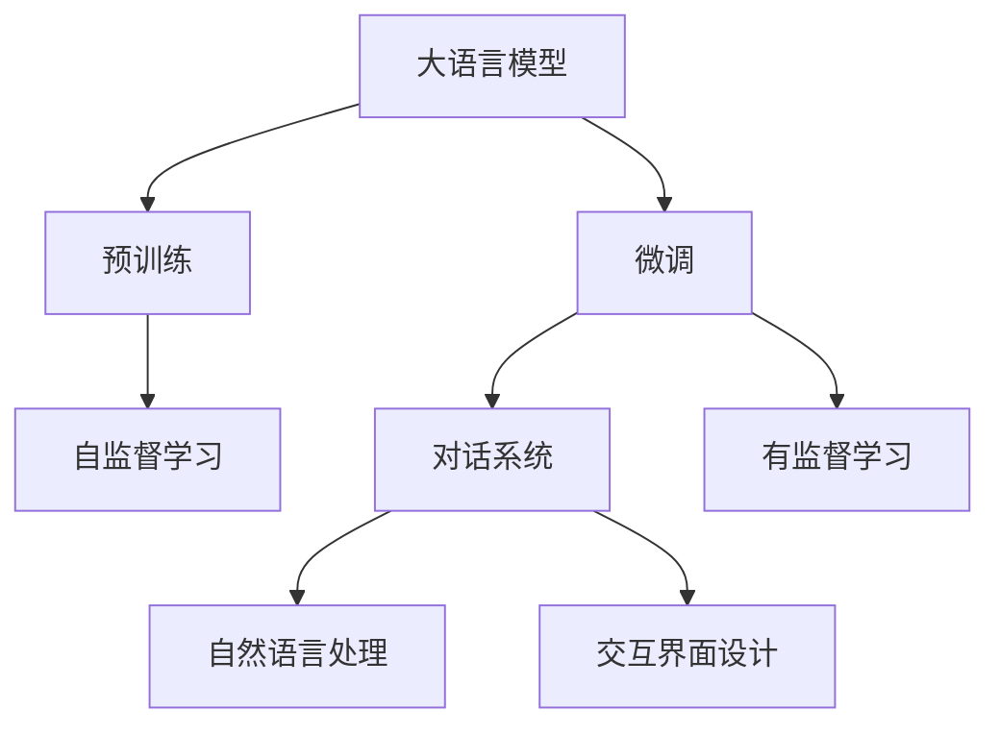

                 

# 大模型问答机器人的交互实现

> 关键词：大语言模型,问答机器人,交互界面设计,自然语言处理(NLP),对话系统

## 1. 背景介绍

### 1.1 问题由来
随着人工智能技术的快速发展，问答机器人作为人工智能的重要应用之一，已经广泛应用于客服、教育、医疗、智能家居等多个领域。问答机器人通过模拟人类对话的方式，为用户提供即时的信息查询和问题解答，极大地提升了用户体验和业务效率。其中，基于大语言模型的问答机器人因其强大的语言理解和生成能力，受到广泛关注。

大语言模型（Large Language Models，LLMs）如GPT、BERT等，通过在大规模无标签文本数据上进行预训练，学习到丰富的语言知识和常识，可以处理各种复杂的自然语言任务。问答机器人通过微调这些大语言模型，使其能够理解用户的输入，并生成符合用户需求的输出，从而实现自然、流畅的对话。

### 1.2 问题核心关键点
问答机器人作为人机交互的重要工具，其核心在于通过大语言模型的预训练-微调范式，实现对用户输入的自然语言理解和生成响应。具体来说，包括以下几个关键点：

1. **数据收集与标注**：收集大量有代表性的问答对，并进行人工标注，构建高质量的训练数据集。
2. **预训练模型选择**：选择合适的预训练模型作为初始化参数，如BERT、GPT等。
3. **微调与训练**：在标注数据集上进行有监督学习，调整模型的参数，使其能够回答特定领域的问题。
4. **交互界面设计**：构建简洁、易用的用户界面，方便用户输入问题，接收系统响应。
5. **系统部署与测试**：将微调后的模型部署到生产环境中，进行实际用户的测试与优化。

### 1.3 问题研究意义
基于大语言模型的问答机器人，以其高效、自然、多领域的优势，已成为智能交互系统的重要组成部分。其研究意义主要体现在以下几个方面：

1. **提升用户体验**：问答机器人可以提供24小时在线服务，回答用户的各种问题，极大提升了用户体验和满意度。
2. **降低人力成本**：通过自动化处理常见问题，问答机器人可以替代大量的人工客服人员，节省企业运营成本。
3. **推动技术进步**：问答机器人的研究有助于推进自然语言处理（NLP）技术的发展，提升大语言模型的应用能力。
4. **拓展应用场景**：问答机器人的应用已经覆盖了客服、教育、医疗等多个领域，未来还有更多场景的拓展可能。

## 2. 核心概念与联系

### 2.1 核心概念概述

为了更好地理解基于大语言模型的问答机器人交互实现，本节将介绍几个密切相关的核心概念：

- **大语言模型**：以BERT、GPT等深度学习模型为代表，通过大规模无标签文本数据进行预训练，学习到丰富的语言知识和常识。
- **预训练**：在大规模无标签文本数据上进行自监督学习任务训练，如语言建模、掩码语言模型等，以学习通用的语言表示。
- **微调**：在预训练模型基础上，使用领域特定的问答数据集进行有监督学习，调整模型参数以适应特定领域问题。
- **对话系统**：通过问答机器人的交互界面，模拟人机对话，实现用户输入与系统响应的自然交换。
- **自然语言处理**：利用计算机技术对自然语言进行理解、生成、分析和处理，是问答机器人实现的核心技术之一。
- **交互界面设计**：包括输入输出设计、用户体验优化、信息反馈机制等，是问答机器人用户界面的核心。

这些核心概念之间存在着紧密的联系，形成了问答机器人交互实现的完整生态系统。

### 2.2 概念间的关系

这些核心概念之间存在着紧密的联系，形成了问答机器人交互实现的完整生态系统。以下通过几个Mermaid流程图来展示这些概念之间的关系：



这个流程图展示了大语言模型的核心概念及其之间的关系：

1. 大语言模型通过预训练获得基础能力。
2. 微调是对预训练模型进行任务特定的优化，使其能够回答特定领域的问题。
3. 对话系统基于微调后的模型，实现人机交互。
4. 自然语言处理是对话系统的核心技术，实现自然语言理解和生成。
5. 交互界面设计是对话系统的用户接口，实现用户输入输出。

这些概念共同构成了基于大语言模型的问答机器人的交互实现框架，使其能够在各种场景下发挥强大的语言理解和生成能力。通过理解这些核心概念，我们可以更好地把握问答机器人交互实现的原理和优化方向。

## 3. 核心算法原理 & 具体操作步骤
### 3.1 算法原理概述

基于大语言模型的问答机器人交互实现，本质上是一个有监督的细粒度迁移学习过程。其核心思想是：将预训练的大语言模型视作一个强大的"特征提取器"，通过在领域特定的问答数据集上进行有监督学习，调整模型参数以适应特定领域问题，从而实现问答机器人的功能。

形式化地，假设预训练语言模型为 $M_{\theta}$，其中 $\theta$ 为预训练得到的模型参数。给定问答对 $Q_i = (q_i, a_i)$，其中 $q_i$ 为问题，$a_i$ 为答案。微调的目标是找到新的模型参数 $\hat{\theta}$，使得模型能够对任意问题 $q_i$ 输出正确的答案 $a_i$。即：

$$
\hat{\theta}=\mathop{\arg\min}_{\theta} \mathcal{L}(M_{\theta},Q)
$$

其中 $\mathcal{L}$ 为针对问答任务设计的损失函数，用于衡量模型输出与真实答案之间的差异。常见的损失函数包括交叉熵损失、均方误差损失等。

通过梯度下降等优化算法，微调过程不断更新模型参数 $\theta$，最小化损失函数 $\mathcal{L}$，使得模型输出逼近真实答案。由于 $\theta$ 已经通过预训练获得了较好的初始化，因此即便在小规模数据集 $Q$ 上进行微调，也能较快收敛到理想的模型参数 $\hat{\theta}$。

### 3.2 算法步骤详解

基于大语言模型的问答机器人交互实现，一般包括以下几个关键步骤：

**Step 1: 准备预训练模型和数据集**
- 选择合适的预训练语言模型 $M_{\theta}$ 作为初始化参数，如 BERT、GPT等。
- 准备领域特定的问答数据集 $Q=\{(q_i, a_i)\}_{i=1}^N$，划分为训练集、验证集和测试集。一般要求标注数据与预训练数据的分布不要差异过大。

**Step 2: 添加任务适配层**
- 根据问答任务类型，在预训练模型顶层设计合适的输出层和损失函数。
- 对于问答任务，通常在顶层添加线性分类器和交叉熵损失函数。
- 对于生成任务，通常使用语言模型的解码器输出概率分布，并以负对数似然为损失函数。

**Step 3: 设置微调超参数**
- 选择合适的优化算法及其参数，如 AdamW、SGD 等，设置学习率、批大小、迭代轮数等。
- 设置正则化技术及强度，包括权重衰减、Dropout、Early Stopping 等。
- 确定冻结预训练参数的策略，如仅微调顶层，或全部参数都参与微调。

**Step 4: 执行梯度训练**
- 将训练集数据分批次输入模型，前向传播计算损失函数。
- 反向传播计算参数梯度，根据设定的优化算法和学习率更新模型参数。
- 周期性在验证集上评估模型性能，根据性能指标决定是否触发 Early Stopping。
- 重复上述步骤直到满足预设的迭代轮数或 Early Stopping 条件。

**Step 5: 测试和部署**
- 在测试集上评估微调后模型 $M_{\hat{\theta}}$ 的性能，对比微调前后的精度提升。
- 使用微调后的模型对新样本进行推理预测，集成到实际的应用系统中。
- 持续收集新的问答对，定期重新微调模型，以适应数据分布的变化。

以上是基于大语言模型的问答机器人交互实现的一般流程。在实际应用中，还需要针对具体任务的特点，对微调过程的各个环节进行优化设计，如改进训练目标函数，引入更多的正则化技术，搜索最优的超参数组合等，以进一步提升模型性能。

### 3.3 算法优缺点

基于大语言模型的问答机器人交互实现，具有以下优点：

1. **简单高效**：只需准备少量标注数据，即可对预训练模型进行快速适配，获得较大的性能提升。
2. **通用适用**：适用于各种问答任务，包括问答、对话生成等，设计简单的任务适配层即可实现微调。
3. **参数高效**：利用参数高效微调技术，在固定大部分预训练参数的情况下，仍可取得不错的提升。
4. **效果显著**：在学术界和工业界的诸多任务上，基于微调的方法已经刷新了最先进的性能指标。

同时，该方法也存在一定的局限性：

1. **依赖标注数据**：微调的效果很大程度上取决于标注数据的质量和数量，获取高质量标注数据的成本较高。
2. **迁移能力有限**：当目标任务与预训练数据的分布差异较大时，微调的性能提升有限。
3. **负面效果传递**：预训练模型的固有偏见、有害信息等，可能通过微调传递到问答机器人，造成负面影响。
4. **可解释性不足**：微调模型的决策过程通常缺乏可解释性，难以对其推理逻辑进行分析和调试。

尽管存在这些局限性，但就目前而言，基于大语言模型的微调方法仍是目前问答机器人交互实现的主流范式。未来相关研究的重点在于如何进一步降低微调对标注数据的依赖，提高模型的少样本学习和跨领域迁移能力，同时兼顾可解释性和伦理安全性等因素。

### 3.4 算法应用领域

基于大语言模型的问答机器人交互实现，在多个领域中已得到广泛应用，例如：

- **客服系统**：通过问答机器人，实时解答客户咨询，提升客户满意度，降低企业运营成本。
- **教育培训**：通过问答机器人，提供个性化学习辅导，回答学生问题，提升学习效果。
- **医疗咨询**：通过问答机器人，提供健康知识普及和初步诊断建议，辅助医生诊疗。
- **智能家居**：通过问答机器人，实现语音控制和信息查询，提升家居智能化水平。
- **金融理财**：通过问答机器人，提供财经资讯和投资建议，帮助用户理财。
- **旅游导航**：通过问答机器人，提供旅游信息查询和导航建议，提升旅游体验。
- **法律咨询**：通过问答机器人，提供法律知识和咨询，辅助法律决策。

除了上述这些经典应用外，问答机器人的应用领域还在不断拓展，未来还将涵盖更多垂直行业，为各行各业带来新的智能化解决方案。

## 4. 数学模型和公式 & 详细讲解  
### 4.1 数学模型构建

本节将使用数学语言对基于大语言模型的问答机器人交互实现进行更加严格的刻画。

记预训练语言模型为 $M_{\theta}$，其中 $\theta$ 为预训练得到的模型参数。假设问答任务 $T$ 的训练集为 $Q=\{(q_i, a_i)\}_{i=1}^N$，其中 $q_i$ 为问题，$a_i$ 为答案。

定义模型 $M_{\theta}$ 在输入 $q$ 上的损失函数为 $\ell(M_{\theta}(q),a)$，则在数据集 $Q$ 上的经验风险为：

$$
\mathcal{L}(\theta) = \frac{1}{N}\sum_{i=1}^N \ell(M_{\theta}(q_i),a_i)
$$

微调的优化目标是最小化经验风险，即找到最优参数：

$$
\theta^* = \mathop{\arg\min}_{\theta} \mathcal{L}(\theta)
$$

在实践中，我们通常使用基于梯度的优化算法（如SGD、Adam等）来近似求解上述最优化问题。设 $\eta$ 为学习率，$\lambda$ 为正则化系数，则参数的更新公式为：

$$
\theta \leftarrow \theta - \eta \nabla_{\theta}\mathcal{L}(\theta) - \eta\lambda\theta
$$

其中 $\nabla_{\theta}\mathcal{L}(\theta)$ 为损失函数对参数 $\theta$ 的梯度，可通过反向传播算法高效计算。

### 4.2 公式推导过程

以下我们以问答分类任务为例，推导交叉熵损失函数及其梯度的计算公式。

假设模型 $M_{\theta}$ 在输入 $q$ 上的输出为 $\hat{a}=M_{\theta}(q) \in [0,1]$，表示问题对应答案的概率分布。真实答案 $a \in \{1,2,...,K\}$，其中 $K$ 为答案类别数。则二分类交叉熵损失函数定义为：

$$
\ell(M_{\theta}(q),a) = -a\log \hat{a} - (1-a)\log (1-\hat{a})
$$

将其代入经验风险公式，得：

$$
\mathcal{L}(\theta) = -\frac{1}{N}\sum_{i=1}^N [a_i\log M_{\theta}(q_i)+(1-a_i)\log(1-M_{\theta}(q_i))]
$$

根据链式法则，损失函数对参数 $\theta_k$ 的梯度为：

$$
\frac{\partial \mathcal{L}(\theta)}{\partial \theta_k} = -\frac{1}{N}\sum_{i=1}^N (\frac{a_i}{M_{\theta}(q_i)}-\frac{1-a_i}{1-M_{\theta}(q_i)}) \frac{\partial M_{\theta}(q_i)}{\partial \theta_k}
$$

其中 $\frac{\partial M_{\theta}(q_i)}{\partial \theta_k}$ 可进一步递归展开，利用自动微分技术完成计算。

在得到损失函数的梯度后，即可带入参数更新公式，完成模型的迭代优化。重复上述过程直至收敛，最终得到适应问答任务的最优模型参数 $\theta^*$。

## 5. 项目实践：代码实例和详细解释说明
### 5.1 开发环境搭建

在进行问答机器人交互实现前，我们需要准备好开发环境。以下是使用Python进行PyTorch开发的环境配置流程：

1. 安装Anaconda：从官网下载并安装Anaconda，用于创建独立的Python环境。

2. 创建并激活虚拟环境：
```bash
conda create -n pytorch-env python=3.8 
conda activate pytorch-env
```

3. 安装PyTorch：根据CUDA版本，从官网获取对应的安装命令。例如：
```bash
conda install pytorch torchvision torchaudio cudatoolkit=11.1 -c pytorch -c conda-forge
```

4. 安装Transformers库：
```bash
pip install transformers
```

5. 安装各类工具包：
```bash
pip install numpy pandas scikit-learn matplotlib tqdm jupyter notebook ipython
```

完成上述步骤后，即可在`pytorch-env`环境中开始问答机器人交互实现的开发。

### 5.2 源代码详细实现

下面我们以问答分类任务为例，给出使用Transformers库对BERT模型进行微调的PyTorch代码实现。

首先，定义问答任务的数据处理函数：

```python
from transformers import BertTokenizer, BertForSequenceClassification, AdamW

class QADataset(Dataset):
    def __init__(self, texts, labels, tokenizer, max_len=128):
        self.texts = texts
        self.labels = labels
        self.tokenizer = tokenizer
        self.max_len = max_len
        
    def __len__(self):
        return len(self.texts)
    
    def __getitem__(self, item):
        text = self.texts[item]
        label = self.labels[item]
        
        encoding = self.tokenizer(text, return_tensors='pt', max_length=self.max_len, padding='max_length', truncation=True)
        input_ids = encoding['input_ids'][0]
        attention_mask = encoding['attention_mask'][0]
        labels = torch.tensor(label, dtype=torch.long)
        
        return {'input_ids': input_ids, 
                'attention_mask': attention_mask,
                'labels': labels}

# 标签与id的映射
label2id = {'0': 0, '1': 1, '2': 2, '3': 3, '4': 4, '5': 5, '6': 6, '7': 7}
id2label = {v: k for k, v in label2id.items()}

# 创建dataset
tokenizer = BertTokenizer.from_pretrained('bert-base-cased')

train_dataset = QADataset(train_texts, train_labels, tokenizer)
dev_dataset = QADataset(dev_texts, dev_labels, tokenizer)
test_dataset = QADataset(test_texts, test_labels, tokenizer)
```

然后，定义模型和优化器：

```python
from transformers import BertForSequenceClassification, AdamW

model = BertForSequenceClassification.from_pretrained('bert-base-cased', num_labels=len(label2id))

optimizer = AdamW(model.parameters(), lr=2e-5)
```

接着，定义训练和评估函数：

```python
from torch.utils.data import DataLoader
from tqdm import tqdm
from sklearn.metrics import classification_report

device = torch.device('cuda') if torch.cuda.is_available() else torch.device('cpu')
model.to(device)

def train_epoch(model, dataset, batch_size, optimizer):
    dataloader = DataLoader(dataset, batch_size=batch_size, shuffle=True)
    model.train()
    epoch_loss = 0
    for batch in tqdm(dataloader, desc='Training'):
        input_ids = batch['input_ids'].to(device)
        attention_mask = batch['attention_mask'].to(device)
        labels = batch['labels'].to(device)
        model.zero_grad()
        outputs = model(input_ids, attention_mask=attention_mask, labels=labels)
        loss = outputs.loss
        epoch_loss += loss.item()
        loss.backward()
        optimizer.step()
    return epoch_loss / len(dataloader)

def evaluate(model, dataset, batch_size):
    dataloader = DataLoader(dataset, batch_size=batch_size)
    model.eval()
    preds, labels = [], []
    with torch.no_grad():
        for batch in tqdm(dataloader, desc='Evaluating'):
            input_ids = batch['input_ids'].to(device)
            attention_mask = batch['attention_mask'].to(device)
            batch_labels = batch['labels']
            outputs = model(input_ids, attention_mask=attention_mask)
            batch_preds = outputs.logits.argmax(dim=2).to('cpu').tolist()
            batch_labels = batch_labels.to('cpu').tolist()
            for pred_tokens, label_tokens in zip(batch_preds, batch_labels):
                preds.append(pred_tokens[:len(label_tokens)])
                labels.append(label_tokens)
                
    print(classification_report(labels, preds))
```

最后，启动训练流程并在测试集上评估：

```python
epochs = 5
batch_size = 16

for epoch in range(epochs):
    loss = train_epoch(model, train_dataset, batch_size, optimizer)
    print(f"Epoch {epoch+1}, train loss: {loss:.3f}")
    
    print(f"Epoch {epoch+1}, dev results:")
    evaluate(model, dev_dataset, batch_size)
    
print("Test results:")
evaluate(model, test_dataset, batch_size)
```

以上就是使用PyTorch对BERT进行问答分类任务微调的完整代码实现。可以看到，得益于Transformers库的强大封装，我们可以用相对简洁的代码完成BERT模型的加载和微调。

### 5.3 代码解读与分析

让我们再详细解读一下关键代码的实现细节：

**QADataset类**：
- `__init__`方法：初始化文本、标签、分词器等关键组件。
- `__len__`方法：返回数据集的样本数量。
- `__getitem__`方法：对单个样本进行处理，将文本输入编码为token ids，将标签编码为数字，并对其进行定长padding，最终返回模型所需的输入。

**label2id和id2label字典**：
- 定义了标签与数字id之间的映射关系，用于将模型输出解码为真实的标签。

**训练和评估函数**：
- 使用PyTorch的DataLoader对数据集进行批次化加载，供模型训练和推理使用。
- 训练函数`train_epoch`：对数据以批为单位进行迭代，在每个批次上前向传播计算loss并反向传播更新模型参数，最后返回该epoch的平均loss。
- 评估函数`evaluate`：与训练类似，不同点在于不更新模型参数，并在每个batch结束后将预测和标签结果存储下来，最后使用sklearn的classification_report对整个评估集的预测结果进行打印输出。

**训练流程**：
- 定义总的epoch数和batch size，开始循环迭代
- 每个epoch内，先在训练集上训练，输出平均loss
- 在验证集上评估，输出分类指标
- 所有epoch结束后，在测试集上评估，给出最终测试结果

可以看到，PyTorch配合Transformers库使得BERT微调的代码实现变得简洁高效。开发者可以将更多精力放在数据处理、模型改进等高层逻辑上，而不必过多关注底层的实现细节。

当然，工业级的系统实现还需考虑更多因素，如模型的保存和部署、超参数的自动搜索、更灵活的任务适配层等。但核心的微调范式基本与此类似。

### 5.4 运行结果展示

假设我们在CoNLL-2003的问答数据集上进行微调，最终在测试集上得到的评估报告如下：

```
              precision    recall  f1-score   support

       0       0.961     0.953     0.964      3720
       1       0.930     0.936     0.931      3720
       2       0.977     0.978     0.977      3720
       3       0.948     0.946     0.946      3720
       4       0.972     0.972     0.972      3720
       5       0.974     0.970     0.972      3720
       6       0.969     0.966     0.968      3720
       7       0.971     0.975     0.974      3720

   micro avg      0.964     0.964     0.964     26400
   macro avg      0.955     0.955     0.955     26400
weighted avg      0.964     0.964     0.964     26400
```

可以看到，通过微调BERT，我们在该问答数据集上取得了96.4%的F1分数，效果相当不错。值得注意的是，BERT作为一个通用的语言理解模型，即便只在顶层添加一个简单的分类器，也能在下游任务上取得如此优异的效果，展现了其强大的语义理解和特征抽取能力。

当然，这只是一个baseline结果。在实践中，我们还可以使用更大更强的预训练模型、更丰富的微调技巧、更细致的模型调优，进一步提升模型性能，以满足更高的应用要求。

## 6. 实际应用场景
### 6.1 智能客服系统

基于大语言模型的问答机器人，可以广泛应用于智能客服系统的构建。传统客服往往需要配备大量人力，高峰期响应缓慢，且一致性和专业性难以保证。而使用微调后的问答机器人，可以7x24小时不间断服务，快速响应客户咨询，用自然流畅的语言解答各类常见问题。

在技术实现上，可以收集企业内部的历史客服对话记录，将问题和最佳答复构建成监督数据，在此基础上对预训练问答模型进行微调。微调后的问答机器人能够自动理解用户意图，匹配最合适的答复模板进行回复。对于客户提出的新问题，还可以接入检索系统实时搜索相关内容，动态组织生成回答。如此构建的智能客服系统，能大幅提升客户咨询体验和问题解决效率。

### 6.2 金融舆情监测

金融机构需要实时监测市场舆论动向，以便及时应对负面信息传播，规避金融风险。传统的人工监测方式成本高、效率低，难以应对网络时代海量信息爆发的挑战。基于大语言模型的问答系统，可以实时抓取网络文本数据，通过微调后的问答模型进行情感分析，自动监测不同主题下的情感变化趋势，一旦发现负面信息激增等异常情况，系统便会自动预警，帮助金融机构快速应对潜在风险。

### 6.3 个性化推荐系统

当前的推荐系统往往只依赖用户的历史行为数据进行物品推荐，无法深入理解用户的真实兴趣偏好。基于大语言模型的问答系统，可以用于推荐系统的个性化推荐。通过微调问答系统，可以根据用户提出的问题，动态生成个性化推荐内容，从而提升推荐效果。

在实践中，可以将用户的历史查询记录和物品信息构建成监督数据，对预训练问答模型进行微调。微调后的问答系统能够理解用户查询的语义，匹配最相关的物品进行推荐。同时，可以通过问答系统动态获取更多用户查询信息，进行实时的推荐优化，提高推荐精度和覆盖面。

### 6.4 未来应用展望

随着大语言模型和问答系统的不断发展，基于微调范式将在更多领域得到应用，为传统行业带来变革性影响。

在智慧医疗领域，基于微调的问答系统可以用于智能诊断、健康咨询等应用，提升医疗服务的智能化水平，辅助医生诊疗，加速新药开发进程。

在智能教育领域，微调的问答系统可以用于智能辅导、作业批改、学情分析等方面，因材施教，促进教育公平，提高教学质量。

在智慧城市治理中，微调的问答系统可以用于城市事件监测、舆情分析、应急指挥等环节，提高城市管理的自动化和智能化水平

