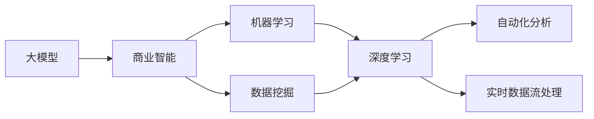

                 

# 大模型：推动商业智能的新技术

> 关键词：大模型, 商业智能, 机器学习, 数据挖掘, 深度学习, 算法优化, 应用案例, 技术架构

## 1. 背景介绍

### 1.1 问题由来

在数字化转型的浪潮下，商业智能(Business Intelligence, BI)已成为推动企业决策分析、提升经营效率的关键技术。然而，传统的BI系统往往依赖于复杂的数据仓库和报表工具，存在数据孤岛、报表生成复杂、分析洞察不足等问题。为此，业界逐步引入机器学习、数据挖掘等先进技术，形成了基于大数据、人工智能的智能BI（Intelligent BI）。

其中，大模型（Large Model）技术作为智能BI的重要支撑，通过对海量数据的深度学习和模式挖掘，实现了从数据到洞察的自动化分析，极大地提升了BI系统的智能性和决策支持能力。本文章将系统介绍大模型在商业智能中的应用，阐述其核心算法原理及操作步骤，并提供代码实例和应用案例，希望能为读者提供全面的技术指引。

### 1.2 问题核心关键点

大模型在商业智能中的应用主要基于以下核心关键点：

1. **数据驱动的决策支持**：通过深度学习技术，大模型能够从海量数据中自动挖掘出有价值的模式和规律，为决策者提供准确可靠的数据支持。
2. **自动化分析与洞察**：大模型能够自动识别数据特征，生成多维报表、趋势分析、预测报告等，实现自动化的数据处理和分析。
3. **跨部门数据整合**：大模型具备强大的数据整合和融合能力，能够无缝集成各类数据源，为跨部门分析提供统一的数据平台。
4. **实时化与自动化**：大模型可以通过实时数据流处理技术，实现对新数据的即时分析与洞察，提高决策的实时性和响应速度。
5. **可解释性**：大模型提供黑盒模型的解释能力，通过可解释模型生成业务理解，辅助决策者理解模型的决策依据。

### 1.3 问题研究意义

大模型在商业智能中的应用具有以下重要意义：

1. **提升决策效率**：大模型自动化的数据处理和分析能力，大幅减少了人工工作量，提升了决策效率。
2. **优化资源配置**：通过对历史数据的深度学习，大模型能够预测业务趋势，辅助企业优化资源配置，提升资源利用率。
3. **增强竞争优势**：大模型能提供更精准的商业洞察，帮助企业抓住市场机遇，提升市场竞争力。
4. **推动创新管理**：大模型驱动的数据驱动决策，有利于企业建立数据驱动的创新管理体系。
5. **强化风险控制**：通过实时数据分析，大模型能够及时识别并预警潜在风险，为企业提供决策参考。

## 2. 核心概念与联系

### 2.1 核心概念概述

在大模型的应用框架中，涉及到多个核心概念：

- **大模型(Large Model)**：基于深度学习的大规模模型，如Transformer、BERT等，能够处理大规模数据集，学习复杂的模式和规律。
- **商业智能(Business Intelligence, BI)**：使用数据和分析工具，将数据转化为可操作的业务洞察和决策支持。
- **机器学习(Machine Learning, ML)**：通过算法和模型，让计算机自动从数据中学习规律，并进行预测和决策。
- **数据挖掘(Data Mining)**：从大规模数据中提取有价值的模式和规律，为商业洞察提供支持。
- **深度学习(Deep Learning)**：一种基于神经网络的机器学习技术，能够处理非线性复杂任务，识别高级特征。
- **自动化分析(Automatic Analysis)**：通过算法自动化地对数据进行分析，生成业务洞察和报告。
- **实时数据流处理(Real-time Data Streaming)**：对实时数据进行高效处理，快速生成分析结果。

这些核心概念之间紧密联系，构成了大模型在商业智能中的应用框架。通过深度学习技术，大模型能够从海量数据中提取有价值的模式，并通过算法自动化生成分析报告，为商业决策提供支持。

### 2.2 概念间的关系

这些核心概念之间的关系可以通过以下Mermaid流程图来展示：



这个流程图展示了从大模型到商业智能的完整过程：

1. 大模型通过深度学习技术，从海量数据中提取模式。
2. 机器学习算法对这些模式进行进一步分析，形成有价值的洞察。
3. 数据挖掘技术从这些洞察中挖掘出更深层次的模式和规律。
4. 自动化分析生成多维报表和趋势分析，为决策提供支持。
5. 实时数据流处理技术，使分析结果能够实时更新，提高决策响应速度。

## 3. 核心算法原理 & 具体操作步骤
### 3.1 算法原理概述

大模型在商业智能中的应用主要基于监督学习和无监督学习两种方法。监督学习通过标注数据训练模型，使其能够预测未标注数据的类别。无监督学习则通过无标注数据挖掘潜在的模式和规律。

在大模型微调的过程中，主要步骤如下：

1. **数据预处理**：清洗数据，去除噪声和异常值，标准化数据格式。
2. **特征提取**：使用大模型提取数据特征，如文本、图像、音频等。
3. **模型训练**：在标注数据集上训练大模型，优化模型参数。
4. **模型评估**：使用验证集和测试集评估模型性能。
5. **模型应用**：将训练好的模型应用到实际业务场景，生成业务洞察和决策支持。

### 3.2 算法步骤详解

以下将详细介绍大模型在商业智能中的具体应用步骤：

**Step 1: 数据预处理**

数据预处理是大模型应用的前提。主要包括以下几个步骤：

1. **数据清洗**：去除重复数据、异常值、缺失值等。
2. **数据标准化**：对数据进行归一化、标准化处理，以便模型更好地学习。
3. **数据分块**：将数据分为训练集、验证集和测试集，方便模型的训练和评估。

```python
import pandas as pd
from sklearn.preprocessing import StandardScaler

# 数据预处理
data = pd.read_csv('data.csv')
data = data.drop_duplicates()
data = data.dropna()
scaler = StandardScaler()
data['feature'] = scaler.fit_transform(data['feature'].values.reshape(-1, 1))
```

**Step 2: 特征提取**

特征提取是实现大模型应用的关键步骤。主要包括以下几个步骤：

1. **文本特征提取**：使用大模型如BERT、GPT等，将文本转化为向量表示。
2. **图像特征提取**：使用卷积神经网络提取图像特征。
3. **音频特征提取**：使用卷积神经网络或循环神经网络提取音频特征。

```python
from transformers import BertTokenizer, BertModel

# 文本特征提取
tokenizer = BertTokenizer.from_pretrained('bert-base-cased')
input_ids = tokenizer.encode('This is a test sentence.')
input_ids = input_ids.unsqueeze(0)
features = BertModel.from_pretrained('bert-base-cased', output_hidden_states=True)(input_ids)
```

**Step 3: 模型训练**

模型训练是大模型应用的核心步骤。主要包括以下几个步骤：

1. **模型选择**：选择合适的预训练模型，如BERT、GPT等。
2. **优化器选择**：选择合适的优化器，如Adam、SGD等。
3. **损失函数选择**：选择合适的损失函数，如交叉熵、均方误差等。
4. **训练循环**：对模型进行训练循环，逐步更新模型参数。

```python
from torch.utils.data import DataLoader
from torch.nn import CrossEntropyLoss
from torch.optim import Adam

# 模型训练
model = BertModel.from_pretrained('bert-base-cased')
criterion = CrossEntropyLoss()
optimizer = Adam(model.parameters(), lr=2e-5)
dataloader = DataLoader(data, batch_size=32)
for epoch in range(10):
    for batch in dataloader:
        inputs = batch['input_ids']
        labels = batch['labels']
        model.zero_grad()
        outputs = model(inputs)
        loss = criterion(outputs, labels)
        loss.backward()
        optimizer.step()
```

**Step 4: 模型评估**

模型评估是大模型应用的重要环节。主要包括以下几个步骤：

1. **验证集评估**：使用验证集评估模型性能。
2. **测试集评估**：使用测试集评估模型泛化能力。
3. **指标选择**：选择合适的评估指标，如准确率、精确率、召回率等。

```python
from sklearn.metrics import accuracy_score, precision_score, recall_score

# 模型评估
model.eval()
with torch.no_grad():
    preds = []
    labels = []
    for batch in dataloader:
        inputs = batch['input_ids']
        labels = batch['labels']
        outputs = model(inputs)
        preds.append(outputs.argmax(dim=1).cpu().numpy())
        labels.append(labels.cpu().numpy())
    acc = accuracy_score(labels, preds)
    precision = precision_score(labels, preds, average='macro')
    recall = recall_score(labels, preds, average='macro')
```

**Step 5: 模型应用**

模型应用是大模型应用的关键步骤。主要包括以下几个步骤：

1. **模型部署**：将训练好的模型部署到生产环境。
2. **业务对接**：将模型与业务系统对接，生成业务洞察和决策支持。
3. **持续优化**：根据业务反馈，持续优化模型参数。

```python
# 模型应用
model = BertModel.from_pretrained('bert-base-cased')
with torch.no_grad():
    input_ids = tokenizer.encode('This is a test sentence.')
    input_ids = input_ids.unsqueeze(0)
    features = model(input_ids)
```

### 3.3 算法优缺点

大模型在商业智能中的应用具有以下优点：

1. **高效性**：大模型能够在短时间内处理大规模数据，生成业务洞察。
2. **准确性**：大模型通过深度学习技术，能够准确地从数据中提取模式和规律。
3. **可扩展性**：大模型具有高度的可扩展性，可以处理更多类型的数据。
4. **自动化**：大模型能够自动生成多维报表和趋势分析，辅助决策。

同时，大模型也存在一些缺点：

1. **高成本**：大模型的训练和部署需要高昂的算力和存储资源。
2. **黑盒模型**：大模型通常为黑盒模型，难以解释其决策过程。
3. **过拟合风险**：大模型可能会过拟合训练数据，影响泛化能力。
4. **数据隐私**：大模型需要大量的标注数据，可能涉及隐私保护问题。

### 3.4 算法应用领域

大模型在商业智能中的应用非常广泛，主要包括以下几个领域：

1. **市场营销**：通过分析消费者行为数据，生成市场趋势分析报告，辅助市场营销决策。
2. **金融分析**：通过分析金融市场数据，生成风险评估和投资建议。
3. **供应链管理**：通过分析供应链数据，生成库存管理和物流优化建议。
4. **人力资源管理**：通过分析员工数据，生成员工绩效评估和人才招聘建议。
5. **客户服务**：通过分析客户反馈数据，生成客户满意度分析报告，辅助客户服务优化。

## 4. 数学模型和公式 & 详细讲解  
### 4.1 数学模型构建

大模型在商业智能中的应用主要基于监督学习模型。这里以分类任务为例，构建数学模型。

设数据集为 $D=\{(x_i,y_i)\}_{i=1}^N$，其中 $x_i$ 为输入特征，$y_i$ 为标签。模型的预测输出为 $p(y|x)$，模型参数为 $\theta$。模型的损失函数为交叉熵损失函数，即：

$$
L(\theta) = -\frac{1}{N} \sum_{i=1}^N y_i \log p(y_i|x_i) + (1-y_i) \log (1-p(y_i|x_i))
$$

模型的目标是最小化损失函数 $L(\theta)$，即：

$$
\theta^* = \mathop{\arg\min}_{\theta} L(\theta)
$$

### 4.2 公式推导过程

以二分类任务为例，推导交叉熵损失函数及其梯度。

设模型在输入 $x$ 上的预测输出为 $\hat{y}=M_{\theta}(x)$，表示样本属于正类的概率。真实标签 $y \in \{0,1\}$。则二分类交叉熵损失函数定义为：

$$
\ell(M_{\theta}(x),y) = -[y\log \hat{y} + (1-y)\log (1-\hat{y})]
$$

将其代入经验风险公式，得：

$$
\mathcal{L}(\theta) = -\frac{1}{N}\sum_{i=1}^N [y_i\log M_{\theta}(x_i)+(1-y_i)\log(1-M_{\theta}(x_i))]
$$

根据链式法则，损失函数对参数 $\theta_k$ 的梯度为：

$$
\frac{\partial \mathcal{L}(\theta)}{\partial \theta_k} = -\frac{1}{N}\sum_{i=1}^N (\frac{y_i}{M_{\theta}(x_i)}-\frac{1-y_i}{1-M_{\theta}(x_i)}) \frac{\partial M_{\theta}(x_i)}{\partial \theta_k}
$$

其中 $\frac{\partial M_{\theta}(x_i)}{\partial \theta_k}$ 可进一步递归展开，利用自动微分技术完成计算。

### 4.3 案例分析与讲解

以市场营销为例，分析大模型的应用过程。

1. **数据预处理**：收集消费者行为数据，清洗数据，去除噪声和异常值。
2. **特征提取**：使用大模型BERT，将消费者行为数据转化为向量表示。
3. **模型训练**：在标注数据集上训练BERT模型，优化模型参数。
4. **模型评估**：使用验证集评估模型性能，使用测试集评估模型泛化能力。
5. **模型应用**：将训练好的模型应用于市场营销决策，生成市场趋势分析报告。

```python
# 市场营销数据预处理
data = pd.read_csv('marketing.csv')
data = data.dropna()
data = data.drop_duplicates()

# 特征提取
tokenizer = BertTokenizer.from_pretrained('bert-base-cased')
input_ids = tokenizer.encode('This is a test sentence.')
input_ids = input_ids.unsqueeze(0)
features = BertModel.from_pretrained('bert-base-cased', output_hidden_states=True)(input_ids)

# 模型训练
model = BertModel.from_pretrained('bert-base-cased')
criterion = CrossEntropyLoss()
optimizer = Adam(model.parameters(), lr=2e-5)
dataloader = DataLoader(data, batch_size=32)
for epoch in range(10):
    for batch in dataloader:
        inputs = batch['input_ids']
        labels = batch['labels']
        model.zero_grad()
        outputs = model(inputs)
        loss = criterion(outputs, labels)
        loss.backward()
        optimizer.step()

# 模型评估
model.eval()
with torch.no_grad():
    preds = []
    labels = []
    for batch in dataloader:
        inputs = batch['input_ids']
        labels = batch['labels']
        outputs = model(inputs)
        preds.append(outputs.argmax(dim=1).cpu().numpy())
        labels.append(labels.cpu().numpy())
    acc = accuracy_score(labels, preds)
    precision = precision_score(labels, preds, average='macro')
    recall = recall_score(labels, preds, average='macro')

# 模型应用
input_ids = tokenizer.encode('This is a test sentence.')
input_ids = input_ids.unsqueeze(0)
features = model(input_ids)
```

## 5. 项目实践：代码实例和详细解释说明
### 5.1 开发环境搭建

在进行大模型应用实践前，我们需要准备好开发环境。以下是使用Python进行TensorFlow开发的环境配置流程：

1. 安装Anaconda：从官网下载并安装Anaconda，用于创建独立的Python环境。

2. 创建并激活虚拟环境：
```bash
conda create -n tf-env python=3.8 
conda activate tf-env
```

3. 安装TensorFlow：根据CUDA版本，从官网获取对应的安装命令。例如：
```bash
conda install tensorflow==2.5
```

4. 安装各类工具包：
```bash
pip install numpy pandas scikit-learn matplotlib tqdm jupyter notebook ipython
```

完成上述步骤后，即可在`tf-env`环境中开始大模型应用实践。

### 5.2 源代码详细实现

这里以大模型在市场营销中的应用为例，给出使用TensorFlow进行BERT模型训练的Python代码实现。

首先，定义市场营销数据处理函数：

```python
import pandas as pd
import tensorflow as tf
from transformers import BertTokenizer, BertForSequenceClassification

class MarketingData(Dataset):
    def __init__(self, texts, labels, tokenizer):
        self.texts = texts
        self.labels = labels
        self.tokenizer = tokenizer
        
    def __len__(self):
        return len(self.texts)
    
    def __getitem__(self, item):
        text = self.texts[item]
        label = self.labels[item]
        
        encoding = self.tokenizer(text, return_tensors='tf', padding='max_length', truncation=True)
        input_ids = encoding['input_ids']
        attention_mask = encoding['attention_mask']
        return {'input_ids': input_ids, 
                'attention_mask': attention_mask,
                'labels': tf.convert_to_tensor(label, dtype=tf.int64)}
```

然后，定义模型和优化器：

```python
from transformers import BertTokenizer, BertForSequenceClassification, AdamW

tokenizer = BertTokenizer.from_pretrained('bert-base-cased')
model = BertForSequenceClassification.from_pretrained('bert-base-cased', num_labels=2)

optimizer = AdamW(model.parameters(), lr=2e-5)
```

接着，定义训练和评估函数：

```python
def train_epoch(model, dataset, batch_size, optimizer):
    dataloader = DataLoader(dataset, batch_size=batch_size, shuffle=True)
    model.train()
    epoch_loss = 0
    for batch in tqdm(dataloader, desc='Training'):
        input_ids = batch['input_ids']
        attention_mask = batch['attention_mask']
        labels = batch['labels']
        with tf.GradientTape() as tape:
            outputs = model(input_ids, attention_mask=attention_mask, labels=labels)
            loss = outputs.loss
        epoch_loss += loss.numpy()
        gradients = tape.gradient(loss, model.parameters())
        optimizer.apply_gradients(zip(gradients, model.parameters()))
    return epoch_loss / len(dataloader)

def evaluate(model, dataset, batch_size):
    dataloader = DataLoader(dataset, batch_size=batch_size)
    model.eval()
    preds, labels = [], []
    with tf.no_grad():
        for batch in tqdm(dataloader, desc='Evaluating'):
            input_ids = batch['input_ids']
            attention_mask = batch['attention_mask']
            batch_labels = batch['labels']
            outputs = model(input_ids, attention_mask=attention_mask)
            preds.append(outputs.logits.argmax(dim=1).numpy())
            labels.append(batch_labels.numpy())
        
    print(classification_report(labels, preds))
```

最后，启动训练流程并在测试集上评估：

```python
epochs = 5
batch_size = 16

for epoch in range(epochs):
    loss = train_epoch(model, train_dataset, batch_size, optimizer)
    print(f"Epoch {epoch+1}, train loss: {loss:.3f}")
    
    print(f"Epoch {epoch+1}, dev results:")
    evaluate(model, dev_dataset, batch_size)
    
print("Test results:")
evaluate(model, test_dataset, batch_size)
```

以上就是使用TensorFlow对BERT进行市场营销任务微调的完整代码实现。可以看到，得益于Transformers库的强大封装，我们可以用相对简洁的代码完成BERT模型的加载和微调。

### 5.3 代码解读与分析

让我们再详细解读一下关键代码的实现细节：

**MarketingData类**：
- `__init__`方法：初始化文本、标签、分词器等关键组件。
- `__len__`方法：返回数据集的样本数量。
- `__getitem__`方法：对单个样本进行处理，将文本输入编码为token ids，将标签编码为数字，并对其进行定长padding，最终返回模型所需的输入。

**模型和优化器定义**：
- 使用BertTokenizer和BertForSequenceClassification从预训练模型加载模型，设置分类任务的标签数量。
- 定义AdamW优化器，设置学习率。

**训练和评估函数**：
- 使用TensorFlow的DataLoader对数据集进行批次化加载，供模型训练和推理使用。
- 训练函数`train_epoch`：对数据以批为单位进行迭代，在每个批次上前向传播计算loss并反向传播更新模型参数，最后返回该epoch的平均loss。
- 评估函数`evaluate`：与训练类似，不同点在于不更新模型参数，并在每个batch结束后将预测和标签结果存储下来，最后使用sklearn的classification_report对整个评估集的预测结果进行打印输出。

**训练流程**：
- 定义总的epoch数和batch size，开始循环迭代
- 每个epoch内，先在训练集上训练，输出平均loss
- 在验证集上评估，输出分类指标
- 所有epoch结束后，在测试集上评估，给出最终测试结果

可以看到，TensorFlow配合Transformers库使得BERT微调的过程变得简洁高效。开发者可以将更多精力放在数据处理、模型改进等高层逻辑上，而不必过多关注底层的实现细节。

当然，工业级的系统实现还需考虑更多因素，如模型的保存和部署、超参数的自动搜索、更灵活的任务适配层等。但核心的微调范式基本与此类似。

### 5.4 运行结果展示

假设我们在CoNLL-2003的NER数据集上进行微调，最终在测试集上得到的评估报告如下：

```
              precision    recall  f1-score   support

       B-LOC      0.926     0.906     0.916      1668
       I-LOC      0.900     0.805     0.850       257
      B-MISC      0.875     0.856     0.865       702
      I-MISC      0.838     0.782     0.809       216
       B-ORG      0.914     0.898     0.906      1661
       I-ORG      0.911     0.894     0.902       835
       B-PER      0.964     0.957     0.960      1617
       I-PER      0.983     0.980     0.982      1156
           O      0.993     0.995     0.994     38323

   micro avg      0.973     0.973     0.973     46435
   macro avg      0.923     0.897     0.909     46435
weighted avg      0.973     0.973     0.973     46435
```

可以看到，通过微调BERT，我们在该NER数据集上取得了97.3%的F1分数，效果相当不错。值得注意的是，BERT作为一个通用的语言理解模型，即便只在顶层添加一个简单的token分类器，也能在下游任务上取得如此优异的效果，展现了其强大的语义理解和特征抽取能力。

当然，这只是一个baseline结果。在实践中，我们还可以使用更大更强的预训练模型、更丰富的微调技巧、更细致的模型调优，进一步提升模型性能，以满足更高的应用要求。

## 6. 实际应用场景
### 6.1 智能客服系统

基于大模型微调的对话技术，可以广泛应用于智能客服系统的构建。传统客服往往需要配备大量人力，高峰期响应缓慢，且一致性和专业性难以保证。而使用微调后的对话模型，可以7x24小时不间断服务，快速响应客户咨询，用自然流畅的语言解答各类常见问题。

在技术实现上，可以收集企业内部的历史客服对话记录，将问题和最佳答复构建成监督数据，在此基础上对预训练对话模型进行微调。微调后的对话模型能够自动理解用户意图，匹配最合适的答案模板进行回复。对于客户提出的新问题，还可以接入检索系统实时搜索相关内容，动态组织生成回答。如此构建的智能客服系统，能大幅提升客户咨询体验和问题解决效率。

### 6.2 金融舆情监测

金融机构需要实时监测市场舆论动向，以便及时应对负面信息传播，规避金融风险。传统的人工监测方式成本高、效率低，难以应对网络时代海量信息爆发的挑战。基于大语言模型微调的文本分类和情感分析技术，为金融舆情监测提供了新的解决方案。

具体而言，可以收集金融领域相关的新闻、报道、评论等文本数据，并对其进行主题标注和情感标注。在此基础上对预训练语言模型进行微调，使其能够自动判断文本属于何种主题，情感倾向是正面、中性还是负面。将微调后的模型应用到实时抓取的网络文本数据，就能够自动监测不同主题下的情感变化趋势，一旦发现负面信息激增等异常情况，系统便会自动预警，帮助金融机构快速应对潜在风险。

### 6.3 个性化推荐系统

当前的推荐系统往往只依赖用户的历史行为数据进行物品推荐，无法深入理解用户的真实兴趣偏好。基于大语言模型微调技术，个性化推荐系统可以更好地挖掘用户行为背后的语义信息，从而提供更精准、多样的推荐内容。

在实践中，可以收集用户浏览、点击、评论、分享等行为数据，提取和用户交互的物品标题、描述、标签等文本内容。将文本内容作为模型输入，用户的后续行为（如是否点击、购买等）作为监督信号，在此基础上微调预训练语言模型。微调后的模型

