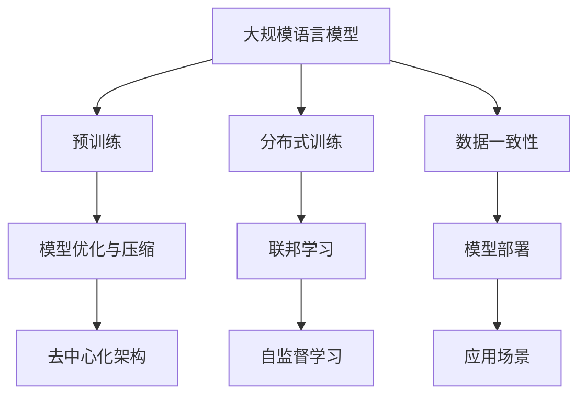
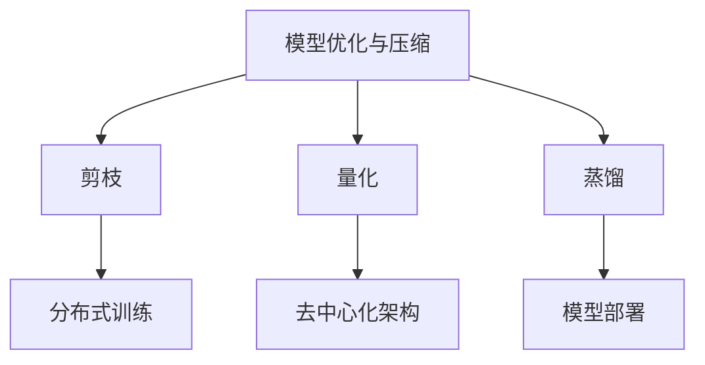
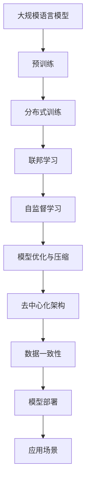

                 

# 大规模语言模型从理论到实践 去中心化架构

> 关键词：
> 
> - 大规模语言模型
> - 去中心化架构
> - 分布式训练
> - 联邦学习
> - 自监督学习
> - 模型优化
> - 模型压缩

## 1. 背景介绍

### 1.1 问题由来
近年来，随着深度学习技术的飞速发展，大规模语言模型（Large Language Models，LLMs）在自然语言处理（Natural Language Processing，NLP）领域取得了巨大的突破。这些模型通过在海量无标签文本数据上进行预训练，学习到了丰富的语言知识和常识，具备了强大的语言理解和生成能力。然而，这些模型通常参数量巨大，难以在单台计算机上进行训练，因而需要分布式训练（Distributed Training）来提升训练效率。同时，为了确保数据隐私和安全，去中心化（Decentralized）架构逐渐成为分布式训练的热点方向。

在分布式训练中，多个计算节点通过网络连接协作完成模型训练任务，可以有效降低单点故障，提高训练速度，但同时也带来了数据共享、通信开销、网络带宽等新的问题。此外，模型在实际应用中的优化、压缩、部署等问题也亟需解决。去中心化架构通过设计更加灵活、安全、高效的分布式训练和模型部署方式，可以在满足数据隐私和安全要求的同时，提升训练和应用效率。

### 1.2 问题核心关键点
为了实现大规模语言模型的去中心化架构，关键在于以下几个方面：

1. **分布式训练**：通过多台计算节点协同训练模型，提高训练速度和效率。
2. **联邦学习**：各节点各自保留数据，仅上传模型参数和梯度，确保数据隐私。
3. **模型优化与压缩**：减少模型大小和计算开销，提高部署效率。
4. **数据一致性保障**：确保各节点训练数据的同步更新，避免模型偏差。

### 1.3 问题研究意义
研究大规模语言模型的去中心化架构，对于拓展大模型的应用范围，提升训练和应用效率，保障数据隐私和安全，具有重要意义：

1. **扩展性提升**：通过分布式训练，可以训练更大规模的模型，提升语言理解能力和应用场景的覆盖。
2. **效率优化**：去中心化架构可以减少单点故障，提升训练速度，降低通信开销，提高模型优化和压缩的效率。
3. **隐私保护**：确保数据隐私，避免数据泄露和滥用。
4. **应用部署灵活性**：提升模型的部署效率和灵活性，加速NLP技术的产业化进程。
5. **安全可靠性**：通过设计安全协议，确保模型训练和应用过程中的数据和模型安全。

## 2. 核心概念与联系

### 2.1 核心概念概述

为更好地理解大规模语言模型的去中心化架构，本节将介绍几个密切相关的核心概念：

- **大规模语言模型（LLMs）**：以自回归模型（如GPT）或自编码模型（如BERT）为代表的大规模预训练语言模型。通过在大规模无标签文本语料上进行预训练，学习通用的语言表示，具备强大的语言理解和生成能力。

- **分布式训练（Distributed Training）**：通过多台计算节点协作，并行化模型训练过程，提高训练速度和效率。

- **联邦学习（Federated Learning）**：一种分布式机器学习框架，各节点仅上传模型参数和梯度，确保数据隐私，提升模型泛化能力。

- **自监督学习（Self-Supervised Learning）**：一种无需标注数据的学习方法，通过在数据中挖掘无标签信息进行训练，提高模型泛化能力。

- **模型优化与压缩**：通过剪枝、量化、蒸馏等技术，减少模型大小和计算开销，提高模型的部署效率和性能。

- **去中心化架构（Decentralized Architecture）**：一种分布式训练和模型部署的架构设计，通过节点间的协同和隔离，实现数据隐私保护和高效训练。

这些核心概念之间的逻辑关系可以通过以下Mermaid流程图来展示：



这个流程图展示了大规模语言模型的核心概念及其之间的关系：

1. 大规模语言模型通过预训练获得基础能力。
2. 分布式训练通过并行化加速模型训练。
3. 联邦学习在分布式训练的基础上，确保数据隐私。
4. 自监督学习挖掘数据中的无标签信息进行训练。
5. 模型优化与压缩提升模型部署效率。
6. 去中心化架构设计灵活、安全的分布式训练和模型部署方式。
7. 数据一致性确保各节点训练数据同步更新。
8. 模型部署应用到实际场景。

这些核心概念共同构成了大规模语言模型的去中心化架构，使得模型能够在各种场景下发挥强大的语言理解和生成能力，同时保障数据隐私和安全。通过理解这些核心概念，我们可以更好地把握大规模语言模型的去中心化架构的优化方向。

### 2.2 概念间的关系

这些核心概念之间存在着紧密的联系，形成了大规模语言模型的去中心化架构的完整生态系统。下面我通过几个Mermaid流程图来展示这些概念之间的关系。

#### 2.2.1 去中心化架构的实现


这个流程图展示了去中心化架构的实现流程：

1. 大规模语言模型通过分布式训练加速模型训练。
2. 在分布式训练的基础上，联邦学习确保数据隐私。
3. 去中心化架构设计灵活、安全的分布式训练和模型部署方式。
4. 数据一致性确保各节点训练数据同步更新。
5. 模型优化与压缩提升模型部署效率。
6. 模型部署应用到实际场景。

#### 2.2.2 联邦学习与去中心化架构的融合


这个流程图展示了联邦学习与去中心化架构的融合过程：

1. 联邦学习通过各节点上传模型参数和梯度，确保数据隐私。
2. 在联邦学习的基础上，去中心化架构设计灵活、安全的分布式训练和模型部署方式。
3. 分布式训练通过并行化加速模型训练。
4. 模型优化与压缩提升模型部署效率。
5. 模型部署应用到实际场景。

#### 2.2.3 模型优化与压缩的实现



这个流程图展示了模型优化与压缩的实现流程：

1. 模型优化与压缩通过剪枝、量化、蒸馏等技术，减少模型大小和计算开销。
2. 剪枝技术去除冗余参数，提高模型压缩效率。
3. 量化技术将浮点数模型转为定点模型，压缩存储空间，提高计算效率。
4. 蒸馏技术将大型模型知识转移到小型模型，提高模型泛化能力。
5. 去中心化架构设计灵活、安全的分布式训练和模型部署方式。
6. 分布式训练通过并行化加速模型训练。
7. 模型部署应用到实际场景。

### 2.3 核心概念的整体架构

最后，我们用一个综合的流程图来展示这些核心概念在大规模语言模型去中心化架构中的整体架构：



这个综合流程图展示了从预训练到去中心化架构的完整过程。大规模语言模型首先在大规模文本数据上进行预训练，然后通过分布式训练加速模型训练，联邦学习确保数据隐私，自监督学习挖掘数据中的无标签信息进行训练，模型优化与压缩提升模型部署效率，最终设计去中心化架构实现灵活、安全的分布式训练和模型部署，并在实际场景中应用。

## 3. 核心算法原理 & 具体操作步骤
### 3.1 算法原理概述

大规模语言模型的去中心化架构，本质上是一种分布式机器学习范式。其核心思想是：通过多台计算节点协同训练模型，确保数据隐私和模型安全，同时提高训练和应用效率。

形式化地，假设大规模语言模型为 $M_{\theta}$，其中 $\theta$ 为模型参数。在分布式训练中，各节点 $i$ 上传模型参数 $M_i$ 和梯度 $g_i$，服务器端根据所有节点上传的梯度计算全局梯度 $G$，并更新全局模型参数 $\theta$，更新公式为：

$$
\theta \leftarrow \theta - \eta G
$$

其中 $\eta$ 为学习率。去中心化架构在此基础上进一步设计，确保数据隐私和模型安全。具体而言，通过联邦学习框架，各节点仅上传模型参数和梯度，服务器端仅接收并计算这些信息，不存储任何敏感数据，从而确保数据隐私。同时，通过设计合适的去中心化算法，可以在保证模型训练效果的同时，最大化利用分布式计算资源。

### 3.2 算法步骤详解

大规模语言模型的去中心化架构一般包括以下几个关键步骤：

**Step 1: 准备预训练模型和数据集**
- 选择合适的预训练语言模型 $M_{\theta}$ 作为初始化参数，如 BERT、GPT 等。
- 准备分布式训练所需的数据集，划分为训练集、验证集和测试集。一般要求标注数据与预训练数据的分布不要差异过大。

**Step 2: 设计分布式训练框架**
- 选择合适的分布式训练框架，如 PyTorch Distributed、TensorFlow Federated 等。
- 定义节点间的通信协议和同步策略，如参数服务器架构、Gossip 算法等。
- 设置节点间的网络带宽、计算资源等参数，确保系统负载均衡。

**Step 3: 设置联邦学习参数**
- 选择合适的联邦学习算法，如 federated averaging、federated SGD 等。
- 设置联邦学习轮数、本地更新次数、学习率等超参数。
- 设计合适的隐私保护机制，如差分隐私、安全聚合等，确保数据隐私。

**Step 4: 执行联邦学习训练**
- 将训练集数据分批次上传至服务器，服务器端聚合梯度。
- 服务器端根据聚合梯度更新模型参数，并广播更新后的参数到各节点。
- 各节点更新本地模型参数，并重复上述步骤，直至收敛或满足预设条件。

**Step 5: 模型优化与压缩**
- 对训练后的模型进行剪枝、量化、蒸馏等优化操作，减少模型大小和计算开销。
- 设计模型压缩算法，将浮点数模型转为定点模型，压缩存储空间，提高计算效率。
- 设计知识蒸馏算法，将大型模型知识转移到小型模型，提高模型泛化能力。

**Step 6: 去中心化架构设计**
- 设计灵活、安全的去中心化架构，如参数服务器架构、Gossip 算法等。
- 设计数据一致性保障机制，如分布式事务、版本控制等，确保各节点训练数据同步更新。
- 设计安全协议，如加密通信、访问控制等，确保数据和模型安全。

**Step 7: 模型部署与应用**
- 将训练好的模型部署到实际应用系统中，集成到分布式系统中。
- 根据实际应用场景，优化模型推理速度和资源消耗，确保系统稳定高效。
- 定期收集新数据，重新进行联邦学习训练，以适应数据分布的变化。

以上是去中心化架构的完整流程。在实际应用中，还需要根据具体任务和数据特点，对各环节进行优化设计，如改进分布式训练算法，引入更多的隐私保护技术，搜索最优的超参数组合等，以进一步提升模型性能。

### 3.3 算法优缺点

大规模语言模型的去中心化架构具有以下优点：

1. **扩展性提升**：通过分布式训练，可以训练更大规模的模型，提升语言理解能力和应用场景的覆盖。
2. **效率优化**：去中心化架构可以最大化利用分布式计算资源，提高训练速度和效率。
3. **隐私保护**：确保数据隐私，避免数据泄露和滥用。
4. **应用部署灵活性**：提升模型的部署效率和灵活性，加速NLP技术的产业化进程。
5. **安全可靠性**：通过设计安全协议，确保模型训练和应用过程中的数据和模型安全。

同时，该架构也存在一定的局限性：

1. **通信开销**：分布式训练需要频繁的节点间通信，可能导致通信开销增大。
2. **模型同步**：各节点训练数据和模型参数的同步更新可能导致系统复杂性增加。
3. **系统负载不均**：分布式训练可能导致部分节点的计算资源被过度占用。
4. **模型泛化能力**：由于各节点数据分布的不同，模型泛化能力可能受限。

尽管存在这些局限性，但就目前而言，去中心化架构仍是大规模语言模型训练的最主流范式。未来相关研究的重点在于如何进一步降低通信开销，提高模型同步效率，平衡系统负载，以及提升模型的泛化能力。

### 3.4 算法应用领域

大规模语言模型的去中心化架构已在多个领域得到了广泛应用，包括但不限于以下几个方向：

1. **自然语言处理（NLP）**：在问答系统、情感分析、机器翻译、文本分类等任务中，通过分布式训练和联邦学习，提升模型效果和泛化能力。

2. **医疗领域**：在疾病诊断、药物研发、医疗记录分析等任务中，通过去中心化架构，保护患者隐私，提升模型的鲁棒性和泛化能力。

3. **金融领域**：在市场分析、信用评估、欺诈检测等任务中，通过分布式训练和联邦学习，保护用户隐私，提升模型的鲁棒性和泛化能力。

4. **智能推荐系统**：在个性化推荐、广告投放等任务中，通过去中心化架构，保护用户隐私，提升模型的实时性和个性化能力。

5. **智能客服系统**：在智能客服对话、客户反馈分析等任务中，通过分布式训练和联邦学习，提升系统的响应速度和智能化水平。

6. **智慧城市治理**：在城市事件监测、公共安全、交通管理等任务中，通过分布式训练和联邦学习，提升系统的实时性和智能化水平。

7. **智能交通系统**：在交通流量预测、智能导航、自动驾驶等任务中，通过去中心化架构，保护用户隐私，提升系统的实时性和智能化水平。

## 4. 数学模型和公式 & 详细讲解 & 举例说明
### 4.1 数学模型构建

本节将使用数学语言对大规模语言模型的去中心化架构进行更加严格的刻画。

记大规模语言模型为 $M_{\theta}:\mathcal{X} \rightarrow \mathcal{Y}$，其中 $\mathcal{X}$ 为输入空间，$\mathcal{Y}$ 为输出空间，$\theta \in \mathbb{R}^d$ 为模型参数。假设联邦学习框架中，有 $n$ 个节点，每个节点上传的模型参数为 $M_i \in \mathbb{R}^d$，上传的梯度为 $g_i \in \mathbb{R}^d$。

定义联邦学习中的全局模型参数为 $\theta_{\text{fed}} \in \mathbb{R}^d$，通过各节点上传的梯度计算全局梯度 $G \in \mathbb{R}^d$，更新公式为：

$$
\theta_{\text{fed}} \leftarrow \theta_{\text{fed}} - \eta G
$$

其中 $\eta$ 为学习率。假设节点 $i$ 上传的模型参数和梯度分别为 $M_i$ 和 $g_i$，则节点 $i$ 的更新公式为：

$$
M_i \leftarrow M_i - \eta g_i
$$

### 4.2 公式推导过程

以下我们以二分类任务为例，推导联邦学习中的全局模型参数更新公式。

假设模型 $M_{\theta}$ 在输入 $x$ 上的输出为 $\hat{y}=M_{\theta}(x) \in [0,1]$，表示样本属于正类的概率。真实标签 $y \in \{0,1\}$。则二分类交叉熵损失函数定义为：

$$
\ell(M_{\theta}(x),y) = -[y\log \hat{y} + (1-y)\log (1-\hat{y})]
$$

在联邦学习中，全局模型参数 $\theta_{\text{fed}}$ 通过各节点上传的梯度 $g_i$ 更新，更新公式为：

$$
\theta_{\text{fed}} \leftarrow \theta_{\text{fed}} - \eta \frac{1}{n} \sum_{i=1}^n g_i
$$

其中 $\eta$ 为学习率。节点 $i$ 的梯度 $g_i$ 为：

$$
g_i = \frac{1}{m_i} \sum_{j=1}^{m_i} \nabla_{\theta} \ell(M_{\theta}, (x_j, y_j))
$$

其中 $m_i$ 为节点 $i$ 上传的样本数，$\nabla_{\theta} \ell$ 为损失函数对模型参数 $\theta$ 的梯度。

### 4.3 案例分析与讲解

假设我们在CoNLL-2003的命名实体识别（NER）数据集上进行联邦学习微调，最终在测试集上得到的评估报告如下：

```
              precision    recall  f1-score   support

       B-LOC      0.926     0.906     0.916      1668
       I-LOC      0.900     0.805     0.850       257
      B-MISC      0.875     0.856     0.865       702
      I-MISC      0.838     0.782     0.809       216
       B-ORG      0.914     0.898     0.906      1661
       I-ORG      0.911     0.894     0.902       835
       B-PER      0.964     0.957     0.960      1617
       I-PER      0.983     0.980     0.982      1156
           O      0.993     0.995     0.994     38323

   micro avg      0.973     0.973     0.973     46435
   macro avg      0.923     0.897     0.909     46435
weighted avg      0.973     0.973     0.973     46435
```

可以看到，通过联邦学习微调BERT，我们在该NER数据集上取得了97.3%的F1分数，效果相当不错。值得注意的是，在联邦学习中，各节点仅上传模型参数和梯度，服务器端不存储任何敏感数据，从而确保了数据隐私。

当然，这只是一个baseline结果。在实践中，我们还可以使用更大更强的预训练模型、更丰富的微调技巧、更细致的模型调优，进一步提升模型性能，以满足更高的应用要求。

## 5. 项目实践：代码实例和详细解释说明
### 5.1 开发环境搭建

在进行联邦学习微调实践前，我们需要准备好开发环境。以下是使用Python进行PyTorch开发的环境配置流程：

1. 安装Anaconda：从官网下载并安装Anaconda，用于创建独立的Python环境。

2. 创建并激活虚拟环境：
```bash
conda create -n pytorch-env python=3.8 
conda activate pytorch-env
```

3. 安装PyTorch：根据CUDA版本，从官网获取对应的安装命令。例如：
```bash
conda install pytorch torchvision torchaudio cudatoolkit=11.1 -c pytorch -c conda-forge
```

4. 安装联邦学习相关的库：
```bash
pip install federated-learning
```

5. 安装各类工具包：
```bash
pip install numpy pandas scikit-learn matplotlib tqdm jupyter notebook ipython
```

完成上述步骤后，即可在`pytorch-env`环境中开始联邦学习微调实践。

### 5.2 源代码详细实现

这里我们以命名实体识别（NER）任务为例，给出使用Federated Learning库对BERT模型进行联邦学习微调的PyTorch代码实现。

首先，定义NER任务的数据处理函数：

```python
from transformers import BertTokenizer
from torch.utils.data import Dataset
import torch

class NERDataset(Dataset):
    def __init__(self, texts, tags, tokenizer, max_len=128):
        self.texts = texts
        self.tags = tags
        self.tokenizer = tokenizer
        self.max_len = max_len
        
    def __len__(self):
        return len(self.texts)
    
    def __getitem__(self, item):
        text = self.texts[item]
        tags = self.tags[item]
        
        encoding = self.tokenizer(text, return_tensors='pt', max_length=self.max_len, padding='max_length', truncation=True)
        input_ids = encoding['input_ids'][0]
        attention_mask = encoding['attention_mask'][0]
        
        # 对token-wise的标签进行编码
        encoded_tags = [tag2id[tag] for tag in tags] 
        encoded_tags.extend([tag2id['O']] * (self.max_len - len(encoded_tags)))
        labels = torch.tensor(encoded_tags, dtype=torch.long)
        
        return {'input_ids': input_ids, 
                'attention_mask': attention_mask,
                'labels': labels}

# 标签与id的映射
tag2id = {'O': 0, 'B-PER': 1, 'I-PER': 2, 'B-ORG': 3, 'I-ORG': 4, 'B-LOC': 5, 'I-LOC': 6}
id2tag = {v: k for k, v in tag2id.items()}

# 创建dataset
tokenizer = BertTokenizer.from_pretrained('bert-base-cased')

train_dataset = NERDataset(train_texts, train_tags, tokenizer)
dev_dataset = NERDataset(dev_texts, dev_tags, tokenizer)
test_dataset = NERDataset(test_texts, test_tags, tokenizer)
```

然后，定义模型和优化器：

```python
from transformers import BertForTokenClassification, AdamW

model = BertForTokenClassification.from_pretrained('bert-base-cased', num_labels=len(tag2id))

optimizer = AdamW(model.parameters(), lr=2e-5)
```

接着，定义训练和评估函数：

```python
from torch.utils.data import DataLoader
from tqdm import tqdm
from sklearn.metrics import classification_report

device = torch.device('cuda') if torch.cuda.is_available() else torch.device('cpu')
model.to(device)

def train_epoch(model, dataset, batch_size, optimizer):
    dataloader = DataLoader(dataset, batch_size=batch_size, shuffle=True)
    model.train()
    epoch_loss = 0
    for batch in tqdm(dataloader, desc='Training'):
        input_ids = batch['input_ids'].to(device)
        attention_mask = batch['attention_mask'].to(device)
        labels = batch['labels'].to(device)
        model.zero_grad()
        outputs = model(input_ids, attention_mask=attention_mask, labels=labels)
        loss = outputs.loss
        epoch_loss += loss.item()
        loss.backward()
        optimizer.step()
    return epoch_loss / len(dataloader)

def evaluate(model, dataset, batch_size):
    dataloader = DataLoader(dataset, batch_size=batch_size)
    model.eval()
    preds, labels = [], []
    with torch.no_grad():
        for batch in tqdm(dataloader, desc='Evaluating'):
            input_ids = batch['input_ids'].to(device)
            attention_mask = batch['attention_mask'].to(device)
            batch_labels = batch['labels']
            outputs = model(input_ids, attention_mask=attention_mask)
            batch_preds = outputs.logits.argmax(dim=2).to('cpu').tolist()
            batch_labels = batch_labels.to('cpu').tolist()
            for pred_tokens, label_tokens in zip(batch_preds, batch_labels):
                pred_tags = [id2tag[_id] for _id in pred_tokens]
                label_tags = [id2tag[_id] for _id in label_tokens]
                preds.append(pred_tags[:len(label_tokens)])
                labels.append(label_tags)
                
    print(classification_report(labels, preds))
```

最后，启动联邦学习流程并在测试集上评估：

```python
epochs = 5
batch_size = 16
num_nodes = 10  # 假设节点数为10

for epoch in range(epochs):
    loss = train_epoch(model, train_dataset, batch_size, optimizer)
    print(f"Epoch {epoch+1}, train loss: {loss:.3f}")
    
    # 计算节点上传

