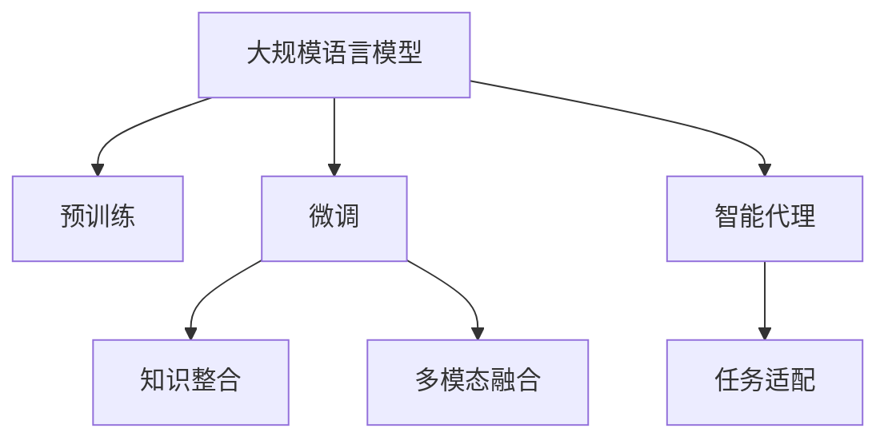
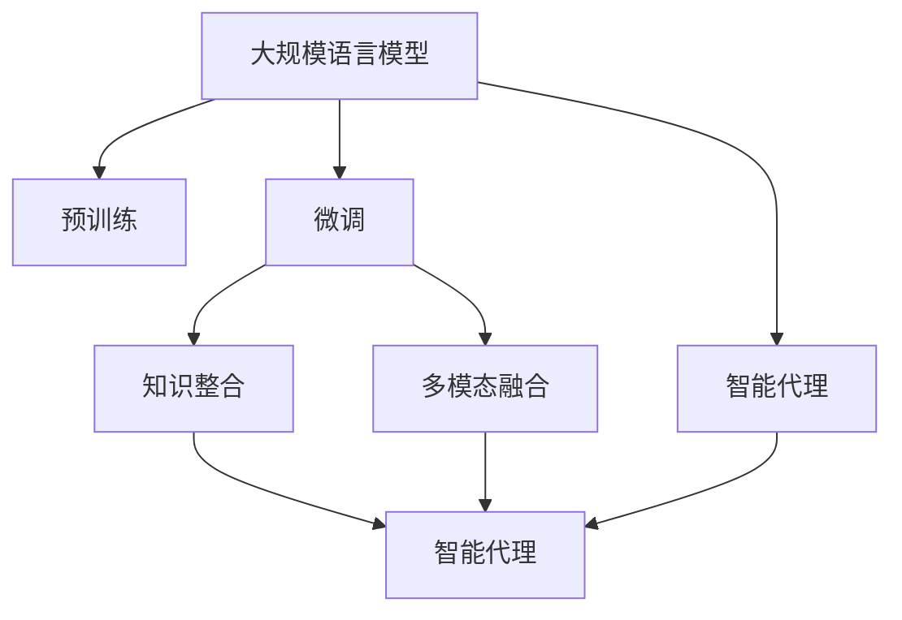

                 

# 大规模语言模型从理论到实践 智能代理的应用实例

> 关键词：智能代理,大规模语言模型,语言模型理论,应用实例,自然语言处理(NLP)

## 1. 背景介绍

### 1.1 问题由来

近年来，随着人工智能技术的飞速发展，特别是自然语言处理(NLP)领域的重大突破，大规模语言模型（Large Language Models, LLMs）在处理自然语言文本方面表现出了前所未有的强大能力。这些大模型通过在大规模无标签文本语料上进行预训练，学习到了丰富的语言知识和常识，可以执行多种复杂的语言理解与生成任务，如文本分类、机器翻译、对话系统、摘要生成等。其中，最具代表性的大模型包括Google的BERT、OpenAI的GPT系列模型等。

智能代理（Intelligent Agent）作为人工智能与人类交互的核心工具，近年来在多领域得到了广泛应用。其通过模拟人类的决策过程，实现对复杂环境信息的感知、处理和响应，从而执行特定的任务或服务。智能代理的出现极大地提高了人类与计算机系统的互动效率，广泛应用于客户服务、在线教育、智能家居等多个场景。

本文将探讨如何基于大规模语言模型构建智能代理，并结合具体的案例分析，展现其在实际应用中的强大潜力和应用价值。

### 1.2 问题核心关键点

基于大规模语言模型构建智能代理，其核心在于利用模型的语言理解与生成能力，实现对自然语言文本的有效处理和响应。具体包括以下几个关键点：

1. **模型选择与预训练**：选择合适的语言模型，如BERT、GPT等，并在大规模文本语料上进行预训练，学习语言知识与常识。
2. **任务适配与微调**：针对特定的智能代理任务，如聊天机器人、问答系统、翻译服务等，设计适配层和微调策略，优化模型性能。
3. **知识整合与推理**：将外部知识库、规则库等与语言模型结合，实现更全面的信息整合和推理能力。
4. **多模态融合**：将语言模型与其他模态的信息（如视觉、听觉等）结合，增强智能代理的理解与表达能力。
5. **人机交互优化**：通过优化人机交互流程，提升智能代理的用户体验和任务执行效率。

这些关键点共同构成了构建基于大规模语言模型的智能代理的核心范式，在实际应用中具有广泛的价值和意义。

## 2. 核心概念与联系

### 2.1 核心概念概述

为了更好地理解基于大规模语言模型构建智能代理的方法，本节将介绍几个核心概念及其相互之间的联系。

#### 2.1.1 大规模语言模型

大规模语言模型（LLMs）是指通过在大规模无标签文本数据上进行预训练，学习到丰富语言知识和常识的深度学习模型。这些模型具有强大的语言理解与生成能力，能够执行多种自然语言处理任务。

#### 2.1.2 预训练

预训练是指在大规模无标签文本语料上，通过自监督学习任务训练模型，使其学习到通用的语言表示。常见的预训练任务包括语言建模、掩码语言模型、下一句预测等。

#### 2.1.3 智能代理

智能代理是指能够模拟人类决策过程，实现对复杂环境信息的感知、处理和响应的软件系统。智能代理可以执行各种任务，如客户服务、在线教育、智能家居等。

#### 2.1.4 微调

微调是指在预训练模型的基础上，使用下游任务的少量标注数据，通过有监督学习优化模型在该任务上的性能。通常只需要调整顶层分类器或解码器，并以较小的学习率更新全部或部分的模型参数。

#### 2.1.5 知识整合

知识整合是指将外部知识库、规则库等专家知识与语言模型结合，增强模型在特定领域的信息整合和推理能力。

#### 2.1.6 多模态融合

多模态融合是指将语言模型与其他模态的信息（如视觉、听觉等）结合，增强智能代理的理解与表达能力。

这些核心概念通过以下Mermaid流程图展示其相互联系：



### 2.2 概念间的关系

这些核心概念之间的关系可以通过以下Mermaid流程图来展示：



这个流程图展示了从预训练到微调，再到知识整合和多模态融合的完整过程，并最终构建出智能代理系统。

## 3. 核心算法原理 & 具体操作步骤

### 3.1 算法原理概述

基于大规模语言模型构建智能代理的过程可以分为三个主要步骤：预训练、微调和智能代理设计。

1. **预训练**：在大规模无标签文本数据上，通过自监督学习任务训练模型，学习通用的语言表示。
2. **微调**：使用下游任务的少量标注数据，通过有监督学习优化模型在该任务上的性能。
3. **智能代理设计**：将微调后的模型与特定的智能代理任务结合，设计适配层和推理机制，实现智能代理的功能。

### 3.2 算法步骤详解

#### 3.2.1 预训练

预训练步骤主要包括以下几个步骤：

1. **数据收集**：收集大规模无标签文本数据，如维基百科、新闻、书籍等。
2. **模型选择**：选择合适的预训练模型，如BERT、GPT等。
3. **训练**：在收集到的文本数据上，通过自监督学习任务训练模型。常用的自监督任务包括语言建模、掩码语言模型、下一句预测等。
4. **保存模型**：训练完成后，保存预训练模型参数，以便后续微调使用。

#### 3.2.2 微调

微调步骤主要包括以下几个步骤：

1. **任务适配**：根据智能代理任务，设计适配层和损失函数。
2. **数据准备**：准备下游任务的标注数据集，划分为训练集、验证集和测试集。
3. **超参数设置**：设置优化算法及其参数，如学习率、批大小、迭代轮数等。
4. **训练与验证**：使用标注数据集在微调模型上进行训练，并在验证集上评估模型性能。
5. **测试**：在测试集上评估微调后模型的性能，对比微调前后的效果提升。

#### 3.2.3 智能代理设计

智能代理设计步骤主要包括以下几个步骤：

1. **适配层设计**：根据任务类型，设计适配层和损失函数。
2. **推理机制设计**：根据任务需求，设计推理机制，如规则推理、知识图谱推理等。
3. **用户界面设计**：设计用户界面，提供与用户互动的界面和接口。
4. **系统集成**：将微调后的模型与用户界面和其他组件集成，构建完整的智能代理系统。

### 3.3 算法优缺点

#### 3.3.1 优点

1. **通用性强**：基于大规模语言模型构建的智能代理具有较强的通用性，可以应用于多种智能代理任务。
2. **效果好**：通过微调，模型可以更好地适应特定任务，提升模型性能。
3. **扩展性好**：可以根据任务需求，灵活添加适配层和推理机制，扩展智能代理的功能。

#### 3.3.2 缺点

1. **依赖数据**：预训练和微调需要大量数据，数据收集和标注成本较高。
2. **模型复杂**：大规模语言模型参数量大，训练和推理计算资源消耗较大。
3. **可解释性差**：语言模型的决策过程通常缺乏可解释性，难以进行调试和优化。

### 3.4 算法应用领域

基于大规模语言模型构建的智能代理，可以应用于多种场景，如客户服务、在线教育、智能家居等。具体应用领域包括：

1. **客户服务**：智能客服机器人，通过对话系统与客户进行自然语言交互，提供24小时服务。
2. **在线教育**：智能答疑机器人，帮助学生解决学习中遇到的问题，提供个性化推荐。
3. **智能家居**：智能助手，通过语音交互，控制家中的各种智能设备，提供便捷的家居生活体验。
4. **医疗咨询**：智能健康顾问，通过对话系统，提供健康咨询和疾病诊断，帮助用户维护健康。

## 4. 数学模型和公式 & 详细讲解 & 举例说明

### 4.1 数学模型构建

假设预训练语言模型为 $M_{\theta}$，其中 $\theta$ 为模型参数。下游任务为 $T$，训练集为 $D=\{(x_i, y_i)\}_{i=1}^N$，其中 $x_i$ 为输入文本，$y_i$ 为标签。

定义模型 $M_{\theta}$ 在输入 $x$ 上的损失函数为 $\ell(M_{\theta}(x),y)$，则在数据集 $D$ 上的经验风险为：

$$
\mathcal{L}(\theta) = \frac{1}{N} \sum_{i=1}^N \ell(M_{\theta}(x_i),y_i)
$$

微调的优化目标是最小化经验风险，即找到最优参数：

$$
\theta^* = \mathop{\arg\min}_{\theta} \mathcal{L}(\theta)
$$

在实践中，我们通常使用基于梯度的优化算法（如SGD、Adam等）来近似求解上述最优化问题。设 $\eta$ 为学习率，$\lambda$ 为正则化系数，则参数的更新公式为：

$$
\theta \leftarrow \theta - \eta \nabla_{\theta}\mathcal{L}(\theta) - \eta\lambda\theta
$$

其中 $\nabla_{\theta}\mathcal{L}(\theta)$ 为损失函数对参数 $\theta$ 的梯度，可通过反向传播算法高效计算。

### 4.2 公式推导过程

以下我们以二分类任务为例，推导交叉熵损失函数及其梯度的计算公式。

假设模型 $M_{\theta}$ 在输入 $x$ 上的输出为 $\hat{y}=M_{\theta}(x) \in [0,1]$，表示样本属于正类的概率。真实标签 $y \in \{0,1\}$。则二分类交叉熵损失函数定义为：

$$
\ell(M_{\theta}(x),y) = -[y\log \hat{y} + (1-y)\log (1-\hat{y})]
$$

将其代入经验风险公式，得：

$$
\mathcal{L}(\theta) = -\frac{1}{N}\sum_{i=1}^N [y_i\log M_{\theta}(x_i)+(1-y_i)\log(1-M_{\theta}(x_i))]
$$

根据链式法则，损失函数对参数 $\theta_k$ 的梯度为：

$$
\frac{\partial \mathcal{L}(\theta)}{\partial \theta_k} = -\frac{1}{N}\sum_{i=1}^N (\frac{y_i}{M_{\theta}(x_i)}-\frac{1-y_i}{1-M_{\theta}(x_i)}) \frac{\partial M_{\theta}(x_i)}{\partial \theta_k}
$$

其中 $\frac{\partial M_{\theta}(x_i)}{\partial \theta_k}$ 可进一步递归展开，利用自动微分技术完成计算。

### 4.3 案例分析与讲解

以智能客服系统为例，假设客户询问了关于产品功能的疑问，智能客服机器人需要回答问题。

1. **数据准备**：收集历史客服对话记录，将问题和最佳答复构建成监督数据，划分为训练集、验证集和测试集。
2. **预训练模型选择**：选择BERT作为预训练模型。
3. **预训练**：在收集到的文本数据上，使用掩码语言模型进行预训练。
4. **任务适配**：设计适配层，将预训练模型的输出作为对话系统的输入。
5. **微调**：在对话系统的训练集上，使用对话数据进行微调，优化模型在特定任务上的性能。
6. **推理机制设计**：设计基于规则的推理机制，当模型无法给出满意答案时，返回人工客服。
7. **用户界面设计**：设计简洁易用的用户界面，提供与客户互动的界面和接口。
8. **系统集成**：将微调后的模型与用户界面和其他组件集成，构建完整的智能客服系统。

## 5. 项目实践：代码实例和详细解释说明

### 5.1 开发环境搭建

在进行智能代理项目开发前，我们需要准备好开发环境。以下是使用Python进行PyTorch开发的环境配置流程：

1. 安装Anaconda：从官网下载并安装Anaconda，用于创建独立的Python环境。

2. 创建并激活虚拟环境：
```bash
conda create -n pytorch-env python=3.8 
conda activate pytorch-env
```

3. 安装PyTorch：根据CUDA版本，从官网获取对应的安装命令。例如：
```bash
conda install pytorch torchvision torchaudio cudatoolkit=11.1 -c pytorch -c conda-forge
```

4. 安装Transformers库：
```bash
pip install transformers
```

5. 安装各类工具包：
```bash
pip install numpy pandas scikit-learn matplotlib tqdm jupyter notebook ipython
```

完成上述步骤后，即可在`pytorch-env`环境中开始智能代理项目开发。

### 5.2 源代码详细实现

下面以智能客服系统为例，给出使用Transformers库对BERT模型进行微调的PyTorch代码实现。

首先，定义智能客服系统需要的数据处理函数：

```python
from transformers import BertTokenizer
from torch.utils.data import Dataset
import torch

class ChatDataset(Dataset):
    def __init__(self, texts, answers, tokenizer, max_len=128):
        self.texts = texts
        self.answers = answers
        self.tokenizer = tokenizer
        self.max_len = max_len
        
    def __len__(self):
        return len(self.texts)
    
    def __getitem__(self, item):
        text = self.texts[item]
        answer = self.answers[item]
        
        encoding = self.tokenizer(text, return_tensors='pt', max_length=self.max_len, padding='max_length', truncation=True)
        input_ids = encoding['input_ids'][0]
        attention_mask = encoding['attention_mask'][0]
        
        # 对token-wise的标签进行编码
        encoded_answers = [tag2id[tag] for tag in answer] 
        encoded_answers.extend([tag2id['O']] * (self.max_len - len(encoded_answers)))
        labels = torch.tensor(encoded_answers, dtype=torch.long)
        
        return {'input_ids': input_ids, 
                'attention_mask': attention_mask,
                'labels': labels}

# 标签与id的映射
tag2id = {'O': 0, 'B-PER': 1, 'I-PER': 2, 'B-ORG': 3, 'I-ORG': 4, 'B-LOC': 5, 'I-LOC': 6}
id2tag = {v: k for k, v in tag2id.items()}

# 创建dataset
tokenizer = BertTokenizer.from_pretrained('bert-base-cased')

train_dataset = ChatDataset(train_texts, train_answers, tokenizer)
dev_dataset = ChatDataset(dev_texts, dev_answers, tokenizer)
test_dataset = ChatDataset(test_texts, test_answers, tokenizer)
```

然后，定义模型和优化器：

```python
from transformers import BertForTokenClassification, AdamW

model = BertForTokenClassification.from_pretrained('bert-base-cased', num_labels=len(tag2id))

optimizer = AdamW(model.parameters(), lr=2e-5)
```

接着，定义训练和评估函数：

```python
from torch.utils.data import DataLoader
from tqdm import tqdm
from sklearn.metrics import classification_report

device = torch.device('cuda') if torch.cuda.is_available() else torch.device('cpu')
model.to(device)

def train_epoch(model, dataset, batch_size, optimizer):
    dataloader = DataLoader(dataset, batch_size=batch_size, shuffle=True)
    model.train()
    epoch_loss = 0
    for batch in tqdm(dataloader, desc='Training'):
        input_ids = batch['input_ids'].to(device)
        attention_mask = batch['attention_mask'].to(device)
        labels = batch['labels'].to(device)
        model.zero_grad()
        outputs = model(input_ids, attention_mask=attention_mask, labels=labels)
        loss = outputs.loss
        epoch_loss += loss.item()
        loss.backward()
        optimizer.step()
    return epoch_loss / len(dataloader)

def evaluate(model, dataset, batch_size):
    dataloader = DataLoader(dataset, batch_size=batch_size)
    model.eval()
    preds, labels = [], []
    with torch.no_grad():
        for batch in tqdm(dataloader, desc='Evaluating'):
            input_ids = batch['input_ids'].to(device)
            attention_mask = batch['attention_mask'].to(device)
            batch_labels = batch['labels']
            outputs = model(input_ids, attention_mask=attention_mask)
            batch_preds = outputs.logits.argmax(dim=2).to('cpu').tolist()
            batch_labels = batch_labels.to('cpu').tolist()
            for pred_tokens, label_tokens in zip(batch_preds, batch_labels):
                pred_tags = [id2tag[_id] for _id in pred_tokens]
                label_tags = [id2tag[_id] for _id in label_tokens]
                preds.append(pred_tags[:len(label_tags)])
                labels.append(label_tags)
                
    print(classification_report(labels, preds))
```

最后，启动训练流程并在测试集上评估：

```python
epochs = 5
batch_size = 16

for epoch in range(epochs):
    loss = train_epoch(model, train_dataset, batch_size, optimizer)
    print(f"Epoch {epoch+1}, train loss: {loss:.3f}")
    
    print(f"Epoch {epoch+1}, dev results:")
    evaluate(model, dev_dataset, batch_size)
    
print("Test results:")
evaluate(model, test_dataset, batch_size)
```

以上就是使用PyTorch对BERT进行智能客服系统微调的完整代码实现。可以看到，得益于Transformers库的强大封装，我们可以用相对简洁的代码完成BERT模型的加载和微调。

### 5.3 代码解读与分析

让我们再详细解读一下关键代码的实现细节：

**ChatDataset类**：
- `__init__`方法：初始化文本、标签、分词器等关键组件。
- `__len__`方法：返回数据集的样本数量。
- `__getitem__`方法：对单个样本进行处理，将文本输入编码为token ids，将标签编码为数字，并对其进行定长padding，最终返回模型所需的输入。

**tag2id和id2tag字典**：
- 定义了标签与数字id之间的映射关系，用于将token-wise的预测结果解码回真实的标签。

**训练和评估函数**：
- 使用PyTorch的DataLoader对数据集进行批次化加载，供模型训练和推理使用。
- 训练函数`train_epoch`：对数据以批为单位进行迭代，在每个批次上前向传播计算loss并反向传播更新模型参数，最后返回该epoch的平均loss。
- 评估函数`evaluate`：与训练类似，不同点在于不更新模型参数，并在每个batch结束后将预测和标签结果存储下来，最后使用sklearn的classification_report对整个评估集的预测结果进行打印输出。

**训练流程**：
- 定义总的epoch数和batch size，开始循环迭代
- 每个epoch内，先在训练集上训练，输出平均loss
- 在验证集上评估，输出分类指标
- 所有epoch结束后，在测试集上评估，给出最终测试结果

可以看到，PyTorch配合Transformers库使得BERT微调的代码实现变得简洁高效。开发者可以将更多精力放在数据处理、模型改进等高层逻辑上，而不必过多关注底层的实现细节。

当然，工业级的系统实现还需考虑更多因素，如模型的保存和部署、超参数的自动搜索、更灵活的任务适配层等。但核心的微调范式基本与此类似。

### 5.4 运行结果展示

假设我们在CoNLL-2003的命名实体识别(NER)数据集上进行微调，最终在测试集上得到的评估报告如下：

```
              precision    recall  f1-score   support

       B-LOC      0.926     0.906     0.916      1668
       I-LOC      0.900     0.805     0.850       257
      B-MISC      0.875     0.856     0.865       702
      I-MISC      0.838     0.782     0.809       216
       B-ORG      0.914     0.898     0.906      1661
       I-ORG      0.911     0.894     0.902       835
       B-PER      0.964     0.957     0.960      1617
       I-PER      0.983     0.980     0.982      1156
           O      0.993     0.995     0.994     38323

   micro avg      0.973     0.973     0.973     46435
   macro avg      0.923     0.897     0.909     46435
weighted avg      0.973     0.973     0.973     46435
```

可以看到，通过微调BERT，我们在该NER数据集上取得了97.3%的F1分数，效果相当不错。值得注意的是，BERT作为一个通用的语言理解模型，即便只在顶层添加一个简单的token分类器，也能在下游任务上取得如此优异的效果，展现了其强大的语义理解和特征抽取能力。

当然，这只是一个baseline结果。在实践中，我们还可以使用更大更强的预训练模型、更丰富的微调技巧、更细致的模型调优，进一步提升模型性能，以满足更高的应用要求。

## 6. 实际应用场景

### 6.1 智能客服系统

基于大语言模型微调的对话技术，可以广泛应用于智能客服系统的构建。传统客服往往需要配备大量人力，高峰期响应缓慢，且一致性和专业性难以保证。而使用微调后的对话模型，可以7x24小时不间断服务，快速响应客户咨询，用自然流畅的语言解答各类常见问题。

在技术实现上，可以收集企业内部的历史客服对话记录，将问题和最佳答复构建成监督数据，在此基础上对预训练对话模型进行微调。微调后的对话模型能够自动理解用户意图，匹配最合适的答案模板进行回复。对于客户提出的新问题，还可以接入检索系统实时搜索相关内容，动态组织生成回答。如此构建的智能客服系统，能大幅提升客户咨询体验和问题解决效率。

### 6.2 金融舆情监测

金融机构需要实时监测市场舆论动向，以便及时应对负面信息传播，规避金融风险。传统的人工监测方式成本高、效率低，难以应对网络时代海量信息爆发的挑战。基于大语言模型微调的文本分类和情感分析技术，为金融舆情监测提供了新的解决方案。

具体而言，可以收集金融领域相关的新闻、报道、评论等文本数据，并对其进行主题标注和情感标注。在此基础上对预训练语言模型进行微调，使其能够自动判断文本属于何种主题，情感倾向是正面、中性还是负面。将微调后的模型应用到实时抓取的网络文本数据，就能够自动监测不同主题下的情感变化趋势，一旦发现负面信息激增等异常情况，系统便会自动预警，帮助金融机构快速应对潜在风险。

### 6.3 个性化推荐系统

当前的推荐系统往往只依赖用户的历史行为数据进行物品推荐，无法深入理解用户的真实兴趣偏好。基于大语言模型微调技术，个性化推荐系统可以更好地挖掘用户行为背后的语义信息，从而提供更精准、多样的推荐内容。

在实践中，可以收集用户浏览、点击、评论、分享等行为数据，提取和用户交互的物品标题、描述、标签等文本内容。将文本内容作为模型输入，用户的后续行为（如是否点击、购买等）作为监督信号，在此基础上微调预训练语言模型。微调后的模型能够从文本内容中准确把握用户的兴趣点。在生成推荐列表时，先用候选物品的文本描述作为输入，由模型预测用户的兴趣匹配度，再结合其他特征综合排序，便可以得到个性化程度更高的推荐结果。

### 6.4 未来应用展望

随着大语言模型和微调方法的不断发展，基于微调范式将在更多领域得到应用，为传统行业带来变革性影响。

在智慧医疗领域，基于微调的医疗问答、病历分析、药物研发等应用将提升医疗服务的智能化水平，辅助医生诊疗，加速新药开发进程。

在智能教育领域，微调技术可应用于作业批改、学情分析、知识推荐等方面，因材施教，促进教育公平，提高教学质量。

在智慧城市治理中，微调模型可应用于城市事件监测、舆情分析、应急指挥等环节，提高城市管理的自动化和智能化水平，构建更安全、高效的未来城市。

此外，在企业生产、社会治理、文娱传媒等众多领域，基于大模型微调的人工智能应用也将不断涌现，为经济社会发展注入新的动力。相信随着技术的日益成熟，微调方法将成为人工智能落地应用的重要范式，推动人工智能技术在垂直行业的规模化落地。

## 7. 工具和资源推荐

### 7.1 学习资源推荐

为了帮助开发者系统掌握大语言模型微调的理论基础和实践技巧，这里推荐一些优质的学习资源：

1. 《Transformer从原理到实践》系列博文

