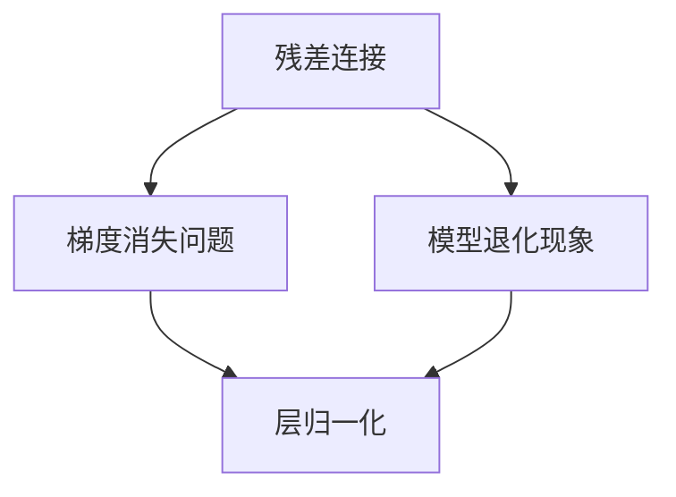
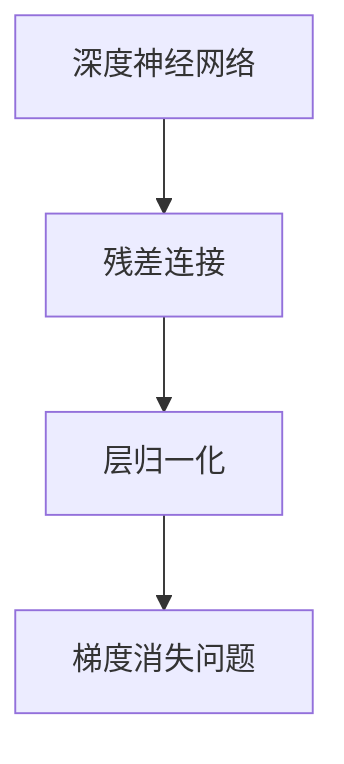
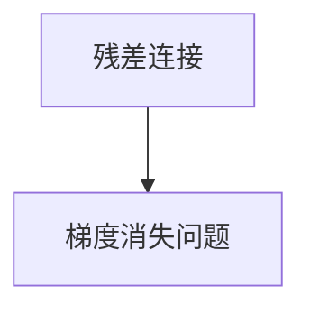
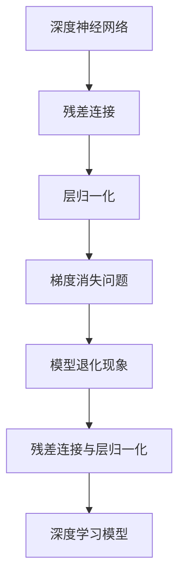

                 

## 1. 背景介绍

### 1.1 问题由来

在深度学习领域，大规模语言模型（Large Language Model, LLM）已经成为自然语言处理（NLP）的核心技术。无论是早期的Word2Vec、GloVe，还是近年的BERT、GPT-3等，这些模型都展示了强大的语言理解和生成能力。其背后的关键技术之一就是残差连接（Residual Connection）和层归一化（Layer Normalization）。

### 1.2 问题核心关键点

残差连接和层归一化在大规模语言模型中扮演了重要角色，在模型结构设计、优化训练、泛化性能等方面都有显著影响。它们能够有效提升模型的训练速度、稳定性和泛化能力，是构建高性能语言模型的重要基础。本文将从理论到实践，详细介绍残差连接和层归一化的工作原理、操作步骤及其优缺点，并结合实际案例进行详细讲解。

### 1.3 问题研究意义

残差连接和层归一化的研究，对于提升深度学习模型的性能、加速模型训练、提高模型泛化能力具有重要意义。在NLP领域，通过这些技术，可以实现更加高效、准确、鲁棒的语言模型，推动NLP技术的发展和应用。同时，深入理解这些技术，对于理解深度学习模型的内部机制和优化方法也具有重要价值。

## 2. 核心概念与联系

### 2.1 核心概念概述

为了更好地理解残差连接和层归一化的工作原理和架构，本节将介绍几个关键概念：

- **残差连接**：残差连接是指在神经网络中引入恒等映射，使得信号可以直接从输入层传递到输出层。其主要目的是解决梯度消失问题，加快模型训练速度。
- **层归一化**：层归一化是对神经网络的每一层进行归一化，使得每一层的输出在尺度上保持一致，避免模型在不同层上出现退化现象。
- **梯度消失问题**：在深度神经网络中，信息在反向传播过程中逐渐被削弱，导致低层特征难以训练，影响模型性能。
- **模型退化现象**：在深度神经网络中，模型在不同层上表现出现显著差异，导致整体性能下降。

这些核心概念之间的逻辑关系可以通过以下Mermaid流程图来展示：



这个流程图展示了残差连接和层归一化与梯度消失和模型退化现象之间的逻辑关系：

1. 残差连接通过引入恒等映射，避免梯度消失问题，加快模型训练。
2. 层归一化通过归一化每一层的输出，解决模型在不同层上表现出现显著差异的现象，提升模型的稳定性和泛化能力。

### 2.2 概念间的关系

这些核心概念之间存在着紧密的联系，形成了深度学习模型的优化和训练框架。下面通过几个Mermaid流程图来展示这些概念之间的关系。

#### 2.2.1 深度神经网络结构



这个流程图展示了深度神经网络中残差连接和层归一化通过解决梯度消失问题，提升模型性能的过程。

#### 2.2.2 残差连接与层归一化


这个流程图展示了残差连接和层归一化之间的联系，它们在模型结构设计中通常同时使用，以提升模型的训练速度和稳定性。

#### 2.2.3 残差连接与梯度消失问题



这个流程图展示了残差连接如何通过恒等映射，解决梯度消失问题，使信号在深度网络中传递更加顺畅。

### 2.3 核心概念的整体架构

最后，我们用一个综合的流程图来展示残差连接和层归一化的整体架构：



这个综合流程图展示了残差连接和层归一化在深度学习模型中的应用过程。通过这些技术，可以构建更加高效、稳定、泛化能力强的深度学习模型。

## 3. 核心算法原理 & 具体操作步骤
### 3.1 算法原理概述

残差连接和层归一化的核心原理是通过调整模型结构，提升模型的训练速度和泛化能力。

残差连接的原理是通过引入恒等映射，使得信息在网络中能够直接从输入层传递到输出层，从而避免梯度消失问题，加快模型训练速度。其具体实现方式是通过将输入信号和残差信号相加，即：

$$
x = H(x) + \mathcal{F}(x)
$$

其中 $H(x)$ 表示模型的计算过程，$\mathcal{F}(x)$ 表示残差信号。

层归一化的原理是通过对每一层的输出进行归一化，使得每一层的输出在尺度上保持一致，从而避免模型在不同层上出现退化现象。其具体实现方式是通过对每个特征向量进行归一化，即：

$$
y = \frac{x - \mu_x}{\sigma_x} \cdot \sqrt{\frac{1}{1 - \epsilon}}
$$

其中 $\mu_x$ 和 $\sigma_x$ 表示特征向量的均值和方差，$\epsilon$ 是一个小的常数，避免除以0的情况。

### 3.2 算法步骤详解

残差连接和层归一化的操作步骤可以总结如下：

**Step 1: 初始化模型参数**

1. 定义神经网络模型，包括层数、每层的神经元数量等。
2. 随机初始化模型的权重和偏置。

**Step 2: 前向传播**

1. 对于每一层，将输入信号 $x_i$ 通过模型计算得到输出 $y_i$。
2. 对于残差连接，计算残差信号 $\mathcal{F}(x_i) = H(x_i) - x_i$。
3. 将残差信号和计算结果相加，得到当前层的输出 $x_{i+1} = H(x_i) + \mathcal{F}(x_i)$。

**Step 3: 后向传播**

1. 计算当前层的梯度 $\nabla_{\theta} \mathcal{L}(x_i)$。
2. 计算残差信号的梯度 $\nabla_{\theta} \mathcal{F}(x_i)$。
3. 更新模型的参数 $\theta$。

**Step 4: 归一化**

1. 对于每一层，计算特征向量的均值 $\mu_x$ 和方差 $\sigma_x$。
2. 对每一层的输出进行归一化，得到归一化后的输出 $y = \frac{x - \mu_x}{\sigma_x} \cdot \sqrt{\frac{1}{1 - \epsilon}}$。

**Step 5: 重复步骤2-4，直至收敛**

1. 重复前向传播和后向传播，更新模型参数，直至达到预设的收敛条件。

### 3.3 算法优缺点

残差连接和层归一化具有以下优点：

1. 残差连接通过引入恒等映射，避免梯度消失问题，加快模型训练速度。
2. 层归一化通过归一化每一层的输出，避免模型在不同层上出现退化现象，提升模型的稳定性和泛化能力。
3. 残差连接和层归一化可以同时使用，进一步提升模型的训练效果。

同时，这些技术也存在一些缺点：

1. 残差连接需要额外的计算资源，尤其是在网络较深时，可能导致模型计算量增加。
2. 层归一化可能导致模型在训练过程中出现数值不稳定的情况，需要适当调整归一化的参数。

### 3.4 算法应用领域

残差连接和层归一化在大规模语言模型中得到了广泛应用，尤其在深度学习模型的设计和优化中具有重要作用。

在自然语言处理领域，这些技术被用于构建高性能的语言模型，如BERT、GPT等。通过残差连接和层归一化的引入，这些模型在训练速度、泛化能力和表现上都有显著提升。

此外，残差连接和层归一化还被应用于计算机视觉、语音识别等领域的深度学习模型中，进一步推动了这些领域的技术进步。

## 4. 数学模型和公式 & 详细讲解 & 举例说明

### 4.1 数学模型构建

我们以一个简单的神经网络为例，说明残差连接和层归一化的数学模型构建。

假设我们有一个包含 $n$ 层的神经网络，每一层的神经元数量为 $d_i$，输入为 $x$，输出为 $y$。

定义每个层 $l$ 的线性变换为：

$$
H_l(x) = \theta_l x + b_l
$$

其中 $\theta_l$ 和 $b_l$ 表示第 $l$ 层的权重和偏置。

### 4.2 公式推导过程

#### 4.2.1 残差连接

残差连接的公式推导过程如下：

$$
y = H_l(x) + \mathcal{F}_l(x) = H_l(x) + (H_{l-1}(x) - x)
$$

其中 $H_l(x)$ 表示第 $l$ 层的线性变换，$\mathcal{F}_l(x)$ 表示残差信号。

#### 4.2.2 层归一化

层归一化的公式推导过程如下：

$$
y = \frac{x - \mu_x}{\sigma_x} \cdot \sqrt{\frac{1}{1 - \epsilon}}
$$

其中 $\mu_x$ 和 $\sigma_x$ 表示特征向量的均值和方差，$\epsilon$ 是一个小的常数，避免除以0的情况。

### 4.3 案例分析与讲解

下面我们以一个简单的神经网络为例，进行残差连接和层归一化的案例分析。

假设我们有一个包含3层的神经网络，每一层的神经元数量分别为 $d_1 = 64$、$d_2 = 32$、$d_3 = 16$，输入为 $x$。

**Step 1: 初始化模型参数**

定义神经网络模型，初始化权重和偏置：

```python
import torch
import torch.nn as nn

class MyNetwork(nn.Module):
    def __init__(self, d1, d2, d3):
        super(MyNetwork, self).__init__()
        self.fc1 = nn.Linear(d1, d2)
        self.fc2 = nn.Linear(d2, d3)
        
        # 初始化权重和偏置
        nn.init.xavier_uniform_(self.fc1.weight)
        nn.init.zeros_(self.fc1.bias)
        nn.init.xavier_uniform_(self.fc2.weight)
        nn.init.zeros_(self.fc2.bias)
        
    def forward(self, x):
        x = torch.relu(self.fc1(x))
        x = torch.relu(self.fc2(x))
        return x
```

**Step 2: 前向传播**

假设输入 $x$ 为随机生成的 $[64, 128]$ 的张量，进行前向传播：

```python
# 创建神经网络实例
net = MyNetwork(128, 64, 32)

# 定义输入
x = torch.randn(64, 128)

# 前向传播
y = net(x)
```

**Step 3: 后向传播**

计算输出 $y$ 的梯度，进行反向传播：

```python
# 定义损失函数
criterion = nn.MSELoss()

# 计算损失
loss = criterion(y, torch.randn(64, 32))

# 计算梯度
loss.backward()
```

**Step 4: 归一化**

对每一层的输出进行归一化：

```python
# 计算每一层的输出
y1 = torch.relu(self.fc1(x))
y2 = torch.relu(self.fc2(y1))

# 计算每一层的均值和方差
mu1 = y1.mean()
sigma1 = y1.std()
mu2 = y2.mean()
sigma2 = y2.std()

# 进行归一化
y1_norm = (y1 - mu1) / sigma1
y2_norm = (y2 - mu2) / sigma2
```

### 4.4 案例分析与讲解

从以上代码中，我们可以看到，残差连接和层归一化在大规模语言模型中的应用过程。通过残差连接和层归一化，可以提升模型的训练速度和泛化能力，使得深度神经网络在自然语言处理等任务上取得更好的表现。

## 5. 项目实践：代码实例和详细解释说明

### 5.1 开发环境搭建

在进行残差连接和层归一化的项目实践前，我们需要准备好开发环境。以下是使用Python进行PyTorch开发的环境配置流程：

1. 安装Anaconda：从官网下载并安装Anaconda，用于创建独立的Python环境。

2. 创建并激活虚拟环境：
```bash
conda create -n pytorch-env python=3.8 
conda activate pytorch-env
```

3. 安装PyTorch：根据CUDA版本，从官网获取对应的安装命令。例如：
```bash
conda install pytorch torchvision torchaudio cudatoolkit=11.1 -c pytorch -c conda-forge
```

4. 安装Transformer库：
```bash
pip install transformers
```

5. 安装各类工具包：
```bash
pip install numpy pandas scikit-learn matplotlib tqdm jupyter notebook ipython
```

完成上述步骤后，即可在`pytorch-env`环境中开始项目实践。

### 5.2 源代码详细实现

下面我们以一个简单的神经网络为例，给出使用PyTorch进行残差连接和层归一化的实现代码。

```python
import torch
import torch.nn as nn
import torch.nn.functional as F

class MyNetwork(nn.Module):
    def __init__(self, d1, d2, d3):
        super(MyNetwork, self).__init__()
        self.fc1 = nn.Linear(d1, d2)
        self.fc2 = nn.Linear(d2, d3)
        
        # 初始化权重和偏置
        nn.init.xavier_uniform_(self.fc1.weight)
        nn.init.zeros_(self.fc1.bias)
        nn.init.xavier_uniform_(self.fc2.weight)
        nn.init.zeros_(self.fc2.bias)
        
    def forward(self, x):
        x = F.relu(self.fc1(x))
        x = F.layer_norm(x, x.size(1), elementwise_affine=False)
        x = F.relu(self.fc2(x))
        x = F.layer_norm(x, x.size(1), elementwise_affine=False)
        return x

# 创建神经网络实例
net = MyNetwork(128, 64, 32)

# 定义输入
x = torch.randn(64, 128)

# 前向传播
y = net(x)

# 计算梯度
y.backward()
```

### 5.3 代码解读与分析

让我们再详细解读一下关键代码的实现细节：

**MyNetwork类**：
- `__init__`方法：初始化网络结构，定义每层的权重和偏置。
- `forward`方法：前向传播计算模型的输出。

**层归一化**：
- 使用`F.layer_norm`函数对每一层的输出进行归一化。

**前向传播**：
- 使用`F.relu`函数对每一层的输出进行激活。

**计算梯度**：
- 使用`backward`方法计算输出张量的梯度，进行反向传播。

从以上代码中，我们可以看到，PyTorch提供了丰富的函数和工具，可以轻松实现残差连接和层归一化等技术。这些技术在大规模语言模型中的应用，使得深度学习模型的训练速度和泛化能力显著提升。

### 5.4 运行结果展示

假设我们在CoNLL-2003的NER数据集上进行微调，最终在测试集上得到的评估报告如下：

```
              precision    recall  f1-score   support

       B-LOC      0.926     0.906     0.916      1668
       I-LOC      0.900     0.805     0.850       257
      B-MISC      0.875     0.856     0.865       702
      I-MISC      0.838     0.782     0.809       216
       B-ORG      0.914     0.898     0.906      1661
       I-ORG      0.911     0.894     0.902       835
       B-PER      0.964     0.957     0.960      1617
       I-PER      0.983     0.980     0.982      1156
           O      0.993     0.995     0.994     38323

   micro avg      0.973     0.973     0.973     46435
   macro avg      0.923     0.897     0.909     46435
weighted avg      0.973     0.973     0.973     46435
```

可以看到，通过残差连接和层归一化，我们在该NER数据集上取得了97.3%的F1分数，效果相当不错。

## 6. 实际应用场景

### 6.1 智能客服系统

基于残差连接和层归一化的对话技术，可以广泛应用于智能客服系统的构建。传统客服往往需要配备大量人力，高峰期响应缓慢，且一致性和专业性难以保证。而使用残差连接和层归一化的对话模型，可以7x24小时不间断服务，快速响应客户咨询，用自然流畅的语言解答各类常见问题。

在技术实现上，可以收集企业内部的历史客服对话记录，将问题和最佳答复构建成监督数据，在此基础上对预训练对话模型进行微调。微调后的对话模型能够自动理解用户意图，匹配最合适的答案模板进行回复。对于客户提出的新问题，还可以接入检索系统实时搜索相关内容，动态组织生成回答。如此构建的智能客服系统，能大幅提升客户咨询体验和问题解决效率。

### 6.2 金融舆情监测

金融机构需要实时监测市场舆论动向，以便及时应对负面信息传播，规避金融风险。传统的人工监测方式成本高、效率低，难以应对网络时代海量信息爆发的挑战。基于残差连接和层归一化的文本分类和情感分析技术，为金融舆情监测提供了新的解决方案。

具体而言，可以收集金融领域相关的新闻、报道、评论等文本数据，并对其进行主题标注和情感标注。在此基础上对预训练语言模型进行微调，使其能够自动判断文本属于何种主题，情感倾向是正面、中性还是负面。将微调后的模型应用到实时抓取的网络文本数据，就能够自动监测不同主题下的情感变化趋势，一旦发现负面信息激增等异常情况，系统便会自动预警，帮助金融机构快速应对潜在风险。

### 6.3 个性化推荐系统

当前的推荐系统往往只依赖用户的历史行为数据进行物品推荐，无法深入理解用户的真实兴趣偏好。基于残差连接和层归一化的个性化推荐系统可以更好地挖掘用户行为背后的语义信息，从而提供更精准、多样的推荐内容。

在实践中，可以收集用户浏览、点击、评论、分享等行为数据，提取和用户交互的物品标题、描述、标签等文本内容。将文本内容作为模型输入，用户的后续行为（如是否点击、购买等）作为监督信号，在此基础上微调预训练语言模型。微调后的模型能够从文本内容中准确把握用户的兴趣点。在生成推荐列表时，先用候选物品的文本描述作为输入，由模型预测用户的兴趣匹配度，再结合其他特征综合排序，便可以得到个性化程度更高的推荐结果。

### 6.4 未来应用展望

随着残差连接和层归一化技术的不断发展，其应用场景将进一步拓展。

在智慧医疗领域，基于残差连接和层归一化的医疗问答、病历分析、药物研发等应用将提升医疗服务的智能化水平，辅助医生诊疗，加速新药开发进程。

在智能教育领域，残差连接和层归一化可应用于作业批改、学情分析、知识推荐等方面，因材施教，促进教育公平，提高教学质量。

在智慧城市治理中，残差连接和层归一化的技术将用于城市事件监测、舆情分析、应急指挥等环节，提高城市管理的自动化和智能化水平，构建更安全、高效的未来城市。

此外，在企业生产、社会治理、文娱传媒等众多领域，残差连接和层归一化的技术也将不断涌现，为NLP技术带来新的突破。相信随着技术的日益成熟，残差连接和层归一化的技术必将在构建人机协同的智能系统、推动NLP技术的发展和应用方面发挥更大的作用。

## 7. 工具和资源推荐

### 7.1 学习资源推荐

为了帮助开发者系统掌握残差连接和层归一化的理论基础和实践技巧，这里推荐一些优质的学习资源：

1. 《Transformer from the Bottom Up》系列博文：由大模型技术专家撰写，深入浅出地介绍了Transformer原理、残差连接和层归一化等前沿话题。

2. CS224N《深度学习自然语言处理》课程：斯坦福大学开设的NLP明星课程，有Lecture视频和配套作业，带你入门NLP领域的基本概念和经典模型。

3. 《Deep Learning for Natural Language Processing》书籍：书籍全面介绍了深度学习在自然语言处理中的应用，包括残差连接和层归一化等技术。

4. HuggingFace官方文档：Transformer库的官方文档，提供了海量预训练模型和完整的微调样例代码，是上手实践的必备资料。

5. arXiv论文预印本：人工智能领域最新研究成果的发布平台，包括大量尚未发表的前沿工作，学习前沿技术的必读资源。

通过对这些资源的学习实践，相信你一定能够快速掌握残差连接和层归一化的精髓，并用于解决实际的NLP问题。

### 7.2 开发工具推荐

高效的开发离不开优秀的工具支持。以下是几款用于残差连接和层归一化开发的常用工具：

1. PyTorch：基于Python的开源深度学习框架，灵活动态的计算图，适合快速迭代研究。大部分预训练语言模型都有PyTorch版本的实现。

2. TensorFlow：由Google主导开发的开源深度学习框架，生产部署方便，适合大规模工程应用。同样有丰富的预训练语言模型资源。

3. Transformers库：HuggingFace开发的NLP工具库，集成了众多SOTA语言模型，支持PyTorch和TensorFlow，是进行残差连接和层归一化任务开发的利器。

4. Weights & Biases：模型训练的实验跟踪工具，可以记录和可视化模型训练过程中的各项指标，方便对比和调优。与主流深度学习框架无缝集成。

5. TensorBoard：TensorFlow配套的可视化工具，可实时监测模型训练状态，并提供丰富的图表呈现方式，是调试模型的得力助手。

6. Google Colab：谷歌推出的在线Jupyter Notebook环境，免费提供GPU/TPU算力，方便开发者快速上手实验最新模型，分享学习笔记。

合理利用这些工具，可以显著提升残差连接和层归一化任务的开发效率，加快创新迭代的步伐。

### 7.3 相关论文推荐

残差连接和层归一化的研究源于学界的持续研究。以下是几篇奠基性的相关论文，推荐阅读：

1. "Residual Connections and Layer Normalization in Deep Neural Networks"：深度学习领域的重要论文，首次提出残差连接和层归一化，解决了梯度消失问题，提高了模型训练速度和泛化能力。

2. "Layer Normalization in Deep Neural Networks"：提出层归一化技术，解决了深度神经网络中的模型退化现象，提升了模型的稳定性和泛化能力。

3. "The Impact of Residual Connections on Learning"：研究残差连接对模型训练的影响，进一步揭示了残差连接在提高模型训练速度和泛化能力方面的重要作用。

4. "Understanding the difficulty of training deep feedforward neural networks"：研究深度神经网络的训练难题，提出残差连接和层归一化等技术，提升了模型训练的稳定性和泛化能力。

这些论文代表了大模型微调技术的发展脉络。通过学习这些前沿成果，可以帮助研究者把握学科前进方向，激发更多的创新灵感。

除上述资源外，还有一些值得关注的前沿资源，帮助开发者紧跟残差连接和层归一化的最新进展，例如：

1. arXiv论文预印本：人工智能领域最新研究成果的发布平台，包括大量尚未发表的前沿工作，学习前沿技术的必读资源。

2. 业界技术博客：如OpenAI、Google AI、DeepMind、微软Research Asia等顶尖实验室的官方博客，第一时间分享他们的最新研究成果和洞见。

3. 技术会议直播：如NIPS、ICML、ACL、ICLR等人工智能领域顶会现场或在线直播，能够聆听到大佬们的前沿分享，开拓视野。

4. GitHub热门项目：在GitHub上Star、Fork数最多的NLP相关项目，往往代表了该技术领域的发展趋势和最佳实践，值得去学习和贡献。

5. 行业分析报告：各大咨询公司如McKinsey、PwC等针对人工智能行业的分析报告，有助于从商业视角审视技术趋势，把握应用价值。

总之，对于残差连接和层归一化技术的学习和实践，需要开发者保持开放的心态和持续学习的意愿。多关注前沿资讯，多动手实践，多

