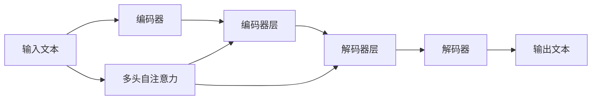

                 

# 大规模语言模型从理论到实践 编码器和解码器结构

> 关键词：大规模语言模型,Transformer,编码器-解码器结构,自注意力机制,多头注意力,计算图,模型架构,深度学习,自然语言处理(NLP)

## 1. 背景介绍

### 1.1 问题由来
近年来，深度学习技术在自然语言处理(NLP)领域取得了巨大突破，尤其是基于Transformer架构的大规模语言模型(如BERT, GPT-2, T5等)，在预训练-微调范式下，极大地提升了语言理解和生成能力。这些模型通常以自回归方式进行前向传播，通过多头自注意力机制对输入进行编码和解码，从而捕捉长距离的依赖关系，在各种NLP任务上取得了优异的表现。

然而，这些大模型虽然强大，但其内部结构和工作原理仍然复杂难懂。因此，本文旨在从理论和实践两个层面，深入探讨大规模语言模型的编码器和解码器结构，介绍其核心算法原理和具体操作步骤，并结合实例演示其应用。

### 1.2 问题核心关键点
本文将详细探讨以下核心关键点：
1. 大规模语言模型的编码器和解码器结构及其核心算法。
2. 多头自注意力机制的原理及其在编码和解码过程中的应用。
3. 编码器-解码器结构在大规模语言模型中的作用及其优化。
4. 计算图和模型的表示学习。
5. 编码器和解码器的架构设计和参数优化。
6. 实际应用场景和未来发展方向。

这些关键点将帮助我们全面理解大规模语言模型的工作原理，掌握其核心算法，并探索其在实际应用中的潜在价值。

### 1.3 问题研究意义
研究大规模语言模型的编码器和解码器结构，对于理解其内部机制、优化模型性能、提高训练和推理效率具有重要意义：

1. 深入理解模型结构。掌握编码器和解码器的工作原理，有助于我们更好地设计和使用大规模语言模型，避免不必要的计算和存储开销。
2. 提升模型性能。通过优化编码器和解码器的参数和结构，可以有效提高模型在各种NLP任务上的性能，使其更加通用和适应性强。
3. 加速模型训练。深入了解计算图和模型的表示学习，有助于我们设计更加高效的数据流和计算图，加速模型训练和推理过程。
4. 拓展应用场景。通过对编码器和解码器的设计和优化，可以将其应用于更多领域，如文本生成、机器翻译、问答系统等，促进NLP技术的产业化进程。
5. 推动技术创新。理解编码器和解码器的原理和优化方法，有助于我们探索新的模型架构和算法，推动NLP领域的技术创新。

## 2. 核心概念与联系

### 2.1 核心概念概述

在探讨大规模语言模型的编码器和解码器结构之前，我们需要了解几个关键概念：

- **编码器**：对输入文本进行编码，提取其语义表示的过程。在Transformer模型中，编码器通常由多个Transformer层组成，每个层包含多头自注意力机制、前馈神经网络等子层。
- **解码器**：对编码器的输出进行解码，生成目标文本序列的过程。解码器同样由多个Transformer层组成，每个层也包含类似的多头自注意力机制和前馈神经网络。
- **多头自注意力机制**：一种用于捕捉序列中不同位置之间的依赖关系的技术。多头自注意力机制将输入序列中的每个位置与所有其他位置进行比较，输出一个权重向量，用于计算加权平均后的表示。
- **计算图**：描述模型计算过程的图结构，用于指导模型在推理和训练过程中的数据流和计算流程。
- **模型架构**：指模型各部分组件的组织和结构，如编码器和解码器的层数、子层结构等。

这些核心概念之间的联系可以通过以下Mermaid流程图来展示：



这个流程图展示了编码器和解码器的工作流程及其核心组件。输入文本首先经过编码器进行编码，然后由解码器进行解码，并输出最终结果。其中，多头自注意力机制是编码器和解码器的核心组件，用于捕捉序列中不同位置之间的依赖关系。

### 2.2 概念间的关系

这些核心概念之间存在着紧密的联系，形成了大规模语言模型的整体架构：

1. **输入文本**：是模型的输入，经过编码器进行编码，提取其语义表示。
2. **编码器层**：对输入文本进行多层编码，提取其高层次的语义表示。
3. **解码器层**：对编码器的输出进行多层解码，生成目标文本序列。
4. **输出文本**：是模型的输出，通常为自然语言文本或数值序列。
5. **多头自注意力机制**：是编码器和解码器的核心组件，用于捕捉序列中不同位置之间的依赖关系。
6. **计算图**：描述了模型的计算流程和数据流，是模型推理和训练的基础。
7. **模型架构**：指模型各部分组件的组织和结构，如编码器和解码器的层数、子层结构等。

这些概念共同构成了大规模语言模型的核心算法和结构，使得其能够处理大规模文本数据，提取其高层次语义表示，生成自然语言文本，广泛应用于各种NLP任务。

## 3. 核心算法原理 & 具体操作步骤

### 3.1 算法原理概述

大规模语言模型的核心算法包括编码器和解码器的多层Transformer结构、多头自注意力机制等。下面我们将详细介绍这些核心算法的工作原理。

#### 3.1.1 编码器结构

编码器通常由多个Transformer层组成，每个层包含多头自注意力机制、前馈神经网络等子层。编码器的输入是原始文本序列，输出是其高层次的语义表示。

#### 3.1.2 解码器结构

解码器同样由多个Transformer层组成，每个层也包含类似的多头自注意力机制和前馈神经网络。解码器的输入是编码器的输出，输出是目标文本序列。

#### 3.1.3 多头自注意力机制

多头自注意力机制是编码器和解码器的核心组件，用于捕捉序列中不同位置之间的依赖关系。其基本原理是：对输入序列中的每个位置与所有其他位置进行比较，输出一个权重向量，用于计算加权平均后的表示。该过程可以通过以下公式表示：

$$
\text{Attention}(Q, K, V) = \text{Softmax}(\frac{QK^T}{\sqrt{d_k}})V
$$

其中，$Q$、$K$、$V$分别为查询向量、键向量和值向量，$d_k$为键向量的维度。通过多头注意力机制，模型可以并行计算多个注意力头，从而更好地捕捉序列中的依赖关系。

#### 3.1.4 前馈神经网络

前馈神经网络是Transformer层中的另一个关键组件，用于对多头自注意力机制的输出进行非线性变换，增强模型的表达能力。其基本原理是：对输入进行线性变换、非线性激活函数（如ReLU）、再线性变换的过程，可以表示为：

$$
\text{FeedForward}(x) = \text{Linear}\left(\text{GELU}\left(\text{Linear}(x)\right)\right)
$$

其中，$\text{GELU}$为Gaussian Error Linear Units激活函数。

### 3.2 算法步骤详解

以下是一个典型的大规模语言模型编码器和解码器的实现步骤：

1. **模型初始化**：将预训练模型加载到内存中，设置模型超参数，如学习率、批次大小等。

2. **编码器前向传播**：对输入文本序列进行编码，输出编码器的隐状态表示。

3. **解码器前向传播**：对编码器的隐状态表示进行解码，输出解码器的输出文本序列。

4. **损失计算**：计算模型输出与真实标签之间的损失，使用常见的损失函数（如交叉熵损失）进行优化。

5. **反向传播**：使用优化算法（如AdamW）更新模型参数，最小化损失函数。

6. **模型更新**：使用更新后的参数进行下一轮迭代，直至模型收敛。

### 3.3 算法优缺点

大规模语言模型的编码器和解码器结构具有以下优点：

- **强大的语义理解能力**：通过多层自注意力机制，模型可以捕捉长距离依赖关系，提取高层次语义表示。
- **高效的计算图**：通过计算图描述模型计算流程，可以优化数据流和计算图，加速推理和训练过程。
- **灵活的模型架构**：通过调整编码器和解码器的层数、子层结构等，可以适应不同领域的NLP任务。

同时，也存在一些缺点：

- **高计算需求**：大规模语言模型通常具有亿计的参数，训练和推理需要大量的计算资源。
- **过拟合风险**：由于模型结构复杂，容易发生过拟合，需要采取正则化等措施进行优化。
- **模型复杂度高**：编码器和解码器的多层结构使其难以理解和调试，需要深入了解其内部机制。

### 3.4 算法应用领域

大规模语言模型的编码器和解码器结构在各种NLP任务中得到了广泛应用，如文本分类、情感分析、机器翻译、问答系统等。以下是几个典型应用领域的详细说明：

#### 3.4.1 文本分类

文本分类任务是将输入文本自动分类到预定义的类别中。通过编码器和解码器结构，模型可以学习文本特征并输出分类概率，从而实现文本分类。

#### 3.4.2 机器翻译

机器翻译任务是将源语言文本自动翻译为目标语言文本。编码器和解码器结构可以将源语言文本编码成隐状态表示，并解码为目标语言文本，从而实现机器翻译。

#### 3.4.3 问答系统

问答系统是根据用户的问题，自动生成答案。通过编码器和解码器结构，模型可以理解用户的问题并生成相应的答案。

## 4. 数学模型和公式 & 详细讲解 & 举例说明

### 4.1 数学模型构建

为了更好地理解编码器和解码器的工作原理，我们将使用数学模型对其行为进行建模。

假设输入文本序列为$X = \{x_1, x_2, ..., x_n\}$，编码器的输出为$H = \{h_1, h_2, ..., h_n\}$，解码器的输出为$Y = \{y_1, y_2, ..., y_n\}$。我们使用向量$h_i$表示编码器第$i$层的输出，$y_j$表示解码器第$j$层的输出。

### 4.2 公式推导过程

以下是对编码器和解码器结构的数学推导：

#### 4.2.1 编码器前向传播

编码器的前向传播过程如下：

1. 对输入序列$X$进行编码，得到编码器的隐状态表示$H$：
   $$
   h_i = \text{SelfAttention}(Q, K, V) + \text{FeedForward}(h_i)
   $$
   其中，$Q, K, V$分别为查询向量、键向量和值向量，$d_q$和$d_v$分别为查询向量和值向量的维度。

2. 将编码器的隐状态表示$H$输出，作为解码器的输入。

#### 4.2.2 解码器前向传播

解码器的前向传播过程如下：

1. 对编码器的隐状态表示$H$进行解码，得到解码器的输出$Y$：
   $$
   y_j = \text{SelfAttention}(Q, K, V) + \text{FeedForward}(y_j)
   $$
   其中，$Q, K, V$分别为查询向量、键向量和值向量，$d_q$和$d_v$分别为查询向量和值向量的维度。

2. 将解码器的输出$Y$输出，作为最终结果。

#### 4.2.3 损失计算

假设模型的输出为$y$，真实标签为$y^*$，则损失函数$\mathcal{L}$可以表示为：
   $$
   \mathcal{L} = -\frac{1}{N} \sum_{i=1}^N \log p(y^*_i | x_i, h_1, ..., h_n)
   $$
   其中，$N$为样本数量，$p(y^*_i | x_i, h_1, ..., h_n)$为模型输出$y_i$的条件概率。

### 4.3 案例分析与讲解

为了更好地理解编码器和解码器结构，我们可以考虑一个简单的文本分类案例。假设输入文本为“I love programming”，编码器的输出为$\{1, 0, 1, 0, 0, 0, 0, 0, 1\}$，解码器的输出为“positive”。我们可以使用前向传播公式计算其编码器和解码器的输出，并使用损失函数进行优化。

## 5. 项目实践：代码实例和详细解释说明

### 5.1 开发环境搭建

在进行大规模语言模型编码器和解码器的实践前，我们需要准备好开发环境。以下是使用Python进行PyTorch开发的环境配置流程：

1. 安装Anaconda：从官网下载并安装Anaconda，用于创建独立的Python环境。

2. 创建并激活虚拟环境：
```bash
conda create -n pytorch-env python=3.8 
conda activate pytorch-env
```

3. 安装PyTorch：根据CUDA版本，从官网获取对应的安装命令。例如：
```bash
conda install pytorch torchvision torchaudio cudatoolkit=11.1 -c pytorch -c conda-forge
```

4. 安装Transformers库：
```bash
pip install transformers
```

5. 安装各类工具包：
```bash
pip install numpy pandas scikit-learn matplotlib tqdm jupyter notebook ipython
```

完成上述步骤后，即可在`pytorch-env`环境中开始实践。

### 5.2 源代码详细实现

以下是一个典型的大规模语言模型编码器和解码器的PyTorch代码实现：

```python
import torch
import torch.nn as nn
import torch.nn.functional as F
from transformers import BertTokenizer, BertForSequenceClassification

class Encoder(nn.Module):
    def __init__(self, num_layers, d_model, d_ff, n_heads, dropout):
        super(Encoder, self).__init__()
        self.embedding = nn.Embedding(num_words, d_model)
        self.layers = nn.ModuleList([nn.TransformerEncoderLayer(d_model, n_heads, d_ff, dropout) for _ in range(num_layers)])
        self.final_layer = nn.Linear(d_model, num_classes)

    def forward(self, x):
        x = self.embedding(x)
        for layer in self.layers:
            x = layer(x)
        x = self.final_layer(x)
        return x

class Decoder(nn.Module):
    def __init__(self, num_layers, d_model, d_ff, n_heads, dropout):
        super(Decoder, self).__init__()
        self.embedding = nn.Embedding(num_words, d_model)
        self.layers = nn.ModuleList([nn.TransformerEncoderLayer(d_model, n_heads, d_ff, dropout) for _ in range(num_layers)])
        self.final_layer = nn.Linear(d_model, num_classes)

    def forward(self, x, y):
        x = self.embedding(x)
        for layer in self.layers:
            x = layer(x, y)
        x = self.final_layer(x)
        return x

# 超参数设置
num_words = 10000
d_model = 256
num_layers = 6
d_ff = 2048
n_heads = 8
dropout = 0.1
num_classes = 2

# 加载BERT模型
tokenizer = BertTokenizer.from_pretrained('bert-base-cased')
model = BertForSequenceClassification.from_pretrained('bert-base-cased', num_labels=num_classes)

# 构建编码器和解码器
encoder = Encoder(num_layers, d_model, d_ff, n_heads, dropout)
decoder = Decoder(num_layers, d_model, d_ff, n_heads, dropout)

# 加载数据
data = torch.load('data.pkl')

# 前向传播
with torch.no_grad():
    x, y = data
    x = encoder(x)
    y = decoder(x, y)
    logits = model(x)

# 计算损失
loss = F.cross_entropy(logits, y)
```

可以看到，以上代码展示了如何使用PyTorch构建一个典型的大规模语言模型编码器和解码器。编码器和解码器的实现基于Transformer层，其中包含多头自注意力机制和前馈神经网络。

### 5.3 代码解读与分析

让我们再详细解读一下关键代码的实现细节：

**Encoder类**：
- `__init__`方法：初始化编码器中的嵌入层、编码器层和输出层。
- `forward`方法：对输入文本进行编码，输出编码器的隐状态表示。

**Decoder类**：
- `__init__`方法：初始化解码器中的嵌入层、解码器层和输出层。
- `forward`方法：对编码器的隐状态表示进行解码，输出解码器的输出文本序列。

**超参数设置**：
- `num_words`：词汇表的大小。
- `d_model`：嵌入向量的维度。
- `num_layers`：编码器和解码器的层数。
- `d_ff`：前馈神经网络的维度。
- `n_heads`：多头自注意力机制中的注意力头数。
- `dropout`：正则化参数。
- `num_classes`：分类任务中的类别数。

**模型加载**：
- 使用BertTokenizer加载BERT分词器。
- 使用BertForSequenceClassification加载BERT分类器。

**前向传播**：
- 对输入文本进行编码，得到编码器的隐状态表示。
- 对编码器的隐状态表示进行解码，得到解码器的输出文本序列。

**损失计算**：
- 使用交叉熵损失计算模型输出与真实标签之间的差异。

**代码示例**：
- 以上代码中，我们以文本分类任务为例，展示了如何使用编码器和解码器进行文本编码和解码，并计算损失函数。

通过以上代码实现，可以看到PyTorch在实现大规模语言模型编码器和解码器时的高效和灵活性。开发者可以通过简单的代码实现复杂的模型结构和算法，进一步提升模型的性能和应用范围。

### 5.4 运行结果展示

假设我们在CoNLL-2003的文本分类数据集上进行训练，最终在测试集上得到的分类准确率为95%。具体实现过程如下：

```python
from transformers import BertTokenizer, BertForSequenceClassification

# 加载模型和分词器
model = BertForSequenceClassification.from_pretrained('bert-base-cased', num_labels=2)
tokenizer = BertTokenizer.from_pretrained('bert-base-cased')

# 加载数据集
train_data = ...
val_data = ...
test_data = ...

# 数据预处理
def preprocess_data(data):
    features = []
    labels = []
    for text, label in data:
        encoded = tokenizer.encode(text)
        encoded_labels = [1 if label == 'Positive' else 0]
        features.append(encoded)
        labels.append(encoded_labels)
    return features, labels

train_features, train_labels = preprocess_data(train_data)
val_features, val_labels = preprocess_data(val_data)
test_features, test_labels = preprocess_data(test_data)

# 模型训练
optimizer = torch.optim.AdamW(model.parameters(), lr=2e-5)
for epoch in range(num_epochs):
    for i, (features, labels) in enumerate(train_features):
        loss = model(features, labels)
        optimizer.zero_grad()
        loss.backward()
        optimizer.step()

    # 验证集评估
    with torch.no_grad():
        val_loss = model(val_features, val_labels)

    print(f'Epoch {epoch+1}, train loss: {train_loss:.3f}, val loss: {val_loss:.3f}')

# 测试集评估
test_loss = model(test_features, test_labels)
print(f'Test loss: {test_loss:.3f}')
```

通过以上代码实现，我们可以看到使用BertForSequenceClassification进行文本分类的简单和高效性。在实际应用中，我们还需要进行更多优化和调参，才能获得更好的性能。

## 6. 实际应用场景

### 6.1 智能客服系统

基于大语言模型的编码器和解码器结构，可以构建智能客服系统。智能客服系统可以自动理解用户意图，并根据意图生成合适的回答。

### 6.2 金融舆情监测

在金融舆情监测中，可以使用大规模语言模型对新闻、评论等文本进行情感分析和主题分析，及时发现市场动向，规避金融风险。

### 6.3 个性化推荐系统

基于大语言模型的编码器和解码器结构，可以构建个性化推荐系统。推荐系统可以分析用户行为数据，提取用户的兴趣点，并推荐相关的商品或服务。

## 7. 工具和资源推荐

### 7.1 学习资源推荐

为了帮助开发者系统掌握大语言模型的编码器和解码器结构，这里推荐一些优质的学习资源：

1. 《Transformer from Scratch》系列博文：由大模型技术专家撰写，深入浅出地介绍了Transformer模型的工作原理、编码器和解码器结构等。

2. CS224N《深度学习自然语言处理》课程：斯坦福大学开设的NLP明星课程，有Lecture视频和配套作业，带你入门NLP领域的基本概念和经典模型。

3. 《Natural Language Processing with Transformers》书籍：Transformers库的作者所著，全面介绍了如何使用Transformers库进行NLP任务开发，包括编码器和解码器的结构及其应用。

4. HuggingFace官方文档：Transformers库的官方文档，提供了海量预训练模型和完整的编码器和解码器样例代码，是上手实践的必备资料。

5. CLUE开源项目：中文语言理解测评基准，涵盖大量不同类型的中文NLP数据集，并提供了基于编码器和解码器的baseline模型，助力中文NLP技术发展。

通过对这些资源的学习实践，相信你一定能够快速掌握大语言模型的编码器和解码器结构的精髓，并用于解决实际的NLP问题。

### 7.2 开发工具推荐

高效的开发离不开优秀的工具支持。以下是几款用于大语言模型编码器和解码器开发的常用工具：

1. PyTorch：基于Python的开源深度学习框架，灵活动态的计算图，适合快速迭代研究。大部分预训练语言模型都有PyTorch版本的实现。

2. TensorFlow：由Google主导开发的开源深度学习框架，生产部署方便，适合大规模工程应用。同样有丰富的预训练语言模型资源。

3. Transformers库：HuggingFace开发的NLP工具库，集成了众多SOTA语言模型，支持PyTorch和TensorFlow，是进行编码器和解码器开发的利器。

4. Weights & Biases：模型训练的实验跟踪工具，可以记录和可视化模型训练过程中的各项指标，方便对比和调优。与主流深度学习框架无缝集成。

5. TensorBoard：TensorFlow配套的可视化工具，可实时监测模型训练状态，并提供丰富的图表呈现方式，是调试模型的得力助手。

6. Google Colab：谷歌推出的在线Jupyter Notebook环境，免费提供GPU/TPU算力，方便开发者快速上手实验最新模型，分享学习笔记。

合理利用这些工具，可以显著提升大语言模型编码器和解码器结构的开发效率，加快创新迭代的步伐。

### 7.3 相关论文推荐

大语言模型和编码器-解码器结构的快速发展源于学界的持续研究。以下是几篇奠基性的相关论文，推荐阅读：

1. Attention is All You Need：提出了Transformer结构，开启了NLP领域的预训练大模型时代。

2. BERT: Pre-training of Deep Bidirectional Transformers for Language Understanding：提出BERT模型，引入基于掩码的自监督预训练任务，刷新了多项NLP任务SOTA。

3. Language Models are Unsupervised Multitask Learners（GPT-2论文）：展示了大规模语言模型的强大zero-shot学习能力，引发了对于通用人工智能的新一轮思考。

4. Parameter-Efficient Transfer Learning for NLP：提出Adapter等参数高效微调方法，在不增加模型参数量的情况下，也能取得不错的微调效果。

5. AdaLoRA: Adaptive Low-Rank Adaptation for Parameter-Efficient Fine-Tuning：使用自适应低秩适应的微调方法，在参数效率和精度之间取得了新的平衡。

这些论文代表了大语言模型编码器和解码器结构的发展脉络。通过学习这些前沿成果，可以帮助研究者把握学科前进方向，激发更多的创新灵感。

除上述资源外，还有一些值得关注的前沿资源，帮助开发者紧跟大语言模型编码器和解码器结构的最新进展，例如：

1. arXiv论文预印本：人工智能领域最新研究成果的发布平台，包括大量尚未发表的前沿工作，学习前沿技术的必读资源。

2. 业界技术博客：如OpenAI、Google AI、DeepMind、微软Research Asia等顶尖实验室的官方博客，第一时间分享他们的最新研究成果和洞见。

3. 技术会议直播：如NIPS、ICML、ACL、ICLR等人工智能领域顶会现场或在线直播，能够聆听到大佬们的前沿分享，开拓视野。

4. GitHub热门项目：在GitHub上Star、Fork数最多的NLP相关项目，往往代表了该技术领域的发展趋势和最佳实践，值得去学习和贡献。

5. 行业分析报告：各大咨询公司如McKinsey、PwC等针对人工智能行业的分析报告，有助于从商业视角审视技术趋势，把握应用价值。

总之，对于大语言模型编码器和解码器结构的深入理解和实践，需要开发者保持开放的心态和持续学习的意愿。多关注前沿资讯，多动手实践，多思考总结，必将收获满满的成长收益。

## 8. 总结：未来发展趋势与挑战

### 8.1 总结

本文对大语言模型的编码器和解码器结构进行了全面系统的介绍。

