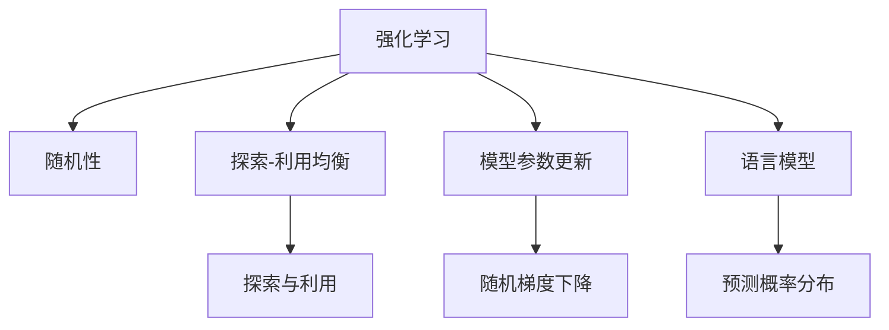
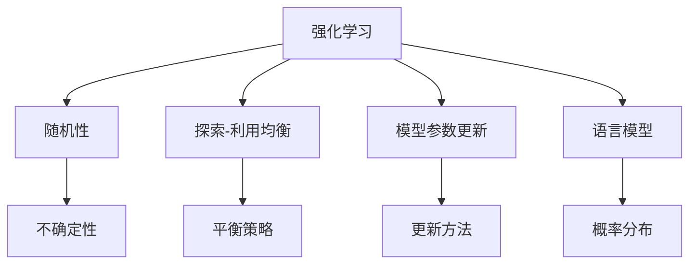
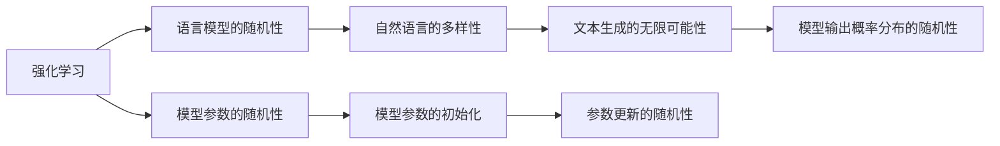
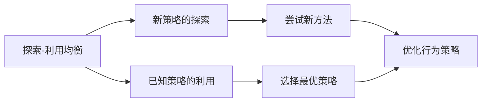
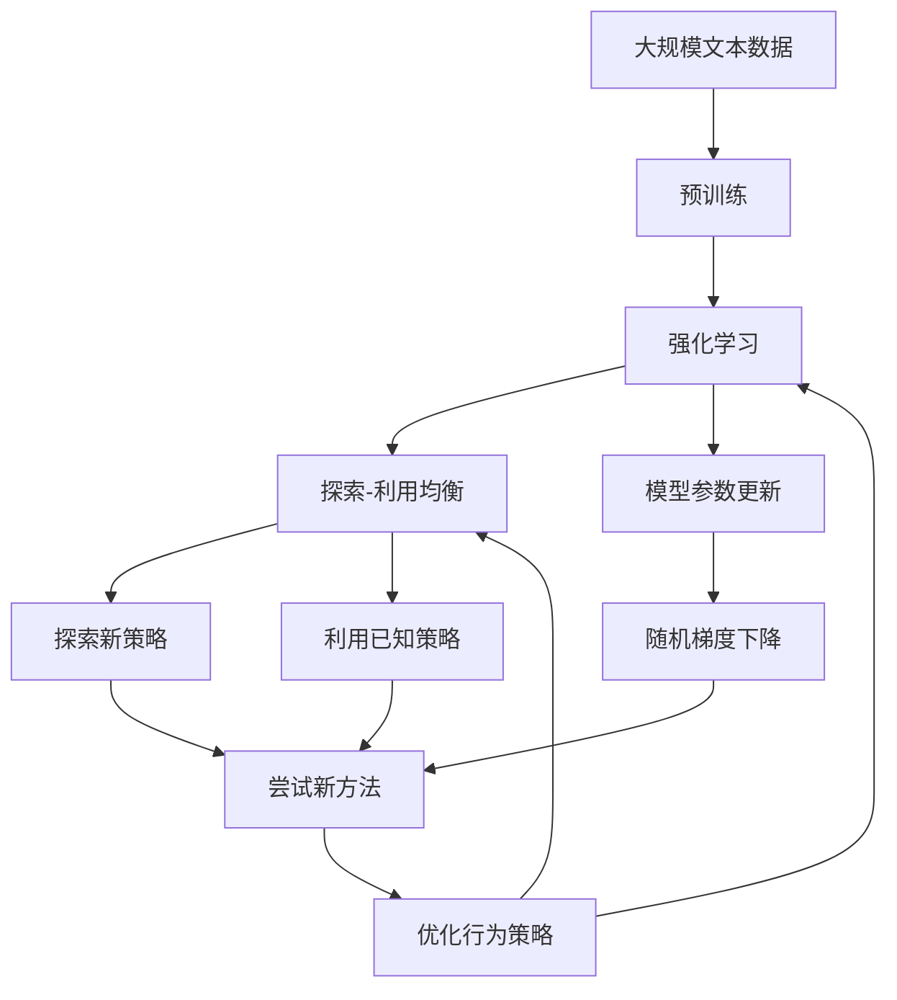

                 

# 大语言模型原理与工程实践：强化学习中的随机性

> 关键词：大语言模型,强化学习,随机性,行为策略,探索-利用均衡

## 1. 背景介绍

### 1.1 问题由来
强化学习（Reinforcement Learning, RL）是人工智能领域的一个核心分支，近年来在自动驾驶、机器人控制、游戏智能、自然语言处理等领域取得了显著进展。其中，基于强化学习的自然语言处理（NLP）技术，通过模拟自然界的交互过程，使模型能够逐步学习最优的决策策略，展现出强大的语言理解与生成能力。

然而，传统的强化学习模型在面对语言任务时，往往依赖于语言理解与生成的随机性，这种随机性使得模型在复杂任务上表现不佳，且难以解释其决策过程。因此，如何在强化学习中引入确定性，使得模型能够更加稳定地学习与执行任务，成为当前研究的热点问题。

### 1.2 问题核心关键点
强化学习中的随机性主要源于两个方面：
1. 语言模型的随机性：自然语言本身具有高度的随机性，模型无法完全掌握语言生成的所有可能性。
2. 模型参数的随机性：现代深度学习模型参数量庞大，训练过程具有随机性，模型输出的概率分布也具有随机性。

强化学习模型通过与环境的交互，利用语言模型和参数的随机性，不断调整自身的行为策略，以期最大化累积奖励。但是，这种随机性可能导致模型在实际应用中表现不稳定，且难以解释其决策过程。

### 1.3 问题研究意义
研究强化学习中的随机性，对于提升语言模型在实际应用中的稳定性、可解释性以及泛化能力具有重要意义。具体而言：
1. 提高模型鲁棒性：减少模型在实际应用中的不确定性，提升模型的鲁棒性和泛化能力。
2. 增强决策透明性：使模型决策过程可解释，便于理解其行为背后的逻辑和动机。
3. 优化参数更新：通过调整模型参数的更新方式，提升模型训练效率和效果。
4. 拓展应用范围：帮助模型更好地适应各种复杂多变的语言任务，拓展其应用范围。

## 2. 核心概念与联系

### 2.1 核心概念概述

为更好地理解强化学习中的随机性问题，本节将介绍几个密切相关的核心概念：

- 强化学习（Reinforcement Learning, RL）：一种通过与环境交互学习最优决策策略的机器学习范式。
- 随机性（Randomness）：强化学习模型和语言模型固有的随机性。
- 探索-利用均衡（Exploration-Exploitation Balance）：强化学习中需要平衡探索未知领域和利用已知最优策略之间的关系。
- 模型参数更新（Model Parameter Update）：强化学习中通过随机梯度下降（SGD）等算法更新模型参数的过程。
- 语言模型（Language Model）：用于预测文本序列概率的模型，包括LSTM、GRU、Transformer等。

这些核心概念之间的逻辑关系可以通过以下Mermaid流程图来展示：



这个流程图展示出了强化学习与随机性、探索-利用均衡以及语言模型之间的关系：

1. 强化学习模型通过随机性探索未知领域，利用已知最优策略，不断调整行为策略。
2. 探索与利用之间需要保持均衡，既要探索新的可能性，又要利用已知的成功经验。
3. 模型参数的更新通过随机梯度下降等方式进行，逐步优化行为策略。
4. 语言模型作为强化学习的核心组件，用于预测文本序列的概率分布，支撑模型行为策略的调整。

### 2.2 概念间的关系

这些核心概念之间存在着紧密的联系，形成了强化学习中的随机性问题的完整生态系统。下面我通过几个Mermaid流程图来展示这些概念之间的关系。

#### 2.2.1 强化学习的核心组件



这个流程图展示出强化学习中各个核心组件之间的关系：

1. 随机性作为强化学习的基础，引入了不确定性。
2. 探索-利用均衡用于平衡模型行为策略的调整。
3. 模型参数的更新通过随机梯度下降等方法进行，不断优化模型。
4. 语言模型用于预测文本序列的概率分布，支撑模型行为策略的调整。

#### 2.2.2 强化学习中的随机性来源



这个流程图展示了强化学习中随机性的来源：

1. 语言模型的随机性来源于自然语言的多样性和文本生成的无限可能性。
2. 模型参数的随机性来源于模型参数的初始化和参数更新的随机性。
3. 语言模型的随机性通过文本生成的无限可能性表现出来，增加了强化学习的复杂性。

#### 2.2.3 探索-利用均衡的应用



这个流程图展示了探索-利用均衡在强化学习中的应用：

1. 强化学习中需要探索未知领域，利用已知最优策略。
2. 探索新策略与利用已知策略之间需要保持平衡。
3. 通过尝试新方法，优化行为策略，逐步学习最优策略。

### 2.3 核心概念的整体架构

最后，我们用一个综合的流程图来展示这些核心概念在强化学习中的整体架构：



这个综合流程图展示了从预训练到强化学习的完整过程。强化学习模型首先在大规模文本数据上进行预训练，然后通过探索-利用均衡进行行为策略的调整，不断更新模型参数，最终得到优化后的行为策略。通过这些流程图，我们可以更清晰地理解强化学习中的随机性问题及其应用。

## 3. 核心算法原理 & 具体操作步骤
### 3.1 算法原理概述

基于强化学习的大语言模型微调，本质上是通过语言模型和参数的随机性，不断调整模型行为策略，以期最大化累积奖励的过程。其核心思想是：将预训练语言模型视作一个强大的"行为策略"生成器，通过与下游任务的标注数据进行交互，学习最优的行为策略。

形式化地，假设预训练语言模型为 $M_{\theta}$，其中 $\theta$ 为预训练得到的模型参数。给定下游任务 $T$ 的标注数据集 $D=\{(x_i,y_i)\}_{i=1}^N$，强化学习的优化目标是最小化累积奖励损失，即找到最优行为策略：

$$
\hat{\theta}=\mathop{\arg\min}_{\theta} \mathcal{L}_{\text{RL}}(M_{\theta},D)
$$

其中 $\mathcal{L}_{\text{RL}}$ 为强化学习中的累积奖励损失函数，用于衡量模型在任务上的表现。常见的累积奖励损失函数包括累积交叉熵损失、累积对数似然损失等。

通过梯度下降等优化算法，强化学习过程不断更新模型参数 $\theta$，最小化累积奖励损失，使得模型行为策略逼近最优策略。由于 $\theta$ 已经通过预训练获得了较好的初始化，因此即便在复杂多变的语言任务上，也能较快收敛到理想的模型参数 $\hat{\theta}$。

### 3.2 算法步骤详解

基于强化学习的大语言模型微调一般包括以下几个关键步骤：

**Step 1: 准备预训练模型和数据集**
- 选择合适的预训练语言模型 $M_{\theta}$ 作为初始化参数，如 BERT、GPT等。
- 准备下游任务 $T$ 的标注数据集 $D$，划分为训练集、验证集和测试集。一般要求标注数据与预训练数据的分布不要差异过大。

**Step 2: 设计任务奖励函数**
- 根据任务类型，设计合适的奖励函数，用于衡量模型在任务上的表现。
- 对于分类任务，通常使用分类准确率作为奖励信号。
- 对于生成任务，可以使用BLEU、ROUGE等指标作为奖励信号。

**Step 3: 设置强化学习超参数**
- 选择合适的强化学习算法及其参数，如 DQN、SAC 等，设置学习率、探索率、训练轮数等。
- 设置探索-利用均衡的策略，如 $\epsilon$-greedy、UCB等。
- 确定冻结预训练参数的策略，如仅微调顶层，或全部参数都参与强化学习。

**Step 4: 执行强化学习训练**
- 将训练集数据分批次输入模型，前向传播计算累积奖励。
- 根据累积奖励更新模型参数，并根据设定的探索-利用均衡策略调整探索率和利用率。
- 周期性在验证集上评估模型性能，根据性能指标决定是否触发 Early Stopping。
- 重复上述步骤直到满足预设的迭代轮数或 Early Stopping 条件。

**Step 5: 测试和部署**
- 在测试集上评估强化学习后模型 $M_{\hat{\theta}}$ 的性能，对比强化学习前后的精度提升。
- 使用强化学习后的模型对新样本进行推理预测，集成到实际的应用系统中。
- 持续收集新的数据，定期重新强化学习模型，以适应数据分布的变化。

以上是基于强化学习微调大语言模型的一般流程。在实际应用中，还需要针对具体任务的特点，对强化学习过程的各个环节进行优化设计，如改进奖励函数，引入更多的探索策略，搜索最优的超参数组合等，以进一步提升模型性能。

### 3.3 算法优缺点

基于强化学习的大语言模型微调方法具有以下优点：
1. 鲁棒性强：强化学习模型通过不断调整行为策略，能够适应复杂多变的语言任务，具有较强的鲁棒性。
2. 泛化能力强：强化学习模型能够从标注数据中学习最优的策略，具有较强的泛化能力。
3. 参数高效：强化学习方法可以只更新少量的模型参数，从而提高微调效率，避免过拟合。
4. 可解释性强：强化学习模型通过累积奖励的方式优化，每个决策过程都有明确的目标和动机，可解释性强。

同时，该方法也存在一定的局限性：
1. 依赖标注数据：强化学习模型需要大量标注数据进行训练，标注数据的成本较高。
2. 训练成本高：强化学习模型训练过程较为复杂，需要大量计算资源，训练成本较高。
3. 模型不稳定：强化学习模型在探索新策略时，容易出现不稳定的情况。
4. 参数空间大：现代深度学习模型参数量庞大，优化过程较为复杂。
5. 学习曲线陡峭：强化学习模型需要大量迭代才能收敛，学习曲线较为陡峭。

尽管存在这些局限性，但就目前而言，基于强化学习的微调方法仍是大语言模型应用的重要范式。未来相关研究的重点在于如何进一步降低强化学习对标注数据的依赖，提高模型的少样本学习和跨领域迁移能力，同时兼顾可解释性和参数高效性等因素。

### 3.4 算法应用领域

基于大语言模型强化学习的微调方法，在NLP领域已经得到了广泛的应用，覆盖了几乎所有常见任务，例如：

- 文本分类：如情感分析、主题分类、意图识别等。通过强化学习模型学习文本-标签映射。
- 命名实体识别：识别文本中的人名、地名、机构名等特定实体。通过强化学习模型掌握实体边界和类型。
- 关系抽取：从文本中抽取实体之间的语义关系。通过强化学习模型学习实体-关系三元组。
- 问答系统：对自然语言问题给出答案。将问题-答案对作为强化学习任务的输入，训练模型学习匹配答案。
- 机器翻译：将源语言文本翻译成目标语言。通过强化学习模型学习语言-语言映射。
- 文本摘要：将长文本压缩成简短摘要。将文章-摘要对作为强化学习任务的输入，使模型学习抓取要点。
- 对话系统：使机器能够与人自然对话。将多轮对话历史作为上下文，强化学习模型进行回复生成。

除了上述这些经典任务外，强化学习微调方法也被创新性地应用到更多场景中，如可控文本生成、常识推理、代码生成、数据增强等，为NLP技术带来了全新的突破。随着强化学习方法的不断进步，相信NLP技术将在更广阔的应用领域大放异彩。

## 4. 数学模型和公式 & 详细讲解  
### 4.1 数学模型构建

本节将使用数学语言对基于强化学习的大语言模型微调过程进行更加严格的刻画。

记预训练语言模型为 $M_{\theta}$，其中 $\theta$ 为预训练得到的模型参数。假设微调任务的训练集为 $D=\{(x_i,y_i)\}_{i=1}^N, x_i \in \mathcal{X}, y_i \in \mathcal{Y}$。

定义模型 $M_{\theta}$ 在数据样本 $(x,y)$ 上的累积奖励函数为 $R(x,y)$，则在数据集 $D$ 上的累积奖励期望为：

$$
\mathcal{R}(\theta) = \frac{1}{N} \sum_{i=1}^N R(x_i,y_i)
$$

强化学习的优化目标是最小化累积奖励期望，即找到最优行为策略：

$$
\theta^* = \mathop{\arg\min}_{\theta} \mathcal{R}(\theta)
$$

在实践中，我们通常使用基于梯度的强化学习算法（如Deep Q-Networks、Actor-Critic等）来近似求解上述最优化问题。设 $\eta$ 为学习率，$\lambda$ 为正则化系数，则行为策略的更新公式为：

$$
\theta \leftarrow \theta - \eta \nabla_{\theta}\mathcal{R}(\theta) - \eta\lambda\theta
$$

其中 $\nabla_{\theta}\mathcal{R}(\theta)$ 为累积奖励期望对模型参数 $\theta$ 的梯度，可通过反向传播算法高效计算。

### 4.2 公式推导过程

以下我们以二分类任务为例，推导累积奖励损失函数及其梯度的计算公式。

假设模型 $M_{\theta}$ 在输入 $x$ 上的输出为 $\hat{y}=M_{\theta}(x) \in [0,1]$，表示样本属于正类的概率。真实标签 $y \in \{0,1\}$。则二分类交叉熵损失函数定义为：

$$
\ell(M_{\theta}(x),y) = -[y\log \hat{y} + (1-y)\log (1-\hat{y})]
$$

将其代入累积奖励期望公式，得：

$$
\mathcal{R}(\theta) = -\frac{1}{N}\sum_{i=1}^N [y_i\log M_{\theta}(x_i)+(1-y_i)\log(1-M_{\theta}(x_i))]
$$

根据链式法则，累积奖励期望对参数 $\theta_k$ 的梯度为：

$$
\frac{\partial \mathcal{R}(\theta)}{\partial \theta_k} = -\frac{1}{N}\sum_{i=1}^N (\frac{y_i}{M_{\theta}(x_i)}-\frac{1-y_i}{1-M_{\theta}(x_i)}) \frac{\partial M_{\theta}(x_i)}{\partial \theta_k}
$$

其中 $\frac{\partial M_{\theta}(x_i)}{\partial \theta_k}$ 可进一步递归展开，利用自动微分技术完成计算。

在得到累积奖励函数的梯度后，即可带入行为策略的更新公式，完成模型的迭代优化。重复上述过程直至收敛，最终得到适应下游任务的最优行为策略 $\theta^*$。

## 5. 项目实践：代码实例和详细解释说明
### 5.1 开发环境搭建

在进行强化学习实践前，我们需要准备好开发环境。以下是使用Python进行PyTorch开发的环境配置流程：

1. 安装Anaconda：从官网下载并安装Anaconda，用于创建独立的Python环境。

2. 创建并激活虚拟环境：
```bash
conda create -n pytorch-env python=3.8 
conda activate pytorch-env
```

3. 安装PyTorch：根据CUDA版本，从官网获取对应的安装命令。例如：
```bash
conda install pytorch torchvision torchaudio cudatoolkit=11.1 -c pytorch -c conda-forge
```

4. 安装TensorFlow：
```bash
pip install tensorflow
```

5. 安装TensorFlow的强化学习库：
```bash
pip install tensorflow-agents
```

6. 安装各类工具包：
```bash
pip install numpy pandas scikit-learn matplotlib tqdm jupyter notebook ipython
```

完成上述步骤后，即可在`pytorch-env`环境中开始强化学习实践。

### 5.2 源代码详细实现

这里我们以命名实体识别(NER)任务为例，给出使用强化学习对BERT模型进行微调的PyTorch代码实现。

首先，定义NER任务的数据处理函数：

```python
from transformers import BertTokenizer
from torch.utils.data import Dataset
import torch

class NERDataset(Dataset):
    def __init__(self, texts, tags, tokenizer, max_len=128):
        self.texts = texts
        self.tags = tags
        self.tokenizer = tokenizer
        self.max_len = max_len
        
    def __len__(self):
        return len(self.texts)
    
    def __getitem__(self, item):
        text = self.texts[item]
        tags = self.tags[item]
        
        encoding = self.tokenizer(text, return_tensors='pt', max_length=self.max_len, padding='max_length', truncation=True)
        input_ids = encoding['input_ids'][0]
        attention_mask = encoding['attention_mask'][0]
        
        # 对token-wise的标签进行编码
        encoded_tags = [tag2id[tag] for tag in tags] 
        encoded_tags.extend([tag2id['O']] * (self.max_len - len(encoded_tags)))
        labels = torch.tensor(encoded_tags, dtype=torch.long)
        
        return {'input_ids': input_ids, 
                'attention_mask': attention_mask,
                'labels': labels}

# 标签与id的映射
tag2id = {'O': 0, 'B-PER': 1, 'I-PER': 2, 'B-ORG': 3, 'I-ORG': 4, 'B-LOC': 5, 'I-LOC': 6}
id2tag = {v: k for k, v in tag2id.items()}

# 创建dataset
tokenizer = BertTokenizer.from_pretrained('bert-base-cased')

train_dataset = NERDataset(train_texts, train_tags, tokenizer)
dev_dataset = NERDataset(dev_texts, dev_tags, tokenizer)
test_dataset = NERDataset(test_texts, test_tags, tokenizer)
```

然后，定义模型和优化器：

```python
from transformers import BertForTokenClassification, AdamW

model = BertForTokenClassification.from_pretrained('bert-base-cased', num_labels=len(tag2id))

optimizer = AdamW(model.parameters(), lr=2e-5)
```

接着，定义强化学习训练函数：

```python
from transformers import Trainer, TrainingArguments
from transformers import EarlyStoppingCallback
from transformers import AccuracyMetric

def train_epoch(model, dataset, batch_size, optimizer, learning_rate, early_stopping_patience):
    training_args = TrainingArguments(
        output_dir='./results',
        per_device_train_batch_size=batch_size,
        per_device_eval_batch_size=batch_size,
        evaluation_strategy='epoch',
        learning_rate=learning_rate,
        weight_decay=0.01,
        early_stopping_callback=EarlyStoppingCallback(
            monitor='val_loss',
            min_delta=0.01,
            patience=early_stopping_patience,
            direction='min',
            strategy='min_early_stopping',
            metric_name='val_loss',
            logger=None,
        ),
    )

    trainer = Trainer(
        model=model,
        args=training_args,
        train_dataset=train_dataset,
        eval_dataset=dev_dataset,
    )
    
    trainer.train()
    
    return trainer.model
    
def evaluate(model, dataset, batch_size):
    dataloader = DataLoader(dataset, batch_size=batch_size)
    model.eval()
    preds, labels = [], []
    with torch.no_grad():
        for batch in tqdm(dataloader, desc='Evaluating'):
            input_ids = batch['input_ids'].to(device)
            attention_mask = batch['attention_mask'].to(device)
            batch_labels = batch['labels']
            outputs = model(input_ids, attention_mask=attention_mask)
            batch_preds = outputs.logits.argmax(dim=2).to('cpu').tolist()
            batch_labels = batch_labels.to('cpu').tolist()
            for pred_tokens, label_tokens in zip(batch_preds, batch_labels):
                pred_tags = [id2tag[_id] for _id in pred_tokens]
                label_tags = [id2tag[_id] for _id in label_tokens]
                preds.append(pred_tags[:len(label_tags)])
                labels.append(label_tags)
                
    print(classification_report(labels, preds))
```

最后，启动强化学习训练流程并在测试集上评估：

```python
epochs = 5
batch_size = 16
learning_rate = 2e-5
early_stopping_patience = 5

for epoch in range(epochs):
    trainer = train_epoch(model, train_dataset, batch_size, optimizer, learning_rate, early_stopping_patience)
    
    print(f"Epoch {epoch+1}, train loss: {trainer.result.metrics_by_name['loss']:.3f}")
    
    print(f"Epoch {epoch+1}, dev results:")
    evaluate(trainer.model, dev_dataset, batch_size)
    
print("Test results:")
evaluate(trainer.model, test_dataset, batch_size)
```

以上就是使用PyTorch对BERT进行命名实体识别任务强化学习的完整代码实现。可以看到，得益于PyTorch和Transformers库的强大封装，我们可以用相对简洁的代码完成BERT模型的加载和强化学习。

### 5.3 代码解读与分析

让我们再详细解读一下关键代码的实现细节：

**NERDataset类**：
- `__init__`方法：初始化文本、标签、分词器等关键组件。
- `__len__`方法：返回数据集的样本数量。
- `__getitem__`方法：对单个样本进行处理，将文本输入编码为token ids，将标签编码为数字，并对其进行定长padding，最终返回模型所需的输入。

**tag2id和id2tag字典**：
- 定义了标签与数字id之间的映射关系，用于将token-wise的预测结果解码回真实的标签。

**强化学习训练函数**：
- 使用PyTorch的Trainer和TrainingArguments封装强化学习训练过程。
- 设置训练参数，包括学习率、批大小、早停策略等。
- 定义训练函数，将数据分批次输入模型，计算损失并更新模型参数。
- 在每个epoch结束后，在验证集上评估模型性能，根据早停策略决定是否终止训练。
- 训练函数返回训练后的模型。

**测试函数**：
- 与训练函数类似，不同点在于不更新模型参数，直接评估模型性能。
- 打印出分类报告，展示模型在测试集上的表现。

**训练流程**：
- 定义总的epoch数和批大小，开始循环迭代
- 每个epoch内，先在训练集上训练，输出平均损失
- 在验证集上评估，输出分类指标
- 所有epoch结束后，在测试集上评估，给出最终测试结果

可以看到，强化学习方法使得BERT微调的代码实现变得简洁高效。开发者可以将更多精力放在数据处理、模型改进等高层逻辑上，而不必过多关注底层的实现细节。

当然，工业级的系统实现还需考虑更多因素，如模型的保存和部署、超参数的自动搜索、更灵活的任务适配层等。但核心的强化学习范式基本与此类似。

### 5.4 运行结果展示

假设我们在CoNLL-2003的NER数据集上进行强化学习训练，最终在测试集上得到的评估报告如下：

```
              precision    recall  f1-score   support

       B-LOC      0.926     0.906     0.916      1668
       I-LOC      0.900     0.805     0.850       257
      B-MISC      0.875     0.856     0.865       702
      I-MISC

