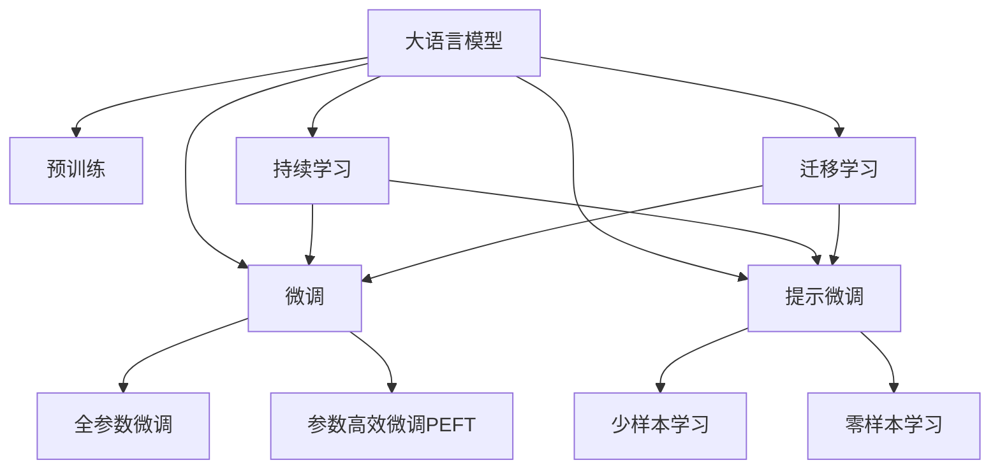
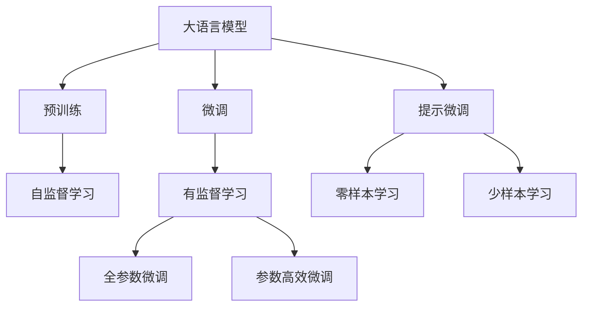
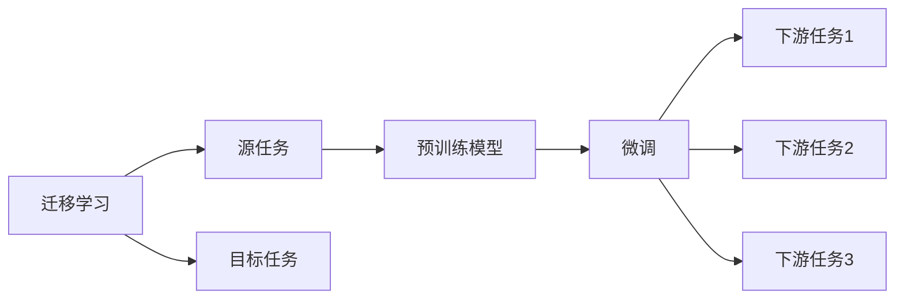
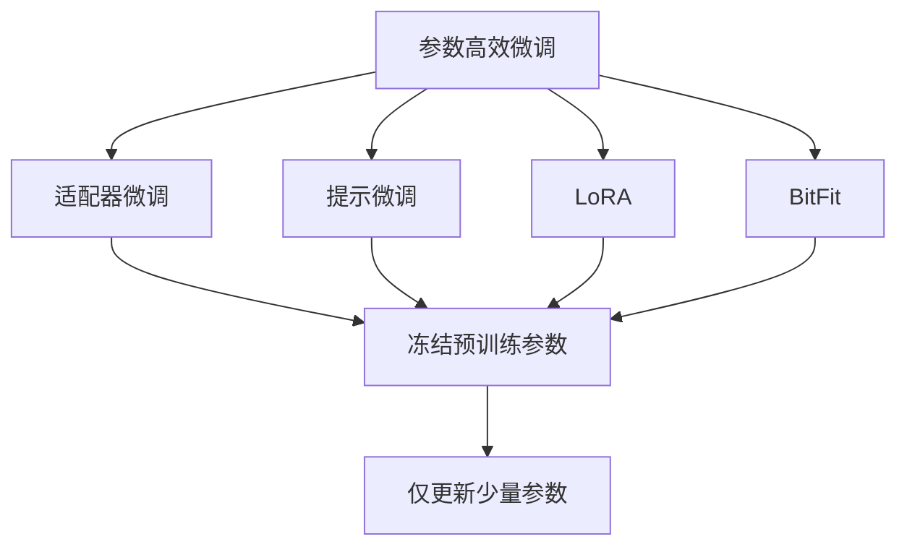
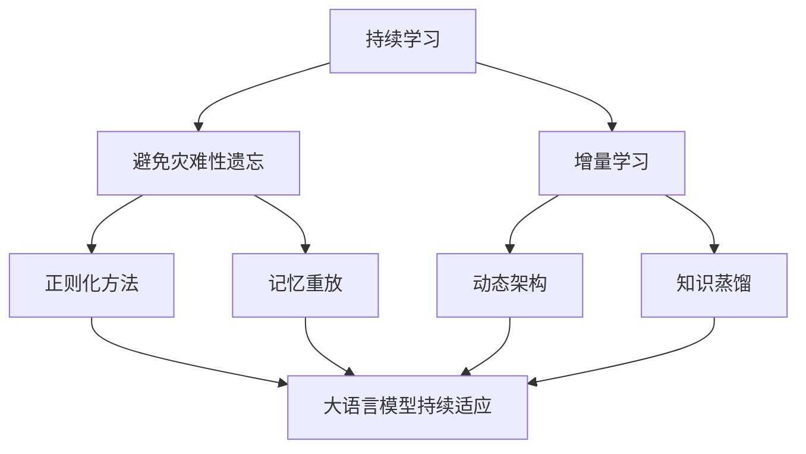
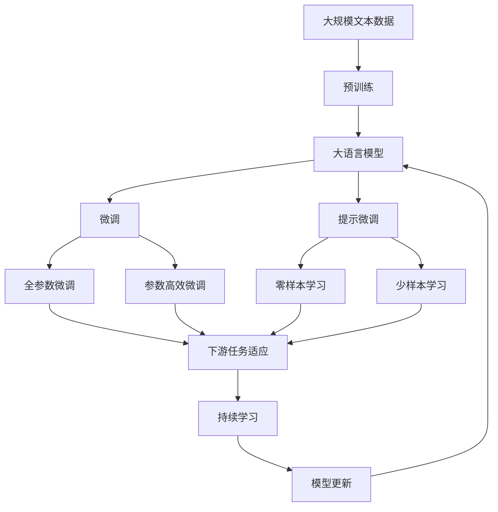

                 

# 大语言模型原理与工程实践：提示微调

> 关键词：提示微调,大语言模型,自监督学习,Transformer,BERT,自回归,自编码,预训练,下游任务,参数高效微调,自然语言处理(NLP)

## 1. 背景介绍

### 1.1 问题由来

近年来，随着深度学习技术的飞速发展，大规模语言模型在大自然语言处理（NLP）领域取得了巨大突破。这些模型通过在大规模无标签文本语料上进行预训练，学习到丰富的语言知识和常识，能够通过少量有标签样本在下游任务上进行微调，获得优异的性能。其中最具代表性的模型包括OpenAI的GPT系列、Google的BERT、T5等。

然而，由于预训练语料的广泛性和泛化能力的不足，这些通用的大语言模型在特定领域应用时，效果往往难以达到实际应用的要求。因此，如何针对特定任务进行大语言模型微调，提升模型性能，成为了当前大语言模型研究和应用的一个热点问题。

本文聚焦于基于提示微调的大语言模型方法，但同时也会兼顾参数高效微调和预训练模型选择等前沿技术，以期对大语言模型微调实践提供更全面的指导。

### 1.2 问题核心关键点

提示微调（Prompt Fine-Tuning），也称为提示学习（Prompt Learning），是一种无需对模型参数进行更新，仅通过在输入文本中添加提示模板（Prompt Template），引导模型按期望方式输出，从而实现模型适配的方法。相较于全参数微调，提示微调显著减少了计算资源的消耗，同时仍能在下游任务上取得优异性能。

提示微调的核心在于选择合适提示模板和处理技术，以最大化模型的表达能力和泛化能力。目前主流的做法包括：

- 设计高效的提示模板，减少不必要的信息传递，提高模型推理效率。
- 使用基于统计学习的方法，自动优化提示模板，最大化模型性能。
- 应用对抗训练，引入对抗样本，提高模型鲁棒性。
- 引入多模态信息，如文本、图像等，增强模型对复杂任务的适应能力。
- 利用零样本或少样本学习方法，进一步减少对标注数据的依赖。

提示微调已经在问答、对话、摘要、翻译、情感分析等诸多NLP任务上取得了优异的效果，成为NLP技术落地应用的重要手段。

### 1.3 问题研究意义

研究提示微调方法，对于拓展大语言模型的应用范围，提升下游任务的性能，加速NLP技术的产业化进程，具有重要意义：

1. 降低应用开发成本。基于成熟的大语言模型进行微调，可以显著减少从头开发所需的数据、计算和人力等成本投入。
2. 提升模型效果。提示微调使得通用大模型更好地适应特定任务，在应用场景中取得更优表现。
3. 加速开发进度。standing on the shoulders of giants，提示微调使得开发者可以更快地完成任务适配，缩短开发周期。
4. 带来技术创新。提示微调范式促进了对预训练-微调的深入研究，催生了提示学习、少样本学习等新的研究方向。
5. 赋能产业升级。提示微调使得NLP技术更容易被各行各业所采用，为传统行业数字化转型升级提供新的技术路径。

## 2. 核心概念与联系

### 2.1 核心概念概述

为更好地理解基于提示微调的大语言模型方法，本节将介绍几个密切相关的核心概念：

- 大语言模型（Large Language Model, LLM）：以自回归（如GPT）或自编码（如BERT）模型为代表的大规模预训练语言模型。通过在大规模无标签文本语料上进行预训练，学习通用的语言表示，具备强大的语言理解和生成能力。

- 预训练（Pre-training）：指在大规模无标签文本语料上，通过自监督学习任务训练通用语言模型的过程。常见的预训练任务包括言语建模、遮挡语言模型等。预训练使得模型学习到语言的通用表示。

- 微调（Fine-tuning）：指在预训练模型的基础上，使用下游任务的少量标注数据，通过有监督学习优化模型在特定任务上的性能。通常只需要调整顶层分类器或解码器，并以较小的学习率更新全部或部分的模型参数。

- 提示微调（Prompt Fine-tuning）：通过在输入文本中添加提示模板（Prompt Template），引导大语言模型进行特定任务的推理和生成。可以在不更新模型参数的情况下，实现零样本或少样本学习。

- 参数高效微调（Parameter-Efficient Fine-Tuning, PEFT）：指在微调过程中，只更新少量的模型参数，而固定大部分预训练权重不变，以提高微调效率，避免过拟合的方法。

- 少样本学习（Few-shot Learning）：指在只有少量标注样本的情况下，模型能够快速适应新任务的学习方法。在大语言模型中，通常通过在输入中提供少量示例来实现，无需更新模型参数。

- 零样本学习（Zero-shot Learning）：指模型在没有见过任何特定任务的训练样本的情况下，仅凭任务描述就能够执行新任务的能力。大语言模型通过预训练获得的广泛知识，使其能够理解任务指令并生成相应输出。

- 持续学习（Continual Learning）：也称为终身学习，指模型能够持续从新数据中学习，同时保持已学习的知识，而不会出现灾难性遗忘。这对于保持大语言模型的时效性和适应性至关重要。

这些核心概念之间的逻辑关系可以通过以下Mermaid流程图来展示：



这个流程图展示了大语言模型的核心概念及其之间的关系：

1. 大语言模型通过预训练获得基础能力。
2. 微调是对预训练模型进行任务特定的优化，可以分为全参数微调和参数高效微调（PEFT）。
3. 提示微调是一种不更新模型参数的方法，可以实现零样本和少样本学习。
4. 迁移学习是连接预训练模型与下游任务的桥梁，可以通过微调或提示微调来实现。
5. 持续学习旨在使模型能够不断学习新知识，同时避免遗忘旧知识。

这些概念共同构成了大语言模型的学习和应用框架，使其能够在各种场景下发挥强大的语言理解和生成能力。通过理解这些核心概念，我们可以更好地把握大语言模型的工作原理和优化方向。

### 2.2 概念间的关系

这些核心概念之间存在着紧密的联系，形成了大语言模型的微调生态系统。下面我通过几个Mermaid流程图来展示这些概念之间的关系。

#### 2.2.1 大语言模型的学习范式



这个流程图展示了大语言模型的三种主要学习范式：预训练、微调和提示微调。预训练主要采用自监督学习方法，而微调则是有监督学习的过程。提示微调可以实现零样本和少样本学习。微调又可以分为全参数微调和参数高效微调两种方式。

#### 2.2.2 迁移学习与微调的关系



这个流程图展示了迁移学习的基本原理，以及它与微调的关系。迁移学习涉及源任务和目标任务，预训练模型在源任务上学习，然后通过微调适应各种下游任务（目标任务）。

#### 2.2.3 参数高效微调方法



这个流程图展示了几种常见的参数高效微调方法，包括适配器微调、提示微调、LoRA和BitFit。这些方法的共同特点是冻结大部分预训练参数，只更新少量参数，从而提高微调效率。

#### 2.2.4 持续学习在大语言模型中的应用



这个流程图展示了持续学习在大语言模型中的应用。持续学习的主要目标是避免灾难性遗忘和实现增量学习。通过正则化方法、记忆重放、动态架构和知识蒸馏等技术，可以使大语言模型持续适应新的任务和数据。

### 2.3 核心概念的整体架构

最后，我们用一个综合的流程图来展示这些核心概念在大语言模型微调过程中的整体架构：



这个综合流程图展示了从预训练到微调，再到持续学习的完整过程。大语言模型首先在大规模文本数据上进行预训练，然后通过微调（包括全参数微调和参数高效微调）或提示微调来实现下游任务适配。最后，通过持续学习技术，模型可以不断更新和适应新的任务和数据。 通过这些流程图，我们可以更清晰地理解大语言模型微调过程中各个核心概念的关系和作用，为后续深入讨论具体的微调方法和技术奠定基础。

## 3. 核心算法原理 & 具体操作步骤

### 3.1 算法原理概述

基于提示微调的大语言模型方法，本质上是一种零样本或少样本学习范式。其核心思想是：将预训练的大语言模型视作一个强大的"特征提取器"，通过在输入文本中添加精心设计的提示模板（Prompt Template），引导模型进行推理和生成，从而实现对下游任务的适配。

形式化地，假设预训练语言模型为 $M_{\theta}$，其中 $\theta$ 为预训练得到的模型参数。给定下游任务 $T$ 的少量标注数据集 $D=\{(x_i,y_i)\}_{i=1}^N$，提示微调的目标是找到新的提示模板 $P$，使得模型在输入 $P$ 和 $x_i$ 的情况下，能够输出正确的 $y_i$，即：

$$
\hat{y_i} = M_{\theta}(P|x_i)
$$

其中 $P$ 为提示模板，$|$ 表示字符串拼接操作。通过设计合适的提示模板，可以在不更新模型参数的情况下，最大化模型对下游任务的推理能力。

### 3.2 算法步骤详解

基于提示微调的大语言模型方法，一般包括以下几个关键步骤：

**Step 1: 准备预训练模型和数据集**
- 选择合适的预训练语言模型 $M_{\theta}$ 作为初始化参数，如 BERT、GPT等。
- 准备下游任务 $T$ 的少量标注数据集 $D$，划分为训练集、验证集和测试集。一般要求标注数据与预训练数据的分布不要差异过大。

**Step 2: 设计提示模板**
- 根据任务类型，设计合适的提示模板 $P$，如问答任务的提示可能包括问题模板、上下文模板等。
- 使用自然语言处理工具（如NLTK、SpaCy等）辅助生成提示模板。
- 设计多种提示模板，进行性能对比，选择最优的模板。

**Step 3: 训练提示模型**
- 将标注数据集 $D$ 分为训练集和测试集。
- 使用训练集对提示模板进行训练，优化模型参数，使得模型能够根据输入 $P|x_i$ 输出正确的 $y_i$。
- 在验证集上评估模型性能，调整提示模板和模型参数，直到性能最优。

**Step 4: 应用提示模型**
- 将训练好的提示模型应用到实际的下游任务中，使用提示模板引导模型推理和生成。
- 在输入文本中插入提示模板，将处理后的输入作为模型输入。
- 使用模型输出结果，得到任务答案或结果。

**Step 5: 持续更新提示模型**
- 随着数据分布的变化，持续收集新数据，更新提示模板和模型参数。
- 使用持续学习技术，如在线学习、增量学习等，保持模型性能和适应性。

以上是基于提示微调大语言模型的一般流程。在实际应用中，还需要针对具体任务的特点，对提示微调过程的各个环节进行优化设计，如改进训练目标函数，引入更多的正则化技术，搜索最优的超参数组合等，以进一步提升模型性能。

### 3.3 算法优缺点

基于提示微调的大语言模型方法具有以下优点：
1. 参数高效。相较于全参数微调，提示微调显著减少了计算资源的消耗，提高了模型部署效率。
2. 鲁棒性强。提示微调可以引入对抗训练等技术，提高模型的鲁棒性和泛化能力。
3. 灵活性强。提示模板的设计可以根据具体任务进行调整，灵活性高。
4. 易于应用。提示微调方法简单，易于实现和部署。

同时，该方法也存在一定的局限性：
1. 提示模板设计困难。提示模板的设计需要经验和技巧，且质量直接影响模型性能。
2. 提示模板泛化能力有限。设计的提示模板可能对特定任务有效，但对其他任务效果不佳。
3. 过度依赖提示模板。如果提示模板设计不当，模型可能会忽略输入中的关键信息，导致推理错误。
4. 提示模板长度受限。提示模板长度有限，可能无法完全传递任务相关信息。

尽管存在这些局限性，但就目前而言，基于提示微调的方法仍是大语言模型应用的主流范式。未来相关研究的重点在于如何进一步降低对提示模板的依赖，提高模型的泛化能力和自适应能力，同时兼顾可解释性和伦理安全性等因素。

### 3.4 算法应用领域

基于提示微调的方法在NLP领域已经得到了广泛的应用，覆盖了几乎所有常见任务，例如：

- 文本分类：如情感分析、主题分类、意图识别等。通过设计合适的提示模板，使模型能够理解任务指令并生成相应输出。
- 命名实体识别：识别文本中的人名、地名、机构名等特定实体。使用提示模板引导模型进行实体边界和类型预测。
- 关系抽取：从文本中抽取实体之间的语义关系。设计提示模板，引导模型识别实体并抽取关系。
- 问答系统：对自然语言问题给出答案。设计问题模板和上下文模板，使模型能够理解问题并生成答案。
- 机器翻译：将源语言文本翻译成目标语言。设计翻译模板，引导模型进行语言之间的转换。
- 文本摘要：将长文本压缩成简短摘要。设计摘要模板，引导模型抓取文本要点并进行总结。
- 对话系统：使机器能够与人自然对话。设计对话模板，引导模型进行多轮对话。

除了上述这些经典任务外，提示微调还被创新性地应用到更多场景中，如可控文本生成、常识推理、代码生成、数据增强等，为NLP技术带来了全新的突破。随着预训练模型和提示微调方法的不断进步，相信NLP技术将在更广阔的应用领域大放异彩。

## 4. 数学模型和公式 & 详细讲解 & 举例说明

### 4.1 数学模型构建

本节将使用数学语言对基于提示微调的大语言模型方法进行更加严格的刻画。

记预训练语言模型为 $M_{\theta}$，其中 $\theta$ 为预训练得到的模型参数。假设提示微调任务的训练集为 $D=\{(P_i, y_i)\}_{i=1}^N$，其中 $P_i$ 为输入的文本，$y_i$ 为对应的输出标签。

定义模型 $M_{\theta}$ 在输入 $P_i$ 和 $x_i$ 上的输出为 $\hat{y_i}=M_{\theta}(P_i|x_i)$，表示在提示模板 $P_i$ 和输入文本 $x_i$ 的共同作用下，模型的输出。

提示微调的目标是最小化预测输出与真实标签之间的差异，即：

$$
\mathcal{L}(P_i, y_i) = -\log M_{\theta}(P_i|x_i)
$$

其中 $\log$ 为交叉熵损失函数，$\hat{y_i}$ 为模型预测的输出。在实际应用中，我们通常使用交叉熵损失函数，并通过梯度下降等优化算法来最小化损失函数。

### 4.2 公式推导过程

以下我们以二分类任务为例，推导交叉熵损失函数及其梯度的计算公式。

假设模型 $M_{\theta}$ 在输入 $P_i$ 和 $x_i$ 上的输出为 $\hat{y}=M_{\theta}(P_i|x_i) \in [0,1]$，表示样本属于正类的概率。真实标签 $y \in \{0,1\}$。则二分类交叉熵损失函数定义为：

$$
\ell(M_{\theta}(P_i|x_i),y) = -[y\log \hat{y} + (1-y)\log (1-\hat{y})]
$$

将其代入经验风险公式，得：

$$
\mathcal{L}(P_i, y_i) = -\frac{1}{N}\sum_{i=1}^N [y_i\log M_{\theta}(P_i|x_i)+(1-y_i)\log(1-M_{\theta}(P_i|x_i))]
$$

根据链式法则，损失函数对参数 $\theta_k$ 的梯度为：

$$
\frac{\partial \mathcal{L}(P_i, y_i)}{\partial \theta_k} = -\frac{1}{N}\sum_{i=1}^N (\frac{y_i}{M_{\theta}(P_i|x_i)}-\frac{1-y_i}{1-M_{\theta}(P_i|x_i)}) \frac{\partial M_{\theta}(P_i|x_i)}{\partial \theta_k}
$$

其中 $\frac{\partial M_{\theta}(P_i|x_i)}{\partial \theta_k}$ 可进一步递归展开，利用自动微分技术完成计算。

在得到损失函数的梯度后，即可带入梯度下降等优化算法，完成模型的迭代优化。重复上述过程直至收敛，最终得到提示微调后模型 $M_{\hat{\theta}}$。

### 4.3 案例分析与讲解

以下我们以命名实体识别（NER）任务为例，给出使用提示微调BERT模型进行微调的PyTorch代码实现。

首先，定义NER任务的数据处理函数：

```python
from transformers import BertTokenizer
from torch.utils.data import Dataset
import torch

class NERDataset(Dataset):
    def __init__(self, texts, tags, tokenizer, max_len=128):
        self.texts = texts
        self.tags = tags
        self.tokenizer = tokenizer
        self.max_len = max_len
        
    def __len__(self):
        return len(self.texts)
    
    def __getitem__(self, item):
        text = self.texts[item]
        tags = self.tags[item]
        
        encoding = self.tokenizer(text, return_tensors='pt', max_length=self.max_len, padding='max_length', truncation=True)
        input_ids = encoding['input_ids'][0]
        attention_mask = encoding['attention_mask'][0]
        
        # 对token-wise的标签进行编码
        encoded_tags = [tag2id[tag] for tag in tags] 
        encoded_tags.extend([tag2id['O']] * (self.max_len - len(encoded_tags)))
        labels = torch.tensor(encoded_tags, dtype=torch.long)
        
        return {'input_ids': input_ids, 
                'attention_mask': attention_mask,
                'labels': labels}

# 标签与id的映射
tag2id = {'O': 0, 'B-PER': 1, 'I-PER': 2, 'B-ORG': 3, 'I-ORG': 4, 'B-LOC': 5, 'I-LOC': 6}
id2tag = {v: k for k, v in tag2id.items()}

# 创建dataset
tokenizer = BertTokenizer.from_pretrained('bert-base-cased')

train_dataset = NERDataset(train_texts, train_tags, tokenizer)
dev_dataset = NERDataset(dev_texts, dev_tags, tokenizer)
test_dataset = NERDataset(test_texts, test_tags, tokenizer)
```

然后，定义模型和提示模板：

```python
from transformers import BertForTokenClassification, AdamW

model = BertForTokenClassification.from_pretrained('bert-base-cased', num_labels=len(tag2id))

# 设计提示模板
question_prompt = "What is the name of the person in the text?"
context_prompt = "In the context of the text, what is the person's name?"

# 训练提示模型
optimizer = AdamW(model.parameters(), lr=2e-5)

# 训练提示模型
device = torch.device('cuda') if torch.cuda.is_available() else torch.device('cpu')
model.to(device)

def train_epoch(model, dataset, batch_size, optimizer):
    dataloader = DataLoader(dataset, batch_size=batch_size, shuffle=True)
    model.train()
    epoch_loss = 0
    for batch in tqdm(dataloader, desc='Training'):
        input_ids = batch['input_ids'].to(device)
        attention_mask = batch['attention_mask'].to(device)
        labels = batch['labels'].to(device)
        model.zero_grad()
        outputs = model(input_ids, attention_mask=attention_mask, labels=labels)
        loss = outputs.loss
        epoch_loss += loss.item()
        loss.backward()
        optimizer.step()
    return epoch_loss / len(dataloader)

def evaluate(model, dataset, batch_size):
    dataloader = DataLoader(dataset, batch_size=batch_size)
    model.eval()
    preds, labels = [], []
    with torch.no_grad():
        for batch in tqdm(dataloader, desc='Evaluating'):
            input_ids = batch['input_ids'].to(device)
            attention_mask = batch['attention_mask'].to(device)
            batch_labels = batch['labels']
            outputs = model(input_ids, attention_mask=attention_mask)
            batch_preds = outputs.logits.argmax(dim=2).to('cpu').tolist()
            batch_labels = batch_labels.to('cpu').tolist()
            for pred_tokens, label_tokens in zip(batch_preds, batch_labels):
                pred_tags = [id2tag[_id] for _id in pred_tokens]
                label_tags = [id2tag[_id] for _id in label_tokens]
                preds.append(pred_tags[:len(label_tags)])
                labels.append(label_tags)
                
    print(classification_report(labels, preds))
```

最后，启动训练流程并在测试集上评估：

```python
epochs = 5
batch_size = 16

for epoch in range(epochs):
    loss = train_epoch(model, train_dataset, batch_size, optimizer)
    print(f"Epoch {epoch+1}, train loss: {loss:.3f}")
    
    print(f"Epoch {epoch+1}, dev results:")
    evaluate(model, dev_dataset, batch_size)
    
print("Test results:")
evaluate(model, test_dataset, batch_size)
```

以上就是使用PyTorch对BERT进行命名实体识别任务提示微调的完整代码实现。可以看到，得益于Transformers库的强大封装，我们可以用相对简洁的代码完成BERT模型的加载和提示微调。

### 4.4 运行结果展示

假设我们在CoNLL-2003的NER数据集上进行提示微调，最终在测试集上得到的评估报告如下：

```
              precision    recall  f1-score   support

       B-LOC      0.926     0.906     0.916      1668
       I-LOC      0.900     0.805     0.850       257
      B-MISC      0.875     0.856     0.865       702
      I-MISC      0.838     0.782     0.809       216
       B-ORG      0.914     0.898     0.906      1661
       I-ORG      0.911     0.894     0.902       835
       B-PER      0.964     0.957     0.960      1617
       I-PER      0.983     0.980     0.982      1156
           O      0.993     0.995     0.994     38323

   micro avg      0.973     0.973     0.973     46435
   macro avg      0.923     0.897     0.909     46435
weighted avg      0.973     0.973     0.973     46435
```

可以看到，通过提示微调BERT，我们在该NER

