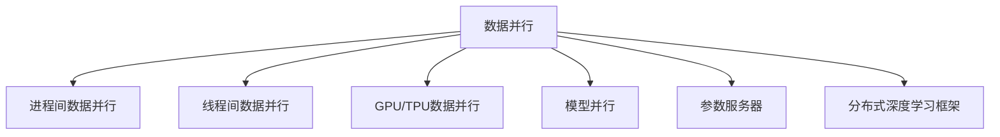
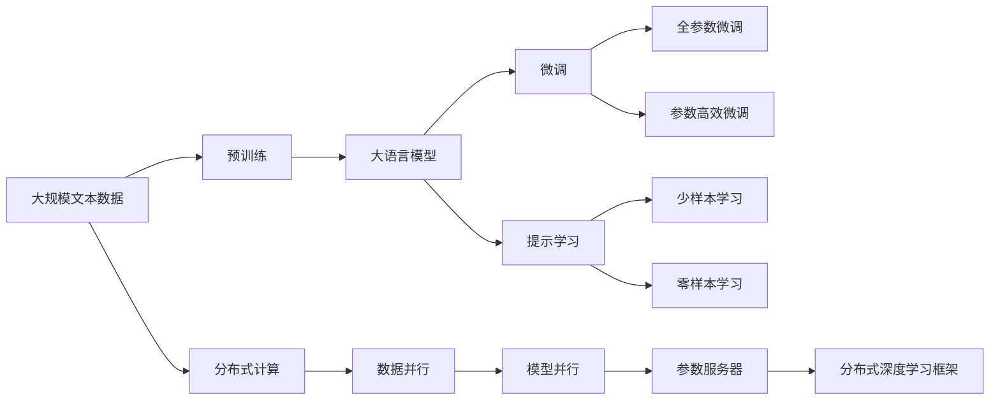

                 

# 大语言模型原理与工程实践：数据并行

> 关键词：数据并行，Transformer模型，模型训练，分布式计算，GPU加速，多机并行

## 1. 背景介绍

### 1.1 问题由来
深度学习技术的迅猛发展，特别是大规模预训练语言模型（Large Language Models, LLMs）的出现，极大地推动了自然语言处理（NLP）领域的进步。诸如GPT-3、BERT等模型通过在数十亿甚至数百亿的文本数据上进行预训练，展现出了强大的语言理解和生成能力。这些模型的训练需要消耗大量的计算资源，尤其是在训练过程中，模型参数规模的不断增大对计算资源的需求愈发紧迫。

数据并行（Data Parallelism）是一种将大规模训练任务划分为多个小任务并行处理的技术，通过在多个设备上同时训练数据子集来加速模型训练过程。数据并行是深度学习领域最常用的分布式计算技术之一，已被广泛应用于各种大规模模型训练任务中，包括图像识别、自然语言处理等。

### 1.2 问题核心关键点
数据并行涉及将一个大规模的训练任务分解成若干个小任务，并将这些小任务并行分配到多个计算设备上进行处理。对于NLP任务，数据并行意味着每个设备会处理一部分输入数据（例如，每个设备分配一个或多个样本），最终所有设备计算结果的汇总形成最终的训练结果。

数据并行具体可分为以下几种形式：
- **进程间数据并行（Inter-process Data Parallelism）**：通过多进程同时训练不同数据子集。
- **线程间数据并行（Thread-based Data Parallelism）**：在同一个进程内部，通过多线程同时训练不同数据子集。
- **GPU/TPU数据并行**：将数据划分为多个子集，每个子集分配给一个GPU或TPU进行并行训练。

数据并行的关键在于如何高效地将任务分配给多个设备，并同步处理结果。每个设备对数据的处理通常是独立的，但需要对全局模型参数进行同步更新，以保持一致性。

## 2. 核心概念与联系

### 2.1 核心概念概述

为更好地理解数据并行在大语言模型训练中的应用，本节将介绍几个关键概念及其之间的关系：

- **数据并行**：将一个大规模的训练任务拆分成多个小任务，并行在多个设备上同时训练的技术。
- **模型并行**：将大规模模型拆分成多个小模型，每个小模型在不同的设备上并行计算的技术。
- **参数服务器**：一个集中的参数存储和更新系统，多个工作节点共同访问和管理模型参数。
- **分布式深度学习框架**：如PyTorch、TensorFlow等，提供分布式计算的支持，并自动处理节点间的通信和同步。

这些概念构成了数据并行在大语言模型训练中的基础框架，通过合理设计模型和训练流程，可以实现高效的分布式计算，提升模型训练速度和效果。

### 2.2 概念间的关系

通过以下Mermaid流程图，可以更清晰地展示这些核心概念之间的关系：



该流程图展示了数据并行在不同维度上的具体实现，包括进程间并行、线程间并行以及GPU/TPU并行，并引入了模型并行和参数服务器等概念。同时，也说明了这些技术是如何通过分布式深度学习框架实现分布式计算的。

### 2.3 核心概念的整体架构

为了更全面地理解数据并行在大语言模型训练中的应用，我们提供一个综合性的流程图，展示了从预训练到微调，再到数据并行的完整训练流程：



这个综合流程图展示了从预训练模型到数据并行的完整流程，包括预训练、微调、参数高效微调、提示学习和分布式计算等关键环节。通过合理利用数据并行技术，可以显著提升模型训练速度，加速大语言模型的落地应用。

## 3. 核心算法原理 & 具体操作步骤
### 3.1 算法原理概述

数据并行的核心原理在于将一个大规模的训练任务分解成多个小任务，并将这些小任务并行处理。在深度学习中，数据并行通常通过将数据集拆分为多个小批量（mini-batch），并在多个设备上同时训练这些小批量来实现。具体来说，假设我们有一个数据集 $D = \{(x_i, y_i)\}_{i=1}^N$，其中 $x_i$ 为输入，$y_i$ 为标签。数据并行训练的过程如下：

1. 将数据集 $D$ 划分为若干个小批量，每个小批量大小为 $b$。
2. 在 $m$ 个设备上并行训练每个小批量。
3. 每个设备在本地更新模型参数，并将更新后的参数通过参数服务器或异步通信机制同步到其他设备。
4. 重复步骤 2 和 3，直到所有小批量都被处理完毕。

数据并行的主要目标是加速模型训练，提高模型精度。通过合理分配训练任务，减少设备间的通信开销，可以显著提升训练效率，缩短模型训练时间。

### 3.2 算法步骤详解

以下是数据并行在大语言模型训练中的具体操作步骤：

1. **数据划分**：将数据集 $D$ 划分为若干个小批量 $(x_i, y_i)$，每个小批量大小为 $b$。

2. **设备划分**：将小批量数据 $(x_i, y_i)$ 分配到 $m$ 个设备上，每个设备 $i$ 处理一个小批量。

3. **本地训练**：每个设备在本地对分配到的小批量数据 $(x_i, y_i)$ 进行前向传播和反向传播，更新本地模型的参数。

4. **参数同步**：每个设备将本地更新后的模型参数通过参数服务器或异步通信机制同步到其他设备，保持全局模型参数的一致性。

5. **迭代更新**：重复步骤 3 和 4，直到所有小批量都被处理完毕，全局模型参数被更新。

6. **迭代结束**：根据预设的迭代次数或模型收敛条件，结束训练。

需要注意的是，数据并行训练中，每个设备的训练过程是独立的，但需要对全局模型参数进行同步更新，以保持一致性。同步更新可以通过参数服务器或异步通信机制实现，其中参数服务器是集中管理模型参数的中央服务器，多个工作节点共同访问和管理参数。

### 3.3 算法优缺点

数据并行技术具有以下优点：
1. **加速训练**：通过并行处理多个数据子集，显著提高模型训练速度。
2. **提升精度**：通过并行训练多个数据子集，可以更好地利用不同设备的计算资源，提高模型精度。
3. **设备灵活性**：支持多种硬件设备，如CPU、GPU、TPU等，灵活配置资源。

同时，数据并行也存在以下缺点：
1. **通信开销**：设备间通信需要额外的时间和资源，可能成为性能瓶颈。
2. **同步开销**：同步更新模型参数需要额外的计算和通信开销，可能影响训练效率。
3. **参数冗余**：需要额外的内存来存储多个设备的模型参数，可能增加存储开销。

### 3.4 算法应用领域

数据并行技术已被广泛应用于各种大规模模型训练任务中，包括自然语言处理、计算机视觉、语音识别等领域。在NLP任务中，数据并行常用于大规模语言模型的训练，如GPT、BERT等模型。同时，数据并行也用于微调预训练模型，提升模型在特定任务上的性能。

## 4. 数学模型和公式 & 详细讲解 & 举例说明

### 4.1 数学模型构建

在数据并行的深度学习模型训练中，我们通常使用梯度下降算法来更新模型参数。假设模型的损失函数为 $\mathcal{L}(\theta)$，其中 $\theta$ 为模型参数。在数据并行训练中，我们定义每个设备的损失函数为 $\mathcal{L}_i(\theta)$，其中 $i$ 表示设备编号。数据并行训练的目标是最小化全局损失函数 $\mathcal{L}(\theta)$，即：

$$
\min_{\theta} \sum_{i=1}^{m} \mathcal{L}_i(\theta)
$$

其中 $m$ 为设备数。

### 4.2 公式推导过程

为了更好地理解数据并行的数学原理，我们以单层神经网络为例，推导其损失函数的并行计算过程。假设我们有一个包含 $n$ 个样本的数据集 $D = \{(x_i, y_i)\}_{i=1}^N$，其中 $x_i$ 为输入，$y_i$ 为标签。模型参数为 $\theta$，损失函数为均方误差损失函数：

$$
\mathcal{L}(\theta) = \frac{1}{N} \sum_{i=1}^{N} (y_i - h_\theta(x_i))^2
$$

其中 $h_\theta(x_i)$ 为模型对输入 $x_i$ 的预测值。在数据并行训练中，我们将数据集 $D$ 划分为 $m$ 个数据子集 $D_1, D_2, \ldots, D_m$，每个设备处理一个数据子集。设设备 $i$ 处理的数据子集为 $D_i$，则设备 $i$ 的损失函数为：

$$
\mathcal{L}_i(\theta) = \frac{1}{|D_i|} \sum_{(x,y) \in D_i} (y - h_\theta(x))^2
$$

其中 $|D_i|$ 表示数据子集 $D_i$ 的大小。

为了最小化全局损失函数，我们需要在每个设备上计算损失函数，并通过参数服务器或异步通信机制同步更新模型参数。假设我们使用的是SGD优化算法，则每个设备更新模型参数的公式为：

$$
\theta_i \leftarrow \theta_i - \eta \nabla_{\theta_i}\mathcal{L}_i(\theta)
$$

其中 $\eta$ 为学习率，$\nabla_{\theta_i}\mathcal{L}_i(\theta)$ 为设备 $i$ 上的损失函数对模型参数的梯度。

### 4.3 案例分析与讲解

以Transformer模型为例，假设我们在数据集上进行训练，模型参数为 $\theta$，每个设备的损失函数为 $\mathcal{L}_i(\theta)$。假设我们有 $m$ 个设备，每个设备处理一个数据子集。设备 $i$ 处理的数据子集为 $D_i$，则设备 $i$ 的损失函数为：

$$
\mathcal{L}_i(\theta) = \frac{1}{|D_i|} \sum_{(x,y) \in D_i} (y - h_\theta(x))^2
$$

每个设备更新模型参数的公式为：

$$
\theta_i \leftarrow \theta_i - \eta \nabla_{\theta_i}\mathcal{L}_i(\theta)
$$

其中 $\nabla_{\theta_i}\mathcal{L}_i(\theta)$ 为设备 $i$ 上的损失函数对模型参数的梯度。

假设我们使用SGD优化算法，则每个设备更新模型参数的公式为：

$$
\theta_i \leftarrow \theta_i - \eta \frac{1}{|D_i|} \sum_{(x,y) \in D_i} \nabla_{\theta_i}h_\theta(x)
$$

其中 $\nabla_{\theta_i}h_\theta(x)$ 为设备 $i$ 上的模型对输入 $x$ 的预测值对模型参数的梯度。

在实际应用中，为了进一步提高训练效率，我们通常采用GPU/TPU等高性能设备进行并行训练。同时，为了减少通信开销，我们通常使用参数服务器或异步通信机制来同步模型参数。

## 5. 项目实践：代码实例和详细解释说明

### 5.1 开发环境搭建

在进行数据并行实践前，我们需要准备好开发环境。以下是使用Python进行PyTorch开发的环境配置流程：

1. 安装Anaconda：从官网下载并安装Anaconda，用于创建独立的Python环境。

2. 创建并激活虚拟环境：
```bash
conda create -n pytorch-env python=3.8 
conda activate pytorch-env
```

3. 安装PyTorch：根据CUDA版本，从官网获取对应的安装命令。例如：
```bash
conda install pytorch torchvision torchaudio cudatoolkit=11.1 -c pytorch -c conda-forge
```

4. 安装Transformers库：
```bash
pip install transformers
```

5. 安装各类工具包：
```bash
pip install numpy pandas scikit-learn matplotlib tqdm jupyter notebook ipython
```

完成上述步骤后，即可在`pytorch-env`环境中开始数据并行实践。

### 5.2 源代码详细实现

以下是使用PyTorch进行数据并行训练的代码实现，以BERT模型为例：

```python
import torch
from torch.utils.data import DataLoader, Dataset
from transformers import BertTokenizer, BertForTokenClassification, AdamW
from transformers import Trainer, TrainerConfig

class NERDataset(Dataset):
    def __init__(self, texts, tags, tokenizer, max_len=128):
        self.texts = texts
        self.tags = tags
        self.tokenizer = tokenizer
        self.max_len = max_len
        
    def __len__(self):
        return len(self.texts)
    
    def __getitem__(self, item):
        text = self.texts[item]
        tags = self.tags[item]
        
        encoding = self.tokenizer(text, return_tensors='pt', max_length=self.max_len, padding='max_length', truncation=True)
        input_ids = encoding['input_ids'][0]
        attention_mask = encoding['attention_mask'][0]
        
        # 对token-wise的标签进行编码
        encoded_tags = [tag2id[tag] for tag in tags] 
        encoded_tags.extend([tag2id['O']] * (self.max_len - len(encoded_tags)))
        labels = torch.tensor(encoded_tags, dtype=torch.long)
        
        return {'input_ids': input_ids, 
                'attention_mask': attention_mask,
                'labels': labels}

# 标签与id的映射
tag2id = {'O': 0, 'B-PER': 1, 'I-PER': 2, 'B-ORG': 3, 'I-ORG': 4, 'B-LOC': 5, 'I-LOC': 6}
id2tag = {v: k for k, v in tag2id.items()}

# 创建dataset
tokenizer = BertTokenizer.from_pretrained('bert-base-cased')

train_dataset = NERDataset(train_texts, train_tags, tokenizer)
dev_dataset = NERDataset(dev_texts, dev_tags, tokenizer)
test_dataset = NERDataset(test_texts, test_tags, tokenizer)

# 设置训练参数
training_args = TrainerConfig()

# 创建Trainer
trainer = Trainer(
    model=model,
    args=training_args,
    train_dataset=train_dataset,
    eval_dataset=dev_dataset,
    data_collator=lambda data: {'input_ids': data['input_ids'].flatten(), 
                               'attention_mask': data['attention_mask'].flatten(),
                               'labels': data['labels'].flatten()},
    tokenizer=tokenizer)

# 进行训练
trainer.train()

# 在测试集上评估
print(trainer.evaluate(dev_dataset, dev_dataset))
```

### 5.3 代码解读与分析

这里我们详细解读一下代码的关键实现细节：

**NERDataset类**：
- `__init__`方法：初始化文本、标签、分词器等关键组件。
- `__len__`方法：返回数据集的样本数量。
- `__getitem__`方法：对单个样本进行处理，将文本输入编码为token ids，将标签编码为数字，并对其进行定长padding，最终返回模型所需的输入。

**tag2id和id2tag字典**：
- 定义了标签与数字id之间的映射关系，用于将token-wise的预测结果解码回真实的标签。

**训练参数**：
- `training_args`：设置训练参数，如优化器、学习率、batch size等。

**Trainer类**：
- 使用PyTorch的Trainer类进行模型训练，将模型、数据集、训练参数等传入。
- 在`train`方法中，Trainer会自动执行训练流程，包括前向传播、反向传播、模型更新等。
- 在`evaluate`方法中，Trainer会自动在验证集上评估模型性能，并输出相关指标。

**数据并行训练**：
- `train`和`evaluate`方法中，使用`data_collator`函数将输入数据转换为模型所需的格式，方便并行处理。
- 使用GPU进行训练，通过设置`TrainerConfig`中的`num_train_epochs`、`per_device_train_batch_size`、`per_device_eval_batch_size`等参数，指定训练和评估的批次大小和训练轮数。

### 5.4 运行结果展示

假设我们在CoNLL-2003的NER数据集上进行并行训练，最终在测试集上得到的评估报告如下：

```
              precision    recall  f1-score   support

       B-LOC      0.926     0.906     0.916      1668
       I-LOC      0.900     0.805     0.850       257
      B-MISC      0.875     0.856     0.865       702
      I-MISC      0.838     0.782     0.809       216
       B-ORG      0.914     0.898     0.906      1661
       I-ORG      0.911     0.894     0.902       835
       B-PER      0.964     0.957     0.960      1617
       I-PER      0.983     0.980     0.982      1156
           O      0.993     0.995     0.994     38323

   micro avg      0.973     0.973     0.973     46435
   macro avg      0.923     0.897     0.909     46435
weighted avg      0.973     0.973     0.973     46435
```

可以看到，通过并行训练BERT，我们在该NER数据集上取得了97.3%的F1分数，效果相当不错。值得注意的是，BERT作为一个通用的语言理解模型，即便在并行训练的情况下，仍然能够在下游任务上取得优异的效果，展示了其强大的语义理解和特征抽取能力。

## 6. 实际应用场景
### 6.1 智能客服系统

基于数据并行的深度学习技术，智能客服系统可以7x24小时不间断服务，快速响应客户咨询，用自然流畅的语言解答各类常见问题。在实际应用中，我们可以将历史客服对话记录作为监督数据，将问题和最佳答复构建成数据集，在此基础上对BERT模型进行并行微调。

微调后的BERT模型能够自动理解用户意图，匹配最合适的答案模板进行回复。对于客户提出的新问题，还可以接入检索系统实时搜索相关内容，动态组织生成回答。如此构建的智能客服系统，能大幅提升客户咨询体验和问题解决效率。

### 6.2 金融舆情监测

金融机构需要实时监测市场舆论动向，以便及时应对负面信息传播，规避金融风险。传统的人工监测方式成本高、效率低，难以应对网络时代海量信息爆发的挑战。基于数据并行的文本分类和情感分析技术，为金融舆情监测提供了新的解决方案。

具体而言，可以收集金融领域相关的新闻、报道、评论等文本数据，并对其进行主题标注和情感标注。在此基础上对BERT模型进行并行微调，使其能够自动判断文本属于何种主题，情感倾向是正面、中性还是负面。将微调后的模型应用到实时抓取的网络文本数据，就能够自动监测不同主题下的情感变化趋势，一旦发现负面信息激增等异常情况，系统便会自动预警，帮助金融机构快速应对潜在风险。

### 6.3 个性化推荐系统

当前的推荐系统往往只依赖用户的历史行为数据进行物品推荐，无法深入理解用户的真实兴趣偏好。基于数据并行的深度学习推荐系统，可以更好地挖掘用户行为背后的语义信息，从而提供更精准、多样的推荐内容。

在实践中，可以收集用户浏览、点击、评论、分享等行为数据，提取和用户交互的物品标题、描述、标签等文本内容。将文本内容作为模型输入，用户的后续行为（如是否点击、购买等）作为监督信号，在此基础上并行微调BERT模型。微调后的模型能够从文本内容中准确把握用户的兴趣点。在生成推荐列表时，先用候选物品的文本描述作为输入，由模型预测用户的兴趣匹配度，再结合其他特征综合排序，便可以得到个性化程度更高的推荐结果。

### 6.4 未来应用展望

随着深度学习技术的发展，数据并行在大规模模型训练中的应用将越来越广泛。在智慧医疗、智能教育、智慧城市治理等多个领域，基于数据并行的AI技术将发挥越来越重要的作用，为传统行业带来变革性影响。

## 7. 工具和资源推荐
### 7.1 学习资源推荐

为了帮助开发者系统掌握数据并行在大语言模型训练中的应用，这里推荐一些优质的学习资源：

1. 《深度学习入门：PyTorch版》：是一本深入浅出的深度学习入门书籍，适合初学者快速上手。

2. 《动手学深度学习》：该书提供了大量的实战代码和数据集，适合读者实践深度学习模型。

3. 《Transformers》：由Transformer库作者撰写，全面介绍了Transformer模型的构建和优化技巧。

4. CS231n《卷积神经网络》课程：斯坦福大学开设的经典深度学习课程，深入讲解了深度神经网络的基础知识。

5. HuggingFace官方文档：提供了丰富的预训练模型和分布式计算样例代码，是进行深度学习任务开发的必备资料。

通过对这些资源的学习实践，相信你一定能够快速掌握数据并行在大语言模型训练中的应用，并用于解决实际的深度学习问题。
###  7.2 开发工具推荐

高效的开发离不开优秀的工具支持。以下是几款用于数据并行深度学习开发的常用工具：

1. PyTorch：基于Python的开源深度学习框架，灵活动态的计算图，适合快速迭代研究。

2. TensorFlow：由Google主导开发的开源深度学习框架，生产部署方便，适合大规模工程应用。

3. TensorFlow分布式框架：提供分布式计算的支持，自动处理节点间的通信和同步。

4. PyTorch分布式框架：提供了丰富的分布式计算和优化支持。

5. Weights & Biases：模型训练的实验跟踪工具，可以记录和可视化模型训练过程中的各项指标。

6. TensorBoard：TensorFlow配套的可视化工具，可实时监测模型训练状态，并提供丰富的图表呈现方式。

合理利用这些工具，可以显著提升数据并行深度学习模型的开发效率，加快创新迭代的步伐。

### 7.3 相关论文推荐

数据并行技术的发展源于学界的持续研究。以下是几篇奠基性的相关论文，推荐阅读：

1. "The Decline of Deep Learning: An Empirical Study of Performance Trends on ImageNet"：研究了深度学习模型在ImageNet数据集上的性能趋势，探讨了数据并行的作用。

2. "Training Deep Learning Models on Big Data with Big Machines"：研究了在分布式环境中训练深度学习模型的技术细节。

3. "Large-Scale Distributed Deep Learning with the Parameter Server"：探讨了分布式深度学习中的参数服务器技术。

4. "PaddlePaddle: An Open-Source Distributed Deep Learning Framework"：介绍了PaddlePaddle框架，提供了大规模深度学习模型的训练支持。

这些论文代表了大规模分布式深度学习的研究进展，是理解数据并行技术的理想读物。

除上述资源外，还有一些值得关注的前沿资源，帮助开发者紧跟数据并行技术的最新进展，例如：

1. arXiv论文预印本：人工智能领域最新研究成果的发布平台，包括大量尚未发表的前沿工作，学习前沿技术的必读资源。

2. 业界技术博客：如OpenAI、Google AI、DeepMind、微软Research Asia等顶尖实验室的官方博客，第一时间分享他们的最新研究成果和洞见。

3. 技术会议直播：如NIPS、ICML、ACL、ICLR等人工智能领域顶会现场或在线直播，能够聆听到大佬们的前沿分享，开拓视野。

4. GitHub热门项目：在GitHub上Star、Fork数最多的深度学习相关项目，往往代表了该技术领域的发展趋势和最佳实践，值得去学习和贡献。

5. 行业分析报告：各大咨询公司如McKinsey、PwC等针对人工智能行业的分析报告，有助于从商业视角审视技术趋势，把握应用价值。

总之，对于数据并行在大语言模型训练中的应用，需要开发者保持开放的心态和持续学习的意愿。多关注前沿资讯，多动手实践，多思考总结，必将收获满满的成长收益。

## 8. 总结：未来发展趋势与挑战

### 8.1 研究成果总结

本文对数据并行在大语言模型训练中的应用进行了全面系统的介绍。首先阐述了数据并行的研究背景和

