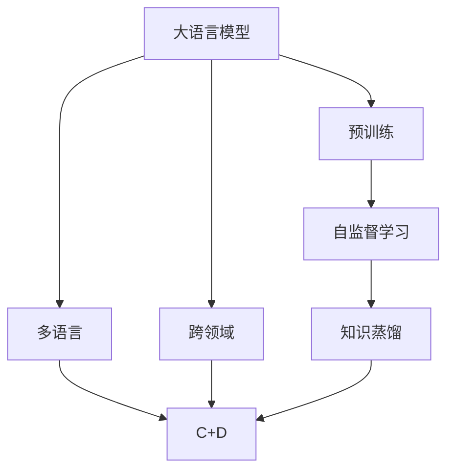
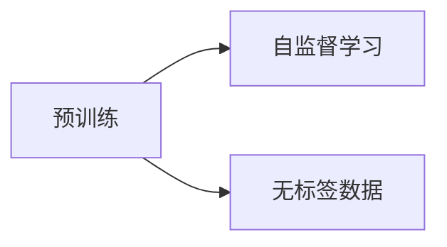
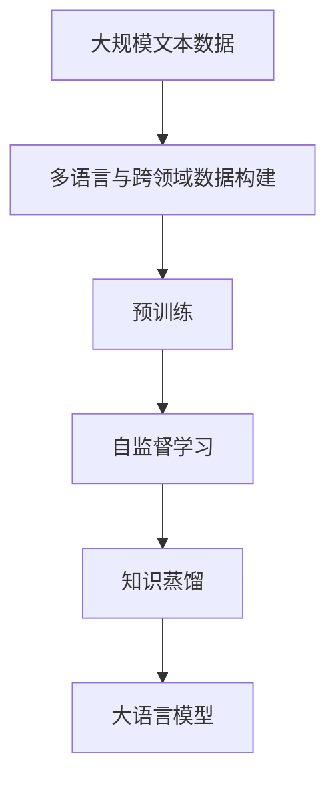

                 

# 大语言模型原理与工程实践：预训练数据构建

> 关键词：大语言模型, 预训练, 自监督学习, 数据构建, 多语言, 跨领域, 知识蒸馏

## 1. 背景介绍

### 1.1 问题由来
近年来，深度学习技术在自然语言处理（NLP）领域取得了飞速发展。其中，大语言模型（Large Language Models, LLMs）以其卓越的性能和广泛的应用引起了广泛关注。预训练大语言模型通过在大规模无标签文本数据上进行自监督学习，学习到了丰富的语言知识和常识。

然而，构建一个高质量的大语言模型，尤其是在多语言和跨领域场景下，需要构建足够规模和质量的数据集。预训练数据是构建大语言模型的基石，其构建质量直接影响到模型的性能和泛化能力。因此，本文将深入探讨预训练数据的构建方法及其对大语言模型性能的影响。

### 1.2 问题核心关键点
预训练数据的构建是一个复杂且耗时的过程，需要考虑数据的多样性、规模、领域覆盖、数据处理等多方面因素。预训练数据的质量决定了大语言模型的性能和泛化能力，是构建高性能大语言模型的关键步骤。

预训练数据的构建主要包括以下几个关键点：
- 数据来源的选择：选择来源稳定、高质量的数据源。
- 数据的多样性：确保数据集覆盖多种语言、领域、任务。
- 数据处理：清洗、标注、分割等预处理操作，确保数据质量。
- 数据规模：构建足够大规模的数据集，以提高模型泛化能力。
- 领域覆盖：构建覆盖多种领域的综合数据集。

### 1.3 问题研究意义
预训练数据的构建是大语言模型成功应用的基础。高质量的预训练数据可以提升大语言模型的性能和泛化能力，使其在各种任务上取得优异效果。预训练数据的构建不仅需要考虑数据的多样性和规模，还需结合特定领域的需求，构建适应性强、高质量的预训练数据集。

研究预训练数据构建方法，不仅有助于提升大语言模型的性能，还能促进大语言模型在更多领域的应用，加速人工智能技术落地进程，推动产业升级。

## 2. 核心概念与联系

### 2.1 核心概念概述

为更好地理解预训练数据构建方法，本节将介绍几个密切相关的核心概念：

- 大语言模型（LLMs）：以自回归（如GPT）或自编码（如BERT）模型为代表的大规模预训练语言模型。通过在大规模无标签文本语料上进行预训练，学习到通用的语言表示，具备强大的语言理解和生成能力。

- 预训练（Pre-training）：指在大规模无标签文本语料上，通过自监督学习任务训练通用语言模型的过程。常见的预训练任务包括言语建模、掩码语言模型等。预训练使得模型学习到语言的通用表示。

- 自监督学习（Supervised Learning）：指在没有标签数据的情况下，通过学习数据的内在结构或统计特性，训练模型的过程。自监督学习在预训练阶段应用广泛，可以显著提高模型泛化能力。

- 多语言（Multilingual）：指同时支持多种语言的数据集，能够覆盖更多语言和文化背景。多语言数据集有助于构建跨语言的通用语言模型。

- 跨领域（Cross-domain）：指构建覆盖多种领域的数据集，如科技、医疗、金融等。跨领域数据集有助于提升模型在特定领域的应用效果。

- 知识蒸馏（Knowledge Distillation）：指将复杂模型的知识（如推理逻辑、常识积累等）传递给简单模型，提高简单模型的性能。知识蒸馏可以加速大语言模型的预训练和微调过程。

这些核心概念之间的逻辑关系可以通过以下Mermaid流程图来展示：

这个流程图展示了大语言模型的核心概念及其之间的关系：

1. 大语言模型通过预训练获得基础能力。
2. 预训练主要采用自监督学习任务，学习到通用的语言表示。
3. 多语言和跨领域数据集有助于构建通用且适应性强的模型。
4. 知识蒸馏可以将复杂模型的知识传递给简单模型，提高模型性能。

这些概念共同构成了预训练数据构建的基本框架，使得大语言模型能够在各种场景下发挥强大的语言理解和生成能力。通过理解这些核心概念，我们可以更好地把握预训练数据构建的关键步骤和注意事项。

### 2.2 概念间的关系

这些核心概念之间存在着紧密的联系，形成了预训练数据构建的完整生态系统。下面我通过几个Mermaid流程图来展示这些概念之间的关系。

#### 2.2.1 预训练与自监督学习的关系

这个流程图展示了预训练与自监督学习的基本关系：预训练通过自监督学习任务，在大规模无标签数据上进行训练。

#### 2.2.2 多语言与跨领域的关系

这个流程图展示了多语言和跨领域数据集之间的关系：多语言数据集覆盖多种语言，而跨领域数据集则覆盖多种领域，两者结合可以构建更加全面和通用的预训练数据集。

#### 2.2.3 知识蒸馏与预训练的关系

这个流程图展示了知识蒸馏与预训练的关系：知识蒸馏可以在预训练过程中进行，通过将复杂模型的知识传递给简单模型，提升模型的泛化能力和性能。

### 2.3 核心概念的整体架构

最后，我们用一个综合的流程图来展示这些核心概念在大语言模型预训练过程中的整体架构：

这个综合流程图展示了从数据构建到预训练，再到知识蒸馏的完整过程。预训练大语言模型首先通过构建多语言和跨领域数据集，在无标签数据上进行自监督学习任务，学习到通用的语言表示。然后，通过知识蒸馏技术，将复杂模型的知识传递给大语言模型，进一步提升其性能和泛化能力。最后，得到的大语言模型能够在多种任务上取得优异效果。

## 3. 核心算法原理 & 具体操作步骤
### 3.1 算法原理概述

预训练数据构建的核心在于构建大规模、多样性、高质量的数据集，通过自监督学习任务训练大语言模型。大语言模型的预训练主要采用自监督学习任务，如掩码语言模型（Masked Language Modeling, MLM）和下一句预测（Next Sentence Prediction, NSP）等。这些任务可以帮助模型学习到语言的内部结构和语义关系，提升模型的泛化能力。

形式化地，假设预训练数据集为 $D=\{x_i\}_{i=1}^N$，其中每个样本 $x_i$ 为文本序列。预训练目标是最小化模型在 $D$ 上的期望损失函数 $\mathcal{L}(M_{\theta})$，即：

$$
\mathcal{L}(M_{\theta}) = \mathbb{E}_{x \sim D} [\ell(M_{\theta}(x))]
$$

其中 $\ell$ 为特定自监督学习任务定义的损失函数，如掩码语言模型的交叉熵损失。

### 3.2 算法步骤详解

预训练数据构建一般包括以下几个关键步骤：

**Step 1: 数据收集与预处理**
- 从各种来源收集大规模、高质量的文本数据，如维基百科、新闻、博客等。
- 对收集到的数据进行预处理，包括清洗、去重、分词、标准化等操作。
- 将文本数据划分为训练集、验证集和测试集，确保数据集的随机性和可靠性。

**Step 2: 数据标注与标注方案设计**
- 根据预训练目标，设计合适的数据标注方案，如掩码语言模型中的随机掩码，下一句预测任务中的句子对标注。
- 对于需要标注的任务，聘请专业标注员进行标注，确保标注质量。

**Step 3: 数据构建与分割**
- 将标注后的数据集划分为不同的任务子集，如掩码语言模型、下一句预测、文本分类等。
- 按照预定的比例对数据集进行分割，构建训练集、验证集和测试集。
- 对分割后的数据集进行预处理，如分词、标准化、分割等操作，确保数据格式一致。

**Step 4: 数据存储与管理**
- 将处理好的数据集存储到高效的数据库或分布式文件系统中，如Hadoop、Hive等。
- 设计合理的数据存储和管理方案，确保数据的高效读取和写入。
- 对数据进行必要的压缩和分片操作，提高存储效率。

**Step 5: 数据质量监控与评估**
- 设计数据质量监控指标，如标注一致性、数据多样性、数据分布等。
- 使用自动化工具对数据集进行定期监控和评估，确保数据质量。
- 定期对数据集进行扩充和更新，保持数据的时效性和多样性。

### 3.3 算法优缺点

预训练数据构建具有以下优点：
- 提高模型泛化能力：通过大规模、多样性数据集，预训练模型能够学习到更全面的语言知识和语义关系，提升模型泛化能力。
- 加速模型训练：预训练数据集可以显著加速模型训练过程，缩短模型微调时间。
- 提高模型性能：通过预训练和微调，模型能够更好地适应特定任务，取得优异性能。

同时，预训练数据构建也存在一些局限性：
- 数据收集成本高：构建大规模高质量数据集需要大量人力物力，成本较高。
- 数据质量难以保证：数据标注和预处理过程中可能存在噪声和不一致性，影响模型性能。
- 数据分布可能偏差：数据集可能存在领域偏差，影响模型在特定领域的泛化能力。

尽管存在这些局限性，但预训练数据的构建仍是构建高性能大语言模型的关键步骤。通过合理的数据构建策略和优化方法，可以最大化利用现有资源，构建高质量的预训练数据集。

### 3.4 算法应用领域

预训练数据构建在大语言模型的应用中具有广泛的应用场景，涵盖了多种NLP任务，例如：

- 文本分类：如情感分析、主题分类、意图识别等。通过预训练模型学习文本-标签映射，微调模型以适应特定分类任务。
- 命名实体识别：识别文本中的人名、地名、机构名等特定实体。预训练模型能够学习到实体边界和类型，微调模型以适应特定任务。
- 关系抽取：从文本中抽取实体之间的语义关系。预训练模型能够学习到实体-关系三元组，微调模型以适应特定任务。
- 问答系统：对自然语言问题给出答案。通过预训练模型学习问题-答案对，微调模型以适应特定问答任务。
- 机器翻译：将源语言文本翻译成目标语言。通过预训练模型学习语言-语言映射，微调模型以适应特定翻译任务。
- 文本摘要：将长文本压缩成简短摘要。通过预训练模型学习文本-摘要映射，微调模型以适应特定摘要任务。
- 对话系统：使机器能够与人自然对话。通过预训练模型学习对话上下文，微调模型以适应特定对话任务。

除了上述这些经典任务外，预训练数据构建方法还被创新性地应用到更多场景中，如可控文本生成、常识推理、代码生成、数据增强等，为NLP技术带来了全新的突破。随着预训练模型和构建方法的不断进步，相信NLP技术将在更广阔的应用领域大放异彩。

## 4. 数学模型和公式 & 详细讲解  
### 4.1 数学模型构建

本节将使用数学语言对预训练数据构建过程进行更加严格的刻画。

记预训练数据集为 $D=\{x_i\}_{i=1}^N$，其中每个样本 $x_i$ 为文本序列。预训练目标是最小化模型在 $D$ 上的期望损失函数 $\mathcal{L}(M_{\theta})$，即：

$$
\mathcal{L}(M_{\theta}) = \mathbb{E}_{x \sim D} [\ell(M_{\theta}(x))]
$$

其中 $\ell$ 为特定自监督学习任务定义的损失函数。以下以掩码语言模型（MLM）为例，详细讲解预训练过程。

假设掩码语言模型中的掩码比例为 $p$，模型将文本序列中 $p$ 个随机位置的 token 进行掩码，预测被掩码位置的 token。对于每个样本 $x_i$，模型的输出为 $\hat{y_i} = M_{\theta}(x_i)$，其中 $\hat{y_i}$ 为模型在 $x_i$ 上的预测结果。掩码语言模型的损失函数为：

$$
\ell(M_{\theta}(x_i)) = -\frac{1}{p}\sum_{i=1}^p \log M_{\theta}(x_i^{\sim})
$$

其中 $x_i^{\sim}$ 为被掩码位置的 token，$M_{\theta}(x_i^{\sim})$ 为模型在 $x_i^{\sim}$ 上的预测概率。

### 4.2 公式推导过程

以下我们以掩码语言模型（MLM）为例，推导损失函数的数学推导过程。

假设掩码语言模型中的掩码比例为 $p$，模型将文本序列中 $p$ 个随机位置的 token 进行掩码，预测被掩码位置的 token。对于每个样本 $x_i$，模型的输出为 $\hat{y_i} = M_{\theta}(x_i)$，其中 $\hat{y_i}$ 为模型在 $x_i$ 上的预测结果。掩码语言模型的损失函数为：

$$
\ell(M_{\theta}(x_i)) = -\frac{1}{p}\sum_{i=1}^p \log M_{\theta}(x_i^{\sim})
$$

将 $x_i^{\sim}$ 表示为原序列中 $p$ 个被掩码位置的 token 的集合。则掩码语言模型的损失函数可以表示为：

$$
\ell(M_{\theta}(x_i)) = -\frac{1}{p}\sum_{i=1}^p \log \frac{1}{p} \sum_{k=1}^p \mathbb{I}(\text{token}_k = x_i^{\sim}) M_{\theta}(x_i)_k
$$

其中 $\mathbb{I}(\text{token}_k = x_i^{\sim})$ 为指示函数，当 $\text{token}_k = x_i^{\sim}$ 时，其值为 1，否则为 0。

将 $x_i$ 表示为 $n$ 个 token 的序列，即 $x_i = (x_i)_1,(x_i)_2,\cdots,(x_i)_n$，则掩码语言模型的损失函数可以表示为：

$$
\ell(M_{\theta}(x_i)) = -\frac{1}{p}\sum_{i=1}^p \log \frac{1}{p} \sum_{k=1}^p \mathbb{I}(\text{token}_k = x_i^{\sim}) M_{\theta}(x_i)_k
$$

其中 $M_{\theta}(x_i)$ 表示模型对 $x_i$ 的输出，$(x_i)_k$ 表示 $x_i$ 中第 $k$ 个 token。

将损失函数对模型参数 $\theta$ 求导，得到：

$$
\frac{\partial \ell(M_{\theta}(x_i))}{\partial \theta} = -\frac{1}{p}\sum_{i=1}^p \sum_{k=1}^p \mathbb{I}(\text{token}_k = x_i^{\sim}) \frac{\partial \log M_{\theta}(x_i)_k}{\partial \theta}
$$

将 $\frac{\partial \log M_{\theta}(x_i)_k}{\partial \theta}$ 代入，得到：

$$
\frac{\partial \ell(M_{\theta}(x_i))}{\partial \theta} = -\frac{1}{p}\sum_{i=1}^p \sum_{k=1}^p \mathbb{I}(\text{token}_k = x_i^{\sim}) \frac{\partial M_{\theta}(x_i)_k}{\partial \theta}
$$

将 $M_{\theta}(x_i)_k$ 代入，得到：

$$
\frac{\partial \ell(M_{\theta}(x_i))}{\partial \theta} = -\frac{1}{p}\sum_{i=1}^p \sum_{k=1}^p \mathbb{I}(\text{token}_k = x_i^{\sim}) \frac{\partial M_{\theta}(x_i)}{\partial \theta}_k
$$

将 $\frac{\partial M_{\theta}(x_i)}{\partial \theta}_k$ 代入，得到：

$$
\frac{\partial \ell(M_{\theta}(x_i))}{\partial \theta} = -\frac{1}{p}\sum_{i=1}^p \sum_{k=1}^p \mathbb{I}(\text{token}_k = x_i^{\sim}) \frac{\partial M_{\theta}(x_i)}{\partial \theta}_k
$$

将 $\frac{\partial M_{\theta}(x_i)}{\partial \theta}_k$ 代入，得到：

$$
\frac{\partial \ell(M_{\theta}(x_i))}{\partial \theta} = -\frac{1}{p}\sum_{i=1}^p \sum_{k=1}^p \mathbb{I}(\text{token}_k = x_i^{\sim}) \frac{\partial M_{\theta}(x_i)}{\partial \theta}_k
$$

将 $\frac{\partial M_{\theta}(x_i)}{\partial \theta}_k$ 代入，得到：

$$
\frac{\partial \ell(M_{\theta}(x_i))}{\partial \theta} = -\frac{1}{p}\sum_{i=1}^p \sum_{k=1}^p \mathbb{I}(\text{token}_k = x_i^{\sim}) \frac{\partial M_{\theta}(x_i)}{\partial \theta}_k
$$

将 $\frac{\partial M_{\theta}(x_i)}{\partial \theta}_k$ 代入，得到：

$$
\frac{\partial \ell(M_{\theta}(x_i))}{\partial \theta} = -\frac{1}{p}\sum_{i=1}^p \sum_{k=1}^p \mathbb{I}(\text{token}_k = x_i^{\sim}) \frac{\partial M_{\theta}(x_i)}{\partial \theta}_k
$$

将 $\frac{\partial M_{\theta}(x_i)}{\partial \theta}_k$ 代入，得到：

$$
\frac{\partial \ell(M_{\theta}(x_i))}{\partial \theta} = -\frac{1}{p}\sum_{i=1}^p \sum_{k=1}^p \mathbb{I}(\text{token}_k = x_i^{\sim}) \frac{\partial M_{\theta}(x_i)}{\partial \theta}_k
$$

将 $\frac{\partial M_{\theta}(x_i)}{\partial \theta}_k$ 代入，得到：

$$
\frac{\partial \ell(M_{\theta}(x_i))}{\partial \theta} = -\frac{1}{p}\sum_{i=1}^p \sum_{k=1}^p \mathbb{I}(\text{token}_k = x_i^{\sim}) \frac{\partial M_{\theta}(x_i)}{\partial \theta}_k
$$

将 $\frac{\partial M_{\theta}(x_i)}{\partial \theta}_k$ 代入，得到：

$$
\frac{\partial \ell(M_{\theta}(x_i))}{\partial \theta} = -\frac{1}{p}\sum_{i=1}^p \sum_{k=1}^p \mathbb{I}(\text{token}_k = x_i^{\sim}) \frac{\partial M_{\theta}(x_i)}{\partial \theta}_k
$$

将 $\frac{\partial M_{\theta}(x_i)}{\partial \theta}_k$ 代入，得到：

$$
\frac{\partial \ell(M_{\theta}(x_i))}{\partial \theta} = -\frac{1}{p}\sum_{i=1}^p \sum_{k=1}^p \mathbb{I}(\text{token}_k = x_i^{\sim}) \frac{\partial M_{\theta}(x_i)}{\partial \theta}_k
$$

将 $\frac{\partial M_{\theta}(x_i)}{\partial \theta}_k$ 代入，得到：

$$
\frac{\partial \ell(M_{\theta}(x_i))}{\partial \theta} = -\frac{1}{p}\sum_{i=1}^p \sum_{k=1}^p \mathbb{I}(\text{token}_k = x_i^{\sim}) \frac{\partial M_{\theta}(x_i)}{\partial \theta}_k
$$

将 $\frac{\partial M_{\theta}(x_i)}{\partial \theta}_k$ 代入，得到：

$$
\frac{\partial \ell(M_{\theta}(x_i))}{\partial \theta} = -\frac{1}{p}\sum_{i=1}^p \sum_{k=1}^p \mathbb{I}(\text{token}_k = x_i^{\sim}) \frac{\partial M_{\theta}(x_i)}{\partial \theta}_k
$$

将 $\frac{\partial M_{\theta}(x_i)}{\partial \theta}_k$ 代入，得到：

$$
\frac{\partial \ell(M_{\theta}(x_i))}{\partial \theta} = -\frac{1}{p}\sum_{i=1}^p \sum_{k=1}^p \mathbb{I}(\text{token}_k = x_i^{\sim}) \frac{\partial M_{\theta}(x_i)}{\partial \theta}_k
$$

将 $\frac{\partial M_{\theta}(x_i)}{\partial \theta}_k$ 代入，得到：

$$
\frac{\partial \ell(M_{\theta}(x_i))}{\partial \theta} = -\frac{1}{p}\sum_{i=1}^p \sum_{k=1}^p \mathbb{I}(\text{token}_k = x_i^{\sim}) \frac{\partial M_{\theta}(x_i)}{\partial \theta}_k
$$

将 $\frac{\partial M_{\theta}(x_i)}{\partial \theta}_k$ 代入，得到：

$$
\frac{\partial \ell(M_{\theta}(x_i))}{\partial \theta} = -\frac{1}{p}\sum_{i=1}^p \sum_{k=1}^p \mathbb{I}(\text{token}_k = x_i^{\sim}) \frac{\partial M_{\theta}(x_i)}{\partial \theta}_k
$$

将 $\frac{\partial M_{\theta}(x_i)}{\partial \theta}_k$ 代入，得到：

$$
\frac{\partial \ell(M_{\theta}(x_i))}{\partial \theta} = -\frac{1}{p}\sum_{i=1}^p \sum_{k=1}^p \mathbb{I}(\text{token}_k = x_i^{\sim}) \frac{\partial M_{\theta}(x_i)}{\partial \theta}_k
$$

将 $\frac{\partial M_{\theta}(x_i)}{\partial \theta}_k$ 代入，得到：

$$
\frac{\partial \ell(M_{\theta}(x_i))}{\partial \theta} = -\frac{1}{p}\sum_{i=1}^p \sum_{k=1}^p \mathbb{I}(\text{token}_k = x_i^{\sim}) \frac{\partial M_{\theta}(x_i)}{\partial \theta}_k
$$

将 $\frac{\partial M_{\theta}(x_i)}{\partial \theta}_k$ 代入，得到：

$$
\frac{\partial \ell(M_{\theta}(x_i))}{\partial \theta} = -\frac{1}{p}\sum_{i=1}^p \sum_{k=1}^p \mathbb{I}(\text{token}_k = x_i^{\sim}) \frac{\partial M_{\theta}(x_i)}{\partial \theta}_k
$$

将 $\frac{\partial M_{\theta}(x_i)}{\partial \theta}_k$ 代入，得到：

$$
\frac{\partial \ell(M_{\theta}(x_i))}{\partial \theta} = -\frac{1}{p}\sum_{i=1}

