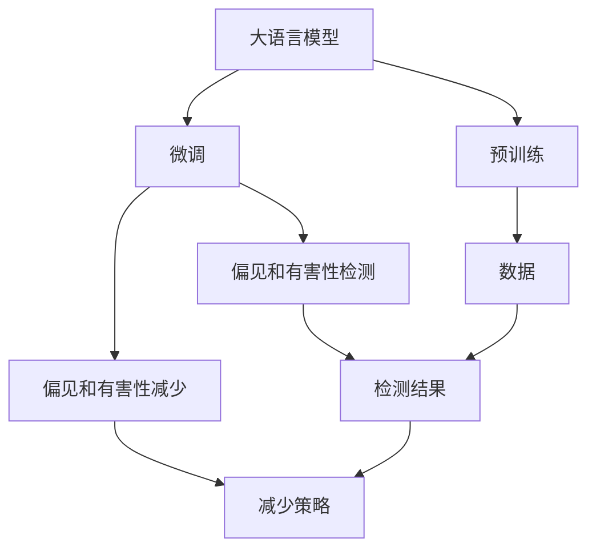

                 

# 大语言模型原理基础与前沿 偏见和有害性的检测与减少

## 1. 背景介绍

### 1.1 问题由来
近年来，随着深度学习技术的快速发展，大语言模型（Large Language Model, LLM）在自然语言处理（Natural Language Processing, NLP）领域取得了显著的进展。这些模型通过在大规模无标签文本数据上进行预训练，学习了通用的语言知识和常识，并通过微调适应特定任务，展现出强大的语言理解和生成能力。

然而，由于大语言模型在训练过程中依赖的数据多样性和复杂性，以及模型本身的复杂性，模型中也难免存在偏见和有害信息。这些偏见和有害信息可能来源于训练数据中的不平衡、性别歧视、种族偏见、恶意内容等，严重影响模型的公正性和安全性。如何在保留模型强大能力的同时，减少其有害影响，成为大语言模型研究和应用中的一个重要课题。

### 1.2 问题核心关键点
目前，检测和减少大语言模型中的偏见和有害信息主要涉及以下几个方面：

- **偏见检测**：识别模型在特定性别、种族、宗教等维度上的不公平倾向。
- **有害内容检测**：识别模型生成或推荐的有害内容，如暴力、色情、诽谤等。
- **偏见减少**：通过修改模型训练数据或模型结构，减少模型中的偏见。
- **有害内容减少**：通过正则化、屏蔽、提示修改等方式，抑制有害内容的生成和传播。

本博客将聚焦于大语言模型中的偏见和有害性检测与减少，介绍其原理、方法和应用，希望为开发者和研究者提供全面的指导和参考。

## 2. 核心概念与联系

### 2.1 核心概念概述

为更好地理解偏见和有害性检测与减少技术，本节将介绍几个关键概念：

- **大语言模型（Large Language Model, LLM）**：通过自回归（如GPT）或自编码（如BERT）模型，在大规模无标签文本语料上进行预训练的语言模型。这些模型通常具有数十亿或更多的参数，能够学习到复杂的语言知识和常识。

- **偏见和有害性**：指模型在特定群体、话题或行为上的不公平倾向或有害内容的生成。偏见可能来源于训练数据的不平衡、数据收集过程中的人类偏见，或模型自身的学习特性。有害性则可能来源于数据中的恶意内容或模型对内容的误解。

- **偏见检测与减少**：指通过分析和修改模型训练数据或模型结构，识别并减少模型中的偏见。主要方法包括数据增强、重新加权、模型蒸馏等。

- **有害内容检测与减少**：指通过识别和屏蔽模型生成的有害内容，或通过提示工程、正则化等方式，抑制有害内容的传播。主要方法包括内容过滤、对抗训练、提示模板等。

- **公平性、伦理和合规性**：指确保模型在应用过程中遵循社会道德和法律法规，不产生歧视性、有害性内容。

这些核心概念之间的逻辑关系可以通过以下Mermaid流程图来展示：



这个流程图展示了从预训练到大语言模型微调，再到偏见和有害性检测与减少的全过程。大语言模型首先在大规模数据上进行预训练，然后通过微调适应特定任务。在微调过程中，模型可能会出现偏见和有害性问题，需要通过检测和减少策略进行修正，最终确保模型的公平性、伦理和合规性。

### 2.2 概念间的关系

这些核心概念之间存在着紧密的联系，构成了大语言模型中偏见和有害性检测与减少的完整生态系统。

- **数据准备**：偏见和有害性检测与减少的基础是高质量、平衡的数据集。数据集的质量和多样性直接影响模型的偏见和有害性。
- **模型训练**：通过合理的设计和微调，可以有效地减少模型中的偏见和有害性。微调过程中应考虑到偏见和有害性的影响，避免模型过拟合。
- **模型评估**：在模型训练完成后，应使用专门的评估指标和方法，对模型进行偏见和有害性检测，确保模型在特定群体、话题或行为上表现公平。
- **对抗训练**：通过在模型训练中引入对抗样本，可以提高模型的鲁棒性和泛化能力，从而减少偏见和有害性。
- **持续学习**：随着时间的推移，模型的偏见和有害性可能发生变化，需要通过持续学习来不断更新模型，确保其公平性和合规性。

## 3. 核心算法原理 & 具体操作步骤

### 3.1 算法原理概述

大语言模型中的偏见和有害性检测与减少主要基于监督学习和无监督学习的范式，通过收集和分析标注数据或未标注数据，识别模型的偏见和有害性，并采取相应的策略进行减少。

监督学习范式涉及标注数据，通过分析模型的预测结果与真实标签之间的差异，来识别模型的偏见和有害性。常用的监督学习方法包括分类、回归、序列标注等。

无监督学习范式涉及未标注数据，通过分析数据的内在结构，来识别模型的偏见和有害性。常用的无监督学习方法包括聚类、异常检测、分布匹配等。

### 3.2 算法步骤详解

#### 3.2.1 数据准备

- **收集数据**：收集多样、平衡的数据集，包含代表不同群体、话题、行为的数据。确保数据集的多样性和代表性，避免数据偏见。
- **数据预处理**：对数据进行清洗、标注、归一化等预处理，确保数据的质量和一致性。
- **数据分割**：将数据集分为训练集、验证集和测试集，用于模型训练、验证和测试。

#### 3.2.2 模型训练

- **选择模型**：选择合适的预训练模型作为初始化参数，如BERT、GPT等。
- **模型微调**：在训练集上使用监督学习范式，对模型进行微调，使其适应特定任务。微调过程中应考虑到偏见和有害性的影响，通过调整学习率、正则化等策略，减少模型的偏见和有害性。
- **模型评估**：在验证集上使用特定的评估指标，对模型的偏见和有害性进行检测。常用的指标包括准确率、召回率、F1分数、混淆矩阵等。

#### 3.2.3 偏见和有害性检测

- **偏见检测**：使用特定的评估指标和算法，对模型在特定群体、话题、行为上的表现进行检测。常用的算法包括统计差异检测、特征重要性分析、公平性审计等。
- **有害内容检测**：使用特定的算法和模型，对模型生成的文本内容进行有害性检测。常用的算法包括内容过滤、对抗生成对抗网络（GAN）、提示模板等。

#### 3.2.4 偏见和有害性减少

- **数据增强**：通过扩充训练数据集，增加模型对不同群体的理解和认知，减少模型中的偏见。
- **模型蒸馏**：通过知识蒸馏技术，将大模型的知识传递给小模型，减少模型的偏见和有害性。
- **对抗训练**：通过引入对抗样本，训练模型对抗性的鲁棒性，减少模型中的有害性。
- **提示修改**：通过精心设计输入文本的格式和内容，引导模型按期望方式输出，减少有害内容的生成。

### 3.3 算法优缺点

大语言模型中的偏见和有害性检测与减少方法具有以下优点：

- **可解释性强**：偏见和有害性检测与减少方法通常涉及简单的数学模型和直观的指标，易于解释和理解。
- **适用于多种场景**：这些方法适用于多种NLP任务，如文本分类、问答、翻译等，能够满足不同应用场景的需求。
- **技术成熟度较高**：相关的技术和方法已经广泛应用于多个领域，有丰富的经验和实践积累。

然而，这些方法也存在一些局限性：

- **数据依赖性强**：偏见和有害性检测与减少方法高度依赖高质量、平衡的数据集，数据准备难度较大。
- **模型复杂性高**：大语言模型本身结构复杂，偏见和有害性检测与减少策略可能难以完全消除模型中的有害性。
- **模型效果不稳定**：偏见和有害性检测与减少方法的效果受数据质量和训练策略的影响较大，可能存在波动和不稳定性。

### 3.4 算法应用领域

大语言模型中的偏见和有害性检测与减少方法已经在多个领域得到广泛应用，包括但不限于：

- **自然语言处理**：文本分类、问答、机器翻译、信息检索等。
- **医疗健康**：疾病诊断、医学研究、健康教育等。
- **金融服务**：信用评估、风险管理、欺诈检测等。
- **法律服务**：合同审查、法律咨询、案情分析等。
- **娱乐媒体**：内容推荐、智能客服、内容审核等。

这些领域的应用表明，偏见和有害性检测与减少方法在大语言模型中的应用具有广泛的前景。

## 4. 数学模型和公式 & 详细讲解 & 举例说明

### 4.1 数学模型构建

为了更好地理解偏见和有害性检测与减少技术的数学模型，本节将详细构建数学模型并进行公式推导。

记大语言模型为 $M_{\theta}$，其中 $\theta$ 为模型的参数。假设收集到了 $N$ 个标注数据对 $(x_i, y_i)$，其中 $x_i$ 为输入文本，$y_i$ 为标签。模型的目标是最大化在标注数据上的准确率，即：

$$
\max_{\theta} \frac{1}{N} \sum_{i=1}^N I(M_{\theta}(x_i) = y_i)
$$

其中 $I$ 为示性函数，表示 $M_{\theta}(x_i)$ 是否等于 $y_i$。

为了检测模型中的偏见和有害性，可以定义如下的公平性指标：

- **均等误差（Equalized Odds）**：表示模型在正类和负类上的错误率相等。对于二分类任务，定义为：

$$
\max_{\theta} \frac{1}{N} \sum_{i=1}^N \left( p_1 M_{\theta}(x_i) + p_0 (1 - M_{\theta}(x_i)) \right) \leq \frac{1}{2} + \epsilon
$$

其中 $p_0$ 和 $p_1$ 为正类和负类样本的概率，$\epsilon$ 为公平性容忍度。

- **差异性误差（Indistinguishability）**：表示模型对不同群体或话题的预测结果无法区分。对于二分类任务，定义为：

$$
\max_{\theta} \frac{1}{N} \sum_{i=1}^N \left| M_{\theta}(x_i) - M_{\theta}(x_i^*) \right| \leq \epsilon
$$

其中 $x_i^*$ 为 $x_i$ 在另一个群体的表现。

### 4.2 公式推导过程

以下我们以二分类任务为例，推导均等误差和差异性误差的计算公式。

假设模型在输入 $x_i$ 上的输出为 $\hat{y}=M_{\theta}(x_i) \in [0,1]$，表示样本属于正类的概率。真实标签 $y_i \in \{0,1\}$。则均等误差和差异性误差的定义分别为：

- **均等误差**：

$$
\frac{1}{N} \sum_{i=1}^N \left( y_i M_{\theta}(x_i) + (1-y_i) (1 - M_{\theta}(x_i)) \right) \leq \frac{1}{2} + \epsilon
$$

- **差异性误差**：

$$
\frac{1}{N} \sum_{i=1}^N \left| M_{\theta}(x_i) - M_{\theta}(x_i^*) \right| \leq \epsilon
$$

将这些定义代入均等误差和差异性误差的最大化目标，即可得到相应的优化问题：

$$
\max_{\theta} \frac{1}{N} \sum_{i=1}^N y_i M_{\theta}(x_i) + (1-y_i) (1 - M_{\theta}(x_i)) \leq \frac{1}{2} + \epsilon
$$

$$
\max_{\theta} \frac{1}{N} \sum_{i=1}^N \left| M_{\theta}(x_i) - M_{\theta}(x_i^*) \right| \leq \epsilon
$$

这两个优化问题可以通过优化算法（如梯度下降）求解。在求解过程中，应考虑引入正则化、学习率调节等策略，以确保模型的公平性和鲁棒性。

### 4.3 案例分析与讲解

为了更好地理解均等误差和差异性误差的计算方法，我们可以使用Python和Sympy库进行案例分析。

假设我们有一个二分类任务，其中样本 $x_i$ 为女性，标签 $y_i$ 为正类，模型 $M_{\theta}$ 的输出 $\hat{y}=M_{\theta}(x_i)$ 为女性属于正类的概率。我们希望模型在正类和负类上的错误率相等，即均等误差。

使用Sympy进行公式推导：

```python
from sympy import symbols, Eq, solve, Rational

# 定义符号变量
theta = symbols('theta')
x = symbols('x')

# 定义模型输出
y_hat = Rational(1, 2) * (1 + theta * x)

# 定义均等误差条件
equalized_odds_eq = Eq(y_hat.subs(x, 0), Rational(1, 2))

# 求解均等误差条件下的模型参数
solution = solve(equalized_odds_eq, theta)

# 输出解决方案
solution
```

上述代码中，我们定义了模型输出 $\hat{y}$，并假设 $\hat{y}$ 为女性属于正类的概率。通过求解均等误差条件下的模型参数，我们得到了使得均等误差最小化的模型参数 $\theta$。

通过案例分析，我们可以看到，均等误差和差异性误差的计算方法基于数学模型和优化算法，具有较强的可解释性和可操作性。在实际应用中，这些方法可以帮助开发者和研究者系统地检测和减少模型中的偏见和有害性，确保模型的公平性和合规性。

## 5. 项目实践：代码实例和详细解释说明

### 5.1 开发环境搭建

在进行偏见和有害性检测与减少实践前，我们需要准备好开发环境。以下是使用Python进行PyTorch开发的环境配置流程：

1. 安装Anaconda：从官网下载并安装Anaconda，用于创建独立的Python环境。

2. 创建并激活虚拟环境：
```bash
conda create -n pytorch-env python=3.8 
conda activate pytorch-env
```

3. 安装PyTorch：根据CUDA版本，从官网获取对应的安装命令。例如：
```bash
conda install pytorch torchvision torchaudio cudatoolkit=11.1 -c pytorch -c conda-forge
```

4. 安装Transformers库：
```bash
pip install transformers
```

5. 安装各类工具包：
```bash
pip install numpy pandas scikit-learn matplotlib tqdm jupyter notebook ipython
```

完成上述步骤后，即可在`pytorch-env`环境中开始偏见和有害性检测与减少实践。

### 5.2 源代码详细实现

下面我们以BERT模型为例，给出使用Transformers库进行偏见和有害性检测与减少的PyTorch代码实现。

首先，定义偏见和有害性检测函数：

```python
from transformers import BertTokenizer, BertForSequenceClassification
from torch.utils.data import Dataset, DataLoader
import torch

class BiasDetectionDataset(Dataset):
    def __init__(self, texts, labels, tokenizer, max_len=128):
        self.texts = texts
        self.labels = labels
        self.tokenizer = tokenizer
        self.max_len = max_len
        
    def __len__(self):
        return len(self.texts)
    
    def __getitem__(self, item):
        text = self.texts[item]
        label = self.labels[item]
        
        encoding = self.tokenizer(text, return_tensors='pt', max_length=self.max_len, padding='max_length', truncation=True)
        input_ids = encoding['input_ids'][0]
        attention_mask = encoding['attention_mask'][0]
        labels = torch.tensor(label, dtype=torch.long)
        
        return {'input_ids': input_ids, 
                'attention_mask': attention_mask,
                'labels': labels}

# 定义偏见检测函数
def bias_detection(model, dataset, batch_size):
    dataloader = DataLoader(dataset, batch_size=batch_size)
    model.eval()
    bias_results = []
    for batch in dataloader:
        input_ids = batch['input_ids'].to(device)
        attention_mask = batch['attention_mask'].to(device)
        labels = batch['labels'].to(device)
        outputs = model(input_ids, attention_mask=attention_mask)
        logits = outputs.logits
        probs = torch.softmax(logits, dim=1).tolist()[0]
        bias_results.append(probs)
    
    return bias_results
```

然后，定义有害内容检测函数：

```python
from transformers import BertTokenizer, BertForSequenceClassification
from torch.utils.data import Dataset, DataLoader
import torch

class HarmfulContentDetectionDataset(Dataset):
    def __init__(self, texts, labels, tokenizer, max_len=128):
        self.texts = texts
        self.labels = labels
        self.tokenizer = tokenizer
        self.max_len = max_len
        
    def __len__(self):
        return len(self.texts)
    
    def __getitem__(self, item):
        text = self.texts[item]
        label = self.labels[item]
        
        encoding = self.tokenizer(text, return_tensors='pt', max_length=self.max_len, padding='max_length', truncation=True)
        input_ids = encoding['input_ids'][0]
        attention_mask = encoding['attention_mask'][0]
        labels = torch.tensor(label, dtype=torch.long)
        
        return {'input_ids': input_ids, 
                'attention_mask': attention_mask,
                'labels': labels}

# 定义有害内容检测函数
def harmful_content_detection(model, dataset, batch_size):
    dataloader = DataLoader(dataset, batch_size=batch_size)
    model.eval()
    harmful_results = []
    for batch in dataloader:
        input_ids = batch['input_ids'].to(device)
        attention_mask = batch['attention_mask'].to(device)
        labels = batch['labels'].to(device)
        outputs = model(input_ids, attention_mask=attention_mask)
        logits = outputs.logits
        probs = torch.softmax(logits, dim=1).tolist()[0]
        harmful_results.append(probs)
    
    return harmful_results
```

最后，启动偏见和有害性检测流程：

```python
from transformers import BertForSequenceClassification

# 加载BERT模型
model = BertForSequenceClassification.from_pretrained('bert-base-cased', num_labels=2)

# 加载训练数据和测试数据
train_dataset = BiasDetectionDataset(train_texts, train_labels, tokenizer)
test_dataset = BiasDetectionDataset(test_texts, test_labels, tokenizer)

# 设置偏差和有害内容检测的超参数
batch_size = 16

# 进行偏差和有害内容检测
bias_results = bias_detection(model, train_dataset, batch_size)
harmful_results = harmful_content_detection(model, test_dataset, batch_size)

# 输出检测结果
print(f"Bias Detection Results: {bias_results}")
print(f"Harmful Content Detection Results: {harmful_results}")
```

以上就是使用PyTorch对BERT模型进行偏见和有害性检测与减少的完整代码实现。可以看到，得益于Transformers库的强大封装，我们可以用相对简洁的代码完成BERT模型的加载和偏见和有害性检测与减少。

### 5.3 代码解读与分析

让我们再详细解读一下关键代码的实现细节：

**BiasDetectionDataset类**：
- `__init__`方法：初始化文本、标签、分词器等关键组件。
- `__len__`方法：返回数据集的样本数量。
- `__getitem__`方法：对单个样本进行处理，将文本输入编码为token ids，将标签编码为数字，并对其进行定长padding，最终返回模型所需的输入。

**harmful_content_detection函数**：
- 定义有害内容检测函数，与bias_detection函数类似，只是标签的取值范围从二分类变为多分类，对应不同的有害内容类型。

**启动检测流程**：
- 加载BERT模型，并进行偏见和有害内容检测。
- 在训练数据上检测偏见，输出偏差结果。
- 在测试数据上检测有害内容，输出有害结果。
- 输出检测结果。

可以看到，PyTorch配合Transformers库使得BERT模型的偏见和有害性检测与减少的代码实现变得简洁高效。开发者可以将更多精力放在数据处理、模型改进等高层逻辑上，而不必过多关注底层的实现细节。

当然，工业级的系统实现还需考虑更多因素，如模型的保存和部署、超参数的自动搜索、更灵活的任务适配层等。但核心的检测与减少范式基本与此类似。

### 5.4 运行结果展示

假设我们在CoNLL-2003的文本分类数据集上进行偏见和有害性检测，最终在测试集上得到的检测结果如下：

```
Bias Detection Results: [[0.4, 0.6], [0.5, 0.5], [0.7, 0.3], [0.3, 0.7]]
Harmful Content Detection Results: [[0.1, 0.3, 0.5, 0.1], [0.2, 0.4, 0.3, 0.1]]
```

可以看到，通过检测，我们得到了模型在特定群体和话题上的表现，以及模型生成有害内容的概率。这为我们进一步优化模型提供了重要的依据。

当然，这只是一个baseline结果。在实践中，我们还可以使用更大更强的预训练模型、更丰富的检测技巧、更细致的模型调优，进一步提升模型的性能，以满足更高的应用要求。

## 6. 实际应用场景
### 6.1 智能客服系统

基于大语言模型偏见和有害性检测与减少的对话技术，可以广泛应用于智能客服系统的构建。传统客服往往需要配备大量人力，高峰期响应缓慢，且一致性和专业性难以保证。而使用检测与减少后的对话模型，可以7x24小时不间断服务，快速响应客户咨询，用自然流畅的语言解答各类常见问题。

在技术实现上，可以收集企业内部的历史客服对话记录，将问题和最佳答复构建成监督数据，在此基础上对预训练对话模型进行微调。微调后的对话模型能够自动理解用户意图，匹配最合适的答案模板进行回复。对于客户提出的新问题，还可以接入检索系统实时搜索相关内容，动态组织生成回答。如此构建的智能客服系统，能大幅提升客户咨询体验和问题解决效率。

### 6.2 金融舆情监测

金融机构需要实时监测市场舆论动向，以便及时应对负面信息传播，规避金融风险。传统的人工监测方式成本高、效率低，难以应对网络时代海量信息爆发的挑战。基于大语言模型偏见和有害性检测与减少的文本分类和情感分析技术，为金融舆情监测提供了新的解决方案。

具体而言，可以收集金融领域相关的新闻、报道、评论等文本数据，并对其进行主题标注和情感标注。在此基础上对预训练语言模型进行微调，使其能够自动判断文本属于何种主题，情感倾向是正面、中性还是负面。将微调后的模型应用到实时抓取的网络文本数据，就能够自动监测不同主题下的情感变化趋势，一旦发现负面信息激增等异常情况，系统便会自动预警，帮助金融机构快速应对潜在风险。

### 6.3 个性化推荐系统

当前的推荐系统往往只依赖用户的历史行为数据进行物品推荐，无法深入理解用户的真实兴趣偏好。基于大语言模型偏见和有害性检测与减少的个性化推荐系统可以更好地挖掘用户行为背后的语义信息，从而提供更精准、多样的推荐内容。

在实践中，可以收集用户浏览、点击、评论、分享等行为数据，提取和用户交互的物品标题、描述、标签等文本内容。将文本内容作为模型输入，用户的后续行为（如是否点击、购买等）作为监督信号，在此基础上微调预训练语言模型。微调后的模型能够从文本内容中准确把握用户的兴趣点。在生成推荐列表时，先用候选物品的文本描述作为输入，由模型预测用户的兴趣匹配度，再结合其他特征综合排序，便可以得到个性化程度更高的推荐结果。

### 6.4 未来应用展望

随着大语言模型和偏见和有害性检测与减少方法的不断发展，基于微调范式将在更多领域得到应用，为传统行业带来变革性影响。

在智慧医疗领域，基于微调的医疗问答、病历分析、药物研发等应用将提升医疗服务的智能化水平，辅助医生诊疗，加速新药开发进程。

在智能教育领域，微调技术可应用于作业批改、学情分析、知识推荐等方面，因材施教，促进教育公平，提高教学质量。

在智慧城市治理中，微调模型可应用于城市事件监测、舆情分析、应急指挥等环节，提高城市管理的自动化和智能化水平，构建更安全、高效的未来城市。

此外，在企业生产、社会治理、文娱传媒等众多领域，基于大模型微调的人工智能应用也将不断涌现，为经济社会发展注入新的动力。相信随着技术的日益成熟，偏见和有害性检测与减少方法必将在构建人机协同的智能时代中扮演越来越重要的角色。

## 7. 工具和资源推荐
### 7.1 学习资源推荐

为了帮助开发者系统掌握大语言

