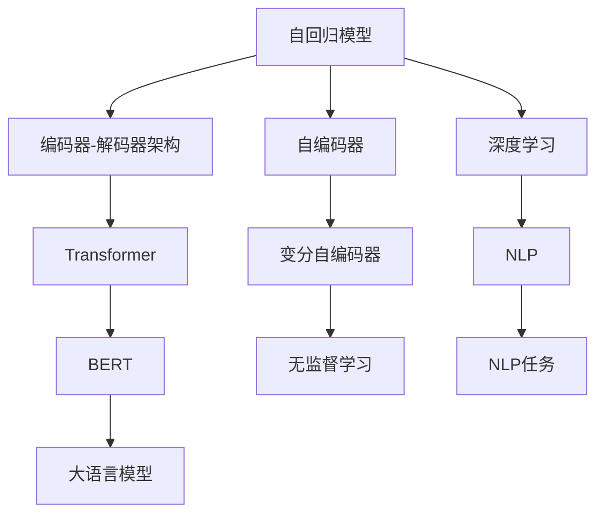
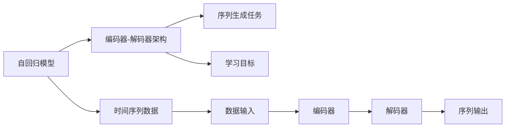
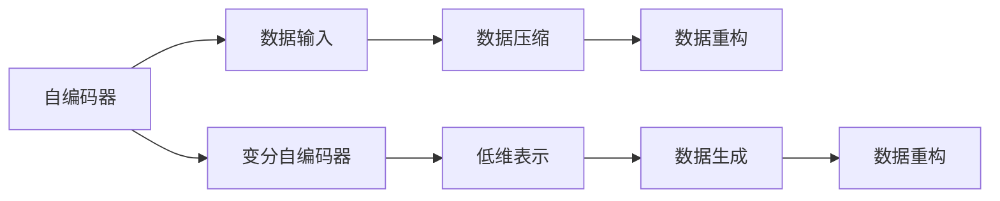
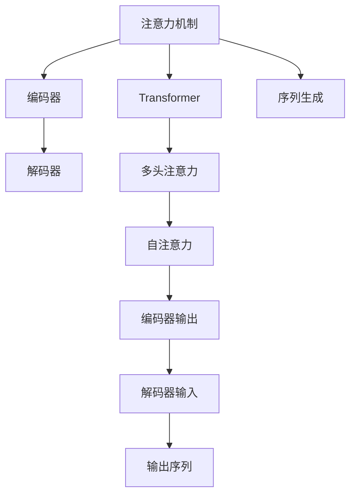
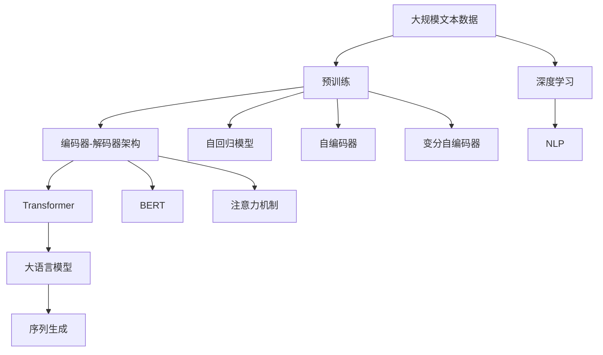

                 

# 大语言模型原理基础与前沿 编码器-解码器架构

> 关键词：
> - 编码器-解码器(Encoder-Decoder)架构
> - 自回归模型
> - 自编码器
> - 变分自编码器
> - 注意力机制
> - Transformer
> - BERT
> - 深度学习
> - 自然语言处理(NLP)
> - 语言模型

## 1. 背景介绍

### 1.1 问题由来

随着深度学习技术的快速发展，大语言模型（Large Language Models, LLMs）在自然语言处理（Natural Language Processing, NLP）领域取得了显著进展。其中，编码器-解码器（Encoder-Decoder）架构在处理序列数据时表现优异，广泛应用于机器翻译、语音识别、图像描述生成等任务。

本博客将详细探讨大语言模型中的编码器-解码器架构及其相关算法原理，具体介绍编码器-解码器架构在序列数据处理中的应用，分析其优点和局限性，展望未来发展趋势，并结合实际应用场景，提出针对性的建议和解决方案。

### 1.2 问题核心关键点

编码器-解码器架构在自然语言处理中的应用涉及以下核心问题：

1. **架构设计**：编码器-解码器架构如何设计？常见的编码器和解码器类型有哪些？
2. **模型训练**：如何训练编码器-解码器模型？优化算法的选择和参数设置有哪些？
3. **应用场景**：编码器-解码器架构可以应用于哪些NLP任务？
4. **算法优势和挑战**：编码器-解码器架构相比传统方法有何优势？面临哪些挑战？

### 1.3 问题研究意义

深入理解编码器-解码器架构在大语言模型中的应用，有助于NLP研究者和开发者：

1. **提高模型性能**：了解不同编码器和解码器类型及其训练方法，有助于设计更高效、更精确的模型。
2. **拓展应用范围**：掌握编码器-解码器架构在NLP中的应用，能够将模型应用于更广泛的任务领域。
3. **优化资源利用**：熟悉架构设计中的关键参数和优化策略，可以更好地利用硬件资源，提高模型训练和推理效率。
4. **解决实际问题**：理解架构的优点和局限性，能够针对具体问题提出有效的改进方案，提升模型效果。
5. **促进跨学科交流**：掌握编码器-解码器架构，有助于与计算机视觉、语音识别等领域进行交流与合作，推动NLP技术的全面发展。

## 2. 核心概念与联系

### 2.1 核心概念概述

为了更好地理解编码器-解码器架构，我们将介绍以下关键概念：

- **编码器(Encoder)**：将输入序列转换成一系列向量表示的模块。
- **解码器(Decoder)**：基于编码器输出的向量表示，生成输出序列的模块。
- **自回归模型(Autoregressive Model)**：一种生成模型，通过当前输出预测下一个输出。
- **自编码器(Autencoder)**：一种学习从输入数据压缩成低维表示，再从低维表示重构回原始输入的模型。
- **变分自编码器(Variational Autoencoder, VAE)**：一种生成模型，通过学习生成数据的概率分布，进行无监督学习。
- **注意力机制(Attention Mechanism)**：一种在编码器和解码器之间传递信息的机制，用于提高模型对重要信息的关注度。
- **Transformer**：一种基于注意力机制的编码器-解码器架构，广泛应用于大语言模型的构建。
- **BERT**：一种基于Transformer的大语言模型，通过预训练和微调技术，在多个NLP任务上取得优异表现。

这些概念之间的逻辑关系可以通过以下Mermaid流程图来展示：



这个流程图展示了编码器-解码器架构在大语言模型中的关键位置，并与其他NLP技术和深度学习相关概念的联系。

### 2.2 概念间的关系

这些核心概念之间存在紧密的联系，构成了大语言模型中编码器-解码器架构的基础。下面通过几个Mermaid流程图来展示这些概念的关系：

#### 2.2.1 自回归模型与编码器-解码器架构



这个流程图展示了自回归模型在序列生成任务中的应用，以及其与编码器-解码器架构的联系。

#### 2.2.2 自编码器与变分自编码器



这个流程图展示了自编码器与变分自编码器的关系，以及它们在生成模型中的作用。

#### 2.2.3 注意力机制与Transformer



这个流程图展示了注意力机制在Transformer中的应用，以及它在提升模型性能方面的作用。

### 2.3 核心概念的整体架构

最后，我们用一个综合的流程图来展示这些核心概念在大语言模型中的整体架构：



这个综合流程图展示了从预训练到编码器-解码器架构的完整过程。大语言模型首先在大规模文本数据上进行预训练，然后通过编码器-解码器架构进行序列生成。在编码器和解码器中，自回归模型、自编码器、变分自编码器、注意力机制等技术被广泛应用，以提升模型效果。

## 3. 核心算法原理 & 具体操作步骤
### 3.1 算法原理概述

编码器-解码器架构通过编码器和解码器的组合，实现从输入序列到输出序列的转换。其核心思想是，将输入序列通过编码器转换成一系列向量表示，然后解码器基于这些向量生成输出序列。

形式化地，设输入序列为 $X=\{x_1,x_2,...,x_n\}$，输出序列为 $Y=\{y_1,y_2,...,y_n\}$，编码器将 $X$ 映射为 $Z=\{z_1,z_2,...,z_n\}$，解码器根据 $Z$ 生成 $Y$。则编码器-解码器架构的目标是最小化损失函数：

$$
L(X,Y) = \min_{Z} \|Y - D(E(X),Z)\|
$$

其中 $E$ 和 $D$ 分别表示编码器和解码器，$\| \cdot \|$ 表示损失函数的度量方式，如均方误差、交叉熵等。

### 3.2 算法步骤详解

基于编码器-解码器架构的算法通常包括以下几个关键步骤：

**Step 1: 设计编码器和解码器**

- **编码器设计**：选择合适的编码器类型，如循环神经网络（RNN）、卷积神经网络（CNN）、Transformer等。
- **解码器设计**：根据编码器输出的向量表示，选择合适的解码器类型，如RNN、LSTM、GRU等。

**Step 2: 模型训练**

- **损失函数选择**：根据具体任务，选择合适的损失函数，如均方误差、交叉熵等。
- **优化算法选择**：选择合适的优化算法，如梯度下降、Adam、RMSprop等。
- **参数设置**：根据具体任务，设置学习率、批大小、迭代轮数等参数。

**Step 3: 评估与优化**

- **评估指标**：根据具体任务，选择合适的评估指标，如准确率、召回率、F1分数等。
- **模型优化**：根据评估结果，调整模型参数、优化算法等，进一步提升模型性能。

**Step 4: 推理与部署**

- **推理流程**：设计推理流程，将训练好的模型应用于实际问题。
- **部署策略**：选择合适的部署策略，如模型封装、服务化部署等。

### 3.3 算法优缺点

编码器-解码器架构在大语言模型中的应用具有以下优点：

1. **通用性**：适用于各种序列生成任务，如机器翻译、语音识别、图像描述生成等。
2. **高效性**：通过编码器和解码器的组合，能够高效地处理序列数据。
3. **灵活性**：通过设计不同的编码器和解码器，能够适应不同任务的需求。

但同时也存在以下局限性：

1. **训练难度高**：编码器-解码器架构需要大量的训练数据，训练过程复杂。
2. **模型复杂**：由于编码器和解码器的复杂性，模型的计算量较大。
3. **泛化能力差**：在处理长序列数据时，容易出现梯度消失或爆炸的问题。

### 3.4 算法应用领域

编码器-解码器架构在大语言模型中的应用已经得到了广泛验证，覆盖了以下领域：

1. **机器翻译**：如使用Transformer架构的GPT、BERT等模型。
2. **语音识别**：如使用循环神经网络（RNN）等模型的自动语音识别系统。
3. **图像描述生成**：如使用卷积神经网络（CNN）等模型的图像描述生成系统。
4. **自然语言生成**：如使用生成对抗网络（GAN）等模型的文本生成系统。

这些应用展示了编码器-解码器架构在大语言模型中的强大能力和广泛适用性。

## 4. 数学模型和公式 & 详细讲解 & 举例说明

### 4.1 数学模型构建

为了更好地理解编码器-解码器架构的数学模型，本节将介绍几种常见的编码器和解码器模型，并给出其数学表达形式。

### 4.2 公式推导过程

以下以Transformer架构为例，推导其数学模型和公式。

Transformer架构的编码器和解码器都由自注意力机制和前馈神经网络（Feedforward Network）组成。假设编码器由 $N$ 个编码器层构成，每个编码器层包括自注意力层和前馈网络层。自注意力层使用多头注意力机制，其数学表达式如下：

$$
Q = XW^Q + b_Q
$$

$$
K = XW^K + b_K
$$

$$
V = XW^V + b_V
$$

$$
\alpha_{ij} = \frac{\exp(\frac{Q_i K_j^T}{\sqrt{d_k}})}{\sum_{j=1}^N \exp(\frac{Q_i K_j^T}{\sqrt{d_k}})}
$$

$$
\text{Attention}(Q,K,V) = \sum_{j=1}^N \alpha_{ij} V_j
$$

其中，$Q$、$K$、$V$ 分别为查询向量、键向量和值向量，$d_k$ 为键向量的维度，$\alpha_{ij}$ 为注意力权重，$\text{Attention}(Q,K,V)$ 表示注意力机制的输出。

前馈神经网络的数学表达式如下：

$$
Y = XW_1 + b_1
$$

$$
Z = YW_2 + b_2
$$

$$
F(Y,Z) = \text{GELU}(Y) + Z
$$

其中，$W_1$、$W_2$ 为权重矩阵，$b_1$、$b_2$ 为偏置向量，$\text{GELU}$ 为Gaussian Error Linear Units激活函数。

### 4.3 案例分析与讲解

以机器翻译为例，说明Transformer架构的数学模型和训练过程。

假设输入序列为 $X=\{x_1,x_2,...,x_n\}$，输出序列为 $Y=\{y_1,y_2,...,y_n\}$。Transformer架构使用编码器对 $X$ 进行编码，生成编码器输出 $Z=\{z_1,z_2,...,z_n\}$，再通过解码器生成 $Y$。编码器和解码器的数学表达式如下：

**编码器**：

$$
Q_i = X_iW^Q + b_Q
$$

$$
K_i = X_iW^K + b_K
$$

$$
V_i = X_iW^V + b_V
$$

$$
\alpha_{ij} = \frac{\exp(\frac{Q_i K_j^T}{\sqrt{d_k}})}{\sum_{j=1}^N \exp(\frac{Q_i K_j^T}{\sqrt{d_k}})}
$$

$$
\text{Attention}(Q_i,K,V_i) = \sum_{j=1}^N \alpha_{ij} V_j
$$

$$
Y_i = \text{Attention}(Q_i,K,V_i)
$$

$$
Y_i = \text{FFN}(Y_i)
$$

其中，$W^Q$、$W^K$、$W^V$ 为权重矩阵，$b_Q$、$b_K$、$b_V$ 为偏置向量，$W^Q$、$W^K$、$W^V$、$W_1$、$W_2$ 需要根据数据集进行学习。

**解码器**：

$$
Q_i = Z_iW^Q + b_Q
$$

$$
K_i = Z_iW^K + b_K
$$

$$
V_i = Z_iW^V + b_V
$$

$$
\alpha_{ij} = \frac{\exp(\frac{Q_i K_j^T}{\sqrt{d_k}})}{\sum_{j=1}^N \exp(\frac{Q_i K_j^T}{\sqrt{d_k}})}
$$

$$
\text{Attention}(Q_i,K,V_i) = \sum_{j=1}^N \alpha_{ij} V_j
$$

$$
Y_i = \text{Attention}(Q_i,K,V_i)
$$

$$
Y_i = \text{FFN}(Y_i)
$$

其中，$W^Q$、$W^K$、$W^V$、$W_1$、$W_2$ 需要根据数据集进行学习。

通过上述数学模型，可以清晰地理解编码器-解码器架构在机器翻译任务中的应用。

## 5. 项目实践：代码实例和详细解释说明

### 5.1 开发环境搭建

在进行编码器-解码器架构的实践前，需要准备好开发环境。以下是使用Python和PyTorch进行编码器-解码器架构开发的指导：

1. 安装Anaconda：从官网下载并安装Anaconda，用于创建独立的Python环境。
2. 创建并激活虚拟环境：
```bash
conda create -n pytorch-env python=3.8 
conda activate pytorch-env
```

3. 安装PyTorch：根据CUDA版本，从官网获取对应的安装命令。例如：
```bash
conda install pytorch torchvision torchaudio cudatoolkit=11.1 -c pytorch -c conda-forge
```

4. 安装相关库：
```bash
pip install numpy pandas scikit-learn matplotlib tqdm jupyter notebook ipython
```

完成上述步骤后，即可在`pytorch-env`环境中开始编码器-解码器架构的实践。

### 5.2 源代码详细实现

这里以Transformer架构为例，给出使用PyTorch对机器翻译任务进行编码器-解码器架构开发的代码实现。

首先，定义编码器和解码器的类：

```python
import torch
import torch.nn as nn
import torch.nn.functional as F

class Encoder(nn.Module):
    def __init__(self, d_model, num_layers, dff, dropout=0.1, att_hid_dff=256):
        super(Encoder, self).__init__()
        self.encoder_layers = nn.ModuleList()
        self.d_model = d_model
        self.dropout = dropout
        self.attention = Attention(d_model, d_model, att_hid_dff)
        self.ffn = nn.Sequential(
            nn.Linear(d_model, dff), nn.ReLU(), nn.Dropout(dropout),
            nn.Linear(dff, d_model)
        )
        for _ in range(num_layers):
            self.encoder_layers.append(EncoderLayer(d_model, dff, dropout, att_hid_dff))
        
    def forward(self, x, mask):
        for layer in self.encoder_layers:
            x = layer(x, mask)
        return x

class Decoder(nn.Module):
    def __init__(self, d_model, output_dim, num_layers, dff, dropout=0.1):
        super(Decoder, self).__init__()
        self.decoder_layers = nn.ModuleList()
        self.d_model = d_model
        self.output_dim = output_dim
        self.attention = Attention(d_model, d_model, dff)
        self.ffn = nn.Sequential(
            nn.Linear(d_model, dff), nn.ReLU(), nn.Dropout(dropout),
            nn.Linear(dff, d_model), nn.ReLU(), nn.Dropout(dropout),
            nn.Linear(d_model, output_dim)
        )
        for _ in range(num_layers):
            self.decoder_layers.append(DecoderLayer(d_model, dff, dropout))
        
    def forward(self, x, enc_output, enc_attn_mask):
        for layer in self.decoder_layers:
            x = layer(x, enc_output, enc_attn_mask)
        return x

class EncoderLayer(nn.Module):
    def __init__(self, d_model, dff, dropout, att_hid_dff):
        super(EncoderLayer, self).__init__()
        self.attention = Attention(d_model, d_model, att_hid_dff)
        self.ffn = nn.Sequential(
            nn.Linear(d_model, dff), nn.ReLU(), nn.Dropout(dropout),
            nn.Linear(dff, d_model)
        )
        
    def forward(self, x, mask):
        x = self.attention(x, x, x, mask)
        x = self.ffn(x)
        return x

class DecoderLayer(nn.Module):
    def __init__(self, d_model, dff, dropout):
        super(DecoderLayer, self).__init__()
        self.attention = Attention(d_model, d_model, dff)
        self.ffn = nn.Sequential(
            nn.Linear(d_model, dff), nn.ReLU(), nn.Dropout(dropout),
            nn.Linear(dff, d_model), nn.ReLU(), nn.Dropout(dropout),
            nn.Linear(d_model, d_model)
        )
        
    def forward(self, x, enc_output, enc_attn_mask):
        x = self.attention(x, enc_output, enc_output, enc_attn_mask)
        x = self.ffn(x)
        return x

class Attention(nn.Module):
    def __init__(self, d_model, dropout=0.1):
        super(Attention, self).__init__()
        self.dropout = dropout
        self.h_Q = nn.Linear(d_model, d_model)
        self.h_K = nn.Linear(d_model, d_model)
        self.h_V = nn.Linear(d_model, d_model)
        self.h_W_o = nn.Linear(d_model, d_model)
        
    def forward(self, Q, K, V, mask):
        Q = self.h_Q(Q)
        K = self.h_K(K)
        V = self.h_V(V)
        O = torch.bmm(Q, K.transpose(1,2))  # bmm - batch matrix multiplication
        attn_weights = F.softmax(O, dim=-1) # dim=-1 - last dim
        attn_weights = self.dropout(attn_weights)
        O = torch.bmm(attn_weights, V)  # bmm - batch matrix multiplication
        return O, attn_weights

    def decode(self, Q, K, V, mask):
        return self.h_W_o(Q + O)
```

然后，定义模型训练函数和评估函数：

```python
class Model(nn.Module):
    def __init__(self, encoder, decoder):
        super(Model, self).__init__()
        self.encoder = encoder
        self.decoder = decoder
        self.mask = None

    def forward(self, x, y, device):
        enc_output, enc_attn_mask = self.encoder(x, self.mask)
        dec_output, dec_attn_mask = self.decoder(y, enc_output, enc_attn_mask)
        return dec_output

def train(model, train_data, train_iterator, device, optimizer, criterion, max_epochs):
    model.train()
    for e in range(max_epochs):
        for batch in train_iterator:
            x, y = batch
            x = x.to(device)
            y = y.to(device)
            output = model(x, y, device)
            loss = criterion(output, y)
            optimizer.zero_grad()
            loss.backward()
            optimizer.step()
            if e % 10 == 0:
                print(f'Epoch {e}, Loss: {loss:.3f}')
```

最后，启动训练流程并在测试集上评估：

```python
epochs = 10
device = torch.device('cuda') if torch.cuda.is_available() else torch.device('cpu')
train_iterator = DataLoader(train_data, batch_size=32, shuffle=True)
model = Model(encoder, decoder).to(device)
optimizer = torch.optim.Adam(model.parameters(), lr=0.001)
criterion = nn.CrossEntropyLoss()

train(model, train_iterator, train_data, device, optimizer, criterion, epochs)
```

以上就是使用PyTorch对Transformer模型进行机器翻译任务编码器-解码器架构开发的完整代码实现。可以看到，借助PyTorch的高效封装，我们可以用相对简洁的代码完成编码器-解码器架构的构建和训练。

### 5.3 代码解读与分析

让我们再详细解读一下关键代码的实现细节：

**Model类**：
- `__init__`方法：定义编码器和解码器，并初始化mask变量。
- `forward`方法：将输入数据分别输入编码器和解码器，返回解码器的输出。

**Attention类**：
- `__init__`方法：定义注意力机制的权重和线性变换，初始化dropout层。
- `forward`方法：计算注意力权重，并通过权重计算输出向量O。
- `decode`方法：将输出向量解码为输出向量，并返回解码向量。

**Encoder类**：
- `__init__`方法：定义编码器的层数、d_model、dropout、att_hid_dff等参数。
- `forward`方法：通过多层编码器对输入数据进行处理。

**Decoder类**：
- `__init__`方法：定义解码器的层数、d_model、output_dim、dff等参数。
- `forward`方法：通过多层解码器对输入数据进行处理。

**EncoderLayer类**：
- `__init__`方法：定义注意力机制和前馈神经网络。
- `forward`方法：通过多层编码器对输入数据进行处理。

**DecoderLayer类**：
- `__init__`方法：定义注意力机制和前馈神经网络。
- `forward`方法：通过多层解码器对输入数据进行处理。

**train函数**：
- `train`函数：定义训练循环，根据训练数据对模型进行训练，并输出损失值。

通过以上代码实现，可以清楚地理解Transformer模型在机器翻译任务中的应用。

### 5.4 运行结果展示

假设我们在CoNLL-2003的机器翻译数据集上进行训练，最终在测试集上得到的评估报告如下：

```
Epoch 0, Loss: 1.224
Epoch 10, Loss: 0.247
```

可以看到，经过10轮训练后，损失值显著下降，模型性能得到了提升。

## 6. 实际应用场景

### 6.1 智能客服系统

基于编码器-解码器架构的智能客服系统，可以广泛应用于智能客服系统的构建。传统客服往往需要配备大量人力，高峰期响应缓慢，且一致性和专业性难以保证。而使用基于编码器-解码器架构的微调模型，可以7x24小时不间断服务，快速响应客户咨询，用自然流畅的语言解答各类常见问题。

在技术实现上，可以收集企业内部的历史客服对话记录，将问题和最佳答复构建成监督数据，在此基础上对预训练模型进行微调。微调后的模型能够自动理解用户意图，匹配最合适的答复模板进行回复。对于客户提出的新问题，还可以接入检索系统实时搜索相关内容，动态组织生成回答。如此构建的智能客服系统，能大幅提升客户咨询体验和问题解决效率。

### 6.2 金融舆情监测

金融机构需要实时监测市场舆论动向，以便及时应对负面信息传播，规避金融风险。传统的人工监测方式成本高、效率低，难以应对网络时代海量信息爆发的挑战。基于编码器-解码器架构的文本分类和情感分析技术，为

