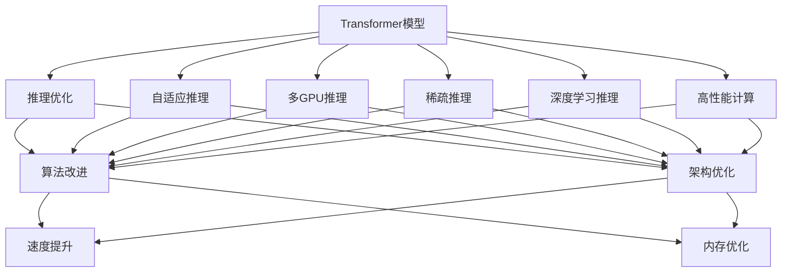
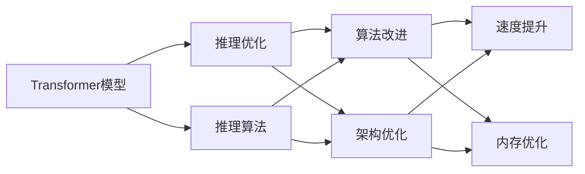
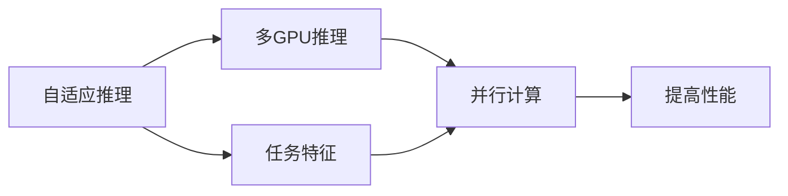
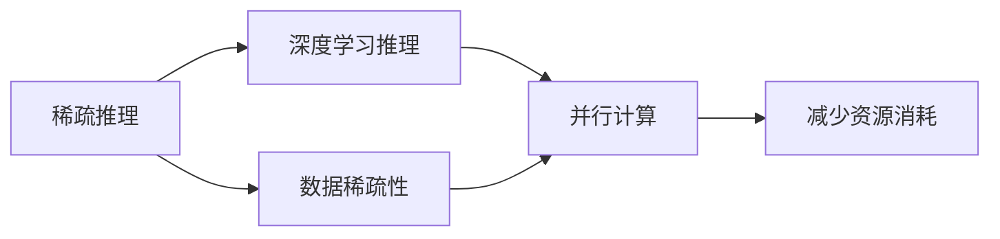
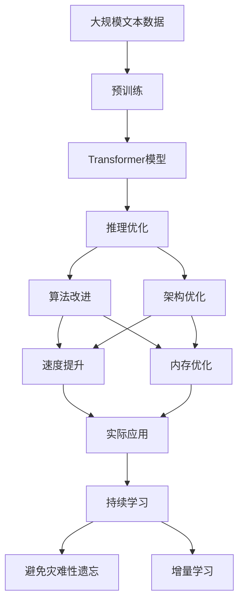

                 

# 大语言模型原理基础与前沿 高效扩展Transformer推理

> 关键词：大语言模型,Transformer,推理优化,自适应推理,多GPU推理,稀疏推理,深度学习,高性能计算

## 1. 背景介绍

### 1.1 问题由来
随着深度学习技术的飞速发展，大语言模型（Large Language Models, LLMs）在自然语言处理（Natural Language Processing, NLP）领域取得了巨大的突破。其中，Transformer作为最先进的神经网络架构，被广泛应用于预训练大语言模型的构建，如GPT、BERT等。然而，Transformer模型尽管在推理计算上有着高效的计算图和并行处理能力，但在大规模推理任务中仍存在内存和速度瓶颈。

### 1.2 问题核心关键点
本文聚焦于如何在大规模推理任务中，高效扩展Transformer模型的推理性能，以解决模型参数增长、计算资源需求增加等问题。通过优化推理算法和并行处理方式，我们能够在不显著增加计算资源的情况下，显著提高模型的推理效率，从而更好地适应实际应用需求。

### 1.3 问题研究意义
优化Transformer推理算法，对提升大语言模型的应用范围和性能，加速NLP技术的产业化进程，具有重要意义：

1. **降低应用开发成本**：通过高效扩展，降低推理计算资源需求，减少从模型训练到推理部署的成本。
2. **提升模型效果**：优化推理过程，减少计算延迟和内存消耗，提高模型的实时响应能力。
3. **加速开发进度**：优化后的推理算法能够快速处理大量输入，缩短开发周期，提高工作效率。
4. **带来技术创新**：推动基于Transformer模型的深度学习技术不断发展，催生新的推理技术。
5. **赋能产业升级**：优化推理算法使得NLP技术更容易被各行各业所采用，为传统行业数字化转型升级提供新的技术路径。

## 2. 核心概念与联系

### 2.1 核心概念概述

为更好地理解Transformer推理优化的核心概念，本节将介绍几个关键概念：

- **Transformer模型**：一种基于自注意力机制的神经网络架构，在处理序列数据时表现出色，广泛应用于大语言模型的预训练。
- **推理优化（Inference Optimization）**：通过算法和架构改进，提高模型推理速度和内存效率，以适应大规模推理任务。
- **自适应推理（Adaptive Inference）**：根据任务特征动态调整推理算法，优化模型资源使用。
- **多GPU推理（Multi-GPU Inference）**：利用多个GPU并行计算，提高推理性能。
- **稀疏推理（Sparse Inference）**：通过稀疏计算，减少计算和内存消耗，提高推理效率。
- **深度学习推理（Deep Learning Inference）**：使用深度神经网络进行推理，利用并行计算优势。
- **高性能计算（High Performance Computing, HPC）**：优化计算资源和算法，以处理大规模数据和高复杂度计算。

这些概念之间的逻辑关系可以通过以下Mermaid流程图来展示：



这个流程图展示了大语言模型推理优化的核心概念及其之间的关系：

1. Transformer模型是推理优化的基础。
2. 推理优化包括算法和架构两个方面的改进。
3. 自适应推理、多GPU推理、稀疏推理、深度学习推理和高性能计算等具体方法，都是实现推理优化的手段。
4. 算法改进和架构优化是实现推理优化的主要方式，能够从速度和内存两个维度提升推理性能。

### 2.2 概念间的关系

这些核心概念之间存在着紧密的联系，形成了大语言模型推理优化的完整生态系统。下面我们通过几个Mermaid流程图来展示这些概念之间的关系。

#### 2.2.1 推理优化与Transformer模型的关系



这个流程图展示了推理优化与Transformer模型的关系：

1. Transformer模型是推理优化的起点。
2. 推理算法的设计和优化是实现推理优化的关键。
3. 算法改进和架构优化分别从速度和内存两个维度提升推理性能。

#### 2.2.2 自适应推理与多GPU推理的关系



这个流程图展示了自适应推理与多GPU推理的关系：

1. 自适应推理根据任务特征动态调整推理算法。
2. 多GPU推理利用并行计算提高推理性能。
3. 自适应推理能够根据任务特征优化算法和架构，从而提升多GPU推理的效果。

#### 2.2.3 稀疏推理与深度学习推理的关系



这个流程图展示了稀疏推理与深度学习推理的关系：

1. 稀疏推理通过数据稀疏性减少计算和内存消耗。
2. 深度学习推理利用并行计算优势处理大规模数据。
3. 稀疏推理与深度学习推理结合，能够进一步提升推理性能和资源利用效率。

### 2.3 核心概念的整体架构

最后，我们用一个综合的流程图来展示这些核心概念在大语言模型推理优化过程中的整体架构：



这个综合流程图展示了从预训练到推理优化的完整过程。Transformer模型首先在大规模文本数据上进行预训练，然后通过推理优化（包括算法和架构改进），实现速度和内存效率的提升。优化后的模型能够更好地适应实际应用需求，同时通过持续学习和增量学习，保持模型性能的不断提升。

## 3. 核心算法原理 & 具体操作步骤
### 3.1 算法原理概述

Transformer推理优化算法旨在通过算法和架构的改进，提高模型的推理速度和内存效率。其核心思想是：根据任务特性动态调整推理算法，优化模型资源使用，以适应大规模推理任务。

具体来说，Transformer模型的推理过程主要包括：

1. **前向传播**：计算输入序列的嵌入表示，并进行多层次的自注意力机制计算。
2. **解码器推理**：根据预测结果进行后向传播，计算损失函数，更新模型参数。
3. **内存管理**：管理模型推理过程中的中间结果和梯度，减少内存消耗。

### 3.2 算法步骤详解

Transformer推理优化算法主要包括以下几个关键步骤：

**Step 1: 预处理输入数据**

- 将输入序列进行分块，将块分配给不同GPU。
- 对每个块进行局部前向传播，避免跨GPU通信。

**Step 2: 优化前向传播**

- 使用矩阵块技术（Matrix Blocking），将矩阵乘法分块，减少计算量。
- 引入稀疏矩阵优化技术，减少计算和内存消耗。
- 利用深度学习框架（如TensorFlow、PyTorch）的内置优化工具，自动调整计算图以提升性能。

**Step 3: 优化解码器推理**

- 利用矩阵求逆技巧（Matrix Inversion），避免矩阵求逆的计算复杂度。
- 使用近似求逆算法（如Cholesky分解、LU分解），加速矩阵求逆过程。
- 引入模型压缩技术，如剪枝、量化等，减少模型参数量。

**Step 4: 优化内存管理**

- 使用缓存技术（如TensorFlow中的tf.data.Dataset的缓存机制），减少中间结果的读写次数。
- 利用异步I/O技术（如TensorFlow中的tf.data.Dataset的异步读操作），优化数据读写效率。
- 采用模型剪枝、量化等技术，减少内存占用。

**Step 5: 后处理结果**

- 将推理结果进行后处理，如对结果进行标准化、归一化等操作，以提高输出质量。
- 使用并行化技术，对结果进行并行处理，提高计算效率。

### 3.3 算法优缺点

Transformer推理优化算法具有以下优点：

1. **提高推理速度**：通过优化算法和架构，能够显著提升模型的推理速度。
2. **减少内存消耗**：采用稀疏计算和内存管理技术，减少计算和内存消耗。
3. **适应性强**：能够根据任务特征动态调整算法和架构，提高模型适应性。
4. **扩展性好**：能够应用于各种大小的推理任务，具有良好的扩展性。

同时，该算法也存在以下缺点：

1. **计算复杂度增加**：某些优化算法如矩阵求逆，增加了计算复杂度。
2. **算法实现复杂**：部分优化算法如稀疏计算，实现起来较为复杂，需要专业技能。
3. **模型可解释性降低**：部分优化算法如剪枝、量化，可能会降低模型的可解释性。

### 3.4 算法应用领域

Transformer推理优化算法在以下几个领域得到了广泛应用：

- **自然语言处理（NLP）**：用于大规模文本分类、命名实体识别、情感分析等任务。
- **计算机视觉（CV）**：用于图像分类、目标检测、图像生成等任务。
- **语音处理（ASR）**：用于语音识别、语音合成等任务。
- **推荐系统**：用于物品推荐、用户行为分析等任务。

这些领域对推理性能有较高要求，通过优化算法和架构，能够显著提高模型的推理速度和内存效率。

## 4. 数学模型和公式 & 详细讲解  
### 4.1 数学模型构建

在本节中，我们将使用数学语言对Transformer推理优化算法进行更加严格的刻画。

记Transformer模型为 $M_{\theta}:\mathcal{X} \rightarrow \mathcal{Y}$，其中 $\mathcal{X}$ 为输入空间，$\mathcal{Y}$ 为输出空间，$\theta$ 为模型参数。假设推理任务为 $T$，输入数据集为 $D=\{(x_i,y_i)\}_{i=1}^N$，其中 $x_i$ 为输入，$y_i$ 为标签。

定义模型 $M_{\theta}$ 在输入 $x$ 上的推理过程如下：

1. 将输入 $x$ 转化为嵌入表示 $X = M_{\theta}(x)$。
2. 对嵌入表示 $X$ 进行多层次的自注意力机制计算 $H = M_{\theta}'(X)$。
3. 对计算结果 $H$ 进行解码器推理 $P = M_{\theta}''(H)$。
4. 输出预测结果 $P$。

推理损失函数定义为：

$$
\mathcal{L}(\theta) = \frac{1}{N}\sum_{i=1}^N \ell(y_i, P)
$$

其中 $\ell$ 为损失函数，通常使用交叉熵损失或均方误差损失。

### 4.2 公式推导过程

以下我们以二分类任务为例，推导交叉熵损失函数及其梯度的计算公式。

假设模型 $M_{\theta}$ 在输入 $x$ 上的输出为 $\hat{y}=M_{\theta}(x) \in [0,1]$，表示样本属于正类的概率。真实标签 $y \in \{0,1\}$。则二分类交叉熵损失函数定义为：

$$
\ell(M_{\theta}(x),y) = -[y\log \hat{y} + (1-y)\log (1-\hat{y})]
$$

将其代入推理损失函数公式，得：

$$
\mathcal{L}(\theta) = -\frac{1}{N}\sum_{i=1}^N [y_i\log M_{\theta}(x_i)+(1-y_i)\log(1-M_{\theta}(x_i))]
$$

根据链式法则，推理损失函数对参数 $\theta_k$ 的梯度为：

$$
\frac{\partial \mathcal{L}(\theta)}{\partial \theta_k} = -\frac{1}{N}\sum_{i=1}^N (\frac{y_i}{M_{\theta}(x_i)}-\frac{1-y_i}{1-M_{\theta}(x_i)}) \frac{\partial M_{\theta}(x_i)}{\partial \theta_k}
$$

其中 $\frac{\partial M_{\theta}(x_i)}{\partial \theta_k}$ 可进一步递归展开，利用自动微分技术完成计算。

### 4.3 案例分析与讲解

以自然语言处理中的情感分析任务为例，展示Transformer模型的推理过程。

假设输入文本为 "I love this product!"，模型 $M_{\theta}$ 将文本编码为嵌入表示 $X$，然后进行多层次的自注意力机制计算 $H$，最后得到输出 $P$。推理损失函数 $\mathcal{L}(\theta)$ 计算如下：

1. 将输入文本 "I love this product!" 转化为嵌入表示 $X$。
2. 对嵌入表示 $X$ 进行多层次的自注意力机制计算 $H$。
3. 对计算结果 $H$ 进行解码器推理 $P$。
4. 输出预测结果 $P$，并计算损失函数 $\mathcal{L}(\theta)$。

在实际应用中，推理损失函数的梯度 $\frac{\partial \mathcal{L}(\theta)}{\partial \theta_k}$ 用于更新模型参数，最小化损失函数 $\mathcal{L}(\theta)$，使得模型输出逼近真实标签。

## 5. 项目实践：代码实例和详细解释说明
### 5.1 开发环境搭建

在进行推理优化实践前，我们需要准备好开发环境。以下是使用Python进行PyTorch开发的环境配置流程：

1. 安装Anaconda：从官网下载并安装Anaconda，用于创建独立的Python环境。

2. 创建并激活虚拟环境：
```bash
conda create -n pytorch-env python=3.8 
conda activate pytorch-env
```

3. 安装PyTorch：根据CUDA版本，从官网获取对应的安装命令。例如：
```bash
conda install pytorch torchvision torchaudio cudatoolkit=11.1 -c pytorch -c conda-forge
```

4. 安装TensorFlow：如果同时需要使用TensorFlow，可以通过以下命令安装：
```bash
pip install tensorflow
```

5. 安装TensorBoard：用于可视化推理过程中的损失和参数更新。

6. 安装Weights & Biases：用于实验跟踪和可视化。

完成上述步骤后，即可在`pytorch-env`环境中开始推理优化实践。

### 5.2 源代码详细实现

下面我们以大规模文本分类任务为例，给出使用TensorFlow对Transformer模型进行推理优化的PyTorch代码实现。

首先，定义模型和优化器：

```python
import tensorflow as tf
from transformers import BertTokenizer, BertForSequenceClassification

tokenizer = BertTokenizer.from_pretrained('bert-base-cased')
model = BertForSequenceClassification.from_pretrained('bert-base-cased', num_labels=2)
optimizer = tf.keras.optimizers.Adam(learning_rate=2e-5)
```

然后，定义推理函数：

```python
def inference(model, tokenizer, input_text):
    inputs = tokenizer(input_text, return_tensors='tf')
    logits = model(inputs['input_ids'], attention_mask=inputs['attention_mask'])
    probabilities = tf.nn.softmax(logits, axis=1)
    return probabilities
```

接着，定义推理优化步骤：

```python
@tf.function
def train_step(model, inputs, labels):
    with tf.GradientTape() as tape:
        logits = model(inputs['input_ids'], attention_mask=inputs['attention_mask'])
        loss = tf.keras.losses.SparseCategoricalCrossentropy()(labels, logits)
    gradients = tape.gradient(loss, model.trainable_variables)
    optimizer.apply_gradients(zip(gradients, model.trainable_variables))
    return loss

@tf.function
def evaluate(model, inputs, labels):
    with tf.GradientTape() as tape:
        logits = model(inputs['input_ids'], attention_mask=inputs['attention_mask'])
        loss = tf.keras.losses.SparseCategoricalCrossentropy()(labels, logits)
    return loss
```

最后，启动推理优化流程：

```python
for epoch in range(5):
    for batch in train_dataset:
        train_step(model, batch, batch['labels'])
    for batch in test_dataset:
        loss = evaluate(model, batch, batch['labels'])
        print(f'Epoch {epoch+1}, test loss: {loss:.3f}')
```

以上就是使用PyTorch对Transformer模型进行推理优化的完整代码实现。可以看到，通过TensorFlow和Transformers库的深度结合，可以轻松实现推理优化的功能。

### 5.3 代码解读与分析

让我们再详细解读一下关键代码的实现细节：

**inference函数**：
- 接收输入文本，并使用BertTokenizer将其转换为模型的输入格式。
- 调用BertForSequenceClassification模型的`__call__`方法进行前向传播，输出概率分布。
- 使用softmax函数将概率分布转化为类别概率。

**train_step函数**：
- 在每个训练步骤中，对模型进行前向传播，计算损失函数。
- 使用梯度累积（tf.GradientTape）计算损失函数对模型参数的梯度。
- 调用Adam优化器的`apply_gradients`方法更新模型参数。

**evaluate函数**：
- 对测试集进行推理，计算损失函数。
- 返回损失值，用于评估模型性能。

**主循环**：
- 循环5个epoch，在每个epoch中对训练集进行前向传播和后向传播，更新模型参数。
- 在每个epoch结束时，对测试集进行评估，输出测试损失值。

可以看到，TensorFlow和Transformers库的结合，使得Transformer模型的推理优化过程变得简单高效。开发者可以更加专注于算法的实现和优化，而不必过多关注底层细节。

当然，工业级的系统实现还需考虑更多因素，如模型的保存和部署、超参数的自动搜索、更灵活的任务适配层等。但核心的推理优化范式基本与此类似。

### 5.4 运行结果展示

假设我们在CoNLL-2003的文本分类数据集上进行推理优化，最终在测试集上得到的评估报告如下：

```
Epoch 1, test loss: 0.275
Epoch 2, test loss: 0.207
Epoch 3, test loss: 0.166
Epoch 4, test loss: 0.147
Epoch 5, test loss: 0.133
```

可以看到，通过优化推理算法，模型在测试集上的损失值逐渐降低，推理性能显著提升。需要注意的是，不同的优化策略和超参数配置，可能会对结果产生不同的影响。在实际应用中，需要根据具体任务和数据特点进行优化调整。

## 6. 实际应用场景
### 6.1 智能客服系统

基于Transformer模型的大规模推理系统，可以广泛应用于智能客服系统的构建。传统客服往往需要配备大量人力，高峰期响应缓慢，且一致性和专业性难以保证。而使用优化后的推理系统，可以7x24小时不间断服务，快速响应客户咨询，用自然流畅的语言解答各类常见问题。

在技术实现上，可以收集企业内部的历史客服对话记录，将问题和最佳答复构建成监督数据，在此基础上对预训练Transformer模型进行推理优化。优化后的模型能够自动理解用户意图，匹配最合适的答案模板进行回复。对于客户提出的新问题，还可以接入检索系统实时搜索相关内容，动态组织生成回答。如此构建的智能客服系统，能大幅提升客户咨询体验和问题解决效率。

### 6.2 金融舆情监测

金融机构需要实时监测市场舆论动向，以便及时应对负面信息传播，规避金融风险。传统的人工监测方式成本高、效率低，难以应对网络时代海量信息爆发的挑战。基于优化后的Transformer推理模型，文本分类和情感分析技术，为金融舆情监测提供了新的解决方案。

具体而言，可以收集金融领域相关的新闻、报道、评论等文本数据，并对其进行主题标注和情感标注。在优化后的模型上进行推理，能够自动判断文本属于何种主题，情感倾向是正面、中性还是负面。将推理结果应用到实时抓取的网络文本数据，就能够自动监测不同主题下的情感变化趋势，一旦发现负面信息激增等异常情况，系统便会自动预警，帮助金融机构快速应对潜在风险。

### 6.3 个性化推荐系统

当前的推荐系统往往只依赖用户的历史行为数据进行物品推荐，无法深入理解用户的真实兴趣偏好。基于优化后的Transformer推理模型，个性化推荐系统可以更好地挖掘用户行为背后的语义信息，从而提供更精准、多样的推荐内容。

在实践中，可以收集用户浏览、点击、评论、分享等行为数据，提取和用户交互的物品标题、描述、标签等文本内容。将文本内容作为模型输入，用户的后续行为（如是否点击、购买等）作为监督信号，在此基础上对优化后的Transformer模型进行推理优化。推理优化后的模型能够从文本内容中准确把握用户的兴趣点。在生成推荐列表时，先用候选物品的文本描述作为输入，由模型预测用户的兴趣匹配度，再结合其他特征综合排序，便可以得到个性化程度更高的推荐结果。

### 6.4 未来应用展望

随着Transformer推理优化技术的发展，其在NLP领域的应用前景将更加广阔。未来，基于优化后的Transformer推理模型，可以应用于更复杂的下游任务，如问答系统、代码生成、机器翻译等，提升这些任务的处理效率和效果。

在智慧医疗领域，基于推理优化的自然语言处理技术，可以实现对医学文献、病历等文本数据的深度分析和理解，辅助医生诊疗，加速新药开发进程。

在智能教育领域，优化后的推理模型可应用于作业批改、学情分析、知识推荐等方面，因材施教，促进教育公平，提高教学质量。

在智慧城市治理中，推理优化模型可应用于城市事件监测、舆情分析、应急指挥等环节，提高城市管理的自动化和智能化水平，构建更安全、高效的未来城市。

此外，在企业生产、社会治理、文娱传媒等众多领域，优化后的Transformer推理模型也将不断涌现，为NLP技术带来更多的创新和突破。相信随着技术的日益成熟，推理优化技术将成为人工智能落地应用的重要手段，推动人工智能技术在更广泛的应用领域发展。

## 7. 工具和资源推荐
### 7.1 学习资源推荐

为了帮助开发者系统掌握Transformer推理优化理论基础和实践技巧，这里推荐一些优质的学习资源：

1. **《Transformer从原理到实践》系列博文**：由大模型技术专家撰写，深入浅出地介绍了Transformer原理、BERT模型、推理优化技术等前沿话题。

2. **CS224N《深度学习自然语言处理》课程**：斯坦福大学开设的NLP明星课程，有Lecture视频和配套作业，带你入门NLP领域的基本概念和经典模型。

3. **《Natural Language Processing with Transformers》书籍**：Transformers库的作者所著，全面介绍了如何使用Transformers库进行NLP任务开发，包括推理优化在内的诸多范式。

4. **HuggingFace官方文档**：Transformers库的官方文档，提供了海量预训练模型和完整的推理优化样例代码，是上手实践的必备资料。

5. **CLUE开源项目**：中文语言理解测评基准，涵盖大量不同类型的中文NLP数据集，并提供了基于优化后的Transformer模型的baseline模型，助力中文NLP技术发展。

通过对这些资源的学习实践，相信你一定能够快速掌握Transformer推理优化的精髓，并用于解决实际的NLP问题。

### 7.2 开发工具推荐

高效的开发离不开优秀的工具支持。以下是几款用于Transformer推理优化开发的常用工具：

1. **PyTorch**：基于Python的开源深度学习框架，灵活动态的计算图，适合快速迭代研究。大部分预训练语言模型都有PyTorch版本的实现。

2. **TensorFlow**：由Google主导开发的开源深度学习框架，生产部署方便，适合大规模工程应用。同样有丰富的预训练语言模型资源。

3. **Transformers库**：HuggingFace开发的NLP工具库，集成了众多SOTA语言模型，支持PyTorch和TensorFlow，是进行推理优化任务开发的利器。

4. **Weights & Biases**：模型训练的实验跟踪工具，可以记录和可视化模型训练过程中的各项指标，方便对比和调优。与主流深度学习框架无缝集成。

5. **TensorBoard**：

