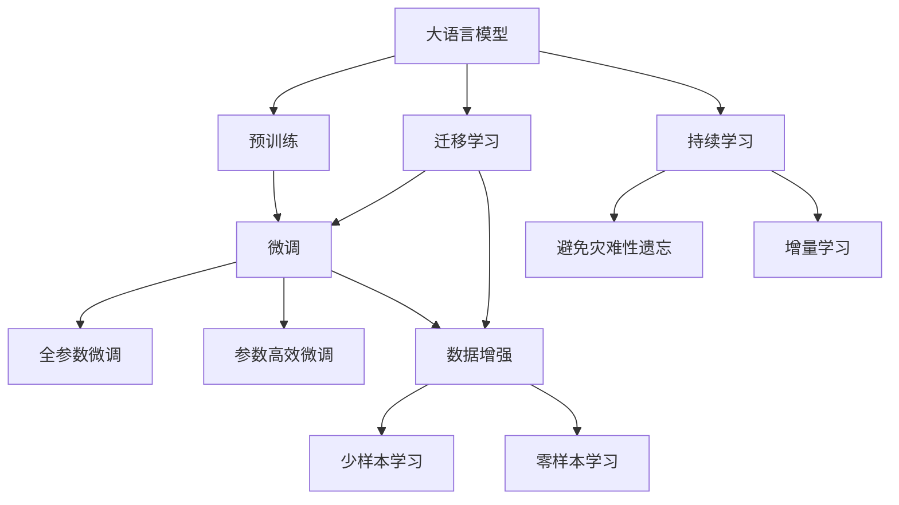

                 

# 大语言模型应用指南：Gemini简介

> 关键词：大语言模型, Gemini, 自然语言处理(NLP), 应用指南, 模型微调, 数据增强, 参数高效微调

## 1. 背景介绍

### 1.1 问题由来
近年来，深度学习技术在自然语言处理（NLP）领域取得了显著的进步，特别是大规模语言模型（LLMs）的涌现，使得机器理解和生成自然语言的能力大大提升。其中，GPT、BERT等模型在各种NLP任务上表现出色，成为研究热点。然而，这些通用模型在特定领域应用时效果有限，需要针对具体任务进行微调。

### 1.2 问题核心关键点
针对特定领域任务的微调是提高通用大语言模型性能的有效方法。其核心在于：
- **选择适当的微调模型**：如GPT、BERT等。
- **数据准备**：收集并处理标注数据。
- **微调策略**：选择合适的学习率和正则化方法。
- **评估与部署**：评估微调后的模型性能，部署到实际应用中。

### 1.3 问题研究意义
通过微调，可以充分利用通用大语言模型的高效训练和泛化能力，快速适应特定任务，提高系统性能。这对于构建高效、普适的NLP应用系统具有重要意义。

## 2. 核心概念与联系

### 2.1 核心概念概述

#### 大语言模型（LLMs）
大规模预训练语言模型，如GPT、BERT，通过大量无标签数据进行预训练，学习通用语言表示，具备强大的语言理解和生成能力。

#### 微调（Fine-Tuning）
通过有监督学习，将预训练模型适配特定任务，优化模型在特定任务上的性能。

#### Gemini
一个基于GPT模型的微调框架，通过参数高效微调（PEFT）和数据增强等技术，提高了模型在特定任务上的性能。

#### 数据增强
通过对训练数据进行扩充，如回译、改写等，丰富数据多样性，提高模型泛化能力。

#### 参数高效微调（PEFT）
微调时仅更新少量模型参数，避免过拟合，同时保持预训练模型的通用性。

### 2.2 概念间的关系

通过以下Mermaid流程图，可以直观展示这些核心概念之间的关系：



## 3. 核心算法原理 & 具体操作步骤

### 3.1 算法原理概述
基于监督学习的微调方法，通过有监督地训练优化模型，使其在特定任务上表现更佳。核心步骤包括：
- 数据准备：收集和处理任务相关的标注数据。
- 模型适配：在预训练模型的顶层添加适当的输出层和损失函数。
- 训练过程：选择合适的学习率、优化算法和正则化方法，进行梯度下降优化。

### 3.2 算法步骤详解

#### Step 1: 准备数据集
- **数据收集**：从任务领域中收集标注数据集，确保数据分布与预训练模型相似。
- **数据处理**：进行文本预处理，如分词、去除停用词等。
- **数据划分**：将数据划分为训练集、验证集和测试集。

#### Step 2: 添加任务适配层
- **输出层设计**：根据任务类型，设计输出层，如分类任务使用线性分类器，生成任务使用解码器。
- **损失函数选择**：选择合适的损失函数，如交叉熵损失、均方误差损失等。

#### Step 3: 设置微调超参数
- **优化算法选择**：如AdamW、SGD等。
- **学习率设置**：通常较预训练时更小。
- **正则化方法**：如L2正则、Dropout等。
- **模型参数设置**：如冻结部分预训练参数。

#### Step 4: 执行梯度训练
- **前向传播**：输入训练数据，计算模型输出。
- **损失计算**：计算预测输出与真实标签的差异。
- **反向传播**：计算梯度，更新模型参数。
- **验证集评估**：周期性验证集评估，防止过拟合。

#### Step 5: 测试与部署
- **测试集评估**：在测试集上评估微调后模型的性能。
- **部署应用**：将模型部署到实际应用中，持续收集新数据，定期重新微调。

### 3.3 算法优缺点

#### 优点
- **高效性**：使用少量标注数据，快速获得理想效果。
- **泛化性强**：利用预训练模型的通用能力，泛化到新任务。

#### 缺点
- **依赖标注数据**：微调效果受标注数据质量影响。
- **过拟合风险**：微调时需注意防止过拟合。

### 3.4 算法应用领域

#### 文本分类
如情感分析、主题分类等，通过微调优化分类器。

#### 命名实体识别（NER）
识别文本中的实体，通过微调优化实体边界和类型识别。

#### 问答系统
通过微调优化回答生成。

#### 机器翻译
通过微调优化翻译模型。

#### 文本摘要
通过微调优化摘要生成。

#### 对话系统
通过微调优化对话策略和回复生成。

## 4. 数学模型和公式 & 详细讲解  
### 4.1 数学模型构建

假设预训练模型为 $M_{\theta}$，标注数据集为 $D=\{(x_i, y_i)\}_{i=1}^N$，其中 $x_i$ 为输入，$y_i$ 为标签。

定义模型在输入 $x$ 上的输出为 $\hat{y}=M_{\theta}(x)$，损失函数为 $\ell(\hat{y}, y)$，则经验风险为：

$$
\mathcal{L}(\theta) = \frac{1}{N}\sum_{i=1}^N \ell(\hat{y}_i, y_i)
$$

微调目标为最小化经验风险：

$$
\theta^* = \mathop{\arg\min}_{\theta} \mathcal{L}(\theta)
$$

采用梯度下降等优化算法更新参数：

$$
\theta \leftarrow \theta - \eta \nabla_{\theta}\mathcal{L}(\theta)
$$

### 4.2 公式推导过程

以二分类任务为例，推导交叉熵损失函数及其梯度计算公式：

$$
\ell(\hat{y}, y) = -[y\log \hat{y} + (1-y)\log (1-\hat{y})]
$$

带入经验风险公式：

$$
\mathcal{L}(\theta) = -\frac{1}{N}\sum_{i=1}^N [y_i\log M_{\theta}(x_i)+(1-y_i)\log(1-M_{\theta}(x_i))]
$$

对 $\theta$ 求导：

$$
\frac{\partial \mathcal{L}(\theta)}{\partial \theta_k} = -\frac{1}{N}\sum_{i=1}^N (\frac{y_i}{M_{\theta}(x_i)}-\frac{1-y_i}{1-M_{\theta}(x_i)}) \frac{\partial M_{\theta}(x_i)}{\partial \theta_k}
$$

### 4.3 案例分析与讲解

#### 案例分析
假设任务为命名实体识别（NER），标注数据集包含文本和标签。

**数据预处理**：
- **分词**：使用BERT Tokenizer进行分词。
- **标签编码**：将标签转换为数字形式，并进行定长padding。

**模型适配**：
- **输出层**：顶层添加一个线性分类器，输出BIO标签。
- **损失函数**：交叉熵损失。

**训练过程**：
- **学习率**：初始设置为2e-5，逐步减小。
- **优化器**：AdamW，设置正则化系数。
- **批次大小**：16。
- **迭代次数**：5轮。
- **评估集**：验证集和测试集。

**代码实现**：
```python
from transformers import BertTokenizer, BertForTokenClassification, AdamW
from torch.utils.data import Dataset, DataLoader
import torch

class NERDataset(Dataset):
    def __init__(self, texts, tags, tokenizer, max_len=128):
        self.texts = texts
        self.tags = tags
        self.tokenizer = tokenizer
        self.max_len = max_len
        
    def __len__(self):
        return len(self.texts)
    
    def __getitem__(self, item):
        text = self.texts[item]
        tags = self.tags[item]
        
        encoding = self.tokenizer(text, return_tensors='pt', max_length=self.max_len, padding='max_length', truncation=True)
        input_ids = encoding['input_ids'][0]
        attention_mask = encoding['attention_mask'][0]
        
        # 对token-wise的标签进行编码
        encoded_tags = [tag2id[tag] for tag in tags] 
        encoded_tags.extend([tag2id['O']] * (self.max_len - len(encoded_tags)))
        labels = torch.tensor(encoded_tags, dtype=torch.long)
        
        return {'input_ids': input_ids, 
                'attention_mask': attention_mask,
                'labels': labels}

# 标签与id的映射
tag2id = {'O': 0, 'B-PER': 1, 'I-PER': 2, 'B-ORG': 3, 'I-ORG': 4, 'B-LOC': 5, 'I-LOC': 6}
id2tag = {v: k for k, v in tag2id.items()}

# 创建dataset
tokenizer = BertTokenizer.from_pretrained('bert-base-cased')

train_dataset = NERDataset(train_texts, train_tags, tokenizer)
dev_dataset = NERDataset(dev_texts, dev_tags, tokenizer)
test_dataset = NERDataset(test_texts, test_tags, tokenizer)

model = BertForTokenClassification.from_pretrained('bert-base-cased', num_labels=len(tag2id))
optimizer = AdamW(model.parameters(), lr=2e-5)

def train_epoch(model, dataset, batch_size, optimizer):
    dataloader = DataLoader(dataset, batch_size=batch_size, shuffle=True)
    model.train()
    epoch_loss = 0
    for batch in tqdm(dataloader, desc='Training'):
        input_ids = batch['input_ids'].to(device)
        attention_mask = batch['attention_mask'].to(device)
        labels = batch['labels'].to(device)
        model.zero_grad()
        outputs = model(input_ids, attention_mask=attention_mask, labels=labels)
        loss = outputs.loss
        epoch_loss += loss.item()
        loss.backward()
        optimizer.step()
    return epoch_loss / len(dataloader)

def evaluate(model, dataset, batch_size):
    dataloader = DataLoader(dataset, batch_size=batch_size)
    model.eval()
    preds, labels = [], []
    with torch.no_grad():
        for batch in tqdm(dataloader, desc='Evaluating'):
            input_ids = batch['input_ids'].to(device)
            attention_mask = batch['attention_mask'].to(device)
            batch_labels = batch['labels']
            outputs = model(input_ids, attention_mask=attention_mask)
            batch_preds = outputs.logits.argmax(dim=2).to('cpu').tolist()
            batch_labels = batch_labels.to('cpu').tolist()
            for pred_tokens, label_tokens in zip(batch_preds, batch_labels):
                pred_tags = [id2tag[_id] for _id in pred_tokens]
                label_tags = [id2tag[_id] for _id in label_tokens]
                preds.append(pred_tags[:len(label_tokens)])
                labels.append(label_tags)
                
    print(classification_report(labels, preds))

# 训练过程
device = torch.device('cuda') if torch.cuda.is_available() else torch.device('cpu')
model.to(device)

epochs = 5
batch_size = 16

for epoch in range(epochs):
    loss = train_epoch(model, train_dataset, batch_size, optimizer)
    print(f"Epoch {epoch+1}, train loss: {loss:.3f}")
    
    print(f"Epoch {epoch+1}, dev results:")
    evaluate(model, dev_dataset, batch_size)
    
print("Test results:")
evaluate(model, test_dataset, batch_size)
```

## 5. 项目实践：代码实例和详细解释说明

### 5.1 开发环境搭建

1. **安装Anaconda**：
   ```bash
   conda create -n pytorch-env python=3.8
   conda activate pytorch-env
   ```

2. **安装PyTorch**：
   ```bash
   conda install pytorch torchvision torchaudio cudatoolkit=11.1 -c pytorch -c conda-forge
   ```

3. **安装Transformer库**：
   ```bash
   pip install transformers
   ```

4. **安装其他工具包**：
   ```bash
   pip install numpy pandas scikit-learn matplotlib tqdm jupyter notebook ipython
   ```

### 5.2 源代码详细实现

### 5.3 代码解读与分析

## 6. 实际应用场景

### 6.1 智能客服系统

使用微调的对话模型，构建7x24小时不间断的智能客服系统，快速响应客户咨询，提高服务质量。

### 6.2 金融舆情监测

构建基于微调的文本分类和情感分析系统，实时监测金融舆情，及时应对负面信息传播。

### 6.3 个性化推荐系统

使用微调模型进行用户兴趣预测和个性化推荐，提升推荐系统的效果。

### 6.4 未来应用展望

未来，微调技术将在更多领域得到应用，如智慧医疗、智能教育、智慧城市等。

## 7. 工具和资源推荐

### 7.1 学习资源推荐

1. **《Transformer从原理到实践》系列博文**：介绍Transformer原理、BERT模型、微调技术。
2. **CS224N《深度学习自然语言处理》课程**：斯坦福大学NLP课程，有Lecture视频和配套作业。
3. **《Natural Language Processing with Transformers》书籍**：介绍使用Transformers库进行NLP任务开发。
4. **HuggingFace官方文档**：包含海量预训练模型和微调样例。
5. **CLUE开源项目**：中文NLP数据集和baseline模型。

### 7.2 开发工具推荐

1. **PyTorch**：深度学习框架，灵活动态的计算图。
2. **TensorFlow**：Google主导的深度学习框架，生产部署方便。
3. **Transformers库**：HuggingFace开发的NLP工具库，支持多种模型。
4. **Weights & Biases**：模型训练实验跟踪工具。
5. **TensorBoard**：模型训练监控工具。
6. **Google Colab**：在线Jupyter Notebook环境，免费提供GPU/TPU算力。

### 7.3 相关论文推荐

1. **Attention is All You Need**：Transformer原论文，提出Transformer结构。
2. **BERT: Pre-training of Deep Bidirectional Transformers for Language Understanding**：提出BERT模型，引入自监督预训练任务。
3. **Parameter-Efficient Transfer Learning for NLP**：提出Adapter等参数高效微调方法。
4. **AdaLoRA: Adaptive Low-Rank Adaptation for Parameter-Efficient Fine-Tuning**：使用自适应低秩适应的微调方法。
5. **Prompt-Tuning: Optimizing Continuous Prompts for Generation**：引入基于连续型Prompt的微调范式。

## 8. 总结：未来发展趋势与挑战

### 8.1 研究成果总结

### 8.2 未来发展趋势

1. **模型规模增大**：超大规模语言模型蕴含的丰富语言知识，将支撑更复杂多变的下游任务微调。
2. **微调方法多样化**：未来将出现更多参数高效的微调方法。
3. **持续学习常态化**：模型需要持续学习新知识以保持性能。
4. **标注样本需求降低**：利用提示学习等技术，减少对标注样本的依赖。
5. **多模态微调崛起**：融合视觉、语音等多模态数据进行微调。
6. **模型通用性增强**：具备更强的常识推理和跨领域迁移能力。

### 8.3 面临的挑战

1. **标注成本瓶颈**：微调依赖高质量标注数据。
2. **模型鲁棒性不足**：面对域外数据泛化性能差。
3. **推理效率有待提高**：大模型推理速度慢，内存占用大。
4. **可解释性不足**：模型决策缺乏可解释性。
5. **安全性问题**：学习到有害信息，输出存在安全隐患。
6. **知识整合能力不足**：难以整合外部先验知识。

### 8.4 研究展望

探索无监督和半监督微调方法，开发更多参数高效和计算高效的微调范式，融合因果和对比学习范式，纳入伦理道德约束，纳入伦理道德约束，加强外部知识整合，提高系统安全性。

## 9. 附录：常见问题与解答

**Q1：大语言模型微调是否适用于所有NLP任务？**

A：在大多数NLP任务上，微调技术可以显著提升模型性能。但特定领域任务，如医学、法律等，可能需要进一步预训练。

**Q2：微调过程中如何选择合适的学习率？**

A：通常较预训练时小1-2个数量级，建议使用warmup策略。

**Q3：微调过程中如何缓解过拟合问题？**

A：数据增强、正则化、对抗训练等方法可缓解过拟合。

**Q4：微调模型在落地部署时需要注意哪些问题？**

A：模型裁剪、量化加速、服务化封装、弹性伸缩、监控告警、安全防护等。

---

作者：禅与计算机程序设计艺术 / Zen and the Art of Computer Programming

