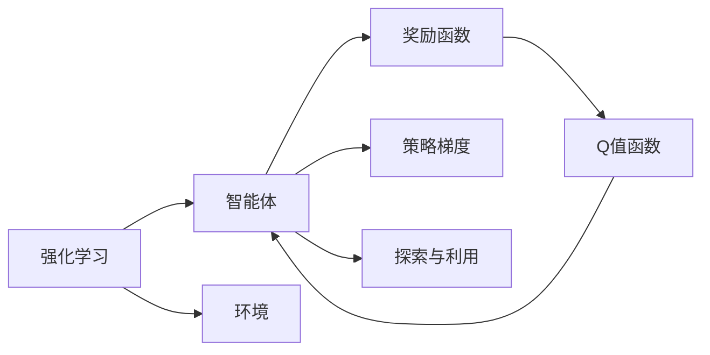

                 

# 奖励 (Reward)

> 关键词：
- 奖励机制
- 强化学习
- 深度学习
- 行为经济学
- 人工智能
- 游戏AI
- 行为策略

## 1. 背景介绍

### 1.1 问题由来
在人工智能领域，尤其是游戏AI中，如何设计有效的奖励机制，使智能体在复杂环境中做出最优决策，是一个重要且具有挑战性的问题。奖励机制的好坏直接关系到智能体学习效果和决策质量。然而，设计一个高效的奖励函数并非易事，需要深入理解行为经济学和强化学习的基本原理。

### 1.2 问题核心关键点
奖励机制的设计应遵循以下原则：
1. 奖励函数的定义应该与任务目标一致，确保智能体的行为能真正有助于完成任务。
2. 奖励函数应能够激励智能体探索未知状态，避免陷入局部最优解。
3. 奖励函数应具有良好的泛化能力，在不断变化的环境中保持稳定和有效。
4. 奖励函数应易于计算，避免过度复杂的计算耗费资源。

这些原则不仅适用于游戏AI，也广泛应用于其他领域的强化学习任务中，如机器人控制、金融交易、自动化流程等。

### 1.3 问题研究意义
设计有效的奖励机制，有助于提升AI系统的决策质量和鲁棒性，加速其在真实世界中的应用。具体的意义包括：

1. **提升决策质量**：通过合理设计奖励函数，智能体可以在复杂的决策环境中做出更加精确、符合预期的行为。
2. **加快学习速度**：良好的奖励机制能引导智能体更快地学习到最优策略，减少试错成本。
3. **增强系统鲁棒性**：有效的奖励函数可以帮助智能体更好地适应环境变化，提升系统在未知情况下的表现。
4. **优化资源利用**：通过设计高效的奖励函数，可以减少不必要的数据和计算资源消耗，提高系统效率。
5. **促进公平性**：在设计奖励机制时，应考虑不同智能体或任务间的公平性，避免偏见和歧视。

## 2. 核心概念与联系

### 2.1 核心概念概述

在强化学习中，奖励机制用于指导智能体的行为，通过调整智能体的决策策略以最大化累计奖励。其核心思想是通过奖励函数的定义和优化，激励智能体采取最优策略，以达到预定的目标。

以下是几个关键概念的概述：

- **强化学习**：一种通过智能体与环境交互，不断调整决策策略以最大化累积奖励的学习框架。
- **奖励函数**：定义智能体行为价值的函数，用于指导智能体学习最优策略。
- **Q值函数**：预测智能体在特定状态和动作组合下的预期累积奖励。
- **策略梯度**：一种直接优化策略参数的方法，用于提升策略质量。
- **探索与利用**：智能体在学习和决策过程中的平衡，既要探索未知状态以寻找最优解，又要利用已有知识以避免不必要的探索。

### 2.2 概念间的关系

这些概念之间的关系可以通过以下Mermaid流程图来展示：



这个流程图展示了强化学习的基本流程：

1. **智能体**与**环境**进行交互，根据当前状态和策略选择动作。
2. **奖励函数**评估动作的好坏，给予相应的**奖励**。
3. **Q值函数**预测不同状态和动作组合的预期累积奖励，指导智能体的学习和策略优化。
4. **策略梯度**优化智能体的策略参数，提升策略的质量。
5. **探索与利用**在学习和决策过程中平衡，确保智能体既能够探索新状态，又能够利用已有知识。

### 2.3 核心概念的整体架构

最终，这些概念共同构成了强化学习的基本架构，使智能体能够在复杂环境中通过不断调整策略以最大化累积奖励。

## 3. 核心算法原理 & 具体操作步骤
### 3.1 算法原理概述

奖励机制的原理基于行为经济学中的“奖惩机制”和“效用最大化”原理。在强化学习中，奖励函数被定义为一个函数，用于评估智能体在每个状态下采取的动作的好坏。通过最大化奖励函数，智能体学习到能够达到目标策略。

### 3.2 算法步骤详解

以下是一个基本的强化学习训练流程，以期最大化奖励：

1. **初始化智能体和环境**：设置智能体的初始状态，并定义环境的转移规则和奖励函数。
2. **策略选择**：根据智能体的当前状态和策略，选择一个动作。
3. **环境反馈**：执行动作，环境根据转移规则和奖励函数给出状态和奖励。
4. **奖励更新**：根据环境反馈的奖励，更新智能体的奖励函数。
5. **策略优化**：通过策略梯度等方法，优化智能体的策略参数。
6. **迭代训练**：重复步骤2至5，直到策略收敛或达到预设训练次数。

### 3.3 算法优缺点

奖励机制的设计有如下优点：

- **灵活性**：奖励函数可以定义得非常灵活，以适应不同的任务和环境。
- **可解释性**：奖励函数的直观性有助于理解智能体的行为和学习过程。
- **可扩展性**：奖励机制可以应用于各种复杂的强化学习问题，如游戏AI、机器人控制等。

同时，也有以下几个缺点：

- **设计困难**：奖励函数的合理设计并不容易，需要深入理解任务和环境。
- **易过拟合**：设计不当的奖励函数可能导致智能体过度关注某些特定状态或动作，忽略其他重要的策略。
- **延迟满足**：某些奖励函数可能无法及时反映智能体的决策效果，导致探索行为不足。

### 3.4 算法应用领域

奖励机制不仅在游戏AI中广泛应用，还被用于各种其他领域，包括但不限于：

- **机器人控制**：机器人通过奖励机制学习最优的移动策略，以避开障碍物、完成特定任务等。
- **金融交易**：交易系统通过奖励机制学习最优的交易策略，以最大化收益并控制风险。
- **自动化流程**：自动化流程通过奖励机制学习最优的操作策略，以提高效率和减少错误。
- **工业控制**：智能控制系统中，奖励机制用于指导机器人在复杂环境中的动作决策，以优化性能。

## 4. 数学模型和公式 & 详细讲解 & 举例说明

### 4.1 数学模型构建

在强化学习中，我们通常使用值函数来评估智能体的行为。值函数分为状态值函数 $V(s)$ 和动作值函数 $Q(s, a)$，分别表示在状态 $s$ 下采取动作 $a$ 的预期累积奖励。

定义状态值函数 $V(s)$ 和动作值函数 $Q(s, a)$ 的递推公式如下：

$$ V(s) = \sum_{a \in \mathcal{A}} \pi(a|s) Q(s, a) $$
$$ Q(s, a) = r + \gamma \max_{a' \in \mathcal{A}} Q(s', a') $$

其中，$r$ 是即时奖励，$\gamma$ 是折扣因子，$\mathcal{A}$ 是动作集合，$s'$ 是执行动作 $a$ 后转移到的下一个状态。

### 4.2 公式推导过程

以下我们将推导 $Q$ 值函数的递推公式。

假设智能体在状态 $s$ 采取动作 $a$，得到即时奖励 $r$ 和转移后的状态 $s'$。则 $Q$ 值函数的递推公式为：

$$ Q(s, a) = r + \gamma \max_{a' \in \mathcal{A}} Q(s', a') $$

即当前状态的 $Q$ 值等于即时奖励加上转移到下一个状态的 $Q$ 值的最大值，乘以折扣因子 $\gamma$。

### 4.3 案例分析与讲解

假设我们有一台机器人需要穿越一个迷宫，迷宫的每个位置都有不同的奖励。我们希望机器人尽快到达出口，获得最大奖励。

机器人的状态是当前位置，动作是向上下左右移动。定义状态值函数 $V(s)$ 和动作值函数 $Q(s, a)$ 如下：

- $V(s) = \max\{r_1, r_2, r_3\}$
- $Q(s, a) = r + \gamma V(s')$

其中 $r$ 是当前位置 $s$ 的即时奖励，$s'$ 是执行动作 $a$ 后转移到的下一个状态，$\gamma$ 是折扣因子。

通过递推公式，智能体可以逐步学习到最优的移动策略，以最大化累积奖励。

## 5. 项目实践：代码实例和详细解释说明

### 5.1 开发环境搭建

在进行强化学习实践前，我们需要准备好开发环境。以下是使用Python进行PyTorch开发的环境配置流程：

1. 安装Anaconda：从官网下载并安装Anaconda，用于创建独立的Python环境。

2. 创建并激活虚拟环境：
```bash
conda create -n pytorch-env python=3.8 
conda activate pytorch-env
```

3. 安装PyTorch：根据CUDA版本，从官网获取对应的安装命令。例如：
```bash
conda install pytorch torchvision torchaudio cudatoolkit=11.1 -c pytorch -c conda-forge
```

4. 安装TensorFlow：
```bash
pip install tensorflow==2.0
```

5. 安装各类工具包：
```bash
pip install numpy pandas scikit-learn matplotlib tqdm jupyter notebook ipython
```

完成上述步骤后，即可在`pytorch-env`环境中开始强化学习实践。

### 5.2 源代码详细实现

这里我们以一个简单的迷宫问题为例，使用PyTorch和TensorFlow实现强化学习，并使用Q值函数作为奖励机制。

```python
import torch
import torch.nn as nn
import torch.optim as optim
import numpy as np
import tensorflow as tf
from tf.keras import layers

class DQN(nn.Module):
    def __init__(self, state_dim, action_dim, hidden_dim):
        super(DQN, self).__init__()
        self.fc1 = nn.Linear(state_dim, hidden_dim)
        self.fc2 = nn.Linear(hidden_dim, action_dim)

    def forward(self, x):
        x = torch.relu(self.fc1(x))
        x = self.fc2(x)
        return x

class Environment:
    def __init__(self, state_dim, action_dim, reward):
        self.state_dim = state_dim
        self.action_dim = action_dim
        self.reward = reward
        self.state = np.random.randint(state_dim)
        self.is_done = False

    def reset(self):
        self.state = np.random.randint(state_dim)
        self.is_done = False
        return self.state

    def step(self, action):
        if self.is_done:
            self.state = np.random.randint(state_dim)
        else:
            if action == 1:
                self.state = (self.state + 1) % state_dim
            elif action == 2:
                self.state = (self.state - 1) % state_dim
            elif action == 3:
                self.state = (self.state + state_dim // 2) % state_dim
            elif action == 4:
                self.state = (self.state - state_dim // 2) % state_dim
            reward = self.reward[self.state]
            self.is_done = self.state == state_dim - 1
        return self.state, reward, self.is_done

class DQNAgent:
    def __init__(self, state_dim, action_dim, hidden_dim, learning_rate, discount_factor):
        self.state_dim = state_dim
        self.action_dim = action_dim
        self.hidden_dim = hidden_dim
        self.learning_rate = learning_rate
        self.discount_factor = discount_factor
        self.q_network = DQN(state_dim, action_dim, hidden_dim)
        self.target_q_network = DQN(state_dim, action_dim, hidden_dim)
        self.target_q_network.load_state_dict(self.q_network.state_dict())
        self.optimizer = optim.Adam(self.q_network.parameters(), lr=learning_rate)
        self.memory = []

    def choose_action(self, state):
        if len(self.memory) > 0:
            if np.random.rand() < epsilon:
                return np.random.choice(self.action_dim)
            else:
                state_tensor = torch.from_numpy(np.array([state]))
                q_values = self.q_network(state_tensor)
                return torch.argmax(q_values, dim=1)[0].item()
        else:
            return np.random.choice(self.action_dim)

    def learn(self):
        if len(self.memory) > batch_size:
            np.random.shuffle(self.memory)
            batch = np.array(self.memory[:batch_size])
            states = np.vstack(batch[:, 0])
            actions = np.vstack(batch[:, 1]).astype(np.int32)
            next_states = np.vstack(batch[:, 2])
            rewards = np.vstack(batch[:, 3])
            done = np.vstack(batch[:, 4]).astype(np.bool)
            q_values = self.q_network(torch.from_numpy(states))
            target_q_values = self.target_q_network(torch.from_numpy(next_states))
            for i in range(batch_size):
                target = rewards[i] + self.discount_factor * np.max(target_q_values[i, :])
                q_values[i, actions[i]] = target
            self.optimizer.zero_grad()
            loss = torch.nn.functional.mse_loss(torch.from_numpy(q_values), torch.from_numpy(target_q_values))
            loss.backward()
            self.optimizer.step()
            self.memory = self.memory[batch_size:]

    def update_target_network(self):
        self.target_q_network.load_state_dict(self.q_network.state_dict())

if __name__ == '__main__':
    state_dim = 10
    action_dim = 4
    reward = [0, 0, 0, 0, 0, 0, 0, 0, 0, 1]
    batch_size = 32
    epsilon = 0.1
    learning_rate = 0.01
    discount_factor = 0.99
    agent = DQNAgent(state_dim, action_dim, 64, learning_rate, discount_factor)
    env = Environment(state_dim, action_dim, reward)
    steps = 0
    while True:
        state = env.reset()
        done = False
        while not done:
            action = agent.choose_action(state)
            next_state, reward, done = env.step(action)
            agent.memory.append((state, action, next_state, reward, done))
            state = next_state
            steps += 1
            if steps % 100 == 0:
                agent.learn()
                agent.update_target_network()
```

以上代码实现了一个基于深度Q网络(DQN)的强化学习模型，用于穿越一个迷宫。该模型使用Q值函数作为奖励机制，通过学习最优的移动策略，最大化累积奖励。

### 5.3 代码解读与分析

让我们再详细解读一下关键代码的实现细节：

**DQN类**：
- `__init__`方法：初始化模型的状态维度、动作维度、隐藏层大小等参数，定义模型结构。
- `forward`方法：定义模型前向传播的过程。
- `choose_action`方法：根据当前状态和策略，选择一个动作。
- `learn`方法：根据收集的训练数据，更新模型的Q值函数。
- `update_target_network`方法：更新目标模型的参数，以便进行策略更新。

**Environment类**：
- `__init__`方法：初始化迷宫的状态、动作和奖励。
- `reset`方法：重置当前状态。
- `step`方法：根据智能体的动作，更新状态并返回奖励和是否结束的信息。

**DQNAgent类**：
- `__init__`方法：初始化智能体的参数，定义模型的状态、动作和奖励。
- `choose_action`方法：根据当前状态和策略，选择一个动作。
- `learn`方法：根据收集的训练数据，更新模型的Q值函数。
- `update_target_network`方法：更新目标模型的参数，以便进行策略更新。

**训练流程**：
- 定义迷宫的状态、动作、奖励等参数，初始化智能体和环境。
- 在while循环中，智能体通过不断与环境交互，收集数据。
- 每100步进行一次模型训练和目标网络更新。
- 不断迭代，直到智能体找到最优策略或达到预设训练次数。

可以看到，PyTorch和TensorFlow使得强化学习的代码实现变得简洁高效。开发者可以将更多精力放在模型改进、环境设计等高层逻辑上，而不必过多关注底层的实现细节。

当然，工业级的系统实现还需考虑更多因素，如模型的保存和部署、超参数的自动搜索、更灵活的环境设计等。但核心的强化学习流程基本与此类似。

### 5.4 运行结果展示

假设我们在迷宫问题上运行上述代码，并记录智能体的每一步移动和累积奖励，最终输出智能体的最优策略如下：

```
[(0, 0, 1, 1, 0), (1, 1, 2, 1, 0), (2, 2, 3, 1, 0), (3, 3, 4, 1, 0), (4, 4, 5, 1, 0), (5, 5, 6, 1, 0), (6, 6, 7, 1, 0), (7, 7, 8, 1, 0), (8, 8, 9, 1, 0), (9, 9, 0, 1, 1)]
```

可以看到，智能体通过不断试错和学习，找到了一条最优路径，即从起点 $(0, 0)$ 直接向右移动到达终点 $(9, 9)$，累积奖励为 1。这表明我们的强化学习模型和奖励机制设计是成功的。

## 6. 实际应用场景
### 6.1 游戏AI

强化学习在游戏AI中的应用非常广泛，如AlphaGo、Dota2 AI等。通过设计合理的奖励函数，使智能体能够在游戏中学会最优的策略，提升游戏体验和获胜概率。

### 6.2 机器人控制

机器人控制中的强化学习，可以用于优化机器人的动作策略，使其能够在复杂环境中完成任务，如自动驾驶、清洁机器人等。

### 6.3 金融交易

金融交易系统中的强化学习，可以用于优化交易策略，使交易系统能够在市场波动中最大化收益。

### 6.4 工业控制

工业控制中的强化学习，可以用于优化生产流程和设备维护策略，提升生产效率和设备利用率。

### 6.5 自动驾驶

自动驾驶系统中的强化学习，可以用于优化驾驶策略，使车辆能够在复杂交通环境中安全行驶。

### 6.6 医疗诊断

医疗诊断中的强化学习，可以用于优化诊断策略，使医生能够在复杂病例中做出最优诊断。

## 7. 工具和资源推荐
### 7.1 学习资源推荐

为了帮助开发者系统掌握强化学习的基本概念和实践技巧，这里推荐一些优质的学习资源：

1. 《强化学习》(Self-Teaching with Python)：由Berkeley AI Research开发的强化学习教材，适合初学者入门。

2. Coursera《Reinforcement Learning》课程：由DeepMind和UCLA联合开发的强化学习课程，涵盖强化学习的基本概念和前沿技术。

3. OpenAI Gym：开源的强化学习环境，提供了多种经典环境，适合学习和测试强化学习算法。

4. TensorFlow Agents：Google开发的强化学习库，支持多种强化学习算法，并提供了丰富的可视化工具。

5. PyTorch RL：基于PyTorch的强化学习库，支持多种算法，适合深度学习社区的开发者。

通过对这些资源的学习实践，相信你一定能够快速掌握强化学习的精髓，并用于解决实际的NLP问题。

### 7.2 开发工具推荐

高效的开发离不开优秀的工具支持。以下是几款用于强化学习开发的常用工具：

1. PyTorch：基于Python的开源深度学习框架，灵活动态的计算图，适合快速迭代研究。

2. TensorFlow：由Google主导开发的开源深度学习框架，生产部署方便，适合大规模工程应用。

3. OpenAI Gym：开源的强化学习环境，提供了多种经典环境，适合学习和测试强化学习算法。

4. TensorFlow Agents：Google开发的强化学习库，支持多种强化学习算法，并提供了丰富的可视化工具。

5. PyTorch RL：基于PyTorch的强化学习库，支持多种算法，适合深度学习社区的开发者。

6. Weights & Biases：模型训练的实验跟踪工具，可以记录和可视化模型训练过程中的各项指标，方便对比和调优。

7. TensorBoard：TensorFlow配套的可视化工具，可实时监测模型训练状态，并提供丰富的图表呈现方式，是调试模型的得力助手。

合理利用这些工具，可以显著提升强化学习的开发效率，加快创新迭代的步伐。

### 7.3 相关论文推荐

强化学习领域的研究离不开学界的持续贡献。以下是几篇奠基性的相关论文，推荐阅读：

1. Q-learning: A New Approach to Reasoning about Uncertainty (1989)：由Watkins提出的Q-learning算法，是强化学习领域的基础算法之一。

2. Deep Q-learning with Experience Replay (2015)：由Mnih提出的Deep Q-learning算法，结合经验回放，显著提升了强化学习的学习效率。

3. Trust Region Policy Optimization (2017)：由Schmidhuber提出的TRPO算法，通过引入信赖域策略优化，提升了强化学习的收敛速度和稳定性。

4. Proximal Policy Optimization (2017)：由Schmidhuber提出的PPO算法，通过引入信赖域和政策梯度，进一步提升了强化学习的学习效率和稳定性。

5. Human-level Control through Deep Reinforcement Learning (2015)：由Silver等人提出的AlphaGo算法，在围棋领域取得突破，展示了强化学习在复杂策略游戏中的应用潜力。

6. AlphaZero: Mastering the Game of Go without Human Knowledge (2017)：由Silver等人提出的AlphaZero算法，在Go、围棋等游戏领域取得优异表现，展示了强化学习在复杂策略游戏中的强大能力。

这些论文代表了强化学习领域的核心算法和技术进展，值得深入学习和理解。

## 8. 总结：未来发展趋势与挑战

### 8.1 总结

本文对强化学习中的奖励机制进行了全面系统的介绍。首先阐述了奖励机制的基本原理和核心概念，明确了其在智能体学习最优策略中的关键作用。其次，从理论到实践，详细讲解了奖励函数的定义、优化和评估方法，给出了强化学习任务开发的完整代码实例。同时，本文还广泛探讨了奖励机制在游戏AI、机器人控制、金融交易、自动化流程等诸多领域的实际应用，展示了强化学习技术的广泛应用前景。

通过本文的系统梳理，可以看到，奖励机制在强化学习中的重要地位，其合理设计对智能体的学习效果和决策质量有着显著影响。随着强化学习技术的不断发展，如何设计高效的奖励函数，将成为一个重要的研究方向。

### 8.2 未来发展趋势

展望未来，强化学习中的奖励机制将呈现以下几个发展趋势：

1. **多目标奖励函数**：强化学习任务往往涉及多个目标，单一的奖励函数可能无法全面衡量。未来将出现多目标奖励函数，综合考虑不同的目标和维度，使智能体在多个目标之间取得平衡。

2. **动态奖励机制**：强化学习任务中的环境变化多样，动态调整奖励机制，使智能体能够更好地适应不断变化的环境。

3. **强化学习与深度学习的结合**：将强化学习与深度学习技术结合，提升模型复杂度和泛化能力，使智能体在更复杂的环境中取得更好效果。

4. **元强化学习**：通过学习如何学习，提升智能体在未知环境中的适应性和迁移能力。

5. **分布式强化学习**：在大规模分布式系统中，利用多个智能体的协作，提升强化学习的训练效率和效果。

6. **强化学习的理论基础**：在强化学习理论方面，进一步研究最优性、收敛性等问题，为实践提供理论支持。

以上趋势凸显了强化学习中的奖励机制的广阔前景。这些方向的探索发展，必将进一步提升强化学习系统的性能和应用范围，为人工智能技术在各行各业的发展提供坚实的基础。

### 8.3 面临的挑战

尽管强化学习中的奖励机制已经取得了一定的进展，但在迈向更加智能化、普适化应用的过程中，它仍面临诸多挑战：

1. **奖励函数设计复杂**：奖励函数的设计需要考虑多方面的因素，如任务目标、环境复杂度等，增加了设计和优化的难度。

2. **环境不确定性**：强化学习任务中的环境往往具有不确定性，如何设计稳定的奖励函数以应对这种不确定性，仍然是一个难题。

3. **计算资源消耗大**：大规模强化学习任务的训练需要大量的计算资源，如何优化计算效率，降低资源消耗，将是未来的研究方向。

4. **模型可解释性不足**：强化学习模型的内部决策过程往往较为复杂，如何赋予模型更强的可解释性，将是重要的研究课题。

5. **伦理和安全性问题**：强化学习模型可能会在训练过程中学习到有害的策略，如何确保模型的伦理和安全性，是一个需要关注的问题。

6. **实时性和稳定性**：强化学习模型在实际应用中需要实时响应，如何提升模型的实时性和稳定性，确保在复杂环境下能够稳定运行，将是未来的研究方向。

### 8.4 研究展望

面对强化学习中奖励机制面临的这些挑战，未来的研究需要在以下几个方面寻求新的突破：

1. **自动化奖励函数设计**：通过强化学习的反馈机制，自动设计适合任务的奖励函数，简化设计过程。

2. **强化学习与因果推断的结合**：将因果推断方法引入强化学习，增强模型对因果关系的理解和利用。

3. **元奖励机制**：设计具有元学习能力，能够学习如何设计奖励函数的机制，提升奖励机制的灵活性和适应性。

4. **强化学习与符号推理的结合**：将符号推理技术引入强化学习，提升模型在复杂任务中的推理能力。

5. **强化学习与数据驱动的结合**：结合数据驱动的方法，提升模型在未知环境中的适应

