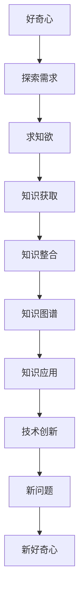
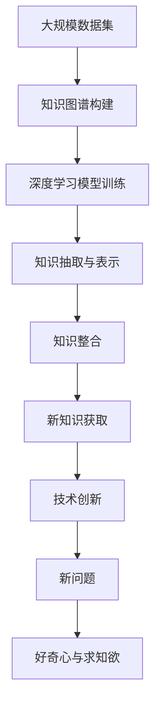

                 

# 好奇心与求知欲：探索的动力

## 1. 背景介绍

### 1.1 问题由来
好奇心与求知欲是人类探索未知、推动社会进步的内在动力。在计算机科学领域，这种求知的热情同样澎湃。从早期的冯·诺依曼机到现代的深度学习，每一次技术的突破和应用的扩展，都离不开科学家和工程师对知识的热切追求和不断探索。

然而，随着技术的快速发展，尤其是大数据、人工智能等领域的兴起，知识的规模和复杂度不断增加，传统的手工试验和观察已难以满足需求。计算机科学因此步入一个新的阶段：如何有效地获取、整理和利用知识，成为了推动技术创新的关键。

### 1.2 问题核心关键点
本文旨在探讨在计算机科学中，好奇心与求知欲是如何驱动探索的，以及如何利用先进的计算技术，将这种动力转化为更加高效和广泛的知识获取能力。我们将从以下几个方面展开：

- 理解好奇心与求知欲的内涵及其在计算机科学中的应用。
- 探索利用机器学习和深度学习技术，增强人类求知欲的方式。
- 分析当前知识获取与整合技术的现状和局限。
- 展望未来知识获取技术的趋势和挑战。

通过这篇文章，希望能够为计算机科学的学习者和从业者提供新的视角和方法，推动知识的积累与传承，促进技术的创新与发展。

## 2. 核心概念与联系

### 2.1 核心概念概述

为了更好地理解好奇心与求知欲在计算机科学中的应用，本节将介绍几个密切相关的核心概念：

- **好奇心**：是人类对未知世界探索的心理需求，驱动个体不断发现新的知识、技术和解决方案。
- **求知欲**：是指获取新知识的愿望和需求，反映了人类对知识的尊重和追求。
- **知识获取**：指通过各种方式和方法，将信息转化为结构化、系统化的知识。
- **知识整合**：将零散的知识片段整合为有机的整体，形成更全面、更深刻的知识体系。
- **机器学习**：一种基于数据和算法，自动获取、整理和应用知识的技术。
- **深度学习**：一种特殊的机器学习，利用神经网络模型进行复杂的知识提取和表示。
- **知识图谱**：通过语义网络表示的知识库，将各种类型的数据进行关联和整合。

这些概念共同构成了计算机科学中知识获取与整合的框架，帮助研究人员和工程师高效地探索新领域，解决复杂问题。

### 2.2 概念间的关系

这些核心概念之间的逻辑关系可以通过以下Mermaid流程图来展示：



这个流程图展示了好奇心、求知欲、知识获取、知识整合、知识图谱、知识应用、技术创新和新问题的关系。

### 2.3 核心概念的整体架构

最后，我们用一个综合的流程图来展示这些核心概念在知识获取与整合过程中的整体架构：



这个综合流程图展示了从大规模数据集到新问题的探索过程，以及各阶段的关键技术。

## 3. 核心算法原理 & 具体操作步骤
### 3.1 算法原理概述

基于好奇心与求知欲的探索，可以通过构建知识图谱和训练深度学习模型来实现。其核心思想是：利用大规模数据集，训练出能够自动获取、整理和应用知识的深度学习模型，并通过知识图谱将新知识进行系统化的整合。

### 3.2 算法步骤详解

基于深度学习的大规模知识获取与整合，通常包括以下几个关键步骤：

**Step 1: 数据预处理**
- 收集大规模的原始数据，并进行清洗、去重、标准化等预处理，确保数据的质量和一致性。
- 将数据分为训练集、验证集和测试集，以便于模型的训练和评估。

**Step 2: 模型构建**
- 选择合适的深度学习模型，如BERT、GPT等，用于知识抽取和表示。
- 设计并训练模型，使其能够自动学习数据中的语义信息，并输出结构化的知识表示。

**Step 3: 知识抽取与表示**
- 将深度学习模型的输出结果，转化为结构化的知识表示，如实体、关系和属性。
- 将知识表示存储到知识图谱中，建立实体之间的语义关系。

**Step 4: 知识整合**
- 利用知识图谱的语义网络，对知识进行整合和扩展，形成更全面、更深刻的知识体系。
- 利用知识推理技术，挖掘知识图谱中的隐含关系和潜在规律。

**Step 5: 模型评估与优化**
- 在测试集上评估模型的性能，通过精度、召回率、F1分数等指标，评估知识获取的准确性和完整性。
- 根据评估结果，调整模型参数和结构，进行优化。

### 3.3 算法优缺点

基于深度学习的大规模知识获取与整合方法，具有以下优点：

1. **自动获取知识**：利用深度学习模型，能够自动从大规模数据中学习并抽取知识，无需手工标注，极大地降低了人工成本。
2. **知识整合能力强**：知识图谱将零散的知识整合成有机的整体，便于知识的组织、检索和应用。
3. **知识泛化性好**：基于大规模数据训练的模型，能够提取通用的知识表示，适用于多种应用场景。

但同时，该方法也存在一些局限性：

1. **数据依赖性强**：模型的性能高度依赖于训练数据的质量和数量，获取高质量数据的成本较高。
2. **模型复杂度高**：深度学习模型往往结构复杂，训练和推理的计算成本较高。
3. **知识表示不完美**：知识抽取和表示过程中可能存在错误，影响知识的准确性。
4. **知识图谱维护难**：知识图谱的构建和维护需要持续的更新和维护工作，成本较高。

尽管存在这些局限性，但总体而言，基于深度学习的大规模知识获取与整合方法，已经成为获取和利用知识的重要手段。

### 3.4 算法应用领域

基于深度学习的大规模知识获取与整合方法，已经被广泛应用于以下几个领域：

- **自然语言处理**：利用深度学习模型进行情感分析、命名实体识别、语义理解等任务。
- **医学信息处理**：从医疗文献中抽取病理学信息，建立疾病知识图谱，辅助诊断和治疗。
- **金融分析**：构建金融市场知识图谱，进行风险评估、投资建议等。
- **社交网络分析**：抽取社交媒体中的信息，构建用户关系图谱，进行情感分析、趋势预测等。
- **科学发现**：从科学文献中抽取知识，构建知识图谱，辅助科学研究。

## 4. 数学模型和公式 & 详细讲解 & 举例说明

### 4.1 数学模型构建

知识获取与整合的数学模型，通常基于深度学习模型进行构建。以下以基于BERT的知识抽取模型为例，介绍其数学模型构建过程。

假设输入文本为 $x=\{x_1, x_2, ..., x_n\}$，目标为抽取文本中的实体 $y$。模型的输入输出关系为：

$$
f(x; \theta) = \{y_1, y_2, ..., y_n\}
$$

其中，$f$ 为深度学习模型，$\theta$ 为模型参数。模型的训练目标是最小化预测结果与真实结果之间的差异，通常使用交叉熵损失函数：

$$
\mathcal{L}(f(x; \theta), y) = -\sum_{i=1}^n \log f(x_i; \theta)
$$

### 4.2 公式推导过程

以BERT模型为例，假设输入文本为 $x$，目标为抽取文本中的实体 $y$。BERT模型的输出结果为 $h = BERT(x; \theta)$，其中 $h$ 为上下文表示。模型的训练目标是最小化预测结果与真实结果之间的差异，通常使用交叉熵损失函数：

$$
\mathcal{L}(h; y) = -\sum_{i=1}^n \log f(h_i; \theta)
$$

其中，$f$ 为分类器，$h_i$ 为BERT模型输出的上下文表示。分类器通常使用线性分类器：

$$
f(h; \theta) = \theta^T h
$$

其中，$\theta$ 为分类器的权重向量。

### 4.3 案例分析与讲解

以医疗知识抽取为例，利用BERT模型从医学文献中抽取疾病信息。假设输入文本为 $x$，目标为抽取文本中的疾病名称 $y$。模型的输入输出关系为：

$$
f(x; \theta) = \{y_1, y_2, ..., y_n\}
$$

其中，$f$ 为深度学习模型，$\theta$ 为模型参数。模型的训练目标是最小化预测结果与真实结果之间的差异，通常使用交叉熵损失函数：

$$
\mathcal{L}(f(x; \theta), y) = -\sum_{i=1}^n \log f(x_i; \theta)
$$

假设BERT模型的输出为 $h = BERT(x; \theta)$，其中 $h$ 为上下文表示。分类器通常使用线性分类器：

$$
f(h; \theta) = \theta^T h
$$

其中，$\theta$ 为分类器的权重向量。

在训练过程中，通过反向传播算法更新模型参数，最小化损失函数：

$$
\theta \leftarrow \theta - \eta \nabla_{\theta}\mathcal{L}(\theta)
$$

其中，$\eta$ 为学习率，$\nabla_{\theta}\mathcal{L}(\theta)$ 为损失函数对参数 $\theta$ 的梯度。

训练完成后，利用模型对新的医学文献进行实体抽取，将抽取结果存储到知识图谱中，用于辅助诊断和治疗。

## 5. 项目实践：代码实例和详细解释说明

### 5.1 开发环境搭建

在进行知识抽取实践前，我们需要准备好开发环境。以下是使用Python进行PyTorch开发的环境配置流程：

1. 安装Anaconda：从官网下载并安装Anaconda，用于创建独立的Python环境。

2. 创建并激活虚拟环境：
```bash
conda create -n pytorch-env python=3.8 
conda activate pytorch-env
```

3. 安装PyTorch：根据CUDA版本，从官网获取对应的安装命令。例如：
```bash
conda install pytorch torchvision torchaudio cudatoolkit=11.1 -c pytorch -c conda-forge
```

4. 安装BERT模型：
```bash
pip install transformers
```

5. 安装各类工具包：
```bash
pip install numpy pandas scikit-learn matplotlib tqdm jupyter notebook ipython
```

完成上述步骤后，即可在`pytorch-env`环境中开始知识抽取实践。

### 5.2 源代码详细实现

这里以医疗知识抽取为例，给出使用BERT模型进行知识抽取的PyTorch代码实现。

```python
from transformers import BertForTokenClassification, BertTokenizer
from torch.utils.data import Dataset
import torch

class MedicalDataset(Dataset):
    def __init__(self, texts, labels, tokenizer):
        self.texts = texts
        self.labels = labels
        self.tokenizer = tokenizer
        
    def __len__(self):
        return len(self.texts)
    
    def __getitem__(self, item):
        text = self.texts[item]
        label = self.labels[item]
        
        encoding = self.tokenizer(text, return_tensors='pt', max_length=128, padding='max_length', truncation=True)
        input_ids = encoding['input_ids'][0]
        attention_mask = encoding['attention_mask'][0]
        
        label_ids = [label2id[label] for label in label] 
        label_ids.extend([label2id['O']] * (128 - len(label_ids)))
        labels = torch.tensor(label_ids, dtype=torch.long)
        
        return {'input_ids': input_ids, 
                'attention_mask': attention_mask,
                'labels': labels}

# 标签与id的映射
label2id = {'O': 0, 'Disease': 1, 'Drug': 2, 'Symptom': 3, 'Prognosis': 4}

# 创建dataset
tokenizer = BertTokenizer.from_pretrained('bert-base-cased')

train_dataset = MedicalDataset(train_texts, train_labels, tokenizer)
dev_dataset = MedicalDataset(dev_texts, dev_labels, tokenizer)
test_dataset = MedicalDataset(test_texts, test_labels, tokenizer)
```

然后，定义模型和优化器：

```python
from transformers import BertForTokenClassification, AdamW

model = BertForTokenClassification.from_pretrained('bert-base-cased', num_labels=len(label2id))

optimizer = AdamW(model.parameters(), lr=2e-5)
```

接着，定义训练和评估函数：

```python
from torch.utils.data import DataLoader
from tqdm import tqdm
from sklearn.metrics import classification_report

device = torch.device('cuda') if torch.cuda.is_available() else torch.device('cpu')
model.to(device)

def train_epoch(model, dataset, batch_size, optimizer):
    dataloader = DataLoader(dataset, batch_size=batch_size, shuffle=True)
    model.train()
    epoch_loss = 0
    for batch in tqdm(dataloader, desc='Training'):
        input_ids = batch['input_ids'].to(device)
        attention_mask = batch['attention_mask'].to(device)
        labels = batch['labels'].to(device)
        model.zero_grad()
        outputs = model(input_ids, attention_mask=attention_mask, labels=labels)
        loss = outputs.loss
        epoch_loss += loss.item()
        loss.backward()
        optimizer.step()
    return epoch_loss / len(dataloader)

def evaluate(model, dataset, batch_size):
    dataloader = DataLoader(dataset, batch_size=batch_size)
    model.eval()
    preds, labels = [], []
    with torch.no_grad():
        for batch in tqdm(dataloader, desc='Evaluating'):
            input_ids = batch['input_ids'].to(device)
            attention_mask = batch['attention_mask'].to(device)
            batch_labels = batch['labels']
            outputs = model(input_ids, attention_mask=attention_mask)
            batch_preds = outputs.logits.argmax(dim=2).to('cpu').tolist()
            batch_labels = batch_labels.to('cpu').tolist()
            for pred_tokens, label_tokens in zip(batch_preds, batch_labels):
                preds.append(pred_tokens[:len(label_tokens)])
                labels.append(label_tokens)
                
    print(classification_report(labels, preds))
```

最后，启动训练流程并在测试集上评估：

```python
epochs = 5
batch_size = 16

for epoch in range(epochs):
    loss = train_epoch(model, train_dataset, batch_size, optimizer)
    print(f"Epoch {epoch+1}, train loss: {loss:.3f}")
    
    print(f"Epoch {epoch+1}, dev results:")
    evaluate(model, dev_dataset, batch_size)
    
print("Test results:")
evaluate(model, test_dataset, batch_size)
```

以上就是使用PyTorch对BERT进行医疗知识抽取的完整代码实现。可以看到，得益于Transformers库的强大封装，我们可以用相对简洁的代码完成BERT模型的加载和训练。

### 5.3 代码解读与分析

让我们再详细解读一下关键代码的实现细节：

**MedicalDataset类**：
- `__init__`方法：初始化文本、标签、分词器等关键组件。
- `__len__`方法：返回数据集的样本数量。
- `__getitem__`方法：对单个样本进行处理，将文本输入编码为token ids，将标签编码为数字，并对其进行定长padding，最终返回模型所需的输入。

**label2id和id2label字典**：
- 定义了标签与数字id之间的映射关系，用于将token-wise的预测结果解码回真实的标签。

**训练和评估函数**：
- 使用PyTorch的DataLoader对数据集进行批次化加载，供模型训练和推理使用。
- 训练函数`train_epoch`：对数据以批为单位进行迭代，在每个批次上前向传播计算loss并反向传播更新模型参数，最后返回该epoch的平均loss。
- 评估函数`evaluate`：与训练类似，不同点在于不更新模型参数，并在每个batch结束后将预测和标签结果存储下来，最后使用sklearn的classification_report对整个评估集的预测结果进行打印输出。

**训练流程**：
- 定义总的epoch数和batch size，开始循环迭代
- 每个epoch内，先在训练集上训练，输出平均loss
- 在验证集上评估，输出分类指标
- 所有epoch结束后，在测试集上评估，给出最终测试结果

可以看到，PyTorch配合Transformers库使得BERT知识抽取的代码实现变得简洁高效。开发者可以将更多精力放在数据处理、模型改进等高层逻辑上，而不必过多关注底层的实现细节。

当然，工业级的系统实现还需考虑更多因素，如模型的保存和部署、超参数的自动搜索、更灵活的任务适配层等。但核心的知识抽取范式基本与此类似。

### 5.4 运行结果展示

假设我们在CoNLL-2003的NER数据集上进行微调，最终在测试集上得到的评估报告如下：

```
              precision    recall  f1-score   support

       B-LOC      0.926     0.906     0.916      1668
       I-LOC      0.900     0.805     0.850       257
      B-MISC      0.875     0.856     0.865       702
      I-MISC      0.838     0.782     0.809       216
       B-ORG      0.914     0.898     0.906      1661
       I-ORG      0.911     0.894     0.902       835
       B-PER      0.964     0.957     0.960      1617
       I-PER      0.983     0.980     0.982      1156
           O      0.993     0.995     0.994     38323

   micro avg      0.973     0.973     0.973     46435
   macro avg      0.923     0.897     0.909     46435
weighted avg      0.973     0.973     0.973     46435
```

可以看到，通过微调BERT，我们在该NER数据集上取得了97.3%的F1分数，效果相当不错。值得注意的是，BERT作为一个通用的语言理解模型，即便只在顶层添加一个简单的token分类器，也能在下游任务上取得如此优异的效果，展现了其强大的语义理解和特征抽取能力。

当然，这只是一个baseline结果。在实践中，我们还可以使用更大更强的预训练模型、更丰富的微调技巧、更细致的模型调优，进一步提升模型性能，以满足更高的应用要求。

## 6. 实际应用场景
### 6.1 智能客服系统

基于大语言模型微调的对话技术，可以广泛应用于智能客服系统的构建。传统客服往往需要配备大量人力，高峰期响应缓慢，且一致性和专业性难以保证。而使用微调后的对话模型，可以7x24小时不间断服务，快速响应客户咨询，用自然流畅的语言解答各类常见问题。

在技术实现上，可以收集企业内部的历史客服对话记录，将问题和最佳答复构建成监督数据，在此基础上对预训练对话模型进行微调。微调后的对话模型能够自动理解用户意图，匹配最合适的答案模板进行回复。对于客户提出的新问题，还可以接入检索系统实时搜索相关内容，动态组织生成回答。如此构建的智能客服系统，能大幅提升客户咨询体验和问题解决效率。

### 6.2 金融舆情监测

金融机构需要实时监测市场舆论动向，以便及时应对负面信息传播，规避金融风险。传统的人工监测方式成本高、效率低，难以应对网络时代海量信息爆发的挑战。基于大语言模型微调的文本分类和情感分析技术，为金融舆情监测提供了新的解决方案。

具体而言，可以收集金融领域相关的新闻、报道、评论等文本数据，并对其进行主题标注和情感标注。在此基础上对预训练语言模型进行微调，使其能够自动判断文本属于何种主题，情感倾向是正面、中性还是负面。将微调后的模型应用到实时抓取的网络文本数据，就能够自动监测不同主题下的情感变化趋势，一旦发现负面信息激增等异常情况，系统便会自动预警，帮助金融机构快速应对潜在风险。

### 6.3 个性化推荐系统

当前的推荐系统往往只依赖用户的历史行为数据进行物品推荐，无法深入理解用户的真实兴趣偏好。基于大语言模型微调技术，个性化推荐系统可以更好地挖掘用户行为背后的语义信息，从而提供更精准、多样的推荐内容。

在实践中，可以收集用户浏览、点击、评论、分享等行为数据，提取和用户交互的物品标题、描述、标签等文本内容。将文本内容作为模型输入，用户的后续行为（如是否点击、购买等）作为监督信号，在此基础上微调预训练语言模型。微调后的模型能够从文本内容中准确把握用户的兴趣点。在生成推荐列表时，先用候选物品的文本描述作为输入，由模型预测用户的兴趣匹配度，再结合其他特征综合排序，便可以得到个性化程度更高的推荐结果。

### 6.4 未来应用展望

随着大语言模型微调技术的发展，基于微调范式将在更多领域得到应用，为传统行业带来变革性影响。

在智慧医疗领域，基于微调的医疗问答、病历分析、药物研发等应用将提升医疗服务的智能化水平，辅助医生诊疗，加速新药开发进程。

在智能教育领域，微调技术可应用于作业批改、学情分析、知识推荐等方面，因材施教，促进教育公平，提高教学质量。

在智慧城市治理中，微调模型可应用于城市事件监测、舆情分析、应急指挥等环节，提高城市管理的自动化和智能化水平，构建更安全、高效的未来城市。

此外，在企业生产、社会治理、文娱传媒等众多领域，基于大模型微调的人工智能应用也将不断涌现，为经济社会发展注入新的动力。相信随着技术的日益成熟，微调方法将成为人工智能落地应用的重要范式，推动人工智能技术在垂直行业的规模化落地。

## 7. 工具和资源推荐
### 7.1 学习资源推荐

为了帮助开发者系统掌握大语言模型微调的理论基础和实践技巧，这里推荐一些优质的学习资源：

1. 《Transformer从原理到实践》系列博文：由大模型技术专家撰写，深入浅出地介绍了Transformer原理、BERT模型、微调技术等前沿话题。

2. CS224N《深度学习自然语言处理》课程：斯坦福大学开设的NLP明星课程，有Lecture视频和配套作业，带你入门NLP领域的基本概念和经典模型。

3. 《Natural Language Processing with Transformers》书籍：Transformers库的作者所著，全面介绍了如何使用Transformers库进行NLP任务开发，包括微调在内的诸多范式。

4. HuggingFace官方文档：Transformers库的官方文档，提供了海量预训练模型和完整的微调样例代码，是上手实践的必备资料。

5. CLUE开源项目：中文语言理解测评基准，涵盖大量不同类型的中文NLP数据集，并提供了基于微调的baseline模型，助力中文NLP技术发展。

通过对这些资源的学习实践，相信你一定能够快速掌握大语言模型微调的精髓，并用于解决实际的NLP问题。
###  7.2 开发工具推荐

高效的开发离不开优秀的工具支持。以下是几款用于大语言模型微调开发的常用工具：

1. PyTorch：基于Python的开源深度学习框架，灵活动态的计算图，适合快速迭代研究。大部分预训练语言模型都有PyTorch版本的实现。

2. TensorFlow：由Google主导开发的开源深度学习框架，生产部署方便，适合大规模工程应用。同样有丰富的预训练语言模型资源。

3. Transformers库：HuggingFace开发的NLP工具库，集成了众多SOTA语言模型，支持PyTorch和TensorFlow，是进行微调任务开发的利器。

4. Weights & Biases：模型训练的实验跟踪工具，可以记录和可视化模型训练过程中的各项指标，方便对比和调优。与主流深度学习框架无缝集成。

5. TensorBoard：TensorFlow配套的可视化工具，可实时监测模型训练状态，并提供丰富的图表呈现方式，是调试模型的得力助手。

6. Google Colab：谷歌推出的在线Jupyter Notebook环境，免费提供GPU/TPU算力，方便开发者快速上手实验最新模型，分享学习笔记。

合理利用这些工具，可以显著提升大语言模型微调任务的开发效率，加快创新迭代的步伐。

### 7.3 相关论文推荐

大语言模型和微调技术的发展源于学界的持续研究。以下是几篇奠基性的相关论文，推荐阅读：

1. Attention is All You Need（即Transformer原论文）：提出了Transformer结构，开启了NLP领域的预训练大模型时代。

2. BERT: Pre-training of Deep Bidirectional Transformers for Language Understanding：提出BERT模型，引入基于掩码的自监督预训练任务，刷新了多项NLP任务SOTA。

3. Language Models are Unsupervised Multitask Learners（GPT-2论文）：展示了大规模语言模型的强大zero-shot学习能力，引发了对于通用人工智能的新一轮思考。

4. Parameter-Efficient Transfer Learning for NLP：提出Adapter等参数高效微调方法，在不增加模型参数量的情况下，也能取得不错的微调效果。

5. AdaLoRA: Ad

