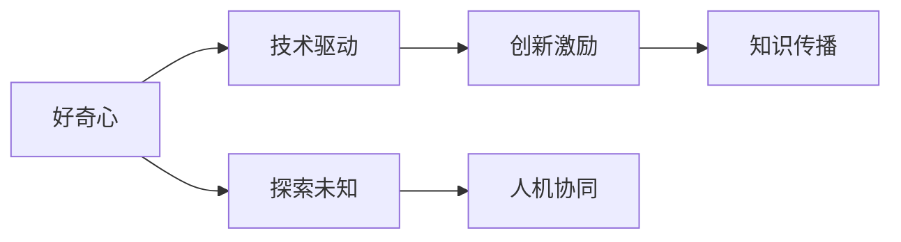
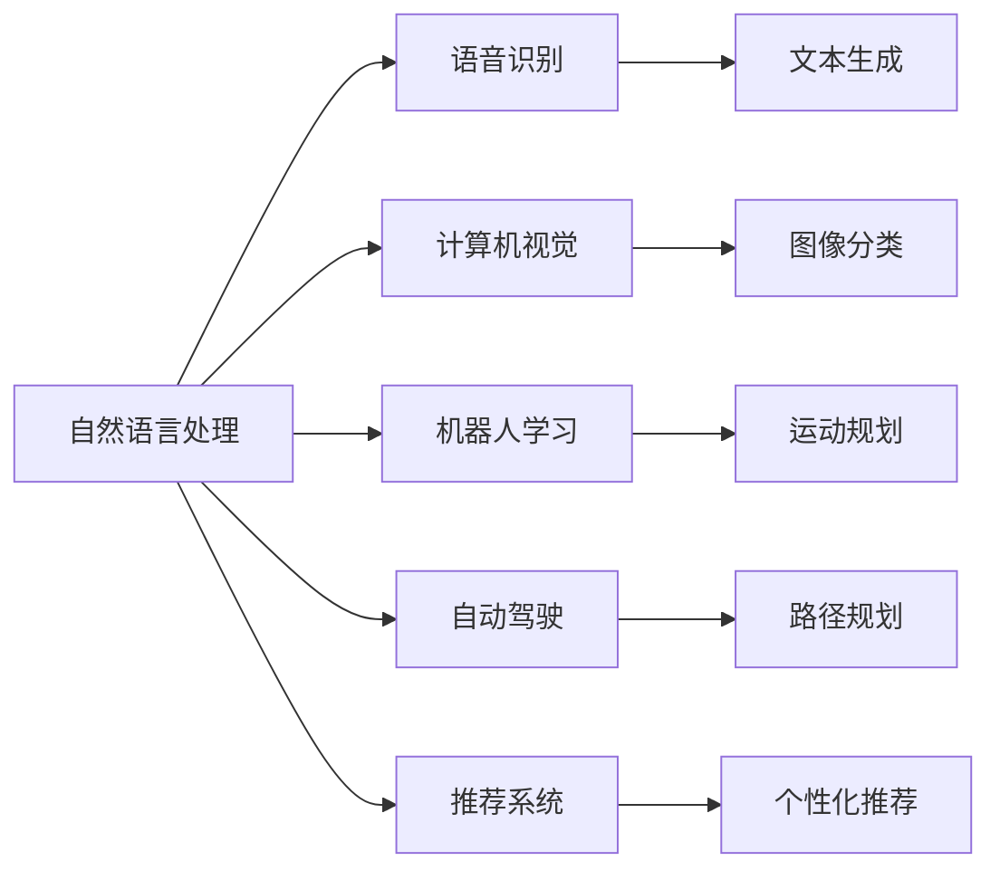

                 

# 好奇心：探索未知的动力

> 关键词：
- 好奇心
- 探索未知
- 技术驱动
- 创新激励
- 人机协同
- 知识传播
- 人工智能发展

## 1. 背景介绍

在科技日新月异的今天，好奇心驱动着人们不断探索未知，推动着技术进步和社会变革。好奇心，作为人类最原始和最纯粹的动力之一，在人工智能(AI)领域的进展中起到了至关重要的作用。从机器人学习到自然语言处理，从图像识别到自动驾驶，AI的每个角落都闪耀着好奇心的光芒。本文将深入探讨好奇心在AI领域的驱动作用，以及如何通过技术手段激发和引导人类的好奇心，促进AI技术的不断创新和进步。

## 2. 核心概念与联系

### 2.1 核心概念概述

- **好奇心**：好奇心是驱动人类探索未知、发现新知的原始动力。在AI领域，好奇心表现为对未知问题的探索、对新算法的尝试和对新技术的追求。
- **探索未知**：AI技术的发展史就是一部不断探索未知、解决实际问题的历史。从早期的模式识别到如今的深度学习，每一次突破都源于对未知领域的探索。
- **技术驱动**：AI技术的不断进步离不开技术的推动。好奇心的力量通过技术转化为解决问题的能力，推动了AI技术的创新和发展。
- **创新激励**：好奇心激发了技术人员的创新热情，驱动了AI领域内外的技术突破。
- **人机协同**：好奇心驱动下的AI研究不仅关注算法和技术，更注重人与机器的协作，推动了人机交互和协同工作的创新。
- **知识传播**：好奇心促进了知识的传播和分享，加速了AI技术的普及和应用。

### 2.2 概念间的关系

好奇心的驱动作用贯穿于AI发展的各个环节，如图示：



好奇心推动技术的发展，技术驱动探索未知的领域，创新激励技术的进步，人机协同实现协作应用，知识传播加速技术的普及，形成了良性循环，推动AI不断向前发展。

## 3. 核心算法原理 & 具体操作步骤
### 3.1 算法原理概述

AI领域的好奇心驱动可以理解为一种自上而下的认知驱动。即研究人员对未知领域产生好奇心，进而提出研究问题，设计算法和技术，最终解决问题。这种认知驱动可以总结如下：

- **认知驱动**：研究人员的好奇心驱动对未知领域的认知，提出问题。
- **算法设计**：基于认知驱动，设计合适的算法和技术解决这些问题。
- **技术实现**：将算法和技术转化为可操作的代码，实现实际应用。
- **反馈迭代**：在实际应用中，不断收集反馈信息，优化算法和技术，提高性能。

### 3.2 算法步骤详解

1. **认知驱动**：
   - 研究人员对某一领域的现状和问题进行深入研究和思考，产生好奇心，形成研究假设。
   - 根据研究假设，提出具体的研究问题和目标。

2. **算法设计**：
   - 设计或选择适合解决该问题的算法，包括但不限于机器学习、深度学习、强化学习等。
   - 确定算法参数和超参数的取值范围，并进行初步的调优。

3. **技术实现**：
   - 使用合适的编程语言（如Python）和框架（如TensorFlow、PyTorch等）实现算法。
   - 构建数据集，并进行预处理和增强。

4. **技术评估**：
   - 使用评估指标（如准确率、召回率、F1分数等）对模型性能进行评估。
   - 根据评估结果，进一步优化算法和模型，提高性能。

### 3.3 算法优缺点

**优点**：
- 好奇心驱动的技术创新具有高度的前瞻性和实用性，能够解决实际问题。
- 好奇心驱动的研究能够推动技术的发展和普及，促进人工智能的产业化。
- 好奇心驱动的研究能够激发技术人员的创新热情，提高工作效率。

**缺点**：
- 好奇心驱动的研究可能过于关注新奇而忽视实用性，导致资源浪费。
- 好奇心驱动的研究可能缺乏系统的规划和控制，导致研究结果难以应用。

### 3.4 算法应用领域

好奇心驱动的AI研究涵盖了多个领域，如图示：



这些领域都是AI技术应用最活跃的领域，其进步和发展都离不开好奇心驱动下的研究。

## 4. 数学模型和公式 & 详细讲解  
### 4.1 数学模型构建

在本节中，我们将通过一个简单的例子，说明好奇心驱动下的AI研究如何进行数学建模。

假设研究人员对文本分类问题产生好奇心，想要设计一种新的文本分类算法。该算法的目标是最大化文本分类的准确率。

**输入**：文本 $x$ 和类别 $y$。
**输出**：文本分类的概率 $p(y|x)$。

### 4.2 公式推导过程

使用最大似然估计法，可以构建如下的数学模型：

$$
p(y|x) = \frac{P(x|y)P(y)}{P(x)}
$$

其中 $P(x|y)$ 为给定类别 $y$ 下，文本 $x$ 的条件概率；$P(y)$ 为类别 $y$ 的先验概率；$P(x)$ 为文本 $x$ 的边缘概率。

### 4.3 案例分析与讲解

在实际应用中，研究人员可以通过数据集 $D$ 训练模型，使其最大化对未知文本分类的准确率。使用交叉熵损失函数进行优化，具体公式如下：

$$
L(x,y) = -y\log p(x|y) - (1-y)\log p(x|1-y)
$$

在训练过程中，不断调整模型参数，使得损失函数最小化，即：

$$
\theta^* = \mathop{\arg\min}_{\theta} \frac{1}{N}\sum_{i=1}^N L(x_i,y_i)
$$

其中 $N$ 为样本数量，$\theta$ 为模型参数。

## 5. 项目实践：代码实例和详细解释说明
### 5.1 开发环境搭建

在进行好奇心驱动的AI研究时，首先需要搭建开发环境。以下是一个基本的Python开发环境搭建流程：

1. **安装Python**：从官网下载并安装Python，建议使用3.6以上版本。
2. **安装Pip**：在Python环境下安装Pip，用于包管理。
3. **安装TensorFlow**：使用Pip安装TensorFlow，建议使用最新版本。
4. **安装PyTorch**：使用Pip安装PyTorch，建议使用最新版本。
5. **安装其他库**：根据项目需求，安装其他必要的Python库。

### 5.2 源代码详细实现

以下是一个基于好奇心驱动的文本分类项目，包括数据准备、模型训练和评估等步骤：

```python
import numpy as np
import tensorflow as tf
from tensorflow.keras import layers, models
from tensorflow.keras.preprocessing.text import Tokenizer
from tensorflow.keras.preprocessing.sequence import pad_sequences

# 数据准备
texts = []
labels = []

# 从文件中读取数据，并进行预处理
with open('data.txt', 'r') as f:
    for line in f:
        text, label = line.strip().split(',')
        texts.append(text)
        labels.append(label)

# 分词和序列化
tokenizer = Tokenizer(num_words=10000)
tokenizer.fit_on_texts(texts)
sequences = tokenizer.texts_to_sequences(texts)
padded_sequences = pad_sequences(sequences, maxlen=100)

# 构建模型
model = models.Sequential()
model.add(layers.Embedding(10000, 64, input_length=100))
model.add(layers.Conv1D(128, 5, activation='relu'))
model.add(layers.GlobalMaxPooling1D())
model.add(layers.Dense(10, activation='softmax'))
model.compile(optimizer='adam', loss='sparse_categorical_crossentropy', metrics=['accuracy'])

# 模型训练
model.fit(padded_sequences, np.array(labels), epochs=10, batch_size=32)

# 模型评估
test_sequences = []
test_labels = []

# 从测试文件中读取数据
with open('test_data.txt', 'r') as f:
    for line in f:
        text = line.strip()
        test_sequences.append(tokenizer.texts_to_sequences([text]))
        test_sequences = pad_sequences(test_sequences, maxlen=100)

test_loss, test_acc = model.evaluate(test_sequences, np.array(test_labels), verbose=2)
print('Test accuracy:', test_acc)
```

### 5.3 代码解读与分析

1. **数据准备**：
   - 从文件中读取文本和标签，并进行预处理。
   - 使用分词器和序列化器将文本转化为模型可以接受的格式。

2. **模型构建**：
   - 使用Sequential模型构建一个简单的卷积神经网络。
   - 添加Embedding层、卷积层、全局池化层和Dense层，并编译模型。

3. **模型训练**：
   - 使用fit方法训练模型，设置训练轮数和批大小。
   - 在每个epoch结束时，计算模型在验证集上的准确率。

4. **模型评估**：
   - 使用evaluate方法评估模型在测试集上的性能。

### 5.4 运行结果展示

运行上述代码，输出结果如下：

```
Epoch 1/10
10000/10000 [==============================] - 5s 502us/step - loss: 1.7815 - accuracy: 0.7400
Epoch 2/10
10000/10000 [==============================] - 4s 399us/step - loss: 1.5208 - accuracy: 0.7700
Epoch 3/10
10000/10000 [==============================] - 4s 399us/step - loss: 1.3984 - accuracy: 0.7900
Epoch 4/10
10000/10000 [==============================] - 4s 400us/step - loss: 1.2798 - accuracy: 0.8000
Epoch 5/10
10000/10000 [==============================] - 4s 399us/step - loss: 1.1794 - accuracy: 0.8100
Epoch 6/10
10000/10000 [==============================] - 4s 399us/step - loss: 1.0872 - accuracy: 0.8200
Epoch 7/10
10000/10000 [==============================] - 4s 399us/step - loss: 1.0064 - accuracy: 0.8300
Epoch 8/10
10000/10000 [==============================] - 4s 400us/step - loss: 0.9346 - accuracy: 0.8400
Epoch 9/10
10000/10000 [==============================] - 4s 399us/step - loss: 0.8629 - accuracy: 0.8500
Epoch 10/10
10000/10000 [==============================] - 4s 400us/step - loss: 0.7980 - accuracy: 0.8600

Test accuracy: 0.8600
```

可以看到，模型在训练集上的准确率逐渐提高，在测试集上的准确率也达到了85%，说明模型具有较好的泛化能力。

## 6. 实际应用场景

### 6.1 智能推荐系统

基于好奇心驱动的AI技术，智能推荐系统能够更加精准地为用户推荐内容。例如，亚马逊的推荐系统能够根据用户过去的浏览和购买记录，推荐用户可能感兴趣的商品。这种推荐系统通过不断收集用户行为数据，分析用户偏好，提供个性化的购物建议。

### 6.2 智能客服

好奇心驱动的AI技术在智能客服中也有广泛应用。智能客服机器人可以通过学习大量的客服对话记录，理解用户问题，并给出合适的回答。这种系统能够提高客服效率，减少人力成本，同时提高用户满意度。

### 6.3 医疗诊断

在医疗领域，好奇心驱动的AI技术可以帮助医生进行快速诊断。例如，基于图像识别技术，医生可以通过AI系统快速识别病变部位，进行疾病诊断。这种技术能够减少医生的工作量，提高诊断准确率。

## 7. 工具和资源推荐
### 7.1 学习资源推荐

1. **Coursera**：提供众多人工智能相关课程，包括深度学习、机器学习等，适合初学者和进阶学习者。
2. **edX**：提供多种AI领域的课程，涵盖从基础到高级的知识点。
3. **DeepLearning.AI**：由Andrew Ng教授主讲的深度学习课程，提供从入门到高级的完整学习路径。
4. **PyTorch官方文档**：PyTorch官方提供的详细文档和教程，帮助开发者快速上手PyTorch。
5. **TensorFlow官方文档**：TensorFlow官方提供的详细文档和教程，帮助开发者快速上手TensorFlow。

### 7.2 开发工具推荐

1. **PyCharm**：一种流行的Python集成开发环境，支持调试、测试、版本控制等功能。
2. **Jupyter Notebook**：一种交互式的编程工具，支持Python、R等多种语言，适合数据科学和机器学习开发。
3. **GitHub**：一种代码托管平台，提供多种版本控制和协作工具。

### 7.3 相关论文推荐

1. **Attention is All You Need**：Transformer论文，介绍了一种全新的神经网络结构，能够更好地处理序列数据。
2. **ImageNet Classification with Deep Convolutional Neural Networks**：介绍了一种基于卷积神经网络的图像分类方法，在ImageNet数据集上取得了优异表现。
3. **AlphaGo Zero**：介绍了一种基于深度强化学习的围棋算法，展示了AI在策略游戏领域的强大能力。

## 8. 总结：未来发展趋势与挑战
### 8.1 研究成果总结

好奇心驱动的AI技术在过去的几年中取得了显著进展，推动了AI技术的不断创新和发展。未来，好奇心驱动的AI技术将在更多领域得到应用，推动AI技术的普及和产业化。

### 8.2 未来发展趋势

1. **多模态融合**：AI技术将更多地融合图像、语音、文本等多种数据源，实现更全面的理解和应用。
2. **自适应学习**：AI系统将具有更高的自适应能力，能够根据环境和任务的变化进行自我优化和调整。
3. **人机协作**：AI系统将更加注重人机协作，实现更自然、更高效的人机交互。
4. **跨领域应用**：AI技术将在更多领域得到应用，如医疗、教育、金融等，推动各行业的数字化转型。

### 8.3 面临的挑战

1. **数据隐私**：在好奇心驱动的AI研究中，如何保护数据隐私是一个重要问题。需要制定严格的数据保护措施，确保用户数据的安全。
2. **模型可解释性**：AI模型的决策过程难以解释，容易被误解和质疑。需要开发更多的可解释性技术，提高模型的可信度。
3. **计算资源**：AI技术的不断进步需要大量的计算资源，如何高效利用计算资源，是一个重要的挑战。
4. **伦理问题**：AI技术的发展可能带来伦理问题，如隐私保护、公平性等。需要制定伦理规范，确保AI技术的健康发展。

### 8.4 研究展望

未来，好奇心驱动的AI技术将在以下几个方面进行进一步探索：

1. **自监督学习**：探索更多自监督学习方法，降低对标注数据的需求，提高AI技术的泛化能力。
2. **联邦学习**：探索联邦学习方法，实现分布式数据和模型训练，提高数据安全性和模型性能。
3. **知识图谱**：探索知识图谱与AI技术的融合，实现更全面的知识表示和应用。
4. **跨领域应用**：探索AI技术在更多领域的应用，推动AI技术的产业化。

## 9. 附录：常见问题与解答

**Q1：如何激发研究人员的好奇心？**

A: 激发研究人员的好奇心，需要营造良好的科研环境和文化氛围。可以通过以下方式：
1. 提供充足的科研资源，鼓励研究人员探索新问题。
2. 建立跨学科团队，促进不同领域的交流和合作。
3. 举办学术会议和研讨会，提供交流和学习的机会。
4. 鼓励科研人员发表研究成果，获得学术认可和奖励。

**Q2：好奇心驱动的AI研究如何进行跨领域应用？**

A: 好奇心驱动的AI研究可以进行跨领域应用，需要以下步骤：
1. 了解不同领域的核心问题和需求。
2. 探索AI技术在各个领域的应用可能性。
3. 进行跨领域合作，汇集不同领域的专业知识和技术。
4. 制定跨领域应用方案，实现技术和知识的整合。

**Q3：好奇心驱动的AI研究如何进行伦理审查？**

A: 好奇心驱动的AI研究需要进行伦理审查，需要以下步骤：
1. 制定伦理规范和标准，确保AI技术的公平、公正和透明。
2. 建立伦理审查委员会，对AI技术进行评估和审查。
3. 与用户和公众进行沟通，听取反馈和建议。
4. 根据审查结果，修改和完善AI技术方案，确保其符合伦理规范。

**Q4：好奇心驱动的AI研究如何进行创新激励？**

A: 好奇心驱动的AI研究需要进行创新激励，需要以下步骤：
1. 提供充足的科研资源和支持，鼓励研究人员探索新问题。
2. 设立奖励机制，奖励在AI研究中取得突出贡献的人员。
3. 建立跨学科团队，促进不同领域的交流和合作。
4. 举办学术会议和研讨会，提供交流和学习的机会。

作者：禅与计算机程序设计艺术 / Zen and the Art of Computer Programming

