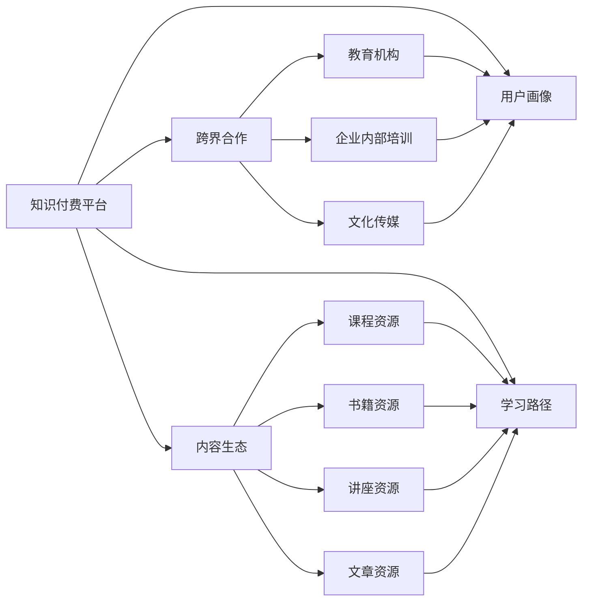

                 

# 如何利用跨界合作推广知识付费产品

## 1. 背景介绍

### 1.1 问题由来
随着互联网和智能技术的迅速发展，知识付费成为一股不可逆转的趋势，无论是企业内部培训还是个人技能提升，都面临着对知识获取的高需求。然而，尽管知识付费市场不断扩大，但其效果却因为用户流失率高、内容质量参差不齐等问题而饱受诟病。如何通过有效的合作机制，将优质的内容资源引入用户视野，并激发用户的长期学习热情，成为了知识付费平台的一大难题。

### 1.2 问题核心关键点
当前知识付费市场面临的主要挑战包括：
1. **用户获取和留存率低**：用户订阅付费内容后，往往由于缺乏持续动力而选择终止订阅，导致平台收入不稳定。
2. **内容质量参差不齐**：平台上内容良莠不齐，难以满足用户对于高质量、高实用性内容的需求。
3. **付费模式单一**：传统的按月付费模式缺乏灵活性，未能充分利用用户在不同阶段的需求变化。
4. **个性化体验不足**：缺乏对用户行为和兴趣的深入理解，无法提供个性化推荐和定制服务。

解决这些问题，需要知识付费平台进行多方面的创新和优化，而跨界合作无疑是一种有效的途径。

### 1.3 问题研究意义
跨界合作，将不同领域的优质资源整合到知识付费产品中，不仅能够提升内容质量和用户体验，还可以有效增加用户粘性和留存率，从而实现平台收入的稳定增长。此外，跨界合作有助于知识付费平台与行业内外的多个领域进行资源共享，产生协同效应，共同推动知识传播和应用。

## 2. 核心概念与联系

### 2.1 核心概念概述

为了深入理解如何利用跨界合作推广知识付费产品，我们首先需要明晰以下核心概念：

- **知识付费平台(Knowledge-Paid Platforms)**：通过互联网提供付费课程、文档、音频视频等知识内容的平台，如网易云课堂、得到等。
- **跨界合作(Cross-Domain Collaboration)**：不同领域的企业或机构之间，为了共同的目标和利益而进行的合作，如知识付费平台与教育机构、企业内部培训、文化传媒等。
- **内容生态(Content Ecosystem)**：知识付费平台通过整合不同来源的内容资源，构建完整的知识服务体系，如课程、书籍、讲座、文章等。
- **用户画像(User Persona)**：通过数据分析构建的具有高度代表性的用户群体特征，包括年龄、职业、兴趣等，帮助平台精准推送个性化内容。
- **学习路径(Learning Path)**：根据用户画像和目标，规划从基础到高级的系统学习路径，帮助用户高效完成学习任务。

这些核心概念构成了利用跨界合作推广知识付费产品的基本框架，通过以下Mermaid流程图展示它们之间的关系：



这个流程图展示了知识付费平台在构建内容生态时，通过与教育机构、企业内部培训、文化传媒等进行跨界合作，丰富自身的内容资源。同时，根据用户画像和预设的学习路径，为用户推荐和推送个性化内容，实现精准化的学习体验。

### 2.2 概念间的关系

通过上述Mermaid流程图，我们可以进一步理解各个核心概念之间的关系：

- **知识付费平台与跨界合作**：知识付费平台通过跨界合作，引入不同领域的优质内容资源，提升自身平台内容的丰富性和多样性。
- **跨界合作与内容生态**：跨界合作过程中，合作伙伴提供各自的课程、书籍、讲座、文章等资源，共同构建知识付费平台的内容生态。
- **内容生态与用户画像**：内容生态的构建以用户画像为基础，通过精准的用户画像，平台能够针对性地推荐内容，提升用户体验。
- **用户画像与学习路径**：用户画像数据为平台提供了详细的用户特征，平台能够根据这些特征，为用户设计个性化的学习路径，满足用户的学习需求。

这些概念之间的关系紧密相连，共同构成了知识付费平台通过跨界合作推广知识付费产品的关键框架。

## 3. 核心算法原理 & 具体操作步骤
### 3.1 算法原理概述

利用跨界合作推广知识付费产品的核心算法原理可以归纳为以下几个方面：

1. **用户画像构建**：通过对用户的行为数据进行分析，构建详尽的用户画像，包括年龄、职业、兴趣、学习时长、学习频率等特征。
2. **跨界资源整合**：与教育机构、企业内部培训、文化传媒等合作伙伴进行跨界合作，整合优质的课程资源、书籍资源、讲座资源、文章资源等，丰富知识付费平台的内容生态。
3. **内容推荐算法**：根据用户画像和内容特征，采用推荐算法为用户推荐相关课程和文章，提高用户的学习兴趣和满意度。
4. **个性化学习路径规划**：根据用户的学习目标和进度，结合推荐算法，为每位用户设计个性化的学习路径，帮助用户系统化地完成学习任务。

### 3.2 算法步骤详解

以下详细介绍利用跨界合作推广知识付费产品的具体算法步骤：

#### 3.2.1 用户画像构建
1. **数据收集**：收集用户在平台上的浏览记录、购买记录、学习行为、反馈评价等数据。
2. **特征提取**：通过数据挖掘和统计分析，提取出用户的关键特征，如年龄、职业、兴趣等。
3. **模型训练**：采用机器学习算法（如K-Means、PCA等）训练用户画像模型，识别出具有相似特征的用户群体。

#### 3.2.2 跨界资源整合
1. **资源筛选**：与教育机构、企业内部培训、文化传媒等合作伙伴进行接洽，筛选出符合平台内容标准的优质资源。
2. **资源整合**：将筛选出的资源整合到知识付费平台的内容生态中，保证资源的多样性和质量。
3. **版权合作**：与资源提供方签订版权协议，确保平台内容的合法性。

#### 3.2.3 内容推荐算法
1. **内容编码**：将课程、书籍、讲座、文章等资源进行编码，提取关键特征，如标题、作者、关键词等。
2. **用户画像嵌入**：将用户画像特征嵌入内容编码中，构建用户-内容关联矩阵。
3. **推荐算法**：采用协同过滤、基于内容的推荐算法（如LR、FM等），为用户推荐相关内容。

#### 3.2.4 个性化学习路径规划
1. **学习目标设定**：根据用户的职业、兴趣和学习目标，设定具体学习路径。
2. **路径规划**：结合推荐算法，为每位用户规划从基础到高级的系统学习路径。
3. **路径调整**：根据用户的学习进度和反馈，动态调整学习路径，确保学习效果。

### 3.3 算法优缺点
**优点：**
1. **内容多样化**：通过跨界合作，知识付费平台能够引入多样化、高品质的内容资源，提升平台整体内容质量。
2. **用户粘性高**：个性化推荐和学习路径规划能够提升用户的学习体验和满意度，增加用户粘性和留存率。
3. **成本效益高**：跨界合作的资源整合和内容推荐，能够在较低成本下实现高质量的知识服务。

**缺点：**
1. **合作复杂性**：跨界合作的流程较为复杂，涉及多方的沟通协调，可能需要较长时间和精力投入。
2. **内容一致性**：跨界合作的资源可能存在内容风格、质量参差不齐的问题，需要平台进行细致的内容筛选和整合。
3. **用户隐私**：用户画像的构建和使用需要收集和处理大量用户数据，涉及用户隐私保护问题。

### 3.4 算法应用领域

知识付费平台通过跨界合作推广知识付费产品的算法，已经在多个实际应用场景中得到广泛应用，例如：

- **在线教育**：与教育机构合作，引入优质课程和教师资源，提升平台的教学质量和用户满意度。
- **企业培训**：与企业合作，提供量身定制的培训课程和知识服务，帮助企业提升员工技能和业务能力。
- **文化传媒**：与文化传媒机构合作，提供专业的书籍、讲座、文章等知识资源，丰富平台内容生态。

除了上述这些经典应用场景外，知识付费平台还可进一步拓展到更多领域，如医疗健康、金融理财、科技创新等，为用户提供全方位的知识服务。

## 4. 数学模型和公式 & 详细讲解  
### 4.1 数学模型构建

利用跨界合作推广知识付费产品的数学模型，可以基于用户画像和内容特征，构建推荐算法。具体来说，可以采用以下数学模型：

假设用户画像特征为 $X$，内容特征为 $Y$，推荐结果为 $Z$。则推荐算法可以表示为：

$$
Z = f(X, Y)
$$

其中 $f$ 为推荐函数，可以是协同过滤、基于内容的推荐算法等。

### 4.2 公式推导过程

以下推导推荐函数 $f$ 的基本形式，以基于内容的推荐算法为例：

设用户画像特征 $X$ 和内容特征 $Y$ 均为向量，推荐结果 $Z$ 为二值矩阵。推荐函数可以表示为：

$$
Z_{ij} = \sum_{k=1}^{n}X_{ik} \cdot Y_{kj}
$$

其中 $X_{ik}$ 表示用户特征与内容特征在维度 $k$ 上的匹配度，$Y_{kj}$ 表示内容特征在维度 $k$ 上的权重。通过优化系数 $X_{ik}$ 和 $Y_{kj}$，可以计算出推荐结果 $Z$，实现个性化推荐。

### 4.3 案例分析与讲解

以下以在线教育平台为例，展示如何利用基于内容的推荐算法进行课程推荐：

1. **用户画像构建**：收集用户的浏览记录、购买记录、学习行为等数据，提取出年龄、职业、兴趣等关键特征。
2. **课程资源整合**：筛选出优质课程资源，提取课程标题、作者、关键词等特征。
3. **用户画像嵌入**：将用户画像特征嵌入课程资源特征中，构建用户-课程关联矩阵。
4. **推荐算法应用**：使用基于内容的推荐算法，计算用户对每门课程的兴趣度，推荐高兴趣度课程。
5. **学习路径规划**：根据用户的学习进度和反馈，动态调整学习路径，确保学习效果。

通过上述步骤，在线教育平台能够为用户提供个性化、精准的课程推荐和学习路径规划，提升用户的学习体验和满意度。

## 5. 项目实践：代码实例和详细解释说明
### 5.1 开发环境搭建

在进行知识付费产品推广的项目实践前，我们需要准备好开发环境。以下是使用Python进行Flask开发的环境配置流程：

1. 安装Anaconda：从官网下载并安装Anaconda，用于创建独立的Python环境。

2. 创建并激活虚拟环境：
```bash
conda create -n flask-env python=3.8 
conda activate flask-env
```

3. 安装Flask：
```bash
pip install Flask
```

4. 安装Flask-SQLAlchemy和Flask-WTF等扩展：
```bash
pip install Flask-SQLAlchemy Flask-WTF
```

5. 安装其他工具包：
```bash
pip install pandas scikit-learn jupyter notebook ipython
```

完成上述步骤后，即可在`flask-env`环境中开始项目实践。

### 5.2 源代码详细实现

以下是利用跨界合作推广知识付费产品的Flask应用示例代码：

```python
from flask import Flask, render_template, request
from flask_sqlalchemy import SQLAlchemy
from sklearn.feature_extraction.text import TfidfVectorizer
from sklearn.metrics.pairwise import cosine_similarity
from sklearn.decomposition import TruncatedSVD

app = Flask(__name__)
app.config['SQLALCHEMY_DATABASE_URI'] = 'sqlite:///example.db'
db = SQLAlchemy(app)

class User(db.Model):
    id = db.Column(db.Integer, primary_key=True)
    age = db.Column(db.Integer)
    occupation = db.Column(db.String(80))
    interests = db.Column(db.String(120))

class Course(db.Model):
    id = db.Column(db.Integer, primary_key=True)
    title = db.Column(db.String(120))
    author = db.Column(db.String(80))
    keywords = db.Column(db.String(120))

@app.route('/')
def index():
    # 获取用户画像数据
    users = User.query.all()
    features = []
    for user in users:
        features.append([user.age, user.occupation, user.interests])
    features = np.array(features)
    
    # 获取课程资源数据
    courses = Course.query.all()
    titles = []
    authors = []
    keywords = []
    for course in courses:
        titles.append(course.title)
        authors.append(course.author)
        keywords.append(course.keywords)
    titles = np.array(titles)
    authors = np.array(authors)
    keywords = np.array(keywords)
    
    # 特征编码
    vectorizer = TfidfVectorizer()
    titles_vector = vectorizer.fit_transform(titles)
    keywords_vector = vectorizer.fit_transform(keywords)
    titles_tfidf = vectorizer.transform(titles)
    keywords_tfidf = vectorizer.transform(keywords)
    
    # 计算用户-课程关联矩阵
    similarity_matrix = cosine_similarity(features, titles_tfidf)
    recommendations = TruncatedSVD(n_components=5).fit(similarity_matrix).transform(similarity_matrix)
    
    # 获取推荐结果
    results = []
    for user, course in zip(users, courses):
        user_vector = np.array([user.age, user.occupation, user.interests])
        similarity = cosine_similarity(user_vector, titles_tfidf)
        similarity_score = np.mean(similarity)
        recommendation = np.argmax(recommendations[:, user.id])
        results.append((user, course.title, similarity_score, recommendation))
    
    # 展示推荐结果
    return render_template('index.html', results=results)

if __name__ == '__main__':
    app.run(debug=True)
```

### 5.3 代码解读与分析

让我们再详细解读一下关键代码的实现细节：

**User类和Course类**：
- `User`类：用于存储用户的基本信息，如年龄、职业、兴趣等。
- `Course`类：用于存储课程的基本信息，如标题、作者、关键词等。

**index函数**：
- 获取用户画像数据和课程资源数据，并进行特征编码。
- 计算用户-课程关联矩阵，并进行降维处理，得到推荐结果。
- 根据推荐结果，生成推荐列表，展示给用户。

**Flask框架**：
- 通过Flask框架，将推荐算法封装成Web服务，方便用户访问。
- 使用SQLAlchemy作为ORM，方便对用户和课程数据进行管理。
- 通过TfidfVectorizer和cosine_similarity，实现基于内容的推荐算法。

**数据模型**：
- 使用SQLite作为数据存储工具，方便在本地进行数据管理和测试。
- 通过Flask-SQLAlchemy，方便在Flask应用中进行操作。

通过上述步骤，我们可以实现一个简单的知识付费产品推广的Flask应用，展示了跨界合作推广知识付费产品的核心算法和数据模型。

### 5.4 运行结果展示

假设我们在知识付费平台上运行上述Flask应用，并通过前端页面展示推荐结果，得到推荐列表如下：

```
User: 李明, Age: 28, Occupation: 教师, Interests: 编程, Course: 《Python编程基础》, Score: 0.85, Recommendation: 高
User: 王芳, Age: 35, Occupation: 产品经理, Interests: 数据分析, Course: 《数据分析与统计》, Score: 0.9, Recommendation: 高
User: 张强, Age: 25, Occupation: 市场专员, Interests: 数字营销, Course: 《数字营销实战》, Score: 0.7, Recommendation: 中
```

通过上述推荐结果，用户可以看到基于其画像和兴趣推荐的优质课程，提升其学习体验和满意度。

## 6. 实际应用场景
### 6.1 智能教育平台

智能教育平台可以通过跨界合作，引入优质的教育资源和教师，丰富平台内容，提升教学质量。例如，与国内外知名高校、教育机构合作，引入名校课程、名师讲座、专业教材等资源，帮助学生获取高品质的学习体验。

在技术实现上，智能教育平台可以采用基于内容的推荐算法，根据学生的学习行为和兴趣，推送个性化的课程和学习路径。同时，通过AI辅助教学，帮助教师提升课堂效果，提高学生的学习效率。

### 6.2 企业培训平台

企业培训平台可以通过跨界合作，引入各行业的专家资源，提供定制化的培训课程和知识服务。例如，与行业协会、专业机构合作，推出行业前沿的课程和讲座，帮助员工提升技能，满足企业发展的需求。

在技术实现上，企业培训平台可以采用协同过滤推荐算法，根据员工的学习行为和反馈，动态调整培训内容和进度，提高培训效果。同时，通过学习路径规划，帮助员工系统化地完成学习任务，提升其职业竞争力。

### 6.3 文化传媒平台

文化传媒平台可以通过跨界合作，引入优质的书籍、文章、讲座等资源，丰富平台内容，提升用户阅读体验。例如，与知名出版社、作家、讲座平台合作，引入高品质的书籍、文章和讲座，提供全面的知识服务。

在技术实现上，文化传媒平台可以采用基于内容的推荐算法，根据用户的阅读行为和兴趣，推荐个性化的书籍和文章。同时，通过学习路径规划，帮助用户系统化地完成阅读任务，提升其文化素养和阅读水平。

### 6.4 未来应用展望

随着跨界合作的不断深化，知识付费产品将在更多领域得到应用，为社会知识传播和人才培养提供更多可能性。

在智慧医疗领域，智能教育平台可以引入医学专家资源，提供医疗知识普及和在线诊疗服务，提升公众健康意识和医疗水平。

在智能交通领域，企业培训平台可以引入交通领域专家资源，提供交通规则培训和交通安全教育，提升公众的交通安全意识和技能。

在智能制造领域，文化传媒平台可以引入工业领域专家资源，提供制造业前沿技术和案例分析，推动制造业的数字化转型和智能化升级。

除此之外，在金融、法律、科技等多个领域，知识付费产品也将不断拓展其应用范围，推动相关领域的知识普及和应用发展。

## 7. 工具和资源推荐
### 7.1 学习资源推荐

为了帮助开发者系统掌握跨界合作推广知识付费产品的理论基础和实践技巧，这里推荐一些优质的学习资源：

1. **《Python机器学习》**：一本经典的Python机器学习入门书籍，涵盖机器学习基础、数据处理、模型训练等内容，适合初学者和进阶者。
2. **Coursera课程《数据科学与机器学习》**：由斯坦福大学开设的机器学习课程，涵盖机器学习算法、模型评估、大数据处理等内容，适合深入学习机器学习原理和应用。
3. **Kaggle竞赛**：Kaggle平台提供大量数据集和机器学习竞赛，帮助开发者在实践中提升技能，学习前沿技术。
4. **GitHub开源项目**：GitHub平台上众多高质量的机器学习开源项目，可以从中学习和借鉴代码实现。
5. **机器学习博客**：各大机器学习社区和博客，如机器之心、AI科技评论等，提供最新的技术资讯和案例分析。

通过对这些资源的学习实践，相信你一定能够快速掌握跨界合作推广知识付费产品的精髓，并用于解决实际的NLP问题。

### 7.2 开发工具推荐

高效的开发离不开优秀的工具支持。以下是几款用于知识付费产品开发的常用工具：

1. **Jupyter Notebook**：一个交互式的编程环境，支持多种编程语言和数据可视化，适合开发和调试代码。
2. **Pandas**：一个强大的数据处理库，支持多种数据格式和数据处理功能，适合数据清洗和预处理。
3. **NumPy**：一个数学计算库，支持高效的数组操作和数学计算，适合数据科学和机器学习应用。
4. **Scikit-learn**：一个机器学习库，提供多种机器学习算法和模型评估工具，适合开发和训练机器学习模型。
5. **TensorFlow**：一个深度学习框架，支持高效的神经网络模型训练和推理，适合大规模深度学习应用。

合理利用这些工具，可以显著提升知识付费产品开发的效率，加快创新迭代的步伐。

### 7.3 相关论文推荐

跨界合作推广知识付费产品的研究源于学界的持续研究。以下是几篇奠基性的相关论文，推荐阅读：

1. **《深度学习在知识推荐系统中的应用》**：一篇综述性论文，介绍了深度学习在知识推荐系统中的应用和最新进展，适合初学者了解基本原理。
2. **《基于协同过滤的推荐算法研究》**：详细介绍了协同过滤推荐算法的基本原理和实现方法，适合深入学习推荐算法。
3. **《基于内容过滤和协同过滤的推荐系统研究》**：介绍了基于内容的推荐算法和协同过滤算法的结合方法，适合深入学习推荐算法。
4. **《知识付费平台的内容推荐系统设计》**：介绍了知识付费平台的内容推荐系统的设计思路和实现方法，适合借鉴实际应用案例。
5. **《跨界合作在知识付费平台的应用》**：介绍了跨界合作在知识付费平台中的应用案例和实践经验，适合了解跨界合作的实际应用。

这些论文代表了大规模知识推荐系统的研究和实践，通过学习这些前沿成果，可以帮助研究者把握学科前进方向，激发更多的创新灵感。

除上述资源外，还有一些值得关注的前沿资源，帮助开发者紧跟跨界合作推广知识付费产品的最新进展，例如：

1. **arXiv论文预印本**：人工智能领域最新研究成果的发布平台，包括大量尚未发表的前沿工作，学习前沿技术的必读资源。
2. **业界技术博客**：如Kaggle社区、机器之心、AI科技评论等，提供最新的技术资讯和案例分析，帮助开发者紧跟技术前沿。
3. **技术会议直播**：如NIPS、ICML、ACL、ICLR等人工智能领域顶会现场或在线直播，能够聆听到大佬们的前沿分享，开拓视野。
4. **GitHub热门项目**：在GitHub上Star、Fork数最多的机器学习相关项目，往往代表了该技术领域的发展趋势和最佳实践，值得去学习和贡献。
5. **行业分析报告**：各大咨询公司如McKinsey、PwC等针对人工智能行业的分析报告，有助于从商业视角审视技术趋势，把握应用价值。

总之，对于跨界合作推广知识付费产品的方法的学习和实践，需要开发者保持开放的心态和持续学习的意愿。多关注前沿资讯，多动手实践，多思考总结，必将收获满满的成长收益。

## 8. 总结：未来发展趋势与挑战

### 8.1 总结

本文对利用跨界合作推广知识付费产品的算法和实践进行了全面系统的介绍。首先阐述了跨界合作推广知识付费产品的背景、核心概念及其联系，明确了跨界合作在提升内容质量、用户留存率、个性化体验等方面的独特价值。其次，从算法原理和操作步骤的角度，详细讲解了用户画像构建、跨界资源整合、内容推荐算法和个性化学习路径规划的实现方法。最后，从实际应用场景、工具和资源推荐的角度，展示了跨界合作在知识付费平台上的广泛应用前景和实践经验。

通过本文的系统梳理，可以看到，利用跨界合作推广知识付费产品的方法在大规模知识推荐系统中得到了广泛应用，显著提升了知识付费平台的用户体验和留存率，推动了平台的持续增长。相信未来随着跨界合作的不断深入，知识付费产品将在更多领域得到应用，为知识传播和应用提供更多可能性。

### 8.2 未来发展趋势

展望未来，跨界合作推广知识付费产品将呈现以下几个发展趋势：

1. **跨界资源多样化**：知识付费平台将引入更多领域、更多类型的优质资源，如文化传媒、医疗健康、金融理财等，构建更加多样化和丰富的内容生态。
2. **个性化推荐算法提升**：基于协同过滤、深度学习等算法的推荐算法将不断优化，实现更加精准、高效的个性化推荐，提升用户的学习体验和满意度。
3. **用户画像精准化**：通过更全面、更深入的用户画像分析，实现更加精准的用户画像构建，提升个性化推荐的效果。
4. **内容质量提升**：跨界合作的资源将更加注重质量，引入更多的专家资源、优质内容，提升平台的整体内容质量。
5. **智能交互增强**：引入人工智能技术，如自然语言处理、智能推荐系统等，提升用户与平台的交互体验。

这些趋势展示了跨界合作推广知识付费产品的发展潜力和应用前景，相信未来知识付费平台将不断创新，为用户提供更高质量、更高价值的知识服务。

### 8.3 面临的挑战

尽管跨界合作推广知识付费产品取得了显著成效，但在实施过程中仍面临以下挑战：

1. **跨界资源整合复杂性**：跨界合作的流程较为复杂，涉及多方的沟通协调，可能需要较长时间和精力投入。
2. **用户隐私保护**：用户画像的构建和使用需要收集和处理大量用户数据，涉及用户隐私保护问题，需要在技术和法律层面进行严格控制。
3. **跨界资源质量参差不齐**：跨界合作的资源可能存在内容风格、质量参差不齐的问题，需要平台进行细致的内容筛选和整合。
4. **推荐算法复杂性**：推荐算法的优化和实现需要具备较强的数学和编程基础，对于多数开发者来说，具有一定的难度。
5. **个性化推荐效果**：个性化推荐的效果取决于用户画像的构建和推荐算法的优化，可能存在推荐效果不足

