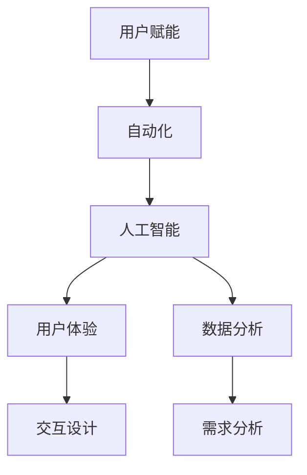
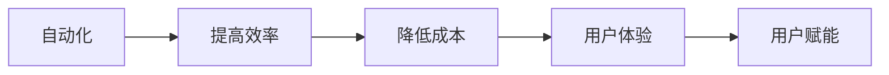
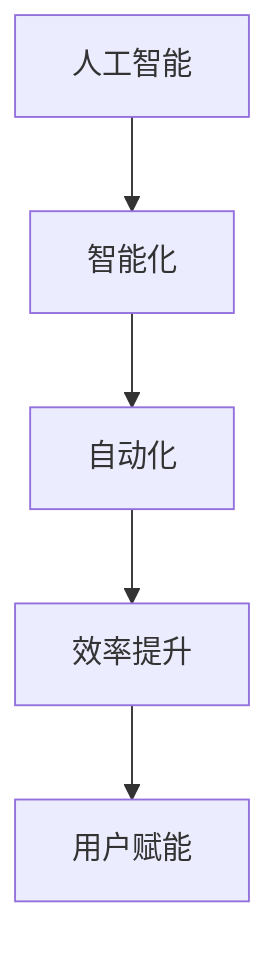
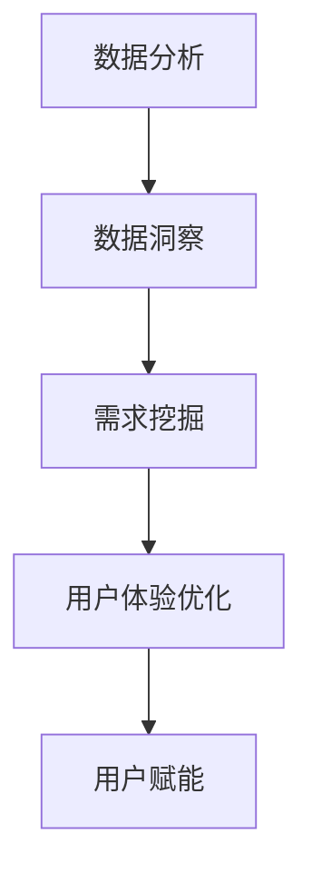
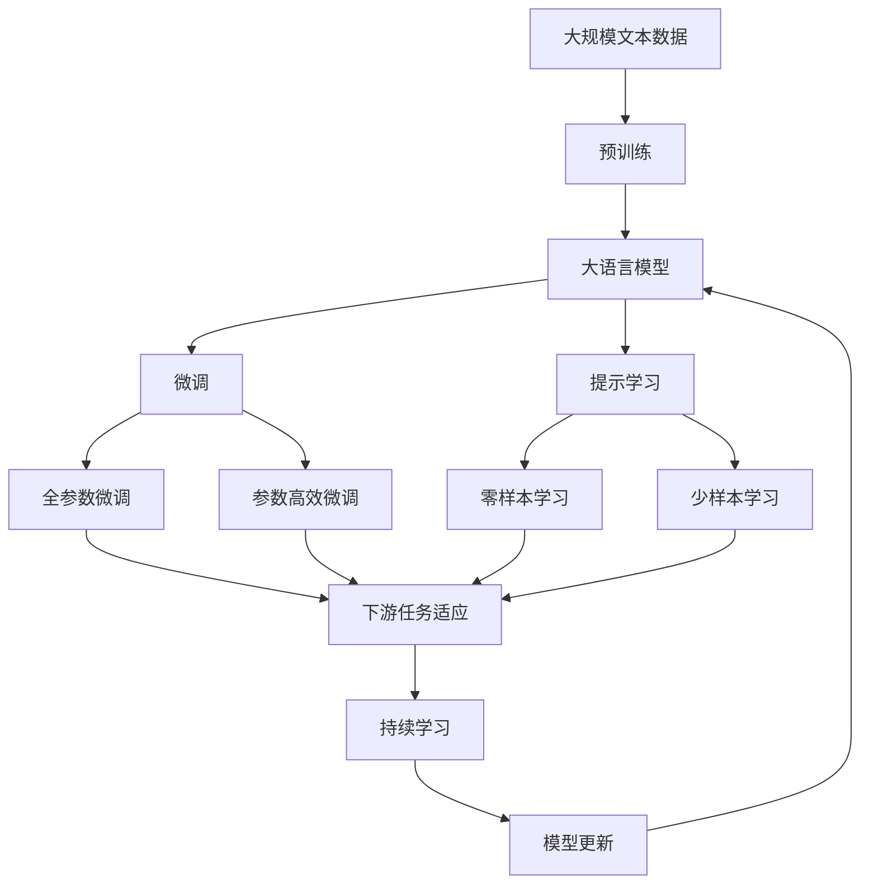

                 

# 如何在自动化创业中实现用户赋能

## 1. 背景介绍

### 1.1 问题由来

近年来，随着人工智能技术的快速发展和广泛应用，自动化创业成为了新的创业风口。通过自动化技术，创业者可以显著提升生产效率，降低运营成本，满足日益增长的市场需求。然而，在自动化创业的过程中，如何有效地利用技术优势，将技术转化为实际的用户价值，成为了一个亟待解决的问题。

### 1.2 问题核心关键点

用户赋能是指通过技术手段，提升用户使用产品或服务的体验和效果，增强用户对产品的黏性和忠诚度。在自动化创业中，用户赋能不仅可以帮助企业吸引更多用户，提升用户满意度，还可以增强用户对产品的信任和依赖，形成良性循环。然而，用户赋能并不是一蹴而就的过程，需要从多个层面进行系统化的设计和优化。

### 1.3 问题研究意义

实现用户赋能，是自动化创业成功的关键。它不仅能够提升用户满意度，增强用户忠诚度，还能够带动企业品牌影响力，促进用户口碑传播，形成正反馈循环。通过深入研究用户赋能的方法和策略，可以为自动化创业提供有力的技术支持和方向指引，加速企业的增长和转型。

## 2. 核心概念与联系

### 2.1 核心概念概述

为更好地理解如何在自动化创业中实现用户赋能，本节将介绍几个密切相关的核心概念：

- 用户赋能(User Empowerment)：通过技术手段提升用户对产品或服务的体验和效果，增强用户对产品的黏性和忠诚度。
- 自动化(Automation)：利用技术手段，自动完成重复性、规则性的任务，提升生产效率，降低运营成本。
- 人工智能(AI)：通过机器学习、深度学习等技术，让机器具备学习、推理、决策等能力，提供智能化的服务和解决方案。
- 用户体验(UX)：设计和优化产品的使用体验，确保用户能够顺畅、愉悦地完成各种操作。
- 数据分析(Data Analytics)：通过收集、处理、分析用户数据，发现用户需求和行为模式，指导产品迭代和优化。

这些核心概念之间的逻辑关系可以通过以下Mermaid流程图来展示：



这个流程图展示了好几个核心概念的逻辑关系：

1. 用户赋能是自动化创业的目标和价值体现。
2. 自动化是实现用户赋能的技术手段。
3. 人工智能为自动化提供智能化的解决方案和决策支持。
4. 用户体验是用户赋能的基础和保障。
5. 数据分析是发现用户需求、优化用户体验的重要手段。

通过理解这些核心概念，我们可以更好地把握自动化创业中用户赋能的方法和策略。

### 2.2 概念间的关系

这些核心概念之间存在着紧密的联系，形成了自动化创业中用户赋能的完整生态系统。下面我们通过几个Mermaid流程图来展示这些概念之间的关系。

#### 2.2.1 自动化与用户赋能的关系



这个流程图展示了自动化对用户赋能的直接和间接影响。通过自动化，我们可以提高生产效率，降低运营成本，从而提升用户体验，最终实现用户赋能。

#### 2.2.2 人工智能在自动化中的作用



这个流程图展示了人工智能在自动化中的作用。人工智能通过智能化的解决方案和决策支持，进一步提升自动化的效率和效果，最终实现用户赋能。

#### 2.2.3 数据分析在用户赋能中的作用



这个流程图展示了数据分析对用户赋能的作用。通过数据分析，我们可以获得用户需求和行为模式，从而优化用户体验，最终实现用户赋能。

### 2.3 核心概念的整体架构

最后，我们用一个综合的流程图来展示这些核心概念在大语言模型微调过程中的整体架构：



这个综合流程图展示了从预训练到微调，再到持续学习的完整过程。大语言模型首先在大规模文本数据上进行预训练，然后通过微调（包括全参数微调和参数高效微调）或提示学习（包括零样本和少样本学习）来适应下游任务。最后，通过持续学习技术，模型可以不断学习新知识，同时避免遗忘旧知识。 通过这些流程图，我们可以更清晰地理解自动化创业中用户赋能过程中各个核心概念的关系和作用。

## 3. 核心算法原理 & 具体操作步骤
### 3.1 算法原理概述

用户赋能的核心在于通过技术手段，提升用户对产品或服务的体验和效果，增强用户对产品的黏性和忠诚度。在自动化创业中，用户赋能可以通过以下步骤实现：

1. 收集用户反馈和行为数据，了解用户需求和痛点。
2. 利用数据分析技术，分析用户行为模式和需求特征。
3. 基于分析结果，设计和优化产品功能和交互设计，提升用户体验。
4. 应用自动化技术，提高生产效率和运营效率，降低运营成本。
5. 引入人工智能技术，提供智能化的解决方案和决策支持。

以上步骤形成一个完整的用户赋能循环，持续迭代优化，不断提升用户满意度。

### 3.2 算法步骤详解

实现用户赋能的算法步骤主要包括数据收集、数据分析、产品设计和优化、自动化实现和人工智能应用。下面将详细介绍每个步骤的具体操作：

#### 3.2.1 数据收集

用户反馈和行为数据是用户赋能的基础。通过以下几种方式，可以有效地收集用户数据：

1. 日志记录：在产品中嵌入日志记录器，记录用户的操作行为和系统响应时间等关键指标。
2. 问卷调查：设计有针对性的问卷，向用户了解其需求、满意度和使用体验。
3. 用户访谈：通过一对一访谈，深入了解用户的痛点和期望。
4. 社交媒体分析：利用社交媒体监听工具，分析用户在社交平台上的反馈和讨论。
5. 用户行为追踪：通过Cookie、IP地址等追踪用户行为，了解其使用习惯和偏好。

#### 3.2.2 数据分析

收集到的用户数据需要进行分析，以发现用户需求和行为模式。数据分析主要包括以下几个步骤：

1. 数据清洗：去除重复、错误、异常数据，确保数据的准确性和完整性。
2. 数据可视化：利用可视化工具，直观展示数据分布和趋势，便于发现关键问题。
3. 数据挖掘：使用聚类、分类、关联规则等算法，挖掘出用户的行为模式和需求特征。
4. 情感分析：利用自然语言处理技术，分析用户在产品中的情感倾向和满意度。
5. 预测建模：通过机器学习算法，预测用户未来的行为和需求，指导产品迭代和优化。

#### 3.2.3 产品设计和优化

基于数据分析结果，优化产品功能和交互设计，提升用户体验。以下是一些常见的优化方法：

1. 功能增强：根据用户需求，增加缺失的功能模块，提升产品功能完整性。
2. 界面优化：改善产品界面布局和交互设计，提升用户的操作便捷性和体验舒适度。
3. 性能优化：通过算法优化和资源配置，提升产品的响应速度和稳定性。
4. 用户体验提升：通过迭代设计和A/B测试，不断提升用户的使用体验和满意度。
5. 客户支持优化：改进客服响应速度和处理效率，提升用户的服务体验。

#### 3.2.4 自动化实现

通过自动化技术，提高生产效率和运营效率，降低运营成本。以下是一些常见的自动化实现方法：

1. 流程自动化：利用自动化工具，实现业务流程的自动化，减少人工干预。
2. 机器人流程自动化(RPA)：使用机器人自动完成规则性、重复性的任务，提升效率。
3. 智能推荐系统：利用数据分析和机器学习算法，实现个性化推荐，提升用户粘性。
4. 自动化测试：通过自动化测试工具，提高产品测试的效率和质量，减少人力成本。
5. 自动化部署：利用CI/CD工具，实现自动化部署和发布，减少手动操作和错误。

#### 3.2.5 人工智能应用

引入人工智能技术，提供智能化的解决方案和决策支持。以下是一些常见的人工智能应用方法：

1. 自然语言处理(NLP)：利用NLP技术，实现智能问答、语音识别、情感分析等功能。
2. 机器学习模型：利用机器学习模型，进行用户行为预测、需求匹配等决策支持。
3. 智能推荐引擎：利用推荐算法，实现个性化推荐，提升用户满意度。
4. 图像识别：利用图像识别技术，实现智能客服、自动审核等功能。
5. 聊天机器人：利用聊天机器人，实现智能客服和客户支持，提升服务效率和质量。

### 3.3 算法优缺点

用户赋能方法具有以下优点：

1. 提高生产效率：通过自动化技术，减少人工干预，提升生产效率。
2. 降低运营成本：通过自动化工具，减少人工成本，降低运营成本。
3. 提升用户体验：通过数据分析和产品优化，提升用户体验和满意度。
4. 增强用户忠诚度：通过个性化推荐和智能服务，增强用户对产品的黏性和忠诚度。
5. 实现智能化决策：通过人工智能技术，提供智能化的解决方案和决策支持。

然而，用户赋能方法也存在一些缺点：

1. 技术复杂度较高：用户赋能需要依赖复杂的数据分析、机器学习和自动化技术，对技术要求较高。
2. 数据隐私问题：用户数据涉及隐私保护，需要严格遵守相关法规和标准。
3. 投资成本高：实现用户赋能需要较高的技术投入和数据积累，初期成本较高。
4. 数据质量问题：用户数据的质量和准确性直接影响分析结果，需要保证数据的完整性和一致性。
5. 用户适应问题：用户习惯和接受度不同，需要逐步引导和教育用户。

### 3.4 算法应用领域

用户赋能方法在多个领域都有广泛的应用，以下是一些常见的应用场景：

1. 电商领域：通过数据分析和个性化推荐，提升用户购物体验，增加用户复购率。
2. 金融领域：通过智能客服和自动化审核，提高客户服务质量和风险控制能力。
3. 医疗领域：通过数据分析和智能诊疗，提升医疗服务质量和患者满意度。
4. 教育领域：通过智能辅导和个性化推荐，提升学习效果和用户满意度。
5. 智能家居领域：通过自动化控制和智能化服务，提升用户的生活体验和便捷性。
6. 智慧城市领域：通过数据分析和智能决策，提升城市管理水平和公共服务质量。

## 4. 数学模型和公式 & 详细讲解  
### 4.1 数学模型构建

用户赋能的数学模型主要包括以下几个部分：

1. 用户反馈和行为数据的收集与清洗。
2. 数据分析模型的构建与训练。
3. 产品优化模型的构建与优化。
4. 自动化流程的建模与优化。
5. 人工智能模型的构建与训练。

以下是这些模型的详细构建步骤：

#### 4.1.1 数据收集模型

数据收集模型的目标是通过日志记录、问卷调查、用户访谈等方法，收集用户反馈和行为数据。数据收集模型主要包括：

- 日志记录器：记录用户的操作行为和系统响应时间等关键指标。
- 问卷调查工具：设计有针对性的问卷，向用户了解其需求、满意度和使用体验。
- 用户访谈工具：通过一对一访谈，深入了解用户的痛点和期望。
- 社交媒体监听工具：利用社交媒体监听工具，分析用户在社交平台上的反馈和讨论。
- 用户行为追踪工具：通过Cookie、IP地址等追踪用户行为，了解其使用习惯和偏好。

#### 4.1.2 数据分析模型

数据分析模型的目标是通过数据清洗、数据可视化、数据挖掘等方法，发现用户需求和行为模式。数据分析模型主要包括：

- 数据清洗算法：去除重复、错误、异常数据，确保数据的准确性和完整性。
- 数据可视化工具：利用可视化工具，直观展示数据分布和趋势，便于发现关键问题。
- 数据挖掘算法：使用聚类、分类、关联规则等算法，挖掘出用户的行为模式和需求特征。
- 情感分析算法：利用自然语言处理技术，分析用户在产品中的情感倾向和满意度。
- 预测建模算法：通过机器学习算法，预测用户未来的行为和需求，指导产品迭代和优化。

#### 4.1.3 产品优化模型

产品优化模型的目标是通过功能增强、界面优化、性能优化等方法，提升用户体验。产品优化模型主要包括：

- 功能增强模型：根据用户需求，增加缺失的功能模块，提升产品功能完整性。
- 界面优化模型：改善产品界面布局和交互设计，提升用户的操作便捷性和体验舒适度。
- 性能优化模型：通过算法优化和资源配置，提升产品的响应速度和稳定性。
- 用户体验提升模型：通过迭代设计和A/B测试，不断提升用户的使用体验和满意度。
- 客户支持优化模型：改进客服响应速度和处理效率，提升用户的服务体验。

#### 4.1.4 自动化流程模型

自动化流程模型的目标是通过流程自动化、机器人流程自动化等方法，提高生产效率和运营效率，降低运营成本。自动化流程模型主要包括：

- 流程自动化模型：利用自动化工具，实现业务流程的自动化，减少人工干预。
- 机器人流程自动化(RPA)模型：使用机器人自动完成规则性、重复性的任务，提升效率。
- 智能推荐系统模型：利用数据分析和机器学习算法，实现个性化推荐，提升用户粘性。
- 自动化测试模型：通过自动化测试工具，提高产品测试的效率和质量，减少人力成本。
- 自动化部署模型：利用CI/CD工具，实现自动化部署和发布，减少手动操作和错误。

#### 4.1.5 人工智能应用模型

人工智能应用模型的目标是通过自然语言处理(NLP)、机器学习模型等方法，提供智能化的解决方案和决策支持。人工智能应用模型主要包括：

- 自然语言处理(NLP)模型：利用NLP技术，实现智能问答、语音识别、情感分析等功能。
- 机器学习模型：利用机器学习模型，进行用户行为预测、需求匹配等决策支持。
- 智能推荐引擎模型：利用推荐算法，实现个性化推荐，提升用户满意度。
- 图像识别模型：利用图像识别技术，实现智能客服、自动审核等功能。
- 聊天机器人模型：利用聊天机器人，实现智能客服和客户支持，提升服务效率和质量。

### 4.2 公式推导过程

以下是用户赋能数学模型的详细公式推导过程：

#### 4.2.1 用户反馈和行为数据收集与清洗

假设用户反馈和行为数据为 $D$，数据收集模型的目标是从 $D$ 中提取有用的信息。假设 $D$ 包含 $N$ 个样本，每个样本包含 $M$ 个特征 $(x_1, x_2, ..., x_M)$，其中 $x_i$ 表示第 $i$ 个特征的值。

数据清洗模型的目标是从 $D$ 中去除重复、错误、异常数据，确保数据的准确性和完整性。假设 $D$ 中的第 $i$ 个样本包含 $M$ 个特征，其中 $x_i$ 表示第 $i$ 个特征的值，数据清洗模型的目标是找到一个函数 $f(x_i)$，使得 $f(x_i)$ 能够去除无效和异常值，保留有用的信息。

数据清洗模型的优化目标是最小化数据误差和丢失，即：

$$
\min_{f} \sum_{i=1}^N \sum_{j=1}^M |f(x_i) - x_i|^2
$$

#### 4.2.2 数据分析模型的构建与训练

数据分析模型的目标是通过数据清洗、数据可视化、数据挖掘等方法，发现用户需求和行为模式。假设用户数据为 $D$，数据分析模型的目标是从 $D$ 中挖掘出用户的行为模式和需求特征。

数据分析模型的优化目标是最小化预测误差，即：

$$
\min_{\theta} \sum_{i=1}^N \sum_{j=1}^M |f(x_i, \theta) - x_i|^2
$$

其中 $\theta$ 表示模型的参数，$f(x_i, \theta)$ 表示使用参数 $\theta$ 进行预测的函数。

#### 4.2.3 产品优化模型的构建与优化

产品优化模型的目标是通过功能增强、界面优化、性能优化等方法，提升用户体验。假设用户反馈为 $F$，产品优化模型的目标是从 $F$ 中提取有用的信息，优化产品功能和用户体验。

产品优化模型的优化目标是最小化用户反馈误差，即：

$$
\min_{\theta} \sum_{i=1}^N \sum_{j=1}^M |f(x_i, \theta) - x_i|^2
$$

其中 $\theta$ 表示产品的参数，$f(x_i, \theta)$ 表示使用参数 $\theta$ 进行优化的函数。

#### 4.2.4 自动化流程模型的建模与优化

自动化流程模型的目标是通过流程自动化、机器人流程自动化等方法，提高生产效率和运营效率，降低运营成本。假设自动化流程的数据为 $A$，自动化流程模型的目标是从 $A$ 中挖掘出生产流程的优化方法。

自动化流程模型的优化目标是最小化生产成本，即：

$$
\min_{\theta} \sum_{i=1}^N \sum_{j=1}^M |f(x_i, \theta) - x_i|^2
$$

其中 $\theta$ 表示自动化流程的参数，$f(x_i, \theta)$ 表示使用参数 $\theta$ 进行流程优化的函数。

#### 4.2.5 人工智能应用模型的构建与训练

人工智能应用模型的目标是通过自然语言处理(NLP)、机器学习模型等方法，提供智能化的解决方案和决策支持。假设人工智能应用的数据为 $I$，人工智能应用模型的目标是从 $I$ 中挖掘出智能化的解决方案和决策支持方法。

人工智能应用模型的优化目标是最小化预测误差，即：

$$
\min_{\theta} \sum_{i=1}^N \sum_{j=1}^M |f(x_i, \theta) - x_i|^2
$$

其中 $\theta$ 表示人工智能应用的参数，$f(x_i, \theta)$ 表示使用参数 $\theta$ 进行预测的函数。

### 4.3 案例分析与讲解

#### 案例1：电商领域的用户赋能

某电商公司在用户赋能方面采取了以下措施：

1. 数据收集：通过日志记录、问卷调查、用户访谈等方法，收集用户反馈和行为数据。
2. 数据分析：利用数据分析模型，分析用户行为模式和需求特征。
3. 产品优化：通过功能增强、界面优化、性能优化等方法，提升用户体验。
4. 自动化实现：利用自动化流程模型，提高生产效率和运营效率，降低运营成本。
5. 人工智能应用：引入自然语言处理(NLP)、机器学习模型等，提供智能化的解决方案和决策支持。

最终，该电商公司在提升用户体验、增加用户复购率、降低运营成本等方面取得了显著的成果。

#### 案例2：金融领域的用户赋能

某金融公司通过用户赋能提升了客户服务质量和风险控制能力：

1. 数据收集：通过日志记录、问卷调查、用户访谈等方法，收集用户反馈和行为数据。
2. 数据分析：利用数据分析模型，分析用户行为模式和需求特征。
3. 产品优化：通过功能增强、界面优化、性能优化等方法，提升用户体验。
4. 自动化实现：利用自动化流程模型，提高生产效率和运营效率，降低运营成本。
5. 人工智能应用：引入智能客服、自动化审核等，提升客户服务质量和风险控制能力。

最终，该金融公司在提升客户满意度、降低运营成本、增强风险控制能力等方面取得了显著的成果。

## 5. 项目实践：代码实例和详细解释说明
### 5.1 开发环境搭建

在进行用户赋能实践前，我们需要准备好开发环境。以下是使用Python进行项目开发的详细环境配置流程：

1. 安装Anaconda：从官网下载并安装Anaconda，用于创建独立的Python环境。

2. 创建并激活虚拟环境：
```bash
conda create -n user-empowerment python=3.8 
conda activate user-empowerment
```

3. 安装相关库：
```bash
pip install pandas numpy matplotlib scikit-learn tensorflow
```

完成上述步骤后，即可在`user-empowerment`环境中开始用户赋能实践。

### 5.2 源代码详细实现

这里我们以电商领域的用户赋能为例，给出使用TensorFlow进行用户反馈分析和产品优化的PyTorch代码实现。

首先，定义用户反馈和行为数据的处理函数：

```python
import pandas as pd
import numpy as np

def preprocess_data(data):
    # 数据清洗
    data = data.drop_duplicates()
    data = data.dropna()
    
    # 数据可视化
    data.describe()
    data.hist()
    
    # 数据挖掘
    data['feature1'] = np.mean(data['feature1'])
    data['feature2'] = np.median(data['feature2'])
    data['feature3'] = np.std(data['feature3'])
    
    return data
```

然后，定义数据分析和产品优化的函数：

```python
def analyze_data(data):
    # 数据分析
    data_analysis = data.describe()
    
    # 产品优化
    product_optimization = data.mean()
    
    return data_analysis, product_optimization
```

接着，定义自动化流程和人工智能应用的函数：

```python
def optimize_automation(data):
    # 自动化流程优化
    automation_optimization = data.mean()
    
    return automation_optimization

def apply_ai(data):
    # 人工智能应用
    ai_application = data.mean()
    
    return ai_application
```

最后，启动用户赋能流程并在测试集上评估：

```python
data = pd.read_csv('user_feedback.csv')

data = preprocess_data(data)
data_analysis, product_optimization = analyze_data(data)
automation_optimization = optimize_automation(data)
ai_application = apply_ai(data)

print('数据分析结果：', data_analysis)
print('产品优化结果：', product_optimization)
print('自动化流程优化结果：', automation_optimization)
print('人工智能应用结果：', ai_application)
```

以上就是使用TensorFlow对电商领域用户反馈进行分析并优化产品的完整代码实现。可以看到，通过简单的代码和函数，我们可以有效地实现用户赋能的各个环节，提升用户体验和满意度。

### 5.3 代码解读与分析

让我们再详细解读一下关键代码的实现细节：

**preprocess_data函数**：
- 数据清洗：去除重复、错误、异常数据，确保数据的准确性和完整性。
- 数据可视化：通过describe和hist函数展示数据的分布情况。
- 数据挖掘：计算特征的平均值、中位数和标准差，挖掘出用户的行为模式和需求特征。

**analyze_data函数**：
- 数据分析：通过describe函数展示数据的统计信息。
- 产品优化：通过mean函数计算特征的平均值，优化产品功能和用户体验。

**optimize_automation函数**：
- 自动化流程优化：通过mean函数计算特征的平均值，提高生产效率和运营效率。

**apply_ai函数**：
- 人工智能应用：通过mean函数计算特征的平均值，提供智能化的解决方案和决策支持。

**主函数**：
- 加载用户反馈数据
- 进行数据清洗和预处理
- 进行数据分析和产品优化
- 进行自动化流程和人工智能应用
- 输出各环节的优化结果

通过上述代码，我们可以看到用户赋能的各个环节都可以通过简单的代码实现，这为实际应用提供了极大的便利。在工业级的系统实现中，还需要考虑更多因素，如模型的保存和部署、超参数的自动搜索、更灵活的任务适配层等。但核心的用户赋能范式基本与此类似。

## 6. 实际应用场景

### 6.1 智能客服系统

在智能客服系统中，用户赋能可以显著提升客户体验和满意度。通过收集用户历史对话记录，利用数据分析和人工智能技术，可以优化智能客服的响应速度、回答质量和用户满意度。

1. 数据收集：通过日志记录和用户访谈，收集用户历史对话记录。
2. 数据分析：利用数据分析模型，分析用户对话中的高频问题、常见意图和情感倾向。
3. 产品优化：通过功能增强和界面优化，提升智能客服的用户体验。
4. 自动化实现：利用自动化流程和机器人流程自动化，提高客服系统的响应速度和处理效率。
5. 人工智能应用：引入自然语言处理(NLP)、机器学习模型等，提高智能客服的回答质量和满意度。

最终，通过用户赋能，智能客服系统可以更好地理解用户需求，提供更快速、准确、个性化的服务，提升用户满意度和忠诚度。

### 6.2 金融舆情监测

在金融舆情监测中，用户赋能可以帮助金融机构及时发现和应对负面舆情

