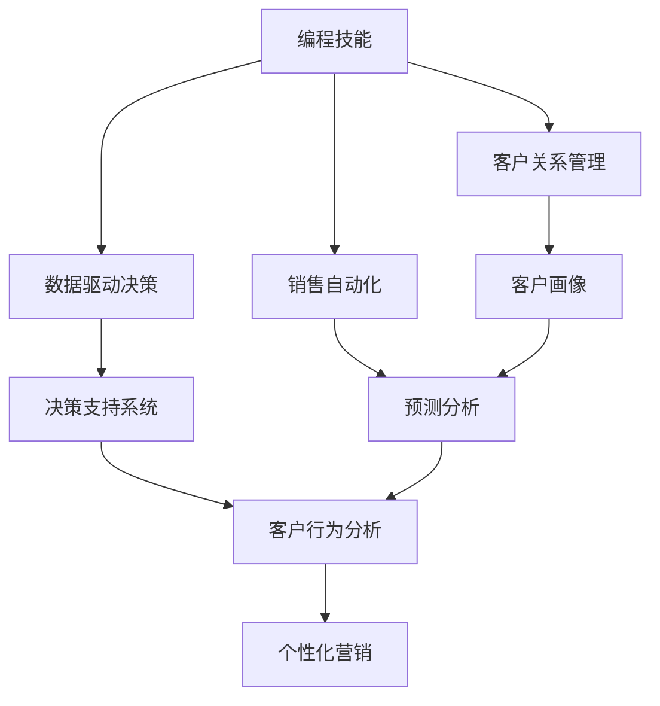

                 

# 如何将编程技能转化为销售能力

> 关键词：编程技能, 销售能力, 数据驱动, 客户分析, 销售自动化, 客户关系管理, 决策支持系统, 机器学习, 人工智能

## 1. 背景介绍

### 1.1 问题由来

在数字化时代，信息技术在各个领域的应用日益深入，尤其是在销售领域，信息技术成为提升销售效率、优化客户体验的重要手段。然而，IT专业人员通常缺乏销售领域的知识和经验，难以将技术优势转化为销售能力，导致信息技术与业务场景的脱节。

与此同时，销售人员面对复杂多变的市场环境，常常需要借助信息技术提升工作效能，但在技术实现上又面临诸多挑战。信息技术与销售工作的融合，成为了企业和员工共同追求的目标。

### 1.2 问题核心关键点

要将编程技能转化为销售能力，需关注以下几个关键点：

- **数据驱动决策**：利用大数据分析技术，对销售数据进行深入挖掘，发现潜在机会和风险，制定科学的销售策略。
- **客户关系管理**：通过CRM系统，收集和管理客户信息，分析客户行为，提升客户满意度和忠诚度。
- **销售自动化**：借助自动化工具，如销售流程自动化、客户跟进自动化等，提高销售效率，减少人工操作带来的错误和耗时。
- **决策支持系统**：结合销售数据、市场数据、客户数据等多维度信息，提供智能化的销售决策支持，帮助销售人员快速做出精准判断。
- **机器学习和人工智能**：利用机器学习和人工智能技术，进行客户画像、预测分析、需求匹配等，提升销售的智能化水平。

这些关键点不仅是销售人员必备的能力，同时也是IT人员可以发挥的独特优势。通过将编程技能与这些关键点结合，可以创造出强大的销售能力，推动企业销售业绩的增长。

### 1.3 问题研究意义

研究如何将编程技能转化为销售能力，具有重要意义：

1. **提升销售效率**：借助IT技术，优化销售流程，自动化重复性工作，提升销售效率。
2. **增强决策能力**：通过数据驱动的决策支持，帮助销售人员做出更加科学的决策。
3. **提高客户满意度**：利用客户关系管理，个性化客户互动，提升客户满意度和忠诚度。
4. **拓展市场机会**：通过数据分析，挖掘潜在客户和市场机会，为公司带来新的增长点。
5. **降低运营成本**：自动化销售流程，减少人工干预，降低运营成本。
6. **推动业务创新**：结合IT技术和销售需求，不断创新销售策略和产品，提升市场竞争力。

## 2. 核心概念与联系

### 2.1 核心概念概述

要理解如何将编程技能转化为销售能力，首先需要了解几个核心概念：

- **编程技能**：指利用编程语言和工具，开发、维护和优化软件系统，实现特定业务需求的能力。
- **销售能力**：指销售人员通过有效沟通、产品推荐、客户关系管理等手段，达成销售目标的能力。
- **数据驱动决策**：指基于数据和分析结果，制定销售策略和计划，提升决策的科学性和准确性。
- **客户关系管理(CRM)**：指通过IT系统，收集、管理客户信息，进行客户行为分析和营销活动管理，提升客户满意度和忠诚度。
- **销售自动化**：指利用IT技术，自动化销售流程中的各项操作，提升销售效率和质量。
- **决策支持系统(DSS)**：指通过综合分析多种数据源，提供智能化的决策支持，帮助销售人员做出科学决策。
- **机器学习**：指通过算法和模型，从数据中学习规律，实现预测和决策自动化。
- **人工智能**：指利用机器学习、自然语言处理等技术，实现智能化的销售和客户管理。

这些概念通过技术手段相互连接，共同构建起一个全面的销售自动化系统，为销售人员提供全方位的支持，提升销售业绩。

### 2.2 概念间的关系

这些核心概念之间的关系可以通过以下Mermaid流程图来展示：



这个流程图展示了编程技能与销售能力各环节的关系：

1. 编程技能通过数据分析技术支持数据驱动决策，从而优化销售策略。
2. 编程技能开发和维护CRM系统，实现客户关系管理，提升客户满意度和忠诚度。
3. 编程技能实现销售自动化流程，提升销售效率和质量。
4. 数据驱动决策、客户关系管理和销售自动化共同构成了决策支持系统的数据基础。
5. 客户画像、预测分析和个性化营销是客户关系管理的具体应用场景。
6. 决策支持系统提供智能化的决策支持，帮助销售人员做出精准判断。

这些核心概念共同构成了销售自动化的完整生态系统，为销售人员提供全方位支持，提升销售业绩。

## 3. 核心算法原理 & 具体操作步骤
### 3.1 算法原理概述

将编程技能转化为销售能力的过程，本质上是一个数据驱动的决策优化过程。通过编程技能开发的各种IT工具和系统，收集、分析和利用销售数据，优化销售策略和流程，提升销售效率和效果。

具体来说，这一过程可以分为以下几个步骤：

1. **数据收集和清洗**：通过编程技能开发的数据收集工具，从各种渠道获取销售数据，并进行清洗和预处理。
2. **数据分析和建模**：利用机器学习算法，对收集到的数据进行分析建模，发现销售规律和趋势，预测未来销售情况。
3. **决策优化**：根据数据分析结果，优化销售策略和流程，提升销售效率和效果。
4. **自动化实现**：通过编程技能实现自动化工具，将决策结果自动化落地，实现销售自动化。
5. **持续迭代和优化**：通过持续收集数据、分析结果和反馈，不断优化销售策略和工具，提升销售业绩。

### 3.2 算法步骤详解

#### 3.2.1 数据收集和清洗

数据收集是销售自动化的基础。销售数据通常来源于各种渠道，如客户关系管理系统、销售管理软件、市场调研数据等。通过编程技能开发的数据收集工具，可以自动化地获取和整合这些数据。

数据清洗包括数据格式转换、异常值处理、缺失值填补等。利用Python的Pandas、NumPy等库，可以高效地进行数据清洗和预处理。

#### 3.2.2 数据分析和建模

数据清洗完成后，接下来进行数据分析和建模。这一过程通常使用Python的Scikit-learn、TensorFlow、PyTorch等库进行。

**数据探索**：利用数据可视化工具，如Matplotlib、Seaborn等，对数据进行可视化分析，发现数据中的规律和异常。

**特征工程**：选择合适的特征，进行特征提取和转换，提高模型的预测能力。特征工程是数据分析和建模的关键步骤。

**模型选择和训练**：选择合适的机器学习模型，如回归模型、分类模型、聚类模型等，进行模型训练和评估。常用的机器学习模型包括线性回归、决策树、随机森林、支持向量机等。

**模型优化和调参**：根据模型评估结果，进行模型优化和超参数调优，提升模型性能。常用的调参方法包括网格搜索、随机搜索、贝叶斯优化等。

#### 3.2.3 决策优化

数据分析和建模完成后，根据模型结果进行销售决策优化。

**销售策略优化**：根据模型预测的客户行为和市场趋势，制定科学的销售策略，如定价策略、促销策略、渠道策略等。

**销售流程优化**：根据模型分析的结果，优化销售流程，如客户跟进流程、销售谈判流程、订单处理流程等。

**资源配置优化**：根据模型预测的销售量和客户需求，合理配置销售资源，如销售人员、销售预算、销售设备等。

#### 3.2.4 自动化实现

决策优化完成后，需要将决策结果自动化落地。

**销售自动化工具**：通过编程技能开发和实现销售自动化工具，如客户跟进自动化工具、销售流程自动化工具、客户数据管理工具等。常用的销售自动化工具包括Zapier、Salesforce、HubSpot等。

**客户关系管理系统**：开发和维护客户关系管理系统，记录和管理客户信息，进行客户行为分析和个性化营销。常用的CRM系统包括Salesforce、Microsoft Dynamics、Zoho CRM等。

**决策支持系统**：结合销售数据、市场数据、客户数据等多维度信息，提供智能化的决策支持，帮助销售人员做出科学决策。常用的DSS系统包括Tableau、Power BI、Microsoft Azure等。

#### 3.2.5 持续迭代和优化

销售自动化系统并非一成不变，需要根据市场变化和业务需求不断迭代和优化。

**数据持续收集**：不断收集和更新销售数据，保持数据的实时性和准确性。

**模型持续优化**：根据新的数据和反馈，持续优化和更新模型，提升模型性能。

**系统持续改进**：根据业务需求和技术进展，持续改进和升级销售自动化系统，提升用户体验和功能。

### 3.3 算法优缺点

**优点**：

- **数据驱动决策**：基于数据和分析结果，制定科学的销售策略，提升决策的科学性和准确性。
- **自动化操作**：通过自动化工具，减少人工操作带来的错误和耗时，提高销售效率。
- **客户关系管理**：通过CRM系统，收集和管理客户信息，提升客户满意度和忠诚度。
- **持续优化**：通过持续收集数据、分析结果和反馈，不断优化销售策略和工具，提升销售业绩。

**缺点**：

- **技术依赖**：依赖编程技能和IT技术，需要持续投入技术资源进行维护和升级。
- **数据质量**：数据质量对销售自动化系统的性能和效果有直接影响，数据收集和清洗难度较大。
- **系统复杂性**：构建和维护一个完整的销售自动化系统，系统复杂性较高，需要专业知识和技能。
- **成本较高**：开发和维护一个完整的销售自动化系统，成本较高，需要较高的IT投入。

### 3.4 算法应用领域

基于数据驱动的销售自动化系统，可以应用于多个领域，如：

- **B2B销售**：通过客户关系管理、销售自动化工具，提升B2B销售的效率和效果。
- **B2C销售**：通过客户行为分析和个性化营销，提升B2C销售的客户体验和转化率。
- **市场分析**：通过数据分析和市场调研，挖掘市场机会和趋势，制定市场策略。
- **渠道管理**：通过数据驱动的渠道优化，提升渠道管理和运营效率。
- **客户服务**：通过客户关系管理系统，提供智能化的客户服务，提升客户满意度和忠诚度。

## 4. 数学模型和公式 & 详细讲解 & 举例说明

### 4.1 数学模型构建

假设销售数据集为 $D=\{(x_i, y_i)\}_{i=1}^N$，其中 $x$ 为销售记录，$y$ 为销售结果（如销售额、订单数量等）。目标是构建一个预测模型 $f(x)$，用于预测未来的销售情况。

根据决策树算法，模型的构建过程如下：

1. 选择初始特征集 $X$ 和样本集 $D$。
2. 计算样本集的平均销售结果 $y_{avg}$。
3. 选择最优的特征 $x_j$，计算其信息增益 $Gain(x_j)$。
4. 选择最优的分割点 $x_j = c_j$，构建决策树节点。
5. 对子集 $D_j$ 重复步骤2-4，构建完整的决策树。

### 4.2 公式推导过程

**信息增益**：计算特征 $x_j$ 的信息增益，表示使用该特征分割数据集后，信息的不确定性减少的程度。

$$
Gain(x_j) = H(D) - \sum_{j=1}^{m} \frac{|D_j|}{|D|} H(D_j)
$$

其中 $H(D)$ 为样本集的熵，$H(D_j)$ 为分割后的子集 $D_j$ 的熵。

**决策树构建**：选择最优的特征和分割点，构建决策树。

$$
\begin{aligned}
\min_{x_j, c_j} &\quad Gain(x_j) \\
\text{s.t.} &\quad D_j = \{x_i | x_j = c_j, i=1,...,N\}
\end{aligned}
$$

### 4.3 案例分析与讲解

以一家电商公司为例，假设其销售数据集包含客户购买行为、产品类别、促销活动、地区分布等信息。利用决策树算法，构建销售预测模型。

**数据收集和清洗**：从公司的CRM系统中获取客户购买记录，进行格式转换和缺失值填补。

**数据探索**：利用Matplotlib和Seaborn进行数据可视化，发现客户购买行为和产品类别之间的关联性。

**特征工程**：选择客户购买金额、产品类别、促销活动、地区分布等特征，进行特征提取和转换。

**模型选择和训练**：使用Scikit-learn库中的决策树算法，对数据集进行模型训练和评估，得到决策树模型。

**模型优化和调参**：通过网格搜索和随机搜索，选择最优的决策树模型参数，提升模型性能。

**销售策略优化**：根据模型预测的客户购买行为和产品类别，制定科学的销售策略，如重点推广高利润产品、增加促销活动等。

**销售自动化工具**：开发和实现客户跟进自动化工具、销售流程自动化工具等，提升销售效率。

**持续迭代和优化**：不断收集和更新销售数据，持续优化和更新模型，提升销售业绩。

## 5. 项目实践：代码实例和详细解释说明

### 5.1 开发环境搭建

在Python环境下进行项目实践，需要先准备好开发环境：

1. 安装Python：从官网下载并安装Python，创建虚拟环境。
2. 安装Pandas、NumPy、Scikit-learn等数据处理和机器学习库。
3. 安装Matplotlib、Seaborn等数据可视化库。
4. 安装Scikit-learn、TensorFlow、PyTorch等机器学习库。
5. 安装Flask、Django等Web开发框架，用于构建销售自动化工具和决策支持系统。

### 5.2 源代码详细实现

下面以客户行为分析为例，给出使用Scikit-learn库进行决策树算法实现的Python代码：

```python
from sklearn.ensemble import DecisionTreeRegressor
from sklearn.model_selection import train_test_split
from sklearn.metrics import mean_squared_error

# 加载数据集
X, y = load_data()

# 数据集划分
X_train, X_test, y_train, y_test = train_test_split(X, y, test_size=0.2)

# 模型训练
model = DecisionTreeRegressor()
model.fit(X_train, y_train)

# 模型评估
y_pred = model.predict(X_test)
mse = mean_squared_error(y_test, y_pred)
print(f"MSE: {mse}")

# 数据可视化
import matplotlib.pyplot as plt

plt.scatter(X_test, y_test, label='Actual')
plt.scatter(X_test, y_pred, label='Predicted')
plt.legend()
plt.show()
```

### 5.3 代码解读与分析

**数据加载**：利用自定义的数据加载函数，从文件或数据库中加载数据集。

**数据划分**：使用train_test_split函数，将数据集划分为训练集和测试集。

**模型训练**：创建决策树模型，使用fit函数对训练集进行模型训练。

**模型评估**：使用predict函数对测试集进行预测，计算预测值与真实值之间的均方误差。

**数据可视化**：使用Matplotlib库绘制散点图，可视化预测结果与真实值之间的差异。

### 5.4 运行结果展示

假设在客户行为分析中，模型训练得到的MSE为0.1，绘制的散点图显示预测值与真实值之间的差异较小，说明模型的预测能力较好。

## 6. 实际应用场景

### 6.1 智能客服系统

基于决策树等算法开发的智能客服系统，通过客户对话记录，分析客户需求和行为，提供智能化的客户服务。智能客服系统可以自动化回答常见问题，引导客户进行下一步操作，提高客户体验。

**数据收集和清洗**：从客服系统中收集客户对话记录，进行格式转换和缺失值填补。

**数据探索**：利用数据可视化工具，发现客户对话中的常见问题和行为。

**特征工程**：选择客户对话内容、客户情绪、对话时长等特征，进行特征提取和转换。

**模型选择和训练**：使用决策树算法，对客户对话记录进行模型训练和评估。

**客户服务**：利用训练好的模型，构建智能客服系统，对客户对话进行自动化分析和响应。

**持续迭代和优化**：不断收集和更新客户对话记录，持续优化和更新模型，提升客服系统的准确性和响应速度。

### 6.2 客户关系管理系统

基于客户关系管理系统的销售自动化工具，通过客户信息管理、行为分析、个性化营销等，提升客户满意度和忠诚度。

**数据收集和清洗**：从客户关系管理系统中收集客户信息，进行格式转换和缺失值填补。

**数据探索**：利用数据可视化工具，发现客户行为和兴趣。

**特征工程**：选择客户基本信息、购买记录、行为记录等特征，进行特征提取和转换。

**模型选择和训练**：使用分类算法，对客户信息进行模型训练和评估。

**个性化营销**：根据模型预测的客户行为和兴趣，进行个性化推荐和营销活动。

**持续迭代和优化**：不断收集和更新客户信息，持续优化和更新模型，提升个性化营销的效果。

### 6.3 客户数据分析与决策支持

基于数据驱动的决策支持系统，通过数据分析和模型预测，提供智能化的决策支持，帮助销售人员制定科学的销售策略。

**数据收集和清洗**：从销售记录和市场调研中收集数据，进行格式转换和缺失值填补。

**数据探索**：利用数据可视化工具，发现销售趋势和市场机会。

**特征工程**：选择销售记录、市场数据、客户数据等特征，进行特征提取和转换。

**模型选择和训练**：使用回归算法，对销售数据进行模型训练和评估。

**决策支持**：根据模型预测的结果，提供智能化的决策支持，帮助销售人员制定科学的销售策略。

**持续迭代和优化**：不断收集和更新数据，持续优化和更新模型，提升决策支持系统的准确性和实用性。

### 6.4 未来应用展望

随着人工智能技术的不断发展，基于编程技能的销售自动化系统将不断进化，实现更加智能化和自动化。未来可能的趋势包括：

- **多模态数据融合**：结合视觉、语音、文本等多模态数据，提升客户行为分析的全面性和准确性。
- **自然语言处理**：利用自然语言处理技术，对客户对话进行语义理解，提升智能客服的智能化水平。
- **深度学习应用**：结合深度学习技术，构建更加复杂的预测模型，提升销售预测的精度和效果。
- **实时数据处理**：利用流计算和实时数据处理技术，实现销售数据的实时分析和决策支持。
- **云服务架构**：构建云服务架构，实现销售自动化系统的远程部署和维护，提升系统的灵活性和扩展性。

## 7. 工具和资源推荐

### 7.1 学习资源推荐

为了帮助开发者系统掌握将编程技能转化为销售能力的技术，这里推荐一些优质的学习资源：

1. **《Python数据分析实战》**：详细介绍了Python在数据分析和机器学习中的应用，适合初学者入门。
2. **《机器学习实战》**：介绍了常用的机器学习算法和实现方法，适合中级开发者学习。
3. **《数据科学与机器学习基础》**：全面介绍了数据科学与机器学习的基础知识和技能，适合系统学习。
4. **Coursera《数据科学与机器学习》课程**：由斯坦福大学等知名高校开设的在线课程，系统讲解数据科学与机器学习的应用。
5. **Kaggle数据科学竞赛**：通过实际项目练习，提升数据科学和机器学习的能力，适合进阶学习。

### 7.2 开发工具推荐

高效的工具和框架是成功实践的基础，以下是几款推荐的开发工具：

1. **Jupyter Notebook**：用于数据探索和模型训练的轻量级开发环境，支持Python、R等多种语言。
2. **Scikit-learn**：Python数据科学库，包含常用的机器学习算法和工具，易于使用。
3. **TensorFlow**：Google开发的深度学习框架，适合构建复杂的预测模型。
4. **PyTorch**：Facebook开发的深度学习框架，支持动态计算图和GPU加速。
5. **Flask**：轻量级Web框架，适合构建简单的决策支持系统和智能客服系统。
6. **Django**：高级Web框架，适合构建复杂的销售自动化工具和客户关系管理系统。

### 7.3 相关论文推荐

了解前沿的理论与技术，可以帮助开发者不断进步。以下是几篇相关领域的经典论文，推荐阅读：

1. **《Deep Learning for Customer Engagement》**：介绍了深度学习在客户关系管理和个性化推荐中的应用。
2. **《Sales Forecasting with Machine Learning》**：详细介绍了机器学习在销售预测中的应用，提供了多种算法实现。
3. **《Customer Relationship Management with Natural Language Processing》**：利用自然语言处理技术，提升了客户关系管理的智能化水平。
4. **《Sales Force Automation: A Survey》**：系统总结了销售自动化技术的发展现状和未来趋势。
5. **《Decision Support Systems: Concepts and Applications》**：介绍了决策支持系统的基本概念和应用案例，适合理解决策支持系统的整体架构。

## 8. 总结：未来发展趋势与挑战

### 8.1 研究成果总结

本文对将编程技能转化为销售能力的过程进行了全面系统的介绍，主要涵盖了以下内容：

- **数据驱动决策**：通过编程技能开发的IT工具和系统，收集和分析销售数据，优化销售策略和流程。
- **客户关系管理**：利用编程技能开发的CRM系统，收集和管理客户信息，提升客户满意度和忠诚度。
- **销售自动化**：通过编程技能实现的自动化工具，提高销售效率，减少人工操作带来的错误和耗时。
- **决策支持系统**：结合销售数据、市场数据、客户数据等多维度信息，提供智能化的决策支持，帮助销售人员做出科学决策。

### 8.2 未来发展趋势

展望未来，将编程技能转化为销售能力的技术将呈现以下几个发展趋势：

1. **自动化程度提高**：未来销售自动化系统将更加智能化和自动化，能够自动收集、分析和处理大量数据，提供实时决策支持。
2. **数据融合技术**：多模态数据的融合和分析，将提升客户行为分析的全面性和准确性。
3. **深度学习应用**：利用深度学习技术，构建更加复杂的预测模型，提升销售预测的精度和效果。
4. **实时数据处理**：利用流计算和实时数据处理技术，实现销售数据的实时分析和决策支持。
5. **云服务架构**：构建云服务架构，实现销售自动化系统的远程部署和维护，提升系统的灵活性和扩展性。

### 8.3 面临的挑战

尽管将编程技能转化为销售能力的技术已经取得了显著进展，但在进一步发展过程中，仍面临以下挑战：

1. **数据质量**：数据质量对销售自动化系统的性能和效果有直接影响，数据收集和清洗难度较大。
2. **系统复杂性**：构建和维护一个完整的销售自动化系统，系统复杂性较高，需要专业知识和技能。
3. **成本较高**：开发和维护一个完整的销售自动化系统，成本较高，需要较高的IT投入。
4. **安全性和隐私**：客户数据的安全和隐私保护，是一个需要持续关注的重要问题。
5. **技术门槛**：技术实现需要具备较强的编程和数据分析能力，对技术人才的需求较高。

### 8.4 研究展望

未来需要在以下几个方面进行深入研究：

1. **数据预处理和清洗**：开发高效的数据预处理和清洗工具，提升数据质量。
2. **多模态数据融合**：结合视觉、语音、文本等多模态数据，提升客户行为分析的全面性和准确性。
3. **实时数据处理**：利用流计算和实时数据处理技术，实现销售数据的实时分析和决策支持。
4. **隐私保护技术**：研究和应用隐私保护技术，保护客户数据的隐私和安全。
5. **技术门槛降低**：开发易用、易扩展的工具和框架，降低技术实现的技术门槛。

总之，将编程技能转化为销售能力的技术，需要在数据质量、系统复杂性、成本、安全性和技术门槛等方面不断优化和改进，才能更好地服务于销售自动化和客户关系管理，提升企业的销售业绩和客户体验。

## 9. 附录：常见问题与解答

**Q1：如何将编程技能转化为销售能力？**

A: 将编程技能转化为销售能力，主要通过以下步骤：

1. 数据收集和清洗：通过编程技能开发的数据收集工具，从各种渠道获取销售数据，并进行清洗和预处理。
2. 数据分析和建模：利用机器学习算法，对收集到的数据进行分析建模，发现销售规律和趋势，预测未来销售情况。
3. 决策优化：根据模型结果进行销售策略和流程优化，提升销售效率和效果。
4. 自动化实现：通过编程技能实现自动化工具，将决策结果自动化落地。
5. 持续迭代和优化：不断收集和更新数据，持续优化和更新模型，提升销售业绩。

**Q2：如何构建客户关系管理系统？**

A: 构建客户关系管理系统，主要通过以下步骤：

1. 数据收集和清洗：从客户关系管理系统中收集客户信息，进行格式转换和缺失值填补。
2. 数据探索：利用数据可视化工具，发现客户行为和兴趣。
3. 特征工程：选择客户基本信息、购买记录、行为记录等特征，进行特征提取和转换。
4. 模型选择和训练：使用分类算法，对客户

