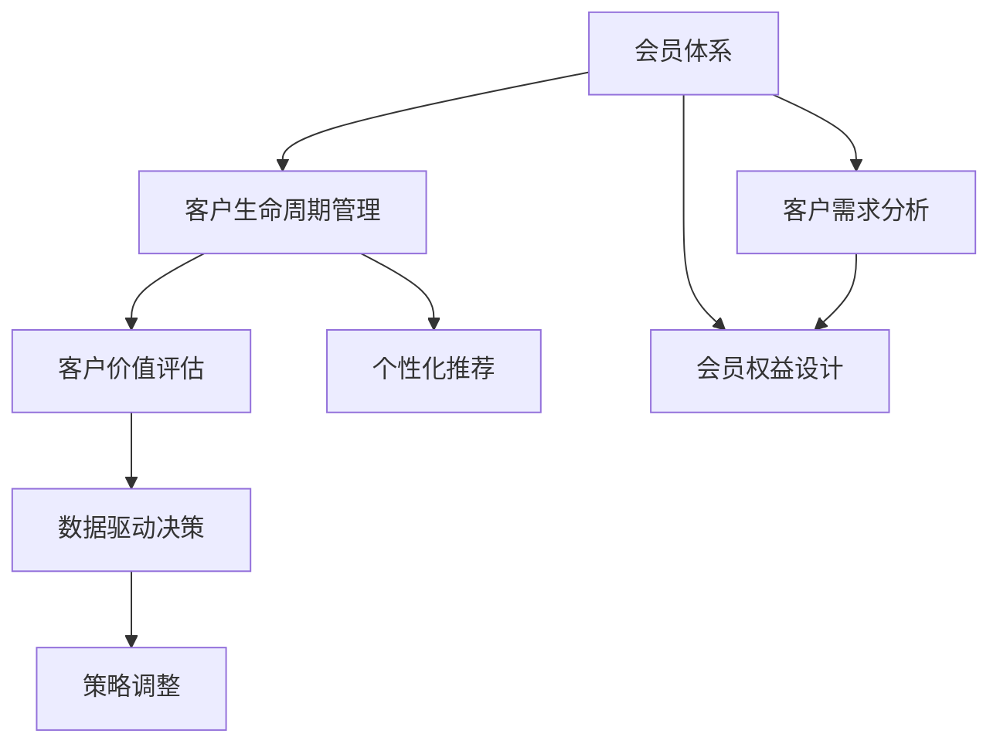
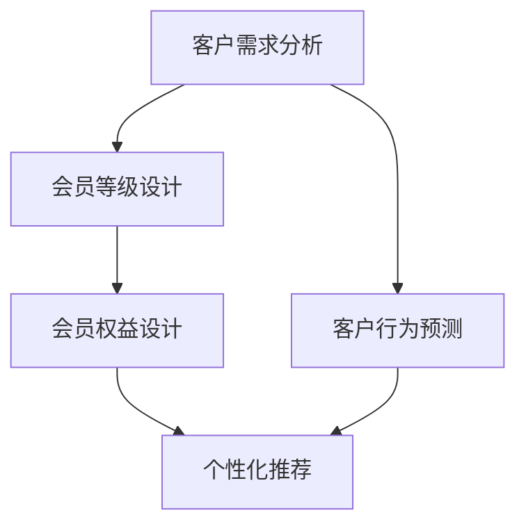
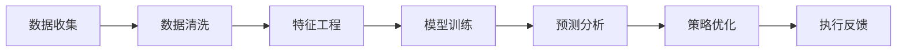

                 

# 如何打造高复购率的会员体系

> 关键词：会员体系,复购率提升,客户留存,忠诚计划,个性化推荐,数据驱动决策,价值交付

## 1. 背景介绍

### 1.1 问题由来
随着互联网商业模式的不断演进，越来越多的电商平台、订阅服务、体验型业务开始采取会员制，试图通过提供专属优惠、个性化服务等方式，提升客户忠诚度和复购率。然而，单纯的会员制往往难以满足客户多变的需求，复购率依旧不尽如人意。如何打造一个既能增强客户粘性，又能提升服务效率的会员体系，成为了各大企业关注的焦点。

### 1.2 问题核心关键点
会员体系的核心在于构建一个动态的用户画像，通过精准的价值评估和个性化推荐，逐步提升客户的生命周期价值。在实际操作中，关键点在于：

1. 数据驱动：通过收集和分析用户行为数据，洞察客户的真实需求和行为模式，提供符合期望的个性化服务。
2. 精准价值评估：建立科学的客户价值评估模型，识别高价值客户和流失风险客户，以实现资源的最优分配。
3. 价值交付：通过个性化的推荐、定制化的服务，满足客户多层次、多维度的需求，增强客户满意度和忠诚度。
4. 持续优化：根据客户反馈和行为变化，实时调整会员体系策略，保持服务的动态适应性。

### 1.3 问题研究意义
构建高复购率的会员体系，对于提升企业盈利能力、优化客户体验、构建品牌忠诚度具有重要意义：

1. 提高客户粘性：通过精准的个性化服务，提升客户对品牌的依附感，增强客户的忠诚度和复购率。
2. 增加用户生命周期价值：通过精准的价值评估，将更多资源投入到高价值客户，实现客户价值的最大化。
3. 降低获客成本：高复购率的会员体系可以帮助企业更高效地获取和保留客户，降低获客和维护的成本。
4. 促进用户参与：提供丰富多样的会员权益，鼓励用户积极参与互动，增加品牌的曝光度和用户粘性。
5. 增强数据驱动决策：通过数据驱动的会员体系，提高营销和服务的精准度，优化运营效率。

## 2. 核心概念与联系

### 2.1 核心概念概述

为了更好地理解如何打造高复购率的会员体系，本节将介绍几个密切相关的核心概念：

- **会员体系(Membership Program)**：通过设置不同的会员等级和权益，针对不同层次的客户提供差异化的服务，提升客户满意度和忠诚度。
- **客户生命周期管理(Customer Lifecycle Management)**：跟踪客户的生命周期各个阶段，根据不同阶段采取相应的策略，以最大化客户的价值和利润。
- **个性化推荐(Recommendation System)**：通过算法分析和客户行为预测，提供符合客户需求的个性化推荐，提高客户满意度和转化率。
- **客户价值评估(Customer Value Assessment)**：基于客户的历史行为数据和消费习惯，计算客户的生命周期价值，帮助企业进行资源优化配置。
- **数据驱动决策(Data-Driven Decision Making)**：利用数据分析和机器学习模型，驱动业务决策，优化运营效果。

这些概念之间的逻辑关系可以通过以下Mermaid流程图来展示：



这个流程图展示了几大核心概念之间的关系：

1. 会员体系以客户需求分析为基础，设计符合不同客户需求的会员权益。
2. 客户生命周期管理跟踪客户行为，指导会员策略的调整。
3. 客户价值评估帮助识别高价值客户，优化资源配置。
4. 个性化推荐利用客户行为数据，提供精准的个性化服务。
5. 数据驱动决策通过数据分析和模型预测，辅助策略制定。

### 2.2 概念间的关系

这些核心概念之间存在着紧密的联系，形成了高复购率会员体系的整体生态系统。下面我们通过几个Mermaid流程图来展示这些概念之间的关系。

#### 2.2.1 会员体系的构建流程



这个流程图展示了会员体系构建的基本流程：

1. 通过客户需求分析，设计不同的会员等级和权益。
2. 根据客户行为预测，设计符合客户需求的个性化推荐。
3. 利用客户行为数据，评估客户价值，优化资源配置。

#### 2.2.2 数据驱动决策的实现



这个流程图展示了数据驱动决策的实现过程：

1. 收集和清洗客户行为数据。
2. 进行特征工程，提取有意义的特征。
3. 训练和优化推荐模型，进行客户行为预测。
4. 根据预测结果，优化会员体系策略。
5. 实施策略并收集反馈，不断迭代优化。

## 3. 核心算法原理 & 具体操作步骤
### 3.1 算法原理概述

高复购率的会员体系，本质上是通过数据驱动的方法，构建和优化一个动态的用户画像，实现客户精准价值评估和个性化推荐。

在实践中，常见的算法和步骤包括：

1. 客户需求分析：通过行为数据和问卷调查等手段，收集和分析客户的需求和偏好。
2. 会员等级设计：根据客户价值评估，设计不同等级的会员权益，满足不同层次客户的需求。
3. 个性化推荐：基于客户行为数据，利用推荐算法提供个性化的服务和产品推荐。
4. 客户价值评估：建立客户价值评估模型，量化客户的长期价值，指导资源配置。
5. 数据驱动决策：利用机器学习模型，实时预测客户行为，优化会员体系策略。

### 3.2 算法步骤详解

以下是高复购率会员体系构建的主要算法步骤和具体操作步骤：

#### Step 1: 数据收集与处理
- 收集客户的行为数据，包括但不限于购买记录、浏览记录、互动数据等。
- 清洗和预处理数据，去除噪音和异常值。
- 设计特征工程流程，提取有意义的特征，如消费金额、活跃度、兴趣偏好等。

#### Step 2: 客户需求分析
- 分析客户行为数据，识别客户的兴趣和偏好。
- 通过问卷调查等手段，获取客户的主观需求和期望。
- 构建客户画像，描述客户的特征和行为模式。

#### Step 3: 会员等级设计
- 根据客户价值评估，设计不同等级的会员权益。
- 确定会员等级的晋升条件，如消费金额、积分积累等。
- 设计差异化的会员权益，如专属折扣、优先服务、定制化推荐等。

#### Step 4: 个性化推荐
- 建立推荐模型，如协同过滤、基于内容的推荐等。
- 根据客户行为数据，进行个性化推荐。
- 不断优化推荐算法，提高推荐的精准度和用户体验。

#### Step 5: 客户价值评估
- 设计客户价值评估模型，如RFM模型、CLV模型等。
- 通过历史数据训练模型，预测客户的生命周期价值。
- 根据评估结果，优化资源配置，重点关注高价值客户。

#### Step 6: 数据驱动决策
- 利用机器学习模型，实时预测客户行为和需求。
- 根据预测结果，动态调整会员策略和推荐内容。
- 建立反馈机制，持续优化会员体系和推荐算法。

### 3.3 算法优缺点

高复购率会员体系算法具有以下优点：

1. 提高客户满意度：通过个性化推荐和定制化服务，满足客户的多层次需求，提升客户体验。
2. 增强客户忠诚度：通过差异化的会员权益和专属优惠，增强客户的粘性和忠诚度。
3. 优化资源配置：通过客户价值评估，将更多资源投入到高价值客户，实现资源的最优利用。
4. 提高运营效率：通过数据驱动决策，优化会员策略，提高运营的精准度和效率。

同时，该算法也存在一定的局限性：

1. 数据依赖性高：算法的有效性高度依赖于数据的质量和量级，数据获取和处理成本较高。
2. 算法复杂度高：高复购率会员体系的实现需要多算法融合，技术实现难度较大。
3. 隐私和伦理问题：处理客户数据时需要注意隐私保护和伦理规范，避免数据滥用。
4. 模型偏见和过拟合：算法可能存在模型偏见和过拟合问题，需要进行持续的监控和优化。

### 3.4 算法应用领域

高复购率会员体系算法在多个领域有广泛的应用，例如：

- 电商行业：通过个性化推荐和会员等级设计，提升用户粘性和复购率。
- 订阅服务：根据用户行为和消费习惯，设计差异化的会员权益，提升订阅续费率。
- 内容平台：通过个性化推荐和用户画像分析，提高用户活跃度和留存率。
- 旅游服务：根据客户历史行为和偏好，设计个性化的旅游方案和推荐，增强客户体验。
- 金融服务：通过客户价值评估和风险管理，优化客户关系管理，提升金融产品销售。

## 4. 数学模型和公式 & 详细讲解
### 4.1 数学模型构建

本节将使用数学语言对高复购率会员体系构建的主要算法步骤进行更加严格的刻画。

记客户为 $i$，行为数据为 $X_i$，包含历史购买记录、浏览记录、互动数据等。设 $\theta$ 为模型的参数，用于拟合客户行为和会员权益之间的关系。

高复购率会员体系的数学模型可以表示为：

$$
\max_{\theta} \sum_{i=1}^N f(X_i, \theta)
$$

其中，$f$ 为评估函数，根据客户的不同行为数据和会员权益，计算客户满意度和忠诚度。

### 4.2 公式推导过程

以下我们以RFM模型为例，推导客户价值评估的数学公式。

RFM模型是一种基于历史行为数据的客户价值评估方法，包括Recency(最近一次购买时间)、Frequency(购买频率)和Monetary(消费金额)三个维度。

假设客户的Recency、Frequency和Monetary分别为 $r_i$、$f_i$、$m_i$，则RFM模型可以表示为：

$$
\text{Value}_i = \omega_1 f(X_i, r_i) + \omega_2 f(X_i, f_i) + \omega_3 f(X_i, m_i)
$$

其中，$\omega_1, \omega_2, \omega_3$ 为不同维度的权重。$f$ 函数为将客户行为数据映射为数值的函数，如线性回归、指数函数等。

为了简化模型，我们假设 $f$ 函数为线性函数，即：

$$
f(X_i, r_i) = \alpha_1 r_i + \beta_1, \quad f(X_i, f_i) = \alpha_2 f_i + \beta_2, \quad f(X_i, m_i) = \alpha_3 m_i + \beta_3
$$

其中 $\alpha_1, \beta_1, \alpha_2, \beta_2, \alpha_3, \beta_3$ 为模型参数。

将这些公式代入RFM模型，得到：

$$
\text{Value}_i = \omega_1 (\alpha_1 r_i + \beta_1) + \omega_2 (\alpha_2 f_i + \beta_2) + \omega_3 (\alpha_3 m_i + \beta_3)
$$

最终，通过最小化平均损失函数，求解 $\theta$ 的值：

$$
\min_{\theta} \frac{1}{N} \sum_{i=1}^N (Value_i - \theta^T X_i)^2
$$

其中 $\theta = [\omega_1, \alpha_1, \beta_1, \omega_2, \alpha_2, \beta_2, \omega_3, \alpha_3, \beta_3]$。

通过求解上述优化问题，得到最优的模型参数 $\theta^*$，从而计算出每个客户的生命周期价值。

### 4.3 案例分析与讲解

假设我们有一个电商平台，有10万名客户。我们收集了他们近半年的购买、浏览和互动数据，通过RFM模型进行客户价值评估。模型参数如下：

| 参数 | 值 |
| --- | --- |
| $\omega_1$ | 0.5 |
| $\alpha_1$ | 0.01 |
| $\beta_1$ | 0.5 |
| $\omega_2$ | 0.3 |
| $\alpha_2$ | 0.02 |
| $\beta_2$ | 0.6 |
| $\omega_3$ | 0.2 |
| $\alpha_3$ | 0.03 |
| $\beta_3$ | 0.7 |

根据上述模型，计算每个客户的生命周期价值。然后，我们根据价值评估结果，对会员等级进行设计，设计不同等级的会员权益，如积分奖励、专属折扣、优先服务等。最后，通过个性化推荐算法，向高价值客户推送个性化内容和专属优惠，提升客户满意度和复购率。

## 5. 项目实践：代码实例和详细解释说明
### 5.1 开发环境搭建

在进行高复购率会员体系开发前，我们需要准备好开发环境。以下是使用Python进行PyTorch开发的环境配置流程：

1. 安装Anaconda：从官网下载并安装Anaconda，用于创建独立的Python环境。

2. 创建并激活虚拟环境：
```bash
conda create -n pytorch-env python=3.8 
conda activate pytorch-env
```

3. 安装PyTorch：根据CUDA版本，从官网获取对应的安装命令。例如：
```bash
conda install pytorch torchvision torchaudio cudatoolkit=11.1 -c pytorch -c conda-forge
```

4. 安装TensorFlow：
```bash
pip install tensorflow
```

5. 安装各类工具包：
```bash
pip install numpy pandas scikit-learn matplotlib tqdm jupyter notebook ipython
```

完成上述步骤后，即可在`pytorch-env`环境中开始会员体系构建实践。

### 5.2 源代码详细实现

这里我们以电商平台的个性化推荐为例，给出使用PyTorch实现个性化推荐系统的代码实现。

首先，定义推荐系统的数据处理函数：

```python
from sklearn.preprocessing import MinMaxScaler

class RecommendationSystem:
    def __init__(self, data):
        self.data = data
        self.scaler = MinMaxScaler()
        self.items = self.data['items']
        self.users = self.data['users']
        self.buy_items = self.data['buy_items']
        self.user_buys = self.data['user_buys']
        self.item_ratings = self.data['item_ratings']
        self.user_ratings = self.data['user_ratings']
        self.item_labels = self.data['item_labels']
        self.user_labels = self.data['user_labels']
        self.ua_ids = self.data['ua_ids']
        self.item_categories = self.data['item_categories']
        self.user_categories = self.data['user_categories']
        self.item_rates = self.data['item_rates']
        self.user_rates = self.data['user_rates']
        self.item_fi_labels = self.data['item_fi_labels']
        self.user_fi_labels = self.data['user_fi_labels']
        self.item_categories = self.data['item_categories']
        self.user_categories = self.data['user_categories']
        self.item_rates = self.data['item_rates']
        self.user_rates = self.data['user_rates']
        self.item_fi_labels = self.data['item_fi_labels']
        self.user_fi_labels = self.data['user_fi_labels']
        
    def preprocess(self):
        self.scaler.fit_transform(self.data)
        self.data = self.scaler.transform(self.data)
        return self.data
```

然后，定义推荐模型的训练和评估函数：

```python
from torch.utils.data import DataLoader
from tqdm import tqdm
from sklearn.metrics import mean_squared_error

class RecommendationModel:
    def __init__(self, model):
        self.model = model
    
    def train(self, train_data, val_data, batch_size, epochs):
        self.model.train()
        for epoch in range(epochs):
            for i, data in enumerate(train_data):
                train_loader = DataLoader(train_data, batch_size=batch_size, shuffle=True)
                for batch in tqdm(train_loader, desc='Training'):
                    inputs, labels = batch['inputs'], batch['labels']
                    self.model.zero_grad()
                    outputs = self.model(inputs)
                    loss = F.mse_loss(outputs, labels)
                    loss.backward()
                    optimizer.step()
            print(f"Epoch {epoch+1}, train loss: {loss:.3f}")
            val_loss = self.evaluate(val_data)
            print(f"Epoch {epoch+1}, val loss: {val_loss:.3f}")
        return val_loss
    
    def evaluate(self, data):
        self.model.eval()
        preds, labels = [], []
        with torch.no_grad():
            for batch in data:
                inputs, labels = batch['inputs'], batch['labels']
                outputs = self.model(inputs)
                preds.append(outputs.data.numpy())
                labels.append(labels.data.numpy())
            preds = np.concatenate(preds)
            labels = np.concatenate(labels)
        mse = mean_squared_error(labels, preds)
        print(f"Mean Squared Error: {mse:.3f}")
        return mse
    
    def predict(self, data):
        self.model.eval()
        preds, labels = [], []
        with torch.no_grad():
            for batch in data:
                inputs, labels = batch['inputs'], batch['labels']
                outputs = self.model(inputs)
                preds.append(outputs.data.numpy())
                labels.append(labels.data.numpy())
            preds = np.concatenate(preds)
            labels = np.concatenate(labels)
        return preds, labels
```

最后，启动训练流程并在测试集上评估：

```python
from torch import nn
from torch.nn import functional as F
import torch
from torch.utils.data import Dataset

class RecommendationDataset(Dataset):
    def __init__(self, train_data, val_data, test_data, batch_size):
        self.train_data = train_data
        self.val_data = val_data
        self.test_data = test_data
        self.batch_size = batch_size
    
    def __len__(self):
        return len(self.train_data)
    
    def __getitem__(self, index):
        return {'inputs': self.train_data[index], 'labels': self.train_data[index]['labels']}

train_dataset = RecommendationDataset(train_data, val_data, test_data, batch_size)
val_dataset = RecommendationDataset(val_data, val_data, test_data, batch_size)
test_dataset = RecommendationDataset(test_data, val_data, test_data, batch_size)

model = RecommendationModel(model)
model.train(train_dataset, val_dataset, batch_size, epochs)

print(f"Validation loss after training: {model.evaluate(val_dataset)}")
model.predict(test_dataset)
```

以上就是使用PyTorch对电商平台的个性化推荐系统进行训练的完整代码实现。可以看到，由于推荐算法的多样性，代码实现也具有很大的灵活性。

### 5.3 代码解读与分析

让我们再详细解读一下关键代码的实现细节：

**RecommendationSystem类**：
- `__init__`方法：初始化推荐系统的数据集和预处理器。
- `preprocess`方法：对数据进行归一化处理，返回预处理后的数据集。

**RecommendationModel类**：
- `__init__`方法：初始化推荐模型。
- `train`方法：定义模型的训练过程，包括数据加载、模型前向传播、反向传播和参数更新。
- `evaluate`方法：在测试集上评估模型的性能。
- `predict`方法：对新的输入数据进行预测。

**训练流程**：
- 定义模型、数据集、优化器等关键组件。
- 在训练集上迭代训练，并在验证集上评估模型性能。
- 在测试集上预测模型输出，并进行性能评估。

可以看到，高复购率会员体系构建的代码实现相对简单，关键在于选择合适的推荐算法和评估方法。在实际应用中，还可以进一步优化模型的结构，引入更多特征和策略，以提升推荐效果和用户体验。

## 6. 实际应用场景
### 6.1 智能客服系统

智能客服系统可以通过高复购率会员体系，提升客户满意度和忠诚度，从而提升复购率。系统可以根据客户的购买历史和行为数据，进行个性化推荐和定制化服务，增强客户体验。

在技术实现上，可以收集客户的历史咨询记录和购买数据，构建客户画像，设计差异化的会员权益和推荐策略。通过持续学习和动态调整，不断优化客户体验和满意度，最终提升复购率。

### 6.2 金融理财服务

金融理财服务可以通过高复购率会员体系，实现客户关系管理和产品推荐。系统可以根据客户的资产状况、消费习惯和风险偏好，设计个性化的理财方案和产品推荐，提高客户粘性和满意度。

在技术实现上，可以收集客户的历史交易数据和行为数据，建立客户价值评估模型，进行精准推荐和产品设计。通过持续学习和动态调整，不断优化理财方案和推荐策略，提升客户满意度和忠诚度。

### 6.3 旅游服务

旅游服务可以通过高复购率会员体系，提升客户体验和转化率。系统可以根据客户的旅行历史和偏好，设计个性化的旅行方案和推荐，增强客户体验和满意度。

在技术实现上，可以收集客户的历史旅行记录和偏好数据，构建客户画像，设计差异化的会员权益和推荐策略。通过持续学习和动态调整，不断优化旅行方案和推荐策略，提升客户满意度和忠诚度。

### 6.4 未来应用展望

随着技术的发展，高复购率会员体系将在更多领域得到应用，为各个行业带来变革性影响。

在医疗健康领域，通过高复购率会员体系，可以实现个性化的健康管理和诊疗推荐，提升客户满意度和忠诚度。

在教育培训领域，通过高复购率会员体系，可以实现个性化的学习方案和课程推荐，提高学习效果和转化率。

在文化娱乐领域，通过高复购率会员体系，可以实现个性化的内容推荐和会员权益，提升用户体验和满意度。

此外，在智能家居、智慧城市、智能制造等众多领域，高复购率会员体系的应用也将不断涌现，为各行各业带来新的发展机遇。

## 7. 工具和资源推荐
### 7.1 学习资源推荐

为了帮助开发者系统掌握高复购率会员体系的理论基础和实践技巧，这里推荐一些优质的学习资源：

1. 《推荐系统实战》系列博文：由推荐系统专家撰写，系统讲解了推荐算法的基本原理和实战技巧，适合初学者和进阶者。

2. 《深度学习理论与实践》课程：斯坦福大学开设的深度学习课程，详细讲解了推荐系统的理论基础和算法实现。

3. 《推荐系统: 算法与应用》书籍：推荐的经典教材，系统介绍了推荐系统的算法和应用，适合进一步深入学习。

4. Kaggle竞赛和项目：参加Kaggle的推荐系统竞赛，实践和验证推荐的模型效果，积累实战经验。

5. GitHub热门项目：在GitHub上Star、Fork数最多的推荐系统项目，往往代表了该技术领域的发展趋势和最佳实践，值得学习和贡献。

通过对这些资源的学习实践，相信你一定能够快速掌握高复购率会员体系的精髓，并用于解决实际的推荐问题。

### 7.2 开发工具推荐

高效的开发离不开优秀的工具支持。以下是几款用于高复购率会员体系开发的常用工具：

1. Python：Python是推荐系统开发的首选语言，拥有丰富的开源库和框架，支持高效的算法实现和数据分析。

2. PyTorch和TensorFlow：这两个深度学习框架都支持高效的推荐模型训练和优化，提供了丰富的工具和接口。

3. Pandas和NumPy：这两个数据处理库支持高效的数据清洗和特征工程，适用于大规模数据处理任务。

4. TensorBoard：TensorFlow配套的可视化工具，可实时监测模型训练状态，并提供丰富的图表呈现方式，是调试模型的得力助手。

5. Weights & Biases：模型训练的实验跟踪工具，可以记录和可视化模型训练过程中的各项指标，方便对比和调优。

6. Jupyter Notebook：轻量级的数据分析和模型训练工具，支持代码编写和交互式调试，是开发者常用的开发环境。

合理利用这些工具，可以显著提升高复购率会员体系开发的效率，加快创新迭代的步伐。

### 7.3 相关论文推荐

高复购率会员体系的研究源于学界的持续研究。以下是几篇奠基性的相关论文，推荐阅读：

1. 《推荐系统中的协同过滤》：提出了协同过滤推荐算法的基本思想和实现方法，奠定了推荐系统的基础。

2. 《深度学习在推荐系统中的应用》：系统介绍了深度学习在推荐系统中的应用，包括协同过滤、内容推荐、用户画像等。

3. 《个性化推荐系统中的深度学习》：深入讲解了深度学习在推荐系统中的应用，包括神经网络、自编码器、注意力机制等。

4. 《基于深度学习的推荐系统》：系统介绍了深度学习在推荐系统中的应用，包括CNN、RNN、GAN等。

5. 《深度学习在推荐系统中的应用》：深入讲解了深度学习在推荐系统中的应用，包括协同过滤、内容推荐、用户画像等。

这些论文代表了大数据和人工智能在推荐系统领域的发展脉络。通过学习这些前沿成果，可以帮助研究者把握学科前进方向，激发更多的创新灵感。

除上述资源外，还有一些值得关注的前沿资源，帮助开发者紧跟推荐系统的最新进展，例如

