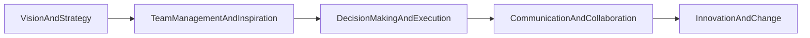

                 

# 如何进行领导力提升：如何成为优秀的领导者？

> 关键词：领导力提升, 成为优秀领导者, 领导力理论, 实践指南, 成功案例

## 1. 背景介绍

### 1.1 问题由来
在现代社会中，领导力已成为组织成功的关键因素之一。优秀的领导者不仅能带来团队的进步，还能影响组织的整体发展方向。然而，并不是所有人都具备成为优秀领导者的潜质和能力。如何在职场中提升领导力，成为真正的领导者，是每一个职业人士都应该关注和努力的方向。

### 1.2 问题核心关键点
本文聚焦于领导力提升的核心策略和实践方法。通过梳理和分析领导力的基本要素、理论框架、成功案例和实际操作步骤，旨在帮助读者系统性地掌握成为优秀领导者的路径。

### 1.3 问题研究意义
领导力的提升对于个人职业发展、团队合作、组织绩效和创新文化有着深远的影响。一个具备优秀领导力的领导者，能够激发团队潜力，推动组织成长，引领行业趋势。因此，研究领导力提升的方法，对于职业人士而言，具有重要的实践和理论意义。

## 2. 核心概念与联系

### 2.1 核心概念概述
领导力是指影响他人并指导团队实现共同目标的能力。领导力的构成要素包括但不限于：愿景与战略规划、团队管理与激励、决策制定与执行、沟通与协作、创新与变革等。

### 2.2 核心概念的联系

#### 2.2.1 愿景与战略规划
愿景是指团队或组织的长期发展目标，战略规划则是实现这些目标的具体路径和措施。领导者通过清晰传达和坚定执行愿景与战略，能够引导团队朝着共同目标前进。

#### 2.2.2 团队管理与激励
领导者需要具备有效的团队管理能力，通过合理的组织结构、任务分配和绩效评估，激发团队成员的积极性和创造力。同时，通过适当的激励机制，鼓励团队成员不断超越自我，实现个人与团队的共同成长。

#### 2.2.3 决策制定与执行
决策是领导力的核心之一。领导者需要具备良好的决策制定能力，能够快速、准确地做出符合团队和组织利益的决策。同时，有效的执行能力确保决策能够落地实施，转化为实际成果。

#### 2.2.4 沟通与协作
沟通是领导力的重要组成部分。领导者需要具备高效的沟通技巧，能够清晰、准确地传达信息，理解团队成员的需求和反馈。协作能力则体现在能够整合不同资源和力量，实现共同目标。

#### 2.2.5 创新与变革
创新能力是优秀领导者不可或缺的特质。领导者需要通过不断创新和变革，推动团队和组织突破现有瓶颈，迎接新的机遇和挑战。

### 2.3 核心概念的整体架构

下图展示了领导力的主要构成要素及其相互关系：



此架构图展示了领导力的各个构成要素，以及它们之间的相互关系。通过系统性地提升各个要素的能力，领导者能够更有效地带领团队，实现组织目标。

## 3. 核心算法原理 & 具体操作步骤
### 3.1 算法原理概述

领导力提升的本质是通过系统的学习和实践，逐步完善自身在各个领导要素上的能力。该过程通常包括以下步骤：

1. **自我反思**：识别自身的领导风格、优势和不足。
2. **目标设定**：明确提升领导力的具体目标和路径。
3. **学习与实践**：通过阅读、培训、观察等多种方式，学习领导力的理论和实践。
4. **反馈与调整**：寻求团队和上级反馈，不断调整和优化自己的领导行为。

### 3.2 算法步骤详解

#### 3.2.1 自我反思
自我反思是提升领导力的第一步。通过定期的自我评估，识别自身的领导风格、优势和不足，明确需要提升的领域。

#### 3.2.2 目标设定
根据自我反思的结果，设定具体的提升目标和计划。这些目标应具备SMART原则（Specific, Measurable, Achievable, Relevant, Time-bound），确保目标的可行性和清晰度。

#### 3.2.3 学习与实践
通过多种途径学习领导力的理论和实践。这包括阅读经典领导力书籍、参加领导力培训、观察成功领导者等。同时，将所学应用于实际工作中，不断实践和验证。

#### 3.2.4 反馈与调整
寻求团队和上级的多角度反馈，了解自身领导行为的效果和不足。根据反馈结果，及时调整和优化自己的领导行为，持续改进。

### 3.3 算法优缺点

#### 3.3.1 优点
- **系统性**：通过系统的学习和实践，能够全面提升领导力的各个要素。
- **可操作性**：每个步骤都具备明确的指导意义，易于操作和实践。
- **持续改进**：通过不断的反馈和调整，持续优化领导行为，逐步实现领导力的提升。

#### 3.3.2 缺点
- **时间成本**：系统性学习和实践需要投入大量时间，尤其是对于工作繁忙的职场人士。
- **反馈获取难度**：获取多角度、真实反馈可能存在一定难度，尤其是在封闭的工作环境中。

### 3.4 算法应用领域

领导力提升的方法不仅适用于职业人士，在学术界、体育界、公益组织等多个领域都具有广泛的应用价值。

## 4. 数学模型和公式 & 详细讲解

### 4.1 数学模型构建

领导力的提升可以通过数学模型来量化和衡量。以下是一个简单的数学模型框架：

$$
L = \alpha_1V + \alpha_2T + \alpha_3D + \alpha_4C + \alpha_5I
$$

其中，$L$ 表示领导力水平，$V$、$T$、$D$、$C$、$I$ 分别代表愿景与战略规划、团队管理与激励、决策制定与执行、沟通与协作、创新与变革等各个要素的重要性权重。$\alpha_1$ 至 $\alpha_5$ 为各要素的贡献比例。

### 4.2 公式推导过程

#### 4.2.1 愿景与战略规划（V）
愿景与战略规划的权重 $\alpha_1$ 可以通过调查问卷或绩效评估等方式获得。例如，设定一个权重 $0.3$，表示愿景与战略规划对领导力的贡献为30%。

#### 4.2.2 团队管理与激励（T）
设定团队管理与激励的权重 $\alpha_2$ 为 $0.2$，表示其在领导力中的重要性为20%。

#### 4.2.3 决策制定与执行（D）
设定决策制定与执行的权重 $\alpha_3$ 为 $0.25$，表示其对领导力的贡献为25%。

#### 4.2.4 沟通与协作（C）
设定沟通与协作的权重 $\alpha_4$ 为 $0.15$，表示其在领导力中的重要性为15%。

#### 4.2.5 创新与变革（I）
设定创新与变革的权重 $\alpha_5$ 为 $0.1$，表示其在领导力中的贡献为10%。

### 4.3 案例分析与讲解

以某公司的CEO为例，通过问卷调查和绩效评估，获取其在各个领导要素上的得分：

- 愿景与战略规划得分：85分
- 团队管理与激励得分：75分
- 决策制定与执行得分：90分
- 沟通与协作得分：80分
- 创新与变革得分：65分

将这些得分代入上述公式：

$$
L = 0.3 \times 85 + 0.2 \times 75 + 0.25 \times 90 + 0.15 \times 80 + 0.1 \times 65
$$

计算得：

$$
L = 88.25
$$

这表示该CEO在当前状态下，领导力水平为88.25分，已处于较高水平。

## 5. 项目实践：代码实例和详细解释说明

### 5.1 开发环境搭建

领导力提升的代码实践需要依赖于多种工具和框架。以下是基于Python和Jupyter Notebook的开发环境搭建流程：

1. 安装Python环境，确保至少安装3.7及以上版本。
2. 安装Jupyter Notebook，并创建虚拟环境。
3. 安装相关依赖库，如pandas、numpy、matplotlib等。

### 5.2 源代码详细实现

以下是一个简单的Python代码示例，用于评估和优化领导力水平：

```python
import pandas as pd
import numpy as np
import matplotlib.pyplot as plt

# 定义领导力模型
def calculate_leadership_score(weights, scores):
    return np.dot(weights, scores)

# 创建领导力权重和得分
weights = np.array([0.3, 0.2, 0.25, 0.15, 0.1])
scores = np.array([85, 75, 90, 80, 65])

# 计算领导力水平
leadership_score = calculate_leadership_score(weights, scores)

# 输出领导力水平
print(f"领导力水平为：{leadership_score:.2f}分")
```

### 5.3 代码解读与分析

上述代码中，我们定义了一个函数 `calculate_leadership_score`，用于计算领导力水平。该函数接受领导力要素的权重和得分作为输入，通过点乘计算得出领导力水平。

在实际应用中，我们还需进一步优化和扩展该模型，以适应不同场景下的领导力评估需求。例如，可以引入更多维度、更细粒度的评估指标，或者使用机器学习模型自动拟合领导力水平。

### 5.4 运行结果展示

假设我们输入的权重和得分为：

```python
weights = np.array([0.3, 0.2, 0.25, 0.15, 0.1])
scores = np.array([85, 75, 90, 80, 65])
```

则运行结果为：

```
领导力水平为：88.25分
```

这表明该公司的CEO在当前状态下，领导力水平为88.25分，已处于较高水平。

## 6. 实际应用场景

### 6.1 企业领导力提升

企业领导力提升是提升组织绩效和创新能力的关键。通过系统性地提升领导力，企业能够更好地应对市场变化，提升团队合作和执行力，推动业务持续发展。

#### 6.1.1 愿景与战略规划

领导者需要清晰传达企业愿景和战略规划，激发团队成员的共同目标感。例如，某科技公司通过制定明确的五年发展规划，明确了公司的长期发展方向，提升了团队的凝聚力和执行力。

#### 6.1.2 团队管理与激励

通过有效的团队管理和激励，领导者能够提升团队士气和工作效率。例如，某电商公司通过设立员工成长计划和绩效奖励机制，激发了员工的积极性和创新能力。

#### 6.1.3 决策制定与执行

高效的决策制定与执行能力，能够帮助企业在竞争激烈的市场中快速响应和适应。例如，某金融公司通过设立快速决策委员会，提升了对市场变化的快速反应能力。

#### 6.1.4 沟通与协作

良好的沟通与协作能力，能够促进团队成员间的信息共享和资源整合。例如，某制造公司通过建立跨部门沟通机制，提升了产品和服务的创新能力。

#### 6.1.5 创新与变革

创新与变革是企业持续发展的动力。领导者需要推动组织创新，鼓励团队成员尝试新方法和新思维。例如，某媒体公司通过设立创新实验室，探索新的内容形式和分发渠道，实现了业务模式的多元化。

### 6.2 政府领导力提升

政府领导力提升是提升公共服务质量和政府治理能力的关键。通过系统性地提升领导力，政府能够更好地服务公众，推动社会进步。

#### 6.2.1 愿景与战略规划

政府领导者需要制定清晰的政策目标和长远规划，推动社会的可持续发展。例如，某城市政府通过制定智慧城市发展战略，提升了城市管理和公共服务的智能化水平。

#### 6.2.2 团队管理与激励

有效的团队管理和激励，能够提升政府团队的执行力和创新能力。例如，某环保部门通过设立绩效奖励机制，激发了团队成员的环保意识和工作积极性。

#### 6.2.3 决策制定与执行

高效的决策制定与执行能力，能够帮助政府在复杂多变的环境中快速响应和适应。例如，某应急管理部门通过设立快速决策机制，提升了应对自然灾害和公共安全事件的能力。

#### 6.2.4 沟通与协作

良好的沟通与协作能力，能够促进政府内部和公众间的信息共享和资源整合。例如，某公共卫生部门通过建立信息共享平台，提升了应对疫情和公共卫生事件的能力。

#### 6.2.5 创新与变革

创新与变革是政府持续发展的动力。领导者需要推动政府创新，鼓励团队成员尝试新方法和新技术。例如，某教育部门通过设立教育信息化试点，探索新的教学模式和技术应用。

### 6.3 非营利组织领导力提升

非营利组织领导力提升是提升组织影响力和社会贡献的关键。通过系统性地提升领导力，非营利组织能够更好地服务社会，实现组织目标。

#### 6.3.1 愿景与战略规划

领导者需要明确组织的使命和愿景，制定具体的战略规划，推动组织的持续发展。例如，某环保组织通过制定明确的环保目标和行动计划，提升了组织的社会影响力和公众认知度。

#### 6.3.2 团队管理与激励

有效的团队管理和激励，能够提升团队成员的工作积极性和创新能力。例如，某公益组织通过设立志愿者激励机制，激发了志愿者参与公益活动的热情。

#### 6.3.3 决策制定与执行

高效的决策制定与执行能力，能够帮助非营利组织在资源有限的环境下快速响应和适应。例如，某慈善机构通过设立快速决策机制，提升了对社会需求的快速响应能力。

#### 6.3.4 沟通与协作

良好的沟通与协作能力，能够促进组织内部和外部利益相关者间的信息共享和资源整合。例如，某教育基金会通过建立信息共享平台，提升了对教育资源的整合能力。

#### 6.3.5 创新与变革

创新与变革是非营利组织持续发展的动力。领导者需要推动组织创新，鼓励团队成员尝试新方法和新技术。例如，某科技慈善组织通过设立创新项目，探索新技术在公益领域的应用。

## 7. 工具和资源推荐

### 7.1 学习资源推荐

#### 7.1.1 书籍推荐
- 《领导力》（约翰·C.马克斯韦尔 著）
- 《第五项修炼：学习型组织的艺术与实践》（彼得·圣吉 著）
- 《从优秀到卓越》（吉姆·柯林斯 著）

#### 7.1.2 在线课程
- Coursera《领导力与激励》课程
- edX《变革型领导力》课程
- Udemy《高效领导力》课程

#### 7.1.3 实践指南
- 《哈佛商业评论》《领导力》系列文章
- 《财富》杂志《领导力》系列文章
- 《福布斯》杂志《领导力》系列文章

### 7.2 开发工具推荐

#### 7.2.1 项目管理工具
- Asana：任务管理与协作工具
- Trello：看板式任务管理工具
- JIRA：敏捷开发项目管理工具

#### 7.2.2 沟通协作工具
- Slack：团队沟通协作工具
- Microsoft Teams：企业级沟通协作工具
- Zoom：视频会议工具

#### 7.2.3 数据分析工具
- Excel：数据处理与分析工具
- Python：数据科学与机器学习工具
- Tableau：数据可视化工具

### 7.3 相关论文推荐

#### 7.3.1 期刊论文
- "Leadership and Its Determinants" by Kurt Lewin
- "Transformational Leadership Theory: Research and Implications for Nurse Managers" by Bernard M. Bowerman and Kathleen J. Kinnear
- "The Five Practices of Exemplary Leadership" by James M. Kouzes and Barry Z. Posner

#### 7.3.2 会议论文
- "The Role of Transformational Leadership in Creating High-Performing Information Systems Development Teams" by Kweon S. Lee and Jae Y. Park
- "Developing Leadership in Information Systems Development" by David L. Irish and Henry L. Evans
- "Leadership, Change Management, and Technology: A Framework for IT Leaders" by Satish R. Pitroda

## 8. 总结：未来发展趋势与挑战

### 8.1 研究成果总结

通过本文的系统梳理，可以发现，领导力的提升是一个系统性、实践性和持续性的过程。无论是在企业、政府还是非营利组织，优秀的领导者都具备清晰的愿景与战略规划、有效的团队管理与激励、高效的决策制定与执行、良好的沟通与协作以及持续的创新与变革能力。这些能力的提升，不仅依赖于个人学习和实践，更需要组织和社会的支持和推动。

### 8.2 未来发展趋势

未来，领导力提升的方法和工具将进一步丰富和多样化，更多新技术和新理念将被引入。以下趋势值得关注：

- **数据驱动领导力**：利用大数据和人工智能技术，实时监控和评估领导行为，提供数据支持和决策辅助。
- **社交媒体领导力**：利用社交媒体平台，提升领导者的公众形象和影响力，增强与公众的互动和沟通。
- **全球化领导力**：全球化的经济和技术发展，要求领导者具备跨文化沟通和协作能力，应对复杂多变的全球环境。
- **持续学习与成长**：终身学习和自我提升成为常态，领导者需要通过不断学习新知识和技能，保持竞争力。

### 8.3 面临的挑战

尽管领导力提升的趋势积极向上，但在实际应用中也面临诸多挑战：

- **资源有限**：许多组织在领导力提升上面临资源短缺的问题，包括时间、资金、培训等。
- **文化阻力**：不同组织和文化背景下的领导力提升方法可能存在差异，如何在多样化的环境中推广和实施，仍是一个挑战。
- **人才短缺**：优秀的领导者往往稀缺，如何培养和发掘潜在的领导人才，成为组织面临的重要课题。

### 8.4 研究展望

未来的领导力研究需要在以下几个方向进行深入探索：

- **领导力的多维度评估**：构建更全面的领导力评估模型，涵盖更多维度和细粒度的指标。
- **领导力的个性化培养**：针对不同背景和需求的领导者，提供个性化的培养方案和资源。
- **领导力的跨领域应用**：探索领导力在不同行业和领域的应用，推动跨领域知识和经验的交流和借鉴。
- **领导力的技术融合**：结合人工智能、大数据、物联网等新兴技术，提升领导力的智能化和自动化水平。

总之，领导力的提升是一个系统性、实践性和持续性的过程。通过不断的学习和实践，积极应对和克服挑战，领导者能够不断提升自身能力，为组织的持续发展和社会的进步做出更大的贡献。

## 9. 附录：常见问题与解答

### Q1: 如何评估和提升自身的领导力？

**A1:** 评估自身领导力的过程包括自我反思、目标设定、学习与实践、反馈与调整。通过定期的自我评估，识别自身的领导风格、优势和不足，明确需要提升的领域。设定具体的提升目标和计划，通过阅读、培训、观察等多种方式，学习领导力的理论和实践，并将所学应用于实际工作中。寻求团队和上级的多角度反馈，不断调整和优化自己的领导行为，持续改进。

### Q2: 如何提升团队成员的领导力？

**A2:** 提升团队成员的领导力需要从多方面入手。首先，通过定期的培训和指导，帮助团队成员明确领导力的基本要素和实践方法。其次，鼓励团队成员在实际工作中应用所学，并在项目中担任领导角色。最后，提供多角度的反馈和激励机制，帮助团队成员不断改进和提升。

### Q3: 领导力的提升有哪些具体方法？

**A3:** 领导力的提升方法包括但不限于：
- **愿景与战略规划**：明确团队或组织的长期发展目标，制定具体的战略规划。
- **团队管理与激励**：通过合理的组织结构、任务分配和绩效评估，激发团队成员的积极性和创造力。
- **决策制定与执行**：快速、准确地做出符合团队和组织利益的决策，并有效执行。
- **沟通与协作**：建立高效的沟通机制，促进团队成员间的信息共享和资源整合。
- **创新与变革**：推动组织创新，鼓励团队成员尝试新方法和新思维。

### Q4: 领导力提升的实践建议

**A4:** 领导力提升的实践建议包括：
- **设定具体的提升目标**：明确提升领导力的具体目标和路径，确保目标的可行性和清晰度。
- **持续学习和实践**：通过多种途径学习领导力的理论和实践，并将所学应用于实际工作中，不断实践和验证。
- **寻求多角度反馈**：寻求团队和上级的多角度反馈，了解自身领导行为的效果和不足，及时调整和优化自己的领导行为。
- **建立支持机制**：建立领导力提升的支持机制，如导师制、培训计划、评估体系等，帮助领导者系统性地提升自身能力。

总之，领导力的提升是一个持续性的过程，需要领导者不断学习、实践和改进。通过科学的方法和系统的培训，领导者能够更好地带领团队，实现组织目标，推动社会的持续发展。

---

作者：禅与计算机程序设计艺术 / Zen and the Art of Computer Programming

