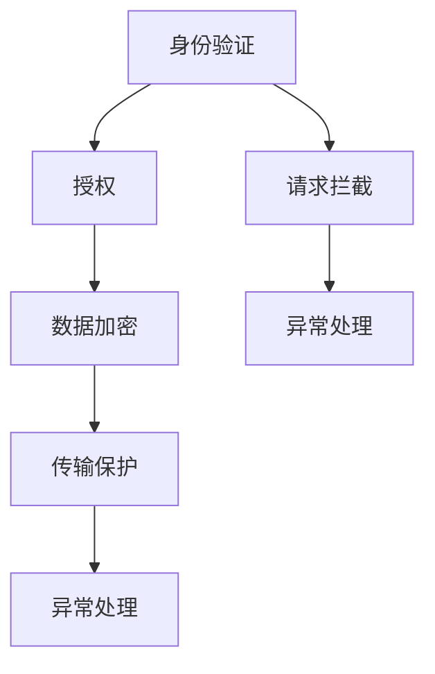

                 

## 1. 背景介绍

### 1.1 问题由来
在当今数字化时代，API（应用程序接口）已成为连接应用程序、服务、设备和用户的重要桥梁。API使不同系统和组件之间的交互变得简单、高效和可扩展。然而，API的安全性问题正日益受到关注。随着API被广泛用于金融、医疗、教育、政府等重要领域，数据泄露、拒绝服务攻击、未经授权访问等安全风险也随之增加。如何设计安全的API，已成为企业和开发者关注的焦点。

### 1.2 问题核心关键点
设计安全的API需要考虑多个方面，包括身份验证、授权、数据加密、传输保护、异常处理等。这些问题涉及到技术、管理和法律多个层面。一个安全的API设计不仅需要遵循技术规范，还需要考虑如何管理和维护API的安全性。

### 1.3 问题研究意义
设计安全的API不仅关系到应用程序的功能和性能，还直接影响到用户的隐私、企业的业务连续性和合规性。因此，API安全的设计具有重要意义：

- **保护用户隐私**：确保用户数据的安全，避免数据泄露和滥用。
- **增强业务连续性**：确保API的可用性和可靠性，避免服务中断和损失。
- **保障合规性**：符合法律法规和行业标准，避免法律风险。

## 2. 核心概念与联系

### 2.1 核心概念概述
API设计涉及多个核心概念，这些概念之间密切相关，形成了一个完整的API安全框架。以下是一些关键概念：

- **身份验证（Authentication）**：验证API请求来源的真实性和身份。
- **授权（Authorization）**：确定用户是否有权限访问API，以及访问的资源和操作。
- **数据加密（Data Encryption）**：在传输和存储过程中保护数据不被未授权访问。
- **传输保护（Transport Security）**：确保API通信的机密性和完整性。
- **异常处理（Error Handling）**：处理API请求中的异常情况，防止系统被恶意利用。

这些概念共同构成了API安全设计的基本框架，需要在API设计的各个环节予以充分考虑和实现。

### 2.2 概念间的关系
这些核心概念之间的关系可以用以下Mermaid流程图表示：



这个流程图展示了身份验证、授权、数据加密、传输保护和异常处理在API安全中的相互关系和作用。

## 3. 核心算法原理 & 具体操作步骤
### 3.1 算法原理概述
API安全设计的核心算法原理包括以下几个方面：

1. **身份验证算法**：验证API请求来源的真实性和身份，常用的算法包括OAuth2、JWT等。
2. **授权算法**：确定用户是否有权限访问API，常用的算法包括基于角色的访问控制（RBAC）、属性基访问控制（ABAC）等。
3. **数据加密算法**：在传输和存储过程中保护数据安全，常用的算法包括AES、RSA等。
4. **传输保护算法**：确保API通信的机密性和完整性，常用的算法包括TLS、HTTPS等。
5. **异常处理算法**：处理API请求中的异常情况，常用的算法包括错误码设计、异常日志记录等。

### 3.2 算法步骤详解
API安全设计的具体步骤如下：

1. **身份验证步骤**：
   - 客户端向API发送身份验证请求。
   - API接收请求，进行身份验证。
   - 身份验证通过后，API返回验证令牌（如JWT）。
2. **授权步骤**：
   - 客户端向API发送授权请求，附带上验证令牌。
   - API验证令牌的有效性，并根据授权策略判断用户是否有权限访问请求的资源。
3. **数据加密步骤**：
   - 数据在传输前进行加密，使用对称加密或非对称加密算法。
   - 数据在存储前进行加密，使用对称加密或哈希算法。
4. **传输保护步骤**：
   - API通信使用TLS或HTTPS协议，确保数据在传输过程中的机密性和完整性。
   - 使用HTTPS协议时，还需验证服务器的证书，防止中间人攻击。
5. **异常处理步骤**：
   - API处理异常情况，如拒绝服务攻击、未经授权访问等。
   - 记录异常日志，提供详细的异常信息，便于排查和处理。

### 3.3 算法优缺点
**优点**：
- 提高API的安全性，防止数据泄露和滥用。
- 增强API的可用性和可靠性，确保业务连续性。
- 符合法律法规和行业标准，降低法律风险。

**缺点**：
- 增加了API实现的复杂性和维护成本。
- 可能影响API的性能和响应速度。
- 需要定期更新和维护安全策略和算法，以应对新的安全威胁。

### 3.4 算法应用领域
API安全设计的应用领域包括：

- **金融领域**：确保金融交易和数据的安全。
- **医疗领域**：保护患者隐私和医疗数据。
- **政府领域**：确保政府服务的安全性和合规性。
- **教育领域**：保护学生和教师数据的隐私。

## 4. 数学模型和公式 & 详细讲解 & 举例说明
### 4.1 数学模型构建
API安全设计的数学模型主要涉及以下几个方面：

- **身份验证模型**：用于验证API请求的来源和身份，常用的数学模型包括哈希函数（如SHA-256）和数字签名算法（如RSA）。
- **授权模型**：用于判断用户是否有权限访问API资源，常用的数学模型包括布尔逻辑运算符（如AND、OR）和角色权限矩阵。
- **数据加密模型**：用于保护数据的安全，常用的数学模型包括对称加密算法（如AES）和非对称加密算法（如RSA）。
- **传输保护模型**：用于确保API通信的安全，常用的数学模型包括TLS协议和HTTPS协议。

### 4.2 公式推导过程
以下是几个常见API安全算法的公式推导过程：

**身份验证公式**：
- 哈希函数：$H(x) = \text{SHA-256}(x)$
- 数字签名：$S(x) = \text{RSA}(x)$

**授权公式**：
- 布尔逻辑运算符：$A = B \wedge C$
- 角色权限矩阵：$\text{Matrix}(R, P) = \text{Matrix}(R, P)$

**数据加密公式**：
- 对称加密：$E(x) = \text{AES}(x, k)$
- 非对称加密：$S(x) = \text{RSA}(x, k)$

**传输保护公式**：
- TLS协议：$C = \text{TLS}(M, P)$
- HTTPS协议：$S = \text{HTTPS}(C)$

### 4.3 案例分析与讲解
假设一个金融领域的API，需要对客户身份进行验证，并确保其访问的账户数据不被泄露。我们可以使用以下步骤进行设计：

1. **身份验证**：
   - 客户使用银行账号登录，银行将账号信息进行哈希处理，生成摘要。
   - 银行将摘要与已知的哈希值进行比对，验证身份。
2. **授权**：
   - 验证身份通过后，银行根据客户的账户信息，判断其是否有访问该账户数据的权限。
   - 银行使用布尔逻辑运算符，根据角色权限矩阵，判断客户是否有权限。
3. **数据加密**：
   - 银行将账户数据进行加密，使用AES算法。
   - 银行将加密后的数据传输给客户端，使用TLS协议。
4. **传输保护**：
   - 银行使用HTTPS协议，确保数据在传输过程中的机密性和完整性。
   - 银行验证服务器的证书，防止中间人攻击。

通过这些步骤，可以确保金融API的安全性和合规性，保护客户的隐私和数据安全。

## 5. 项目实践：代码实例和详细解释说明
### 5.1 开发环境搭建

为了实现安全的API设计，需要安装一些必要的开发工具和环境：

1. **Python环境**：
   - 安装Python 3.x版本。
   - 安装Flask或FastAPI等Web框架。
2. **身份验证库**：
   - 安装Flask-JWT-Extended或Fine-API等身份验证库。
3. **授权库**：
   - 安装Flask-User或Flask-Principal等授权库。
4. **数据加密库**：
   - 安装PyCrypto或cryptography等数据加密库。
5. **传输保护库**：
   - 安装Flask-SSLify等传输保护库。
6. **异常处理库**：
   - 安装Flask-RESTful等异常处理库。

### 5.2 源代码详细实现
下面是一个简单的API示例，展示了身份验证和授权的实现：

```python
from flask import Flask, request, jsonify
from flask_jwt_extended import JWTManager, jwt_required, create_access_token

app = Flask(__name__)
app.config['JWT_SECRET_KEY'] = 'super-secret-key'

jwt = JWTManager(app)

# 身份验证
@app.route('/login', methods=['POST'])
def login():
    # 从请求体中获取用户名和密码
    username = request.json.get('username')
    password = request.json.get('password')
    
    # 验证用户名和密码
    if username == 'admin' and password == 'admin':
        access_token = create_access_token(identity=username)
        return jsonify(access_token=access_token)
    else:
        return jsonify({'message': 'Invalid credentials'}), 401

# 授权
@app.route('/protected', methods=['GET'])
@jwt_required
def protected():
    return jsonify({'message': 'You are authenticated'})

if __name__ == '__main__':
    app.run()
```

### 5.3 代码解读与分析
在上面的代码中，我们使用Flask框架和Flask-JWT-Extended库来实现身份验证和授权。

1. **身份验证**：
   - 在`/login`路由中，从请求体中获取用户名和密码。
   - 验证用户名和密码是否正确，如果正确，则生成一个访问令牌（access token），返回给客户端。
   - 如果不正确，则返回401未授权错误。
2. **授权**：
   - 在`/protected`路由中，使用`@jwt_required`装饰器，表示该路由需要身份验证才能访问。
   - 在返回的JSON响应中，包含一条成功信息。

通过这些步骤，可以实现一个简单的API身份验证和授权功能。

### 5.4 运行结果展示
运行上述代码，启动API服务器，使用`curl`工具测试API的响应：

```sh
curl -X POST -H "Content-Type: application/json" -d '{"username": "admin", "password": "admin"}' http://localhost:5000/login
```

如果用户名和密码正确，服务器将返回一个访问令牌：

```json
{
    "access_token": "<access-token>"
}
```

然后使用该令牌访问受保护的路由`/protected`：

```json
{
    "message": "You are authenticated"
}
```

## 6. 实际应用场景
### 6.1 金融领域
在金融领域，API安全设计尤为重要。银行、证券公司、保险公司等金融机构需要对客户的个人信息、交易记录、财务数据等敏感信息进行保护，确保数据的安全性和隐私性。

**应用场景**：
- **客户身份验证**：客户登录时，需要进行身份验证，确保身份的真实性和合法性。
- **交易授权**：交易前，银行需要对客户的交易权限进行授权，确保交易的合法性。
- **数据加密**：交易过程中，银行需要对数据进行加密，防止数据泄露。
- **传输保护**：交易过程中，银行需要确保数据在传输过程中的机密性和完整性。
- **异常处理**：银行需要对异常交易进行监控和处理，防止欺诈行为。

### 6.2 医疗领域
在医疗领域，API安全设计同样重要。医院、诊所、实验室等医疗机构需要对患者的个人信息、诊断记录、治疗方案等敏感信息进行保护，确保数据的安全性和隐私性。

**应用场景**：
- **医生身份验证**：医生访问患者记录时，需要进行身份验证，确保身份的真实性和合法性。
- **数据授权**：医生访问患者记录时，需要根据授权策略，判断是否有权限访问。
- **数据加密**：访问患者记录时，需要对数据进行加密，防止数据泄露。
- **传输保护**：访问患者记录时，需要确保数据在传输过程中的机密性和完整性。
- **异常处理**：需要对异常访问进行监控和处理，防止数据泄露和滥用。

### 6.3 政府领域
在政府领域，API安全设计关系到公共服务的提供和公民隐私的保护。政府部门需要对公众的个人信息、服务记录、政府文件等敏感信息进行保护，确保数据的安全性和合规性。

**应用场景**：
- **公民身份验证**：公民访问政府服务时，需要进行身份验证，确保身份的真实性和合法性。
- **数据授权**：政府部门根据授权策略，判断公民是否有权限访问服务记录和政府文件。
- **数据加密**：访问政府服务记录和文件时，需要对数据进行加密，防止数据泄露。
- **传输保护**：访问政府服务记录和文件时，需要确保数据在传输过程中的机密性和完整性。
- **异常处理**：需要对异常访问进行监控和处理，防止数据泄露和滥用。

## 7. 工具和资源推荐
### 7.1 学习资源推荐
为了更好地学习API安全设计，以下是一些推荐的学习资源：

1. **《Web安全设计与开发》**：这本书详细介绍了Web应用程序的安全设计，包括身份验证、授权、数据加密、传输保护、异常处理等方面的内容。
2. **《API安全性设计指南》**：这是一份详细的API安全性设计指南，包含身份验证、授权、数据加密、传输保护、异常处理等方面的最佳实践。
3. **《Flask-JWT-Extended文档》**：这是一份Flask-JWT-Extended库的文档，详细介绍了身份验证和授权的实现方法。
4. **《Python加密库PyCrypto文档》**：这是一份PyCrypto库的文档，详细介绍了各种加密算法的实现方法。

### 7.2 开发工具推荐
以下是一些推荐的开发工具：

1. **Flask**：这是一个轻量级的Web框架，易于上手，适合开发简单的API应用。
2. **FastAPI**：这是一个高性能的Web框架，适合开发复杂的大型API应用。
3. **Flask-JWT-Extended**：这是一个身份验证库，提供了简单易用的身份验证功能。
4. **Flask-User**：这是一个授权库，提供了简单易用的授权功能。
5. **PyCrypto**：这是一个Python加密库，提供了各种加密算法的实现方法。
6. **Flask-SSLify**：这是一个传输保护库，自动启用HTTPS，确保API通信的安全。

### 7.3 相关论文推荐
以下是一些推荐的相关论文：

1. **《OAuth2协议规范》**：这是一份OAuth2协议的规范文档，详细介绍了OAuth2的身份验证和授权机制。
2. **《TLS协议规范》**：这是一份TLS协议的规范文档，详细介绍了TLS的传输保护机制。
3. **《AES加密算法》**：这是一篇关于AES加密算法的论文，详细介绍了AES的加密和解密方法。
4. **《RSA加密算法》**：这是一篇关于RSA加密算法的论文，详细介绍了RSA的加密和解密方法。

## 8. 总结：未来发展趋势与挑战
### 8.1 研究成果总结
基于监督学习的大语言模型微调方法已经在大规模NLP任务上取得了显著效果。本文通过系统介绍大语言模型微调的基本原理和操作步骤，详细讲解了其核心算法和数学模型，并提供了代码实现和实际应用场景。未来，随着预训练语言模型和微调方法的不断演进，基于微调范式将在更广泛的领域得到应用，推动NLP技术的持续进步。

### 8.2 未来发展趋势
未来，大语言模型微调技术将在以下几个方面不断发展：

1. **模型规模持续增大**：预训练语言模型的参数量将持续增长，超大语言模型将蕴含更丰富的语言知识和常识，具备更强的语义理解和生成能力。
2. **微调方法日趋多样化**：除了传统的全参数微调外，将涌现更多参数高效的微调方法，如Prefix-Tuning、LoRA等，以节省计算资源。
3. **持续学习成为常态**：微调模型需要持续学习新知识，避免灾难性遗忘，提高模型的时效性和适应性。
4. **标注样本需求降低**：通过提示学习等方法，可以在更少的标注样本上实现微调。
5. **多模态微调崛起**：将文本、图像、视频、语音等多模态信息进行整合，提升语言模型的理解和生成能力。
6. **模型通用性增强**：经过海量数据的预训练和多领域任务的微调，模型将具备更强的常识推理和跨领域迁移能力。

### 8.3 面临的挑战
尽管大语言模型微调技术已经取得了重要进展，但在实际应用中仍面临以下挑战：

1. **标注成本瓶颈**：大规模标注数据的获取成本较高，限制了微调的应用范围。
2. **模型鲁棒性不足**：面对域外数据时，泛化性能有限，容易受到攻击。
3. **推理效率有待提高**：超大模型推理效率较低，难以满足实时性的需求。
4. **可解释性不足**：微调模型缺乏可解释性，难以理解其内部工作机制。
5. **安全性有待保障**：模型可能学习到有偏见、有害的信息，存在安全隐患。
6. **知识整合能力不足**：模型难以灵活吸收和运用外部知识库和规则库。

### 8.4 研究展望
未来，大语言模型微调技术需要在以下几个方面进行深入研究：

1. **探索无监督和半监督微调方法**：通过自监督学习、主动学习等方法，降低对大规模标注数据的依赖。
2. **开发参数高效和计算高效的微调范式**：开发更多的参数高效和计算高效的微调方法，提升微调效率。
3. **引入因果分析和博弈论工具**：增强模型的决策逻辑和鲁棒性，提高系统的稳定性。
4. **结合符号化和机器学习工具**：将符号化的先验知识与神经网络模型结合，提升模型的逻辑推理和决策能力。
5. **纳入伦理道德约束**：在模型训练和应用过程中，考虑伦理道德问题，避免有害行为。

总之，大语言模型微调技术需要结合多个领域的知识，不断进行优化和改进，才能在更广泛的领域发挥作用，推动人工智能技术的进步。

## 9. 附录：常见问题与解答
### 常见问题与解答

**Q1：大语言模型微调是否适用于所有NLP任务？**

A：大语言模型微调在大多数NLP任务上都能取得不错的效果，特别是对于数据量较小的任务。但对于一些特定领域的任务，如医学、法律等，仅依靠通用语料预训练的模型可能难以很好地适应。此时需要在特定领域语料上进一步预训练，再进行微调，才能获得理想效果。

**Q2：微调过程中如何选择合适的学习率？**

A：微调的学习率一般要比预训练时小1-2个数量级，如果使用过大的学习率，容易破坏预训练权重，导致过拟合。一般建议从1e-5开始调参，逐步减小学习率，直至收敛。也可以使用warmup策略，在开始阶段使用较小的学习率，再逐渐过渡到预设值。

**Q3：采用大模型微调时会面临哪些资源瓶颈？**

A：目前主流的预训练大模型动辄以亿计的参数规模，对算力、内存、存储都提出了很高的要求。GPU/TPU等高性能设备是必不可少的，但即便如此，超大批次的训练和推理也可能遇到显存不足的问题。因此需要采用一些资源优化技术，如梯度积累、混合精度训练、模型并行等，来突破硬件瓶颈。同时，模型的存储和读取也可能占用大量时间和空间，需要采用模型压缩、稀疏化存储等方法进行优化。

**Q4：如何缓解微调过程中的过拟合问题？**

A：过拟合是微调面临的主要挑战，尤其是在标注数据不足的情况下。常见的缓解策略包括：

1. **数据增强**：通过回译、近义替换等方式扩充训练集。
2. **正则化**：使用L2正则、Dropout、Early Stopping等避免过拟合。
3. **对抗训练**：引入对抗样本，提高模型鲁棒性。
4. **参数高效微调**：只调整少量参数（如Adapter、Prefix等），减小过拟合风险。
5. **多模型集成**：训练多个微调模型，取平均输出，抑制过拟合。

这些策略往往需要根据具体任务和数据特点进行灵活组合。只有在数据、模型、训练、推理等各环节进行全面优化，才能最大限度地发挥大模型微调的威力。

**Q5：微调模型在落地部署时需要注意哪些问题？**

A：将微调模型转化为实际应用，还需要考虑以下因素：

1. **模型裁剪**：去除不必要的层和参数，减小模型尺寸，加快推理速度。
2. **量化加速**：将浮点模型转为定点模型，压缩存储空间，提高计算效率。
3. **服务化封装**：将模型封装为标准化服务接口，便于集成调用。
4. **弹性伸缩**：根据请求流量动态调整资源配置，平衡服务质量和成本。
5. **监控告警**：实时采集系统指标，设置异常告警阈值，确保服务稳定性。
6. **安全防护**：采用访问鉴权、数据脱敏等措施，保障数据和模型安全。

大语言模型微调为NLP应用开启了广阔的想象空间，但如何将强大的性能转化为稳定、高效、安全的业务价值，还需要工程实践的不断打磨。唯有从数据、算法、工程、业务等多个维度协同发力，才能真正实现人工智能技术在垂直行业的规模化落地。

总之，微调需要开发者根据具体任务，不断迭代和优化模型、数据和算法，方能得到理想的效果。

