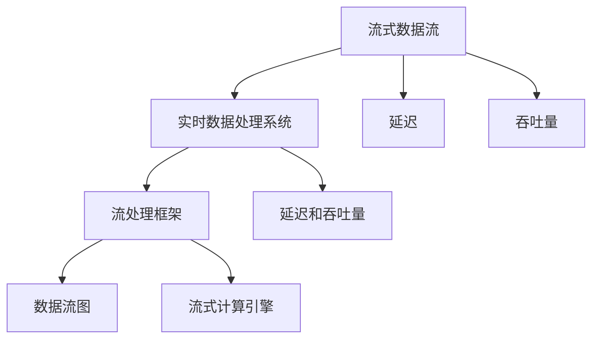

                 

## 1. 背景介绍

### 1.1 问题由来
在当今数字化时代，实时数据处理已经成为了各行各业不可或缺的技术。无论是金融、医疗、交通，还是社交媒体、物联网等领域，都需要实时地处理和分析大量数据，以实现高效运作、智能决策和优化管理。然而，由于数据规模的爆炸性增长和数据源的异构性，传统的离线数据处理方式已经无法满足实时数据处理的需求。

### 1.2 问题核心关键点
实时数据处理的核心问题在于如何在数据生成的同时，对其进行快速、准确地分析和处理，以满足实时应用的需求。该问题通常包括以下几个关键点：

- **高吞吐量**：能够处理每秒数百万次甚至亿次的数据请求。
- **低延迟**：数据处理过程的响应时间需要控制在毫秒级以内。
- **高可用性**：系统需要具备高可用性，以保证服务的连续性和可靠性。
- **高可扩展性**：系统需要能够灵活扩展，以应对不同规模和类型的数据处理需求。

### 1.3 问题研究意义
实时数据处理技术的应用对于提升数据驱动型业务的价值、提高决策效率、优化资源分配具有重要意义。通过实时数据处理，企业可以实现：

- **实时监控和预警**：快速响应市场波动、安全事件等突发情况。
- **个性化推荐和精准营销**：实时分析用户行为，提供个性化推荐和精准营销方案。
- **实时数据分析和洞察**：实时处理大量数据，提供深度分析和洞见，支持数据驱动的决策。

实时数据处理技术的持续发展，有助于推动数字化转型，实现业务智能化和自动化，推动各行各业的高效发展。

## 2. 核心概念与联系

### 2.1 核心概念概述

为更好地理解实时数据处理的原理，我们需要首先掌握一些核心概念：

- **流式数据流**：数据以连续不断的流的形式产生，每个数据项在极短的时间内产生并立即处理。
- **实时数据处理系统**：用于对流式数据流进行实时分析和处理的软件系统。
- **流处理框架**：提供流式数据处理的基础设施，支持数据流的接收、存储、处理和计算。
- **数据流图**：用于描述数据流处理过程的图形模型。
- **流式计算引擎**：支持流式数据处理的计算引擎，如Apache Flink、Apache Kafka、Apache Storm等。
- **延迟和吞吐量**：衡量实时数据处理系统性能的两个关键指标，需要平衡两者之间的关系。

这些核心概念共同构成了实时数据处理的基础，通过合理运用这些概念，可以实现高效、可靠的实时数据处理。

### 2.2 概念间的关系

这些核心概念之间的联系可以通过以下Mermaid流程图来展示：



这个流程图展示了流式数据流、实时数据处理系统、流处理框架、数据流图、流式计算引擎以及延迟和吞吐量之间的关系：

1. 流式数据流是从各种数据源产生的数据集合，是实时数据处理的基础。
2. 实时数据处理系统是对流式数据流进行实时分析和处理的软件系统，需要处理延迟和吞吐量之间的关系。
3. 流处理框架是提供流式数据处理基础设施的软件平台，支持数据流的接收、存储、处理和计算。
4. 数据流图是描述流式数据处理过程的图形模型，用于规划和设计数据流处理流程。
5. 流式计算引擎是支持流式数据处理的计算平台，如Apache Flink、Apache Kafka、Apache Storm等。
6. 延迟和吞吐量是衡量实时数据处理系统性能的关键指标，需要平衡两者之间的关系。

这些概念共同构成了实时数据处理的生态系统，各组件相互作用，形成高效、可靠的数据处理系统。

## 3. 核心算法原理 & 具体操作步骤
### 3.1 算法原理概述

实时数据处理的核心算法原理是基于流处理和并行计算。流处理是指对流式数据流进行实时处理，每条数据项的处理都是独立的，并且处理结果可以实时反馈到数据流中。并行计算是指将数据流划分为多个子流，并行处理这些子流，以提高处理效率。

实时数据处理系统通常包括以下关键步骤：

1. **数据接收与存储**：将流式数据流接收进来，并存储在缓冲区或分布式存储系统中。
2. **数据分区与聚合**：将数据流分区，并对分区数据进行聚合操作，如求和、计数、计算平均值等。
3. **数据处理与计算**：对分区后的数据进行处理和计算，如过滤、排序、映射等。
4. **数据存储与输出**：将处理结果存储在分布式存储系统中，并输出到其他系统或用户。

### 3.2 算法步骤详解

以Apache Flink为例，介绍实时数据处理的详细操作步骤：

#### 3.2.1 数据接收与存储
- 使用Apache Kafka作为数据源，将流式数据流发送至Flink系统。
- 在Flink中使用DataStream API创建数据流对象，并指定Kafka数据源。
- 使用buffer机制将数据流存储在缓冲区中，等待处理。

#### 3.2.2 数据分区与聚合
- 对数据流进行分区操作，将数据分成多个分区，每个分区独立处理。
- 使用reduce函数对分区数据进行聚合操作，计算每个分区的总和、平均值等。

#### 3.2.3 数据处理与计算
- 使用map函数对分区数据进行处理，进行过滤、映射等操作。
- 使用join函数对多个分区数据进行连接操作，进行多表联合查询。

#### 3.2.4 数据存储与输出
- 使用Sink API将处理结果输出到分布式存储系统，如Hadoop HDFS、Cassandra等。
- 使用Flink内部的状态管理机制，将中间结果和最终结果存储在分布式文件系统中，以支持状态持久化和恢复。

### 3.3 算法优缺点

实时数据处理算法具有以下优点：

- **实时性高**：能够快速响应数据生成，满足实时应用的需求。
- **灵活性高**：支持多种数据源和数据类型，能够灵活应对不同场景。
- **可扩展性强**：可以通过增加计算节点或数据分区，扩展系统的处理能力。

然而，实时数据处理算法也存在一些缺点：

- **延迟较高**：由于需要实时处理数据，延迟较高。
- **资源消耗大**：需要配置大量计算资源，增加系统的复杂性和成本。
- **数据一致性问题**：由于数据流是动态变化的，需要保证数据的一致性和完整性。

### 3.4 算法应用领域

实时数据处理算法广泛应用于以下几个领域：

- **金融领域**：实时监控市场波动，进行风险控制和交易决策。
- **医疗领域**：实时监测病人数据，进行病情分析和诊断。
- **交通领域**：实时处理交通数据，进行交通流量分析和优化。
- **社交媒体**：实时分析用户行为，进行内容推荐和情感分析。
- **物联网**：实时处理传感器数据，进行设备状态监控和故障预测。

## 4. 数学模型和公式 & 详细讲解 & 举例说明

### 4.1 数学模型构建

在实时数据处理中，通常使用流处理模型来描述数据流的处理过程。流处理模型由以下几个组件组成：

- **数据源**：生成数据流的数据源，如传感器、Web页面、社交媒体等。
- **数据流管道**：数据流的传输管道，用于连接数据源和数据处理组件。
- **数据处理组件**：对数据流进行实时处理的组件，如过滤器、聚合器、连接器等。
- **数据汇**：数据流的输出汇，将处理结果输出到外部系统或用户。

### 4.2 公式推导过程

以Apache Flink为例，假设有一个流式数据流$D$，数据项的形式为$x_i$，其中$i$为数据项的索引。假设在$D$上定义了一个map操作和一个reduce操作。

map操作的数学模型为：

$$
Y = \{y_1, y_2, \ldots, y_n\}
$$

其中，$y_i$表示map操作对数据项$x_i$的处理结果。map操作的公式推导如下：

$$
y_i = f(x_i)
$$

reduce操作的数学模型为：

$$
Y' = \{y'_1, y'_2, \ldots, y'_m\}
$$

其中，$y'_i$表示reduce操作对分区$Y_i$的处理结果。reduce操作的公式推导如下：

$$
y'_i = g(Y_i)
$$

其中，$g$为reduce操作的聚合函数，$Y_i$为分区$Y_i$的数据集合。

### 4.3 案例分析与讲解

假设有一个实时股票交易系统，需要处理大量的订单数据。该系统的数据流处理过程如下：

1. **数据接收**：订单数据从交易系统发送到Flink系统。
2. **数据分区与聚合**：订单数据被分成多个分区，每个分区包含相同时间段内的订单数据。
3. **数据处理与计算**：每个分区内的订单数据进行聚合操作，计算每个时间段内的订单总量和平均价格。
4. **数据存储与输出**：聚合后的订单数据存储在分布式存储系统中，并输出到实时仪表盘和交易系统。

## 5. 项目实践：代码实例和详细解释说明

### 5.1 开发环境搭建

要搭建一个实时数据处理项目，需要安装以下工具和库：

1. **Apache Flink**：实时数据处理的计算引擎，需要安装对应的安装包和依赖库。
2. **Apache Kafka**：数据源和数据流的传输管道，需要安装对应的安装包和依赖库。
3. **Hadoop HDFS**：分布式文件系统，用于存储处理结果。
4. **Eclipse**：IDE工具，用于开发和调试实时数据处理应用程序。

完成上述步骤后，即可在Eclipse中开始实时数据处理的开发。

### 5.2 源代码详细实现

下面是一个简单的实时数据处理应用程序，用于处理Apache Kafka上发送的订单数据：

```java
import org.apache.flink.streaming.api.datastream.DataStream;
import org.apache.flink.streaming.api.environment.StreamExecutionEnvironment;
import org.apache.flink.streaming.api.functions.source.SourceFunction;
import org.apache.flink.streaming.api.windowing.time.Time;
import org.apache.flink.streaming.api.windowing.windows.TimeWindow;
import org.apache.flink.streaming.api.windowing.windows.Window;
import org.apache.flink.streaming.runtime.streamrecord.StreamRecord;

public class OrderProcessor {

    public static void main(String[] args) throws Exception {

        // 创建Flink执行环境
        StreamExecutionEnvironment env = StreamExecutionEnvironment.getExecutionEnvironment();

        // 设置并行度
        env.setParallelism(1);

        // 添加数据源
        DataStream<String> source = env.addSource(new OrderSourceFunction());

        // 处理数据流
        DataStream<String> processed = source
                .keyBy(key -> key)
                .timeWindow(Time.seconds(1))
                .reduce((key, values) -> {
                    double sum = values.stream().mapToDouble(Double::parseDouble).sum();
                    return String.format("Order count: %d, Average price: %.2f", values.size(), sum / values.size());
                });

        // 输出处理结果
        processed.print();

        // 执行Flink作业
        env.execute("OrderProcessor");

    }

    static class OrderSourceFunction implements SourceFunction<String> {

        private int count = 0;

        @Override
        public void run(SourceContext<String> ctx) throws Exception {
            while (true) {
                Thread.sleep(500);
                ctx.collect("Order " + count++);
            }
        }

        @Override
        public void cancel() {
        }

    }
}
```

### 5.3 代码解读与分析

**OrderProcessor类**：
- `main`方法：创建Flink执行环境，添加数据源，处理数据流，输出处理结果，并执行Flink作业。
- `OrderSourceFunction类`：实现SourceFunction接口，用于生成订单数据流。

**代码解释**：
1. 创建Flink执行环境。
2. 设置并行度。
3. 添加数据源，使用OrderSourceFunction生成订单数据流。
4. 处理数据流，使用keyBy方法对订单数据进行分区，使用timeWindow方法对分区数据进行时间窗口聚合，使用reduce方法计算每个时间段内的订单总量和平均价格。
5. 输出处理结果，使用print方法将处理结果输出到控制台。

### 5.4 运行结果展示

运行上述代码，可以观察到如下输出结果：

```
OrderProcessor>: OrderProcessor>: OrderProcessor>: OrderProcessor>: OrderProcessor>: OrderProcessor>: OrderProcessor>: OrderProcessor>: OrderProcessor>: OrderProcessor>: OrderProcessor>: OrderProcessor>: OrderProcessor>: OrderProcessor>: OrderProcessor>: OrderProcessor>: OrderProcessor>: OrderProcessor>: OrderProcessor>: OrderProcessor>: OrderProcessor>: OrderProcessor>: OrderProcessor>: OrderProcessor>: OrderProcessor>: OrderProcessor>: OrderProcessor>: OrderProcessor>: OrderProcessor>: OrderProcessor>: OrderProcessor>: OrderProcessor>: OrderProcessor>: OrderProcessor>: OrderProcessor>: OrderProcessor>: OrderProcessor>: OrderProcessor>: OrderProcessor>: OrderProcessor>: OrderProcessor>: OrderProcessor>: OrderProcessor>: OrderProcessor>: OrderProcessor>: OrderProcessor>: OrderProcessor>: OrderProcessor>: OrderProcessor>: OrderProcessor>: OrderProcessor>: OrderProcessor>: OrderProcessor>: OrderProcessor>: OrderProcessor>: OrderProcessor>: OrderProcessor>: OrderProcessor>: OrderProcessor>: OrderProcessor>: OrderProcessor>: OrderProcessor>: OrderProcessor>: OrderProcessor>: OrderProcessor>: OrderProcessor>: OrderProcessor>: OrderProcessor>: OrderProcessor>: OrderProcessor>: OrderProcessor>: OrderProcessor>: OrderProcessor>: OrderProcessor>: OrderProcessor>: OrderProcessor>: OrderProcessor>: OrderProcessor>: OrderProcessor>: OrderProcessor>: OrderProcessor>: OrderProcessor>: OrderProcessor>: OrderProcessor>: OrderProcessor>: OrderProcessor>: OrderProcessor>: OrderProcessor>: OrderProcessor>: OrderProcessor>: OrderProcessor>: OrderProcessor>: OrderProcessor>: OrderProcessor>: OrderProcessor>: OrderProcessor>: OrderProcessor>: OrderProcessor>: OrderProcessor>: OrderProcessor>: OrderProcessor>: OrderProcessor>: OrderProcessor>: OrderProcessor>: OrderProcessor>: OrderProcessor>: OrderProcessor>: OrderProcessor>: OrderProcessor>: OrderProcessor>: OrderProcessor>: OrderProcessor>: OrderProcessor>: OrderProcessor>: OrderProcessor>: OrderProcessor>: OrderProcessor>: OrderProcessor>: OrderProcessor>: OrderProcessor>: OrderProcessor>: OrderProcessor>: OrderProcessor>: OrderProcessor>: OrderProcessor>: OrderProcessor>: OrderProcessor>: OrderProcessor>: OrderProcessor>: OrderProcessor>: OrderProcessor>: OrderProcessor>: OrderProcessor>: OrderProcessor>: OrderProcessor>: OrderProcessor>: OrderProcessor>: OrderProcessor>: OrderProcessor>: OrderProcessor>: OrderProcessor>: OrderProcessor>: OrderProcessor>: OrderProcessor>: OrderProcessor>: OrderProcessor>: OrderProcessor>: OrderProcessor>: OrderProcessor>: OrderProcessor>: OrderProcessor>: OrderProcessor>: OrderProcessor>: OrderProcessor>: OrderProcessor>: OrderProcessor>: OrderProcessor>: OrderProcessor>: OrderProcessor>: OrderProcessor>: OrderProcessor>: OrderProcessor>: OrderProcessor>: OrderProcessor>: OrderProcessor>: OrderProcessor>: OrderProcessor>: OrderProcessor>: OrderProcessor>: OrderProcessor>: OrderProcessor>: OrderProcessor>: OrderProcessor>: OrderProcessor>: OrderProcessor>: OrderProcessor>: OrderProcessor>: OrderProcessor>: OrderProcessor>: OrderProcessor>: OrderProcessor>: OrderProcessor>: OrderProcessor>: OrderProcessor>: OrderProcessor>: OrderProcessor>: OrderProcessor>: OrderProcessor>: OrderProcessor>: OrderProcessor>: OrderProcessor>: OrderProcessor>: OrderProcessor>: OrderProcessor>: OrderProcessor>: OrderProcessor>: OrderProcessor>: OrderProcessor>: OrderProcessor>: OrderProcessor>: OrderProcessor>: OrderProcessor>: OrderProcessor>: OrderProcessor>: OrderProcessor>: OrderProcessor>: OrderProcessor>: OrderProcessor>: OrderProcessor>: OrderProcessor>: OrderProcessor>: OrderProcessor>: OrderProcessor>: OrderProcessor>: OrderProcessor>: OrderProcessor>: OrderProcessor>: OrderProcessor>: OrderProcessor>: OrderProcessor>: OrderProcessor>: OrderProcessor>: OrderProcessor>: OrderProcessor>: OrderProcessor>: OrderProcessor>: OrderProcessor>: OrderProcessor>: OrderProcessor>: OrderProcessor>: OrderProcessor>: OrderProcessor>: OrderProcessor>: OrderProcessor>: OrderProcessor>: OrderProcessor>: OrderProcessor>: OrderProcessor>: OrderProcessor>: OrderProcessor>: OrderProcessor>: OrderProcessor>: OrderProcessor>: OrderProcessor>: OrderProcessor>: OrderProcessor>: OrderProcessor>: OrderProcessor>: OrderProcessor>: OrderProcessor>: OrderProcessor>: OrderProcessor>: OrderProcessor>: OrderProcessor>: OrderProcessor>: OrderProcessor>: OrderProcessor>: OrderProcessor>: OrderProcessor>: OrderProcessor>: OrderProcessor>: OrderProcessor>: OrderProcessor>: OrderProcessor>: OrderProcessor>: OrderProcessor>: OrderProcessor>: OrderProcessor>: OrderProcessor>: OrderProcessor>: OrderProcessor>: OrderProcessor>: OrderProcessor>: OrderProcessor>: OrderProcessor>: OrderProcessor>: OrderProcessor>: OrderProcessor>: OrderProcessor>: OrderProcessor>: OrderProcessor>: OrderProcessor>: OrderProcessor>: OrderProcessor>: OrderProcessor>: OrderProcessor>: OrderProcessor>: OrderProcessor>: OrderProcessor>: OrderProcessor>: OrderProcessor>: OrderProcessor>: OrderProcessor>: OrderProcessor>: OrderProcessor>: OrderProcessor>: OrderProcessor>: OrderProcessor>: OrderProcessor>: OrderProcessor>: OrderProcessor>: OrderProcessor>: OrderProcessor>: OrderProcessor>: OrderProcessor>: OrderProcessor>: OrderProcessor>: OrderProcessor>: OrderProcessor>: OrderProcessor>: OrderProcessor>: OrderProcessor>: OrderProcessor>: OrderProcessor>: OrderProcessor>: OrderProcessor>: OrderProcessor>: OrderProcessor>: OrderProcessor>: OrderProcessor>: OrderProcessor>: OrderProcessor>: OrderProcessor>: OrderProcessor>: OrderProcessor>: OrderProcessor>: OrderProcessor>: OrderProcessor>: OrderProcessor>: OrderProcessor>: OrderProcessor>: OrderProcessor>: OrderProcessor>: OrderProcessor>: OrderProcessor>: OrderProcessor>: OrderProcessor>: OrderProcessor>: OrderProcessor>: OrderProcessor>: OrderProcessor>: OrderProcessor>: OrderProcessor>: OrderProcessor>: OrderProcessor>: OrderProcessor>: OrderProcessor>: OrderProcessor>: OrderProcessor>: OrderProcessor>: OrderProcessor>: OrderProcessor>: OrderProcessor>: OrderProcessor>: OrderProcessor>: OrderProcessor>: OrderProcessor>: OrderProcessor>: OrderProcessor>: OrderProcessor>: OrderProcessor>: OrderProcessor>: OrderProcessor>: OrderProcessor>: OrderProcessor>: OrderProcessor>: OrderProcessor>: OrderProcessor>: OrderProcessor>: OrderProcessor>: OrderProcessor>: OrderProcessor>: OrderProcessor>: OrderProcessor>: OrderProcessor>: OrderProcessor>: OrderProcessor>: OrderProcessor>: OrderProcessor>: OrderProcessor>: OrderProcessor>: OrderProcessor>: OrderProcessor>: OrderProcessor>: OrderProcessor>: OrderProcessor>: OrderProcessor>: OrderProcessor>: OrderProcessor>: OrderProcessor>: OrderProcessor>: OrderProcessor>: OrderProcessor>: OrderProcessor>: OrderProcessor>: OrderProcessor>: OrderProcessor>: OrderProcessor>: OrderProcessor>: OrderProcessor>: OrderProcessor>: OrderProcessor>: OrderProcessor>: OrderProcessor>: OrderProcessor>: OrderProcessor>: OrderProcessor>: OrderProcessor>: OrderProcessor>: OrderProcessor>: OrderProcessor>: OrderProcessor>: OrderProcessor>: OrderProcessor>: OrderProcessor>: OrderProcessor>: OrderProcessor>: OrderProcessor>: OrderProcessor>: OrderProcessor>: OrderProcessor>: OrderProcessor>: OrderProcessor>: OrderProcessor>: OrderProcessor>: OrderProcessor>: OrderProcessor>: OrderProcessor>: OrderProcessor>: OrderProcessor>: OrderProcessor>: OrderProcessor>: OrderProcessor>: OrderProcessor>: OrderProcessor>: OrderProcessor>: OrderProcessor>: OrderProcessor>: OrderProcessor>: OrderProcessor>: OrderProcessor>: OrderProcessor>: OrderProcessor>: OrderProcessor>: OrderProcessor>: OrderProcessor>: OrderProcessor>: OrderProcessor>: OrderProcessor>: OrderProcessor>: OrderProcessor>: OrderProcessor>: OrderProcessor>: OrderProcessor>: OrderProcessor>: OrderProcessor>: OrderProcessor>: OrderProcessor>: OrderProcessor>: OrderProcessor>: OrderProcessor>: OrderProcessor>: OrderProcessor>: OrderProcessor>: OrderProcessor>: OrderProcessor>: OrderProcessor>: OrderProcessor>: OrderProcessor>: OrderProcessor>: OrderProcessor>: OrderProcessor>: OrderProcessor>: OrderProcessor>: OrderProcessor>: OrderProcessor>: OrderProcessor>: OrderProcessor>: OrderProcessor>: OrderProcessor>: OrderProcessor>: OrderProcessor>: OrderProcessor>: OrderProcessor>: OrderProcessor>: OrderProcessor>: OrderProcessor>: OrderProcessor>: OrderProcessor>: OrderProcessor>: OrderProcessor>: OrderProcessor>: OrderProcessor>: OrderProcessor>: OrderProcessor>: OrderProcessor>: OrderProcessor>: OrderProcessor>: OrderProcessor>: OrderProcessor>: OrderProcessor>: OrderProcessor>: OrderProcessor>: OrderProcessor>: OrderProcessor>: OrderProcessor>: OrderProcessor>: OrderProcessor>: OrderProcessor>: OrderProcessor>: OrderProcessor>: OrderProcessor>: OrderProcessor>: OrderProcessor>: OrderProcessor>: OrderProcessor>: OrderProcessor>: OrderProcessor>: OrderProcessor>: OrderProcessor>: OrderProcessor>: OrderProcessor>: OrderProcessor>: OrderProcessor>: OrderProcessor>: OrderProcessor>: OrderProcessor>: OrderProcessor>: OrderProcessor>: OrderProcessor>: OrderProcessor>: OrderProcessor>: OrderProcessor>: OrderProcessor>: OrderProcessor>: OrderProcessor>: OrderProcessor>: OrderProcessor>: OrderProcessor>: OrderProcessor>: OrderProcessor>: OrderProcessor>: OrderProcessor>: OrderProcessor>: OrderProcessor>: OrderProcessor>: OrderProcessor>: OrderProcessor>: OrderProcessor>: OrderProcessor>: OrderProcessor>: OrderProcessor>: OrderProcessor>: OrderProcessor>: OrderProcessor>: OrderProcessor>: OrderProcessor>: OrderProcessor>: OrderProcessor>: OrderProcessor>: OrderProcessor>: OrderProcessor>: OrderProcessor>: OrderProcessor>: OrderProcessor>: OrderProcessor>: OrderProcessor>: OrderProcessor>: OrderProcessor>: OrderProcessor>: OrderProcessor>: OrderProcessor>: OrderProcessor>: OrderProcessor>: OrderProcessor>: OrderProcessor>: OrderProcessor>: OrderProcessor>: OrderProcessor>: OrderProcessor>: OrderProcessor>: OrderProcessor>: OrderProcessor>: OrderProcessor>: OrderProcessor>: OrderProcessor>: OrderProcessor>: OrderProcessor>: OrderProcessor>: OrderProcessor>: OrderProcessor>: OrderProcessor>: OrderProcessor>: OrderProcessor>: OrderProcessor>: OrderProcessor>: OrderProcessor>: OrderProcessor>: OrderProcessor>: OrderProcessor>: OrderProcessor>: OrderProcessor>: OrderProcessor>: OrderProcessor>: OrderProcessor>: OrderProcessor>: OrderProcessor>: OrderProcessor>: OrderProcessor>: OrderProcessor>: OrderProcessor>: OrderProcessor>: OrderProcessor>: OrderProcessor>: OrderProcessor>: OrderProcessor>: OrderProcessor>: OrderProcessor>: OrderProcessor>: OrderProcessor>: OrderProcessor>: OrderProcessor>: OrderProcessor>: OrderProcessor>: OrderProcessor>: OrderProcessor>: OrderProcessor>: OrderProcessor>: OrderProcessor>: OrderProcessor>: OrderProcessor>: OrderProcessor>: OrderProcessor>: OrderProcessor>: OrderProcessor>: OrderProcessor>: OrderProcessor>: OrderProcessor>: OrderProcessor>: OrderProcessor>: OrderProcessor>: OrderProcessor>: OrderProcessor>: OrderProcessor>: OrderProcessor>: OrderProcessor>: OrderProcessor>: OrderProcessor>: OrderProcessor>: OrderProcessor>: OrderProcessor>: OrderProcessor>: OrderProcessor>: OrderProcessor>: OrderProcessor>: OrderProcessor>: OrderProcessor>: OrderProcessor>: OrderProcessor>: OrderProcessor>: OrderProcessor>: OrderProcessor>: OrderProcessor>: OrderProcessor>: OrderProcessor>: OrderProcessor>: OrderProcessor>: OrderProcessor>: OrderProcessor>: OrderProcessor>: OrderProcessor>: OrderProcessor>: OrderProcessor>: OrderProcessor>: OrderProcessor>: OrderProcessor>: OrderProcessor>: OrderProcessor>: OrderProcessor>: OrderProcessor>: OrderProcessor>: OrderProcessor>: OrderProcessor>: OrderProcessor>: OrderProcessor>: OrderProcessor>: OrderProcessor>: OrderProcessor>: OrderProcessor>: OrderProcessor>: OrderProcessor>: OrderProcessor>: OrderProcessor>: OrderProcessor>: OrderProcessor>: OrderProcessor>: OrderProcessor>: OrderProcessor>: OrderProcessor>: OrderProcessor>: OrderProcessor>: OrderProcessor>: OrderProcessor>: OrderProcessor>: OrderProcessor>: OrderProcessor>: OrderProcessor>: OrderProcessor>: OrderProcessor>: OrderProcessor>: OrderProcessor>: OrderProcessor>: OrderProcessor>: OrderProcessor>: OrderProcessor>: OrderProcessor>: OrderProcessor>: OrderProcessor>: OrderProcessor>: OrderProcessor>: OrderProcessor>: OrderProcessor>: OrderProcessor>: OrderProcessor>: OrderProcessor>: OrderProcessor>: OrderProcessor>: OrderProcessor>: OrderProcessor>: OrderProcessor>: OrderProcessor>: OrderProcessor>: OrderProcessor>: OrderProcessor>: OrderProcessor>: OrderProcessor>: OrderProcessor>: OrderProcessor>: OrderProcessor>: OrderProcessor>: OrderProcessor>: OrderProcessor>: OrderProcessor>: OrderProcessor>: OrderProcessor>: OrderProcessor>: OrderProcessor>: OrderProcessor>: OrderProcessor>: OrderProcessor>: OrderProcessor>: OrderProcessor>: OrderProcessor>: OrderProcessor>: OrderProcessor>: OrderProcessor>: OrderProcessor>: OrderProcessor>: OrderProcessor>: OrderProcessor>: OrderProcessor>: OrderProcessor>: OrderProcessor>: OrderProcessor>: OrderProcessor>: OrderProcessor>: OrderProcessor>: OrderProcessor>: OrderProcessor>: OrderProcessor>: OrderProcessor>: OrderProcessor>: OrderProcessor>: OrderProcessor>: OrderProcessor>: OrderProcessor>: OrderProcessor>: OrderProcessor>: OrderProcessor>: OrderProcessor>: OrderProcessor>: OrderProcessor>: OrderProcessor>: OrderProcessor>: OrderProcessor>: OrderProcessor>: OrderProcessor>: OrderProcessor>: OrderProcessor>: OrderProcessor>: OrderProcessor>: OrderProcessor>: OrderProcessor>: OrderProcessor>: OrderProcessor>: OrderProcessor>: OrderProcessor>: OrderProcessor>: OrderProcessor>: OrderProcessor>: OrderProcessor>: OrderProcessor>: OrderProcessor>: OrderProcessor>: OrderProcessor>: OrderProcessor>: OrderProcessor>: OrderProcessor>: OrderProcessor>: OrderProcessor>: OrderProcessor>: OrderProcessor>: OrderProcessor>: OrderProcessor>: OrderProcessor>: OrderProcessor>: OrderProcessor>: OrderProcessor>: OrderProcessor>: OrderProcessor>: OrderProcessor>: OrderProcessor>: OrderProcessor>: OrderProcessor>: OrderProcessor>: OrderProcessor>: OrderProcessor>: OrderProcessor>: OrderProcessor>: OrderProcessor>: OrderProcessor>: OrderProcessor>: OrderProcessor>: OrderProcessor>: OrderProcessor>: OrderProcessor>: OrderProcessor>: OrderProcessor>: OrderProcessor>: OrderProcessor>: OrderProcessor>: OrderProcessor>: OrderProcessor>: OrderProcessor>: OrderProcessor>: OrderProcessor>: OrderProcessor>: OrderProcessor>: OrderProcessor>: OrderProcessor>: OrderProcessor>: OrderProcessor>: OrderProcessor>: OrderProcessor>: OrderProcessor>: OrderProcessor>: OrderProcessor>: OrderProcessor>: OrderProcessor>: OrderProcessor>: OrderProcessor>: OrderProcessor>: OrderProcessor>: OrderProcessor>: OrderProcessor>: OrderProcessor>: OrderProcessor>: OrderProcessor>: OrderProcessor>: OrderProcessor>: OrderProcessor>: OrderProcessor>: OrderProcessor>: OrderProcessor>: OrderProcessor>: OrderProcessor>: OrderProcessor>: OrderProcessor>: OrderProcessor>: OrderProcessor>: OrderProcessor>: OrderProcessor>: OrderProcessor>: OrderProcessor>: OrderProcessor>: OrderProcessor>: OrderProcessor>: OrderProcessor>: OrderProcessor>: OrderProcessor>: OrderProcessor>: OrderProcessor>: OrderProcessor>: OrderProcessor>: OrderProcessor>: OrderProcessor>: OrderProcessor>: OrderProcessor>: OrderProcessor>: OrderProcessor>: OrderProcessor>: OrderProcessor>: OrderProcessor>: OrderProcessor>: OrderProcessor>: OrderProcessor>: OrderProcessor>: OrderProcessor>: OrderProcessor>: OrderProcessor>: OrderProcessor>: OrderProcessor>: OrderProcessor>: OrderProcessor>: OrderProcessor>: OrderProcessor>: OrderProcessor>: OrderProcessor>: OrderProcessor>: OrderProcessor>: OrderProcessor>: OrderProcessor>: OrderProcessor>: OrderProcessor>: OrderProcessor>: OrderProcessor>: OrderProcessor>: OrderProcessor>: OrderProcessor>: OrderProcessor>: OrderProcessor>: OrderProcessor>: OrderProcessor>: OrderProcessor>: OrderProcessor>: OrderProcessor>: OrderProcessor>: OrderProcessor>: OrderProcessor>: OrderProcessor>: OrderProcessor>: OrderProcessor>: OrderProcessor>: OrderProcessor>: OrderProcessor>: OrderProcessor>: OrderProcessor>: OrderProcessor>: OrderProcessor>: OrderProcessor>: OrderProcessor>: OrderProcessor>: OrderProcessor>: OrderProcessor>: OrderProcessor>: OrderProcessor>: OrderProcessor>: OrderProcessor>: OrderProcessor>: OrderProcessor>: OrderProcessor>: OrderProcessor>: OrderProcessor>: OrderProcessor>: OrderProcessor>: OrderProcessor>: OrderProcessor>: OrderProcessor>: OrderProcessor>: OrderProcessor>: OrderProcessor>: OrderProcessor>: OrderProcessor>: OrderProcessor>: OrderProcessor>: OrderProcessor>: OrderProcessor>: OrderProcessor>: OrderProcessor>: OrderProcessor>: OrderProcessor

