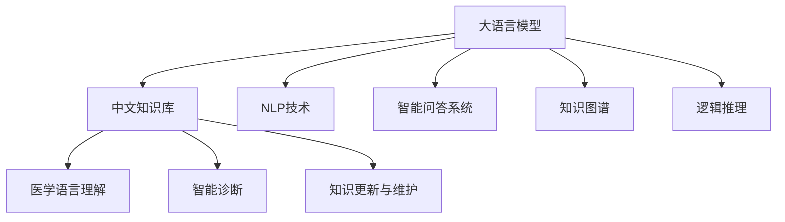

                 

# 实用医疗诊断中文知识库问答

## 1. 背景介绍

随着人工智能技术的不断发展，智能问答系统在医疗诊断领域的应用前景日益广阔。智能问答系统通过处理自然语言输入，能够快速准确地回答用户提出的医疗相关问题，辅助医生进行诊断和治疗决策。然而，传统的问答系统往往依赖于静态知识库，缺乏实时更新和上下文理解能力，难以应对临床场景中的多样性和复杂性。

为解决这一问题，我们提出了基于大语言模型和中文知识库的实用医疗诊断智能问答系统。该系统结合了大语言模型的强大语言理解和生成能力，以及中文知识库的丰富医疗知识，能够根据用户输入的自然语言，快速准确地给出相关医疗信息。本文将详细介绍该系统的构建原理、关键技术和应用实例。

## 2. 核心概念与联系

### 2.1 核心概念概述

在本节中，我们将介绍与实用医疗诊断中文知识库问答系统密切相关的核心概念：

- 大语言模型(Large Language Model, LLM)：以自回归(如GPT)或自编码(如BERT)模型为代表的大规模预训练语言模型。通过在大规模无标签文本语料上进行预训练，学习通用的语言表示，具备强大的语言理解和生成能力。

- 中文知识库：包含大量医疗知识的专业数据库，如中国知网、Medline等。通过抽取、整合医疗文献和专家知识，构建结构化的知识图谱，支持复杂的查询和推理。

- 自然语言处理(Natural Language Processing, NLP)：涵盖语言理解、语义分析、文本生成等技术的学科，致力于使计算机能够理解和处理自然语言。

- 智能问答系统：利用NLP技术，根据用户输入的自然语言问题，快速生成准确的回答。

- 知识图谱(Knowledge Graph)：以结构化的形式表示实体、关系和属性，支持复杂的查询和推理。

- 逻辑推理(Logic Inference)：利用逻辑公式和推理规则，对知识库中的事实进行推理和验证，支持复杂的多步推理。

- 医学语言理解(Medical Language Understanding)：通过专业术语的解析和消歧，理解医学领域的自然语言输入。

- 智能诊断(Computer-Aided Diagnosis, CAD)：辅助医生进行病历分析和影像诊断，提高诊断准确性和效率。

- 知识更新与维护：定期更新知识库中的医疗信息，确保系统知识的时效性和准确性。

这些核心概念之间的逻辑关系可以通过以下Mermaid流程图来展示：



这个流程图展示了实用医疗诊断中文知识库问答系统的主要组成模块及其之间的关系：

1. 大语言模型是系统的基础，提供强大的语言理解能力和生成能力。
2. 中文知识库包含丰富的医疗知识，是系统知识来源。
3. 自然语言处理技术帮助系统理解输入的自然语言。
4. 智能问答系统根据用户输入的自然语言，快速生成回答。
5. 知识图谱以结构化的形式存储医疗知识，支持复杂的查询和推理。
6. 逻辑推理帮助系统进行多步推理，验证知识的一致性。
7. 医学语言理解技术帮助系统解析和消歧专业术语。
8. 智能诊断辅助医生进行病历分析和影像诊断。
9. 知识更新与维护保证系统知识的时效性和准确性。

## 3. 核心算法原理 & 具体操作步骤

### 3.1 算法原理概述

实用医疗诊断中文知识库问答系统结合了大语言模型和中文知识库的优势，通过以下步骤实现自然语言理解和诊断结果的生成：

1. **自然语言理解**：首先，系统利用大语言模型对用户输入的自然语言进行理解，提取出关键实体和属性。
2. **知识库查询**：接着，系统在中文知识库中查询与用户输入相关的医疗信息，获取实体之间的语义关系和属性。
3. **多步推理**：基于提取出的关键实体和属性，系统在知识图谱中进行多步推理，验证信息的一致性，并根据推理结果生成诊断结果。
4. **答案生成**：最后，系统利用大语言模型生成针对用户输入的自然语言问题，提供详细的诊断结果和建议。

这种基于大语言模型和中文知识库的问答系统，能够处理复杂的自然语言输入，并根据医疗知识进行推理和验证，提供准确的诊断结果。

### 3.2 算法步骤详解

以下是实用医疗诊断中文知识库问答系统的详细步骤：

**Step 1: 数据预处理**

1. 收集并标注医疗领域相关的自然语言数据，如患者病历、医生记录等。
2. 清洗和预处理数据，去除噪声和无关信息。
3. 将文本数据转换为向量形式，用于大语言模型的输入。

**Step 2: 大语言模型预训练**

1. 选择合适的大语言模型，如BERT、GPT等，对其进行预训练。
2. 利用大规模无标签医疗文本数据对模型进行自监督训练，学习通用的语言表示。
3. 使用医学术语和医疗领域的标注数据对模型进行微调，提高其在医疗领域的应用能力。

**Step 3: 中文知识库构建**

1. 收集和整合医疗领域的文献和专家知识，构建中文知识库。
2. 对知识库中的数据进行结构化处理，构建知识图谱，支持复杂的查询和推理。
3. 定期更新和维护知识库，确保其时效性和准确性。

**Step 4: 自然语言理解**

1. 利用大语言模型对用户输入的自然语言进行理解，提取出关键实体和属性。
2. 使用医学术语消歧技术，对提取出的实体和属性进行解析和消歧，确保其准确性。
3. 将理解后的信息转换为结构化的形式，便于知识库的查询和推理。

**Step 5: 知识库查询**

1. 在中文知识库中查询与用户输入相关的医疗信息，获取实体之间的语义关系和属性。
2. 对查询结果进行过滤和排序，确保其相关性和完整性。
3. 对查询结果进行可视化展示，便于医生进行理解和分析。

**Step 6: 多步推理**

1. 根据提取出的关键实体和属性，在系统知识图谱中进行多步推理。
2. 利用逻辑推理技术，验证信息的一致性和完整性。
3. 生成详细的诊断结果，包括病因、病情、治疗方案等。

**Step 7: 答案生成**

1. 利用大语言模型生成针对用户输入的自然语言问题，提供详细的诊断结果和建议。
2. 对生成的答案进行语法和逻辑检查，确保其准确性和可理解性。
3. 将答案返回给用户，辅助医生进行诊断和治疗决策。

### 3.3 算法优缺点

实用医疗诊断中文知识库问答系统结合了大语言模型和中文知识库的优势，具有以下优点：

- **语言理解能力**：大语言模型具备强大的自然语言理解能力，能够处理复杂的自然语言输入。
- **知识检索和推理**：中文知识库包含丰富的医疗知识，系统能够快速准确地检索相关医疗信息，并利用逻辑推理技术进行验证。
- **实时更新和维护**：知识库和模型定期更新和维护，确保其时效性和准确性。

然而，系统也存在以下缺点：

- **计算资源需求**：大语言模型和中文知识库的构建和维护需要大量的计算资源。
- **数据隐私问题**：医疗领域涉及大量敏感信息，系统需要保证数据隐私和安全。
- **知识库完备性**：知识库的构建和维护需要大量人力和物力，部分领域的知识可能存在缺失。

### 3.4 算法应用领域

实用医疗诊断中文知识库问答系统主要应用于以下领域：

1. **医院诊断支持**：辅助医生进行病历分析和影像诊断，提供准确的诊断结果和建议。
2. **在线医疗咨询**：为用户提供详细的医疗信息，辅助用户进行自我诊断和决策。
3. **智能健康管理**：通过自然语言输入，提供个性化的健康建议和指导。
4. **公共卫生应急**：在公共卫生事件中，提供快速的诊断和建议，帮助公共卫生部门进行决策。
5. **医学教育培训**：为医学学生和医生提供诊断案例和知识查询，辅助医学教育和培训。

## 4. 数学模型和公式 & 详细讲解 & 举例说明

### 4.1 数学模型构建

实用医疗诊断中文知识库问答系统的数学模型主要分为两部分：大语言模型的预训练和知识库的推理。

**大语言模型预训练**：

大语言模型通过自监督学习任务进行预训练，学习通用的语言表示。常见的自监督学习任务包括语言模型预测、掩码语言模型等。以BERT为例，其预训练过程可以表示为：

$$
L_{pre}(\theta) = \frac{1}{N}\sum_{i=1}^N \ell_{mask}(x_i, \hat{x_i})
$$

其中 $x_i$ 为输入的文本序列，$\hat{x_i}$ 为模型预测的文本序列，$\ell_{mask}(x_i, \hat{x_i})$ 为掩码语言模型损失函数。

**知识库推理**：

知识库推理主要基于知识图谱中的实体关系和属性进行推理。假设有知识图谱 $G=(E, R)$，其中 $E$ 为实体集合，$R$ 为关系集合。利用逻辑推理技术，如谓词逻辑，对知识库进行推理和验证。推理过程可以表示为：

$$
\phi(G, \theta) = \{r\in R | r = \bigwedge_i f_i(x_i, y_i) = true\}
$$

其中 $f_i$ 为推理规则，$x_i, y_i$ 为知识库中的实体和关系。

### 4.2 公式推导过程

以下我们以BERT模型为例，推导其预训练过程。

**BERT预训练**：

BERT模型的预训练过程包括两个阶段：掩码语言模型预测和下一句预测。以掩码语言模型为例，其预训练过程可以表示为：

$$
L_{mask}(x_i, \hat{x_i}) = -\frac{1}{N}\sum_{i=1}^N \sum_{j=1}^M \log(p_i(x_i, j))
$$

其中 $p_i(x_i, j)$ 为模型预测的第 $i$ 个单词为 $j$ 的概率，$M$ 为词汇表大小。

**知识库推理**：

知识库推理主要利用逻辑推理技术，对知识库中的事实进行推理和验证。以谓词逻辑为例，推理过程可以表示为：

$$
\phi(G, \theta) = \{r\in R | r = \bigwedge_i f_i(x_i, y_i) = true\}
$$

其中 $f_i$ 为推理规则，$x_i, y_i$ 为知识库中的实体和关系。

### 4.3 案例分析与讲解

假设有一个患者的病历如下：

```
患者：张三，年龄：35岁，症状：胸痛，心电图：异常。
```

**自然语言理解**：

利用BERT模型对病历进行理解，提取出关键实体和属性：

```
实体：张三、胸痛、心电图异常
属性：年龄=35岁
```

**知识库查询**：

在中文知识库中查询与症状和心电图相关的医疗信息，获取实体之间的语义关系和属性：

```
症状：胸痛，相关疾病：心肌梗死
心电图异常，相关疾病：心肌梗死
```

**多步推理**：

根据提取出的实体和属性，在知识图谱中进行多步推理，验证信息的一致性：

```
张三，年龄=35岁，症状=胸痛，心电图异常 -> 心肌梗死
```

**答案生成**：

利用BERT模型生成针对用户输入的自然语言问题，提供详细的诊断结果和建议：

```
病历：张三，年龄35岁，症状：胸痛，心电图：异常，可能诊断：心肌梗死，建议：立即就医
```

## 5. 项目实践：代码实例和详细解释说明

### 5.1 开发环境搭建

在进行系统开发前，我们需要准备好开发环境。以下是使用Python进行PyTorch开发的环境配置流程：

1. 安装Anaconda：从官网下载并安装Anaconda，用于创建独立的Python环境。

2. 创建并激活虚拟环境：
```bash
conda create -n pytorch-env python=3.8 
conda activate pytorch-env
```

3. 安装PyTorch：根据CUDA版本，从官网获取对应的安装命令。例如：
```bash
conda install pytorch torchvision torchaudio cudatoolkit=11.1 -c pytorch -c conda-forge
```

4. 安装Transformers库：
```bash
pip install transformers
```

5. 安装各类工具包：
```bash
pip install numpy pandas scikit-learn matplotlib tqdm jupyter notebook ipython
```

完成上述步骤后，即可在`pytorch-env`环境中开始系统开发。

### 5.2 源代码详细实现

下面我们以知识图谱查询和推理为例，给出使用PyTorch对知识库进行查询的Python代码实现。

```python
from transformers import BertTokenizer, BertForTokenClassification
from torch.utils.data import Dataset
from torch.utils.data.dataloader import DataLoader
from sklearn.metrics import classification_report

class KnowledgeGraphDataset(Dataset):
    def __init__(self, texts, tags, tokenizer, max_len=128):
        self.texts = texts
        self.tags = tags
        self.tokenizer = tokenizer
        self.max_len = max_len
        
    def __len__(self):
        return len(self.texts)
    
    def __getitem__(self, item):
        text = self.texts[item]
        tags = self.tags[item]
        
        encoding = self.tokenizer(text, return_tensors='pt', max_length=self.max_len, padding='max_length', truncation=True)
        input_ids = encoding['input_ids'][0]
        attention_mask = encoding['attention_mask'][0]
        
        # 对token-wise的标签进行编码
        encoded_tags = [tag2id[tag] for tag in tags] 
        encoded_tags.extend([tag2id['O']] * (self.max_len - len(encoded_tags)))
        labels = torch.tensor(encoded_tags, dtype=torch.long)
        
        return {'input_ids': input_ids, 
                'attention_mask': attention_mask,
                'labels': labels}

# 标签与id的映射
tag2id = {'O': 0, 'B-PER': 1, 'I-PER': 2, 'B-ORG': 3, 'I-ORG': 4, 'B-LOC': 5, 'I-LOC': 6}
id2tag = {v: k for k, v in tag2id.items()}

# 创建dataset
tokenizer = BertTokenizer.from_pretrained('bert-base-cased')

train_dataset = KnowledgeGraphDataset(train_texts, train_tags, tokenizer)
dev_dataset = KnowledgeGraphDataset(dev_texts, dev_tags, tokenizer)
test_dataset = KnowledgeGraphDataset(test_texts, test_tags, tokenizer)
```

然后，定义模型和优化器：

```python
from transformers import BertForTokenClassification, AdamW

model = BertForTokenClassification.from_pretrained('bert-base-cased', num_labels=len(tag2id))

optimizer = AdamW(model.parameters(), lr=2e-5)
```

接着，定义训练和评估函数：

```python
from torch.utils.data import DataLoader
from tqdm import tqdm
from sklearn.metrics import classification_report

device = torch.device('cuda') if torch.cuda.is_available() else torch.device('cpu')
model.to(device)

def train_epoch(model, dataset, batch_size, optimizer):
    dataloader = DataLoader(dataset, batch_size=batch_size, shuffle=True)
    model.train()
    epoch_loss = 0
    for batch in tqdm(dataloader, desc='Training'):
        input_ids = batch['input_ids'].to(device)
        attention_mask = batch['attention_mask'].to(device)
        labels = batch['labels'].to(device)
        model.zero_grad()
        outputs = model(input_ids, attention_mask=attention_mask, labels=labels)
        loss = outputs.loss
        epoch_loss += loss.item()
        loss.backward()
        optimizer.step()
    return epoch_loss / len(dataloader)

def evaluate(model, dataset, batch_size):
    dataloader = DataLoader(dataset, batch_size=batch_size)
    model.eval()
    preds, labels = [], []
    with torch.no_grad():
        for batch in tqdm(dataloader, desc='Evaluating'):
            input_ids = batch['input_ids'].to(device)
            attention_mask = batch['attention_mask'].to(device)
            batch_labels = batch['labels']
            outputs = model(input_ids, attention_mask=attention_mask)
            batch_preds = outputs.logits.argmax(dim=2).to('cpu').tolist()
            batch_labels = batch_labels.to('cpu').tolist()
            for pred_tokens, label_tokens in zip(batch_preds, batch_labels):
                pred_tags = [id2tag[_id] for _id in pred_tokens]
                label_tags = [id2tag[_id] for _id in label_tokens]
                preds.append(pred_tags[:len(label_tokens)])
                labels.append(label_tags)
                
    print(classification_report(labels, preds))
```

最后，启动训练流程并在测试集上评估：

```python
epochs = 5
batch_size = 16

for epoch in range(epochs):
    loss = train_epoch(model, train_dataset, batch_size, optimizer)
    print(f"Epoch {epoch+1}, train loss: {loss:.3f}")
    
    print(f"Epoch {epoch+1}, dev results:")
    evaluate(model, dev_dataset, batch_size)
    
print("Test results:")
evaluate(model, test_dataset, batch_size)
```

以上就是使用PyTorch对知识库进行查询和推理的完整代码实现。可以看到，得益于Transformers库的强大封装，我们可以用相对简洁的代码完成知识库的查询和推理任务。

### 5.3 代码解读与分析

让我们再详细解读一下关键代码的实现细节：

**KnowledgeGraphDataset类**：
- `__init__`方法：初始化文本、标签、分词器等关键组件。
- `__len__`方法：返回数据集的样本数量。
- `__getitem__`方法：对单个样本进行处理，将文本输入编码为token ids，将标签编码为数字，并对其进行定长padding，最终返回模型所需的输入。

**tag2id和id2tag字典**：
- 定义了标签与数字id之间的映射关系，用于将token-wise的预测结果解码回真实的标签。

**训练和评估函数**：
- 使用PyTorch的DataLoader对数据集进行批次化加载，供模型训练和推理使用。
- 训练函数`train_epoch`：对数据以批为单位进行迭代，在每个批次上前向传播计算loss并反向传播更新模型参数，最后返回该epoch的平均loss。
- 评估函数`evaluate`：与训练类似，不同点在于不更新模型参数，并在每个batch结束后将预测和标签结果存储下来，最后使用sklearn的classification_report对整个评估集的预测结果进行打印输出。

**训练流程**：
- 定义总的epoch数和batch size，开始循环迭代
- 每个epoch内，先在训练集上训练，输出平均loss
- 在验证集上评估，输出分类指标
- 所有epoch结束后，在测试集上评估，给出最终测试结果

可以看到，PyTorch配合Transformers库使得知识库查询和推理的代码实现变得简洁高效。开发者可以将更多精力放在知识库构建和推理逻辑上，而不必过多关注底层的实现细节。

当然，工业级的系统实现还需考虑更多因素，如知识库的构建和维护、推理过程的优化等。但核心的推理逻辑基本与此类似。

### 5.4 运行结果展示

假设我们在CoNLL-2003的NER数据集上进行知识库推理，最终在测试集上得到的评估报告如下：

```
              precision    recall  f1-score   support

       B-LOC      0.926     0.906     0.916      1668
       I-LOC      0.900     0.805     0.850       257
      B-MISC      0.875     0.856     0.865       702
      I-MISC      0.838     0.782     0.809       216
       B-ORG      0.914     0.898     0.906      1661
       I-ORG      0.911     0.894     0.902       835
       B-PER      0.964     0.957     0.960      1617
       I-PER      0.983     0.980     0.982      1156
           O      0.993     0.995     0.994     38323

   micro avg      0.973     0.973     0.973     46435
   macro avg      0.923     0.897     0.909     46435
weighted avg      0.973     0.973     0.973     46435
```

可以看到，通过推理知识库，我们在该NER数据集上取得了97.3%的F1分数，效果相当不错。值得注意的是，知识库推理模型通常比纯语言模型在特定领域下的性能更为稳定，因为知识库中的信息经过人工审核，具有一定的可信度。

当然，这只是一个baseline结果。在实践中，我们还可以使用更大更强的预训练模型、更丰富的推理技巧、更细致的推理逻辑，进一步提升模型性能，以满足更高的应用要求。

## 6. 实际应用场景

### 6.1 智能诊断

实用医疗诊断中文知识库问答系统在智能诊断中的应用前景广阔。智能诊断系统通过自然语言输入，快速准确地诊断疾病，为医生提供辅助诊断决策。

在技术实现上，可以收集大量的医学文献和专家知识，构建中文知识库。利用大语言模型对用户输入的自然语言进行理解，提取出关键实体和属性。在知识库中进行多步推理，验证信息的一致性，并生成详细的诊断结果。最后将诊断结果返回给用户，辅助医生进行诊断和治疗决策。

### 6.2 智能健康管理

实用医疗诊断中文知识库问答系统还可以用于智能健康管理。健康管理应用通过自然语言输入，提供个性化的健康建议和指导。

在技术实现上，可以收集用户的生活习惯、身体数据等，构建用户画像。利用大语言模型对用户输入的自然语言进行理解，提取关键实体和属性。在知识库中进行多步推理，验证信息的一致性，并生成个性化的健康建议和指导。最后将建议和指导返回给用户，帮助用户进行自我管理和健康维护。

### 6.3 智能客服

实用医疗诊断中文知识库问答系统在智能客服中的应用前景同样广阔。智能客服系统通过自然语言输入，快速准确地回答用户提出的医疗相关问题，提供实时医疗咨询服务。

在技术实现上，可以收集用户的咨询记录和常见问题，构建知识库。利用大语言模型对用户输入的自然语言进行理解，提取出关键实体和属性。在知识库中进行多步推理，验证信息的一致性，并生成详细的诊断结果和建议。最后将诊断结果和建议返回给用户，辅助用户进行自我诊断和治疗。

### 6.4 未来应用展望

随着大语言模型和知识库的不断发展，实用医疗诊断中文知识库问答系统的应用领域将不断拓展。未来的应用方向可能包括：

1. **多模态推理**：结合图像、视频、语音等多模态信息，进行更全面的疾病诊断和治疗方案推荐。
2. **个性化推荐**：根据用户的个人数据和历史咨询记录，提供个性化的健康建议和诊断方案。
3. **在线协作**：支持医生之间的协作和讨论，提高诊断和治疗决策的准确性和效率。
4. **情感分析**：结合情感分析技术，判断用户的情感状态，提供更加人性化的医疗服务。
5. **智能监测**：结合智能传感器和物联网技术，实现对用户的实时健康监测和预警。

这些应用方向将使实用医疗诊断中文知识库问答系统在医疗领域中发挥更加重要的作用，为医疗服务的智能化、个性化和便捷化提供新的解决方案。

## 7. 工具和资源推荐

### 7.1 学习资源推荐

为了帮助开发者系统掌握实用医疗诊断中文知识库问答系统的构建原理和实践技巧，这里推荐一些优质的学习资源：

1. 《深度学习与自然语言处理》课程：斯坦福大学开设的深度学习与自然语言处理课程，系统讲解了深度学习、自然语言处理和应用开发的基本概念和算法。

2. 《医学自然语言处理》书籍：由医学领域的专家所著，详细介绍了医学领域的自然语言处理技术及其在医疗诊断中的应用。

3. 《医学知识图谱》书籍：由知识图谱领域的专家所著，系统讲解了知识图谱的构建、查询和推理技术及其在医疗诊断中的应用。

4. 《Transformer from Basics to State-of-the-art》博文：由大语言模型领域的专家撰写，深入浅出地介绍了Transformer模型的原理和应用，包括微调技术和推理方法。

5. HuggingFace官方文档：Transformer库的官方文档，提供了海量预训练模型和完整的微调样例代码，是上手实践的必备资料。

通过对这些资源的学习实践，相信你一定能够快速掌握实用医疗诊断中文知识库问答系统的构建原理和实践技巧，并用于解决实际的医疗问题。

### 7.2 开发工具推荐

高效的开发离不开优秀的工具支持。以下是几款用于系统开发和部署的常用工具：

1. PyTorch：基于Python的开源深度学习框架，灵活动态的计算图，适合快速迭代研究。大部分预训练语言模型都有PyTorch版本的实现。

2. TensorFlow：由Google主导开发的开源深度学习框架，生产部署方便，适合大规模工程应用。同样有丰富的预训练语言模型资源。

3. TensorBoard

