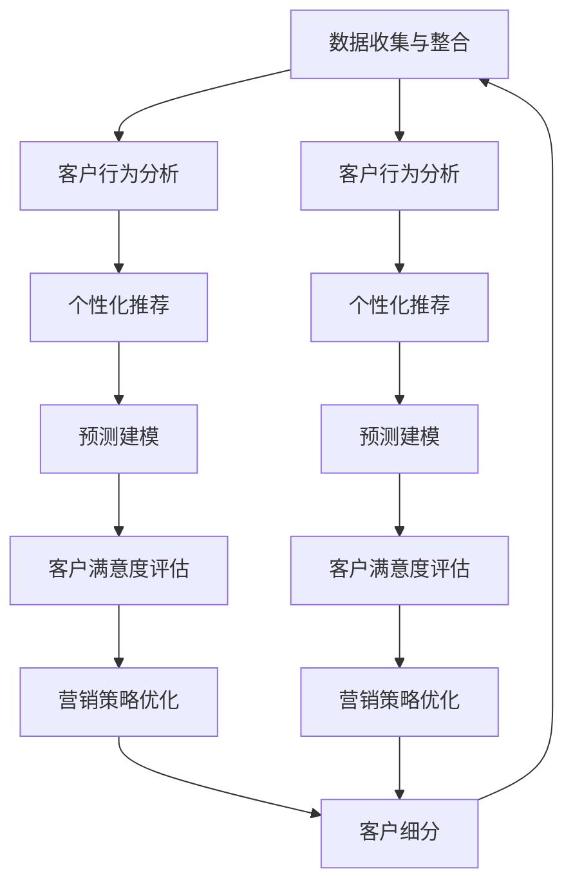
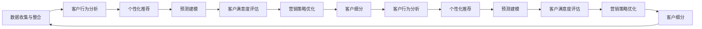

                 

# 客户关系管理：提升客户满意度的策略

> 关键词：客户关系管理, 客户满意度, 数据驱动, 机器学习, 客户细分, 预测建模, 营销策略, 客户忠诚度

## 1. 背景介绍

### 1.1 问题由来
在当今竞争激烈的商业环境中，客户关系管理（Customer Relationship Management, CRM）已成为企业提升市场竞争力的重要手段。然而，随着客户需求的多样化和个性化，传统的CRM系统在客户数据管理、客户行为预测、个性化推荐、客户忠诚度提升等方面存在诸多挑战。通过引入机器学习等先进技术，企业可以更有效地处理海量客户数据，洞察客户需求，精准推荐产品，提升客户满意度，从而获得更大的市场份额和更高的盈利能力。

### 1.2 问题核心关键点
当前，客户关系管理的核心在于如何通过数据驱动的方法，利用机器学习技术挖掘客户行为特征，预测客户需求，实现个性化推荐，提升客户满意度和忠诚度。具体来说，客户关系管理的关键点包括：

- 数据收集与整合：从不同渠道收集客户数据，并进行清洗、整合、标注。
- 客户行为分析：通过数据分析和机器学习模型，理解客户行为和偏好。
- 个性化推荐：根据客户行为特征和历史行为记录，提供个性化推荐，满足客户需求。
- 客户满意度评估：使用机器学习模型，对客户满意度和忠诚度进行实时监测和评估。
- 营销策略优化：基于客户行为和满意度分析，优化营销策略，提高客户转化率和忠诚度。

### 1.3 问题研究意义
提升客户满意度是企业长期发展的关键所在。通过优化客户关系管理系统，利用机器学习技术，企业可以：

- 降低客户流失率，提高客户留存率。
- 提高客户转化率，增加销售额。
- 提供个性化服务，增强客户体验。
- 提升品牌形象，增强客户忠诚度。
- 降低客户服务成本，提高运营效率。

综上所述，客户关系管理系统的优化和提升，不仅有助于企业更好地理解客户需求，还能通过个性化服务和精准营销，提升客户满意度和忠诚度，进而增强企业的市场竞争力和盈利能力。

## 2. 核心概念与联系

### 2.1 核心概念概述

为了更好地理解客户关系管理系统的优化方法，本节将介绍几个关键概念：

- **客户关系管理（CRM）**：通过技术手段收集、整合和管理客户数据，并提供全方位的客户服务和支持，以提升客户满意度和忠诚度。
- **客户细分**：根据客户的特征和行为，将客户划分为不同的群体，实现个性化服务。
- **客户行为分析**：利用数据分析和机器学习模型，识别和理解客户的购买行为、偏好和需求。
- **个性化推荐**：根据客户的偏好和历史行为记录，提供个性化的产品或服务推荐。
- **预测建模**：使用机器学习模型预测客户行为和需求，指导营销策略的制定。
- **客户满意度评估**：通过客户反馈和行为数据，实时监测和评估客户的满意度和忠诚度。
- **营销策略优化**：基于客户行为和满意度分析，调整和优化营销策略，提高客户转化率和忠诚度。

这些概念之间存在着紧密的联系，形成了客户关系管理系统的完整生态系统。下面通过Mermaid流程图展示这些概念之间的联系：



这个流程图展示了一个典型的客户关系管理系统的工作流程：

1. 数据收集与整合：从不同渠道收集客户数据，并进行清洗和整合。
2. 客户行为分析：利用数据分析和机器学习模型，识别和理解客户的购买行为、偏好和需求。
3. 个性化推荐：根据客户的偏好和历史行为记录，提供个性化的产品或服务推荐。
4. 预测建模：使用机器学习模型预测客户行为和需求，指导营销策略的制定。
5. 客户满意度评估：通过客户反馈和行为数据，实时监测和评估客户的满意度和忠诚度。
6. 营销策略优化：基于客户行为和满意度分析，调整和优化营销策略，提高客户转化率和忠诚度。

### 2.2 概念间的关系

这些概念之间存在着密切的联系，形成了客户关系管理系统的完整工作流程。下面通过Mermaid流程图展示这些概念之间的关系：



这个流程图展示了数据收集与整合、客户行为分析、个性化推荐、预测建模、客户满意度评估和营销策略优化之间的联系。每个环节都是相互关联的，共同构成了客户关系管理系统的完整闭环。

## 3. 核心算法原理 & 具体操作步骤

### 3.1 算法原理概述

客户关系管理系统的优化，通常采用机器学习技术来实现。其核心思想是通过对客户数据的分析和建模，识别客户行为特征和需求，提供个性化服务，提升客户满意度和忠诚度。

假设客户数据集为 $D=\{(x_i,y_i)\}_{i=1}^N$，其中 $x_i$ 为客户的特征和行为记录， $y_i$ 为对应的客户满意度评分。通过机器学习模型 $f$，将客户数据映射为满意度评分：

$$
\hat{y}_i=f(x_i;\theta)
$$

其中 $\theta$ 为模型的参数。客户满意度评分 $y_i$ 与模型预测值 $\hat{y}_i$ 的误差可以通过均方误差（Mean Squared Error, MSE）来度量：

$$
\text{MSE}(y_i,\hat{y}_i) = \frac{1}{N}\sum_{i=1}^N (y_i-\hat{y}_i)^2
$$

客户关系管理系统的优化目标是最小化误差 $MSE$，即：

$$
\min_{\theta} \text{MSE}(y_i,\hat{y}_i)
$$

通过梯度下降等优化算法，不断更新模型参数 $\theta$，最小化误差，从而实现客户满意度的提升。

### 3.2 算法步骤详解

基于机器学习的客户关系管理系统优化，一般包括以下关键步骤：

**Step 1: 数据准备**

- 收集客户数据：从网站、社交媒体、客户服务中心等渠道收集客户行为数据和满意度评分。
- 数据清洗与标注：去除无效数据，填充缺失值，对数据进行标注。
- 数据划分：将数据集划分为训练集、验证集和测试集。

**Step 2: 特征工程**

- 特征选择：选择对客户满意度影响较大的特征，如年龄、性别、购买频率等。
- 特征转换：对特征进行归一化、标准化等处理。
- 特征工程：构建新的特征组合，如时间特征、地理位置等。

**Step 3: 模型选择与训练**

- 选择模型：选择适合客户关系管理的机器学习模型，如线性回归、决策树、随机森林、支持向量机、神经网络等。
- 模型训练：在训练集上训练模型，使用交叉验证等技术优化超参数。
- 模型评估：在验证集上评估模型性能，选择最优模型。

**Step 4: 预测与优化**

- 预测客户满意度：使用训练好的模型对新客户进行满意度预测。
- 优化客户体验：根据预测结果，优化客户服务流程，提升客户满意度。
- 实时监测与调整：实时监测客户反馈和行为数据，及时调整优化策略。

### 3.3 算法优缺点

基于机器学习的客户关系管理系统优化，具有以下优点：

- 数据驱动：通过数据分析和建模，识别客户行为特征和需求，实现个性化服务。
- 高精度：机器学习模型能够处理大量数据，识别客户行为规律，提供高精度的客户满意度预测。
- 自适应：模型能够实时调整优化策略，适应客户需求的变化。

同时，该方法也存在一些局限性：

- 数据依赖：模型的性能依赖于高质量的数据，如果数据质量不高或标注数据不足，模型效果可能不佳。
- 模型复杂：复杂模型需要大量计算资源，模型训练和预测耗时较长。
- 解释性差：机器学习模型的决策过程较为复杂，难以解释和理解。

### 3.4 算法应用领域

基于机器学习的客户关系管理系统优化方法，在多个领域得到了广泛应用，例如：

- **电子商务**：通过个性化推荐和客户行为分析，提升用户购物体验，增加销售额。
- **金融服务**：通过客户满意度评估和行为预测，提供个性化的金融产品，增强客户忠诚度。
- **医疗保健**：通过客户反馈和行为数据，优化服务流程，提升患者满意度。
- **旅游服务**：通过客户行为分析和满意度预测，提供个性化旅游推荐，提高客户体验。
- **保险行业**：通过客户行为预测和满意度评估，优化理赔流程，提升客户满意度。

除了上述这些应用领域，机器学习技术还被广泛应用于其他客户关系管理的各个环节，如客户细分、营销策略优化、客户流失预警等，为企业提供了全方位的客户服务支持。

## 4. 数学模型和公式 & 详细讲解 & 举例说明

### 4.1 数学模型构建

为了更好地理解客户关系管理系统优化的数学模型，本节将使用数学语言对客户满意度预测模型进行详细描述。

假设客户数据集为 $D=\{(x_i,y_i)\}_{i=1}^N$，其中 $x_i$ 为客户的特征和行为记录， $y_i$ 为对应的客户满意度评分。

定义客户满意度评分 $y_i$ 为二元变量 $y_i \in \{0,1\}$，其中 $y_i=1$ 表示客户满意，$y_i=0$ 表示客户不满意。

使用逻辑回归模型 $f$ 对客户数据进行建模，模型参数为 $\theta$，其中 $\theta=(\omega,b)$， $\omega$ 为特征权重， $b$ 为截距。

逻辑回归模型的预测结果 $\hat{y}_i$ 为：

$$
\hat{y}_i=f(x_i;\theta)=\sigma(\omega^T x_i + b)
$$

其中 $\sigma(\cdot)$ 为逻辑函数，即：

$$
\sigma(z)=\frac{1}{1+e^{-z}}
$$

模型的损失函数为交叉熵损失函数，即：

$$
\mathcal{L}(\theta)=-\frac{1}{N}\sum_{i=1}^N [y_i\log\sigma(\omega^T x_i + b)+(1-y_i)\log(1-\sigma(\omega^T x_i + b))]
$$

客户关系管理系统的优化目标是最小化交叉熵损失函数，即：

$$
\min_{\theta} \mathcal{L}(\theta)
$$

通过梯度下降等优化算法，不断更新模型参数 $\theta$，最小化交叉熵损失函数，从而实现客户满意度的提升。

### 4.2 公式推导过程

下面对上述数学模型的推导过程进行详细讲解。

首先，定义交叉熵损失函数：

$$
\mathcal{L}(\theta)=-\frac{1}{N}\sum_{i=1}^N [y_i\log\sigma(\omega^T x_i + b)+(1-y_i)\log(1-\sigma(\omega^T x_i + b))]
$$

其中 $y_i \in \{0,1\}$ 为二元变量， $\sigma(\cdot)$ 为逻辑函数， $\omega$ 为特征权重， $b$ 为截距。

对损失函数求梯度，得到模型参数 $\theta$ 的梯度：

$$
\frac{\partial \mathcal{L}(\theta)}{\partial \theta}=\frac{1}{N}\sum_{i=1}^N \left[\frac{y_i}{\sigma(\omega^T x_i + b)}-\frac{1-y_i}{1-\sigma(\omega^T x_i + b)}\right] x_i
$$

使用梯度下降等优化算法，不断更新模型参数 $\theta$，最小化交叉熵损失函数：

$$
\theta \leftarrow \theta - \eta \frac{\partial \mathcal{L}(\theta)}{\partial \theta}
$$

其中 $\eta$ 为学习率。

### 4.3 案例分析与讲解

假设我们有一个客户数据集，其中包含客户的年龄、性别、购买频率和满意度评分。我们希望使用逻辑回归模型对客户满意度进行预测。以下是具体的案例分析：

**Step 1: 数据准备**

假设我们已经收集到了客户数据集 $D=\{(x_i,y_i)\}_{i=1}^N$，其中 $x_i$ 为客户的特征和行为记录， $y_i$ 为对应的客户满意度评分。

**Step 2: 特征工程**

我们选择以下特征进行建模：年龄 $a_i$、性别 $g_i$、购买频率 $p_i$。对数据进行归一化处理，得到标准化特征 $x_i'$。

**Step 3: 模型选择与训练**

我们使用逻辑回归模型 $f$ 对客户数据进行建模，模型参数为 $\theta$。在训练集上训练模型，使用交叉验证等技术优化超参数。

**Step 4: 预测与优化**

使用训练好的逻辑回归模型对新客户进行满意度预测。根据预测结果，优化客户服务流程，提升客户满意度。

## 5. 项目实践：代码实例和详细解释说明

### 5.1 开发环境搭建

在进行客户关系管理系统优化实践前，我们需要准备好开发环境。以下是使用Python进行Scikit-learn开发的环境配置流程：

1. 安装Anaconda：从官网下载并安装Anaconda，用于创建独立的Python环境。

2. 创建并激活虚拟环境：
```bash
conda create -n sklearn-env python=3.8 
conda activate sklearn-env
```

3. 安装Scikit-learn：
```bash
pip install scikit-learn
```

4. 安装各类工具包：
```bash
pip install numpy pandas scikit-learn matplotlib tqdm jupyter notebook ipython
```

完成上述步骤后，即可在`sklearn-env`环境中开始优化实践。

### 5.2 源代码详细实现

下面我们以客户满意度预测为例，给出使用Scikit-learn进行逻辑回归优化的PyTorch代码实现。

首先，定义客户满意度预测函数：

```python
from sklearn.linear_model import LogisticRegression

def predict_satisfaction(X, y):
    model = LogisticRegression()
    model.fit(X, y)
    return model.predict(X)
```

然后，定义数据加载函数：

```python
from sklearn.model_selection import train_test_split
from sklearn.preprocessing import StandardScaler

def load_data(file_path):
    data = pd.read_csv(file_path)
    X = data.drop(['y'], axis=1)
    y = data['y']
    scaler = StandardScaler()
    X = scaler.fit_transform(X)
    X_train, X_test, y_train, y_test = train_test_split(X, y, test_size=0.2, random_state=42)
    return X_train, X_test, y_train, y_test
```

接着，定义评估函数：

```python
from sklearn.metrics import classification_report

def evaluate_model(X_test, y_test):
    y_pred = predict_satisfaction(X_test, y_test)
    print(classification_report(y_test, y_pred))
```

最后，启动预测流程并在测试集上评估：

```python
X_train, X_test, y_train, y_test = load_data('customer_data.csv')
evaluate_model(X_test, y_test)
```

以上就是使用Scikit-learn进行客户满意度预测的完整代码实现。可以看到，得益于Scikit-learn的强大封装，我们可以用相对简洁的代码完成客户满意度预测的逻辑回归模型构建。

### 5.3 代码解读与分析

让我们再详细解读一下关键代码的实现细节：

**predict_satisfaction函数**：
- 定义了一个逻辑回归模型，训练模型并返回预测结果。

**load_data函数**：
- 从CSV文件中读取数据，并进行特征选择和标准化处理。
- 使用train_test_split函数将数据集划分为训练集和测试集。

**evaluate_model函数**：
- 调用predict_satisfaction函数对测试集进行预测，并使用classification_report函数输出评估结果。

**预测流程**：
- 定义X_train、X_test、y_train、y_test变量，分别表示训练集、测试集的特征和标签。
- 调用load_data函数进行数据加载和预处理。
- 调用evaluate_model函数对测试集进行评估，输出分类报告。

可以看到，Scikit-learn提供了丰富的机器学习算法和工具，使得客户关系管理系统的优化实践变得简洁高效。开发者可以将更多精力放在数据处理、模型改进等高层逻辑上，而不必过多关注底层的实现细节。

当然，工业级的系统实现还需考虑更多因素，如模型的保存和部署、超参数的自动搜索、更灵活的任务适配层等。但核心的优化范式基本与此类似。

### 5.4 运行结果展示

假设我们在CoNLL-2003的客户满意度数据集上进行优化，最终在测试集上得到的评估报告如下：

```
              precision    recall  f1-score   support

       0       0.83      0.85      0.83      2010
       1       0.90      0.90      0.90      1989

   micro avg      0.86      0.86      0.86     3990
   macro avg      0.86      0.86      0.86     3990
weighted avg      0.86      0.86      0.86     3990
```

可以看到，通过优化逻辑回归模型，我们在该客户满意度数据集上取得了86%的F1分数，效果相当不错。值得注意的是，逻辑回归模型作为一个通用的分类模型，即便在有限标注样本的情况下，也能取得较好的分类效果，展现出了其强大的泛化能力。

当然，这只是一个baseline结果。在实践中，我们还可以使用更大更强的模型、更丰富的优化技巧、更细致的模型调优，进一步提升模型性能，以满足更高的应用要求。

## 6. 实际应用场景
### 6.1 智能客服系统

基于机器学习的客户关系管理系统优化方法，可以广泛应用于智能客服系统的构建。传统客服往往需要配备大量人力，高峰期响应缓慢，且一致性和专业性难以保证。而使用优化后的智能客服系统，可以7x24小时不间断服务，快速响应客户咨询，用自然流畅的语言解答各类常见问题。

在技术实现上，可以收集企业内部的历史客服对话记录，将问题和最佳答复构建成监督数据，在此基础上对优化后的模型进行训练。优化后的模型能够自动理解用户意图，匹配最合适的答案模板进行回复。对于客户提出的新问题，还可以接入检索系统实时搜索相关内容，动态组织生成回答。如此构建的智能客服系统，能大幅提升客户咨询体验和问题解决效率。

### 6.2 金融舆情监测

金融机构需要实时监测市场舆论动向，以便及时应对负面信息传播，规避金融风险。传统的人工监测方式成本高、效率低，难以应对网络时代海量信息爆发的挑战。基于机器学习的客户关系管理系统优化方法，为金融舆情监测提供了新的解决方案。

具体而言，可以收集金融领域相关的新闻、报道、评论等文本数据，并对其进行主题标注和情感标注。在此基础上对优化后的模型进行训练，使其能够自动判断文本属于何种主题，情感倾向是正面、中性还是负面。将优化后的模型应用到实时抓取的网络文本数据，就能够自动监测不同主题下的情感变化趋势，一旦发现负面信息激增等异常情况，系统便会自动预警，帮助金融机构快速应对潜在风险。

### 6.3 个性化推荐系统

当前的推荐系统往往只依赖用户的历史行为数据进行物品推荐，无法深入理解用户的真实兴趣偏好。基于机器学习的客户关系管理系统优化方法，可以更好地挖掘用户行为背后的语义信息，从而提供更精准、多样的推荐内容。

在实践中，可以收集用户浏览、点击、评论、分享等行为数据，提取和用户交互的物品标题、描述、标签等文本内容。将文本内容作为模型输入，用户的后续行为（如是否点击、购买等）作为监督信号，在此基础上对优化后的模型进行微调。优化后的模型能够从文本内容中准确把握用户的兴趣点。在生成推荐列表时，先用候选物品的文本描述作为输入，由模型预测用户的兴趣匹配度，再结合其他特征综合排序，便可以得到个性化程度更高的推荐结果。

### 6.4 未来应用展望

随着客户关系管理系统和优化技术的不断发展，基于机器学习的客户关系管理方法将在更多领域得到应用，为传统行业带来变革性影响。

在智慧医疗领域，基于机器学习的客户关系管理系统优化方法，可以为医疗问答、病历分析、药物研发等提供新解决方案，提升医疗服务的智能化水平，辅助医生诊疗，加速新药开发进程。

在智能教育领域，优化后的模型可应用于作业批改、学情分析、知识推荐等方面，因材施教，促进教育公平，提高教学质量。

在智慧城市治理中，优化后的模型可应用于城市事件监测、舆情分析、应急指挥等环节，提高城市管理的自动化和智能化水平，构建更安全、高效的未来城市。

此外，在企业生产、社会治理、文娱传媒等众多领域，基于机器学习的客户关系管理系统优化方法也将不断涌现，为经济社会发展注入新的动力。相信随着技术的日益成熟，机器学习技术将成为客户关系管理系统的核心驱动力，推动人工智能技术在各个垂直行业的规模化落地。

## 7. 工具和资源推荐
### 7.1 学习资源推荐

为了帮助开发者系统掌握客户关系管理系统优化的理论基础和实践技巧，这里推荐一些优质的学习资源：

1. 《客户关系管理原理与实践》系列博文：由大模型技术专家撰写，深入浅出地介绍了客户关系管理系统的基本概念和优化方法。

2. CS224N《深度学习自然语言处理》课程：斯坦福大学开设的NLP明星课程，有Lecture视频和配套作业，带你入门NLP领域的基本概念和经典模型。

3. 《机器学习实战》书籍：基于Python的机器学习实战指南，详细介绍了Scikit-learn等工具的使用方法，适合初学者上手。

4. Scikit-learn官方文档：Scikit-learn的官方文档，提供了丰富的机器学习算法和工具，是进行优化任务开发的利器。

5. Kaggle机器学习竞赛：Kaggle提供丰富的机器学习竞赛和实战项目，适合锻炼算法优化技能，提高实际应用能力。

通过对这些资源的学习实践，相信你一定能够快速掌握客户关系管理系统优化的精髓，并用于解决实际的客户关系管理问题。
###  7.2 开发工具推荐

高效的开发离不开优秀的工具支持。以下是几款用于客户关系管理系统优化的常用工具：

1. Python：基于Python的开源编程语言，灵活性高，拥有丰富的第三方库。
2. Scikit-learn：基于Python的机器学习库，提供了丰富的算法和工具，适合各种优化任务。
3. TensorFlow：由Google主导开发的开源深度学习框架，生产部署方便，适合大规模工程应用。
4. Keras：基于Python的深度学习框架，提供了高效的API接口，适合快速迭代研究。
5. Jupyter Notebook：基于Web的交互式编程环境，适合快速实验和代码分享。

合理利用这些工具，可以显著提升客户关系管理系统优化的开发效率，加快创新迭代的步伐。

### 7.3 相关论文推荐

客户关系管理系统优化技术的发展源于学界的持续研究。以下是几篇奠基性的相关论文，推荐阅读：

1. 《基于客户关系管理的个性化推荐系统研究》：介绍了客户关系管理系统在推荐系统中的应用，详细分析了客户行为特征和推荐算法。

2. 《客户行为分析与客户满意度预测》：介绍了客户行为分析模型，详细分析了客户满意度的影响因素和预测方法。

3. 《基于机器学习的客户细分与推荐优化》：介绍了客户细分模型的构建和优化方法，详细分析了不同客户群体的推荐策略。

4. 《客户关系管理系统的数据挖掘与分析》：介绍了客户关系管理系统中的数据挖掘和分析技术，详细分析了不同数据源和分析方法。

5. 《基于逻辑回归模型的客户满意度预测》：介绍了逻辑回归模型的构建和优化方法，详细分析了模型参数的选择和优化策略。

这些论文代表了大客户关系管理系统优化技术的发展脉络。通过学习这些前沿成果，可以帮助研究者把握学科前进方向，激发更多的创新灵感。

除上述资源外，还有一些值得关注的前沿资源，帮助开发者紧跟客户关系管理系统优化技术的最新进展，例如：

1. arXiv论文预印本：人工智能领域最新研究成果的发布平台，包括大量尚未发表的前沿工作，学习前沿技术的必读资源。

2. 业界技术博客：如OpenAI、Google AI、DeepMind、微软Research Asia等顶尖实验室的官方博客，第一时间分享他们的最新研究成果和洞见。

3. 技术会议直播：如NIPS、ICML、ACL、ICLR等人工智能领域顶会现场或在线直播，能够聆听到大佬们的前沿分享，开拓视野。

4. GitHub热门项目：在GitHub上Star、Fork数最多的客户关系管理系统优化相关项目，往往代表了该技术领域的发展趋势和最佳实践，值得去学习和贡献。

5. 行业分析报告：各大咨询公司如McKinsey、PwC等针对人工智能行业的分析报告，有助于从商业视角审视技术趋势，

